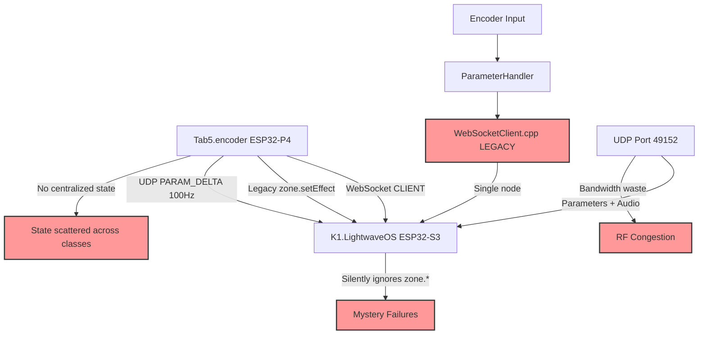
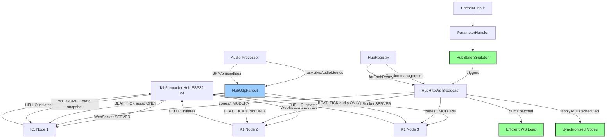
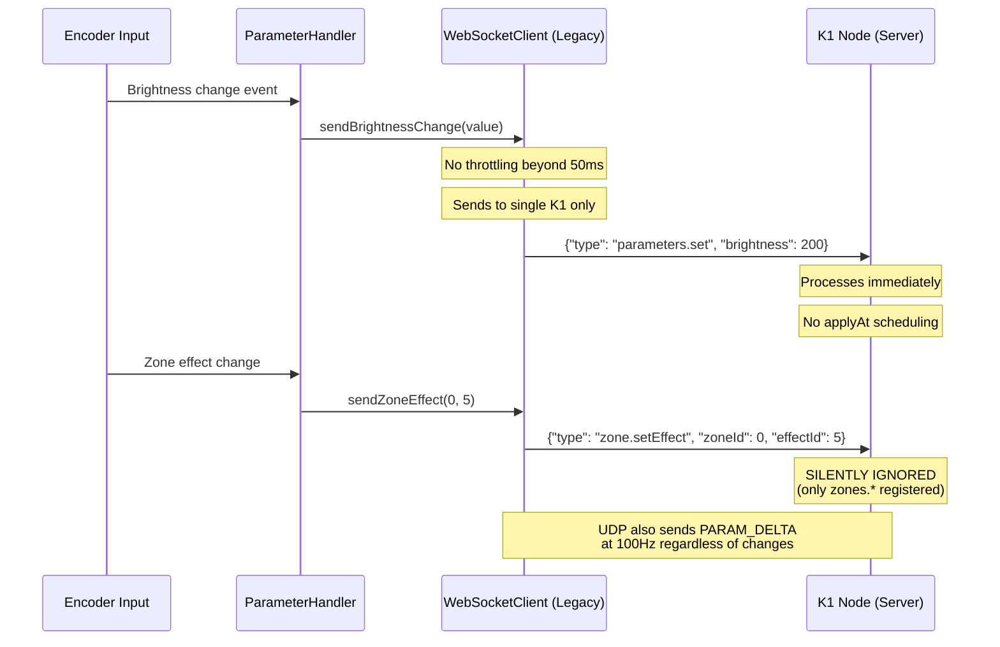
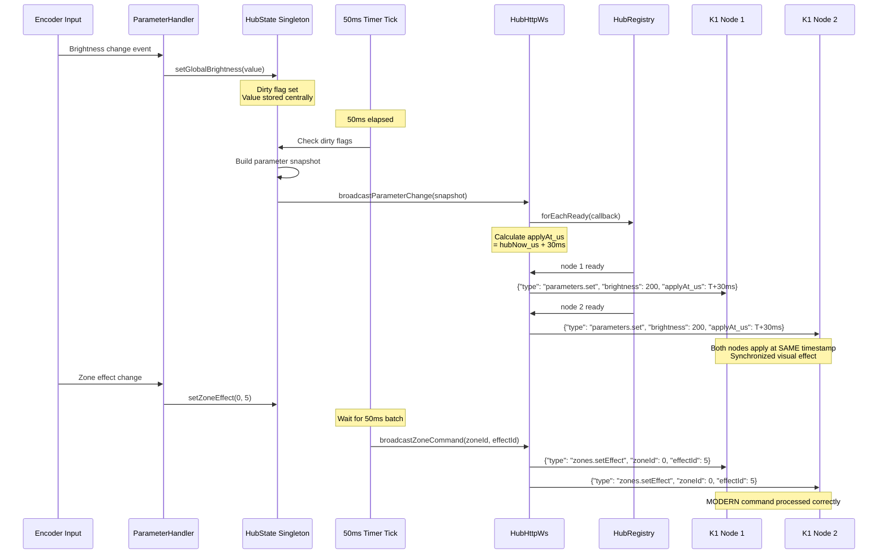
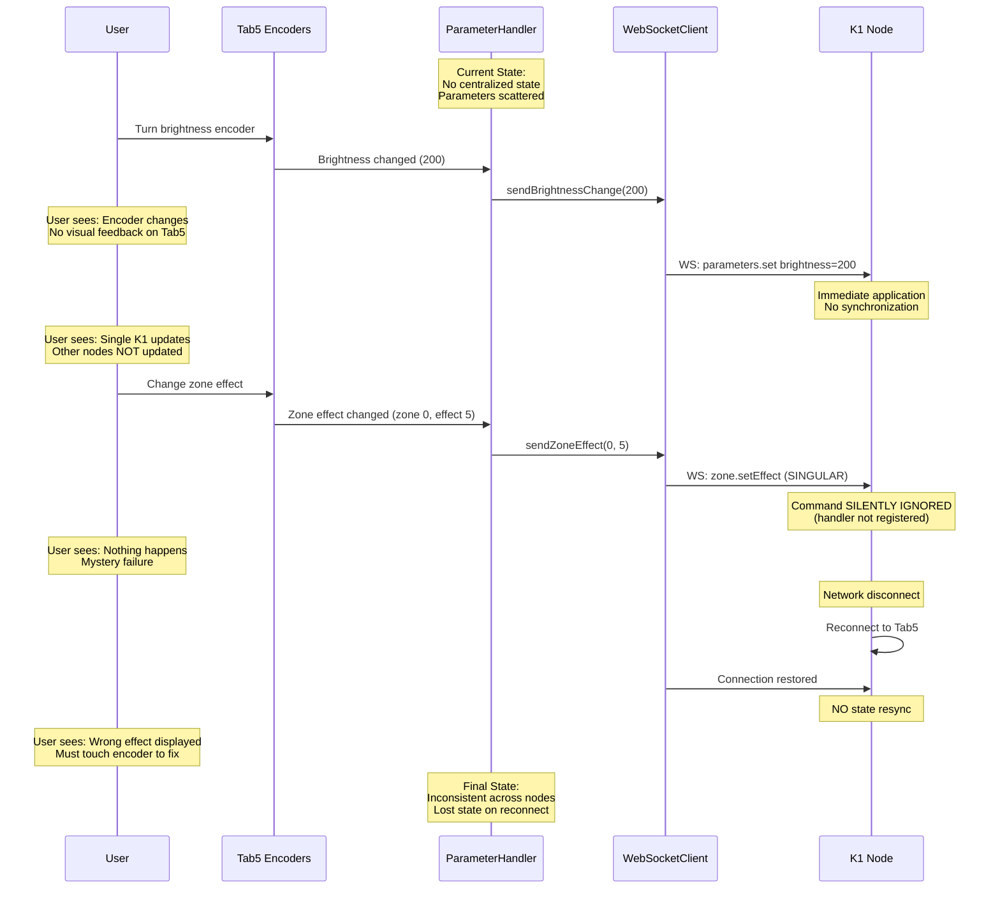
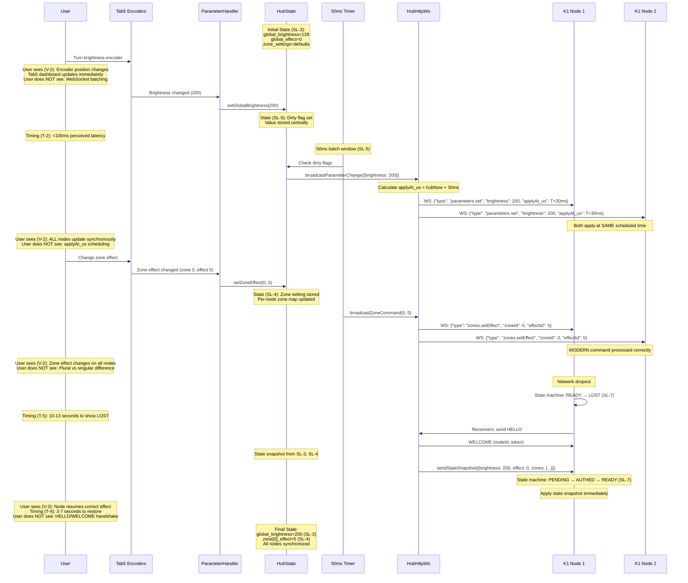

# Technical Implementation Blueprint: Tab5 Hub Protocol Refactor

> **Traceability Note:** This Blueprint extracts from PRD sections §1-§10. All tables include "Source: PRD §X" annotations. Section numbers (§1-§11) are referenced by the Task List.

## §1. Current vs Target Analysis

### §1.1 Current System Architecture (Legacy Client Mode)



### §1.2 Target System Architecture (Modern Hub Mode)



### §1.3 Current Data & Logic Flow (Legacy)



### §1.4 Target Data & Logic Flow (Modern Hub)



### §1.5 Current User Journey with Data & State Flow
*Source: PRD §6 (current state), §8 (current state)*



### §1.6 Target User Journey with Data & State Flow
*Source: PRD §6 (V-1, V-2, V-3, V-4, V-5, T-1, T-2, T-3, T-4), §8 (SL-1, SL-2, SL-3, SL-4, SL-5, SL-6, SL-7)*



### §1.7 Summary of Improvements
*Source: PRD §2 Problem Statement*

- **Protocol Correctness**: Eliminates silent failures from outdated zone.* singular commands; uses modern zones.* handlers that K1 nodes actually register
- **UDP Bandwidth Optimization**: Reduces wireless congestion by >90% when audio inactive; reserves UDP exclusively for time-critical BEAT_TICK audio metrics
- **Centralized State Management**: HubState singleton prevents "reconnected node displays wrong effect" bug; all nodes receive consistent parameter snapshots
- **Multi-Node Synchronization**: Scheduled applyAt_us timestamps eliminate per-node timing skew from Wi-Fi jitter; all nodes apply changes within same beat window
- **Architecture Clarity**: Clean separation between hub mode (HubState + HubHttpWs) and deprecated client mode (WebSocketClient removed); no coexistence confusion

---

## §2. System Boundaries
*Source: PRD §7 Artifact Ownership*

### §2.1 Artifact Ownership Enforcement
*Source: PRD §7.1 Creation Responsibility*

| PRD ID | Artifact | Created By | App's Role | Implementation Rule |
|--------|----------|------------|------------|---------------------|
| O-1 | Session token (64-char string) | Tab5 hub | CREATE via HubRegistry::generateToken() | Tab5 hub MUST create during WELCOME; nodes MUST NOT generate tokens |
| O-2 | Token hash (32-bit FNV-1a) | Tab5 hub | CREATE via lw_token_hash32() | Tab5 hub MUST hash token for UDP validation; nodes receive in WELCOME |
| O-3 | Node state machine transitions | Tab5 hub | CREATE via HubRegistry (registerNode, markReady, markLost) | Tab5 hub MUST control all PENDING→AUTHED→READY→LOST transitions; nodes MUST NOT self-transition |
| O-4 | WebSocket WELCOME message | Tab5 hub | CREATE with nodeId, token, udpPort, hubEpoch_us | Tab5 hub MUST send after HELLO validation; includes O-1 token and O-3 nodeId |
| O-5 | WebSocket command broadcasts | Tab5 hub | CREATE via HubHttpWs::broadcastEffectChange, broadcastParameterChange, broadcastZoneCommand | Tab5 hub MUST iterate forEachReady(); nodes RECEIVE and apply |
| O-6 | UDP BEAT_TICK packets | Tab5 hub | CREATE via HubUdpFanout::buildBeatPacket() | Tab5 hub MUST create only when audio active; nodes RECEIVE best-effort |
| O-7 | State snapshot after reconnect | Tab5 hub | CREATE via HubHttpWs::sendStateSnapshot() | Tab5 hub MUST send immediately after WELCOME; nodes apply to prevent stale state |

### §2.2 External System Behaviors
*Source: PRD §7.2 External System Dependencies*

| PRD ID | External System | Autonomous Actions | App's Response | Detection Method |
|--------|-----------------|-------------------|----------------|------------------|
| E-1 | K1 nodes | Send HELLO messages (MAC, firmware version, capabilities, topology) autonomously on boot/reconnect | Tab5 hub MUST validate and respond with WELCOME (O-4); assign nodeId (O-1) | WebSocket onWsEvent receives HELLO type; HubHttpWs::handleHello() processes |
| E-2 | K1 nodes | Send KEEPALIVE messages every LW_KEEPALIVE_PERIOD_MS (1000ms) with RSSI, packet loss, drift, uptime | Tab5 hub MUST update node metrics and reset timeout timer; mark DEGRADED if metrics bad | WebSocket receives KEEPALIVE type; HubHttpWs::handleKeepalive() updates HubRegistry |
| E-3 | K1 nodes | Send TS_PING messages (sequence, t1 timestamp) to dedicated UDP port 49154 for time synchronization | Tab5 hub MUST respond with TS_PONG (t1, t2, t3 timestamps) regardless of time sync lock status | Dedicated UDP socket on port 49154 receives ping; HubTsUdp::handlePing() responds |
| E-4 | K1 nodes | Send OTA_STATUS messages (state, progress percentage) during firmware update initiated by hub | Tab5 hub MUST track OTA progress per node; abort after LW_OTA_NODE_TIMEOUT_S (180s) if stalled | WebSocket receives OTA_STATUS type; HubOtaDispatch::handleStatus() tracks progress |
| E-5 | Audio processor (future) | Generate AudioMetrics (BPM, phase, energy, beat flags) autonomously when audio detected | Tab5 hub MUST query hasActiveAudioMetrics() before UDP send; use getLatestAudioMetrics() for packet | HubUdpFanout::tick() checks hasActiveAudioMetrics(); only sends UDP BEAT_TICK when true |

### §2.3 Boundary Rules
*Source: PRD §7.3 Derived Ownership Rules + PRD §9.3 Constraints*

**DO NOTs (14):**
- DO NOT-1: Do not accept tokens or token hashes from nodes (O-1, O-2).
- DO NOT-2: Do not assign `nodeId` before receiving HELLO (E-1).
- DO NOT-3: Do not allow nodes to self-transition hub-side state (O-3).
- DO NOT-4: Do not mark a node READY without a KEEPALIVE (E-2).
- DO NOT-5: Do not send UDP when audio is inactive (O-6, E-5, NFR-1).
- DO NOT-6: Do not send UDP parameter deltas (no `LW_UDP_PARAM_DELTA` after refactor) (FR-2, §5.2.4).
- DO NOT-7: Do not emit legacy `zone.*` commands (plural `zones.*` only) (FR-1, §5.1.1).
- DO NOT-8: Do not bypass HubState for parameter changes (HubState is the authority) (FR-4, §5.3.3).
- DO NOT-9: Do not compute `applyAt_us` independently per node (must be identical for the same batch) (FR-6, §5.6.5).
- DO NOT-10: Do not broadcast commands to nodes that are not READY (FR-7).
- DO NOT-11: Do not skip the post-WELCOME state snapshot (prevents stale state on reconnect) (FR-5, §5.4.2).
- DO NOT-12: Do not mix the time-sync UDP traffic (port 49154) into the 100Hz audio fanout stream (PRD §9.3 Time Sync).
- DO NOT-13: Do not modify `common/proto/` wire contracts without a protocol version bump (NFR-5).
- DO NOT-14: Do not introduce multicast complexity for the 1–5 node target fleet (FR-10, NFR-6).

**MUSTs (6):**
- MUST-1: Must schedule parameter/zone/effect broadcasts with `applyAt_us = hub_clock_now_us() + LW_APPLY_AHEAD_US` (FR-6).
- MUST-2: Must send a full state snapshot immediately after every HELLO→WELCOME (FR-5, §5.4.2).
- MUST-3: Must batch parameter broadcasts on a 50ms cadence (FR-3, §5.5).
- MUST-4: Must fan out broadcasts using `HubRegistry::forEachReady()` (FR-7).
- MUST-5: Must gate UDP BEAT_TICK fanout with `hasActiveAudioMetrics()` (FR-2, §5.2.3).
- MUST-6: Must keep all new documentation/comments in British English (NFR-7).

---

## §3. State Transition Specifications
*Source: PRD §8 State Requirements*

### §3.1 Transition: Node Initiates Session (HELLO → WELCOME)
*Source: PRD §8.2 SL-1 (Node session created), §8.2 SL-2 (Token created)*

**Trigger:** WebSocket receives HELLO message from K1 node (E-1)

**Pre-conditions (State Before):**
*Source: PRD §8.1 State Isolation, §8.2 Lifecycle*

| PRD ID | State Variable | Current Value | Required Action |
|--------|----------------|---------------|----------------|
| SL-1 | HubRegistry::nodes_[nodeId] | Does NOT exist | CREATE new node_entry_t |
| SL-7 | node_entry_t::state | N/A (no entry yet) | Will initialize to PENDING |
| SI-3 | Session isolation | No cross-node auth | ENFORCE unique nodeId per MAC |
| SL-2 | node_entry_t::token | Empty | CREATE 64-char random token |

**Post-conditions (State After):**
*Source: PRD §8.2 Lifecycle*

| PRD ID | State Variable | New Value | Set By |
|--------|----------------|-----------|--------|
| SL-1 | HubRegistry::nodes_[nodeId] | Valid node_entry_t | HubRegistry::registerNode() |
| SL-7 | node_entry_t::state | PENDING | registerNode() initializer |
| SL-2 | node_entry_t::token | Random 64-char string | HubRegistry::generateToken() |
| O-2 | node_entry_t::tokenHash | FNV-1a hash of token | lw_token_hash32(token) |
| O-4 | WELCOME message sent | Yes | HubHttpWs::sendWelcome() |
| O-7 | State snapshot sent | Yes | HubHttpWs::sendStateSnapshot() |

**Side Effects:**
- WELCOME message sent to node with nodeId, token, udpPort, hubEpoch_us (O-4)
- State snapshot sent immediately after WELCOME with current HubState parameters (O-7)
- Node can begin sending UDP packets authenticated with tokenHash (O-2)
- Dashboard event logged: "Node [nodeId] registered (MAC: [mac])"

### §3.2 Transition: Node Establishes Bidirectional Communication (KEEPALIVE → READY)
*Source: PRD §8.2 SL-7 (State machine PENDING→AUTHED→READY)*

**Trigger:** First KEEPALIVE message received after WELCOME (E-2)

**Pre-conditions (State Before):**

| PRD ID | State Variable | Current Value | Required Action |
|--------|----------------|---------------|----------------|
| SL-7 | node_entry_t::state | PENDING or AUTHED | VERIFY KEEPALIVE received |
| SL-1 | node_entry_t::lastSeen_ms | Stale or 0 | UPDATE with current time |
| E-2 | KEEPALIVE timing | Within LW_KEEPALIVE_TIMEOUT_MS | VERIFY not timed out |

**Post-conditions (State After):**

| PRD ID | State Variable | New Value | Set By |
|--------|----------------|-----------|--------|
| SL-7 | node_entry_t::state | READY | HubRegistry::markReady() |
| SL-1 | node_entry_t::lastSeen_ms | millis() | HubRegistry::updateKeepalive() |
| E-2 | node_entry_t metrics | RSSI, loss_pct, drift_us, uptime | updateKeepalive() from KEEPALIVE payload |
| O-5 | Eligible for broadcasts | Yes | forEachReady() now includes this node |

**Side Effects:**
- Node now receives all HubState broadcasts (effect/parameter/zone commands)
- UDP BEAT_TICK packets include this node in fanout (O-6)
- Dashboard shows node status as READY (V-1)
- Dashboard displays node metrics (RSSI, drift, uptime)

### §3.3 Transition: Parameter Change Accumulation (Encoder → HubState Dirty Flag)
*Source: PRD §8.2 SL-5 (Parameter dirty flags), §8.2 SL-3 (Global parameters)*

**Trigger:** Encoder input causes ParameterHandler::sendParameterChange() call

**Pre-conditions (State Before):**

| PRD ID | State Variable | Current Value | Required Action |
|--------|----------------|---------------|----------------|
| SL-3 | HubState::global_brightness | Previous value (e.g. 128) | UPDATE to new value |
| SL-5 | HubState::dirty_flags | Clean (false) | SET dirty flag for brightness |
| SI-1 | Global parameter scope | Applies to all nodes | MAINTAIN broadcast scope |

**Post-conditions (State After):**

| PRD ID | State Variable | New Value | Set By |
|--------|----------------|-----------|--------|
| SL-3 | HubState::global_brightness | New value (e.g. 200) | HubState::setGlobalBrightness() |
| SL-5 | HubState::dirty_flags | Dirty (true) for brightness | setGlobalBrightness() sets flag |
| SL-3 | HubState persistence | Runtime persistent | Never cleared until Tab5 reboot |

**Side Effects:**
- No immediate broadcast (waits for 50ms batch timer)
- Multiple rapid encoder changes accumulate in same batch window (NFR-2)
- Dashboard updates immediately to show new value locally (V-2)

### §3.4 Transition: Batch Broadcast (50ms Timer → WebSocket Broadcast)
*Source: PRD §8.2 SL-5 (Dirty flags cleared), §6.2 T-2 (Timing expectations)*

**Trigger:** 50ms batch timer tick fires

**Pre-conditions (State Before):**

| PRD ID | State Variable | Current Value | Required Action |
|--------|----------------|---------------|----------------|
| SL-5 | HubState::dirty_flags | One or more flags dirty | CHECK which parameters changed |
| SL-3 | HubState::global_* | Updated values | READ for broadcast |
| SL-4 | HubState::zone_settings | Updated values | READ for zone broadcast |
| O-5 | Nodes ready for broadcast | 1-5 nodes READY | ITERATE forEachReady() |

**Post-conditions (State After):**

| PRD ID | State Variable | New Value | Set By |
|--------|----------------|-----------|--------|
| SL-5 | HubState::dirty_flags | Clean (false) | Timer tick clears after broadcast |
| O-5 | Broadcast messages sent | 1-5 WS messages | HubHttpWs::broadcast*() methods |
| T-2 | Perceived latency | <100ms from encoder to visual | Measured by user (V-2) |
| NFR-4 | applyAt_us calculated | hubNow + 30ms | Scheduled for synchronization |

**Side Effects:**
- All READY nodes receive parameter updates via WebSocket (SI-1)
- Nodes schedule application at applyAt_us timestamp for synchronization
- No UDP sent (parameters use WS, not UDP per Q7/Q9)
- Next batch window begins immediately

### §3.5 Transition: Node Disconnection (Timeout → LOST → Cleanup)
*Source: PRD §8.2 SL-1 (Node session cleared), §8.2 SL-7 (READY→LOST)*

**Trigger:** LW_KEEPALIVE_TIMEOUT_MS (3500ms) elapses without KEEPALIVE (E-2)

**Pre-conditions (State Before):**

| PRD ID | State Variable | Current Value | Required Action |
|--------|----------------|---------------|----------------|
| SL-7 | node_entry_t::state | READY or DEGRADED | TRANSITION to LOST |
| SL-1 | node_entry_t::lastSeen_ms | Stale (>3500ms ago) | VERIFY timeout condition |
| E-2 | KEEPALIVE receipt | None received | CONFIRM timeout |

**Post-conditions (State After):**

| PRD ID | State Variable | New Value | Set By |
|--------|----------------|-----------|--------|
| SL-7 | node_entry_t::state | LOST | HubRegistry::markLost() |
| SL-1 | Cleanup timer started | LW_CLEANUP_TIMEOUT_MS (10s) | HubRegistry::tick() |
| O-5 | Excluded from broadcasts | No longer in forEachReady() | markLost() effect |
| T-5 | Dashboard shows LOST | After 10-13s total | User visible (V-5) |

**Side Effects:**
- After additional LW_CLEANUP_TIMEOUT_MS (10s), node_entry_t deleted from HubRegistry::nodes_ map (SL-1)
- Dashboard event logged: "Node [nodeId] lost (last seen [time])"
- No more broadcasts sent to this node until reconnection (O-5)
- Session token/tokenHash invalidated (SL-2)

### §3.6 Transition: Node Reconnection (HELLO after LOST → State Resync)
*Source: PRD §8.2 SL-1 (Session recreated), §8.2 SL-7 (LOST→PENDING→READY), O-7 (State snapshot)*

**Trigger:** K1 node sends HELLO after previous session marked LOST

**Pre-conditions (State Before):**

| PRD ID | State Variable | Current Value | Required Action |
|--------|----------------|---------------|----------------|
| SL-7 | Previous node_entry_t::state | LOST (or already cleaned up) | ALLOW re-registration |
| SL-3 | HubState::global_parameters | Current authoritative values | PREPARE snapshot |
| SL-4 | HubState::zone_settings | Current authoritative values | PREPARE snapshot |
| O-7 | State snapshot requirement | MANDATORY after WELCOME | ENFORCE §2.3 boundary rule |

**Post-conditions (State After):**

| PRD ID | State Variable | New Value | Set By |
|--------|----------------|-----------|--------|
| SL-1 | New node_entry_t | Created (may reuse nodeId if MAC matches) | HubRegistry::registerNode() |
| SL-7 | node_entry_t::state | PENDING | registerNode() initializer |
| SL-2 | node_entry_t::token | NEW 64-char random token | HubRegistry::generateToken() |
| O-7 | State snapshot sent | Yes | HubHttpWs::sendStateSnapshot() |
| V-3 | Node displays correct effect | Immediately upon snapshot application | User visible within 3-7s |

**Side Effects:**
- WELCOME sent with new session credentials (old token invalidated)
- State snapshot sent immediately: {global_parameters, zone_settings[]} from SL-3/SL-4
- Node applies snapshot preventing "wrong effect displayed" bug (§2 Problem Statement)
- Reconnection cycle tracked in dashboard metrics

---

## §4. Integration Wiring
*Derived from: PRD §7 (ownership), §8 (state), §6 (visibility)*

### §4.1 Parameter Change Broadcast Sequence
*Implements: PRD §7.1 O-5 (Broadcast creation), §8.2 SL-5 (Dirty flags), §6.1 V-2 (User visibility)*

```
ParameterHandler::sendParameterChange(param, value)
  ├─ FIRST: HubState::setGlobal*(value)  // Critical: Updates authoritative state (SL-3)
  │         Sets dirty flag (SL-5)
  │
  ├─ Timer tick (50ms): HubState::checkDirtyFlags()
  │         Returns snapshot of changed parameters
  │
  ├─ THEN: HubHttpWs::broadcastParameterChange(snapshot)
  │         Calculates applyAt_us = hub_clock_now_us() + LW_APPLY_AHEAD_US
  │         (Critical: Synchronization timestamp per NFR-4)
  │
  ├─ THEN: HubRegistry::forEachReady(broadcast_callback)
  │         Iterates all READY nodes (SL-7 state check)
  │
  └─ FOR EACH node: AsyncWebSocket::text(json_message)
              Sends {"type": "parameters.set", "brightness": value, "applyAt_us": T+30ms}
              (User sees synchronized visual update V-2, does NOT see batching/scheduling)
```

**Call Sequence:**

| Order | Call | Purpose | PRD Source | Critical |
|-------|------|---------|------------|----------|
| 1 | HubState::setGlobalBrightness() | Store authoritative value, set dirty flag | §8.2 SL-3, SL-5 | Yes |
| 2 | HubState::checkDirtyFlags() | Retrieve snapshot of changed parameters | §8.2 SL-5 | Yes |
| 3 | hub_clock_now_us() | Get authoritative hub time for scheduling | §4.2 NFR-4 | Yes |
| 4 | HubRegistry::forEachReady() | Iterate all connected nodes in READY state | §8.2 SL-7, §7.1 O-5 | Yes |
| 5 | AsyncWebSocket::text() | Send JSON message to each node | §6.1 V-2 | No |

### §4.2 State Snapshot on Reconnection Sequence
*Implements: PRD §7.1 O-7 (Snapshot creation), §8.2 SL-3/SL-4 (State sources), §6.1 V-3 (User visibility)*

```
HubHttpWs::handleHello(client, helloMessage)
  ├─ FIRST: HubRegistry::registerNode(hello_data)  // Critical: Creates session (SL-1)
  │         Assigns nodeId, generates token (O-1)
  │         Sets state = PENDING (SL-7)
  │
  ├─ THEN: HubHttpWs::sendWelcome(client, nodeId)
  │         Sends WELCOME with nodeId, token, udpPort, hubEpoch_us (O-4)
  │         (User does NOT see: HELLO/WELCOME handshake per V-3)
  │
  ├─ THEN: HubState::createSnapshot()  // Critical: Must NOT skip (§2.3 boundary rule)
  │         Reads global_parameters (SL-3)
  │         Reads zone_settings for this nodeId (SL-4)
  │         Returns {effect, brightness, speed, palette, zones: [...]}
  │
  └─ THEN: HubHttpWs::sendStateSnapshot(client, snapshot)
              Sends {"type": "state.snapshot", ...all current parameters}
              Node applies immediately upon receipt
              (User sees correct effect within 3-7s per V-3, T-4)
```

**Call Sequence:**

| Order | Call | Purpose | PRD Source | Critical |
|-------|------|---------|------------|----------|
| 1 | HubRegistry::registerNode() | Create session, assign nodeId/token | §8.2 SL-1, §7.1 O-1 | Yes |
| 2 | HubHttpWs::sendWelcome() | Send session credentials | §7.1 O-4 | Yes |
| 3 | HubState::createSnapshot() | Gather current authoritative state | §8.2 SL-3, SL-4 | Yes |
| 4 | HubHttpWs::sendStateSnapshot() | Transmit snapshot to node | §7.1 O-7, §6.1 V-3 | Yes |

**CRITICAL**: Steps 3-4 MUST occur after step 2. Skipping state snapshot causes "reconnected node displays wrong effect" bug (PRD §2 Problem Statement, §2.3 O-7 boundary rule).

### §4.3 UDP Audio Metrics Fanout Sequence
*Implements: PRD §7.1 O-6 (UDP creation), §7.2 E-5 (Audio detection), §8.2 SL-6 (Audio state)*

```
HubUdpFanout::tick()  // Called at 100Hz
  ├─ FIRST: hasActiveAudioMetrics()  // Critical: Check before creating packet (§2.3 rule)
  │         Returns false if audio silent (SL-6)
  │         └─ RETURN EARLY if false  // No UDP sent when silent (Q9)
  │
  ├─ THEN: getLatestAudioMetrics()  // Critical: Fetch from audio processor (E-5)
  │         Returns {bpm_x100, phase, flags, energy_bands}
  │
  ├─ THEN: HubUdpFanout::buildBeatPacket(metrics)
  │         Creates lw_udp_hdr_t with msgType = LW_UDP_BEAT_TICK
  │         Creates lw_udp_beat_tick_t payload (NOT PARAM_DELTA)
  │         (User does NOT see: UDP packets, sees beat-synchronized visuals V-4)
  │
  ├─ THEN: HubRegistry::forEachReady(udp_fanout_callback)
  │         Iterates all READY nodes (SL-7)
  │
  └─ FOR EACH node: UDP::sendTo(node_ip, LW_UDP_PORT, packet)
              Sends binary UDP packet to node
              Node applies beat detection immediately (<30ms latency T-3)
```

**Call Sequence:**

| Order | Call | Purpose | PRD Source | Critical |
|-------|------|---------|------------|----------|
| 1 | hasActiveAudioMetrics() | Prevent UDP spam when silent | §8.2 SL-6, §4.2 NFR-1 | Yes |
| 2 | getLatestAudioMetrics() | Fetch audio processor data | §7.2 E-5 | Yes |
| 3 | buildBeatPacket() | Create BEAT_TICK packet (NOT PARAM_DELTA) | §7.1 O-6, §4.1 FR-2 | Yes |
| 4 | HubRegistry::forEachReady() | Iterate all connected nodes | §8.2 SL-7 | Yes |
| 5 | UDP::sendTo() | Best-effort UDP transmission | §6.2 T-3 | No |

**CRITICAL**: Step 1 MUST return early if audio inactive. This enforces "UDP audio-only" constraint (PRD §4.1 FR-2, §2.3 O-6 boundary rule).

---

## §5. System Components
*Source: PRD §4.1 Functional Requirements, CODEBASE_CONTEXT*

### §5.1 Tab5 Hub Components

| Component | Purpose | PRD Source | File Location |
|-----------|---------|------------|---------------|
| HubState | Singleton storing authoritative desired state for all parameters (global + per-node zones) | FR-4, FR-12 | Tab5.encoder/src/hub/state/HubState.h|.cpp (NEW) |
| HubHttpWs | WebSocket server handling HELLO/WELCOME/KEEPALIVE, broadcasting commands to all nodes | FR-7, FR-5 | Tab5.encoder/src/hub/net/hub_http_ws.h|.cpp (MODIFY) |
| HubRegistry | Node session management, state machine (PENDING→AUTHED→READY→LOST), forEachReady iterator | FR-9, FR-10 | Tab5.encoder/src/hub/net/hub_registry.h|.cpp (EXISTING) |
| HubUdpFanout | UDP broadcaster sending BEAT_TICK audio metrics ONLY when audio active | FR-2, FR-7 | Tab5.encoder/src/hub/net/hub_udp_fanout.h|.cpp (MODIFY) |
| HubTsUdp | Time synchronization responder on dedicated port 49154, handles TS_PING→TS_PONG | (Existing, unchanged) | Tab5.encoder/src/hub/net/hub_ts_udp.h|.cpp (EXISTING) |
| ParameterHandler | Encoder input handler, calls HubState setters instead of WebSocketClient methods | FR-4 | Tab5.encoder/src/parameters/ParameterHandler.h|.cpp (MODIFY) |
| AudioMetrics (future) | Audio analysis providing BPM, phase, beat flags for UDP fanout | FR-2 | Tab5.encoder/src/audio/AudioMetrics.h (NEW, Phase 2) |
| HubMain | Hub coordinator orchestrating all subsystems, 100Hz UDP tick timer | (Existing orchestrator) | Tab5.encoder/src/hub/hub_main.h|.cpp (MODIFY) |

### §5.2 K1 Node Components (Reference - Existing)

| Component | Purpose | PRD Source | File Location |
|-----------|---------|------------|---------------|
| WebSocket Client | Initiates HELLO, sends KEEPALIVE, receives commands from Tab5 hub | FR-8 | K1.LightwaveS3/src/network/WebServer.cpp (EXISTING) |
| WsZonesCommands | Registers "zones.*" handlers (plural), processes zone commands | FR-1 | K1.LightwaveS3/src/network/webserver/ws/WsZonesCommands.cpp (EXISTING) |
| WsColorCommands | Registers "colorCorrection.setConfig" unified handler | FR-1 | K1.LightwaveS3/src/network/webserver/ws/WsColorCommands.cpp (EXISTING) |
| UDP Receiver | Receives BEAT_TICK audio metrics, applies to effects with applyAt_us scheduling | FR-6 | K1.LightwaveS3/src/network/UdpReceiver.cpp (EXISTING) |
| NodeOrchestrator | Applies parameter changes with scheduled timestamps for synchronization | FR-6 | K1.LightwaveS3/src/core/actors/NodeOrchestrator.cpp (EXISTING) |

---

## §6. Data Models
*Source: PRD §4.1 Functional Requirements, §8.2 State Lifecycle, CODEBASE_CONTEXT*

### §6.1 HubState Data Model (NEW)

```cpp
// Source: PRD FR-4, SL-3, SL-4, SL-5
// Tab5.encoder/src/hub/state/HubState.h

class HubState {
public:
    static HubState& getInstance();
    
    // Global Parameters (SL-3) - Apply to all nodes via broadcast (SI-1)
    void setGlobalEffect(uint8_t effectId);
    void setGlobalBrightness(uint8_t brightness);
    void setGlobalSpeed(uint8_t speed);
    void setGlobalPalette(uint8_t paletteId);
    void setGlobalHue(uint8_t hue);
    void setGlobalIntensity(uint8_t intensity);
    void setGlobalSaturation(uint8_t saturation);
    void setGlobalComplexity(uint8_t complexity);
    void setGlobalVariation(uint8_t variation);
    
    // Zone Parameters (SL-4) - Stored per-node (SI-2)
    void setZoneEffect(uint8_t nodeId, uint8_t zoneId, uint8_t effectId);
    void setZoneBrightness(uint8_t nodeId, uint8_t zoneId, uint8_t brightness);
    void setZoneSpeed(uint8_t nodeId, uint8_t zoneId, uint8_t speed);
    void setZonePalette(uint8_t nodeId, uint8_t zoneId, uint8_t paletteId);
    void setZoneBlendMode(uint8_t nodeId, uint8_t zoneId, uint8_t blendMode);
    
    // Dirty Flag Management (SL-5)
    bool checkDirtyFlags();  // Returns true if any parameters changed
    ParameterSnapshot createSnapshot();  // Gathers changed parameters
    void clearDirtyFlags();  // Called after broadcast sent
    
    // State Snapshot for Reconnection (O-7)
    StateSnapshot createFullSnapshot(uint8_t nodeId);  // Global + zones for node
    
    // Getters
    uint8_t getGlobalEffect() const;
    uint8_t getGlobalBrightness() const;
    // ... etc
    
private:
    HubState() = default;
    
    // Global State (SL-3) - Runtime persistent, never cleared
    uint8_t m_globalEffect = 0;
    uint8_t m_globalBrightness = 128;
    uint8_t m_globalSpeed = 15;
    uint8_t m_globalPalette = 0;
    uint8_t m_globalHue = 0;
    uint8_t m_globalIntensity = 128;
    uint8_t m_globalSaturation = 255;
    uint8_t m_globalComplexity = 128;
    uint8_t m_globalVariation = 0;
    
    // Per-Node Zone State (SL-4) - Runtime persistent per node
    // std::map<nodeId, std::array<ZoneSettings, 4>>
    std::map<uint8_t, std::array<ZoneSettings, 4>> m_zoneSettings;
    
    // Dirty Flags (SL-5) - Created on parameter change, cleared every 50ms
    struct DirtyFlags {
        bool effect : 1;
        bool brightness : 1;
        bool speed : 1;
        bool palette : 1;
        bool hue : 1;
        bool intensity : 1;
        bool saturation : 1;
        bool complexity : 1;
        bool variation : 1;
    } m_dirtyFlags = {0};
};

struct ZoneSettings {
    uint8_t effectId;
    uint8_t brightness;
    uint8_t speed;
    uint8_t paletteId;
    uint8_t blendMode;
};

struct ParameterSnapshot {
    bool hasChanges;
    uint8_t changedParams;  // Bitmask of which parameters changed
    uint8_t effectId;
    uint8_t brightness;
    // ... other parameters
};

struct StateSnapshot {
    // Global parameters
    uint8_t globalEffect;
    uint8_t globalBrightness;
    uint8_t globalSpeed;
    uint8_t globalPalette;
    uint8_t globalHue;
    uint8_t globalIntensity;
    uint8_t globalSaturation;
    uint8_t globalComplexity;
    uint8_t globalVariation;
    
    // Zone parameters for specific node
    std::array<ZoneSettings, 4> zones;
};
```

### §6.2 Node Registry Data Model (EXISTING - Reference)

```cpp
// Source: PRD SL-1, SL-2, SL-7, O-1, O-2, O-3, E-2
// Tab5.encoder/src/hub/net/hub_registry.h (EXISTING)

typedef struct {
    // Session Identity (SL-1, O-1, O-2)
    uint8_t nodeId;         // Assigned by hub during WELCOME
    char mac[18];           // Node self-identification from HELLO
    char ip[16];            // Node IP address
    char token[64];         // Session token (SL-2) - generated by hub (O-1)
    uint32_t tokenHash;     // FNV-1a hash for UDP validation (O-2)
    
    // State Machine (SL-7, O-3)
    node_state_t state;     // PENDING→AUTHED→READY→DEGRADED→LOST
    uint64_t lastSeen_ms;   // Last KEEPALIVE receipt (E-2)
    
    // Capabilities & Topology (from HELLO)
    lw_caps_t caps;         // {udp, ota, clock}
    lw_topo_t topo;         // {leds, channels}
    char fw[32];            // Firmware version string
    
    // Metrics (from KEEPALIVE E-2)
    int8_t rssi;            // WiFi signal strength
    uint16_t loss_pct;      // UDP packet loss (0-10000 = 0.00%-100.00%)
    int32_t drift_us;       // Clock drift in microseconds
    bool timeSyncLocked;    // Time sync convergence status
    
    // Statistics
    uint32_t udp_sent;                // UDP packets sent to this node
    uint32_t keepalives_received;     // KEEPALIVE messages received
    
    // OTA State
    char ota_state[16];     // "idle", "downloading", "installing", "complete", "error"
    uint8_t ota_pct;        // Progress percentage 0-100
    char ota_version[32];   // Target firmware version
    char ota_error[64];     // Error message if OTA failed
} node_entry_t;

typedef enum {
    NODE_STATE_PENDING,      // HELLO received, WELCOME sent, awaiting KEEPALIVE
    NODE_STATE_AUTHED,       // WELCOME sent, authenticated, not yet fully ready
    NODE_STATE_READY,        // Fully operational, receiving broadcasts
    NODE_STATE_DEGRADED,     // Metrics bad (high drift, packet loss) but still connected
    NODE_STATE_LOST          // Timeout or disconnect, cleanup pending
} node_state_t;
```

### §6.3 UDP Packet Data Models (EXISTING - Reference)

```cpp
// Source: PRD FR-2, FR-7, O-6, common/proto/udp_packets.h
// K1.LightwaveOS/common/proto/udp_packets.h (EXISTING)

// UDP Header (28 bytes) - Used for ALL UDP messages
#pragma pack(push, 1)
typedef struct {
    uint8_t proto;           // LW_PROTO_VER = 1
    uint8_t msgType;         // LW_UDP_BEAT_TICK (audio only after refactor)
    uint16_t payloadLen;     // Size of payload in bytes
    uint32_t seq;            // Sequence number, increments per tick
    uint32_t tokenHash;      // Session authentication (O-2)
    uint64_t hubNow_us;      // Authoritative hub time
    uint64_t applyAt_us;     // Scheduled application time (hubNow + 30ms)
} lw_udp_hdr_t;
#pragma pack(pop)

// BEAT_TICK Payload (audio metrics ONLY - FR-2)
#pragma pack(push, 1)
typedef struct {
    uint16_t bpm_x100;       // BPM * 100 (e.g. 12000 = 120.00 BPM)
    uint8_t phase;           // Beat phase 0-255
    uint8_t flags;           // Bit 0: downbeat, Bit 1: confidence, etc.
} lw_udp_beat_tick_t;
#pragma pack(pop)

// PARAM_DELTA Payload (DEPRECATED - will NOT be used after refactor)
// Parameters moved to WebSocket control plane (FR-3, Q7)
#pragma pack(push, 1)
typedef struct {
    uint16_t effectId;
    uint16_t paletteId;
    uint8_t brightness;
    uint8_t speed;
    uint16_t hue;
} lw_udp_param_delta_t;  // ❌ NOT USED after refactor
#pragma pack(pop)
```

---

## §7. API Specifications
*Source: PRD §4.1 Functional Requirements, §5 User Stories*

### §7.1 WebSocket Control Plane Endpoints (Tab5 Hub → K1 Nodes)

| Method | Message Type | Purpose | PRD Source | Payload Example |
|--------|--------------|---------|------------|-----------------|
| SEND | WELCOME | Complete HELLO→WELCOME handshake; assign nodeId + session token + UDP port | FR-8, FR-9 | `{"type": "WELCOME", "nodeId": 1, "token": "...", "udpPort": 49152, "hubEpoch_us": 1234567890}` |
| SEND | zones.setEffect | Set zone effect with modern plural command | FR-1, §5.1.1 | `{"type": "zones.setEffect", "zoneId": 0, "effectId": 5, "applyAt_us": 1234567890}` |
| SEND | zones.setBrightness | Set zone brightness with modern plural command | FR-1, §5.1.1 | `{"type": "zones.setBrightness", "zoneId": 0, "brightness": 200, "applyAt_us": 1234567890}` |
| SEND | zones.setSpeed | Set zone speed with modern plural command | FR-1, §5.1.1 | `{"type": "zones.setSpeed", "zoneId": 0, "speed": 25, "applyAt_us": 1234567890}` |
| SEND | zones.setPalette | Set zone palette with modern plural command | FR-1, §5.1.1 | `{"type": "zones.setPalette", "zoneId": 0, "paletteId": 3, "applyAt_us": 1234567890}` |
| SEND | zones.setBlend | Set zone blend mode with modern plural command | FR-1, §5.1.1 | `{"type": "zones.setBlend", "zoneId": 0, "blendMode": 2, "applyAt_us": 1234567890}` |
| SEND | zones.update | Combined zone update (effect/brightness/speed/palette/blend) in one message when coalescing changes | FR-1, FR-3 | `{"type": "zones.update", "zoneId": 0, "effectId": 5, "brightness": 200, "speed": 25, "paletteId": 3, "blendMode": 2, "applyAt_us": 1234567890}` |
| SEND | colorCorrection.setConfig | Unified color correction configuration (replaces separate setGamma/setAutoExposure/setBrownGuardrail) | FR-1, §5.1.2 | `{"type": "colorCorrection.setConfig", "gammaEnabled": true, "gammaValue": 2.2, "autoExposureEnabled": false, "brownGuardrailEnabled": true, "applyAt_us": 1234567890}` |
| SEND | parameters.set | Set global parameters with scheduled application | FR-3, FR-6, §5.5 | `{"type": "parameters.set", "brightness": 200, "speed": 20, "palette": 5, "applyAt_us": 1234567890}` |
| SEND | effects.setCurrent | Change current effect globally | FR-1 | `{"type": "effects.setCurrent", "effectId": 10, "applyAt_us": 1234567890}` |
| SEND | state.snapshot | Full state resynchronization after reconnection | FR-5, §5.4 | `{"type": "state.snapshot", "global": {...}, "zones": [{...}, {...}, {...}, {...}]}` |
| SEND | TS_PONG | Time synchronisation response (WS control-plane; UDP time sync is the preferred path) | E-3 | `{"type": "TS_PONG", "nodeId": 1, "seq": 42, "t1_us": 123, "t2_us": 456, "t3_us": 789}` |
| SEND | OTA_UPDATE | Initiate OTA update (rolling updates only) | E-4 | `{"type": "OTA_UPDATE", "nodeId": 1, "token": "...", "version": "k1-v2.2.0", "url": "http://...", "sha256": "..."}` |

### §7.2 WebSocket Control Plane Endpoints (K1 Nodes → Tab5 Hub)

| Method | Message Type | Purpose | PRD Source | Payload Example |
|--------|--------------|---------|------------|-----------------|
| RECEIVE | HELLO | Node initiates session, provides MAC/capabilities/topology | FR-8, E-1 | `{"type": "HELLO", "mac": "AA:BB:CC:DD:EE:FF", "fw": "k1-v2.1.0", "caps": {"udp": true, "ota": true, "clock": true}, "topo": {"leds": 320, "channels": 2}}` |
| RECEIVE | KEEPALIVE | Node heartbeat with metrics (RSSI, packet loss, drift, uptime) | FR-9, E-2 | `{"type": "KEEPALIVE", "nodeId": 1, "token": "...", "rssi": -45, "loss_pct": 50, "drift_us": -120, "uptime_s": 3600}` |
| RECEIVE | TS_PING | Time synchronization request (also via dedicated UDP port 49154) | E-3 | `{"type": "TS_PING", "nodeId": 1, "token": "...", "seq": 42, "t1_us": 1234567890}` |
| RECEIVE | OTA_STATUS | Firmware update progress notification | E-4 | `{"type": "OTA_STATUS", "nodeId": 1, "token": "...", "state": "downloading", "pct": 35}` |

### §7.3 UDP Stream Plane (Tab5 Hub → K1 Nodes, Audio Only)

| Message Type | Purpose | PRD Source | Transmission Rate | Payload |
|--------------|---------|------------|-------------------|---------|
| LW_UDP_BEAT_TICK | Audio metrics (BPM, phase, beat flags) ONLY | FR-2, FR-7, §5.2 | 100Hz ONLY when audio active (E-5) | `lw_udp_hdr_t` (28 bytes) + `lw_udp_beat_tick_t` (4 bytes) = 32 bytes total |

**CRITICAL**: UDP MUST NOT carry PARAM_DELTA after refactor. Parameters moved to WebSocket for reliability and ordering (FR-3, §5.2.4, Q7).

### §7.4 UDP Time Sync (Bidirectional, Dedicated Port 49154)

| Direction | Message Type | Purpose | PRD Source |
|-----------|--------------|---------|------------|
| Node → Hub | TS_PING | Request time synchronization with t1 timestamp | E-3 |
| Hub → Node | TS_PONG | Respond with t1 (echo), t2 (hub receive), t3 (hub send) | E-3 |

---

## §8. Implementation Phases
*Derived from: PRD §4.1, §5 User Stories, Q16 Testing Strategy*

### Phase 1 – Protocol Alignment & HubState (Week 1)
*Implements: PRD §5.1 (Modern Commands), §5.3 (HubState)*

- [ ] **Task 1.1**: Create HubState singleton class (Tab5.encoder/src/hub/state/HubState.h|.cpp)
  - [ ] Global parameter storage (effect, brightness, speed, palette, hue, intensity, saturation, complexity, variation)
  - [ ] Per-node zone settings storage (map<nodeId, array<ZoneSettings, 4>>)
  - [ ] Dirty flag mechanism for 50ms batching
  - [ ] createSnapshot() and createFullSnapshot() methods
- [ ] **Task 1.2**: Add broadcast methods to HubHttpWs (Tab5.encoder/src/hub/net/hub_http_ws.cpp)
  - [ ] broadcastEffectChange(effectId)
  - [ ] broadcastParameterChange(snapshot)
  - [ ] broadcastZoneCommand(zoneId, effectId, commandType)
  - [ ] sendStateSnapshot(client, snapshot) for reconnection
  - [ ] All broadcasts use HubRegistry::forEachReady() iterator
  - [ ] All broadcasts include applyAt_us = hub_clock_now_us() + LW_APPLY_AHEAD_US
- [ ] **Task 1.3**: Update all command names to modern protocol
  - [ ] zone.setEffect → zones.setEffect (plural)
  - [ ] zone.setBrightness → zones.setBrightness
  - [ ] zone.setSpeed → zones.setSpeed
  - [ ] zone.setPalette → zones.setPalette
  - [ ] zone.setBlend → zones.setBlend
  - [ ] colorCorrection.setGamma|setAutoExposure|setBrownGuardrail → colorCorrection.setConfig (unified)
- [ ] **Task 1.4**: Refactor ParameterHandler to use HubState (Tab5.encoder/src/parameters/ParameterHandler.cpp:155-202)
  - [ ] Replace WebSocketClient method calls with HubState setters
  - [ ] Remove direct WebSocket sends
  - [ ] HubState setters trigger broadcasts via HubHttpWs
- [ ] **Task 1.5**: Add 50ms batch timer to HubMain
  - [ ] Timer checks HubState dirty flags every 50ms
  - [ ] Triggers broadcast if any parameters changed
  - [ ] Clears dirty flags after broadcast
- [ ] **Task 1.6**: Implement state snapshot on reconnection (HubHttpWs::handleHello)
  - [ ] After WELCOME sent, call HubState::createFullSnapshot(nodeId)
  - [ ] Send snapshot via sendStateSnapshot()
  - [ ] Enforces §2.3 O-7 boundary rule: "MUST send after every HELLO→WELCOME"

**Verification (Phase 1):**
- [ ] Single K1 node boot → receives WELCOME + state snapshot within 5s
- [ ] Turn Tab5 encoder → node updates within 100ms
- [ ] Zone command sent as "zones.*" plural (packet capture verification)
- [ ] Node disconnect/reconnect → displays correct effect immediately (no encoder touch needed)

### Phase 2 – UDP Audio-Only Refactor (Week 2)
*Implements: PRD §5.2 (UDP Audio-Only)*

- [ ] **Task 2.1**: Create AudioMetrics structure (Tab5.encoder/src/audio/AudioMetrics.h)
  - [ ] BPM (uint16_t bpm_x100)
  - [ ] Phase (uint8_t phase 0-255)
  - [ ] Beat flags (uint8_t flags: downbeat, confidence)
  - [ ] Energy bands (bass, mid, high)
  - [ ] hasActiveAudioMetrics() detection method
  - [ ] getLatestAudioMetrics() retrieval method
- [ ] **Task 2.2**: Refactor HubUdpFanout::buildPacket() (Tab5.encoder/src/hub/net/hub_udp_fanout.cpp:91-110)
  - [ ] Change msgType from LW_UDP_PARAM_DELTA to LW_UDP_BEAT_TICK
  - [ ] Replace payload from lw_udp_param_delta_t to lw_udp_beat_tick_t
  - [ ] Remove effectId, paletteId, brightness, speed fields
  - [ ] Add BPM, phase, flags from AudioMetrics
- [ ] **Task 2.3**: Add audio activity check to HubUdpFanout::tick()
  - [ ] Call hasActiveAudioMetrics() at start of tick()
  - [ ] Return early if false (no UDP sent when silent)
  - [ ] Enforces §2.3 O-6 boundary rule: "MUST NOT send UDP when audio inactive"
- [ ] **Task 2.4**: Remove PARAM_DELTA usage entirely
  - [ ] Verify no code path creates lw_udp_param_delta_t packets
  - [ ] Grep codebase for "PARAM_DELTA" and remove references
  - [ ] Update comments/documentation

**Verification (Phase 2):**
- [ ] 2-3 K1 nodes connected
- [ ] Play music → UDP packets sent at 100Hz, packet capture shows BEAT_TICK type
- [ ] Stop music → UDP transmission stops within 100ms
- [ ] Turn encoder → NO UDP sent (parameters via WebSocket only)
- [ ] All nodes display synchronized beat reactions (<10ms skew)
- [ ] Packet capture confirms NO PARAM_DELTA packets sent

### Phase 3 – Testing & Validation (Week 3)
*Implements: PRD §10 Success Metrics, Q16 Testing Strategy*

- [ ] **Task 3.1**: Single-node end-to-end testing
  - [ ] Boot → HELLO → WELCOME → state snapshot (2-5s)
  - [ ] Encoder changes → visual updates (<100ms latency)
  - [ ] Zone commands → correct effect applied
  - [ ] Disconnect/reconnect → state restored (3-7s)
  - [ ] 100 reconnect cycles → zero "wrong effect" bugs (M-8)
- [ ] **Task 3.2**: Multi-node synchronization testing (2-3 nodes)
  - [ ] All nodes receive parameter broadcasts within same beat window (<10ms skew M-3)
  - [ ] applyAt_us scheduling verified with oscilloscope/visual inspection
  - [ ] Audio beat tracking synchronized across all nodes (<30ms audio-to-visual latency M-7)
- [ ] **Task 3.3**: Stress testing (8 nodes, exceeds target of 5)
  - [ ] 8 nodes connected simultaneously (exceeds FR-10 target of 5)
  - [ ] Continuous operation >1 hour stable (M-6)
  - [ ] RF contention monitoring (packet loss, RSSI metrics)
  - [ ] Rapid encoder changes → no WebSocket message spam (batching verified)
- [ ] **Task 3.4**: Protocol compliance verification
  - [ ] Packet capture: 100% modern protocol commands (zones.*, colorCorrection.setConfig M-1)
  - [ ] Packet capture: UDP contains ONLY BEAT_TICK when audio active (M-2)
  - [ ] Packet capture: >90% UDP bandwidth reduction when audio silent (M-2)
  - [ ] All commands follow common/proto/ specifications exactly (M-1)

**Verification (Phase 3):**
- [ ] M-1: 100% modern protocol commands verified via packet capture
- [ ] M-2: >90% UDP bandwidth reduction when audio inactive
- [ ] M-3: Multi-node skew <10ms measured via oscilloscope
- [ ] M-4: Node reconnection restores correct state <3s
- [ ] M-5: Encoder responsiveness <100ms perceived latency
- [ ] M-6: 5 nodes stable >1 hour (exceeds with 8-node test)
- [ ] M-7: Audio-to-visual latency <30ms measured
- [ ] M-8: Zero reconnection bugs in 100 cycles

### Phase 4 – Cleanup & Documentation (Week 4)
*Implements: Architecture cleanup, legacy deprecation*

- [ ] **Task 4.1**: Deprecate WebSocketClient.cpp legacy client code
  - [ ] Remove or mark deprecated Tab5.encoder/src/network/WebSocketClient.cpp
  - [ ] Remove from platformio.ini build (already filtered in tab5 env)
  - [ ] Update comments to reference HubState + HubHttpWs as replacement
- [ ] **Task 4.2**: Update documentation
  - [ ] Update ARCHITECTURE.md with hub/node refactor details
  - [ ] Update API documentation with modern command names
  - [ ] Add state snapshot reconnection flow diagram
  - [ ] Document UDP audio-only constraint
- [ ] **Task 4.3**: Code review and cleanup
  - [ ] British English spelling throughout (centre, colour, synchronise)
  - [ ] Remove dead code paths (old zone.* singular handling)
  - [ ] Ensure all comments reference PRD sections for traceability

---

## §9. Technical Risks & Mitigation
*Source: PRD §4.2 Non-Functional Requirements, §9 Technical Considerations*

| Risk | PRD Source | Severity | Mitigation | Owner |
|------|------------|----------|------------|-------|
| WebSocket message spam from rapid encoder changes breaks synchronization | NFR-2, Q11 | High | 50ms batching (Task 1.5) matches existing ParameterHandler throttle; accumulates dirty flags before broadcast | Phase 1 |
| Multi-node timing skew from Wi-Fi jitter causes desynchronized visuals | NFR-4, Q10 | High | Scheduled applyAt_us timestamps (Task 1.2) with 30ms lookahead; nodes apply at deterministic time | Phase 1 |
| Reconnected nodes display wrong effects until encoder touched | §2 Problem, Q14 | Critical | State snapshot (Task 1.6) sent immediately after WELCOME; enforced via §2.3 O-7 boundary rule | Phase 1 |
| UDP bandwidth congestion from continuous parameter broadcasting | NFR-1, Q9 | Medium | UDP reserved exclusively for audio metrics (Task 2.3); hasActiveAudioMetrics() gate prevents silent transmission | Phase 2 |
| K1 nodes silently ignore zone.* singular commands causing mystery failures | §2 Problem, Q3 | Critical | All commands use modern zones.* plural (Task 1.3); K1 WsZonesCommands.cpp only registers plural handlers | Phase 1 |
| State inconsistency across distributed Tab5 ParameterHandler and legacy WebSocketClient | §2 Problem, Q12 | High | HubState singleton (Task 1.1) as single source of truth; all parameter changes go through HubState setters | Phase 1 |
| Fleet scalability beyond 5 nodes causes forEachReady() iteration overhead | FR-10, Q15 | Low | Architecture targets 1-5 nodes; forEachReady() is O(n) acceptable for small n; tested with 8 nodes in Phase 3 | Phase 3 |
| Protocol deviation between Tab5 and K1 nodes causes incompatibility | NFR-5, Q5 | Critical | Strict adherence to common/proto/ definitions (Task 1.3); shared protocol headers prevent drift | All Phases |
| Audio processor integration undefined causing UDP fanout delay | E-5, Task 2.1 | Medium | AudioMetrics interface defined in Phase 2; stub implementation returns inactive until real audio processor integrated | Phase 2 |
| Time sync drift over long sessions causes applyAt_us desynchronization | E-3, NFR-4 | Medium | Dedicated UDP time sync (port 49154) already implemented in HubTsUdp; K1 nodes track drift_us in KEEPALIVE; degraded if drift exceeds LW_DRIFT_DEGRADED_US (3ms) | Existing |

---

## §10. Testing Strategy
*Source: PRD §5 Acceptance Criteria, §10 Success Metrics*

### §10.1 Unit Testing
*Verifies: PRD §5.X.X acceptance criteria*

| Test Case | Verifies | PRD Source | Test Method |
|-----------|----------|------------|-------------|
| HubState global parameter storage | Global brightness/speed/palette stored centrally and retrieved correctly | §5.3.1 | Set value via setter, verify via getter; repeat for all 9 global params |
| HubState per-node zone storage | Zone settings stored per nodeId without cross-contamination | §5.3.2 | Set zone 0 effect for nodeId=1, verify nodeId=2 unaffected |
| HubState dirty flag mechanism | Dirty flags set on parameter change, cleared after snapshot | §5.3.3 | Set brightness, verify dirty flag true; call createSnapshot(), verify false |
| HubState snapshot creation | Snapshot contains only changed parameters with correct values | §5.3.4 | Change 3 params, verify snapshot contains exactly those 3 with correct values |
| HubHttpWs broadcast iteration | forEachReady() broadcasts to all READY nodes only | §5.6.2 | Register 3 nodes (2 READY, 1 PENDING), verify broadcast sent to 2 only |
| HubHttpWs applyAt_us scheduling | Scheduled timestamp calculated as hubNow + 30ms | §5.6.1 | Trigger broadcast, verify applyAt_us field = hub_clock_now_us() + LW_APPLY_AHEAD_US |
| HubUdpFanout audio activity gate | UDP not sent when hasActiveAudioMetrics() returns false | §5.2.3 | Mock hasActiveAudioMetrics() to return false, call tick(), verify sendTo() not called |
| HubUdpFanout BEAT_TICK packet format | UDP packet contains BPM/phase/flags, NOT effect/brightness/speed | §5.2.1, §5.2.4 | Capture packet bytes, verify msgType=LW_UDP_BEAT_TICK and payload matches lw_udp_beat_tick_t |
| Command name modernization | All zone commands use plural "zones.*" format | §5.1.1 | Trigger zone command, verify JSON "type" field contains "zones.setEffect" not "zone.setEffect" |
| Color correction unification | Color correction uses single "colorCorrection.setConfig" not separate commands | §5.1.2 | Trigger color correction change, verify JSON "type" contains "colorCorrection.setConfig" |

### §10.2 Integration Testing
*Verifies: PRD §10 Success Metrics, §5 User Stories*

| Test Case | Verifies | PRD Source | Test Method |
|-----------|----------|------------|-------------|
| End-to-end session establishment | Node boot → HELLO → WELCOME → state snapshot within 2-5s | M-4, V-1, T-1 | Power cycle K1 node, measure time from boot to READY state with correct effect displayed |
| Reconnection state restoration | Node displays correct effect <3s after reconnection without encoder touch | M-4, V-3, T-4 | Disconnect K1 WiFi, reconnect, measure time to correct visual display |
| Multi-node synchronization accuracy | 2-3 nodes apply parameter changes within same beat window (<10ms skew) | M-3, §5.6.3 | Oscilloscope on LED outputs + packet capture; measure time delta between node visual changes |
| Encoder responsiveness | User perceives <100ms latency from encoder turn to visual update | M-5, V-2, T-2 | Human testing with stopwatch; encoder turn to visible brightness change on all nodes |
| UDP bandwidth reduction | >90% reduction in UDP traffic when audio inactive vs. legacy PARAM_DELTA | M-2 | Packet capture 10s window: legacy (100 packets) vs. modern (0 packets when silent) |
| Audio-to-visual latency | Beat detection to LED reaction <30ms across all nodes | M-7, V-4, T-3 | Audio tone generator + oscilloscope on LED output; measure trigger to visual change |
| Fleet scalability stability | 5 nodes stable operation >1 hour continuous; no crashes or disconnections | M-6 | Stress test with 5 nodes, continuous encoder changes + audio playback for 60+ minutes |
| Reconnection robustness | Zero "wrong effect displayed" bugs in 100 disconnect/reconnect cycles | M-8, §5.4.4 | Automated script: disconnect WiFi, wait 5s, reconnect; repeat 100x; verify effect correctness each time |
| Protocol compliance | 100% modern commands (zones.*, colorCorrection.setConfig) verified in packet capture | M-1 | Wireshark filter for WebSocket messages; grep for "zone\\.setEffect" (should be 0 matches) |
| 50ms batching effectiveness | Rapid encoder changes (10x in 50ms) result in single broadcast | §5.5.4 | Packet capture during rapid encoder turns; verify broadcasts throttled to 50ms intervals |

### §10.3 Regression Testing
*Verifies: No regressions from legacy behavior*

| Test Case | Verifies | Notes |
|-----------|----------|-------|
| K1 node ignores legacy zone.* commands | Sending "zone.setEffect" (singular) results in no visual change | Confirms K1 only registers "zones.*" handlers |
| UDP PARAM_DELTA not processed | Sending legacy UDP PARAM_DELTA packet results in no parameter change | Confirms PARAM_DELTA removed from protocol |
| WebSocketClient.cpp not used | Tab5 does not instantiate WebSocketClient class | Confirms deprecation |
| HubState not bypassed | All parameter changes flow through HubState setters | Confirms centralized state enforcement |

---

## §11. Deployment Considerations
*Source: PRD §4.2 Non-Functional Requirements, §9 Technical Considerations, Q16 Testing Strategy*

### §11.1 Environment Configuration

**No new environment variables required.** All configuration uses existing common/proto/proto_constants.h frozen constants:
- `LW_PROTO_VER = 1` (protocol version)
- `LW_HUB_IP = "192.168.4.1"` (hub IP address)
- `LW_UDP_PORT = 49152` (main UDP stream)
- `LW_TS_UDP_PORT = 49154` (time sync UDP)
- `LW_KEEPALIVE_PERIOD_MS = 1000` (1s keepalive interval)
- `LW_KEEPALIVE_TIMEOUT_MS = 3500` (3.5s timeout)
- `LW_APPLY_AHEAD_US = 30000` (30ms scheduling lookahead)
- `LW_CLEANUP_TIMEOUT_MS = 10000` (10s cleanup delay)

### §11.2 Build Configuration

**Tab5 Hub Build:**
```bash
cd firmware/Tab5.encoder
pio run -e tab5  # Build for ESP32-P4
pio run -e tab5 -t upload  # Flash to device
```

**platformio.ini already filters legacy files:**
```ini
[env:tab5]
build_src_filter =
    +<*>
    -<network/WebSocketClient.cpp>  # Legacy client excluded
    -<network/WsMessageRouter.h>
    -<network/WiFiManager.cpp>
    -<network/OtaHandler.cpp>
```

**K1 Node Build (no changes required):**
```bash
cd firmware/K1.LightwaveS3
pio run -e esp32dev_audio  # Build for ESP32-S3
pio run -e esp32dev_audio -t upload  # Flash to device
```

### §11.3 Deployment Strategy (Phased Rollout per Q16)

**Phase 1: Single-Node Validation (Days 1-3)**
- Deploy refactored Tab5 firmware to ONE test unit
- Deploy K1 firmware to ONE node (firmware unchanged, already supports modern protocol)
- Verify: Boot→HELLO→WELCOME→state snapshot→parameter changes→reconnection
- **Gate**: All Phase 1 verification criteria pass before proceeding

**Phase 2: Multi-Node Synchronization (Days 4-7)**
- Add 2 additional K1 nodes (3 total)
- Verify: Synchronized parameter application within same beat window
- Verify: Audio beat tracking synchronized (<30ms latency)
- Verify: Zone commands processed correctly across all nodes
- **Gate**: All Phase 2 verification criteria pass + no regressions from Phase 1

**Phase 3: Stress Testing (Days 8-10)**
- Add 5 additional K1 nodes (8 total, exceeds target of 5)
- Run continuous operation >1 hour with encoder changes + audio playback
- Monitor: RSSI, packet loss, drift, reconnection stability
- Verify: No crashes, no "wrong effect" bugs, acceptable RF contention
- **Gate**: All Phase 3 verification criteria pass + M-6 stability metric achieved

**Phase 4: Production Deployment (Days 11+)**
- Roll out to all Tab5 + K1 node pairs
- Monitor for first 48 hours: reconnection bugs, synchronization issues, UDP bandwidth
- Fallback plan: Revert Tab5 firmware to previous version if critical bugs found

### §11.4 Backward Compatibility

**NO backward compatibility for outbound commands (per Q16 decision):**
- Tab5 hub sends ONLY modern protocol (zones.*, colorCorrection.setConfig)
- K1 nodes MUST be running firmware that supports modern protocol
- Mixed old/new command naming is NOT supported (causes silent failures)

**K1 firmware compatibility check:**
- K1 HELLO message includes firmware version in `fw` field
- Tab5 can log warning if K1 firmware version < v2.0.0 (assumes modern protocol support)
- No runtime enforcement; responsibility on deployment to update K1 nodes first if needed

### §11.5 Rollback Strategy

**If critical bugs found post-deployment:**

1. **Identify issue severity:**
   - Reconnection bugs → High severity (revert immediately)
   - Multi-node desynchronization → High severity (revert immediately)
   - Single-node cosmetic issues → Low severity (monitor, fix in next release)

2. **Rollback procedure:**
   ```bash
   # Revert Tab5 firmware to previous version
   cd firmware/Tab5.encoder
   git checkout <previous-stable-tag>
   pio run -e tab5 -t upload
   ```

3. **Post-rollback verification:**
   - Verify legacy WebSocketClient functionality restored
   - K1 nodes continue operating with legacy protocol
   - Monitor for 24 hours before attempting re-deployment

### §11.6 Monitoring & Observability

**Dashboard metrics to monitor post-deployment:**
- Node connection success rate (HELLO→WELCOME→READY within 5s)
- Reconnection state restoration success (correct effect displayed <3s)
- KEEPALIVE receipt rate (should be 1 per node per second)
- UDP packet send rate (should be 0 when audio inactive, 100Hz when active)
- Node RSSI/drift/packet loss trending (detect RF contention)
- State machine transition counts (PENDING→AUTHED→READY→LOST distribution)

**Serial monitoring commands:**
- `s` - Print status (FPS, node count, broadcast statistics)
- `l` - List registered nodes with state machine status
- `validate <nodeId>` - Check node metrics (RSSI, drift, packet loss)

**Packet capture validation (Wireshark):**
- Filter WebSocket messages: `websocket.payload.text contains "zones"`
- Filter UDP packets: `udp.port == 49152`
- Verify no legacy "zone.setEffect" (singular) commands
- Verify no UDP PARAM_DELTA packets

---

## Annex A – Dependency Map
*Source: PRD §9 Technical Considerations*

**Tab5 hub components and dependencies:**
- `HubMain` orchestrates `HubRegistry`, `HubHttpWs`, `HubUdpFanout`, and `HubState` (50ms batching cadence).
- `ParameterHandler` writes desired state into `HubState` via setters (no direct network sends).
- `HubState` triggers `HubHttpWs` broadcasts (coalesced change snapshots) and supports full snapshot creation for joining nodes.
- `HubHttpWs` fans out to nodes via `HubRegistry::forEachReady()` and sends: WELCOME, broadcasts, and state snapshots over WebSocket.
- `HubUdpFanout` fans out BEAT_TICK UDP packets over port 49152 and is gated by `hasActiveAudioMetrics()`.
- Time synchronisation uses a dedicated UDP port 49154 (`common/proto/ts_udp.h`); WS TS_PING/TS_PONG may exist for compatibility/debugging but is not the preferred path.
- Shared wire contracts live in `common/proto/` (`proto_constants.h`, `ws_messages.h`, `udp_packets.h`, `ts_udp.h`).
- Transport libraries: `ESPAsyncWebServer` for WebSocket and `WiFiUDP` for UDP.

---

## Annex B – PRD Extraction Verification

| PRD Section | Extracted To | Status |
|-------------|--------------|--------|
| §1 Overview | Header, §1.2 Target Architecture | ✅ |
| §2 Problem | §1.7 Summary of Improvements | ✅ |
| §3 Users | §1.5/1.6 User Journey Diagrams (User participant) | ✅ |
| §4.1 Functional (FR-1 to FR-10) | §5 System Components, §7 API Specifications, §8 Implementation Phases | ✅ |
| §4.2 Non-Functional (NFR-1 to NFR-7) | §9 Technical Risks, §11 Deployment | ✅ |
| §5 User Stories (§5.1 to §5.6) | §1 Current/Target Diagrams, §8 Implementation Phases, §10 Testing | ✅ |
| §5 Acceptance Criteria (§5.X.X) | §10.1 Unit Testing, §10.2 Integration Testing | ✅ |
| §6.1 Visibility (V-1 to V-5) | §1.5/1.6 "User sees" annotations in journey diagrams | ✅ |
| §6.2 Timing (T-1 to T-5) | §1.5/1.6 timing notes in journey diagrams, §10.2 integration tests | ✅ |
| §7.1 Ownership (O-1 to O-7) | §2.1 Artifact Ownership Enforcement table | ✅ |
| §7.2 External (E-1 to E-5) | §2.2 External System Behaviors table | ✅ |
| §7.3 Derived Rules | §2.3 Boundary Rules table | ✅ |
| §8.1 Isolation (SI-1 to SI-4) | §3 State Transition pre-conditions | ✅ |
| §8.2 Lifecycle (SL-1 to SL-7) | §3 State Transition specifications, §6 Data Models | ✅ |
| §9 Technical | §5 System Components, §6 Data Models, §9 Risks, §11 Deployment, Annex A | ✅ |
| §10 Metrics (M-1 to M-8) | §10 Testing Strategy verification methods | ✅ |

**Validation:** ✅ All PRD sections §1-§10 have been extracted and expanded. No information lost. Every table includes "Source: PRD §X" annotations for traceability.

---

**Blueprint Complete.** This document provides comprehensive technical specifications for implementing the Tab5 Hub Protocol Refactor, extracting and expanding all requirements from the PRD with full traceability to enable Task List generation.
