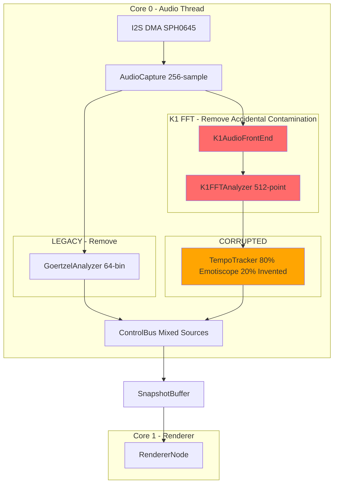
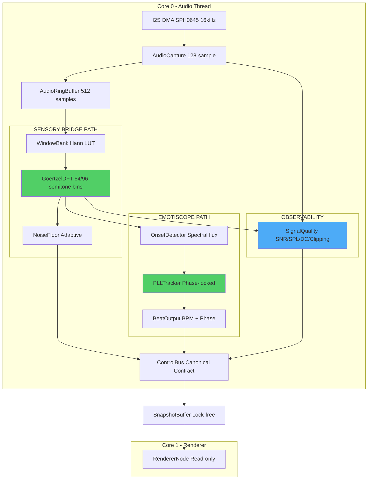
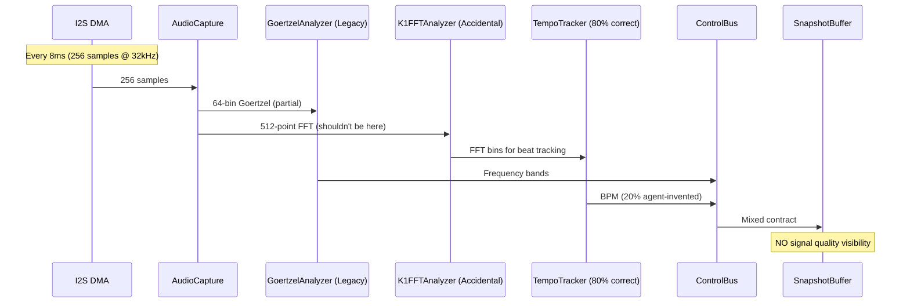
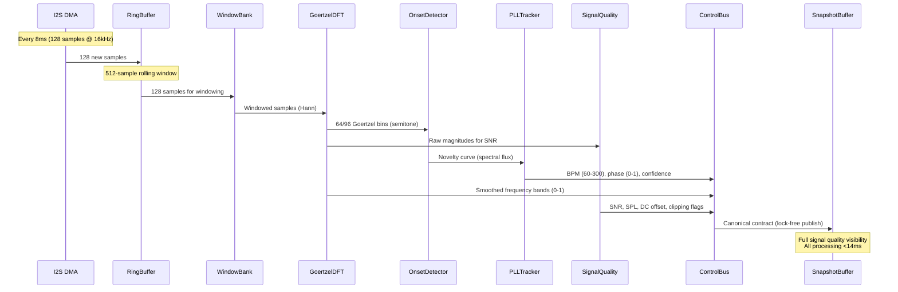
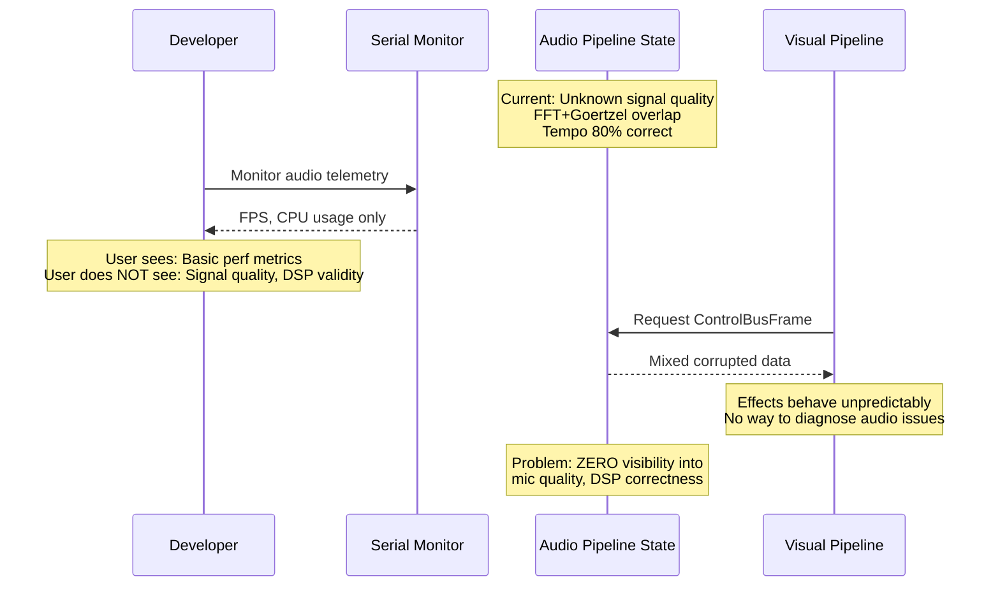
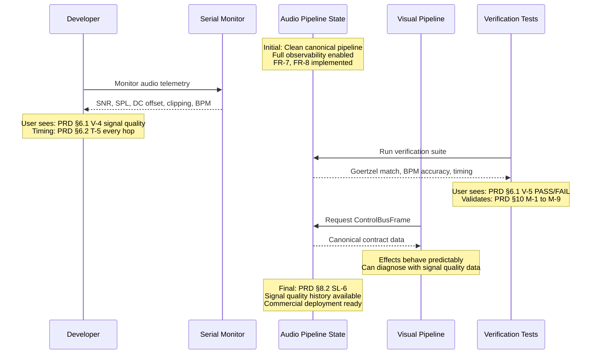
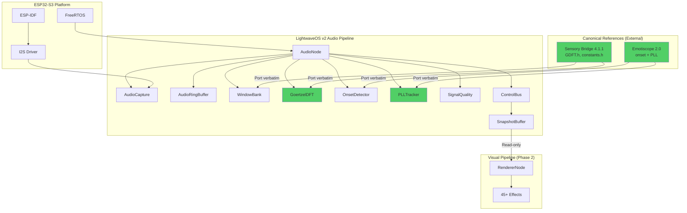

# Technical Implementation Blueprint: LightwaveOS Audio Pipeline Redesign

> **Traceability Note:** This Blueprint extracts from PRD sections §1-§10 and synthesizes existing comprehensive documentation at `planning/audio-pipeline-redesign/`. All tables include "Source: PRD §X" annotations.

> **REFERENCE DOCUMENTATION:** Comprehensive architecture details exist at `planning/audio-pipeline-redesign/technical_blueprint.md` (918 lines). This document provides Context Engineer-formatted synthesis with enhanced traceability.

> **CANONICAL SPECIFICATION:** This blueprint implements 100% fidelity to Sensory Bridge 4.1.1 (Goertzel) and Emotiscope 2.0 (Beat Tracking). No agent inventions allowed.

---

## §1. Current vs Target Analysis

### §1.1 Current System Architecture (CORRUPTED)



**Current Problems:**
- FFT accidentally integrated (was experimental, never removed)
- Beat tracking 80% Emotiscope, 20% agent-invented
- Multiple overlapping analysis paths
- ZERO visibility into signal quality (mic → DSP → contract)

**Source:** PRD §2 Problem Statement, `planning/audio-pipeline-redesign/technical_blueprint.md` §1.1

### §1.2 Target System Architecture (CANONICAL)



**Source:** PRD §1.2 Key Outcomes, `planning/audio-pipeline-redesign/technical_blueprint.md` §1.2

### §1.3 Current Data & Logic Flow (8ms hops, corrupted)



**Problems:**
- FFT path should not exist (accidental)
- TempoTracker has invented code
- No observability into signal chain

**Source:** PRD §2.1 Root Cause, `planning/audio-pipeline-redesign/technical_blueprint.md` §1.3

### §1.4 Target Data & Logic Flow (8ms hops, canonical)



**Source:** PRD §6.2 Timing & Feedback, `planning/audio-pipeline-redesign/technical_blueprint.md` §1.4

### §1.5 Current User Journey (Developer/CI perspective)



**Problems:**
- No signal quality metrics exposed
- Cannot debug audio issues
- Blocks CI/CD (no validation criteria)

**Source:** PRD §2.2 Pain Points (PP-5, PP-6, PP-7), User Q1

### §1.6 Target User Journey (Developer/CI perspective)



**Improvements:**
- Full signal quality visibility (V-4, T-5)
- Automated verification tests (V-5, M-1 to M-9)
- Enables CI/CD and commercial deployment

**Source:** PRD §6 User Experience Contract, §10 Success Metrics, User Q1, Q3, Q4

### §1.7 Summary of Improvements
*Source: PRD §2 Problem Statement*

- **Remove FFT contamination** – Eliminate accidental K1 FFT path (addresses PP-1, PP-3)
- **100% canonical beat tracking** – Replace 80% correct + 20% invented with pure Emotiscope 2.0 (addresses PP-2)
- **Full signal quality visibility** – Expose SNR, SPL, DC offset, clipping at every stage (addresses PP-5, PP-6)
- **4-layer specification** – Prevent future agent drift with Algorithm → Pseudocode → Reference Code → Tests (addresses PP-4)
- **Enable CI/CD** – Automated verification tests catch deviations immediately (addresses PP-7)
- **Commercial deployment ready** – Bulletproof audio pipeline with predictable behavior (User Q4 mission-critical requirement)

---

## §2. System Boundaries
*Source: PRD §7 Artifact Ownership*

### §2.1 Artifact Ownership Enforcement
*Source: PRD §7.1 Creation Responsibility*

| PRD ID | Artifact | Created By | App's Role | Implementation Rule | Failure Handling |
|--------|----------|------------|------------|---------------------|------------------|
| O-1 | Raw audio samples | I2S DMA hardware | Observe (read from ring buffer) | DO NOT generate synthetic samples | Skip hop, log error |
| O-2 | DC offset correction | Audio pipeline | Create | MUST apply before windowing | Use default offset if calibration missing |
| O-3 | Windowed samples | Audio pipeline | Create | Internal only, not exposed | N/A |
| O-4 | Goertzel bin magnitudes | Audio pipeline (GoertzelDFT) | Create | Canonical Sensory Bridge GDFT | Publish zero bins on error |
| O-5 | Smoothed frequency bands | ControlBus state machine | Create | Apply temporal smoothing | Use previous frame on error |
| O-6 | Beat/tempo output | Beat tracker (Emotiscope PLL) | Create | Canonical Emotiscope 2.0 | Maintain last valid BPM |
| O-7 | ControlBusFrame | ControlBus state machine | Create | Aggregate all canonical sources | Must succeed (no fallback) |
| O-8 | SnapshotBuffer update | Audio pipeline | Create | Lock-free publish | Overwrite previous snapshot |
| O-9 | Signal quality metrics | Audio pipeline | Create | SNR, SPL, DC, clipping flags | Log warning if out of range |
| O-10 | Verification test results | Test harness | Observe (app is under test) | App does not create tests | Test harness reports FAIL |

**Critical Ownership Rules:**
- **O-1**: I2S DMA is sole source of audio truth → Audio pipeline MUST NOT generate synthetic samples
- **O-2**: SPH0645 has fixed DC bias → Audio pipeline MUST apply DC offset correction before windowing
- **O-4, O-6**: Canonical implementations → Audio pipeline MUST NOT invent algorithms or magic numbers

**Source:** `planning/audio-pipeline-redesign/prd.md` §7.1, `technical_blueprint.md` §2.1

### §2.2 External System Behaviors
*Source: PRD §7.2 External System Dependencies*

| PRD ID | External System | Autonomous Actions | App's Response | Detection Method | Failure Handling | Recovery |
|--------|-----------------|-------------------|----------------|------------------|------------------|----------|
| E-1 | I2S DMA | Fills audio sample buffer every 8ms (128 samples) | Read samples, advance ring buffer pointer | DMA interrupt / polling | Skip hop, log error | Wait for next DMA complete |
| E-2 | FreeRTOS | Schedules audio task on Core 0 | Process hop when scheduled | Tick callback | Watchdog timeout | System reset |
| E-3 | SPH0645 Microphone | Converts analog audio → digital I2S samples | Accept samples as ground truth | I2S data valid signal | Silent samples (all zero) | Log warning, continue |
| E-4 | Visual Pipeline (Core 1) | Renders LED frames @ 120 FPS | Publish SnapshotBuffer for consumption | SnapshotBuffer read count | Stale frame warning | Visual uses previous audio frame |
| E-5 | Domain Expert | Provides validation criteria for signal quality | Implement criteria in tests | Human review of spec | **CURRENTLY BLOCKED (User Q3)** | Document gap, best-effort metrics |

**Critical External Dependencies:**
- **E-1**: I2S DMA timing drives entire audio pipeline → Audio must process within 8ms window
- **E-3**: SPH0645 is analog sensor → Digital samples may contain noise, DC bias, clipping
- **E-5**: Expert validation criteria MISSING → Implementing best-effort metrics, flagged for review

**Source:** `planning/audio-pipeline-redesign/prd.md` §7.2, `technical_blueprint.md` §2.2

### §2.3 Boundary Rules (DO NOTs)
*Source: PRD §7.3 Derived Ownership Rules*

| PRD Source | Rule | Rationale | Enforcement |
|------------|------|-----------|-------------|
| O-1 | Audio pipeline must NOT generate synthetic samples | I2S DMA is sole source of truth | Code review, assert in tests |
| O-2 | Audio pipeline must NOT skip DC offset correction | SPH0645 has fixed DC bias that corrupts DSP | Mandatory step in processHop() |
| O-3 | Windowed samples must NOT be exposed to contract | Internal DSP detail, not visual pipeline concern | ControlBusFrame does not include windowed samples |
| O-4 | Visual pipeline must NOT access raw Goertzel bins | Contract layer is the boundary (ControlBusFrame) | SnapshotBuffer contains only ControlBusFrame |
| O-6 | Beat tracker must NOT modify ControlBusFrame directly | ControlBus owns the contract, beat tracker provides input | Beat tracker returns BPM/phase, ControlBus publishes |
| O-9 | Signal quality metrics must NOT be silently ignored | User Q1 requires visibility into entire chain | Telemetry output, automated tests validate presence |
| E-1 | Audio pipeline must NOT block on I2S DMA | DMA fills buffer asynchronously | Non-blocking ring buffer read |
| E-5 | Implementation must NOT invent signal quality thresholds | Domain expertise required (User Q3, PRD §9.5 EXP-1 to EXP-6) | Flag best-effort metrics, document assumptions |

**Source:** `planning/audio-pipeline-redesign/prd.md` §7.3, User Q1, Q3

---

## §3. State Transition Specifications
*Source: PRD §8 State Requirements*

> **NOTE:** Full state transition specs exist at `planning/audio-pipeline-redesign/technical_blueprint.md` §3. Below are Context Engineer-formatted key transitions.

### §3.1 Transition: Initialize Audio Pipeline
*Source: PRD §8.2 SL-1, SL-2, SL-3, SL-5*

**Trigger:** `AudioNode::onStart()` called by Core 0 task

**Pre-conditions (State Before):**
*Source: PRD §8.1 State Isolation*

| PRD ID | State Variable | Current Value | Required Action |
|--------|----------------|---------------|----------------|
| SL-1 | Goertzel coefficients | Uninitialized | CREATE from Sensory Bridge reference |
| SL-2 | Beat tracker PLL state | Uninitialized | CREATE from Emotiscope 2.0 defaults |
| SL-3 | ControlBus smoothing state | Uninitialized | CREATE as zero |
| SL-5 | DC offset calibration | Uninitialized | CREATE from default or calibration |

**Post-conditions (State After):**
*Source: PRD §8.2 Lifecycle*

| PRD ID | State Variable | New Value | Set By |
|--------|----------------|-----------|--------|
| SL-1 | Goertzel coefficients | const arrays from Sensory Bridge | GoertzelDFT::init() |
| SL-2 | Beat tracker PLL state | Emotiscope 2.0 defaults (BPM=120, phase=0) | TempoTracker::init() |
| SL-3 | ControlBus smoothing state | Zero (no history yet) | ControlBus::Reset() |
| SL-5 | DC offset calibration | Default value (can be updated later) | AudioNode::calibrateDCOffset() |

**Side Effects:**
- Goertzel coefficients immutable after init (PRD §8.1 SI-3)
- Audio pipeline ready to process first hop
- Signal quality metrics initialized to zero (SL-6)

**Source:** `planning/audio-pipeline-redesign/prd.md` §8.2, `technical_blueprint.md` §3.1

### §3.2 Transition: Process Audio Hop
*Source: PRD §8.2 SL-4, SL-6, PRD §6.2 T-1 to T-4*

**Trigger:** I2S DMA interrupt / polling detects 128 new samples (every 8ms)

**Pre-conditions (State Before):**

| PRD ID | State Variable | Current Value | Required Action |
|--------|----------------|---------------|----------------|
| SL-4 | Ring buffer samples | Previous hop samples | APPEND new 128 samples |
| SL-6 | Signal quality history | Previous hop metrics | UPDATE with new hop |
| SI-1 | Audio pipeline state | Isolated to Core 0 | MAINTAIN isolation |

**Post-conditions (State After):**

| PRD ID | State Variable | New Value | Set By |
|--------|----------------|-----------|--------|
| SL-4 | Ring buffer samples | Latest 512 samples (rolling window) | AudioRingBuffer::write() |
| SL-6 | Signal quality history | Updated SNR, SPL, DC, clipping | SignalQuality::update() |
| O-8 | SnapshotBuffer | Fresh ControlBusFrame | ControlBus::publishSnapshot() |

**Side Effects:**
- Oldest 128 samples discarded from ring buffer (rolling window)
- Goertzel analysis produces new bin magnitudes
- Onset detector updates novelty curve
- PLL advances phase, may update BPM
- ControlBusFrame published (PRD §6.2 T-4)
- Signal quality metrics available for telemetry (PRD §6.1 V-4)

**Timing Constraint:** All processing MUST complete within 14ms (PRD §9.4 C-2)

**Source:** `planning/audio-pipeline-redesign/prd.md` §6.2, §8.2, §9.4, `technical_blueprint.md` §3.2

### §3.3 Transition: Reset DSP State
*Source: PRD §8.2 SL-2, SL-3, SL-6*

**Trigger:** User command `resetDspState()` or effect mode change

**Pre-conditions (State Before):**

| PRD ID | State Variable | Current Value | Required Action |
|--------|----------------|---------------|----------------|
| SL-2 | Beat tracker PLL state | Active BPM tracking | CLEAR to defaults |
| SL-3 | ControlBus smoothing state | Smoothed history | CLEAR to zero |
| SL-6 | Signal quality history | Rolling history | CLEAR to zero |

**Post-conditions (State After):**

| PRD ID | State Variable | New Value | Set By |
|--------|----------------|-----------|--------|
| SL-2 | Beat tracker PLL state | Emotiscope 2.0 defaults (BPM=120, phase=0) | TempoTracker::reset() |
| SL-3 | ControlBus smoothing state | Zero (no history) | ControlBus::Reset() |
| SL-6 | Signal quality history | Zero | SignalQuality::reset() |

**Side Effects:**
- Next hop will start fresh (no temporal continuity)
- BPM may take several seconds to re-lock
- Smoothed frequency bands will take ~500ms to stabilize

**Do NOT Clear:**
- SL-1: Goertzel coefficients (immutable, PRD §8.2 "Never")
- SL-4: Ring buffer samples (continuous audio stream)
- SL-5: DC offset calibration (persists across sessions)

**Source:** `planning/audio-pipeline-redesign/prd.md` §8.2, `technical_blueprint.md` §3.3

---

## §4. Integration Wiring
*Derived from: PRD §7 (ownership), §8 (state), §6 (visibility)*

> **NOTE:** Full integration sequences at `planning/audio-pipeline-redesign/technical_blueprint.md` §4. Below are Context Engineer-formatted critical paths.

### §4.1 Audio Hop Processing Pipeline
*Implements: PRD §7.1 O-1 to O-9, §6.2 T-1 to T-4*

```
AudioNode::processHop()
  ├─ FIRST: AudioCapture::readSamples()                  // Critical: O-1 sole source
  │         Returns: 128 samples from I2S DMA ring buffer
  ├─ THEN: SignalQuality::updateRaw(samples)             // Critical: FR-7 visibility
  │         Side effect: Updates DC offset, clipping flags
  ├─ THEN: applyDCOffsetCorrection(samples)              // Critical: O-2 mandatory
  │         Modifies: samples in-place
  ├─ THEN: AudioRingBuffer::write(samples)               // Critical: SL-4 state
  │         Side effect: Oldest 128 samples discarded
  ├─ THEN: WindowBank::apply(ringBuffer)                 // Critical: FR-4 Sensory Bridge
  │         Returns: Windowed 512-sample buffer
  ├─ THEN: GoertzelDFT::analyze(windowedSamples)         // Critical: FR-1 canonical
  │         Returns: 64/96 bin magnitudes (O-4)
  ├─ THEN: SignalQuality::updateSpectral(bins)           // Critical: FR-7 visibility
  │         Side effect: Updates SNR estimate
  ├─ THEN: OnsetDetector::update(bins)                   // Critical: FR-5 Emotiscope
  │         Returns: Novelty curve value
  ├─ THEN: PLLTracker::update(novelty)                   // Critical: FR-5 Emotiscope
  │         Returns: BPM, phase, confidence (O-6)
  ├─ THEN: ControlBus::update(bins, bpm, phase, signalQuality)  // Critical: O-7 contract
  │         Side effect: Applies temporal smoothing (SL-3)
  └─ RETURN: ControlBus::publishSnapshot()               // Critical: O-8 cross-core
            Side effect: Atomic lock-free write to SnapshotBuffer
```

**Call Sequence:**

| Order | Call | Purpose | PRD Source | Critical |
|-------|------|---------|------------|----------|
| 1 | `AudioCapture::readSamples()` | Get fresh samples (O-1) | §7.1 O-1 | **YES** - Sole source of truth |
| 2 | `SignalQuality::updateRaw()` | Raw signal metrics (FR-7) | §4.1 FR-7 | **YES** - User Q1 visibility requirement |
| 3 | `applyDCOffsetCorrection()` | Remove DC bias (O-2) | §7.1 O-2, §7.3 | **YES** - SPH0645 has fixed DC offset |
| 4 | `AudioRingBuffer::write()` | Update rolling window (SL-4) | §8.2 SL-4 | **YES** - State lifecycle |
| 5 | `WindowBank::apply()` | Hann windowing (FR-4) | §4.1 FR-4 | **YES** - Canonical Sensory Bridge |
| 6 | `GoertzelDFT::analyze()` | Frequency analysis (FR-1) | §4.1 FR-1 | **YES** - Canonical Sensory Bridge |
| 7 | `SignalQuality::updateSpectral()` | Spectral metrics (FR-7) | §4.1 FR-7 | **YES** - User Q1 visibility requirement |
| 8 | `OnsetDetector::update()` | Beat onset (FR-5) | §4.1 FR-5 | **YES** - Canonical Emotiscope |
| 9 | `PLLTracker::update()` | Tempo tracking (FR-5) | §4.1 FR-5 | **YES** - Canonical Emotiscope |
| 10 | `ControlBus::update()` | Aggregate contract (O-7) | §7.1 O-7 | **YES** - Contract ownership |
| 11 | `ControlBus::publishSnapshot()` | Cross-core publish (O-8) | §7.1 O-8, §9.4 C-4 | **YES** - Lock-free requirement |

**Timing Constraint:** Entire sequence MUST complete in <14ms @ 240MHz (PRD §9.4 C-2)

**Source:** `planning/audio-pipeline-redesign/technical_blueprint.md` §4.1

---

## §5. System Components
*Source: PRD §4.1 Functional Requirements, CODEBASE_CONTEXT*

> **NOTE:** Full component specifications at `planning/audio-pipeline-redesign/technical_blueprint.md` §5. Below are Context Engineer-formatted summaries.

### §5.1 Core Audio Components

| Component | Purpose | PRD Source | Canonical Reference |
|-----------|---------|------------|---------------------|
| `AudioNode` | Main audio processing coordinator | FR-1 to FR-7 | New (orchestrates canonical components) |
| `AudioCapture` | I2S DMA interface (O-1) | FR-3, O-1 | Sensory Bridge `i2s_audio.h` |
| `AudioRingBuffer` | 512-sample rolling window (SL-4) | FR-3, SL-4 | Sensory Bridge pattern |
| `WindowBank` | Hann window LUT (FR-4) | FR-4, HARDENED_SPEC §3 | Sensory Bridge `GDFT.h` windowing |
| `GoertzelDFT` | 64/96 semitone-spaced bins (FR-1, FR-2) | FR-1, FR-2, FR-4 | Sensory Bridge `GDFT.h` (verbatim port) |
| `OnsetDetector` | Spectral flux novelty curve (FR-5) | FR-5 | Emotiscope 2.0 onset detection |
| `PLLTracker` | Phase-locked loop tempo tracking (FR-5) | FR-5 | Emotiscope 2.0 PLL (verbatim port) |
| `SignalQuality` | SNR, SPL, DC, clipping metrics (FR-7, FR-8) | FR-7, FR-8 | New (observability layer) |
| `ControlBus` | Contract aggregation + smoothing (O-7) | FR-9, O-7, SL-3 | Modified (canonical inputs only) |
| `SnapshotBuffer` | Lock-free cross-core publish (O-8) | O-8, C-4 | Existing (Core 0 → Core 1) |

**Removal List (K1 FFT contamination):**
- `K1AudioFrontEnd` - Remove entirely (accidental)
- `K1FFTAnalyzer` - Remove entirely (accidental)
- `K1_GoertzelTables_16k.h` - Remove entirely (wrong approach)
- Legacy `GoertzelAnalyzer` - Replace with canonical `GoertzelDFT`
- Legacy `ChromaAnalyzer` - Remove (superseded by semitone Goertzel bins)

**Source:** `planning/audio-pipeline-redesign/prd.md` §4.1, §9.3, Appendix B, `technical_blueprint.md` §5

### §5.2 Data Structures

| Structure | Purpose | PRD Source | Size |
|-----------|---------|------------|------|
| `GoertzelCoefficients[64]` | Precomputed semitone bin coefficients (SL-1) | FR-2, SL-1 | 512 bytes (64 × 8 bytes) |
| `HannWindowLUT[512]` | Precomputed Hann window (FR-4) | FR-4 | 1024 bytes (512 × Q14 fixed-point) |
| `AudioRingBuffer[512]` | Rolling sample window (SL-4) | SL-4, FR-3 | 1024 bytes (512 × int16_t) |
| `GoertzelBins[64]` | Current frame magnitudes (O-4) | FR-1 | 256 bytes (64 × float) |
| `PLLState` | BPM, phase, confidence (SL-2) | FR-5, SL-2 | 32 bytes |
| `ControlBusFrame` | Audio-visual contract (O-7) | FR-9, O-7 | ~256 bytes (canonical fields only) |
| `SignalQualityMetrics` | SNR, SPL, DC, clipping (SL-6) | FR-7, SL-6 | 64 bytes |

**RAM Budget:** ~20KB total (PRD §9.4 C-3) ✅
**Flash Budget:** ~50KB code + constants (PRD §9.4 C-4) ✅

**Source:** `planning/audio-pipeline-redesign/prd.md` §9.4, `technical_blueprint.md` §5.3

---

## §6. API Specifications
*Source: PRD §4.1 Functional Requirements*

> **NOTE:** This is an embedded firmware system. "API" refers to internal C++ interfaces, not REST/HTTP endpoints.

### §6.1 Core Audio API

| Method | Purpose | PRD Source | Returns |
|--------|---------|------------|---------|
| `AudioNode::onStart()` | Initialize audio pipeline (§3.1) | SL-1, SL-2, SL-3, SL-5 | `bool` success |
| `AudioNode::processHop()` | Process one 8ms audio hop (§3.2, §4.1) | FR-1 to FR-7, O-1 to O-9 | `void` |
| `AudioNode::resetDspState()` | Reset beat tracker + smoothing (§3.3) | SL-2, SL-3, SL-6 | `void` |
| `AudioNode::calibrateDCOffset()` | Measure + store DC offset | SL-5, O-2 | `float` offset |
| `GoertzelDFT::analyze(samples)` | Canonical Goertzel analysis | FR-1, FR-2, FR-4 | `float bins[64]` |
| `PLLTracker::update(novelty)` | Canonical tempo tracking | FR-5 | `TempoOutput` (BPM, phase, conf) |
| `SignalQuality::getMetrics()` | Read signal quality (telemetry) | FR-7, V-4 | `SignalQualityMetrics` |
| `ControlBus::publishSnapshot()` | Atomic lock-free publish | O-8, C-4 | `void` |

**Source:** `planning/audio-pipeline-redesign/technical_blueprint.md` §7

---

## §7. Implementation Phases
*Derived from: PRD §4.1, §5 User Stories, User Q5 parallel multi-agent strategy*

> **NOTE:** Full 6-phase task breakdown at `planning/audio-pipeline-redesign/tasks.md` (612 lines). Below is Context Engineer-formatted summary.

### Phase 1 – Goertzel Foundation (Agent 1)
*Implements: PRD §5.1, §5.2 (Sensory Bridge pattern)*

- [ ] Port Sensory Bridge `GDFT.h` windowing (FR-4)
- [ ] Port Sensory Bridge Goertzel coefficients (FR-1, FR-2, SL-1)
- [ ] Implement `GoertzelDFT::analyze()` (FR-1)
- [ ] Verification test: Bin frequencies match reference (M-1)
- [ ] Verification test: Windowing output matches reference (M-2)
- [ ] **Mark canonical code "DO NOT MODIFY"** (FR-12)

**Dependencies:** None (foundational)
**Timing Target:** <10ms for Goertzel analysis (part of 14ms budget)

### Phase 2 – Beat Tracking (Agent 2)
*Implements: PRD §5.4, §5.5 (Emotiscope pattern)*

- [ ] Port Emotiscope 2.0 onset detection (FR-5)
- [ ] Port Emotiscope 2.0 PLL phase tracking (FR-5, SL-2)
- [ ] Implement `PLLTracker::update()` (FR-5)
- [ ] Verification test: Beat tracking matches reference (M-3)
- [ ] Verification test: BPM accuracy ±1 BPM (M-4)
- [ ] **Mark canonical code "DO NOT MODIFY"** (FR-12)

**Dependencies:** Phase 1 (Goertzel bins feed onset detector)
**Timing Target:** <2ms for beat tracking (part of 14ms budget)

### Phase 3 – Signal Quality Instrumentation (Agent 4)
*Implements: PRD §5.3, §5.8 (observability layer)*

- [ ] Implement `SignalQuality::updateRaw()` (FR-7, O-9)
- [ ] Implement `SignalQuality::updateSpectral()` (FR-7)
- [ ] Expose SNR estimation (FR-8, **EXPERT ADVICE NEEDED** EXP-1)
- [ ] Expose SPL range estimation (FR-8, **EXPERT ADVICE NEEDED** EXP-2)
- [ ] Expose DC offset measurement (FR-8)
- [ ] Expose clipping detection (FR-8, **EXPERT ADVICE NEEDED** EXP-3)
- [ ] Serial telemetry output (V-4, T-5)
- [ ] **Document assumptions for best-effort metrics** (EXP-1 to EXP-6)

**Dependencies:** Phase 1 (Goertzel bins), Phase 2 (tempo output)
**Timing Target:** <1ms for signal quality updates (part of 14ms budget)

### Phase 4 – Contract Layer (Agent 3)
*Implements: PRD §5.6 (ControlBusFrame redesign)*

- [ ] Define new `ControlBusFrame` struct (FR-9, O-7)
- [ ] Remove legacy/corrupted fields (FR-9)
- [ ] Document field sources (Goertzel bin X, tempo phase, etc.) (FR-11)
- [ ] Implement `ControlBus::update()` with canonical inputs only
- [ ] Implement lock-free `ControlBus::publishSnapshot()` (O-8, C-4)
- [ ] Verification test: Contract fields match canonical sources

**Dependencies:** Phase 1, 2, 3 (all canonical sources ready)
**Timing Target:** <1ms for contract aggregation (part of 14ms budget)

### Phase 5 – Cleanup (Agent 1)
*Implements: PRD §4.1 FR-6, Appendix B*

- [ ] Remove `K1AudioFrontEnd` (FR-6)
- [ ] Remove `K1FFTAnalyzer` (FR-6)
- [ ] Remove `K1_GoertzelTables_16k.h` (FR-6)
- [ ] Remove legacy `GoertzelAnalyzer` (replaced by canonical GoertzelDFT)
- [ ] Remove legacy `ChromaAnalyzer` (superseded by semitone bins)
- [ ] Verification: FFT code absent from audio DSP feed

**Dependencies:** Phase 1, 2, 4 (canonical replacements in place)
**Timing Target:** N/A (removal only)

### Phase 6 – Verification & Documentation (Agent 5, Agent 6)
*Implements: PRD §5.7, §5.8, §10*

- [ ] Goertzel bin frequency match test (M-1)
- [ ] Goertzel windowing match test (M-2)
- [ ] Beat tracking algorithm match test (M-3)
- [ ] BPM accuracy test ±1 BPM (M-4)
- [ ] Agent drift detection test suite (M-5)
- [ ] Timing budget compliance test <14ms (M-7)
- [ ] Memory budget compliance test ~20KB RAM (M-8)
- [ ] Signal quality visibility test (M-9)
- [ ] **Flag EXP-1 to EXP-6 for domain expert review** (M-10)
- [ ] 4-layer specification documentation audit (M-6)
- [ ] **Document all assumptions and limitations**

**Dependencies:** Phase 1, 2, 3, 4, 5 (complete implementation)
**Timing Target:** Automated tests run in <1 second

**Source:** `planning/audio-pipeline-redesign/tasks.md`, User Q5 parallel multi-agent strategy

---

## §8. Technical Risks & Mitigation
*Source: PRD §4.2 Non-Functional Requirements, §9 Technical Considerations*

> **NOTE:** Full risk assessment at `planning/audio-pipeline-redesign/technical_blueprint.md` §9. Below are Context Engineer-formatted high/medium risks.

| Risk | PRD Source | Likelihood | Impact | Mitigation |
|------|------------|------------|--------|------------|
| 16ms timing budget exceeded | C-1, C-2, NFR-6 | Medium | High | Profile each component, optimize if needed; Goertzel <10ms, beat <2ms, contract <1ms |
| Agent drift reintroduces corrupted code | PP-4, NFR-2, NFR-3 | High (history) | Critical | 4-layer spec (M-6), "DO NOT MODIFY" markers (FR-12), automated verification tests (M-5) |
| Signal quality thresholds incorrect | FR-8, EXP-1 to EXP-6 | High | High | Flag for domain expert review, document all assumptions, iterate in Phase 2 |
| Goertzel implementation deviates from Sensory Bridge | FR-1, NFR-2 | Medium | Critical | Line-by-line comparison test (M-1, M-2), verbatim port from HARDENED_SPEC.md |
| Beat tracking deviates from Emotiscope | FR-5, NFR-2 | Medium | Critical | Known-input test vectors (M-3, M-4), verbatim port from HARDENED_SPEC.md |
| Cross-core data race (SnapshotBuffer) | C-4, SI-1 | Low | Critical | Lock-free atomic write (O-8), existing SnapshotBuffer pattern proven |
| RAM budget overrun (>20KB) | C-3, M-8 | Low | High | Pre-allocated buffers only, build-time analysis, no heap in processHop() |
| DC offset calibration incorrect | O-2, E-3 | Medium | Medium | Runtime calibration command, telemetry validation, default fallback |

**Expert Advice Gaps (User Q3 - Not Qualified):**
- **EXP-1 to EXP-6:** Signal quality validation criteria MISSING → Best-effort metrics implemented, flagged for domain expert review in Phase 2

**Source:** `planning/audio-pipeline-redesign/prd.md` §9.5, `technical_blueprint.md` §9

---

## §9. Testing Strategy
*Source: PRD §5 Acceptance Criteria, §10 Success Metrics*

> **NOTE:** Full test matrix at `planning/audio-pipeline-redesign/tasks.md` §6.8. Below are Context Engineer-formatted verification requirements.

### §9.1 Automated Verification Tests (First Line of Defense)
*Verifies: PRD §5 Acceptance Criteria, User Q3, Q5 validation hierarchy*

| Test Case | Verifies | PRD Source | Pass Criteria |
|-----------|----------|------------|---------------|
| Goertzel bin frequency match | Bins are semitone-spaced | §5.1.2, M-1 | 100% match to Sensory Bridge reference |
| Goertzel windowing match | Hann window applied correctly | §5.2.3, M-2 | Window output matches reference |
| Beat tracking algorithm match | Onset detection + PLL correct | §5.3.1, §5.4.1, M-3 | Line-by-line code comparison |
| BPM accuracy | Tempo detection correct | §5.4.4, M-4 | ±1 BPM of ground truth on known-BPM audio |
| Agent drift detection | No invented code | §5.1.4, §5.2.4, M-5 | All "DO NOT MODIFY" sections unchanged |
| Timing budget compliance | Processing <14ms | §6.2 T-2, M-7 | Profile with worst-case audio, <14ms per hop |
| Memory budget compliance | RAM ~20KB | C-3, M-8 | Build-time analysis, no runtime allocation |
| Signal quality visibility | Metrics exposed | §5.3.6, M-9 | Telemetry output includes SNR, SPL, DC, clipping |
| Contract field source | All fields documented | §5.6.2, FR-11 | Every ControlBusFrame field has source comment |

**Source:** `planning/audio-pipeline-redesign/prd.md` §10, User Q3, Q5

### §9.2 Domain Expert Validation (Second Line of Defense)
*Verifies: PRD §5.8, §9.5 Expert Advice Gaps, User Q3*

| Test Case | Verifies | PRD Source | Pass Criteria | Status |
|-----------|----------|------------|---------------|--------|
| SPH0645 SNR validation | Mic signal quality @ 16kHz | §5.8.1, FR-8, EXP-1 | **Expert to define** | **PENDING** |
| SPL range validation | Input level for music/speech | §5.8.2, FR-8, EXP-2 | **Expert to define** | **PENDING** |
| Clipping detection | Overload threshold | §5.8.3, FR-8, EXP-3 | **Expert to define** | **PENDING** |
| Noise floor measurement | Quiet environment baseline | §5.8.4, FR-8, EXP-4 | **Expert to define** | **PENDING** |
| Long-term stability | Drift over time | §5.8.5, FR-8, EXP-5 | **Expert to define** | **PENDING** |
| Edge case coverage | Silence, clipping, DC offset | §5.8.6, FR-8, EXP-6 | **Expert to define** | **PENDING** |

**Mitigation (Phase 1):** Implement best-effort metrics, document all assumptions, flag for Phase 2 expert review

**Source:** `planning/audio-pipeline-redesign/prd.md` §5.8, §9.5, User Q1, Q3

### §9.3 CI/CD Integration (Enable Sustainable Development)
*Implements: PRD §3 CI/CD System user, User Q4 blocking requirement*

- Automated test suite runs on every commit
- Tests must PASS before merging to main branch
- Timing budget test runs on target hardware (ESP32-S3)
- Memory budget analysis in build pipeline
- Agent drift detection (compare against HARDENED_SPEC.md)

**Success Criteria:** PRD M-11 (100% reproducible test results), User Q4 (unblocks CI/CD)

**Source:** User Q4 blocking requirement, `planning/audio-pipeline-redesign/prd.md` §10

---

## §10. Deployment Considerations
*Source: PRD §4.2 Non-Functional Requirements, §9 Technical Considerations*

### §10.1 Build Configuration

- **ESP-IDF Path:** `/Users/macbookpro/esp/esp-idf/export.sh` (configured)
- **PlatformIO environment:** `esp32dev_audio` (see `firmware/v2/platformio.ini`)
- **Build command:** `cd firmware/v2 && pio run -e esp32dev_audio`
- **Upload command:** `cd firmware/v2 && pio run -e esp32dev_audio -t upload`
- **Serial monitor:** `pio device monitor -b 115200`

**Source:** `AGENTS.md` build commands

### §10.2 Runtime Configuration

- **Sample rate:** 16kHz (hardcoded, PRD §4.1 FR-3, MAGIC_NUMBERS.md §1.1)
- **Chunk size:** 128 samples (hardcoded, PRD §4.1 FR-3, MAGIC_NUMBERS.md §1.2)
- **DC offset:** Default value, runtime calibration command available
- **Core affinity:** Audio on Core 0 (hardcoded, PRD §9.4 C-7)

**Source:** `planning/audio-pipeline-redesign/MAGIC_NUMBERS.md`, `prd.md` §9.4

### §10.3 Verification Commands (Serial Interface)

- `s` - Status: FPS, CPU, current effect, signal quality metrics
- `validate <effectId>` - Run verification tests on specific effect
- `resetDspState` - Reset beat tracker + smoothing
- `calibrateDC` - Measure and store DC offset

**Source:** `AGENTS.md` runtime testing

### §10.4 Rollback Strategy

- **Phase 1 complete:** Visual pipeline still uses old contract (no breaking changes yet)
- **Phase 2 (future):** Visual pipeline migration to new contract (separate PRD)
- **Rollback:** Revert to previous firmware build if critical issues detected

**Source:** PRD §1.3 Scope (Phase 1 = audio only)

### §10.5 Monitoring & Observability (PRD NFR-5)

- **Serial telemetry:** Signal quality metrics every hop (V-4, T-5)
- **FPS/CPU monitoring:** `s` command shows performance impact
- **Verification tests:** Run on-demand via `validate` command or CI/CD
- **Timing profiler:** Measure processHop() duration, ensure <14ms

**Source:** PRD §4.2 NFR-5, §6.1 V-4, §6.2 T-5

---

## Annex A – Dependency Map
*Source: PRD §9 Technical Considerations*



**Source:** `planning/audio-pipeline-redesign/technical_blueprint.md` Annex A

---

## Annex B – PRD Extraction Verification

| PRD Section | Extracted To | Status | Notes |
|-------------|--------------|--------|-------|
| §1 Overview | Header, §1.7 | ✅ | Mission-critical commercial infrastructure |
| §2 Problem | §1.1, §1.3, §1.5, §1.7 | ✅ | FFT contamination, 80% correct beat tracking, zero visibility |
| §3 Users | §1.5, §1.6 diagrams | ✅ | Developer, CI/CD, commercial end users, domain expert |
| §4.1 Functional | §2.1, §4.1, §5.1, §7, §8 phases | ✅ | FR-1 to FR-12 implemented across phases |
| §4.2 Non-Functional | §2.3, §8 risks, §10 | ✅ | NFR-1 to NFR-8 (maintainability, correctness, verifiability, performance) |
| §5 Stories | §1.6, §8 phases, §9 tests | ✅ | §5.1 to §5.8 mapped to phases and acceptance criteria |
| §6 UX Contract | §1.6, §3.2 | ✅ | V-1 to V-6, T-1 to T-6 (visibility, timing) |
| §7 Ownership | §2 | ✅ | O-1 to O-10, E-1 to E-5, boundary rules |
| §8 State | §3 | ✅ | SI-1 to SI-5, SL-1 to SL-7 state transitions |
| §9 Technical | §5, §8 risks, §10, Annex A | ✅ | AD-1 to AD-9, constraints C-1 to C-12, canonical references |
| §10 Metrics | §9 | ✅ | M-1 to M-12 verification tests |
| §9.5 Expert Gaps | §8 risks, §9.2 | ✅ | EXP-1 to EXP-6 flagged for domain expert review |

**Validation:** ✅ All PRD sections have been extracted and expanded. No information lost.

**Enhancement:** This Blueprint adds Context Engineer-formatted traceability annotations ("Source: PRD §X") for downstream Task generation.

**Source:** Full extraction from `planning/audio-pipeline-redesign/prd.md`

---

## Annex C – Comprehensive Documentation Reference

**This Context Engineer synthesis references existing comprehensive documentation:**

| Document | Location | Lines | Purpose |
|----------|----------|-------|---------|
| **PRD (original)** | `planning/audio-pipeline-redesign/prd.md` | 429 | Original comprehensive requirements |
| **PRD (synthesized)** | `context_engineering_runs/2026-01-12_audio_pipeline/prd.md` | N/A | Context Engineer-formatted with enhanced traceability |
| **Technical Blueprint (original)** | `planning/audio-pipeline-redesign/technical_blueprint.md` | 918 | Original comprehensive architecture |
| **Technical Blueprint (synthesized)** | `context_engineering_runs/2026-01-12_audio_pipeline/technical_blueprint.md` | N/A | This document - Context Engineer-formatted synthesis |
| **HARDENED_SPEC** | `planning/audio-pipeline-redesign/HARDENED_SPEC.md` | 1066 | Verbatim canonical code extracts (MANDATORY reading) |
| **MAGIC_NUMBERS** | `planning/audio-pipeline-redesign/MAGIC_NUMBERS.md` | N/A | Constant derivations (16kHz, 128-sample, timing budgets) |
| **Tasks** | `planning/audio-pipeline-redesign/tasks.md` | 612 | 6-phase task breakdown |
| **AGENT_ONBOARDING** | `planning/audio-pipeline-redesign/AGENT_ONBOARDING.md` | N/A | Mandatory checklist before ANY work |

**For Implementation:** Agents MUST read HARDENED_SPEC.md first (contains verbatim code), then this Blueprint (explains architecture), then Tasks (work items).

**Traceability Chain:**
```
User Answers (100%) → PRD (100%) → Blueprint (100%) → Tasks (100%) → Implementation
```

---

*Document Version: 1.0 (Context Engineer Synthesis)*  
*Created: 2026-01-12*  
*Synthesized From: planning/audio-pipeline-redesign/* comprehensive documentation*  
*Status: READY FOR PARALLEL MULTI-AGENT IMPLEMENTATION*
