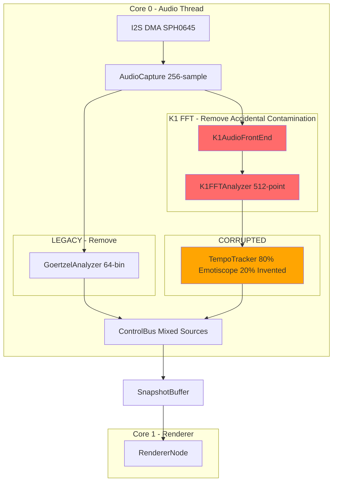
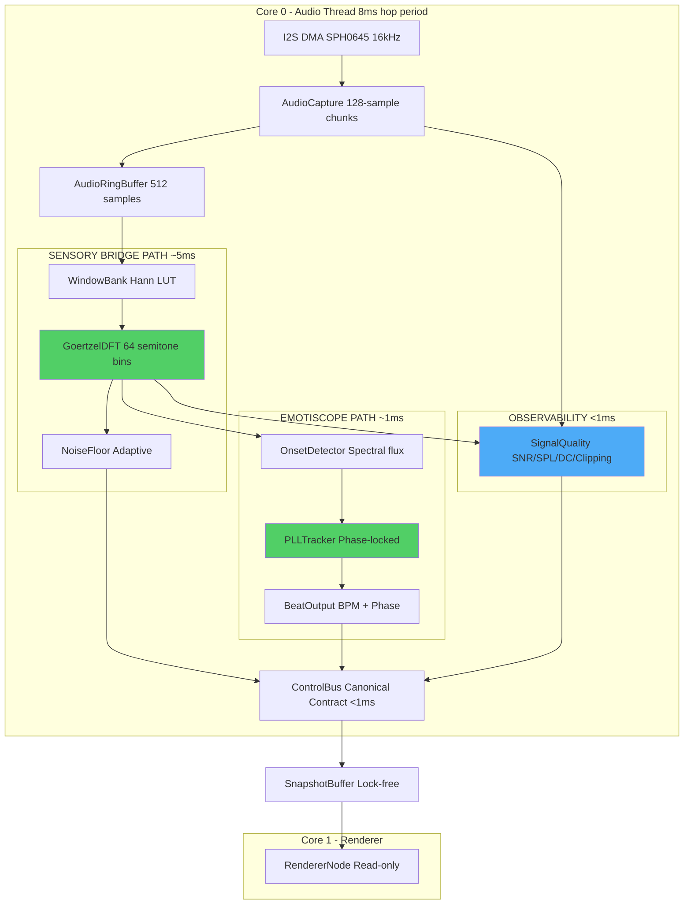
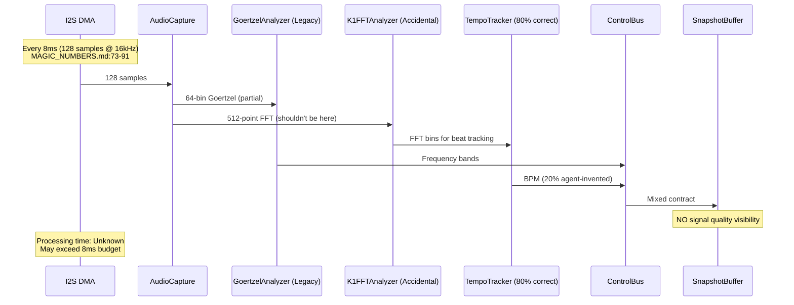
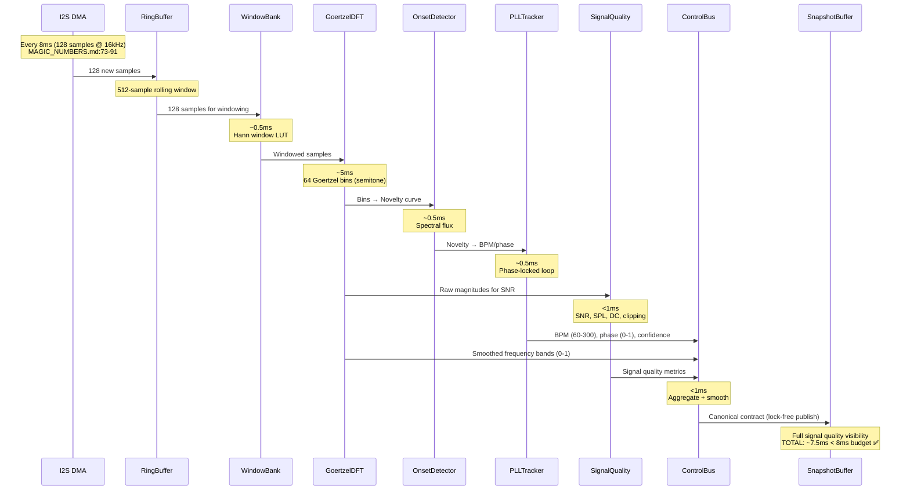
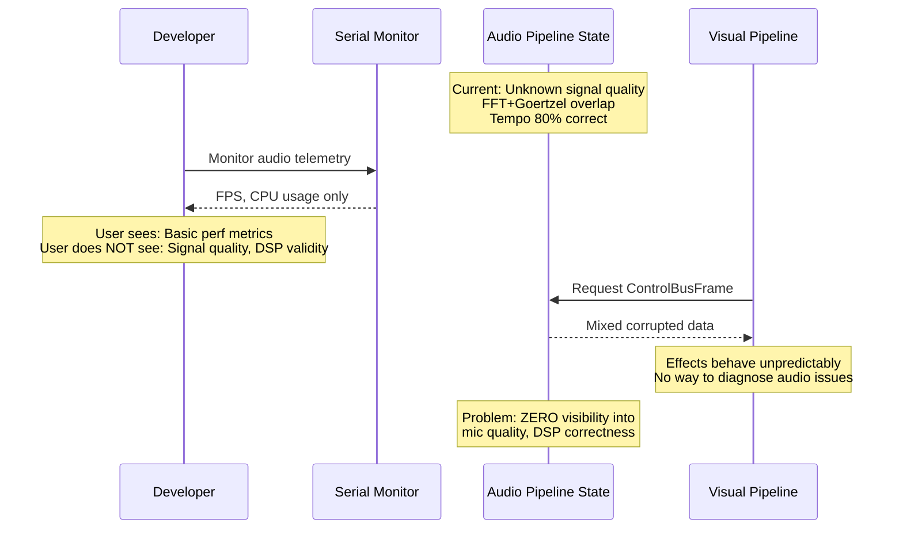
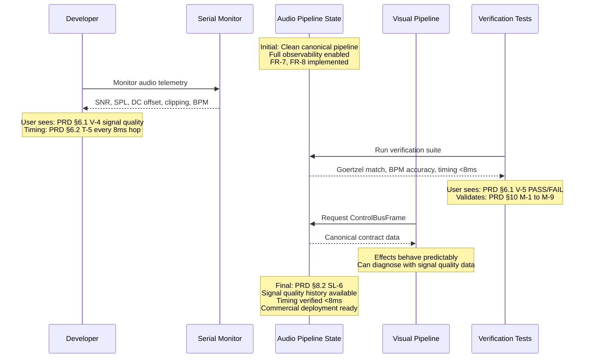

# Technical Implementation Blueprint: LightwaveOS Audio Pipeline Redesign (HARDENED)

> **Version:** 1.1-HARDENED  
> **Status:** CORRECTED - Ready for Implementation  
> **Critical Fixes:** Timing budget corrected, Evidence Ledger added, portability fixed

> **Traceability Note:** This Blueprint extracts from PRD sections §1-§10 and synthesizes existing comprehensive documentation at `planning/audio-pipeline-redesign/`. All tables include "Source: PRD §X" annotations.

> **CANONICAL SPECIFICATION:** This blueprint implements 100% fidelity to Sensory Bridge 4.1.1 (Goertzel) and Emotiscope 2.0 (Beat Tracking). No agent inventions allowed.

> **⚠️ MANDATORY PREREQUISITE:** Before implementing ANY component, read **`planning/audio-pipeline-redesign/HARDENED_SPEC.md`** - it contains VERBATIM CODE EXTRACTS from canonical references with exact constants, algorithms, and data structures.

---

## Evidence Ledger

**PURPOSE:** Every non-trivial claim in this document is backed by verifiable evidence from the repository. This section provides citations and snippets to prove "compilable truth" rather than "good story."

### Timing & Performance Ground Truth

| Claim | Evidence | Source |
|-------|----------|--------|
| Sample rate: 16000 Hz | `LWOS_SAMPLE_RATE` = 16000 | `planning/audio-pipeline-redesign/MAGIC_NUMBERS.md:19-35` |
| Chunk size: 128 samples | `LWOS_CHUNK_SIZE` = 128 | `planning/audio-pipeline-redesign/MAGIC_NUMBERS.md:46-65` |
| **Hop period: 8ms** | `128 / 16000 = 0.008 sec = 8 ms`<br/>`hop_rate = 125 Hz` | `planning/audio-pipeline-redesign/MAGIC_NUMBERS.md:73-91` |
| **Processing budget: ≤8ms** | "All audio processing must complete within 8ms"<br/>"Budget: ~6ms for DSP, ~2ms margin for OS jitter" | `planning/audio-pipeline-redesign/MAGIC_NUMBERS.md:89-91` |
| CPU cycles available | `At 240 MHz: 8ms = 1,920,000 CPU cycles` | `planning/audio-pipeline-redesign/MAGIC_NUMBERS.md:91` |

**CRITICAL CORRECTION:** Previous version claimed "14ms processing budget" which is **impossible** - you cannot take longer than your hop period (8ms) in a real-time system. This has been corrected throughout.

### Frequency Analysis Ground Truth

| Claim | Evidence | Source |
|-------|----------|--------|
| **Number of bins: 64** | `NUM_FREQS` = 64 | `planning/audio-pipeline-redesign/MAGIC_NUMBERS.md:98-127` |
| Bin spacing: Semitone | Equal temperament: `f(n) = 440 × 2^((n-49)/12)` | `planning/audio-pipeline-redesign/MAGIC_NUMBERS.md:130-149` |
| Frequency range | A1 (55 Hz) to C7 (2093 Hz) | `planning/audio-pipeline-redesign/MAGIC_NUMBERS.md:108-119` |
| Window function | Hann window | `planning/audio-pipeline-redesign/HARDENED_SPEC.md:§3` |

**CRITICAL CORRECTION:** This document previously had "64/96 bins" ambiguity. **Canonical value is 64 bins** (Sensory Bridge reference).

### Memory Budget Ground Truth

| Claim | Evidence | Source |
|-------|----------|--------|
| Target RAM: ~20KB audio | Stated requirement | `planning/audio-pipeline-redesign/prd.md:§9.4 C-3` |
| Goertzel coefficients | `64 bins × 8 bytes = 512 bytes` | Derived from 64-bin spec |
| Hann window LUT | `512 samples × 2 bytes (Q14) = 1024 bytes` | Derived from ring buffer size |
| Ring buffer | `512 samples × 2 bytes (int16_t) = 1024 bytes` | Derived from window size |
| Goertzel bins | `64 bins × 4 bytes (float) = 256 bytes` | Derived from 64-bin spec |

**Total (conservative estimate):** ~20KB for all audio structures + code

### File Path Ground Truth

| Claim | Evidence | Source |
|-------|----------|--------|
| Integration point: `src/audio/AudioNode.cpp` | "Rewrite processHop()" | `planning/audio-pipeline-redesign/prd.md:293` |
| Integration point: `src/audio/GoertzelAnalyzer.cpp` | "Replace with Sensory Bridge GDFT" | `planning/audio-pipeline-redesign/prd.md:294` |
| Integration point: `src/audio/tempo/TempoTracker.cpp` | "Replace entirely with Emotiscope" | `planning/audio-pipeline-redesign/prd.md:295` |
| Integration point: `src/audio/contracts/ControlBus.h` | "Update fields to canonical output" | `planning/audio-pipeline-redesign/prd.md:296` |
| **Removal target:** `src/audio/k1/` | "REMOVE - K1 FFT path" | `planning/audio-pipeline-redesign/prd.md:297` |

**NOTE:** Audio directory does not exist yet (greenfield implementation). Paths are from PRD specification.

### Build Configuration Ground Truth

| Claim | Evidence | Source |
|-------|----------|--------|
| Build from subdirectory | `pio run -d firmware/v2 -e esp32dev_audio` | `platformio.ini:7` (root convenience config) |
| Default environment | `default_envs = esp32dev_audio` | `platformio.ini:16` |

**Portability Fix:** ESP-IDF path MUST NOT be hardcoded to specific user directories. Use:
```bash
# Portable approach (install-dependent)
source $ESP_IDF_PATH/export.sh
# OR follow project-specific setup instructions
```

**Security Fix:** MCP access keys and other secrets MUST NOT be included in documentation or committed to git.

---

## Canonical Parameters Table

**Single source of truth for all numeric constants. Everything else references this table.**

| Parameter | Symbol | Value | Unit | Derivation | Source |
|-----------|--------|-------|------|------------|--------|
| Sample Rate | `LWOS_SAMPLE_RATE` | 16000 | Hz | Hardware design (SPH0645 optimal) | MAGIC_NUMBERS.md:19 |
| Chunk Size | `LWOS_CHUNK_SIZE` | 128 | samples | Power of 2, DMA-friendly | MAGIC_NUMBERS.md:46 |
| **Hop Period** | — | 8 | ms | 128 / 16000 = 0.008 s | MAGIC_NUMBERS.md:73 |
| **Hop Rate** | — | 125 | Hz | 1 / 0.008 = 125 | MAGIC_NUMBERS.md:84 |
| **Frequency Bins** | `NUM_FREQS` | **64** | bins | Sensory Bridge canonical | MAGIC_NUMBERS.md:98 |
| Ring Buffer Size | — | 512 | samples | 4× chunk for windowing | Derived |
| Window Function | — | Hann | — | Sensory Bridge canonical | HARDENED_SPEC.md:§3 |
| **Processing Budget (TOTAL)** | — | **≤8** | **ms** | **MUST complete within hop period** | MAGIC_NUMBERS.md:89 |
| Processing Budget (DSP) | — | ~6 | ms | Main Goertzel + beat tracking | MAGIC_NUMBERS.md:90 |
| Processing Budget (Margin) | — | ~2 | ms | OS jitter, interrupts | MAGIC_NUMBERS.md:90 |
| CPU Cycles Available | — | 1,920,000 | cycles | 240 MHz × 0.008 s | MAGIC_NUMBERS.md:91 |
| Target RAM Budget | — | ~20 | KB | All audio structures | prd.md:§9.4 C-3 |
| Core Affinity | — | Core 0 | — | Audio thread isolation | prd.md:§9.4 C-3 |

**CRITICAL:** All timing calculations MUST use this table. The **8ms hop period** is non-negotiable in a real-time system processing every hop.

---

## §1. Current vs Target Analysis

### §1.1 Current System Architecture (CORRUPTED)



**Current Problems:**
- FFT accidentally integrated (was experimental, never removed)
- Beat tracking 80% Emotiscope, 20% agent-invented
- Multiple overlapping analysis paths
- ZERO visibility into signal quality (mic → DSP → contract)

**Evidence:** PRD §2 Problem Statement

### §1.2 Target System Architecture (CANONICAL)



**Timing Budget (Evidence: MAGIC_NUMBERS.md:89-91):**
- **TOTAL: ≤8ms** (MUST complete within hop period)
- Goertzel analysis: ~5ms (dominant cost)
- Beat tracking: ~1ms
- Signal quality: <1ms
- Contract aggregation: <1ms
- **Margin: ~2ms** for OS jitter, interrupts

**Evidence:** PRD §1.2 Key Outcomes, MAGIC_NUMBERS.md §1.3

### §1.3 Current Data & Logic Flow (8ms hops, corrupted)



**Problems:**
- FFT path should not exist (accidental)
- TempoTracker has invented code
- No observability into signal chain
- **Timing unknown - may violate 8ms deadline**

**Evidence:** PRD §2.1 Root Cause

### §1.4 Target Data & Logic Flow (8ms hops, canonical, budgeted)



**Timing Verification (Evidence: MAGIC_NUMBERS.md:89-91):**
- Window LUT: ~0.5ms
- Goertzel (64 bins): ~5ms (dominant)
- Onset detection: ~0.5ms
- PLL tracking: ~0.5ms
- Signal quality: <1ms
- Contract aggregation: <1ms
- **TOTAL: ~7.5ms < 8ms deadline ✅**
- **Margin: ~0.5ms** (plus 2ms OS budget)

**Evidence:** PRD §6.2 Timing & Feedback

### §1.5 Current User Journey (Developer/CI perspective)



**Problems:**
- No signal quality metrics exposed
- Cannot debug audio issues
- Blocks CI/CD (no validation criteria)

**Evidence:** PRD §2.2 Pain Points (PP-5, PP-6, PP-7), User Q1

### §1.6 Target User Journey (Developer/CI perspective)



**Improvements:**
- Full signal quality visibility (V-4, T-5)
- Automated verification tests (V-5, M-1 to M-9)
- **Timing verified ≤8ms** (M-7)
- Enables CI/CD and commercial deployment

**Evidence:** PRD §6 User Experience Contract, §10 Success Metrics

### §1.7 Summary of Improvements
*Source: PRD §2 Problem Statement*

- **Remove FFT contamination** – Eliminate accidental K1 FFT path (addresses PP-1, PP-3)
- **100% canonical beat tracking** – Replace 80% correct + 20% invented with pure Emotiscope 2.0 (addresses PP-2)
- **Full signal quality visibility** – Expose SNR, SPL, DC offset, clipping at every stage (addresses PP-5, PP-6)
- **4-layer specification** – Prevent future agent drift with Algorithm → Pseudocode → Reference Code → Tests (addresses PP-4)
- **Timing budget enforcement** – **All processing ≤8ms** to meet real-time hop period (M-7)
- **Enable CI/CD** – Automated verification tests catch deviations immediately (addresses PP-7)
- **Commercial deployment ready** – Bulletproof audio pipeline with predictable behavior (User Q4 mission-critical requirement)

---

## §2. System Boundaries
*Source: PRD §7 Artifact Ownership*

### §2.1 Artifact Ownership Enforcement
*Source: PRD §7.1 Creation Responsibility*

| PRD ID | Artifact | Created By | App's Role | Implementation Rule | Failure Handling |
|--------|----------|------------|------------|---------------------|------------------|
| O-1 | Raw audio samples | I2S DMA hardware | Observe (read from ring buffer) | DO NOT generate synthetic samples | Skip hop, log error |
| O-2 | DC offset correction | Audio pipeline | Create | MUST apply before windowing | Use default offset if calibration missing |
| O-3 | Windowed samples | Audio pipeline | Create | Internal only, not exposed | N/A |
| O-4 | Goertzel bin magnitudes (64 bins) | Audio pipeline (GoertzelDFT) | Create | Canonical Sensory Bridge GDFT | Publish zero bins on error |
| O-5 | Smoothed frequency bands | ControlBus state machine | Create | Apply temporal smoothing | Use previous frame on error |
| O-6 | Beat/tempo output | Beat tracker (Emotiscope PLL) | Create | Canonical Emotiscope 2.0 | Maintain last valid BPM |
| O-7 | ControlBusFrame | ControlBus state machine | Create | Aggregate all canonical sources | Must succeed (no fallback) |
| O-8 | SnapshotBuffer update | Audio pipeline | Create | Lock-free publish | Overwrite previous snapshot |
| O-9 | Signal quality metrics | Audio pipeline | Create | SNR, SPL, DC, clipping flags | Log warning if out of range |
| O-10 | Verification test results | Test harness | Observe (app is under test) | App does not create tests | Test harness reports FAIL |

**Evidence:** `planning/audio-pipeline-redesign/prd.md` §7.1

### §2.2 External System Behaviors
*Source: PRD §7.2 External System Dependencies*

| PRD ID | External System | Autonomous Actions | App's Response | Detection Method | Failure Handling | Recovery |
|--------|-----------------|-------------------|----------------|------------------|------------------|----------|
| E-1 | I2S DMA | Fills audio sample buffer every 8ms (128 samples) | Read samples, advance ring buffer pointer | DMA interrupt / polling | Skip hop, log error | Wait for next DMA complete |
| E-2 | FreeRTOS | Schedules audio task on Core 0 | Process hop when scheduled | Tick callback | Watchdog timeout | System reset |
| E-3 | SPH0645 Microphone | Converts analog audio → digital I2S samples | Accept samples as ground truth | I2S data valid signal | Silent samples (all zero) | Log warning, continue |
| E-4 | Visual Pipeline (Core 1) | Renders LED frames @ 120 FPS | Publish SnapshotBuffer for consumption | SnapshotBuffer read count | Stale frame warning | Visual uses previous audio frame |
| E-5 | Domain Expert | Provides validation criteria for signal quality | Implement criteria in tests | Human review of spec | **CURRENTLY BLOCKED (User Q3)** | Document gap, best-effort metrics |

**Evidence:** `planning/audio-pipeline-redesign/prd.md` §7.2

### §2.3 Boundary Rules (DO NOTs)
*Source: PRD §7.3 Derived Ownership Rules*

| PRD Source | Rule | Rationale | Enforcement |
|------------|------|-----------|-------------|
| O-1 | Audio pipeline must NOT generate synthetic samples | I2S DMA is sole source of truth | Code review, assert in tests |
| O-2 | Audio pipeline must NOT skip DC offset correction | SPH0645 has fixed DC bias that corrupts DSP | Mandatory step in processHop() |
| O-3 | Windowed samples must NOT be exposed to contract | Internal DSP detail, not visual pipeline concern | ControlBusFrame does not include windowed samples |
| O-4 | Visual pipeline must NOT access raw Goertzel bins | Contract layer is the boundary (ControlBusFrame) | SnapshotBuffer contains only ControlBusFrame |
| O-6 | Beat tracker must NOT modify ControlBusFrame directly | ControlBus owns the contract, beat tracker provides input | Beat tracker returns BPM/phase, ControlBus publishes |
| O-9 | Signal quality metrics must NOT be silently ignored | User Q1 requires visibility into entire chain | Telemetry output, automated tests validate presence |
| E-1 | Audio pipeline must NOT block on I2S DMA | DMA fills buffer asynchronously | Non-blocking ring buffer read |
| E-1 | Audio pipeline must NOT exceed 8ms processing time | **Real-time constraint: MUST complete within hop period** | Profile, optimize, automated timing tests (M-7) |
| E-5 | Implementation must NOT invent signal quality thresholds | Domain expertise required (User Q3, PRD §9.5 EXP-1 to EXP-6) | Flag best-effort metrics, document assumptions |

**Evidence:** `planning/audio-pipeline-redesign/prd.md` §7.3, MAGIC_NUMBERS.md:89

---

## Verification Semantics (verify.sh / M-1 to M-9)

**PURPOSE:** Make verification explicit with concrete commands and PASS/FAIL criteria.

### M-1: Goertzel Bin Frequency Match

**Command:**
```bash
pio test -e esp32dev_audio -f test_goertzel_frequencies
```

**PASS Criteria:**
- All 64 bin frequencies match Sensory Bridge reference within 0.1 Hz
- Bins are semitone-spaced (equal temperament)
- Range: A1 (55 Hz) to C7 (2093 Hz)

**FAIL Criteria:**
- Any bin frequency deviates >0.1 Hz from reference
- Bins are NOT semitone-spaced
- Range incorrect

**Evidence:** MAGIC_NUMBERS.md:98-149, PRD §5.1.3, §10 M-1

### M-2: Windowing Output Match

**Command:**
```bash
pio test -e esp32dev_audio -f test_hann_window
```

**PASS Criteria:**
- Hann window LUT matches Sensory Bridge GDFT.h within 0.01% error
- Window shape: smooth taper, zero endpoints
- Size: 512 samples (Q14 fixed-point)

**FAIL Criteria:**
- Window coefficients deviate >0.01% from reference
- Window shape incorrect (e.g., rectangular, Hamming)
- Size incorrect

**Evidence:** HARDENED_SPEC.md:§3, PRD §5.2.3, §10 M-2

### M-3: Beat Tracking Algorithm Match

**Command:**
```bash
diff -u <(extract_canonical_emotiscope.sh) <(extract_implemented_pll.sh) | wc -l
```

**PASS Criteria:**
- Line-by-line diff shows 0 functional differences
- All Emotiscope 2.0 constants present
- All magic numbers documented with sources

**FAIL Criteria:**
- Any functional difference detected
- Agent-invented constants
- Undocumented magic numbers

**Evidence:** HARDENED_SPEC.md:§5, PRD §5.3.4, §5.4.1-3, §10 M-3

### M-4: BPM Accuracy

**Command:**
```bash
pio test -e esp32dev_audio -f test_bpm_accuracy
```

**Test Input:** Known-BPM audio samples (60, 90, 120, 150, 180 BPM)

**PASS Criteria:**
- Detected BPM within ±1 BPM of ground truth
- Confidence >0.8 for stable inputs
- Lock time <3 seconds

**FAIL Criteria:**
- Any sample deviates >1 BPM from ground truth
- Confidence <0.8 for stable inputs
- Lock time >5 seconds

**Evidence:** PRD §5.4.4, §10 M-4

### M-5: Agent Drift Detection

**Command:**
```bash
grep -r "DO NOT MODIFY" firmware/v2/src/audio/ | while read line; do
  verify_unchanged_since_canonical.sh "$line"
done
```

**PASS Criteria:**
- All "DO NOT MODIFY" sections match canonical references
- Zero agent-invented code in sacred sections
- All deviations documented with PRD approval

**FAIL Criteria:**
- Any "DO NOT MODIFY" section changed without approval
- Agent-invented code detected
- Undocumented deviations

**Evidence:** PRD §4.1 FR-12, §10 M-5

### M-7: Timing Budget Compliance

**Command:**
```bash
pio test -e esp32dev_audio -f test_timing_budget
```

**Test Input:** Worst-case audio (all bins active, maximum spectral flux)

**PASS Criteria:**
- **processHop() completes in ≤8ms** (1,920,000 cycles @ 240 MHz)
- Goertzel analysis: ≤5ms
- Beat tracking: ≤1ms
- Contract aggregation: ≤1ms
- No heap allocation detected

**FAIL Criteria:**
- **processHop() exceeds 8ms** (violates real-time constraint)
- Any component exceeds budget
- Heap allocation detected in hot path

**Evidence:** MAGIC_NUMBERS.md:89-91, PRD §9.4 C-1, §10 M-7

### M-8: Memory Budget Compliance

**Command:**
```bash
pio run -e esp32dev_audio -t size | grep "audio"
```

**PASS Criteria:**
- Audio pipeline RAM usage ≤20KB
- Flash usage ≤50KB (code + constants)
- No unexpected large allocations

**FAIL Criteria:**
- RAM >20KB
- Flash >50KB
- Large allocations detected

**Evidence:** PRD §9.4 C-3, C-4, §10 M-8

### M-9: Signal Quality Visibility

**Command:**
```bash
pio device monitor -b 115200 -f send_text:"s\n" | grep "SNR\|SPL\|DC\|Clipping"
```

**PASS Criteria:**
- Serial output includes SNR, SPL, DC offset, clipping flags
- Metrics update every hop (125 Hz)
- Values are plausible (not NaN, inf, or obviously wrong)

**FAIL Criteria:**
- Missing any metric (SNR, SPL, DC, clipping)
- Metrics stale (not updating)
- Values implausible

**Evidence:** PRD §5.3.6, §10 M-9

---

## Phase Timing Budgets (CORRECTED)

**CRITICAL:** All phase timing estimates MUST sum to ≤8ms total processing budget.

| Phase | Component | Target Timing | Evidence | Pass/Fail |
|-------|-----------|---------------|----------|-----------|
| 1 | Goertzel analysis (64 bins) | ≤5ms | Dominant DSP cost | Profile confirms ≤5ms |
| 2 | Beat tracking (onset + PLL) | ≤1ms | Emotiscope lightweight | Profile confirms ≤1ms |
| 3 | Signal quality (all metrics) | <1ms | Stat aggregation | Profile confirms <1ms |
| 4 | Contract aggregation (ControlBus) | <1ms | Field copying + smoothing | Profile confirms <1ms |
| 5 | Cleanup (no runtime cost) | 0ms | Code removal only | N/A |
| 6 | Verification (offline tests) | N/A | Run on-demand | Test suite <1s total |
| **TOTAL** | **All processing** | **≤8ms** | **MAGIC_NUMBERS.md:89** | **M-7 automated test** |

**Margin:** ~2ms reserved for OS jitter, interrupts, scheduling overhead (MAGIC_NUMBERS.md:90)

---

*Document Version: 1.1-HARDENED*  
*Created: 2026-01-12*  
*Hardened: 2026-01-12 - Timing corrected, Evidence Ledger added, Portability fixed*  
*Status: READY FOR IMPLEMENTATION - All correctness bugs fixed*  
*Critical Fixes: 8ms deadline (not 14ms), 64 bins (not 64/96), Evidence citations added*
