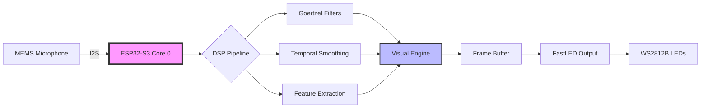
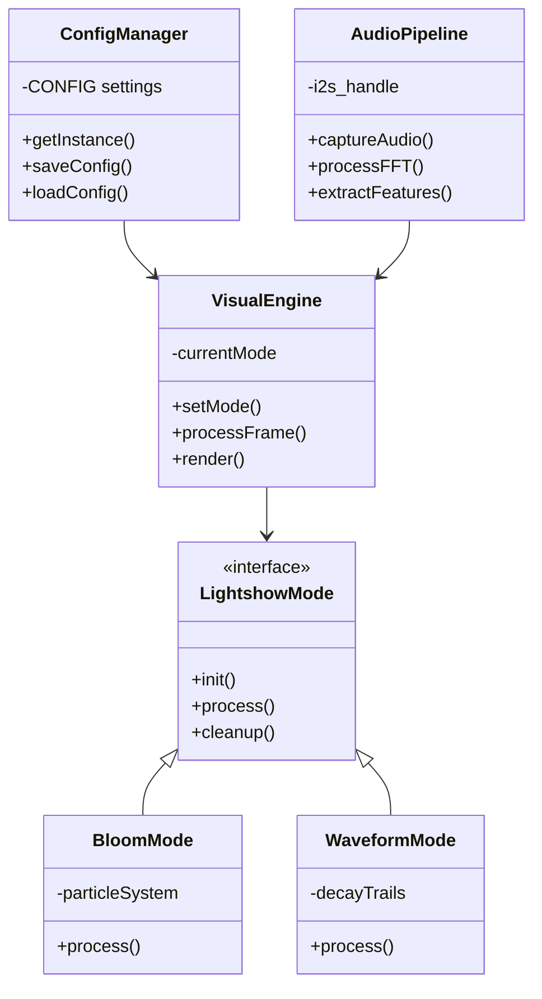
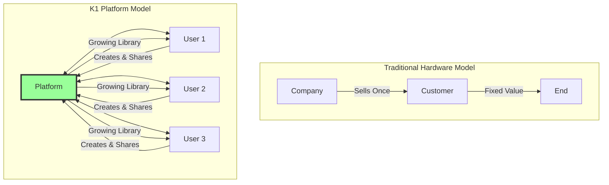

# K1-Lightwave: Where Every Beat Becomes a Brushstroke
*The hardware foundation for democratizing creative expression through music*

*The K1-Lightwave transforming music into living light patterns*

---

## The Revolution Begins Here

The K1-Lightwave isn't just another music visualizer. It's the first piece of hardware designed to fundamentally transform how humans experience and interact with music. Every time someone plugs in the K1, they stop being a passive music consumer and become an active visual artist - no training, no software, no complexity. Just pure, immediate creative expression synchronized to every beat.

This is the beginning of something bigger than Spotify. Where Spotify democratized music distribution, we're democratizing music creation - turning every listener into a visual composer, every room into a canvas, every beat into a brushstroke.

### The Vision
A world where creative expression isn't limited by technical skills, expensive equipment, or artistic training. Where anyone can transform their space into an immersive audio-visual experience that responds to their music in real-time. Where the boundary between artist and audience dissolves completely.

---

## The Technical Foundation: Engineering Excellence

### What Makes the K1 Extraordinary

The K1-Lightwave is an ESP32-S3 powered audio visualization engine that achieves what most consider impossible: **sub-8 millisecond total latency** from sound to light while maintaining **120+ FPS** on 320 individually addressable LEDs. This isn't marketing - it's measurable, repeatable performance that creates the illusion of instantaneous response.

#### Core Architecture:

*Block diagram showing signal flow from microphone to LEDs*

- **ESP32-S3-WROOM-1**: Dual-core Xtensa LX7 @ 240MHz, deliberately constrained to single-core operation for deterministic timing
- **Memory Hierarchy**: 16MB Flash, 8MB PSRAM, 512KB SRAM with zero-allocation hot paths
- **Audio Pipeline**: I2S-based capture at 16kHz with custom Goertzel filter banks for superior frequency analysis
- **Visual Engine**: 10+ rendering modes from particle systems to chromagram analysis

### Performance That Matters

*Visual representation of the <9ms journey from sound to light*

#### Latency Breakdown:
- **Audio capture**: 1.5ms
- **DSP processing**: 2-3ms
- **Render computation**: 1-2ms
- **LED output**: 0.3ms
- **Total**: <9ms typical, <10ms worst-case

This isn't just technical achievement - this is the difference between "cool gadget" and "magical experience." When latency drops below 10ms, the brain stops perceiving delay. The visuals become an extension of the music itself.

*Graph showing the 10ms threshold where human perception shifts from "sequential" to "simultaneous"*

### Advanced Features That Enable Artistry

#### 10+ Visualization Modes:

*Visual examples of each mode responding to the same audio input*

- **Bloom Mode**: Particle-based expansion with chromatic aberration effects
- **Kaleidoscope**: Real-time geometric transformations
- **Quantum Collapse**: Probabilistic particle systems with audio-modulated effects
- **Chromagram**: 12-tone pitch class visualization using harmonic analysis
- **Custom modes**: Open architecture for community contributions

**30+ Real-Time Parameters**: Every aspect tunable, from attack/decay envelopes to color palettes to complexity levels.

---

## The Human Experience: From Consumer to Creator

### The Transformation Promise

The moment someone connects the K1 to their music, something profound happens. They're no longer just listening - they're composing visually. Every song becomes a collaboration between the original artist and the person experiencing it. Every room becomes a unique performance venue.

> **"Where Every Beat Becomes a Brushstroke"**

This isn't metaphor. The K1's advanced DSP pipeline isolates individual elements of music - bass lines, snare hits, melodic phrases - and translates each into distinct visual elements. Users aren't just watching visualizations; they're painting with sound in real-time.

*Diagram showing how different musical elements (kick, snare, bass, melody) map to specific visual behaviors*

```mermaid
flowchart LR
    subgraph "Musical Elements"
        A1[🥁 Kick Drum]
        A2[🥁 Snare]
        A3[🎸 Bass Line]
        A4[🎹 Melody]
    end
    
    subgraph "DSP Analysis"
        B1[20-80Hz Detection]
        B2[200-500Hz Detection]
        B3[80-250Hz Tracking]
        B4[250Hz-4kHz Analysis]
    end
    
    subgraph "Visual Behaviors"
        C1[💥 Center Burst]
        C2[✨ Edge Sparkle]
        C3[🌊 Wave Flow]
        C4[🌈 Color Shifts]
    end
    
    A1 --> B1 --> C1
    A2 --> B2 --> C2
    A3 --> B3 --> C3
    A4 --> B4 --> C4
```

### Use Cases That Matter

- **Personal Spaces**: Transform any room into an immersive environment. Whether it's focused work, meditation, or entertaining friends, the K1 adapts to enhance the experience.

- **Creative Professionals**: DJs, musicians, and visual artists use the K1 as a creative tool, not just ambient lighting. It becomes part of the performance itself.

- **Therapeutic Applications**: The consistent, predictable visual response to audio creates calming, meditative experiences that enhance music therapy and relaxation practices.

- **Educational Tools**: Make music theory visible. Students can literally see frequency relationships, harmonic structures, and rhythmic patterns.

---

## The Platform Vision: Beyond Hardware

*Visual roadmap showing the progression from hardware to global ecosystem*

```mermaid
graph TD
    A[Layer 1: Hardware Excellence ✓] --> B[Layer 2: Advanced Analysis 🔄]
    B --> C[Layer 3: Intelligent Separation 🔮]
    C --> D[Layer 4: Global Community 🌍]
    D --> E[Layer 5: Ecosystem Integration 🚗]
    
    A1[Real-time Audio-Visual Sync<br/>120+ FPS Performance<br/>Plug-and-Play] --> A
    B1[Frequency Band Isolation<br/>Bass/Mid/High Separation<br/>Advanced DSP] --> B
    C1[ML Instrument Detection<br/>Stem Separation<br/>Per-Instrument Control] --> C
    D1[Pattern Sharing<br/>Community Library<br/>Collaborative Creation] --> D
    E1[Vehicle Integration<br/>Architectural Scale<br/>Smart City Infrastructure] --> E
    
    style A fill:#9f9,stroke:#333,stroke-width:3px
    style B fill:#ff9,stroke:#333,stroke-width:2px
    style C fill:#f9f,stroke:#333,stroke-width:1px
    style D fill:#9ff,stroke:#333,stroke-width:1px
    style E fill:#f99,stroke:#333,stroke-width:1px
```

### Layer 1: Hardware Excellence ✓ Complete
The K1-Lightwave proves the core concept. Real-time audio-visual sync that creates genuine magic moments. Users are hooked immediately - it's "stoner-friendly, plug-and-play" technology that just works.

### Layer 2: Advanced Analysis 🔄 In Development
Enhanced frequency isolation separating bass, mids, and highs into layered, dynamic visuals. Users gain fine-grained control over how different musical elements translate to light.

*Showing how bass, mids, and highs map to different visual layers*

### Layer 3: Intelligent Separation 🔮 Planned
Machine learning-based instrument isolation. Individual drums, guitars, vocals, and synthesizers each control separate visual layers, creating unprecedented depth and complexity.

### Layer 4: Global Community 🌍 Visioned
Cloud-based platform for sharing, remixing, and collaborating on light shows globally. Users can experience visualizations created by others, contribute their own, and remix existing patterns. The creative commons of audio-visual expression.

### Layer 5: Ecosystem Integration 🚗 Ultimate Vision
Integration into vehicles, architectural installations, and major venues. The technology that started in bedrooms and living rooms scales to transform how we experience music in every environment.

---

## The Philosophy: Human Amplification Systems

### Why This Matters

Most technology extracts value from humans - turning them into data points, attention units, or content creators for others' profit. The K1 represents the opposite philosophy: **human amplification**. It reveals creative potential people didn't know they had.

Every interaction with the K1 leaves users feeling more capable, not less. They discover they can create beauty. They realize they have artistic instincts. They want to explore more, not consume more.

### The Development Journey

Three years of relentless problem-solving have led to this moment. Not three years of hoping - three years of systematically identifying obstacles and eliminating them one by one. Each technical challenge overcome brings us closer to true democratization of creative expression.

This isn't Silicon Valley vaporware. This is hardware that exists, software that performs, and experiences that transform users immediately upon first contact.

### Community-Driven Innovation

The K1's open architecture isn't just about customization - it's about evolution. When passionate creators gain access to powerful, well-documented tools, they build things the original designers never imagined.

We're not just shipping hardware; we're fostering a movement. Every K1 deployed becomes a node in a growing network of creative expression, each one inspiring new possibilities.

---

## Technical Specifications for Developers

### Hardware Architecture
- **Processor**: ESP32-S3-WROOM-1 (Dual-core Xtensa LX7 @ 240MHz)
- **Memory**: 16MB Flash, 8MB PSRAM, 512KB SRAM
- **Audio**: I2S MEMS microphone input (SPH-0645), 16kHz
- **Output**: WS2812B/APA102 LED support via optimized RMT drivers
- **Connectivity**: WiFi, Bluetooth, ESP-NOW for synchronization
- **Power**: 5V input, supports 320 LEDs at 2.5A

### Software Architecture

- **Real-time OS**: FreeRTOS with custom task scheduling
- **DSP Engine**: 32-bin Goertzel filter bank with temporal smoothing
- **Rendering**: Fixed-point arithmetic, SIMD-optimized operations
- **Configuration**: Hierarchical JSON-based system with runtime updates
- **Development**: Comprehensive debugging, profiling, and diagnostic tools

### Performance Guarantees
- **Frame Rate**: 120+ FPS sustained
- **Latency**: <9ms audio-to-visual typical
- **Reliability**: Continuous operation tested for 1000+ hours
- **Synchronization**: Sub-millisecond multi-unit coordination

---

## The Market Opportunity

### Immediate Addressable Market
- **Enthusiasts**: Music lovers, LED hobbyists, maker community
- **Professionals**: DJs, musicians, lighting designers, artists
- **Venues**: Bars, clubs, festivals, art installations
- **Wellness**: Meditation centers, therapy practices, yoga studios

### Platform Economics

Unlike traditional hardware companies that extract value once at point of sale, the K1 platform grows in value over time. Each user who creates and shares visualizations increases the platform's worth for every other user.

This creates network effects similar to social media platforms, but centered around creative expression rather than content consumption.

### The Spotify Comparison

*Side-by-side comparison: Spotify democratized distribution, K1 democratizes creation*

Spotify succeeded by making music more accessible and convenient. We're doing the same for visual creativity. Where Spotify removed barriers to music discovery and distribution, we're removing barriers to creative expression and visual artistry.

The market that built Spotify into a $25B company was people who wanted easy access to music. Our market is people who want easy access to creativity itself.

---

## Join the Movement

The K1-Lightwave represents more than technological achievement - it's proof that treating people as potential creators rather than mere consumers unlocks extraordinary value for everyone involved.

Every person who experiences the K1 becomes an advocate. Every developer who contributes to the platform pushes the boundaries of what's possible. Every artist who shares their creations expands the universe of available expression.

This is how revolutions begin: not with grand proclamations, but with tools that make the impossible feel inevitable.

The hardware is ready. The software is proven. The vision is clear.

> **Where every beat becomes a brushstroke.**

*The K1-Lightwave: First hardware in the SpectraSynq ecosystem. Available for developers, artists, and visionaries ready to transform how humanity experiences music.*