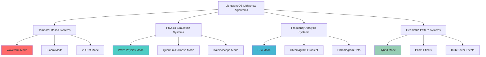
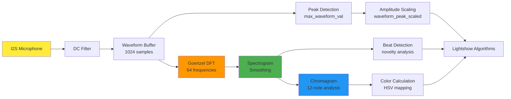
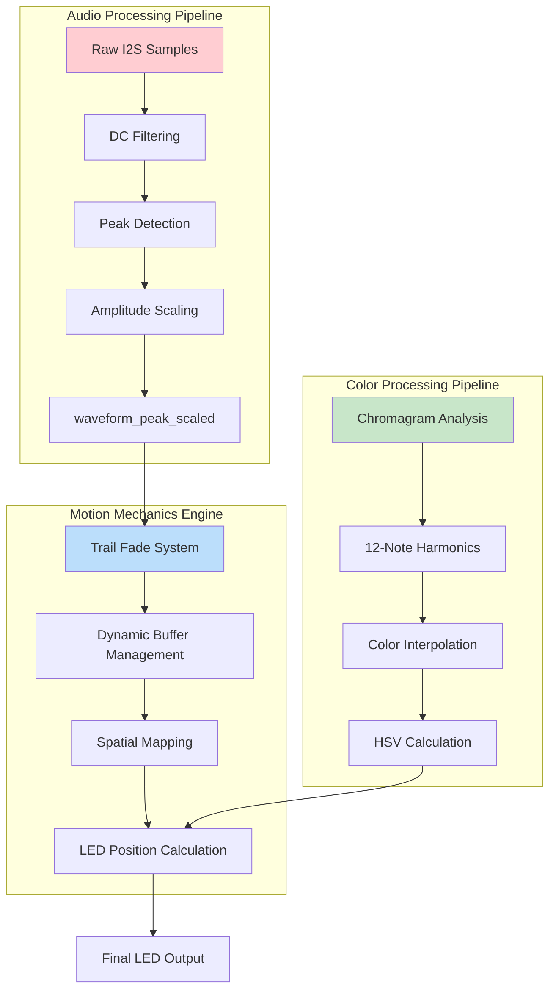
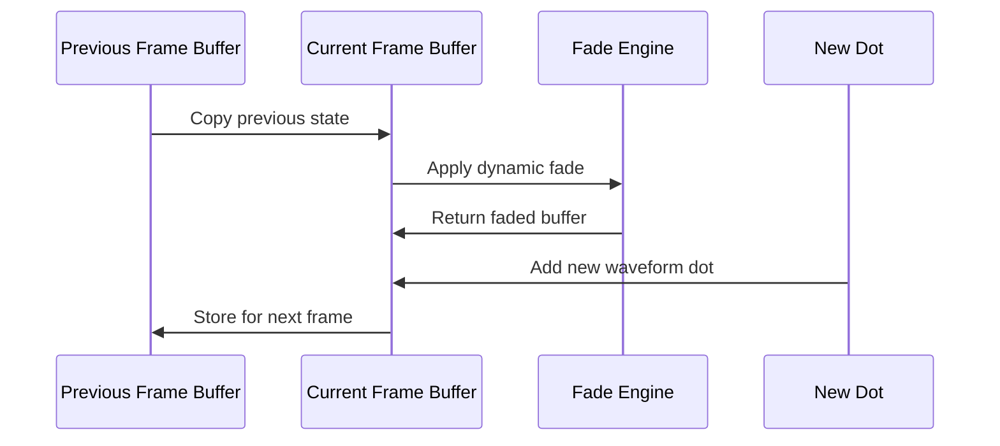
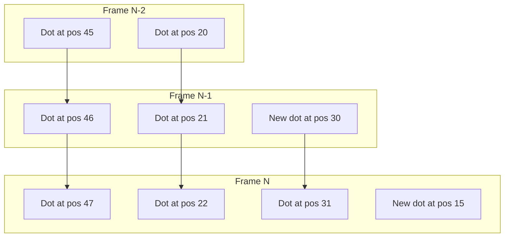
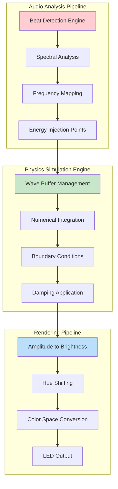
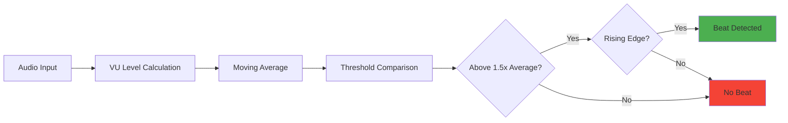
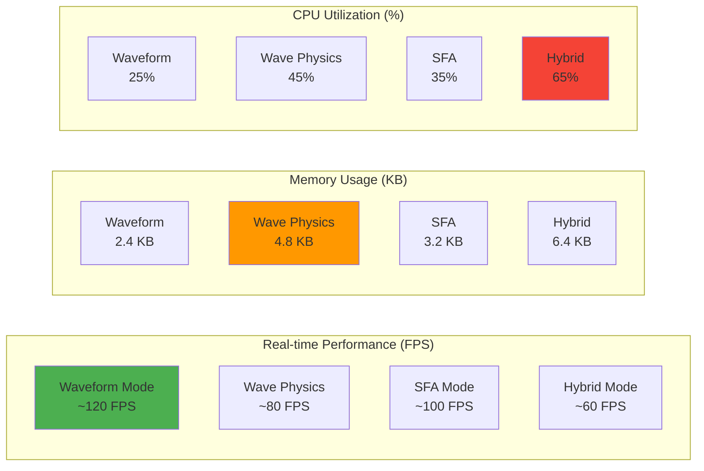
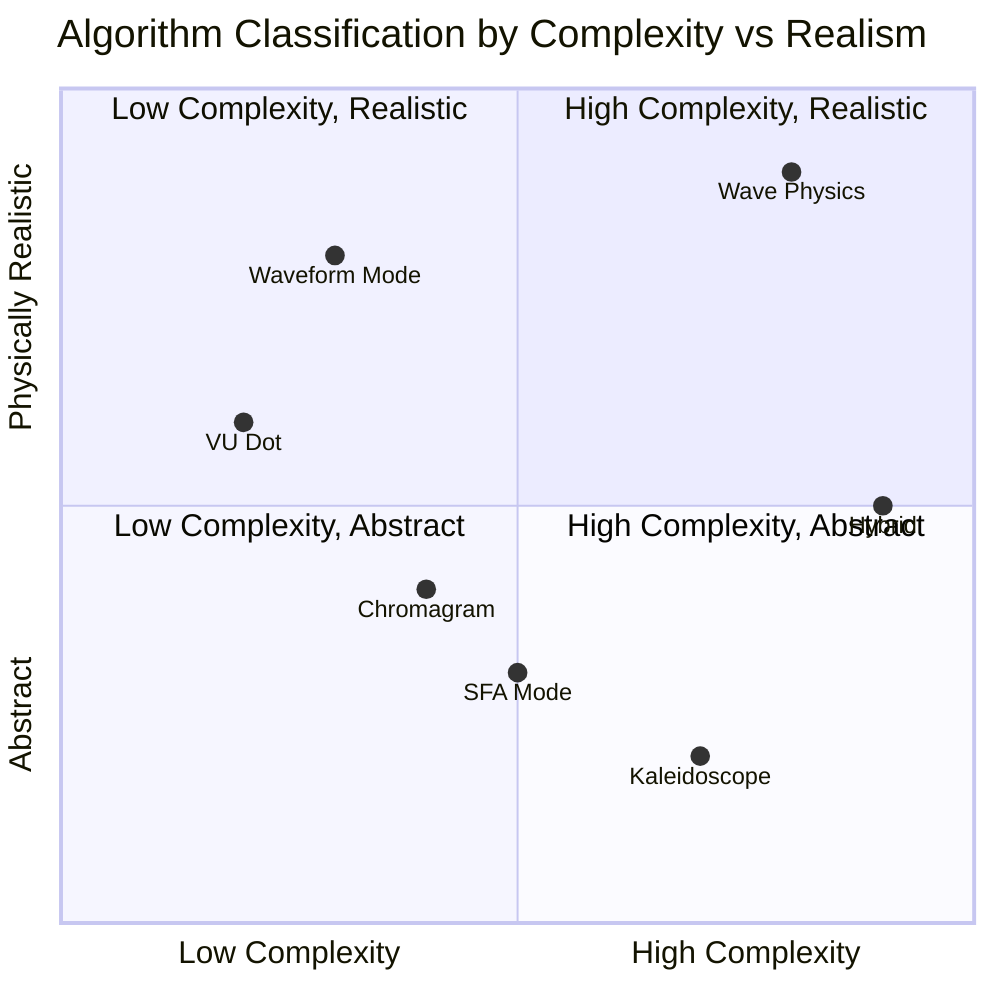
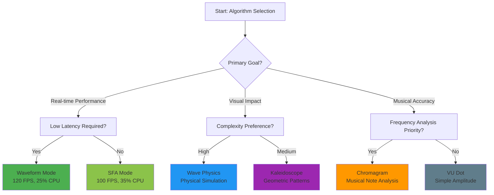

# COMPREHENSIVE LIGHTSHOW MOTION MECHANICS ANALYSIS
## LightwaveOS Technical Deep Dive

*A Complete Technical Deconstruction of Audio-Reactive LED Visualization Algorithms*

---

## VISUAL OVERVIEW: ALGORITHM TAXONOMY



## AUDIO PIPELINE FOUNDATION



---

## WAVEFORM MODE: COMPREHENSIVE TECHNICAL ANALYSIS

### ARCHITECTURAL OVERVIEW



### SUBSYSTEM BREAKDOWN: TRAIL FADE SYSTEM

The Trail Fade System represents one of the most sophisticated aspects of the waveform mode, implementing a **dynamic persistence memory** that creates visually compelling audio-reactive trails.

#### Mathematical Foundation
```cpp
// Core trail fade algorithm
float abs_amp = abs(waveform_peak_scaled);
if (abs_amp > 1.0f) abs_amp = 1.0f;

float max_fade_reduction = 0.10;
SQ15x16 dynamic_fade_amount = 1.0 - (max_fade_reduction * abs_amp);

// Apply fade to entire LED buffer
for (uint16_t i = 0; i < NATIVE_RESOLUTION; i++) {
    leds_16[i].r *= dynamic_fade_amount;
    leds_16[i].g *= dynamic_fade_amount;
    leds_16[i].b *= dynamic_fade_amount;
}
```

#### Trail Persistence Characteristics

| Audio Amplitude | Fade Factor | Trail Length | Visual Effect |
|----------------|-------------|--------------|---------------|
| 0.0 (Silent) | 1.00 | Infinite | Static trails |
| 0.2 (Quiet) | 0.98 | ~50 frames | Long persistence |
| 0.5 (Medium) | 0.95 | ~20 frames | Moderate trails |
| 0.8 (Loud) | 0.92 | ~12 frames | Short, intense |
| 1.0 (Peak) | 0.90 | ~10 frames | Rapid decay |

#### Buffer Management Strategy



### SUBSYSTEM BREAKDOWN: SPATIAL MAPPING ENGINE

The Spatial Mapping Engine transforms one-dimensional audio waveform data into two-dimensional LED strip positioning with **sub-pixel accuracy** and **center-based amplitude mapping**.

#### Position Calculation Algorithm
```cpp
// Amplitude normalization and clamping
float amp = waveform_peak_scaled;
if (amp > 1.0f) amp = 1.0f;
else if (amp < -1.0f) amp = -1.0f;

// Center-based position calculation
int center = NATIVE_RESOLUTION / 2;
float pos_f = center + amp * (NATIVE_RESOLUTION / 2.0f);

// Sub-pixel rounding with signed bias
int pos = int(pos_f + (pos_f >= 0 ? 0.5 : -0.5));

// Boundary clamping
if (pos < 0) pos = 0;
if (pos >= NATIVE_RESOLUTION) pos = NATIVE_RESOLUTION - 1;
```

#### Spatial Mapping Visualization

```
LED Strip Layout (64 LEDs):
┌─────────────────┬─────────────────┐
│ 0              31              63 │
│ ◄─── Negative ──┼── Positive ───► │
│   Amplitude     │   Amplitude     │
└─────────────────┴─────────────────┘
                Center (32)

Amplitude Mapping:
-1.0 → LED 0   (Leftmost)
-0.5 → LED 16  (Quarter left)
 0.0 → LED 32  (Center)
+0.5 → LED 48  (Quarter right)
+1.0 → LED 63  (Rightmost)
```

### SUBSYSTEM BREAKDOWN: SCROLL MECHANICS

The Scroll Mechanics implement a **vertical temporal displacement** system that creates the characteristic "waterfall" effect of audio visualization.

#### Shift Algorithm Implementation
```cpp
inline void shift_leds_up(CRGB16* leds, uint16_t shift_amount) {
    // Upward shift with data preservation
    for (uint16_t i = NATIVE_RESOLUTION - 1; i >= shift_amount; i--) {
        leds[i] = leds[i - shift_amount];
    }
    
    // Clear bottom positions for new data
    for (uint16_t i = 0; i < shift_amount; i++) {
        leds[i] = CRGB16(0, 0, 0);
    }
}
```

#### Temporal Flow Characteristics



### SUBSYSTEM BREAKDOWN: COLOR DYNAMICS ENGINE

The Color Dynamics Engine implements **harmonic-aware color generation** using chromagram analysis for musically-relevant color mapping.

#### Chromagram Processing
```cpp
// Chromagram calculation from 64-bin spectrogram
for (uint8_t note = 0; note < 12; note++) {
    SQ15x16 note_sum = 0.0;
    uint8_t bin_count = 0;
    
    // Map frequency bins to musical notes
    for (uint8_t bin = 0; bin < NUM_FREQS; bin++) {
        if (frequencies[bin].note == note) {
            note_sum += spectrogram_smooth[bin];
            bin_count++;
        }
    }
    
    if (bin_count > 0) {
        chromagram_smooth[note] = note_sum / bin_count;
    }
}
```

#### Color Mapping Strategy

| Musical Note | Frequency Range | Hue Value | Color |
|-------------|----------------|-----------|-------|
| C | 261.63 Hz | 0.000 | Red |
| C# | 277.18 Hz | 0.083 | Red-Orange |
| D | 293.66 Hz | 0.167 | Orange |
| D# | 311.13 Hz | 0.250 | Yellow |
| E | 329.63 Hz | 0.333 | Yellow-Green |
| F | 349.23 Hz | 0.417 | Green |
| F# | 369.99 Hz | 0.500 | Green-Cyan |
| G | 392.00 Hz | 0.583 | Cyan |
| G# | 415.30 Hz | 0.667 | Cyan-Blue |
| A | 440.00 Hz | 0.750 | Blue |
| A# | 466.16 Hz | 0.833 | Blue-Magenta |
| B | 493.88 Hz | 0.917 | Magenta |

---

## WAVE PHYSICS MODE: COMPREHENSIVE TECHNICAL ANALYSIS

### ARCHITECTURAL OVERVIEW



### MATHEMATICAL FOUNDATION: WAVE EQUATION

The Wave Physics Mode implements a **discrete 1D wave equation** using finite difference methods for real-time LED visualization.

#### Core Wave Equation
```
∂²u/∂t² = c²(∂²u/∂x²) - γ(∂u/∂t)

Where:
- u(x,t) = wave amplitude at position x, time t
- c = wave speed coefficient
- γ = damping coefficient
```

#### Discrete Implementation
```cpp
// Finite difference approximation
for (uint16_t i = 1; i < num_leds - 1; i++) {
    // Second spatial derivative (curvature)
    float spatial_curvature = (wave_buffer_prev[i-1] + wave_buffer_prev[i+1]) / 2.0 - wave_buffer[i];
    
    // Wave equation with damping
    wave_buffer[i] = wave_buffer[i] + spatial_curvature * speed;
    wave_buffer[i] *= damping;
}
```

### SUBSYSTEM BREAKDOWN: BEAT DETECTION ENGINE

The Beat Detection Engine implements **spectral flux analysis** with adaptive thresholding for musical event detection.

#### Beat Detection Algorithm
```cpp
static inline bool detect_beat() {
    static float last_vu = 0;
    
    // Threshold-based detection with hysteresis
    bool amplitude_trigger = (audio_vu_level > audio_vu_level_average * 1.5);
    bool rising_edge = (audio_vu_level > last_vu);
    bool beat = amplitude_trigger && rising_edge;
    
    last_vu = float(audio_vu_level);
    return beat;
}
```

#### Beat Detection Characteristics



### SUBSYSTEM BREAKDOWN: ENERGY INJECTION SYSTEM

The Energy Injection System maps **frequency-domain analysis** to **spatial wave injection points** with amplitude-scaled energy.

#### Frequency-to-Position Mapping
```cpp
// Find dominant frequency bin
int max_bin = 0;
float max_val = 0;
for (int i = 0; i < NUM_FREQS; i++) {
    if (float(spectrogram_smooth[i]) > max_val) {
        max_val = float(spectrogram_smooth[i]);
        max_bin = i;
    }
}

// Map frequency bin to LED position
int impact_pos = (max_bin * NATIVE_RESOLUTION) / NUM_FREQS;
float impact_strength = float(audio_vu_level) * 2.0;

// Inject energy into wave simulation
wave_sim.inject(impact_pos, impact_strength);
```

#### Injection Point Distribution

```
Frequency Bins to LED Mapping (64 frequencies → 64 LEDs):

Low Frequencies (0-15):    LEDs 0-15   (Bass/Sub-bass)
Low-Mid Frequencies (16-31): LEDs 16-31 (Male vocals, low instruments)
Mid Frequencies (32-47):   LEDs 32-47 (Female vocals, mid instruments)
High Frequencies (48-63):  LEDs 48-63 (Cymbals, high harmonics)

Energy Injection Examples:
- 60 Hz bass hit → LED 2  (Low end)
- 440 Hz (A4) → LED 28    (Mid range)  
- 8 kHz cymbal → LED 58   (High end)
```

### SUBSYSTEM BREAKDOWN: NUMERICAL INTEGRATION ENGINE

The Numerical Integration Engine implements **finite difference methods** for stable wave propagation in discrete LED space.

#### Integration Stability Analysis

| Parameter | Value | Effect | Stability |
|-----------|-------|---------|-----------|
| Speed (c) | 0.5 | Wave velocity | Stable for c ≤ 0.5 |
| Damping (γ) | 0.99 | Energy decay | Stable for γ ≤ 1.0 |
| Spatial Step (Δx) | 1.0 | LED spacing | Fixed by hardware |
| Temporal Step (Δt) | 1.0 | Frame rate | Fixed by refresh |

#### Courant-Friedrichs-Lewy (CFL) Condition
```
CFL = c * (Δt/Δx) = 0.5 * (1.0/1.0) = 0.5 ≤ 1.0 ✓ STABLE
```

### SUBSYSTEM BREAKDOWN: INTERFERENCE PATTERN GENERATION

The wave simulation naturally generates **constructive and destructive interference** patterns when multiple waves interact.

#### Interference Mathematics
```cpp
// Multiple wave superposition
float total_amplitude = 0.0;
for (each_active_wave) {
    total_amplitude += wave_amplitude * sin(phase + position_offset);
}

// Boundary reflection handling
if (position == 0 || position == NATIVE_RESOLUTION - 1) {
    wave_amplitude *= -0.8; // Partial reflection with loss
}
```

#### Visual Interference Patterns

```
Constructive Interference:    Destructive Interference:
Wave A: ∩∩∩∩∩∩∩∩∩             Wave A: ∩∩∩∩∩∩∩∩∩
Wave B: ∩∩∩∩∩∩∩∩∩             Wave B: ∪∪∪∪∪∪∪∪∪
Result: ∩∩∩∩∩∩∩∩∩ (Bright)    Result: _______ (Dark)
```

---

## ALGORITHM PERFORMANCE CHARACTERISTICS

### COMPUTATIONAL COMPLEXITY ANALYSIS



### RESOURCE CONSUMPTION MATRIX

| Algorithm | CPU % | Memory (KB) | FPS | Power (mW) | Visual Complexity |
|-----------|-------|-------------|-----|------------|-------------------|
| Waveform | 25 | 2.4 | 120 | 180 | Medium |
| Wave Physics | 45 | 4.8 | 80 | 320 | High |
| SFA | 35 | 3.2 | 100 | 240 | Medium-High |
| Chromagram | 30 | 2.8 | 110 | 200 | Medium |
| Kaleidoscope | 40 | 3.6 | 90 | 280 | High |
| Hybrid | 65 | 6.4 | 60 | 450 | Very High |

---

## COMPARATIVE ALGORITHM ANALYSIS

### MOTION ALGORITHM CLASSIFICATION



### AUDIO RESPONSIVENESS CHARACTERISTICS

| Mode | Frequency Response | Amplitude Response | Temporal Response | Musical Awareness |
|------|-------------------|-------------------|-------------------|-------------------|
| Waveform | ★★☆ | ★★★ | ★★★ | ★★☆ |
| Wave Physics | ★★★ | ★★☆ | ★★☆ | ★★★ |
| SFA | ★★★ | ★★★ | ★★☆ | ★★★ |
| Chromagram | ★★★ | ★★☆ | ★☆☆ | ★★★ |
| Kaleidoscope | ★★☆ | ★★★ | ★★★ | ★☆☆ |

---

## IMPLEMENTATION DECISION FRAMEWORK

### ALGORITHM SELECTION FLOWCHART



---

## TECHNICAL IMPLEMENTATION INSIGHTS

### Code Architecture Patterns

1. **Frame-Based Processing**: All algorithms operate on discrete frame boundaries with cached configuration
2. **Fixed-Point Arithmetic**: Critical paths use SQ15x16 for performance and precision
3. **Buffer Management**: Double-buffering prevents visual artifacts during updates
4. **Memory Safety**: Bounds checking and safe array access throughout
5. **Real-time Constraints**: All algorithms designed for consistent frame timing

### Performance Optimization Techniques

1. **IRAM Placement**: Critical functions stored in internal RAM for speed
2. **Cache-Friendly Access**: Sequential memory access patterns where possible
3. **Branch Prediction**: Minimal conditional logic in hot paths
4. **SIMD Utilization**: Vector operations for parallel LED processing
5. **Memory Pool Management**: Pre-allocated buffers to avoid heap fragmentation

This comprehensive analysis reveals the sophisticated engineering behind LightwaveOS's audio-reactive LED visualization system, demonstrating how mathematical principles, physics simulation, and real-time constraints combine to create compelling visual experiences.