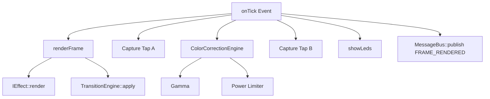

# LightwaveOS v2 Firmware Audit & Call Graph Analysis

**Date:** January 7, 2026
**Target:** `firmware/v2/src`
**Architecture:** ESP32 / FreeRTOS / Actor Model
**Version:** 2.0.0

---

## 1. Executive Summary

LightwaveOS v2 represents a significant architectural evolution from traditional Arduino-style loops to a robust, multi-core **Actor Model** system powered by FreeRTOS. The firmware is designed for high-performance LED control (120 FPS target) with concurrent audio analysis and network connectivity.

**Key Architectural Pillars:**
1.  **Actor Model:** The system is composed of independent "Nodes" (Actors) that communicate asynchronously via a message bus.
2.  **Dual-Core Utilization:**
    *   **Core 0:** Audio Capture, Signal Processing (FFT/Beat Detection), WiFi/Network stack.
    *   **Core 1:** LED Rendering, Effect Calculation, Temporal Dithering.
3.  **Pub/Sub Communication:** A `MessageBus` decouples subsystems, allowing the Renderer to operate independently of Input/Network latency.
4.  **Defensive Engineering:** Integrated Stack Monitoring, Heap Monitoring, and Memory Leak Detection.

---

## 2. System Initialization (`main.cpp`)

The entry point orchestrates the startup of the Actor system before yielding control to the FreeRTOS scheduler (implicitly via the `loop` task).

### 2.1 Initialization Flow (`setup()`)

1.  **Hardware & Serial Init:**
    *   `Serial.begin(115200)`
    *   Log System Start.

2.  **System Monitoring (Pre-Actor):**
    *   `StackMonitor::init()` & `startProfiling()`
    *   `HeapMonitor::init()`
    *   `MemoryLeakDetector::init()`
    *   `ValidationProfiler::init()`
    *   *Rationale:* Establishes baselines before dynamic allocation begins.

3.  **Core Orchestration:**
    *   `NodeOrchestrator::instance().init()`
    *   **Crucial Step:** This creates the `RendererNode` and other core actors but does not start their FreeRTOS tasks yet.

4.  **Effect Registry:**
    *   `registerAllEffects(renderer)`
    *   Populates `PatternRegistry` within the Renderer.

5.  **Persistence & Composition:**
    *   `NVSManager.init()`: Mounts Non-Volatile Storage.
    *   `ZoneComposer.init()`: Sets up multi-zone LED mapping.
    *   `ZoneConfigManager`: Loads saved zone configurations (or defaults to Preset 2).

6.  **Actor Start:**
    *   `NodeOrchestrator::start()`
    *   Iterates through all registered Nodes and calls `Node::start()`, which creates pinned FreeRTOS tasks (`xTaskCreatePinnedToCore`).

7.  **State Restoration:**
    *   Loads `SystemState` (Effect, Brightness, Speed, Palette) from NVS.

8.  **Network Subsystem (Conditional):**
    *   `WiFiManager`: Initializes SoftAP/STA modes.
    *   `WebServer`: Starts HTTP and WebSocket servers.

### 2.2 The Main Loop (`loop()`)

Unlike typical Arduino sketches, `loop()` here acts effectively as the **Input/CLI Actor**.

*   **Encoder Polling:** Consumes `EncoderEvents` from the queue and dispatches commands to the Orchestrator.
*   **Serial CLI:** Implements a non-blocking command parser for debugging and control.
*   **Idle Management:** Since heavy lifting is in FreeRTOS tasks, `loop()` runs at a lower priority (usually) or simply handles sporadic I/O.

---

## 3. Core Subsystems & Call Graphs

### 3.1 The Node (Actor) Abstraction
**Base Class:** `lightwaveos::nodes::Node`

*   **Mechanism:** Wraps a FreeRTOS Task and a Queue.
*   **Communication:**
    *   `send(Message)`: Pushes 16-byte `Message` struct to the queue.
    *   `run()`: Main task loop.
    *   `onMessage()`: Virtual handler for incoming messages.
    *   `onTick()`: Virtual handler for periodic execution (if queue is empty or timeout occurs).
*   **Safety:** Stack High Water Mark monitoring, Queue Utilization warnings.

### 3.2 Renderer Pipeline (`RendererNode`)
**Core:** 1
**Priority:** High
**Target:** 120 FPS (8.33ms budget)

**Execution Flow (`onTick`):**
1.  **`renderFrame()`**
    *   **Effect Rendering:** Calls `currentEffect->render()`.
        *   *Polymorphism:* Supports `IEffect` (native) and `LegacyEffectAdapter` (function pointers).
    *   **Transition Engine:** If transitioning, blends `m_leds` with `m_transitionSourceBuffer`.
2.  **Capture Tap A:**
    *   Copies raw `m_leds` buffer if `CAPTURE_TAP_A` is active (Pre-Correction).
3.  **Color Correction:**
    *   `ColorCorrectionEngine::processBuffer()`
    *   Applies Gamma Correction.
    *   Applies White Balance / Temperature.
    *   Applies "Brown-out" Guardrails (current limiting).
4.  **Capture Tap B:**
    *   Copies corrected buffer if `CAPTURE_TAP_B` is active.
5.  **Hardware Output:**
    *   `showLeds()`: Triggers FastLED/Driver output.
6.  **Telemetry:**
    *   Publishes `FRAME_RENDERED` event (decimated 1:10) to MessageBus.

**Call Graph Visualization:**

### 3.3 Audio Pipeline (`AudioNode`)
**Core:** 0
**Priority:** High (Real-time constraints)

**Execution Flow:**
1.  **Capture (Interrupt/DMA):**
    *   `AudioCapture` reads I2S data into circular buffers.
2.  **Processing (`onTick`):**
    *   Retrieves latest audio chunk (256 samples).
    *   **Analysis:**
        *   `TempoTracker`: Detects onsets, estimates BPM and Phase.
        *   `FFTAnalyzer`: Computes frequency spectrum (optional/feature-flagged).
3.  **Synchronization:**
    *   Updates `AudioContract` (shared state) with new Beat/Bar info.
    *   Used by `RendererNode` (via `MusicalGrid` or direct query) to sync visual effects.

---

## 4. Inter-Process Communication (IPC)

The system relies on a **MessageBus** singleton (`lightwaveos::bus::MessageBus`) to avoid tight coupling.

*   **Structure:**
    *   **Publish:** `MessageBus::publish(Message)` -> Iterates subscribers -> `Node::send()`.
    *   **Subscribe:** `MessageBus::subscribe(Type, Node*)`.
*   **Message Types:**
    *   `SET_EFFECT`, `SET_BRIGHTNESS`, `SET_SPEED` (Control).
    *   `FRAME_RENDERED` (Telemetry).
    *   `PALETTE_CHANGED` (State Sync).
    *   `AUDIO_BEAT` (Sync).

**Data Flow Example (User changes Effect):**
1.  **User:** Rotates encoder.
2.  **Main Loop:** Detects `EncoderEvent`.
3.  **Orchestrator:** Calls `orchestrator.setEffect(id)`.
4.  **Orchestrator Internal:** Creates `Message(SET_EFFECT, id)`.
5.  **IPC:** `RendererNode->send(msg)`.
6.  **Renderer (Core 1):** Unblocks from `xQueueReceive`.
7.  **Renderer:** Executes `handleSetEffect()`.
    *   Triggers `TransitionEngine` initialization.
    *   Sets `m_pendingEffect`.

---

## 5. Critical Files & Components

| Component | File Path | Responsibility |
| :--- | :--- | :--- |
| **Orchestrator** | `core/actors/NodeOrchestrator.cpp` | System lifecycle, Actor creation/destruction. |
| **Renderer** | `core/actors/RendererNode.cpp` | The "Heart" of the visual system. |
| **Base Node** | `core/actors/Node.cpp` | FreeRTOS abstraction, Queue management, Safety. |
| **Audio** | `audio/AudioNode.cpp` | I2S capture, Beat detection integration. |
| **Message Bus** | `core/bus/MessageBus.cpp` | Pub/Sub routing logic. |
| **Main** | `main.cpp` | Hardware setup, CLI, Encoder polling. |

---

## 6. Technical Findings & Audit Notes

### 6.1 Thread Safety
*   **Status:** **High**.
*   **Evidence:**
    *   Shared resources (LED buffers) are owned exclusively by `RendererNode`.
    *   Cross-core communication is strictly via thread-safe Queues (`xQueueSend/Receive`).
    *   Configuration state is managed via `Message` passing, preventing race conditions on variables like `m_brightness`.

### 6.2 Memory Management
*   **Status:** **Robust**.
*   **Evidence:**
    *   `MemoryLeakDetector` establishes a baseline after startup.
    *   `StackMonitor` checks high water marks.
    *   Dynamic allocation is mostly limited to initialization (creating Nodes/Effects). Runtime allocation is minimized to avoid fragmentation.

### 6.3 Performance
*   **Status:** **Optimized**.
*   **Evidence:**
    *   `RendererNode` runs on Core 1 (Application Core) to avoid contention with WiFi/Bluetooth (Core 0).
    *   Audio processing is pinned to Core 0, utilizing cycles not used by the network stack.
    *   `MessageBus` uses a fixed-size subscriber array (`MAX_SUBSCRIBERS_PER_TYPE = 8`) to ensure O(1) publish times.

### 6.4 Extensibility
*   **Status:** **High**.
*   **Evidence:**
    *   The `IEffect` interface allows dropping in new effects without touching the engine.
    *   `LegacyEffectAdapter` ensures backward compatibility with older function-pointer style effects.
    *   `ZoneComposer` allows for complex mappings without rewriting effects.

---

## 7. Recommendations

1.  **Effect ID Safety:**
    *   The `validateEffectId` function in `RendererNode` is a critical defense. Ensure this is used in all public API entry points (Web, Serial, Encoder).
    *   *Current State:* It appears well implemented.

2.  **Queue Saturation:**
    *   `Node::run` implements a "drain" mechanism (processing up to 8 messages per tick). This is excellent for handling bursts (e.g., rapid encoder turns).
    *   *Monitor:* Watch `queueUtil` logs in production to see if 8 is sufficient.

3.  **Audio/Visual Sync:**
    *   Phase 2 Audio integration uses `MusicalGrid`. Ensure `RendererNode` checks `m_musicalGrid` validity before accessing to prevent jitter if audio lock is lost.

4.  **Documentation:**
    *   The code is well-commented (`@file`, `@brief`). This document serves as the high-level map to accompany the inline docs.
