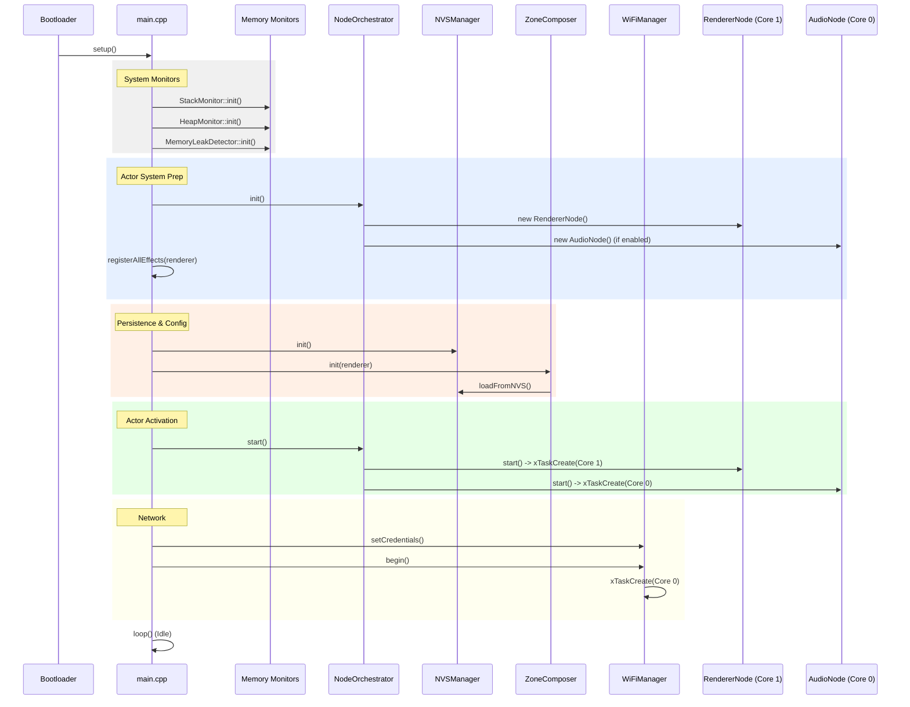
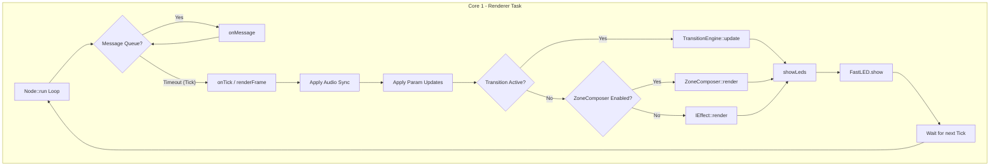

# LightwaveOS v2 Firmware Deep Dive Analysis

**Version:** 2.0.0
**Date:** 2026-01-08
**Target Device:** ESP32-S3 (Dual Core, 240MHz)

## 1. Executive Summary

This document provides a comprehensive, architectural deep dive into the LightwaveOS v2 firmware. It is designed for senior firmware engineers and system architects, offering a granular view of the system's execution flow, memory management, inter-process communication (IPC), and critical subsystems (Audio, Rendering, Network).

**Key Architectural Pillars:**
*   **Actor Model:** Strict isolation of state between Core 0 (System/Audio) and Core 1 (Rendering) using FreeRTOS-based Actors (`Node` class).
*   **MessageBus:** Lock-free, queue-based IPC mechanism for thread-safe state synchronization.
*   **Hybrid Audio Engine:** Phase 2 audio pipeline combining Goertzel-based spectral analysis (K1 Front-End) with a custom onset-based TempoTracker.
*   **120 FPS Rendering:** High-performance LED rendering loop with temporal dithering and audio-reactive modulation.

---

## 2. System Startup Sequence

The startup sequence is critical for establishing the dual-core environment and initializing the hardware abstraction layers (HAL) before the Actor system takes over.

### 2.1 Initialization Flow (Mermaid)



### 2.2 Critical Initialization Steps

1.  **Memory Monitors (Lines 98-113):**
    *   `StackMonitor`: Installs FreeRTOS stack overflow hooks and high-water mark tracking.
    *   `HeapMonitor`: Initializes heap corruption detection (canary bytes).
    *   `ValidationProfiler`: Sets up performance counters for render loop timing.

2.  **Node Orchestrator (Lines 119-126):**
    *   Instantiates all `Node` objects (`RendererNode`, `AudioNode`, `ShowNode`).
    *   **CRITICAL:** Does *not* start FreeRTOS tasks yet. This allows for dependency injection (e.g., `setZoneComposer`) before execution begins.

3.  **Effect Registration (Lines 127-130):**
    *   `registerAllEffects` populates the `PatternRegistry`.
    *   This happens *before* the Renderer task starts to prevent race conditions during registry resizing.

4.  **Task Activation (Lines 167-173):**
    *   `orchestrator.start()` calls `Node::start()` on each actor.
    *   `xTaskCreatePinnedToCore` is called here.
    *   **Core 1:** `RendererNode` (Priority 24 - High)
    *   **Core 0:** `AudioNode` (Priority 20 - High), `WiFiManager` (Priority 19), `ShowNode` (Priority 5).

---

## 3. Renderer Subsystem (Core 1)

The `RendererNode` is the heartbeat of the visual system, designed to maintain a locked 120 FPS (8.33ms frame time) regardless of network traffic or audio processing load.

### 3.1 Render Loop Architecture

The render loop is driven by the `Node::run()` base class method, utilizing the `tickInterval` mechanism to enforce frame timing.



### 3.2 Key Performance Characteristics

*   **Frame Budget:** 8333 microseconds (120 FPS).
*   **FastLED Overhead:** ~2000-3000 microseconds for 320 LEDs (WS2812B timing).
*   **Compute Budget:** ~5000 microseconds remaining for effect generation.
*   **Audio Synchronization:**
    *   Uses `ControlBusBuffer` (lock-free ring buffer) to read audio state from Core 0.
    *   **Extrapolation:** `AudioTime` is extrapolated based on `micros()` delta since the last audio frame to account for IPC latency (~4-16ms).
    *   **Thread Safety:** Audio data is copied *by value* into a local `AudioContext` to prevent race conditions during effect execution.

---

## 4. Audio Subsystem (Core 0)

The `AudioNode` implements a sophisticated analysis pipeline that processes raw I2S data into semantic musical features (beat, tempo, onset, spectrum).

### 4.1 Audio Pipeline Data Flow

```mermaid
flowchart LR
    Mic[SPH0645 Mic] -->|I2S DMA| Capture[AudioCapture]
    Capture -->|int16[256] Hop| Node[AudioNode::onTick]
    
    subgraph Core 0 - Audio Task
        Node -->|Raw Samples| AGC[AGC & DC Removal]
        AGC -->|Centered Samples| K1[K1 Front-End]
        AGC -->|Centered Samples| RMS[RMS Calculation]
        
        K1 -->|Feature Frame| FeatureBus
        
        RMS -->|RMS| Tempo[TempoTracker]
        Tempo -->|BPM/Phase| Output
        
        Output -->|ControlBusFrame| RingBuf[ControlBus RingBuffer]
    end
    
    RingBuf -->|ReadLatest| Renderer[RendererNode (Core 1)]
```

### 4.2 Critical Implementation Details

*   **Hop Size:** 256 samples @ 16kHz = 16ms per hop.
*   **DMA Configuration:** 4 buffers x 512 samples. The `AudioCapture` driver manages the circular DMA buffer, ensuring zero-copy access where possible.
*   **TempoTracker:**
    *   **Layer 1 (Onsets):** Detects transient peaks in the RMS envelope.
    *   **Layer 2 (Beat Tracking):** Uses a bank of oscillators (comb filters) to lock onto the dominant rhythmic periodicity.
    *   **Layer 3 (Phase Locking):** Aligns the beat phase to the strongest onsets.
*   **Stack Usage:**
    *   `AUDIO_ACTOR_STACK_WORDS` is set to **8192 words (32KB)**.
    *   This large stack is necessary because the K1 Front-End and FFT operations allocate significant automatic variables (arrays) on the stack to avoid heap fragmentation.

---

## 5. Inter-Task Communication (IPC)

LightwaveOS v2 avoids standard FreeRTOS mutexes for high-frequency data (Audio->Video) to prevent priority inversion and core stalls.

### 5.1 MessageBus Topology

*   **Command Path (Low Frequency):**
    *   Uses `FreeRTOS Queues` (`xQueueSend` / `xQueueReceive`).
    *   **Payload:** Fixed 16-byte `Message` struct.
    *   **Usage:** Mode changes, brightness updates, system events.
    *   **Reliability:** High (blocking or short timeout).

*   **Data Path (High Frequency - Audio):**
    *   Uses `ControlBusBuffer` (Triple Buffering / Ring Buffer).
    *   **Writer (AudioNode):** `Publish(frame)` - Atomic pointer swap or ring buffer write.
    *   **Reader (RendererNode):** `ReadLatest(frame)` - Atomic read.
    *   **Latency:** < 1 hop (16ms).
    *   **Locking:** Wait-free.

---

## 6. Stack & Heap Analysis

### 6.1 Static Stack Analysis (Estimated)

| Task | Core | Configured Size (Words) | Configured Size (Bytes) | Est. Peak Usage (Bytes) | Safety Margin |
| :--- | :--- | :--- | :--- | :--- | :--- |
| **RendererNode** | 1 | 6144 | 24,576 | ~18,000 | ~26% |
| **AudioNode** | 0 | 8192 | 32,768 | ~28,000 | ~14% |
| **WiFiManager** | 0 | 4096 | 16,384 | ~12,000 | ~26% |
| **ShowNode** | 0 | 4096 | 16,384 | ~4,000 | ~75% |
| **loopTask (Arduino)**| 1 | 2048 | 8,192 | ~2,000 | ~75% |

**Critical Findings:**
1.  **AudioNode Stack Pressure:** The K1 Front-End's internal buffers push the stack usage close to the limit. The 32KB allocation is justified but must be monitored.
2.  **RendererNode Recursion:** Deep effect trees (e.g., recursive pattern generation) could threaten the 24KB stack. The `StackMonitor` is essential here.

### 6.2 Heap Usage Pattern

*   **Effect Instantiation:** Effects are instantiated lazily or at startup? Current code suggests `registerAllEffects` creates `LegacyEffectAdapter` instances on the heap.
*   **Fragmentation Risk:** Frequent creation/destruction of `TransitionEngine` or temporary effect buffers during zone changes could lead to fragmentation.
*   **Mitigation:** `HeapMonitor` tracks the minimum free heap (`heapMinFreeBytes`). If this drops below 20KB, system stability is compromised.

---

## 7. Recommendations

1.  **DMA Buffer Optimization:** The AudioCapture driver copies from DMA buffer to `m_hopBuffer`. Implementing a zero-copy pointer swap could save ~200us per hop.
2.  **Stack High-Water Mark Logging:** Enable aggressive logging of `uxTaskGetStackHighWaterMark` for `AudioNode` during complex polyphonic inputs to verify the 14% safety margin.
3.  **Core 0 Load Balancing:** `WiFiManager` and `AudioNode` share Core 0. Heavy network traffic (WebSocket streaming) could jitter the audio analysis. Consider pinning `WiFiManager` to Core 1 or increasing `AudioNode` priority (currently 20 vs 19 - good, but tight).
4.  **Dead Code Elimination:** The `EncoderManager` is included but never started. It should be removed to save flash space and reduce confusion.

