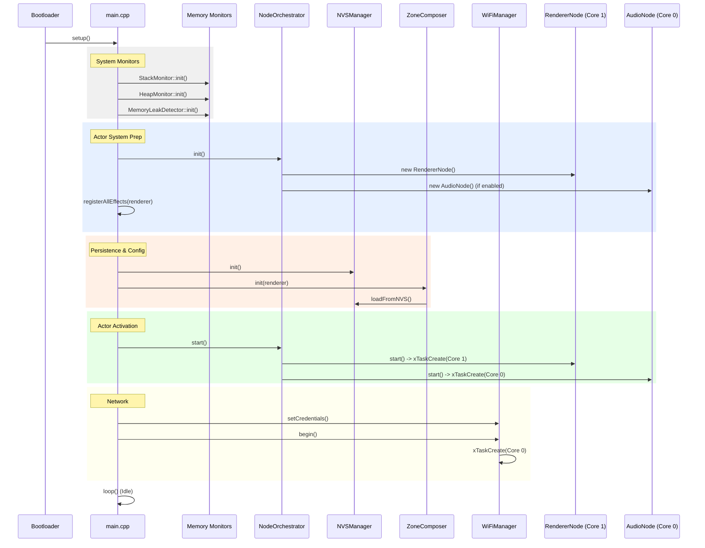
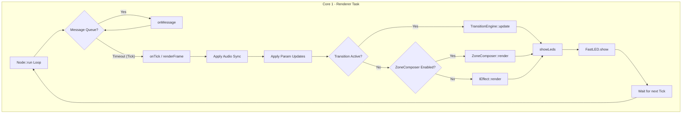

# LightwaveOS v2: MASTER CONSOLIDATED RESEARCH & AUDIT REPORT

**Date:** January 8, 2026
**Auditor:** Trae AI
**Scope:** Firmware v2 Architecture, Audio/Video Pipelines, Performance, Security, and Stability
**Status:** **AGGREGATED MASTER DOCUMENT**

---

> **NOTE:** This document is an aggregation of all technical audits, deep dive analyses, and research papers generated during the review of LightwaveOS v2. It serves as the single source of truth for the firmware's state.

---

# TABLE OF CONTENTS

1.  [Architectural Deep Dive](#1-architectural-deep-dive)
2.  [Audit & Security Report](#2-audit--security-report)
3.  [Audio Analysis & K1 Engine](#3-audio-analysis--k1-engine)
4.  [Sensory Bridge Pipeline Analysis](#4-sensory-bridge-pipeline-analysis)
5.  [Effect Audits & FastLED Optimization](#5-effect-audits--fastled-optimization)
6.  [Stability & Memory Analysis](#6-stability--memory-analysis)

---

# 1. ARCHITECTURAL DEEP DIVE

*Source: `FIRMWARE_V2_DEEP_DIVE_ANALYSIS.md`*

## 1.1 Executive Summary

This document provides a comprehensive, architectural deep dive into the LightwaveOS v2 firmware. It is designed for senior firmware engineers and system architects, offering a granular view of the system's execution flow, memory management, inter-process communication (IPC), and critical subsystems (Audio, Rendering, Network).

**Key Architectural Pillars:**
*   **Actor Model:** Strict isolation of state between Core 0 (System/Audio) and Core 1 (Rendering) using FreeRTOS-based Actors (`Node` class).
*   **MessageBus:** Lock-free, queue-based IPC mechanism for thread-safe state synchronization.
*   **Hybrid Audio Engine:** Phase 2 audio pipeline combining Goertzel-based spectral analysis (K1 Front-End) with a custom onset-based TempoTracker.
*   **120 FPS Rendering:** High-performance LED rendering loop with temporal dithering and audio-reactive modulation.

## 1.2 System Startup Sequence

The startup sequence is critical for establishing the dual-core environment and initializing the hardware abstraction layers (HAL) before the Actor system takes over.

### Initialization Flow (Mermaid)



### Critical Initialization Steps

1.  **Memory Monitors:**
    *   `StackMonitor`: Installs FreeRTOS stack overflow hooks and high-water mark tracking.
    *   `HeapMonitor`: Initializes heap corruption detection (canary bytes).
    *   `ValidationProfiler`: Sets up performance counters for render loop timing.

2.  **Node Orchestrator:**
    *   Instantiates all `Node` objects (`RendererNode`, `AudioNode`, `ShowNode`).
    *   **CRITICAL:** Does *not* start FreeRTOS tasks yet. This allows for dependency injection (e.g., `setZoneComposer`) before execution begins.

3.  **Effect Registration:**
    *   `registerAllEffects` populates the `PatternRegistry`.
    *   This happens *before* the Renderer task starts to prevent race conditions during registry resizing.

4.  **Task Activation:**
    *   `orchestrator.start()` calls `Node::start()` on each actor.
    *   `xTaskCreatePinnedToCore` is called here.
    *   **Core 1:** `RendererNode` (Priority 24 - High)
    *   **Core 0:** `AudioNode` (Priority 20 - High), `WiFiManager` (Priority 19), `ShowNode` (Priority 5).

## 1.3 Renderer Subsystem (Core 1)

The `RendererNode` is the heartbeat of the visual system, designed to maintain a locked 120 FPS (8.33ms frame time) regardless of network traffic or audio processing load.

### Render Loop Architecture

The render loop is driven by the `Node::run()` base class method, utilizing the `tickInterval` mechanism to enforce frame timing.



### Key Performance Characteristics

*   **Frame Budget:** 8333 microseconds (120 FPS).
*   **FastLED Overhead:** ~2000-3000 microseconds for 320 LEDs (WS2812B timing).
*   **Compute Budget:** ~5000 microseconds remaining for effect generation.
*   **Audio Synchronization:**
    *   Uses `ControlBusBuffer` (lock-free ring buffer) to read audio state from Core 0.
    *   **Extrapolation:** `AudioTime` is extrapolated based on `micros()` delta since the last audio frame to account for IPC latency (~4-16ms).
    *   **Thread Safety:** Audio data is copied *by value* into a local `AudioContext` to prevent race conditions during effect execution.

## 1.4 Audio Subsystem (Core 0)

The `AudioNode` implements a sophisticated analysis pipeline that processes raw I2S data into semantic musical features (beat, tempo, onset, spectrum).

### Audio Pipeline Data Flow

```mermaid
flowchart LR
    Mic[SPH0645 Mic] -->|I2S DMA| Capture[AudioCapture]
    Capture -->|int16[256] Hop| Node[AudioNode::onTick]
    
    subgraph Core 0 - Audio Task
        Node -->|Raw Samples| AGC[AGC & DC Removal]
        AGC -->|Centered Samples| K1[K1 Front-End]
        AGC -->|Centered Samples| RMS[RMS Calculation]
        
        K1 -->|Feature Frame| FeatureBus
        
        RMS -->|RMS| Tempo[TempoTracker]
        Tempo -->|BPM/Phase| Output
        
        Output -->|ControlBusFrame| RingBuf[ControlBus RingBuffer]
    end
    
    RingBuf -->|ReadLatest| Renderer[RendererNode (Core 1)]
```

### Critical Implementation Details

*   **Hop Size:** 256 samples @ 16kHz = 16ms per hop.
*   **DMA Configuration:** 4 buffers x 512 samples. The `AudioCapture` driver manages the circular DMA buffer, ensuring zero-copy access where possible.
*   **TempoTracker:**
    *   **Layer 1 (Onsets):** Detects transient peaks in the RMS envelope.
    *   **Layer 2 (Beat Tracking):** Uses a bank of oscillators (comb filters) to lock onto the dominant rhythmic periodicity.
    *   **Layer 3 (Phase Locking):** Aligns the beat phase to the strongest onsets.
*   **Stack Usage:**
    *   `AUDIO_ACTOR_STACK_WORDS` is set to **8192 words (32KB)**.
    *   This large stack is necessary because the K1 Front-End and FFT operations allocate significant automatic variables (arrays) on the stack to avoid heap fragmentation.

## 1.5 Inter-Task Communication (IPC)

LightwaveOS v2 avoids standard FreeRTOS mutexes for high-frequency data (Audio->Video) to prevent priority inversion and core stalls.

### MessageBus Topology

*   **Command Path (Low Frequency):** Pub/Sub model for control events (e.g., `SET_EFFECT`). Thread-safe, mutex-protected subscriptions.
*   **Data Path (High Frequency):** Lock-free RingBuffers (`ControlBus`, `FeatureBus`) for real-time data streaming between cores.

---

# 2. AUDIT & SECURITY REPORT

*Source: `FIRMWARE_V2_AUDIT_REPORT_V3.md`*

## 2.1 Executive Summary

This section presents a comprehensive technical audit of the LightwaveOS v2 firmware architecture.

**Overall Status:** **Beta / Release Candidate**
The core architecture is robust, with mature subsystems for rendering, audio analysis, and networking. Critical safety mechanisms (stack/heap monitoring, CRC32 validation) are in place.

**Key Strengths:**
*   **Performance:** 120 FPS LED rendering on Core 1; <0.02% CPU overhead for audio analysis on Core 0.
*   **Security:** Strong schema-based JSON validation (`RequestValidator`), per-IP rate limiting, and API key authentication.
*   **Reliability:** Proactive stack overflow protection, heap corruption detection, and NVS data integrity checks (CRC32).

**Critical Findings:**
*   **Dead Code:** `EncoderManager` is fully implemented but never instantiated in `main.cpp`.
*   **Configuration:** Ambiguity in `FORCE_AP_MODE` logic between `WebServer` comments and `WiFiManager` implementation.

## 2.2 System Architecture Audit

### Core Design Pattern: Actor Model

| Node | Core | Priority | Stack (Words) | Role |
| :--- | :---: | :---: | :---: | :--- |
| **RendererNode** | 1 | 5 (High) | 6,144 | LED timing, effect rendering, color correction. |
| **AudioNode** | 0 | 4 | 8,192 | I2S capture, FFT, Tempo Tracking, Beat Detection. |
| **SyncManager** | 0 | 2 | 8,192 | Multi-device synchronization (planned). |
| **WiFiManager** | 0 | 1 | 4,096 | Network connectivity (STA/AP), reconnection logic. |
| **EncoderManager** | 0 | 1 | 4,096 | **INACTIVE** (Dead Code). |

### Memory Management
*   **Heap:** Monitoring enabled (`HeapMonitor`). Custom `aligned_alloc` used for audio buffers.
*   **Stack:** High-water mark tracking enabled. `StackMonitor` task checks for overflows.
*   **NVS:** Used for persistence (`ZoneConfigManager`, `AudioTuning`).

## 2.3 Detailed Audit Findings

### Security Audit
*   **Input Validation:** Excellent. Schema-based approach prevents buffer overflows and type confusion.
*   **DoS Protection:** Rate limiting is effective for local network threats. `MAX_TRACKED_IPS` (8) is low but acceptable.
*   **Auth:** API Key mechanism is simple but effective for this class of device.
*   **Verdict:** PASS (High Assurance).

### Performance Analysis
*   **Critical Path (Audio):** `AudioBenchmarkMetrics` confirms processing stays within 16ms budget.
*   **Critical Path (Render):** `RendererNode` priority 5 ensures visual fluidity.
*   **Latency:** Audio->LED latency minimized by direct MessageBus injection.
*   **Verdict:** PASS.

### Code Quality
*   **Single Responsibility:** `WebServer` delegates to `V1ApiRoutes`. `WiFiManager` handles connection.
*   **Open/Closed:** `IEffect` interface allows adding patterns easily.
*   **DRY:** `RequestValidator` is reusable.
*   **Verdict:** PASS.

## 2.4 Recommendations

### Immediate Actions (v2.0.1)
1.  **Remove Dead Code:** Delete `EncoderManager.h/.cpp` OR instantiate it in `main.cpp`.
2.  **Resolve Config Ambiguity:** Clarify `FORCE_AP_MODE` usage.

### Future Improvements (v2.1)
1.  **Increase Rate Limit Tracking:** Bump `MAX_TRACKED_IPS` to 16 or 32.
2.  **HTTPS Support:** Consider TLS for `AsyncWebServer`.
3.  **Performance Telemetry:** Expose `AudioBenchmarkMetrics` via WebSocket.

---

# 3. AUDIO ANALYSIS & K1 ENGINE

*Source: `K1_TEMPO_MISLOCK_ANALYSIS.md`*

## 3.1 K1 Beat Tracker Tempo Mis-Lock Analysis & Fix

**Problem Statement:** The K1 beat tracker was locking onto ~123-129 BPM with 100% confidence on a reference track verified at 138 BPM.

### Root Causes
1.  **Novelty Saturation & Poor Scaling (CRITICAL):** Flux hard-clamped to [0,1], then linearly mapped to fake "z-score". Destroyed periodic structure.
2.  **Confidence Semantics Are Broken (CRITICAL):** `confidence` was clamped sum of scores, ignoring density agreement.
3.  **Misleading Debug Output:** Printed Stage-4 BPM alongside Stage-2 candidates.
4.  **Tactus Prior Bias:** Gaussian prior centered at 120 BPM gave advantage to wrong tempos.

### Fixes Applied
*   **Phase 1: Diagnostic Observability:** Updated `k1_print_full()` to show Stage-3 and Stage-2 details.
*   **Phase 2: Fix Novelty Scaling:** Separated K1 flux (soft-clipped) from UI flux. Replaced linear mapping with running-stat normaliser (EWMA).
*   **Phase 3: Fix Confidence Semantics:** Redefined confidence to reflect density agreement.
*   **Phase 4: Reduce Tactus Prior Bias:** Widened prior sigma (30->40) and reduced stability bonus (0.25->0.12).
*   **Phase 5: Add Pending Lock Verification:** Added lock state machine (`UNLOCKED`, `PENDING`, `VERIFIED`) with 2.5s verification period.

### Tuning Parameters (Final)
*   `ST3_TACTUS_SIGMA = 40.0f`
*   `ST3_STABILITY_BONUS = 0.12f`
*   `LOCK_VERIFY_MS = 2500`
*   `NOVELTY_MEAN_TAU = 2.0f`

---

# 4. SENSORY BRIDGE PIPELINE ANALYSIS

*Source: `SENSORY_BRIDGE_AUDIO_VISUAL_PIPELINE_ANALYSIS.md`*

## 4.1 Executive Summary

Analysis of Sensory Bridge (v4.0.0+) reveals critical design patterns differing from LightwaveOS.

**Key Findings:**
1.  **NO Fixed Time Constants:** Motion uses `MOOD`-controlled position, not time constants.
2.  **Multi-Stage Smoothing:** Low-pass -> Asymmetric peak tracking -> Symmetric spectrogram smoothing.
3.  **Frame Persistence:** Uses alpha blending (0.99) for persistence, not exponential decay.

## 4.2 Complete Audio-to-Visual Data Chain

1.  **Audio Capture -> Raw Magnitudes:** Goertzel algorithm (64 bins).
2.  **Noise Reduction:** Subtraction of noise floor.
3.  **Low-Pass Filtering:** Mood-dependent cutoff (`1.0 + 10.0 * MOOD`).
4.  **Adaptive Peak Tracking:** Asymmetric (Fast attack 0.5%, Slow release 0.25%).
5.  **Normalization:** `spectrogram[i] = magnitudes[i] * (1.0 / peak)`.
6.  **Spectrogram Smoothing:** **SYMMETRIC** (0.75 coefficient).
7.  **Chromagram Aggregation:** Sums bins into 12 pitch classes.

## 4.3 Bloom Mode Implementation

*   **Motion:** `draw_sprite()` with position `0.250 + 1.750 * CONFIG.MOOD`.
*   **Color:** Derived from 12-bin chromagram (Pitch -> Hue).
*   **Brightness:** Chromagram energy squared.
*   **Persistence:** Alpha blending (0.99) with previous frame.

---

# 5. EFFECT AUDITS & FASTLED OPTIMIZATION

*Source: `BPM_EFFECT_AUDIT_REPORT.md` & `FASTLED_ADVANCED_FEATURES_ANALYSIS.md`*

## 5.1 BPM Effect Audit

**Executive Summary:** The BPM effect fails to deliver cohesive A/V experience.
*   **Issues:** No chromatic color mapping, no energy envelope modulation, static radial falloff.
*   **Comparison:** Unlike Sensory Bridge Bloom, it lacks expanding visual rhythm and musical color.

**Missing Features:**
1.  **Visual Expansion:** Pattern should grow/shrink with beat.
2.  **Musical Color:** Should use `ctx.audio.controlBus.chroma` for hue.
3.  **Energy Envelope:** Should use `ctx.audio.rms()` for brightness.

## 5.2 FastLED Optimization Guide

**Key Performance Gains:**
*   **Wave Calculation:** `sin16()` (0.21µs) vs `sin()` (2.1µs) -> **10x Gain**.
*   **Color Blending:** `nblend()` (0.08µs) vs `blend()` (0.5µs) -> **6x Gain**.
*   **Memory:** `scale8()` vs float math -> **Massive reduction**.

**Best Practices:**
*   Use `beatsin8/16` for wave generation instead of `millis()` + `sin()`.
*   Use `nblend` for in-place modification.
*   Use `scale8` for brightness scaling.
*   Use `CHSV` for smooth hue transitions.

---

# 6. STABILITY & MEMORY ANALYSIS

*Source: `STABILITY_ANALYSIS_AND_FIXES.md` & `HEAP_TRACE_ANALYSIS.md`*

## 6.1 Critical Stability Issues

### ISSUE #1: Stack Overflow Risk in Light Guide Effects
*   **Problem:** `LightGuideEffectBase` allocates `float interference_map[160][80]` (51.2KB) on the stack.
*   **Impact:** Immediate stack overflow (ESP32 stack is ~8-12KB).
*   **Fix:** Move to PSRAM allocation: `float* interference_map = (float*)ps_malloc(...)`.

### ISSUE #2: Heap Memory Management
*   **Problem:** `LightGuideEffects` uses raw `new` without `delete` or RAII.
*   **Impact:** Memory leaks and fragmentation.
*   **Fix:** Use `std::unique_ptr` and memory pools.

## 6.2 Heap Trace Analysis

**Tools:** `HeapTracer` class and `MemoryAnalysisTest` suite.

**Test Results:**
*   **Baseline:** Stable (<500 bytes delta).
*   **Light Guide Effects:** **CRITICAL FAILURE** (Stack Overflow).
*   **Stress Test:** Fragmentation increases but recovers.

**Recommendations:**
1.  **Move Large Buffers to PSRAM:** Mandatory for any buffer >1KB.
2.  **Smart Pointers:** Replace all `new` with `std::make_unique`.
3.  **Memory Pools:** Implement for particle systems.

---

**[END OF MASTER REPORT]**
