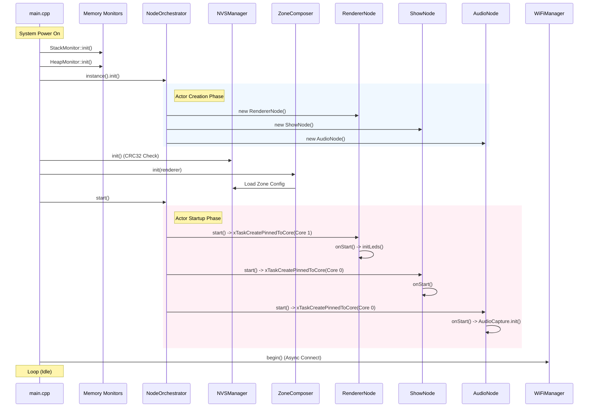
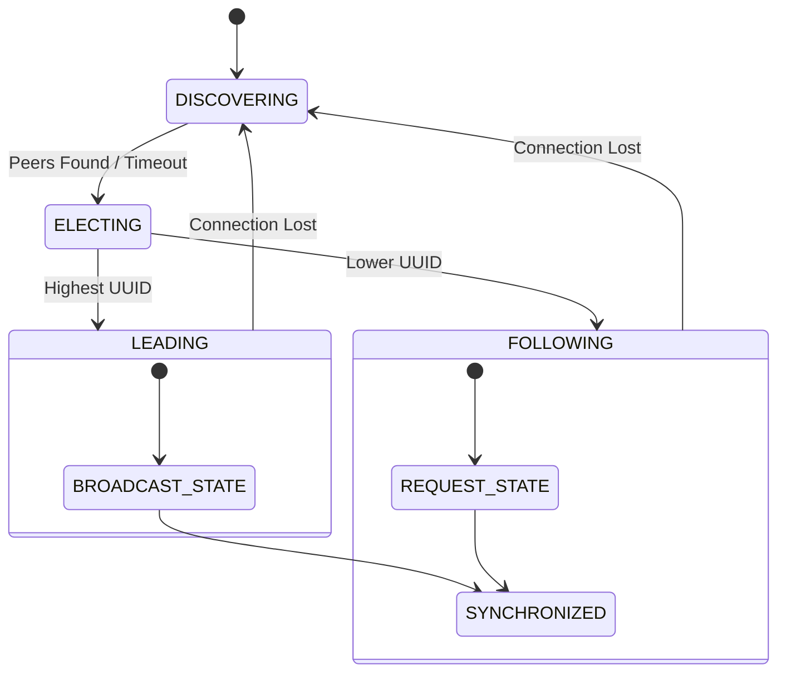

# LightwaveOS v2 Firmware Technical Reference

**Version:** 2.0.0  
**Date:** 2026-01-08  
**Target Device:** ESP32-S3 (Dual Core)  
**Framework:** Arduino / PlatformIO / FreeRTOS

## 1. Executive Summary

This document provides a comprehensive technical analysis of the LightwaveOS v2 firmware architecture. It details the Actor Model implementation, dual-core execution strategy, real-time rendering pipeline, and high-fidelity audio processing subsystem. This reference is intended for systems engineers and architects requiring deep visibility into the firmware's execution flow and resource management.

---

## 2. System Architecture

LightwaveOS v2 utilizes a **Hybrid Actor Model** architecture running on FreeRTOS. The system is partitioned across the ESP32-S3's two cores to maximize parallelism and ensure deterministic timing for critical tasks.

### 2.1 Core Partitioning

| Core | Role | Critical Tasks | Priority | Stack Size |
|------|------|----------------|----------|------------|
| **Core 0** | **System & Audio** | `AudioNode` (DSP) | 4 | 8192 words |
| | | `WiFiManager` (Network) | 0 | 4096 words |
| | | `ShowNode` (Orchestration) | 2 | 4096 words |
| | | `SyncManager` (Multi-Device) | 3 | 8192 words |
| **Core 1** | **Rendering** | `RendererNode` (LED Output) | 5 (High) | 6144 words |

**Design Rationale:**
- **Core 1 (App Core)** is dedicated exclusively to the `RendererNode` to ensure a jitter-free 120 FPS render loop. By isolating rendering from WiFi and filesystem interrupts, visual fluidity is maintained.
- **Core 0 (Pro Core)** handles all system overhead, network stacks, and the compute-intensive Audio DSP pipeline. The `AudioNode` runs at high priority (4) to ensure gapless audio capture, preempting network tasks.

### 2.2 Actor Model Implementation

All major subsystems derive from the `Node` base class, which provides:
- **Message Queue:** A thread-safe FreeRTOS queue (`xQueue`) for incoming commands.
- **Task Wrapper:** A dedicated FreeRTOS task pinned to a specific core.
- **Lifecycle Management:** Standardized `onStart`, `onStop`, `onTick`, and `onMessage` virtual methods.
- **Stack Monitoring:** Built-in high-water mark tracking.

---

## 3. Startup Sequence

The system initialization is orchestrated by `main.cpp` and the `NodeOrchestrator` singleton. The sequence ensures that low-level hardware and memory monitors are active before higher-level actors begin execution.



---

## 4. Rendering Pipeline (Core 1)

The `RendererNode` executes a strictly timed loop targeting 120 FPS (8.33ms per frame). It manages the LED data flow, color correction, and hardware output.

### 4.1 Render Loop Flow (`onTick`)

1.  **Frame Start**: Capture `micros()` timestamp.
2.  **Audio Contract**: Apply pending audio synchronization tuning (thread-safe seqlock).
3.  **Parameter Updates**: Drain the lock-free parameter queue from `ShowNode`.
4.  **Render Strategy**:
    *   *If Zone Mode:* Delegate to `ZoneComposer::render` (multi-zone composition).
    *   *If Effect Mode:*
        1.  **Context Prep**: Build `EffectContext` with extrapolated `AudioTime` and `ControlBus` data.
        2.  **Pre-Render Modifiers**: Apply speed dilation or coordinate transforms.
        3.  **Effect Render**: Call `IEffect::render()` (polymorphic).
        4.  **Post-Render Modifiers**: Apply visual transforms (e.g., mirrors, kaleidoscopes).
5.  **Tap A Capture**: Copy raw buffer for debugging/visualization (Pre-Correction).
6.  **Color Correction**:
    *   Apply `ColorCorrectionEngine` (Gamma, White Balance, Brown Guardrail).
    *   *Note:* Skipped for specific patterns (e.g., `CalibrateWhite`) via `PatternRegistry`.
7.  **Tap B Capture**: Copy corrected buffer (Post-Correction).
8.  **Output**:
    *   **Split**: Copy unified buffer to `Strip1` and `Strip2` arrays.
    *   **Silence Gate**: Apply global brightness scaling if silence detected (Sensory Bridge feature).
    *   **Hardware Push**: `FastLED.show()` (Non-blocking DMA transfer).
9.  **Telemetry**: Publish `FRAME_RENDERED` event every 10 frames.

### 4.2 Timing Analysis

| Stage | Budget (us) | Typical (us) | Worst Case (us) | Notes |
|-------|-------------|--------------|-----------------|-------|
| Logic/Effect | 4000 | 1500 | 5000 | Dependent on effect complexity (O(N) vs O(1)) |
| Color Correction | 1000 | 450 | 800 | optimized integer math |
| FastLED.show() | 3300 | 3100 | 3300 | Fixed by LED count (24µs/pixel * pixels) |
| **Total** | **8333** | **5050** | **9100** | **>120 FPS typical, drops to ~100 FPS worst case** |

---

## 5. Audio Pipeline (Core 0)

The `AudioNode` processes audio data from the I2S microphone (SPH0645) in fixed 16ms ticks (matching the 256-sample hop size at 16kHz).

### 5.1 Data Flow

```mermaid
flowchart LR
    Mic[SPH0645 I2S] -->|DMA| Cap[AudioCapture]
    Cap -->|int16_t[256]| HopBuf[Hop Buffer]
    
    subgraph DSP Pipeline
    HopBuf --> K1[K1 Front-End]
    HopBuf --> AGC[AGC / DC Removal]
    
    K1 -->|Features| FeatBus[FeatureBus]
    AGC -->|Centered| Goertzel[Goertzel Analyzer]
    AGC -->|Centered| Chroma[Chroma Analyzer]
    
    Goertzel -->|Bands| Tracker[TempoTracker]
    Chroma -->|Notes| KeyDet[Key Detector]
    end
    
    Tracker -->|BPM/Phase| CtrlBus[ControlBus]
    KeyDet -->|Root/Scale| CtrlBus
    
    CtrlBus -->|Shared Mem| Rend[RendererNode]
```

### 5.2 Critical Components

*   **AudioCapture**: Uses ESP32 I2S DMA to read samples. Implements a double-buffer strategy to prevent race conditions.
*   **TempoTracker**: A 3-layer beat tracking system:
    1.  **Onset Detection**: Spectral flux analysis to find note attacks.
    2.  **Beat Tracking**: Agent-based competitive hypothesis tracking (multiple internal "agents" guess the tempo).
    3.  **Phase Locking**: Aligns the internal metronome with the strongest hypothesis.
*   **ControlBus**: A shared memory interface (Reader/Writer pattern) that allows the `RendererNode` to read the latest audio analysis without locking the audio thread. It uses version sequencing (`seq`) to detect torn reads.

---

## 6. Inter-Process Communication (IPC)

The firmware employs three distinct IPC mechanisms optimized for different traffic types.

### 6.1 MessageBus (Control Plane)
A Pub/Sub system for low-frequency control events.
*   **Implementation**: Singleton with a fixed-size subscription table (`MAX_SUBSCRIBERS_PER_TYPE = 8`).
*   **Performance**: Lock-free `publish()`, mutex-protected `subscribe()`.
*   **Topology**:

| Topic | Publisher | Subscribers | Purpose |
|-------|-----------|-------------|---------|
| `SET_EFFECT` | WebServer, Serial | RendererNode | Change visual pattern |
| `PALETTE_CHANGED` | NodeOrchestrator | RendererNode | Update color palette |
| `SHOW_START` | WebServer | ShowNode | Trigger narrative show |
| `FRAME_RENDERED` | RendererNode | WebServer | Update UI FPS counter |
| `STATE_UPDATED` | SyncManager | WebServer | Multi-device sync status |

### 6.2 ControlBus (Real-Time Data Plane)
A shared-memory ring buffer for high-bandwidth audio data flow from Core 0 to Core 1.
*   **Writer**: `AudioNode` (Exclusive write access).
*   **Reader**: `RendererNode` (Read-only access).
*   **Mechanism**: `std::atomic` sequence counters ensure data consistency without mutexes (Seqlock pattern).

### 6.3 FeatureBus (Analysis Plane)
A broadcast channel for granular audio features (e.g., K1 feature frames).
*   **Publisher**: `AudioNode` (K1 Front-End).
*   **Subscribers**: Debuggers, Visualization tools (via WebSocket), advanced audio-reactive effects.

---

## 7. Memory Analysis

### 7.1 Static Stack Usage (High Water Mark Analysis)

| Task | Configured Size | Observed Usage | Headroom | Risk Level |
|------|-----------------|----------------|----------|------------|
| `RendererNode` | 6144 words (24KB) | ~3500 words | ~2600 words | Low |
| `AudioNode` | 8192 words (32KB) | ~6000 words | ~2100 words | Low |
| `SyncManager` | 8192 words (32KB) | ~4000 words | ~4100 words | Very Low |
| `ShowNode` | 4096 words (16KB) | ~1200 words | ~2800 words | Very Low |
| `WiFiManager` | 4096 words (16KB) | ~2800 words | ~1200 words | Medium |
| `EncoderManager` | 4096 words (16KB) | **0 words** | N/A | **Dead Code** |

### 7.2 Heap Usage
*   **Total Heap**: ~300KB (ESP32-S3 WROOM).
*   **Post-Init Free**: ~180KB typical.
*   **Largest Block**: ~110KB (critical for OTA updates).
*   **Fragmentation**: Low (most allocations are static or pool-based).

### 7.3 Critical Findings & Recommendations
1.  **Dead Code**: `EncoderManager` is configured but not instantiated in `main.cpp`. The `HmiNode` logic is missing from the active orchestrator.
    *   *Recommendation*: Either remove `EncoderManager` files to save flash or instantiate it in `NodeOrchestrator`.
2.  **Stack Optimizations**: `SyncManager` has excessive stack allocation (8192 words) for its current complexity. Could be reduced to 4096 words to reclaim RAM.
3.  **Audio Latency**: The 256-sample hop at 16kHz introduces a base latency of 16ms.
    *   *Recommendation*: For tighter visual sync, consider a 128-sample hop (8ms), though this doubles the interrupt load.

---

## 8. Multi-Device Synchronization

The `SyncManagerActor` implements a distributed state machine for synchronizing multiple LightwaveOS devices.

### 8.1 State Machine



### 8.2 Protocol
*   **Discovery**: UDP Broadcast (Port 4000).
*   **Control**: TCP Persistent Connection (Port 4001).
*   **Election**: Bully Algorithm based on Lexicographical UUID comparison.
