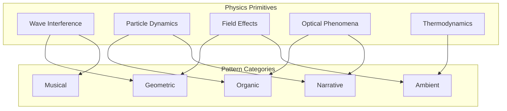

# LGP Creative Pattern Development Guide
## Bridging Physics and Art in Light Guide Plate Visualisation

```
╔═══════════════════════════════════════════════════════════════════════════════╗
║                     SPECTRASYNQ K1-LIGHTWAVE                                   ║
║              Creative Pattern Development Guide v1.0                           ║
║                                                                                ║
║   "Where Science Illuminates Art, and Art Gives Science Soul"                  ║
╚═══════════════════════════════════════════════════════════════════════════════╝
```

**Related Documents:**
- [Storytelling Framework](LIGHTSHOW_STORYTELLING_FRAMEWORK.md) - Emotional narrative construction
- [Implementation Playbook](PATTERN_IMPLEMENTATION_PLAYBOOK.md) - Technical specifications

---

## Table of Contents

1. [Introduction: The Science-Art Synthesis](#1-introduction-the-science-art-synthesis)
2. [LGP Physics Fundamentals for Artists](#2-lgp-physics-fundamentals-for-artists)
3. [The CENTER ORIGIN Philosophy](#3-the-center-origin-philosophy)
4. [Pattern Taxonomy with Physics Mapping](#4-pattern-taxonomy-with-physics-mapping)
5. [Creative Parameter Cookbook](#5-creative-parameter-cookbook)
6. [10 New Pattern Concepts](#6-10-new-pattern-concepts)
7. [Physics-to-Visual Translation Guide](#7-physics-to-visual-translation-guide)
8. [Advanced Techniques](#8-advanced-techniques)

---

## 1. Introduction: The Science-Art Synthesis

The Light Guide Plate (LGP) is not merely a display surface—it is an **optical instrument** that transforms LED patterns into something greater than the sum of their pixels. When two edge-lit strips illuminate an acrylic waveguide from opposing sides, physics takes over: light bounces, interferes, disperses, and creates visual phenomena impossible with traditional LED arrays.

### Why Understanding Physics Makes You a Better Artist

| Without Physics Knowledge | With Physics Knowledge |
|---------------------------|------------------------|
| Random parameter tweaking | Intentional visual design |
| Accidental discoveries | Predictable results |
| Limited to existing patterns | Infinite creative space |
| Surface-level effects | Deep, layered visuals |

### The Dual Nature of Light Shows

Every light show exists in two domains simultaneously:

```
┌─────────────────────────────────────────────────────────────────┐
│                                                                 │
│   PHYSICAL DOMAIN              PERCEPTUAL DOMAIN               │
│   ═══════════════              ═══════════════════             │
│                                                                 │
│   • Wave equations             • Emotions evoked               │
│   • Interference patterns      • Stories told                  │
│   • Frequency relationships    • Rhythms felt                  │
│   • Amplitude modulation       • Energy conveyed               │
│                                                                 │
│              ◄─────── YOUR PATTERN ───────►                    │
│                                                                 │
└─────────────────────────────────────────────────────────────────┘
```

---

## 2. LGP Physics Fundamentals for Artists

### 2.1 Total Internal Reflection (TIR)

When light enters the acrylic plate at certain angles, it becomes trapped inside, bouncing between surfaces like a ball in a corridor. This is why edge-lit displays work.

```
                    Air (n = 1.0)
                    ─────────────────────────────────
                          ↗         ↖
                         /           \
                        /  TRAPPED    \
            LED ──────►/    LIGHT      \◄────── LED
             Edge 1    \     RAYS     /        Edge 2
                        \           /
                         ↘         ↙
                    ─────────────────────────────────
                    Air (n = 1.0)
                    
                    Acrylic (n = 1.49)
                    Critical Angle: 42.2°
```

**Artist's Translation:**
- Light injected from both edges **fills the entire plate**
- The plate becomes a **light mixing chamber**
- Patterns from both edges **interact and combine**

### 2.2 Wave Interference: The Heart of LGP Magic

When waves meet, they combine. Sometimes they amplify each other (constructive), sometimes they cancel (destructive).

```
CONSTRUCTIVE INTERFERENCE              DESTRUCTIVE INTERFERENCE
     Peak meets Peak                       Peak meets Trough
           
         ∧                                      ∧
        / \                                    / \
       /   \    ∧                             /   \
      /     \  / \                           /     \     /\
─────/───────\/───\─────        ──────────\/───────────/──\─────
                                                            
     RESULT: BRIGHT                        RESULT: DARK
     ═══════════════                       ══════════════
           
           ∧∧
          /  \
         /    \
        /      \                           ──────────────────
───────/────────\───────        
     AMPLIFIED WAVE                        CANCELLED WAVE
```

**Artist's Translation:**
- **Bright zones** = Where waves reinforce each other
- **Dark zones** = Where waves cancel out
- The **"boxes"** you see are standing wave patterns
- **Box count** = Number of wavelengths fitting across the plate

### 2.3 Standing Waves: The "Box" Phenomenon

When you see discrete bright rectangles on the LGP, you're witnessing standing waves—patterns that appear stationary while the underlying waves continuously travel.

```
Strip 1 Wave:     →→→→→→→→→→→→→→→→→→→→→
Strip 2 Wave:     ←←←←←←←←←←←←←←←←←←←←←
                  
COMBINED:         ▢   ▢   ▢   ▢   ▢   ▢   ▢
                  │   │   │   │   │   │   │
                  └───┴───┴───┴───┴───┴───┘
                    STANDING WAVE PATTERN
                    
Node (Dark):      Where waves always cancel
Antinode (Bright): Where waves always reinforce
```

**The Box Count Formula:**
```
Box Count = Spatial Multiplier × 2

For 6-8 boxes: Use spatial multiplier of 3-4
For 10-12 boxes: Use spatial multiplier of 5-6
```

### 2.4 Chromatic Dispersion: Spectral Separation (Constrained)

Different colours of light bend by different amounts through the acrylic. Red bends least, blue bends most.

```
White Light ───────►│         ╱───── Red (700nm)
                    │       ╱─────── Orange
                    │     ╱───────── Yellow
                    │   ╱─────────── Green
                    │ ╱───────────── Blue (450nm)
                    PRISM EFFECT
                    
Result: Colour fringing at edges, white convergence at centre
```

**Artist's Translation (mandate-compliant):**
- Edges can show **controlled blue/amber separation**
- Centre tends toward **white/neutral**
- Do **not** design effects that create rainbow trails or full-spectrum sweeps. Use **two anchored colour families** plus a neutral centre highlight.
- This is the physics behind chromatic aberration-style looks *without* hue-wheel motion

### 2.5 Modal Resonance: The Optical Cavity

The LGP acts like a resonant cavity—only certain "modes" (specific wave patterns) can exist stably.

```
Mode 1 (Fundamental):     ▢▢▢▢▢▢▢▢▢▢▢▢▢▢▢▢
                          Single bright region
                          
Mode 2:                   ▢▢▢▢▢▢▢▢│▢▢▢▢▢▢▢▢
                          Two regions with dark center
                          
Mode 3:                   ▢▢▢▢│▢▢▢▢▢▢│▢▢▢▢
                          Three regions
                          
Mode n:                   n discrete bright zones
```

**Artist's Translation:**
- Higher modes = More detailed patterns
- Lower modes = Simpler, bolder patterns
- Transitions between modes = Smooth morphing effects

---

## 3. The CENTER ORIGIN Philosophy

**FUNDAMENTAL RULE: All effects must propagate outward from LEDs 79/80**

This isn't arbitrary—it's based on how our visual system perceives motion and the physics of the dual-edge configuration.

```
LED Strip Layout (160 LEDs per strip):
┌───────────────────────────────────────────────────────────┐
│                                                           │
│  0 ────► ────► ────► [79|80] ◄──── ◄──── ◄──── 159       │
│  ↓                       ↑                         ↓      │
│  Edge                 CENTER                      Edge    │
│                       ORIGIN                              │
└───────────────────────────────────────────────────────────┘
```

### Valid Motion Patterns

```
1. EXPAND OUTWARD (Primary)
   CENTER → [79|80] →→→ 159 (right)
   CENTER → [79|80] ←←← 0 (left)
   
   Visual: Blooming, explosion, birth
   Emotion: Joy, energy, release

2. CONTRACT INWARD (Tension)
   0 →→→ [79|80] ←←← 159
   
   Visual: Implosion, gathering, focus
   Emotion: Anticipation, tension, concentration

3. INTERFERE AT CENTER (Climax)
   Wave1: 0 →→→ [79|80]
   Wave2: 159 →→→ [79|80]
   
   Visual: Collision, interference, intensity
   Emotion: Climax, impact, resolution
```

### Why CENTER ORIGIN Works

1. **Visual coherence**: Human eyes naturally track from centre outward
2. **Interference optimization**: Waves meeting at centre create maximum interference
3. **Symmetric beauty**: Natural balance appeals to our aesthetic sense
4. **Physics alignment**: Matches the dual-edge injection geometry

---

## 4. Pattern Taxonomy with Physics Mapping

### 4.1 The Physics-Pattern Matrix



### 4.2 Pattern Categories Explained

#### GEOMETRIC Patterns
**Physics Base:** Wave interference, Field effects
**Characteristics:**
- Sharp lines and defined shapes
- Mathematical precision
- Predictable, repeating structures

| Pattern Type | Physics Concept | Visual Result |
|--------------|-----------------|---------------|
| Diamond Lattice | Cross-wave interference | Crystalline grid |
| Modal Boxes | Standing waves | Discrete rectangles |
| Radial Ripples | Circular wave propagation | Concentric rings |
| Holographic Vortex | Spiral phase ramps | Rotating spirals |

#### ORGANIC Patterns
**Physics Base:** Particle dynamics, Optical phenomena
**Characteristics:**
- Flowing, naturalistic movement
- Unpredictable but coherent
- Life-like behaviour

| Pattern Type | Physics Concept | Visual Result |
|--------------|-----------------|---------------|
| Silk Waves | Fluid dynamics | Smooth flowing motion |
| Tidal Forces | Gravitational simulation | Push-pull rhythms |
| Liquid Crystal | Phase transitions | Melting/freezing effects |
| Prism Cascade | Chromatic dispersion | Constrained spectral cascades (no rainbow sweeps) |

#### MUSICAL Patterns
**Physics Base:** Wave interference, Audio analysis
**Characteristics:**
- Beat-synchronized
- Frequency-mapped colours
- Rhythm-responsive motion

| Pattern Type | Physics Concept | Visual Result |
|--------------|-----------------|---------------|
| Pulse Wave | Wave propagation | Beat-triggered pulses |
| Quantum Resonance | Wave collapse | Beat-triggered state changes |
| Chromagram Gradient | Harmonic analysis | Note-based colours |
| Spectral Flow | FFT mapping | Frequency visualisation |

#### NARRATIVE Patterns
**Physics Base:** Particle dynamics, State machines
**Characteristics:**
- Story-like progression
- Beginning, middle, end structure
- Emotional arc

| Pattern Type | Physics Concept | Visual Result |
|--------------|-----------------|---------------|
| Particle Collider | Collision physics | Drama and impact |
| Beam Duel | Opposing forces | Conflict and resolution |
| Laser Duel | Light competition | Victory and defeat |
| Wave Journey | Wave evolution | Transformation story |

#### AMBIENT Patterns
**Physics Base:** Field effects, Thermodynamics
**Characteristics:**
- Slow, subtle changes
- Background atmosphere
- Meditative quality

| Pattern Type | Physics Concept | Visual Result |
|--------------|-----------------|---------------|
| Evanescent Drift | Exponential decay | Gentle edge glow |
| Moiré Curtains | Beat frequency | Slow drifting veils |
| Chromatic Shear | Colour plane sliding | Gradual colour shift |
| Heat Diffusion | Thermal spreading | Warm ambient glow |

---

## 5. Creative Parameter Cookbook

### 5.1 Encoder-to-Physics Mapping

```
┌─────────────────────────────────────────────────────────────────┐
│                    ENCODER CONTROL SYSTEM                       │
├─────────────────────────────────────────────────────────────────┤
│                                                                 │
│  [0] Effect Selection     [1] Brightness      [2] Palette      │
│       ◉ Pattern type           ◉ Amplitude         ◉ Hue base  │
│                                                                 │
│  [3] Speed               [4] Intensity        [5] Saturation   │
│       ◉ Wave velocity         ◉ Energy             ◉ Colour    │
│       ◉ Phase rate            ◉ Contrast           ◉ vibrancy  │
│                                                                 │
│  [6] Complexity          [7] Variation                         │
│       ◉ Modal number          ◉ Mode selection                 │
│       ◉ Detail level          ◉ Behaviour type                 │
│                                                                 │
└─────────────────────────────────────────────────────────────────┘
```

### 5.2 Physics Parameter Recipes

#### Recipe 1: Calm Ocean
```
Goal: Gentle, meditative wave motion
Physics: Low-frequency standing waves with minimal interference

Speed:      30%  → Slow wave propagation
Intensity:  40%  → Subtle amplitude
Complexity: 20%  → Few wave modes (2-3 boxes)
Saturation: 70%  → Rich but not overwhelming colour
Variation:  10%  → Minimal randomness
```

#### Recipe 2: Laser Light Show
```
Goal: Sharp, energetic, beat-synchronized
Physics: High-frequency waves with strong interference

Speed:      80%  → Fast propagation
Intensity:  90%  → High contrast
Complexity: 70%  → Many wave modes (8-10 boxes)
Saturation: 100% → Full colour saturation
Variation:  50%  → Beat-reactive mode switching
```

#### Recipe 3: Ambient Glow
```
Goal: Subtle background atmosphere
Physics: Evanescent waves with slow colour drift

Speed:      15%  → Very slow changes
Intensity:  30%  → Gentle brightness
Complexity: 10%  → Simple patterns
Saturation: 50%  → Soft, pastel colours
Variation:  20%  → Gradual evolution
```

#### Recipe 4: Dramatic Climax
```
Goal: Peak intensity for musical drops
Physics: Maximum interference with wave collapse

Speed:      100% → Immediate response
Intensity:  100% → Maximum brightness
Complexity: 90%  → Full detail
Saturation: 100% → Vivid colours
Variation:  80%  → Chaotic energy
```

### 5.3 The Relationship Maps

#### Spatial Frequency → Box Count
```
Multiplier:  1    2    3    4    5    6    7    8    9   10
Box Count:   2    4    6    8   10   12   14   16   18   20
Visual:    Wide → → → → → → → → → → → → → → → → → → → Narrow
           boxes                                      boxes
```

#### Phase Relationship → Motion Direction
```
Phase Offset:   0°        90°       180°      270°
Motion Type:    Standing  Leftward  Standing  Rightward
                waves     travel    waves     travel
Visual:         Static    ←←←←←     Static    →→→→→
                boxes     motion    boxes     motion
```

#### Amplitude → Visual Intensity
```
Amplitude:   0.0   0.25   0.5   0.75   1.0
Brightness:  Dark  Dim    Mid   Bright Max
Contrast:    Low   ────────────────►  High
Energy:      Calm  ────────────────►  Intense
```

---

## 6. 10 New Pattern Concepts

Based on unexploited physics combinations, here are 10 novel pattern concepts:

### Pattern 1: Gravitational Lens
**Physics:** Simulates light bending around massive objects
**Visual:** Colours curve and stretch as if pulled by invisible gravity wells
**Implementation:**
```cpp
float distortedPos = position + gravityWell * (1.0 / distance²);
// Apply chromatic separation based on distortion
redChannel = sample(distortedPos - aberration);
blueChannel = sample(distortedPos + aberration);
```
**Emotion:** Wonder, cosmic vastness, mystery

### Pattern 2: Quantum Entanglement
**Physics:** Paired particles with instantaneous correlation
**Visual:** Two points always mirror each other's state regardless of distance
**Implementation:**
- Create particle pairs with linked states
- When one changes colour, the other instantly matches
- Use for call-and-response musical patterns
**Emotion:** Connection, synchronicity, magic

### Pattern 3: Doppler Shift
**Physics:** Colour change based on motion direction
**Visual:** Approaching patterns blue-shift, receding patterns red-shift
**Implementation:**
```cpp
float velocity = currentPos - previousPos;
float hueShift = velocity * dopplerConstant;
// Blue shift for approaching, red shift for receding
outputHue = baseHue + hueShift;
```
**Emotion:** Motion, approach/departure, drama

### Pattern 4: Refraction Prism
**Physics:** Light splitting through a moving virtual prism
**Visual:** White/neutral input separates into a **constrained two-family spectrum** (e.g., amber ↔ cyan), then recombines toward neutral at centre
**Implementation:**
- Track virtual prism position
- Apply wavelength-dependent displacement
- Animate prism movement for dynamic **spectral separation** (never a full-spectrum sweep)
**Emotion:** Beauty, magic, transformation

### Pattern 5: Plasma Membrane
**Physics:** Cell membrane dynamics with osmotic pressure
**Visual:** Organic blob boundaries that flex and merge
**Implementation:**
- Multiple metaballs with surface tension
- Colour gradients at membrane boundaries
- Audio pressure affects osmotic balance
**Emotion:** Life, organic, breathing

### Pattern 6: Acoustic Hologram
**Physics:** Sound wave interference creating 3D illusions
**Visual:** Patterns that appear to have depth through interference
**Implementation:**
- Multiple phase-offset wave sources
- Interference creates depth layers
- Brightness represents distance from viewer
**Emotion:** Depth, dimensionality, immersion

### Pattern 7: Aurora Borealis
**Physics:** Charged particle interaction with magnetic field lines
**Visual:** Curtains of light that wave and fold like northern lights
**Implementation:**
```cpp
float fieldStrength = magneticField(position);
float particleEnergy = audioEnergy * fieldStrength;
float curtainWave = sin(position * 0.1 + time) * particleEnergy;
```
**Emotion:** Awe, nature, ethereal beauty

### Pattern 8: Crystallisation
**Physics:** Phase transition from liquid to solid state
**Visual:** Smooth gradients that suddenly "freeze" into geometric patterns
**Implementation:**
- Track temperature-like state variable
- Below threshold: sharp geometric modes
- Above threshold: fluid organic motion
- Beat detection triggers freeze/thaw
**Emotion:** Transformation, order from chaos, surprise

### Pattern 9: Soliton Wave
**Physics:** Self-reinforcing waves that maintain shape while travelling
**Visual:** Distinct wave packets that travel without dispersing
**Implementation:**
- Non-linear wave equation with self-focusing term
- Packets emerge from beats
- Collision creates temporary intensity burst
**Emotion:** Focus, determination, individual identity

### Pattern 10: Casimir Effect
**Physics:** Quantum vacuum fluctuations between boundaries
**Visual:** Subtle flickering and colour shifts at edge boundaries
**Implementation:**
- Random quantum fluctuations at edges
- Fluctuation intensity increases when patterns approach boundaries
- Creates "living" edge effect
**Emotion:** Mystery, quantum weirdness, anticipation

---

## 7. Physics-to-Visual Translation Guide

### 7.1 Quick Reference Translation Table

| Physics Term | What It Looks Like | How to Use It |
|--------------|-------------------|---------------|
| **Wavelength** | Size of pattern features | Smaller λ = finer detail |
| **Amplitude** | Brightness/intensity | Higher A = brighter |
| **Frequency** | Rate of oscillation | Higher f = faster motion |
| **Phase** | Position in cycle | Change for motion direction |
| **Interference** | Pattern complexity | More sources = more complex |
| **Resonance** | Intensity peaks | Match natural frequencies |
| **Decay** | Fading trails | Controls persistence |
| **Dispersion** | Colour separation | Creates rainbows |

### 7.2 The Artist's Physics Equations

**Don't fear the maths—here's what each equation actually does:**

#### Wave Equation (Simplified)
```
brightness = amplitude × sin(frequency × position + phase)

amplitude  → How bright at peak
frequency  → How many peaks fit
position   → Where on the strip
phase      → Shifts pattern left/right
```

#### Interference Addition
```
combined = wave1 + wave2

If peaks align:    combined = 2× amplitude (BRIGHT)
If peak+trough:    combined = 0 (DARK)
```

#### Exponential Decay
```
brightness = initial × (decay_factor ^ time)

decay_factor = 0.99: Slow fade
decay_factor = 0.90: Fast fade
decay_factor = 0.50: Instant fade
```

---

## 8. Advanced Techniques

### 8.1 Layered Composition

Build complex patterns by stacking simpler physics layers:

```
┌───────────────────────────────────────────────────┐
│ Layer 4: Sparkles (Particle System)       α: 30% │
├───────────────────────────────────────────────────┤
│ Layer 3: Colour Gradient (Chromatic)      α: 60% │
├───────────────────────────────────────────────────┤
│ Layer 2: Wave Pattern (Interference)      α: 80% │
├───────────────────────────────────────────────────┤
│ Layer 1: Base Glow (Field Effect)         α: 100%│
└───────────────────────────────────────────────────┘
        ↓
    FINAL OUTPUT = Blend(L1 + L2 + L3 + L4)
```

### 8.2 Temporal Modulation

Create evolution over time by modulating parameters:

```cpp
// Example: Breathing pattern
float breathCycle = sin(millis() * 0.001); // ~6 second cycle
float intensity = baseIntensity + breathCycle * modulationDepth;

// Example: Beat anticipation
if (timeSinceBeat > beatPeriod * 0.8) {
    // We're close to next beat - build tension
    complexity *= 1.2;
    speed *= 1.1;
}
```

### 8.3 Audio-Physics Coupling

Map audio features to physics parameters:

```
┌─────────────────┬──────────────────┬───────────────────┐
│ Audio Feature   │ Physics Parameter│ Visual Effect     │
├─────────────────┼──────────────────┼───────────────────┤
│ Bass energy     │ Wave amplitude   │ Intensity pulse   │
│ Mid frequency   │ Wave frequency   │ Pattern detail    │
│ Treble energy   │ Particle count   │ Sparkle density   │
│ Beat detection  │ Phase reset      │ Synchronised snap │
│ Spectral flux   │ Chaos factor     │ Pattern variation │
│ Dominant note   │ Base hue         │ Colour selection  │
└─────────────────┴──────────────────┴───────────────────┘
```

### 8.4 The Golden Ratios

These ratios tend to produce aesthetically pleasing results:

- **Wave count ratio:** 3:5 or 5:8 (Fibonacci)
- **Colour harmony:** 30°, 60°, 120°, 180° hue offsets
- **Timing ratio:** 1:1.618 (Golden ratio) for beat subdivisions
- **Intensity ratio:** 70:30 for foreground:background

---

## Conclusion: The Artist-Physicist Partnership

The most compelling light shows emerge when physics serves artistic vision. Understanding wave interference doesn't constrain creativity—it expands your palette of possibilities.

```
┌─────────────────────────────────────────────────────────────────┐
│                                                                 │
│   "Physics tells you WHAT is possible.                         │
│    Art decides WHAT is meaningful.                             │
│    Together, they create WHAT is unforgettable."               │
│                                                                 │
│                              — The LightwaveOS Philosophy       │
│                                                                 │
└─────────────────────────────────────────────────────────────────┘
```

**Next Steps:**
1. Study the [Storytelling Framework](LIGHTSHOW_STORYTELLING_FRAMEWORK.md) to give your patterns emotional depth
2. Use the [Implementation Playbook](PATTERN_IMPLEMENTATION_PLAYBOOK.md) to bring your concepts to life
3. Experiment with the 10 new pattern concepts
4. Create your own physics-art combinations

---

*Creative Pattern Development Guide v1.0*
*SpectraSynq LightwaveOS R&D - Optical Pattern Working Group*

