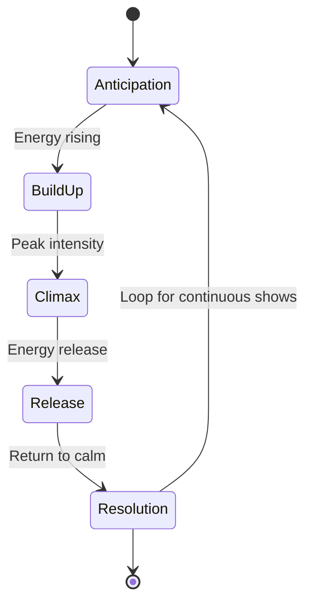

# Lightshow Storytelling Framework
## Emotional Narrative Construction Through Light

```
╔═══════════════════════════════════════════════════════════════════════════════╗
║                     SPECTRASYNQ K1-LIGHTWAVE                                   ║
║               Storytelling Framework Document v1.0                             ║
║                                                                                ║
║   "Every Light Show Tells a Story — Make Yours Unforgettable"                 ║
╚═══════════════════════════════════════════════════════════════════════════════╝
```

**Related Documents:**
- [Creative Pattern Guide](LGP_CREATIVE_PATTERN_GUIDE.md) - Physics and pattern fundamentals
- [Implementation Playbook](PATTERN_IMPLEMENTATION_PLAYBOOK.md) - Technical specifications

---

## Table of Contents

1. [The Art of Light Storytelling](#1-the-art-of-light-storytelling)
2. [Emotional Colour Theory](#2-emotional-colour-theory)
3. [Temporal Narrative Structures](#3-temporal-narrative-structures)
4. [Pacing and Rhythm Guidelines](#4-pacing-and-rhythm-guidelines)
5. [The Emotional Impact Matrix](#5-the-emotional-impact-matrix)
6. [Story Arc Templates](#6-story-arc-templates)
7. [Audio-Emotion Mapping](#7-audio-emotion-mapping)
8. [Advanced Narrative Techniques](#8-advanced-narrative-techniques)

---

## 1. The Art of Light Storytelling

Light is humanity's oldest storytelling medium—from campfires to cathedrals, we've always used light to evoke emotion and convey meaning. The LGP system gives you 320 pixels of narrative canvas, updated 120 times per second. Every frame is a word, every sequence a sentence, every show a story.

### 1.1 Why Stories Matter

```
┌─────────────────────────────────────────────────────────────────┐
│                                                                 │
│   RANDOM PATTERNS           vs        NARRATIVE PATTERNS        │
│   ═══════════════                     ══════════════════        │
│                                                                 │
│   • Impressive briefly                • Engaging indefinitely   │
│   • Visual noise                      • Visual meaning          │
│   • Forgotten quickly                 • Remembered deeply       │
│   • "That's cool"                     • "That moved me"         │
│                                                                 │
└─────────────────────────────────────────────────────────────────┘
```

### 1.2 The Three Pillars of Light Narrative

```
                    ┌─────────────────┐
                    │   EMOTIONAL     │
                    │    JOURNEY      │
                    └────────┬────────┘
                             │
            ┌────────────────┼────────────────┐
            │                │                │
     ┌──────┴──────┐  ┌──────┴──────┐  ┌──────┴──────┐
     │   COLOUR    │  │   MOTION    │  │   TIMING    │
     │   ═══════   │  │   ═══════   │  │   ═══════   │
     │  What you   │  │  How it     │  │  When it    │
     │   feel      │  │   moves     │  │  happens    │
     └─────────────┘  └─────────────┘  └─────────────┘
```

---

## 2. Emotional Colour Theory

### 2.1 The Colour-Emotion Wheel

Colours carry inherent emotional associations. Understanding these allows you to paint with feelings.

```
                         0° RED
                      ╱Passion, Energy
                    ╱   Anger, Urgency
            330°  ╱
          Magenta        ╲  30° Orange
         Romance          ╲Warmth, Joy
         Mystery           ╲Enthusiasm
                            
    270° Blue ─────────○───────── 90° Yellow
    Calm, Trust                   Hope, Optimism
    Sadness, Depth                Happiness, Caution
    
                            
          210°           ╲
          Cyan             ╲ 150° Green
         Serenity           ╲Growth, Nature
         Technology          ╲Harmony, Healing
                    ╲
                      ╲
                       180° Cyan-Green
                      Balance, Freshness
```

### 2.2 Colour Emotion Mapping Matrix

| Colour | Primary Emotion | Secondary Emotions | Best Used For |
|--------|-----------------|-------------------|---------------|
| **Red** (0°) | Passion | Anger, urgency, love, danger | Climax, intensity, beats |
| **Orange** (30°) | Warmth | Joy, energy, creativity, enthusiasm | Build-up, excitement |
| **Yellow** (60°) | Happiness | Hope, caution, attention | Peaks, highlights |
| **Green** (120°) | Growth | Nature, harmony, calm, renewal | Resolution, peace |
| **Cyan** (180°) | Serenity | Technology, future, clarity | Transitions, flow |
| **Blue** (240°) | Calm | Trust, sadness, depth, wisdom | Tension, melancholy |
| **Purple** (270°) | Mystery | Royalty, spirituality, magic | Drama, unknown |
| **Magenta** (300°) | Romance | Passion, mystery, transformation | Transitions, magic |

### 2.3 Chromagram-to-Emotion Mapping

The chromagram analysis identifies the dominant musical notes. Each note carries emotional weight:

```
Musical Note → Hue Mapping → Emotional Quality

┌────────┬──────────┬─────────────┬────────────────────────────┐
│  Note  │  Hue (°) │   Colour    │      Emotional Quality     │
├────────┼──────────┼─────────────┼────────────────────────────┤
│   C    │    0     │    Red      │ Grounding, foundation      │
│   C#   │   30     │   Orange    │ Tension, reaching          │
│   D    │   60     │   Yellow    │ Brightness, joy            │
│   D#   │   90     │ Yellow-Grn  │ Transition, uncertainty    │
│   E    │  120     │   Green     │ Resolution, natural        │
│   F    │  150     │  Cyan-Grn   │ Flow, movement             │
│   F#   │  180     │    Cyan     │ Clarity, openness          │
│   G    │  210     │  Cyan-Blue  │ Depth, expansion           │
│   G#   │  240     │    Blue     │ Melancholy, introspection  │
│   A    │  270     │   Purple    │ Mystery, spirituality      │
│   A#   │  300     │   Magenta   │ Passion, intensity         │
│   B    │  330     │  Mag-Red    │ Anticipation, leading      │
└────────┴──────────┴─────────────┴────────────────────────────┘
```

### 2.4 Colour Progression Patterns

#### Rising Action (Building Tension)
```
Blue → Purple → Magenta → Red
240°  → 270°  →  300°   → 360°

Emotional Arc: Calm → Mystery → Passion → Climax
```

#### Falling Action (Resolution)
```
Red → Orange → Yellow → Green → Cyan
0°  →  30°   →  60°   →  120° → 180°

Emotional Arc: Intensity → Warmth → Joy → Peace → Serenity
```

#### Harmonic Pairs (Complementary Emotions)
```
Red ←→ Cyan       (Passion ←→ Serenity)
Orange ←→ Blue    (Warmth ←→ Depth)
Yellow ←→ Purple  (Joy ←→ Mystery)
Green ←→ Magenta  (Growth ←→ Transformation)
```

---

## 3. Temporal Narrative Structures

### 3.1 The Five-Act Light Structure

Every compelling light show follows a dramatic arc:



#### Act 1: Anticipation (Setup)
```
Duration:    10-20% of total
Brightness:  30-50%
Motion:      Slow, gathering
Colours:     Cool blues, purples
Pattern:     Simple, unified
Emotion:     Curiosity, waiting
```

#### Act 2: Build-Up (Rising Action)
```
Duration:    20-30% of total
Brightness:  50-80%, rising
Motion:      Accelerating
Colours:     Transitioning warm
Pattern:     Increasing complexity
Emotion:     Excitement, tension
```

#### Act 3: Climax (Peak)
```
Duration:    5-15% of total
Brightness:  90-100%
Motion:      Maximum speed/complexity
Colours:     Vivid, saturated
Pattern:     Full interference
Emotion:     Exhilaration, release
```

#### Act 4: Release (Falling Action)
```
Duration:    15-25% of total
Brightness:  80-40%, falling
Motion:      Decelerating
Colours:     Softening
Pattern:     Simplifying
Emotion:     Satisfaction, calm
```

#### Act 5: Resolution (Denouement)
```
Duration:    15-25% of total
Brightness:  20-40%
Motion:      Slow, peaceful
Colours:     Cool, neutral
Pattern:     Simple, harmonious
Emotion:     Peace, completion
```

### 3.2 State Machine for Narrative Control

```cpp
enum NarrativeState {
    ANTICIPATION,
    BUILD_UP,
    CLIMAX,
    RELEASE,
    RESOLUTION
};

struct NarrativeEngine {
    NarrativeState currentState = ANTICIPATION;
    float stateProgress = 0.0f;
    float stateEnergy = 0.0f;
    
    void update(const AudioData& audio) {
        switch (currentState) {
            case ANTICIPATION:
                if (audio.energy > threshold * 1.2f) {
                    transitionTo(BUILD_UP);
                }
                break;
                
            case BUILD_UP:
                stateProgress += 0.01f * audio.energy;
                if (stateProgress > 1.0f || audio.beat.detected) {
                    transitionTo(CLIMAX);
                }
                break;
                
            case CLIMAX:
                if (audio.energy < threshold * 0.5f) {
                    transitionTo(RELEASE);
                }
                break;
                
            case RELEASE:
                stateProgress -= 0.005f;
                if (stateProgress < 0) {
                    transitionTo(RESOLUTION);
                }
                break;
                
            case RESOLUTION:
                if (audio.energy > threshold) {
                    transitionTo(ANTICIPATION);
                }
                break;
        }
    }
};
```

---

## 4. Pacing and Rhythm Guidelines

### 4.1 Beat Synchronisation Techniques

The relationship between light and music beat is crucial for emotional impact.

```
┌──────────────────────────────────────────────────────────────────┐
│                  BEAT SYNCHRONISATION MODES                      │
├──────────────────────────────────────────────────────────────────┤
│                                                                  │
│  ON-BEAT:        │▌  │▌  │▌  │▌  │▌  │▌  │▌  │▌               │
│                  └──┴──┴──┴──┴──┴──┴──┴──┘                      │
│                  Effect triggers exactly on beat                 │
│                  Emotion: Energy, power, drive                   │
│                                                                  │
│  OFF-BEAT:          │▌    │▌    │▌    │▌                        │
│                  └──┴──┴──┴──┴──┴──┴──┴──┘                      │
│                  Effect triggers between beats                   │
│                  Emotion: Tension, anticipation, jazz            │
│                                                                  │
│  DOUBLE-TIME:    │▌│▌│▌│▌│▌│▌│▌│▌│▌│▌│▌│▌│▌│▌│▌│▌              │
│                  Effect twice per beat                           │
│                  Emotion: Urgency, excitement, climax            │
│                                                                  │
│  HALF-TIME:      │▌      │▌      │▌      │▌                     │
│                  Effect every other beat                         │
│                  Emotion: Weight, gravity, importance            │
│                                                                  │
│  POLYRHYTHMIC:   │▌  │▌ │▌  │▌ │▌  │▌                           │
│                  3:4 or other ratios                             │
│                  Emotion: Complexity, sophistication             │
│                                                                  │
└──────────────────────────────────────────────────────────────────┘
```

### 4.2 Tension-Release Cycles

The fundamental unit of musical storytelling:

```
    Tension                              Release
    Building                             Resolving
       │                                    │
       │    ╱╲         ╱╲                   │
       │   ╱  ╲       ╱  ╲                  │
       │  ╱    ╲     ╱    ╲                 │
       │ ╱      ╲   ╱      ╲                │
       │╱        ╲ ╱        ╲               │
───────┴──────────╳──────────╲──────────────┴──────────
       │         Peak        │
       │                     │
       └─────────────────────┘
              CYCLE
```

#### Tension Building Techniques
- Increasing brightness over time
- Contracting motion toward centre
- Accelerating pattern speed
- Colour shift toward red/orange
- Growing complexity

#### Release Techniques
- Sudden brightness burst then fade
- Expanding motion from centre
- Pattern simplification
- Colour shift toward blue/green
- Wave collapse effects

### 4.3 Musical Structure Alignment

Align your visual narrative to common song structures:

```
┌────────────────────────────────────────────────────────────────┐
│                    TYPICAL SONG STRUCTURE                       │
├────────────────────────────────────────────────────────────────┤
│                                                                 │
│  Intro    → Verse 1  → Chorus 1 → Verse 2  → Chorus 2         │
│  ─────      ───────    ────────   ───────    ────────         │
│  Setup     Story A     Peak       Story B    Peak              │
│  Mystery   Gentle      Energy     Develop    Energy            │
│                                                                 │
│  → Bridge   → Breakdown → Final Chorus → Outro                 │
│    ──────     ─────────   ────────────   ─────                 │
│    Contrast   Tension     Ultimate Peak  Resolution            │
│    Change     Build       Maximum        Peace                  │
│                                                                 │
└────────────────────────────────────────────────────────────────┘

Visual Strategy Per Section:

INTRO (0-15 sec):
  - Soft, ambient patterns
  - Single colour family
  - Slow, gentle motion
  - BUILD ANTICIPATION

VERSE (30-45 sec each):
  - Moderate intensity
  - Rhythm-following
  - Story-telling patterns
  - SUPPORT THE MELODY

CHORUS (30-45 sec each):
  - Maximum energy
  - Beat-synchronized
  - Full colour range
  - EMOTIONAL PEAK

BRIDGE (15-30 sec):
  - Contrasting pattern
  - Different colour palette
  - Unexpected motion
  - CREATE SURPRISE

BREAKDOWN (15-30 sec):
  - Stripped back
  - Minimal patterns
  - Tension building
  - PREPARE FOR CLIMAX

OUTRO (15-30 sec):
  - Fading intensity
  - Return to intro themes
  - Peaceful resolution
  - SATISFYING ENDING
```

---

## 5. The Emotional Impact Matrix

### 5.1 Complete Emotion-to-Pattern Mapping

| Emotion | Colour Range | Motion Type | Speed | Intensity | Pattern Type | Audio Trigger |
|---------|--------------|-------------|-------|-----------|--------------|---------------|
| **Joy** | Yellow-Orange (45-60°) | Expanding pulses | Fast | High (80%) | Particle bursts | Beat + High energy |
| **Melancholy** | Blue-Purple (240-270°) | Slow waves | Slow | Medium (50%) | Gentle interference | Low energy, minor keys |
| **Excitement** | Orange-Red (15-30°) | Rapid oscillation | Very fast | High (90%) | Chaotic particles | High tempo, rising energy |
| **Peace** | Green-Cyan (150-180°) | Gentle drift | Very slow | Low (30%) | Smooth gradients | Ambient, no beats |
| **Tension** | Red-Black | Contracting | Variable | Building | Narrowing focus | Rising amplitude |
| **Resolution** | White-Pastels | Outward bloom | Decelerating | Fading | Expanding waves | Beat drop aftermath |
| **Mystery** | Purple-Magenta (270-300°) | Swirling | Medium | Medium (60%) | Vortex patterns | Unusual harmonics |
| **Power** | Red-Gold (0-30°) | Pulsing | Beat-synced | Very high (95%) | Sharp edges | Strong beats |
| **Wonder** | Constrained spectral split (two families + neutral) | Floating | Slow | Medium (50%) | Holographic | Unexpected notes |
| **Fear** | Dark red-black | Flickering | Erratic | Variable | Chaotic | Dissonance |
| **Love** | Pink-Rose (330-345°) | Breathing | Slow | Warm (60%) | Soft waves | Gentle melody |
| **Triumph** | Gold-White | Explosive outward | Fast→Slow | Peak→Fade | Radial burst | Final chorus beat |

### 5.2 Emotional Transition Paths

When transitioning between emotions, follow natural progressions:

```
JOY → MELANCHOLY
Warm family → Neutral → Cool family
Fast → Medium → Slow
High → Medium → Low

TENSION → RESOLUTION
Low-saturation pressure (near-neutral) → Neutral bloom → Calm family
Contracting → Static → Expanding
Building → Peak → Fading

PEACE → EXCITEMENT
Cool family → Neutral → Warm family
Slow → Medium → Fast
Low → Medium → High

MYSTERY → REVELATION
Mystery family → Neutral highlight → Warm clarity
Swirling → Focused → Expanding
Medium → Building → Burst
```

---

## 6. Story Arc Templates

### 6.1 Template 1: The 3-Minute Ambient Journey

**Purpose:** Background visualisation for relaxation or meditation

```
TIME BREAKDOWN:
0:00 - 0:30   │ AWAKENING
              │ Slow fade from black
              │ Single colour (blue/green)
              │ Gentle breathing motion
              
0:30 - 1:00   │ EXPLORATION
              │ Colour slowly shifts
              │ Second wave layer appears
              │ Subtle interference patterns
              
1:00 - 1:30   │ DEEPENING
              │ Complexity increases slightly
              │ Depth illusions emerge
              │ Colours blend harmoniously
              
1:30 - 2:00   │ FLOURISHING
              │ Peak complexity (still gentle)
              │ Full colour palette engaged
              │ Maximum visual interest
              
2:00 - 2:30   │ RETURNING
              │ Simplifying patterns
              │ Colour converging
              │ Motion slowing
              
2:30 - 3:00   │ RESTING
              │ Return to single colour
              │ Minimal motion
              │ Fade toward stillness

PARAMETER CURVES:
Brightness:  ╱─────────────────╲
            ╱                   ╲
Complexity: ╱───────╲            
           ╱         ╲───────────╲
Speed:     ╱─────╲                
          ╱       ╲───────────────╲
```

### 6.2 Template 2: Beat-Driven Intensity Ride

**Purpose:** High-energy dance/electronic music visualisation

```
TIME BREAKDOWN:
0:00 - 0:15   │ DROP ANTICIPATION
              │ Dark, minimal
              │ Low rumble colours (deep red/purple)
              │ Contracting toward centre
              
0:15 - 0:20   │ THE BUILD
              │ Rapid intensity increase
              │ White flashes
              │ Speed accelerating
              
0:20 - 0:21   │ THE DROP
              │ MAXIMUM EVERYTHING
              │ Maximum contrast + neutral bloom (no hue-wheel sweep)
              │ Beat-synchronized impacts (avoid strobing; enforce safe pulse width)
              
0:21 - 0:45   │ FULL ENERGY
              │ Every beat = impact
              │ Bass drives edge-balance and contrast (not colour cycling)
              │ Interference patterns dancing
              
0:45 - 1:00   │ BREATHING ROOM
              │ Half-time feel
              │ Sustained colours
              │ Larger, slower patterns
              
1:00 - 1:15   │ SECOND BUILD
              │ Tension returning
              │ Complexity climbing
              │ Anticipation
              
1:15 - 1:45   │ SECOND DROP
              │ Even bigger response
              │ New colour palette
              │ Different pattern style

PARAMETER CURVES:
Brightness:  ╱│╱│╱│╱│╱│╱│╱│╲────╱│╱│
              BUILD  DROP  BREATH  BUILD
Complexity:  ─────────│███████│───────│█
             Low      Full    Mid     Full
```

### 6.3 Template 3: Emotional Crescendo Sequence

**Purpose:** Building emotional narrative (film score, orchestral)

```
TIME BREAKDOWN:
0:00 - 0:30   │ AWAKENING (Wonder)
              │ Single point of light at centre
              │ Slowly expanding
              │ Cool blue glow
              │ Minimal motion
              
0:30 - 1:00   │ DISCOVERY (Curiosity)
              │ More lights appearing
              │ Gentle interactions
              │ Colours warming slightly
              │ Patterns emerging
              
1:00 - 1:45   │ CHALLENGE (Tension)
              │ Two opposing forces
              │ Interference conflicts
              │ Colours contrasting
              │ Energy building
              
1:45 - 2:15   │ STRUGGLE (Drama)
              │ Maximum conflict
              │ Chaotic interference
              │ Rapid colour changes
              │ Near-climax intensity
              
2:15 - 2:30   │ BREAKTHROUGH (Triumph)
              │ Sudden unification
              │ White/gold explosion
              │ Expanding wave
              │ PEAK MOMENT
              
2:30 - 3:00   │ TRANSCENDENCE (Peace)
              │ Slow fade to warm glow
              │ Harmonious colours
              │ Gentle outward motion
              │ Satisfying resolution

EMOTIONAL CURVE:
        TRIUMPH
           ↑
    ╱─────────│
   ╱  DRAMA   │╲
  ╱           │ ╲
 ╱  TENSION   │  ╲ PEACE
╱             │   ╲──────
WONDER        │
```

### 6.4 Template 4: Meditative Breathing Pattern

**Purpose:** Breath-synchronized calming visualisation

```
SINGLE BREATH CYCLE (6 seconds):

0.0s │ INHALE BEGIN
     │ Centre origin begins expanding
     │ Brightness: 30% → rising
     │ Colour: Cool blue
     │ Pattern: Contracting toward self
     
2.0s │ INHALE PEAK
     │ Maximum expansion reached
     │ Brightness: 70%
     │ Colour: Warm white
     │ Pattern: Fully gathered
     
2.5s │ PAUSE (Hold)
     │ Static moment
     │ Brightness: 70% sustained
     │ Colour: Warm white
     │ Pattern: Still
     
3.0s │ EXHALE BEGIN
     │ Release outward
     │ Brightness: 70% → falling
     │ Colour: Transitioning cool
     │ Pattern: Expanding from centre
     
5.0s │ EXHALE COMPLETE
     │ Full expansion
     │ Brightness: 30%
     │ Colour: Deep blue
     │ Pattern: Fully dispersed
     
6.0s │ PAUSE (Empty)
     │ Stillness before next cycle
     │ Brightness: 30% sustained
     │ Colour: Deep blue
     │ Pattern: Minimal

BREATH ALIGNMENT:
Inhale  Pause  Exhale  Pause
───╱────│────╲────│────
  2.0s  0.5s  2.5s  1.0s
```

---

## 7. Audio-Emotion Mapping

### 7.1 Frequency Band to Emotional Quality

```
┌─────────────────────────────────────────────────────────────────┐
│              FREQUENCY → EMOTION → VISUAL MAPPING               │
├─────────────────────────────────────────────────────────────────┤
│                                                                 │
│  SUB-BASS (20-60 Hz)                                           │
│  ═══════════════════                                           │
│  Feeling: Physical, primal, power                              │
│  Visual: Deep pulses, whole-body movements                     │
│  Colour: Deep reds, blacks                                     │
│  Pattern: Large scale, slow, fundamental                       │
│                                                                 │
│  BASS (60-250 Hz)                                              │
│  ═══════════════                                               │
│  Feeling: Foundation, groove, drive                            │
│  Visual: Rhythmic pulses, beat-following                       │
│  Colour: Warm reds, oranges                                    │
│  Pattern: Beat-synchronized, moderate scale                    │
│                                                                 │
│  LOW-MID (250-500 Hz)                                          │
│  ═════════════════════                                         │
│  Feeling: Warmth, body, presence                               │
│  Visual: Fill patterns, supporting motion                      │
│  Colour: Oranges, yellows                                      │
│  Pattern: Medium detail, flowing                               │
│                                                                 │
│  MID (500-2000 Hz)                                             │
│  ══════════════════                                            │
│  Feeling: Emotion, melody, voice                               │
│  Visual: Expressive movement, colour changes                   │
│  Colour: Constrained palette families (no hue-wheel sweeps)     │
│  Pattern: Melodic following, expressive                        │
│                                                                 │
│  HIGH-MID (2000-4000 Hz)                                       │
│  ═══════════════════════                                       │
│  Feeling: Clarity, presence, articulation                      │
│  Visual: Definition, sharp edges                               │
│  Colour: Bright, clear                                         │
│  Pattern: Detail enhancement, edges                            │
│                                                                 │
│  HIGH (4000-10000 Hz)                                          │
│  ═══════════════════                                           │
│  Feeling: Air, sparkle, excitement                             │
│  Visual: Sparkles, shimmers, fine detail                       │
│  Colour: Whites, cyans                                         │
│  Pattern: Particle effects, high frequency shimmer             │
│                                                                 │
│  ULTRA-HIGH (10000-20000 Hz)                                   │
│  ═══════════════════════════                                   │
│  Feeling: Brilliance, edge                                     │
│  Visual: Subtle texture, air                                   │
│  Colour: White highlights                                      │
│  Pattern: Texture overlay, subtle                              │
│                                                                 │
└─────────────────────────────────────────────────────────────────┘
```

### 7.2 Beat Detection → Narrative Events

```cpp
// Map beat detection to story events
void processBeatEvent(const BeatInfo& beat) {
    switch (narrativeState) {
        case ANTICIPATION:
            // Beats create small pulses, building expectation
            createPulse(CENTER, beat.energy * 0.5f, BLUE);
            break;
            
        case BUILD_UP:
            // Beats accelerate the build
            createPulse(CENTER, beat.energy * 0.8f, ORANGE);
            buildProgress += beat.confidence * 0.1f;
            break;
            
        case CLIMAX:
            // Every beat is explosive
            createExplosion(CENTER, beat.energy, WHITE_GOLD);  // no rainbows
            shakeIntensity = beat.energy;
            break;
            
        case RELEASE:
            // Beats create gentle ripples
            createRipple(CENTER, beat.energy * 0.6f, CYAN);
            break;
            
        case RESOLUTION:
            // Beats are soft pulses
            createGlow(CENTER, beat.energy * 0.3f, GREEN);
            break;
    }
}
```

### 7.3 Harmonic Content → Emotional Colour

```
MAJOR KEY SONGS:                    MINOR KEY SONGS:
═══════════════                     ═══════════════
Dominant notes: C, E, G             Dominant notes: A, C, E
Feeling: Happy, bright              Feeling: Sad, mysterious
                                    
Colour palette:                     Colour palette:
  Yellow (60°)                        Blue (240°)
  Orange (30°)                        Purple (270°)
  Warm white                          Cool white
                                    
Motion:                             Motion:
  Expanding                           Flowing
  Rising                              Drifting
  Bouncing                            Swaying
```

---

## 8. Advanced Narrative Techniques

### 8.1 Motif Development

Create recognizable visual "phrases" that evolve:

```
MOTIF INTRODUCTION:
  Simple version, easily recognizable
  Example: Single blue pulse from centre

MOTIF VARIATION 1:
  Same core element, different context
  Example: Blue pulse with orange trail

MOTIF DEVELOPMENT:
  Core element transformed
  Example: Pulse becomes expanding ring

MOTIF CLIMAX:
  Maximum expression
  Example: Multiple rings, full colour

MOTIF RESOLUTION:
  Return to simple form
  Example: Single pulse, now golden
```

### 8.2 Contrast and Surprise

```
TECHNIQUES FOR SURPRISE:

1. SILENCE BREAK
   After sustained activity → sudden stillness
   Impact: Draws attention, creates anticipation

2. COLOUR INVERSION
   Sudden shift to complementary colour
   Impact: Emotional pivot point

3. MOTION REVERSAL
   Expanding → contracting (or vice versa)
   Impact: Confusion → resolution

4. COMPLEXITY JUMP
   Simple → maximum complexity (or reverse)
   Impact: Drama, emphasis

5. TEMPO SHIFT
   Double-time or half-time suddenly
   Impact: Energy change, surprise
```

### 8.3 Layered Storytelling

Tell multiple stories simultaneously:

```
┌─────────────────────────────────────────────────────────────────┐
│                     LAYERED NARRATIVE                           │
├─────────────────────────────────────────────────────────────────┤
│                                                                 │
│  LAYER 3: PARTICLE SPARKLES (Transient details)                │
│  ━━━━━━━━━━━━━━━━━━━━━━━━━━━━━━━━━━━━━━━━━━━━━                 │
│  Story: Individual moments of joy/surprise                     │
│  Timing: Triggered by high-frequency transients                │
│                                                                 │
│  LAYER 2: WAVE PATTERNS (Melodic narrative)                    │
│  ━━━━━━━━━━━━━━━━━━━━━━━━━━━━━━━━━━━━━━━━━                     │
│  Story: Emotional journey following melody                     │
│  Timing: Beat-synchronized, phrase-following                   │
│                                                                 │
│  LAYER 1: AMBIENT COLOUR (Harmonic foundation)                 │
│  ━━━━━━━━━━━━━━━━━━━━━━━━━━━━━━━━━━━━━━━━━━                     │
│  Story: Overall mood and atmosphere                            │
│  Timing: Slow evolution, chord-following                       │
│                                                                 │
└─────────────────────────────────────────────────────────────────┘
```

### 8.4 Emotional Memory

Create patterns that reference earlier moments:

```cpp
struct EmotionalMemory {
    CRGB significantColour;      // Colour from peak moment
    float significantSpeed;      // Speed from peak
    uint8_t significantPattern;  // Pattern ID from peak
    
    // Called during climax
    void recordPeakMoment() {
        significantColour = currentDominantColour;
        significantSpeed = currentSpeed;
        significantPattern = currentPatternID;
    }
    
    // Called during resolution to create callback
    void echoMemory(float strength) {
        // Subtly bring back peak moment characteristics
        blendColour(significantColour, strength * 0.3f);
        blendSpeed(significantSpeed, strength * 0.2f);
    }
};
```

---

## Conclusion: Light as Language

Light shows transcend decoration when they become storytelling. By understanding the emotional weight of colours, the narrative power of timing, and the dramatic potential of motion, you transform LEDs into eloquent communicators of human experience.

```
┌─────────────────────────────────────────────────────────────────┐
│                                                                 │
│   "The best light shows don't just accompany music —           │
│    they illuminate its soul."                                   │
│                                                                 │
│                        — The LightwaveOS Storytelling Creed     │
│                                                                 │
└─────────────────────────────────────────────────────────────────┘
```

**Your Next Steps:**
1. Choose a story arc template that matches your music
2. Map the emotional journey using the colour-emotion matrix
3. Implement using the [Implementation Playbook](PATTERN_IMPLEMENTATION_PLAYBOOK.md)
4. Test against real music, refine your narrative timing

---

*Storytelling Framework Document v1.0*
*SpectraSynq LightwaveOS R&D - Narrative Design Division*

