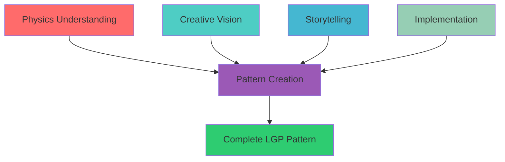

# LGP Creative Pattern Development Guide
## Complete Guide for Creating Light Guide Plate Visual Effects

*Comprehensive guide combining physics, creativity, storytelling, and implementation for developing LGP patterns*

---

## Overview

This guide synthesizes knowledge from four specialist domains to provide a complete framework for creating Light Guide Plate visual effects:

1. **Optical Physics** - Understanding waveguide physics and interference patterns
2. **Pattern Taxonomy** - Classifying and understanding existing patterns
3. **Storytelling** - Creating narrative structures and emotional impact
4. **Implementation** - Technical development and optimization

---

## Quick Start: Your First LGP Pattern

### Step 1: Understand the Physics

**Key Concepts:**
- Dual-edge injection creates interference patterns
- Centre-origin compliance is mandatory (LEDs 79/80)
- Total Internal Reflection (TIR) enables waveguide behaviour
- Interference creates standing waves and moiré patterns

**Reference:** See `docs/physics/LGP_OPTICAL_PHYSICS_REFERENCE.md`

### Step 2: Choose a Pattern Family

**Pattern Families:**
- **Interference:** Wave interference and standing waves
- **Geometric:** Mathematical shapes and structures
- **Organic:** Nature-inspired biological patterns
- **Quantum:** Quantum mechanics visualisations
- **Color Mixing:** Chromatic effects and colour theory

**Reference:** See `docs/creative/LGP_PATTERN_TAXONOMY.md`

### Step 3: Design the Story

**Narrative Structure:**
- BUILD: Tension increases
- HOLD: Peak intensity
- RELEASE: Energy releases
- REST: Calm period

**Reference:** See `docs/storytelling/LGP_STORYTELLING_FRAMEWORK.md`

### Step 4: Implement the Pattern

**Development Workflow:**
1. Concept development
2. Architecture design
3. Implementation
4. Integration
5. Optimization

**Reference:** See `docs/implementation/LGP_PATTERN_DEVELOPMENT_PLAYBOOK.md`

---

## Unified Development Framework

### The Four Pillars



### Development Process

#### Phase 1: Physics Analysis
- Identify optical principles involved
- Understand interference mechanisms
- Calculate physical parameters
- Reference: `LGP_OPTICAL_PHYSICS_REFERENCE.md`

#### Phase 2: Creative Design
- Choose pattern family
- Define visual signature
- Create colour palette
- Reference: `LGP_PATTERN_TAXONOMY.md`

#### Phase 3: Narrative Structure
- Design emotional arc
- Map to musical structure
- Plan temporal pacing
- Reference: `LGP_STORYTELLING_FRAMEWORK.md`

#### Phase 4: Implementation
- Write code using templates
- Optimize for performance
- Test thoroughly
- Reference: `LGP_PATTERN_DEVELOPMENT_PLAYBOOK.md`

---

## Practical Examples

### Example 1: Simple Interference Pattern

**Physics:** Standing wave formation from opposing edges
**Creative:** Geometric interference zones
**Storytelling:** Beat-synchronized intensity
**Implementation:** FastLED integer math

**Complete Implementation:**
```cpp
class SimpleInterference : public LightGuideEffect {
private:
    static float phase;
    
public:
    void render() override {
        phase += paletteSpeed * 0.01f;
        
        for (int i = 0; i < 160; i++) {
            // Calculate interference
            float dist1 = (float)i / 160.0f;
            float dist2 = (float)(159 - i) / 160.0f;
            float phaseDiff = (dist1 - dist2) * TWO_PI * 3.0f + phase;
            float interference = (1.0f + cos(phaseDiff)) * 0.5f;
            
            // Map to brightness
            uint8_t brightness = 128 + interference * 127 * visualParams.getIntensityNorm();
            
            // Apply narrative intensity
            float narrativeIntensity = NarrativeEngine::getInstance().getIntensity();
            brightness *= narrativeIntensity;
            
            // Render to strips
            uint8_t hue = gHue + i * 2;
            setEdge1LED(i, CHSV(hue, visualParams.saturation, brightness));
            setEdge2LED(i, CHSV(hue + 128, visualParams.saturation, brightness));
        }
        
        // Copy to unified buffer
        for (int i = 0; i < 160; i++) {
            leds[i] = strip1[i];
            leds[i + 160] = strip2[i];
        }
    }
};
```

### Example 2: Organic Growth Pattern

**Physics:** Reaction-diffusion simulation
**Creative:** Mycelial network growth
**Storytelling:** Growth narrative arc
**Implementation:** Physics-based simulation

**Key Features:**
- Organic, flowing motion
- Growth and decay cycles
- Natural colour palettes
- Centre-origin compliant

### Example 3: Quantum Effect

**Physics:** Wave function collapse
**Creative:** Probability visualisation
**Storytelling:** Uncertainty and resolution
**Implementation:** FastLED optimizations

**Key Features:**
- Probability-based patterns
- Collapse effects on beats
- Quantum superposition
- Centre-origin compliant

---

## Cross-Reference Guide

### Finding Information

| Topic | Document | Section |
|-------|----------|---------|
| **Waveguide Physics** | Physics Reference | Waveguide Physics |
| **Interference Patterns** | Physics Reference | Interference Mathematics |
| **Pattern Classification** | Pattern Taxonomy | Pattern Families |
| **New Pattern Ideas** | Pattern Taxonomy | Creative Concepts |
| **Narrative Engine** | Storytelling Framework | Narrative Engine |
| **Emotional Mapping** | Storytelling Framework | Emotional Impact |
| **Code Templates** | Implementation Playbook | Code Templates |
| **Performance** | Implementation Playbook | Optimization |

### Common Workflows

#### Creating a New Pattern
1. **Physics Reference** → Understand optical principles
2. **Pattern Taxonomy** → Choose family and inspiration
3. **Storytelling Framework** → Design narrative structure
4. **Implementation Playbook** → Write and optimize code

#### Optimizing Existing Pattern
1. **Implementation Playbook** → Performance profiling
2. **Physics Reference** → Verify physical accuracy
3. **Storytelling Framework** → Enhance emotional impact
4. **Pattern Taxonomy** → Compare with similar patterns

#### Debugging Issues
1. **Implementation Playbook** → Troubleshooting guide
2. **Physics Reference** → Verify calculations
3. **Pattern Taxonomy** → Check visual signatures
4. **Storytelling Framework** → Validate narrative timing

---

## Best Practices

### Physics Accuracy
- Understand underlying optical principles
- Verify calculations match observed behaviour
- Balance accuracy with performance
- Document simplifications

### Creative Expression
- Draw inspiration from existing patterns
- Combine techniques from different families
- Experiment with colour and motion
- Create unique visual signatures

### Storytelling
- Use narrative engine for dramatic timing
- Map emotions to colours and motion
- Synchronize with musical structure
- Create engaging temporal arcs

### Implementation
- Follow code templates and patterns
- Optimize for 120 FPS target
- Use static allocation only
- Test thoroughly before integration

---

## Resources

### Documentation
- **Physics Reference:** `docs/physics/LGP_OPTICAL_PHYSICS_REFERENCE.md`
- **Pattern Taxonomy:** `docs/creative/LGP_PATTERN_TAXONOMY.md`
- **Storytelling Framework:** `docs/storytelling/LGP_STORYTELLING_FRAMEWORK.md`
- **Implementation Playbook:** `docs/implementation/LGP_PATTERN_DEVELOPMENT_PLAYBOOK.md`

### Code References
- **Base Classes:** `src/effects/lightguide/LightGuideEffect.h`
- **Physics Engine:** `src/effects/lightguide/LGPPhysicsEngine.h`
- **Example Patterns:** `src/effects/strip/LGP*.cpp`

### Tools
- Performance profiler
- Memory analyzer
- Visual test patterns
- Audio test scenarios

---

## Conclusion

This guide provides a unified framework for creating Light Guide Plate patterns that combine scientific accuracy with artistic expression. By understanding physics, leveraging creative patterns, applying storytelling principles, and following implementation best practices, developers can create stunning visual effects that engage viewers both intellectually and emotionally.

**Remember:**
- Physics provides the foundation
- Creativity provides the vision
- Storytelling provides the engagement
- Implementation provides the reality

Together, these four pillars enable the creation of patterns that are both technically excellent and artistically compelling.

---

*Document Version 1.0*  
*LightwaveOS LGP Creative Pattern Development Guide*  
*Synthesizing physics, creativity, storytelling, and implementation*

