# LGP Pattern Taxonomy & Creative Development Guide
## Complete Classification and Creative Concepts for Light Guide Plate Effects

*Comprehensive taxonomy of 80+ LGP patterns, creative development framework, and new pattern concepts combining scientific precision with artistic expression*

---

## Table of Contents

1. [Pattern Taxonomy Overview](#pattern-taxonomy-overview)
2. [Pattern Families](#pattern-families)
3. [Visual Signatures](#visual-signatures)
4. [Pattern Relationship Map](#pattern-relationship-map)
5. [Creative Pattern Concepts](#creative-pattern-concepts)
6. [Color Theory Integration](#color-theory-integration)
7. [Motion Dynamics Catalog](#motion-dynamics-catalog)

---

## Pattern Taxonomy Overview

### Classification System

Patterns are classified using a hierarchical system:
- **Family**: Primary category (Geometric, Organic, Quantum, etc.)
- **Subfamily**: Specific technique or inspiration
- **Visual Signature**: Unique visual characteristics
- **Physics Basis**: Underlying optical/physical principles

### Pattern Count by Family

| Family | Count | Description |
|--------|-------|-------------|
| **Interference** | 13 | Wave interference and standing wave patterns |
| **Geometric** | 8 | Mathematical shapes and geometric patterns |
| **Advanced Optical** | 6 | Next-generation optical phenomena |
| **Organic** | 12 | Nature-inspired biological patterns |
| **Quantum** | 11 | Quantum mechanics visualisations |
| **Color Mixing** | 12 | Chromatic effects and colour theory |
| **Physics-Based** | 6 | Classical physics simulations |
| **Novel Physics** | 5 | Advanced physics concepts |
| **Fluid & Plasma** | 5 | Fluid dynamics and plasma phenomena |
| **Mathematical** | 5 | Mathematical systems and algorithms |
| **Total** | **83** | Complete LGP pattern library |

---

## Pattern Families

### 1. Interference Patterns

**Core Principle:** Wave interference between opposing edges creates standing waves, moiré patterns, and interference zones.

#### Primary Interference Effects

| Pattern | Visual Signature | Physics Basis |
|---------|------------------|---------------|
| **LGP Holographic** | Depth illusion with apparent 3D objects | Holographic interference patterns |
| **LGP Modal Resonance** | Standing wave modes with discrete frequencies | Waveguide mode excitation |
| **LGP Interference Scanner** | Moving interference patterns | Phase-shifted wave sources |
| **LGP Wave Collision** | Colliding wavefronts with interference | Wave superposition |
| **LGP Box Wave** | Distinct rectangular regions (6-8 boxes) | Fundamental mode with antinodes |
| **LGP Soliton Explorer** | Stable, non-dispersive wave packets | Soliton solutions to wave equation |
| **LGP Rogue Wave** | Sudden large-amplitude waves | Extreme wave events |
| **LGP Turing Pattern** | Self-organising spatial patterns | Reaction-diffusion systems |
| **LGP Kelvin-Helmholtz** | Instability patterns at boundaries | Shear flow instabilities |
| **LGP Faraday Rotation** | Polarisation rotation effects | Magnetic field interactions |
| **LGP Brillouin Zones** | Periodic structure patterns | Crystal lattice analogies |
| **LGP Shock Formation** | Shock wave patterns | Supersonic flow visualisation |
| **LGP Chaos Visual** | Chaotic interference patterns | Deterministic chaos |

**Visual Characteristics:**
- Distinct bright/dark zones
- Stationary or slowly moving patterns
- Phase-dependent intensity variations
- Centre-origin compliant propagation

**Creative Applications:**
- Musical rhythm visualisation
- Beat-synchronised patterns
- Harmonic frequency mapping
- Dynamic interference exploration

### 2. Geometric Patterns

**Core Principle:** Mathematical shapes and geometric structures leveraging waveguide physics.

#### Geometric Effects

| Pattern | Visual Signature | Physics Basis |
|---------|------------------|---------------|
| **LGP Diamond Lattice** | Rhombic interference grid | Cross-wave interference (±45°) |
| **LGP Concentric Rings** | Expanding circular patterns | Radial wave propagation |
| **LGP Star Burst** | Radial spokes from centre | Multi-directional wave sources |
| **LGP Hexagonal Grid** | Hexagonal tiling patterns | 60° symmetry interference |
| **LGP Spiral Vortex** | Spiral patterns with rotation | Azimuthal phase ramps |
| **LGP Sierpinski** | Fractal triangle patterns | Recursive geometric structures |
| **LGP Chevron Waves** | V-shaped wave patterns | Oblique wave interference |
| **LGP Mesh Network** | Interconnected node patterns | Network topology visualisation |

**Visual Characteristics:**
- Sharp geometric boundaries
- Symmetrical patterns
- Centre-origin radial expansion
- Mathematical precision

**Creative Applications:**
- Architectural visualisations
- Abstract geometric art
- Symmetry exploration
- Fractal pattern generation

### 3. Advanced Optical Effects

**Core Principle:** Next-generation optical phenomena exploiting dual-edge interference.

#### Advanced Optical Patterns

| Pattern | Visual Signature | Physics Basis |
|---------|------------------|---------------|
| **LGP Moiré Curtains** | Slowly drifting interference patterns | Beat frequency effects |
| **LGP Radial Ripple** | Expanding concentric circles | Virtual centre wave sources |
| **LGP Holographic Vortex** | Spiral interference patterns | Azimuthal + radial phase |
| **LGP Chromatic Shear** | Sliding colour planes | Linear shear velocity |
| **LGP Fresnel Zones** | Concentric zone patterns | Fresnel diffraction zones |
| **LGP Photonic Crystal** | Periodic optical structures | Bandgap engineering analogies |

**Visual Characteristics:**
- Complex interference geometry
- Temporal evolution
- Depth perception illusions
- Multi-frequency components

**Creative Applications:**
- Holographic visualisations
- Depth illusion effects
- Advanced optical art
- Scientific visualisation

### 4. Organic Patterns

**Core Principle:** Nature-inspired biological and organic growth patterns.

#### Organic Effects

| Pattern | Visual Signature | Physics Basis |
|---------|------------------|---------------|
| **LGP Aurora Borealis** | Flowing aurora-like patterns | Charged particle interactions |
| **LGP Bioluminescent** | Glowing organic waves | Bioluminescence simulation |
| **LGP Plasma Membrane** | Cell membrane-like structures | Lipid bilayer analogies |
| **LGP Synaptic Web** | Branching pathway patterns | Network topology + growth dynamics (non-ML) |
| **LGP Crystalline** | Crystal growth patterns | Crystal nucleation and growth |
| **LGP Fluid Dynamics** | Fluid flow patterns | Navier-Stokes equations |
| **LGP Plankton Waves** | Bioluminescent plankton waves | Marine bioluminescence |
| **LGP Bacterial Growth** | Bacterial colony patterns | Growth and diffusion |
| **LGP DNA Replication** | DNA replication fork visualisation | Molecular biology processes |
| **LGP Protein Folding** | Protein folding dynamics | Biomolecular dynamics |
| **LGP Mycelium Growth** | Fungal network growth | Network growth algorithms |
| **LGP Slime Mold** | Slime mold optimisation patterns | Physarum polycephalum algorithms |

**Visual Characteristics:**
- Organic, flowing motion
- Growth and decay cycles
- Branching structures
- Natural colour palettes

**Creative Applications:**
- Nature-inspired art
- Biological visualisations
- Organic motion studies
- Growth pattern exploration

### 5. Quantum Effects

**Core Principle:** Quantum mechanics visualisations and quantum phenomena.

#### Quantum Patterns

| Pattern | Visual Signature | Physics Basis |
|---------|------------------|---------------|
| **LGP Quantum Tunneling** | Probability wave penetration | Quantum tunnelling |
| **LGP Gravitational Lens** | Light bending effects | General relativity |
| **LGP Time Crystal** | Periodic temporal patterns | Time crystal dynamics |
| **LGP Metamaterial Cloak** | Invisibility region patterns | Negative refractive index |
| **LGP GRIN Cloak** | Gradient index cloaking | Graded index materials |
| **LGP Caustic Fan** | Caustic light patterns | Light focusing effects |
| **LGP Birefringent Shear** | Double refraction effects | Birefringence |
| **LGP Anisotropic Cloak** | Anisotropic cloaking | Direction-dependent properties |
| **LGP Evanescent Skin** | Surface wave effects | Evanescent fields |
| **LGP Quantum Entangle** | Entanglement visualisation | Quantum entanglement |
| **LGP Soliton Waves** | Soliton wave packets | Soliton solutions |

**Visual Characteristics:**
- Probability-based patterns
- Wave function collapse effects
- Non-classical behaviour
- Quantum superposition

**Creative Applications:**
- Quantum physics education
- Abstract quantum art
- Probability visualisations
- Quantum mechanics demonstrations

### 6. Color Mixing Effects

**Core Principle:** Chromatic effects and advanced colour theory applications.

#### Color Mixing Patterns

| Pattern | Visual Signature | Physics Basis |
|---------|------------------|---------------|
| **LGP Chromatic Aberration** | Wavelength-dependent refraction | Chromatic dispersion |
| **LGP Color Accelerator** | Colour velocity effects | Doppler-like shifts |
| **LGP Color Temperature** | Blackbody radiation colours | Planckian locus |
| **LGP RGB Prism** | RGB separation effects | Prism dispersion |
| **LGP Complementary** | Complementary colour mixing | Colour wheel theory |
| **LGP Additive Mix** | Additive/subtractive mixing | Colour mixing models |
| **LGP Quantum Colors** | Quantum colour states | Quantum chromodynamics analogies |
| **LGP Doppler Shift** | Frequency shift effects | Doppler effect |
| **LGP HSV Cylinder** | HSV colour space visualisation | Colour space geometry |
| **LGP Perceptual Blend** | Perceptually uniform blending | CIELAB colour space |
| **LGP Metameric** | Metameric colour pairs | Metamerism |
| **LGP DNA Helix** | Double helix colour patterns | DNA structure |
| **LGP Phase Transition** | Colour phase transitions | Phase change visualisation |

**Visual Characteristics:**
- Smooth colour gradients
- Wavelength-dependent effects
- Perceptual colour accuracy
- Dynamic colour evolution

**Creative Applications:**
- Colour theory exploration
- Musical harmony mapping
- Perceptual studies
- Chromatic art

### 7. Physics-Based Effects

**Core Principle:** Classical physics simulations and field visualisations.

#### Physics-Based Patterns

| Pattern | Visual Signature | Physics Basis |
|---------|------------------|---------------|
| **LGP Liquid Crystal** | Liquid crystal patterns | Nematic phase ordering |
| **LGP Prism Cascade** | Multiple prism effects | Sequential refraction |
| **LGP Silk Waves** | Silk-like wave patterns | Material wave properties |
| **LGP Beam Collision** | Colliding light beams | Particle collision physics |
| **LGP Laser Duel** | Opposing laser beams | Beam interaction |
| **LGP Tidal Forces** | Tidal force patterns | Gravitational tidal effects |

**Visual Characteristics:**
- Realistic physics behaviour
- Field visualisations
- Force-based motion
- Conservation law compliance

**Creative Applications:**
- Physics education
- Scientific visualisation
- Realistic simulations
- Field pattern exploration

### 8. Novel Physics Effects

**Core Principle:** Advanced physics concepts and cutting-edge phenomena.

#### Novel Physics Patterns

| Pattern | Visual Signature | Physics Basis |
|---------|------------------|---------------|
| **LGP Chladni Harmonics** | Chladni plate patterns | Vibrational modes |
| **LGP Gravitational Chirp** | Gravitational wave patterns | LIGO-style waveforms |
| **LGP Quantum Entangle** | Entanglement collapse | Quantum measurement |
| **LGP Mycelial Network** | Fungal network patterns | Network topology |
| **LGP Riley Dissonance** | Op art patterns | Visual perception effects |

**Visual Characteristics:**
- Advanced physics concepts
- Complex mathematical structures
- Cutting-edge visualisations
- Research-inspired patterns

**Creative Applications:**
- Research visualisation
- Advanced physics art
- Cutting-edge effects
- Scientific communication

### 9. Fluid & Plasma Effects

**Core Principle:** Fluid dynamics and plasma physics visualisations.

#### Fluid & Plasma Patterns

| Pattern | Visual Signature | Physics Basis |
|---------|------------------|---------------|
| **LGP Benard Convection** | Convection cell patterns | Rayleigh-Bénard convection |
| **LGP Rayleigh-Taylor** | Instability patterns | Rayleigh-Taylor instability |
| **LGP Plasma Pinch** | Plasma pinch effects | Z-pinch physics |
| **LGP Magnetic Reconnect** | Magnetic reconnection | Plasma physics |
| **LGP KH Enhanced** | Enhanced Kelvin-Helmholtz | Shear flow instabilities |

**Visual Characteristics:**
- Fluid-like motion
- Instability patterns
- Plasma visualisations
- Turbulent flow

**Creative Applications:**
- Fluid dynamics visualisation
- Plasma physics art
- Turbulence studies
- Flow pattern exploration

### 10. Mathematical Effects

**Core Principle:** Mathematical systems and algorithmic patterns.

#### Mathematical Patterns

| Pattern | Visual Signature | Physics Basis |
|---------|------------------|---------------|
| **LGP Cellular Automata** | Cellular automaton patterns | Rule-based systems |
| **LGP Gray-Scott** | Reaction-diffusion patterns | Gray-Scott equations |
| **LGP Mandelbrot Zoom** | Fractal zoom effects | Mandelbrot set |
| **LGP Strange Attractor** | Attractor patterns | Dynamical systems |
| **LGP Kuramoto Sync** | Synchronised oscillators | Kuramoto model |

**Visual Characteristics:**
- Algorithmic patterns
- Fractal structures
- Mathematical precision
- Emergent behaviour

**Creative Applications:**
- Mathematical art
- Algorithm visualisation
- Fractal exploration
- Emergent pattern studies

---

## Visual Signatures

### Signature Characteristics by Family

#### Interference Patterns
- **Brightness Variation:** High contrast bright/dark zones
- **Motion:** Stationary or slowly drifting
- **Colour:** Phase-dependent hue shifts
- **Texture:** Sharp boundaries between zones

#### Geometric Patterns
- **Brightness Variation:** Uniform within shapes
- **Motion:** Radial expansion or rotation
- **Colour:** Geometric colour mapping
- **Texture:** Sharp, well-defined edges

#### Organic Patterns
- **Brightness Variation:** Gradual, organic gradients
- **Motion:** Flowing, growth-like motion
- **Colour:** Natural, biological palettes
- **Texture:** Soft, organic boundaries

#### Quantum Effects
- **Brightness Variation:** Probability-based intensity
- **Motion:** Collapse and superposition effects
- **Colour:** Quantum state colours
- **Texture:** Probabilistic distributions

#### Color Mixing Effects
- **Brightness Variation:** Colour-dependent
- **Motion:** Colour flow and mixing
- **Colour:** Constrained palette families (no hue-wheel sweeps)
- **Texture:** Smooth colour gradients

---

## Pattern Relationship Map

### Inter-Family Relationships

```mermaid
graph TD
    A[Interference Patterns] --> B[Geometric Patterns]
    A --> C[Advanced Optical]
    B --> D[Mathematical Patterns]
    C --> E[Quantum Effects]
    F[Organic Patterns] --> G[Physics-Based]
    E --> H[Novel Physics]
    G --> I[Fluid & Plasma]
    J[Color Mixing] --> A
    J --> C
    J --> E
    
    style A fill:#ff6b6b
    style B fill:#4ecdc4
    style C fill:#45b7d1
    style D fill:#96ceb4
    style E fill:#9b59b6
    style F fill:#f39c12
    style G fill:#e74c3c
    style H fill:#34495e
    style I fill:#1abc9c
    style J fill:#e67e22
```



### Pattern Evolution Pathways

1. **Interference → Geometric:** Add geometric constraints to interference patterns
2. **Geometric → Mathematical:** Apply mathematical transformations
3. **Organic → Physics-Based:** Add physical constraints to organic growth
4. **Quantum → Novel Physics:** Extend quantum concepts to advanced physics
5. **Color Mixing → All Families:** Apply colour theory to any pattern family

---

## Creative Pattern Concepts

### New Interference Patterns

#### 1. Multi-Frequency Beat Patterns
**Concept:** Multiple frequency components create complex beat patterns
**Physics:** Superposition of waves with different frequencies
**Visual:** Evolving interference patterns with multiple time scales
**Implementation:**
```cpp
float interference = 0;
for (int f = 1; f <= 5; f++) {
    interference += sin(f * position * TWO_PI + f * time) / f;
}
```

#### 2. Traveling Wave Interference
**Concept:** Waves traveling in opposite directions create moving interference
**Physics:** Doppler-shifted wave sources
**Visual:** Moving interference fringes
**Implementation:**
```cpp
float wave1 = sin((position - velocity * time) * frequency);
float wave2 = sin((position + velocity * time) * frequency);
float interference = wave1 + wave2;
```

#### 3. Mode Jumping Effects
**Concept:** Rapid transitions between waveguide modes
**Physics:** Mode coupling and resonance
**Visual:** Sudden pattern changes
**Implementation:**
```cpp
int mode = (int)(time / mode_duration) % num_modes;
float pattern = sin(mode * position * PI);
```

### New Depth Illusion Effects

#### 4. Volumetric Particle Clouds
**Concept:** 3D particle clouds with depth perception
**Physics:** Z-depth mapping with intensity falloff
**Visual:** Particles at different depths
**Implementation:**
```cpp
float depth = calculateDepth(position);
float intensity = 1.0f / (1.0f + depth * depth);
uint8_t brightness = intensity * 255;
```

#### 5. Parallax Motion Effects
**Concept:** Objects moving at different speeds create parallax
**Physics:** Motion parallax simulation
**Visual:** Depth perception through motion
**Implementation:**
```cpp
float nearSpeed = 2.0f;
float farSpeed = 0.5f;
float nearPos = fmod(time * nearSpeed, 1.0f);
float farPos = fmod(time * farSpeed, 1.0f);
```

#### 6. Atmospheric Perspective
**Concept:** Distance-based colour and brightness changes
**Physics:** Atmospheric scattering simulation
**Visual:** Realistic depth perception
**Implementation:**
```cpp
float distance = calculateDistance(position);
CRGB color = blend(foregroundColor, skyColor, distance);
uint8_t brightness = 255 * exp(-distance * fogDensity);
```

### New Organic Patterns

#### 7. Bioluminescent Swarm
**Concept:** Swarming bioluminescent organisms
**Physics:** Particle swarm algorithms
**Visual:** Flowing, organic motion
**Implementation:**
```cpp
for (each particle) {
    applySwarmForces(particle, neighbours);
    updatePosition(particle);
    renderBioluminescence(particle);
}
```

#### 8. Mycelial Network Growth
**Concept:** Fungal network expansion patterns
**Physics:** Network growth algorithms
**Visual:** Branching, organic structures
**Implementation:**
```cpp
if (shouldBranch(node)) {
    createNewBranch(node, randomDirection());
}
growBranch(branch, growthRate);
```

#### 9. Cardiac Arrhythmia Spirals
**Concept:** Spiral wave patterns from cardiac dynamics
**Physics:** Excitable media dynamics
**Visual:** Rotating spiral patterns
**Implementation:**
```cpp
float phase = atan2(y - centerY, x - centerX);
float radius = sqrt((x-centerX)^2 + (y-centerY)^2);
float wave = sin(phase + radius * frequency - time);
```

### New Quantum Effects

#### 10. Quantum Entanglement Visualization
**Concept:** Visual representation of entangled states
**Physics:** Quantum entanglement collapse
**Visual:** Correlated pattern changes
**Implementation:**
```cpp
if (measurementTriggered) {
    collapseWaveFunction(entangledPair);
    updateCorrelatedPatterns();
}
```

#### 11. Quantum Tunneling Probability
**Concept:** Probability visualization of quantum tunneling
**Physics:** Quantum tunneling through barriers
**Visual:** Probability waves penetrating barriers
**Implementation:**
```cpp
float barrier = calculateBarrier(position);
float probability = exp(-barrier * tunnelingCoefficient);
float wave = probability * sin(position * frequency);
```

#### 12. Superposition States
**Concept:** Multiple quantum states simultaneously
**Physics:** Quantum superposition
**Visual:** Blended pattern states
**Implementation:**
```cpp
float state1 = calculateState1(position, time);
float state2 = calculateState2(position, time);
float superposition = sqrt(state1^2 + state2^2);
```

---

## Color Theory Integration

### Musical Note to Color Mapping

**12-Note Chromatic Scale:**

| Note | Frequency (Hz) | Hue Value | Color |
|------|----------------|-----------|-------|
| C | 261.63 | 0.000 | Red |
| C# | 277.18 | 0.083 | Red-Orange |
| D | 293.66 | 0.167 | Orange |
| D# | 311.13 | 0.250 | Yellow |
| E | 329.63 | 0.333 | Yellow-Green |
| F | 349.23 | 0.417 | Green |
| F# | 369.99 | 0.500 | Green-Cyan |
| G | 392.00 | 0.583 | Cyan |
| G# | 415.30 | 0.667 | Cyan-Blue |
| A | 440.00 | 0.750 | Blue |
| A# | 466.16 | 0.833 | Blue-Magenta |
| B | 493.88 | 0.917 | Magenta |

**Implementation:**
```cpp
uint8_t noteToHue(uint8_t note) {
    return (note * 255) / 12;  // Map 12 notes to 255 hue range
}

CRGB noteToColor(uint8_t note, uint8_t saturation, uint8_t brightness) {
    return CHSV(noteToHue(note), saturation, brightness);
}
```

### Triadic Harmony Systems

**Triadic Color Selection:**
```cpp
void getTriadic(CRGB base, CRGB& color1, CRGB& color2) {
    CHSV hsv = rgb2hsv_approximate(base);
    color1 = CHSV(hsv.hue + 85, hsv.sat, hsv.val);   // +120 degrees
    color2 = CHSV(hsv.hue + 170, hsv.sat, hsv.val);  // +240 degrees
}
```

### Perceptual Brightness Correction

**Human Eye Sensitivity:**
```cpp
float perceptualBrightness(CRGB color) {
    // Weight channels by perceptual importance
    float r = color.r * 0.299f;
    float g = color.g * 0.587f;
    float b = color.b * 0.114f;
    return (r + g + b) / 255.0f;
}

CRGB perceptualDim(CRGB color, float amount) {
    float brightness = perceptualBrightness(color);
    float dimmed = pow(brightness * amount, 2.2f);  // Gamma correction
    return color.nscale8(dimmed * 255);
}
```

### Dynamic Palette Generation

**Music-Responsive Palettes:**
```cpp
CRGBPalette16 generateMusicPalette(const AudioData& audio) {
    CRGB color1 = CHSV(audio.bass * 255, 255, 255);
    CRGB color2 = CHSV(audio.mid * 255, 200, 255);
    CRGB color3 = CHSV(audio.treble * 255, 150, 255);
    
    return CRGBPalette16(
        color1, color2, color3, color1,
        color2, color3, color1, color2,
        color3, color1, color2, color3,
        color1, color2, color3, color1
    );
}
```

---

## Motion Dynamics Catalog

### Spring Systems

**Spring Motion:**
```cpp
struct Spring {
    float position;
    float velocity;
    float target;
    float stiffness = 0.1f;
    float damping = 0.9f;
};

void updateSpring(Spring& spring) {
    float force = (spring.target - spring.position) * spring.stiffness;
    spring.velocity += force;
    spring.velocity *= spring.damping;
    spring.position += spring.velocity;
}
```

### Particle Physics

**Particle System:**
```cpp
struct Particle {
    float position;
    float velocity;
    float life;
    CRGB color;
};

void updateParticle(Particle& p) {
    p.position += p.velocity;
    p.velocity *= 0.98f;  // Friction
    p.life -= 0.02f;
    
    // Bounce at edges
    if (p.position < 0 || p.position >= NUM_LEDS) {
        p.velocity *= -0.8f;
        p.position = constrain(p.position, 0, NUM_LEDS - 1);
    }
}
```

### Wave Propagation

**Wave Equation:**
```cpp
void propagateWave(float* waveBuffer, float* waveVelocity) {
    const float tension = 0.025f;
    const float damping = 0.999f;
    
    // Calculate forces
    for (int i = 1; i < NUM_LEDS - 1; i++) {
        float force = (waveBuffer[i-1] + waveBuffer[i+1]) / 2 - waveBuffer[i];
        waveVelocity[i] += force * tension;
    }
    
    // Update positions
    for (int i = 0; i < NUM_LEDS; i++) {
        waveVelocity[i] *= damping;
        waveBuffer[i] += waveVelocity[i];
    }
}
```

### Centre-Origin Compliant Motion

**Outward Propagation:**
```cpp
void renderOutwardPattern(uint16_t center, float radius, CRGB color) {
    for (int i = 0; i < NUM_LEDS; i++) {
        float dist = abs(i - center);
        if (dist < radius) {
            float intensity = 1.0f - (dist / radius);
            leds[i] = color;
            leds[i].nscale8(intensity * 255);
        }
    }
}
```

**Inward Contraction:**
```cpp
void renderInwardPattern(float progress, CRGB color) {
    uint16_t edge1 = progress * STRIP_CENTER_POINT;
    uint16_t edge2 = STRIP_LENGTH - (progress * STRIP_CENTER_POINT);
    
    for (int i = edge1; i <= edge2; i++) {
        leds[i] = color;
    }
}
```

---

## Conclusion

This taxonomy provides a comprehensive framework for understanding, classifying, and developing Light Guide Plate patterns. By combining scientific precision with artistic expression, patterns can achieve both physical accuracy and visual beauty.

The relationship maps and creative concepts enable pattern developers to:
1. **Understand existing patterns** through classification
2. **Create new patterns** using established frameworks
3. **Combine techniques** from different families
4. **Apply colour theory** for musical harmony
5. **Implement motion dynamics** for organic movement

---

*Document Version 1.0*  
*LightwaveOS LGP Pattern Taxonomy*  
*For pattern creators bridging science and art*

