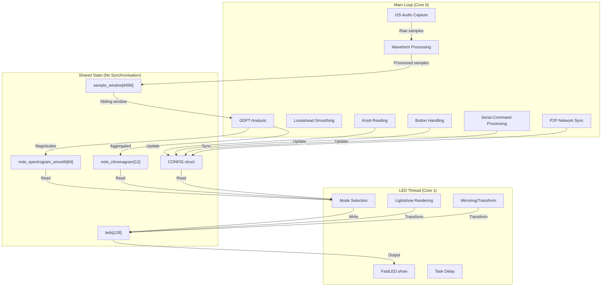

# Sensory Bridge System Architecture

## Overview

The Sensory Bridge firmware implements a dual-threaded audio-reactive LED system running on ESP32-S3. The architecture separates audio processing (main loop) from LED rendering (dedicated task) to achieve real-time performance.

## System Architecture Diagram



## Thread Architecture

### Main Loop (Core 0)

The main loop runs on Core 0 and executes the following sequence every frame:

1. **`check_knobs()`** - Reads analog knobs (PHOTONS, CHROMA, MOOD) every 10th frame, applies follower smoothing
2. **`check_buttons()`** - Debounces and handles NOISE and MODE button presses
3. **`check_settings()`** - Delayed config save (10s after last change)
4. **`check_serial()`** - Processes UART commands
5. **`run_p2p()`** - Handles ESP-NOW peer-to-peer network synchronisation
6. **`acquire_sample_chunk()`** - **BLOCKING**: Reads I2S DMA buffer (`portMAX_DELAY`)
7. **`run_sweet_spot()`** - Updates LEDC channels for "sweet spot" indicator LEDs
8. **`process_GDFT()`** - Executes Goertzel-based frequency analysis
9. **`lookahead_smoothing()`** - Anti-flicker smoothing using 2-frame lookahead
10. **`log_fps()`** - Calculates and logs system FPS

**Key Characteristics:**
- Frame rate is **dictated by I2S capture**: `i2s_read()` blocks until `CONFIG.SAMPLES_PER_CHUNK` samples are available
- Default: 128 samples at 12.2 kHz = ~10.5 ms per frame (~95 FPS theoretical max)
- All processing must complete within one frame period to maintain real-time operation

### LED Thread (Core 1)

The LED rendering thread runs independently on Core 1:

```cpp
xTaskCreatePinnedToCore(led_thread, "led_task", 4096, NULL, 
                        tskIDLE_PRIORITY + 1, &led_task, 1);
```

**Execution Flow:**
1. Check if `led_thread_halt` is false
2. If noise calibration active: render calibration progress
3. If transition queued: execute fade-to-black transition
4. **Mode Selection**: Based on `CONFIG.LIGHTSHOW_MODE`, call appropriate renderer:
   - `LIGHT_MODE_GDFT` → `light_mode_gdft()`
   - `LIGHT_MODE_GDFT_CHROMAGRAM` → `light_mode_gdft_chromagram()`
   - `LIGHT_MODE_BLOOM` → `light_mode_bloom(false)`
   - `LIGHT_MODE_BLOOM_FAST` → `light_mode_bloom(true)`
   - `LIGHT_MODE_VU` → `light_mode_vu()`
   - `LIGHT_MODE_VU_DOT` → `light_mode_vu_dot()`
5. **Mirroring** (if enabled): Scale to half, shift up, mirror downwards
6. **`show_leds()`**: Interpolate/resample, apply brightness, call `FastLED.show()`
7. **Task Delay**: 1ms (NeoPixel) or 3ms (DotStar) to prevent CPU hogging

**Key Characteristics:**
- Runs at **independent rate** from main loop (typically 100-300+ FPS)
- Reads shared spectrogram/chromagram data **without synchronisation**
- Potential for **tearing** if main loop updates data mid-render (mitigated by 2-frame lookahead delay)

## Component Responsibilities

### Audio Input Processing (`i2s_audio.h`)

**Purpose**: Capture I2S audio data and perform initial waveform processing.

**Key Functions:**
- `init_i2s()` - Configures ESP32 I2S peripheral for microphone input
- `acquire_sample_chunk()` - **BLOCKING** read from I2S DMA buffer

**Processing Steps:**
1. Read `CONFIG.SAMPLES_PER_CHUNK * sizeof(int32_t)` bytes from I2S DMA
2. Scale samples: `(raw * 0.000512) + 56000 - 5120` then `>> 2`
3. Clip to ±32767 range
4. Subtract DC offset: `sample - CONFIG.DC_OFFSET`
5. Store in `waveform[]` and `waveform_history[][]` (4-frame rolling buffer)
6. Update `sample_window[]` (4096-sample sliding window)
7. Calculate `max_waveform_val_raw` for sweet spot detection
8. Detect silence state (10s threshold below `SWEET_SPOT_MIN_LEVEL`)

**I2S Configuration (ESP32-S3):**
- Sample rate: `CONFIG.SAMPLE_RATE` (default 12,200 Hz)
- Bits per sample: 32-bit
- Channel format: `I2S_CHANNEL_FMT_RIGHT_LEFT`
- DMA buffer count: `1024 / CONFIG.SAMPLES_PER_CHUNK`
- DMA buffer length: `CONFIG.SAMPLES_PER_CHUNK`

### GDFT Analysis (`GDFT.h`)

**Purpose**: Convert time-domain audio to frequency-domain representation using Goertzel algorithm.

**Key Functions:**
- `process_GDFT()` - Main analysis function (marked `IRAM_ATTR` for performance)
- `lookahead_smoothing()` - Anti-flicker smoothing with 2-frame delay

**Processing Pipeline:**

1. **Goertzel Algorithm Execution** (64 parallel instances):
   - Each frequency bin runs Goertzel on its configured `block_size`
   - Lower frequencies use larger windows (up to `MAX_BLOCK_SIZE`)
   - Higher frequencies use smaller windows (better temporal resolution)
   - **Interlacing**: Odd/even bins alternate every frame to reduce CPU load
   - Fixed-point arithmetic: `coeff_q14` (Q14 format), `window_lookup[]` (Q16)

2. **Magnitude Calculation**:
   - Raw magnitude: `q2*q2 + q1*q1 - (coeff*q1 >> 14)*q2`
   - Normalise by `block_size_recip`
   - Apply frequency-dependent scaling: `prog * prog` (quadratic curve)
   - Floor at 0.0

3. **Noise Reduction**:
   - Subtract `noise_samples[i] * 1.2` (calibrated ambient noise)
   - Clamp to 0.0

4. **Smoothing (Type A - Follower)**:
   - `mag_followers[]` tracks `mag_targets[]` with configurable rate
   - Asymmetric response: 0.45× delta on rise, 0.55× delta on fall
   - Controlled by `smoothing_follower` (from MOOD knob)

5. **Zone Normalisation**:
   - `max_mags[]` tracks peak magnitude per zone (4 zones)
   - `max_mags_followers[]` smooths zone peaks (0.05× rate)
   - Interpolate zone max for each bin's normalisation

6. **Spectrogram Generation**:
   - Normalise: `mag_followers[i] / interpolated_max_mag`
   - Clamp to 0.0-1.0 range
   - **Smoothing (Type B - Exponential Average)**:
     - `mag_float = mag_float * (1.0 - smoothing_exp_average) + mag_float_last * smoothing_exp_average`
     - Controlled by `smoothing_exp_average` (from MOOD knob)
   - Apply `CONFIG.GAIN` multiplier
   - Store in `note_spectrogram[]` and `spectrogram_history[][]`

7. **Chromagram Generation**:
   - Aggregate 12-note chromagram from 6 octaves
   - Sum: `note_chromagram[note] += note_spectrogram[note_index] * 0.5`
   - Track `chromagram_max_val` for normalisation

**Lookahead Smoothing:**
- Output is **delayed by 2 frames** (invisible at high FPS)
- Detects rapid spikes: if frame N-1 rises but N-2 and N both fall (or vice versa)
- Replaces spike frame with average of neighbours
- Final output: `note_spectrogram_smooth[] = spectrogram_history[past_index]`

### Lightshow Modes (`lightshow_modes.h`)

**Purpose**: Render frequency-domain data to LED colour buffers.

**Available Modes:**

1. **`light_mode_gdft()`** - Default spectrogram display
   - Maps 64 frequency bins to 128 LEDs (2 LEDs per bin)
   - Applies `SQUARE_ITER` contrast enhancement (squaring operation)
   - Temporal dithering for sub-bit brightness
   - Chromatic mode: hue cycles per octave (21.33° per bin)
   - User colour mode: fixed hue from CHROMA knob

2. **`light_mode_gdft_chromagram()`** - Chromagram visualisation
   - Interpolates 12-note chromagram across 128 LEDs
   - Same contrast/smoothing as GDFT mode

3. **`light_mode_bloom()`** - Scrolling bloom effect
   - Aggregates chromagram into single colour per frame
   - Scrolls LED buffer (1 or 2 LEDs per frame)
   - Logarithmic distortion, top-half fade, saturation boost

4. **`light_mode_vu()`** - Volume unit meter
   - Single bar based on `waveform_peak_scaled`
   - Smooth position tracking
   - Chromagram-derived colour

5. **`light_mode_vu_dot()`** - VU with motion blur
   - Similar to VU but with fade-to-black and dot trail

### LED Utilities (`led_utilities.h`)

**Purpose**: Buffer management, transformations, and WS2812 output.

**Key Functions:**

- **`show_leds()`** - Final output pipeline:
  1. Temporal dithering step increment
  2. Master brightness fade-in (boot animation)
  3. **Interpolation/Resampling** (if `LED_COUNT != NATIVE_RESOLUTION`):
     - Linear interpolation: `lerp_led()` for sub-pixel positioning
     - Or direct sampling (no interpolation)
  4. **Reverse order** (if enabled): `reverse_leds()`
  5. **Brightness application**:
     - `FastLED.setBrightness((255 * MASTER_BRIGHTNESS) * (PHOTONS²) * silent_scale)`
     - PHOTONS knob is squared for logarithmic response
  6. **Temporal dithering**: `FastLED.setDither(CONFIG.TEMPORAL_DITHERING)`
  7. **Output**: `FastLED.show()` - Sends data to WS2812/DotStar hardware

- **Transform Functions**:
  - `scale_image_to_half()` - Downscale for mirroring
  - `shift_leds_up()` - Vertical shift
  - `mirror_image_downwards()` - Vertical mirror
  - `distort_logarithmic()` / `distort_exponential()` - Spatial distortion
  - `fade_top_half()` - Gradient fade
  - `increase_saturation()` - HSV saturation boost

### Configuration Management (`bridge_fs.h`, `globals.h`)

**Purpose**: Persistent storage and runtime configuration.

**Storage:**
- **LittleFS** filesystem for non-volatile storage
- `config.bin` - 128-byte `CONFIG` struct
- `noise_cal.bin` - 64×4-byte float array (noise samples)

**Config Structure:**
- **Synced values** (via ESP-NOW): PHOTONS, CHROMA, MOOD, LIGHTSHOW_MODE, MIRROR_ENABLED
- **Private values**: Sample rate, note offset, LED config, gain, etc.

**Save Strategy:**
- Delayed writes: `save_config_delayed()` sets flag, `check_settings()` writes after 10s idle
- Prevents flash wear from rapid knob changes

### Network Synchronisation (`p2p.h`)

**Purpose**: Multi-unit synchronisation via ESP-NOW.

**Features:**
- **Main Unit** designation: Only MAIN unit accepts knob/button input
- **Settings Sync**: Broadcasts PHOTONS, CHROMA, MOOD, MODE, MIRROR_ENABLED
- **Commands**: Noise calibration trigger, identify main unit
- **Auto-override**: If no packets received for 1s, unit becomes MAIN

## Shared State and Synchronisation

### Critical Shared Buffers

| Buffer | Size | Writer | Reader | Sync? |
|--------|------|--------|--------|-------|
| `sample_window[]` | 4096 samples | Main loop | Main loop | N/A (single writer) |
| `note_spectrogram_smooth[]` | 64 floats | Main loop | LED thread | **None** (tearing possible) |
| `note_chromagram[]` | 12 floats | Main loop | LED thread | **None** (tearing possible) |
| `leds[]` | 128 CRGB | LED thread | LED thread | N/A (single writer) |
| `CONFIG` | 128 bytes | Main loop, Serial, P2P | Both threads | **None** (atomic reads, but struct not atomic) |

### Synchronisation Strategy

**No explicit synchronisation** (mutexes/semaphores) is used. The system relies on:

1. **2-frame lookahead delay**: LED thread reads data that's 2 frames old, reducing chance of mid-update reads
2. **Fast updates**: Main loop updates complete quickly (< 1ms typically)
3. **Independent rates**: LED thread runs faster than main loop, so it reads same data multiple times
4. **Atomic-friendly types**: Most shared data is floats/ints that are naturally atomic on ESP32

**Potential Issues:**
- **Tearing**: If main loop updates `note_spectrogram_smooth[]` while LED thread is reading, partial updates visible
- **Config races**: `CONFIG` struct updates not atomic (128 bytes), but updates are infrequent
- **Buffer overflow**: If LED thread falls behind, it may read stale data (acceptable for visual effect)

## Initialisation Sequence

1. **`init_system()`** (called from `setup()`):
   - Pin configuration (buttons, knobs, I2S, LEDs)
   - LittleFS mount and config load
   - LED initialisation (`init_leds()`)
   - USB serial init
   - I2S driver init
   - ESP-NOW P2P init
   - **Precomputed tables**:
     - A-weighting ratios (13-point lookup → 64 bins)
     - Hann window lookup table (4096 entries, Q16 format)
     - Goertzel coefficients (64 frequencies, Q14 format)
   - Boot animation (if enabled)

2. **LED Thread Creation**:
   - `xTaskCreatePinnedToCore()` with 4096-byte stack
   - Priority: `tskIDLE_PRIORITY + 1`
   - Core: 1

3. **Main Loop Start**:
   - `loop()` begins execution on Core 0

## Performance Characteristics

- **Main Loop FPS**: Typically 80-95 FPS (limited by I2S sample rate)
- **LED Thread FPS**: Typically 100-300+ FPS (limited by `FastLED.show()` + delay)
- **GDFT Processing**: ~1-3ms per frame (64 bins, interlaced)
- **LED Rendering**: ~1-5ms per frame (mode-dependent)
- **WS2812 Transmission**: ~3.8ms for 128 LEDs at 800kHz (protocol-limited)

## Hardware Assumptions

- **ESP32-S3** microcontroller (dual-core, 240 MHz)
- **I2S Microphone** (SPH0645 or compatible)
- **WS2812B/DotStar LEDs** (addressable RGB)
- **Analog Knobs** (3× potentiometers via ADC)
- **Digital Buttons** (2× GPIO with pull-ups)
- **Sweet Spot LEDs** (3× PWM channels via LEDC)

