# Sensory Bridge Data Flow Analysis

## Complete Signal Processing Chain

This document traces the complete data path from I2S audio capture through frequency analysis to LED output, including all intermediate transformations and buffer management.

## High-Level Data Flow

```mermaid
flowchart LR
    subgraph Input["Audio Input"]
        Mic[I2S Microphone]
    end
    
    subgraph Capture["Capture Stage"]
        I2S[I2S DMA Buffer]
        Raw[Raw 32-bit Samples]
        Scaled[Scaled 16-bit Samples]
        Window[4096-Sample Window]
    end
    
    subgraph Analysis["Frequency Analysis"]
        Goertzel[64× Goertzel Filters]
        Mags[Raw Magnitudes]
        Smooth[Follower Smoothing]
        Norm[Normalisation]
        Spec[Spectrogram 64 bins]
        Chroma[Chromagram 12 notes]
    end
    
    subgraph Render["LED Rendering"]
        Mode[Mode Selection]
        HSV[HSV Conversion]
        RGB[RGB Conversion]
        Buffer[LED Buffer 128]
        Transform[Transformations]
    end
    
    subgraph Output["Hardware Output"]
        Interp[Interpolation]
        Bright[Brightness]
        WS2812[WS2812 Protocol]
        LEDs[Physical LEDs]
    end
    
    Mic --> I2S
    I2S --> Raw
    Raw --> Scaled
    Scaled --> Window
    Window --> Goertzel
    Goertzel --> Mags
    Mags --> Smooth
    Smooth --> Norm
    Norm --> Spec
    Spec --> Chroma
    Chroma --> Mode
    Mode --> HSV
    HSV --> RGB
    RGB --> Buffer
    Buffer --> Transform
    Transform --> Interp
    Interp --> Bright
    Bright --> WS2812
    WS2812 --> LEDs
```



## Stage-by-Stage Data Transformation

### Stage 1: I2S Audio Capture

**Location**: `i2s_audio.h::acquire_sample_chunk()`

**Input**: I2S DMA buffer (hardware-managed circular buffer)

**Processing**:
1. **Blocking Read**: `i2s_read(I2S_PORT, i2s_samples_raw, CONFIG.SAMPLES_PER_CHUNK * sizeof(int32_t), &bytes_read, portMAX_DELAY)`
   - Blocks until `CONFIG.SAMPLES_PER_CHUNK` samples available (default: 128 samples)
   - At 12.2 kHz sample rate: ~10.5 ms per chunk

2. **Sample Scaling** (per sample):
   ```
   int32_t sample = (i2s_samples_raw[i] * 0.000512) + 56000 - 5120;
   sample = sample >> 2;  // Right-shift to prevent overflow
   ```
   - Converts 32-bit I2S format to 16-bit signed integer
   - Magic numbers appear to be SPH0645 microphone-specific calibration

3. **Clipping**:
   ```cpp
   if (sample > 32767) sample = 32767;
   else if (sample < -32767) sample = -32767;
   ```

4. **DC Offset Removal**:
   ```cpp
   waveform[i] = sample - CONFIG.DC_OFFSET;
   ```
   - `DC_OFFSET` calculated during noise calibration (average of first sample over 256 frames)

**Output Buffers**:
- `waveform[1024]` - Current chunk (128 samples, but array sized for max)
- `waveform_history[4][1024]` - 4-frame rolling buffer
- `sample_window[4096]` - Sliding window (shifted left, new data appended right)

**Buffer Update Strategy**:
```cpp
// Shift existing data left
for (int i = 0; i < SAMPLE_HISTORY_LENGTH - CONFIG.SAMPLES_PER_CHUNK; i++) {
    sample_window[i] = sample_window[i + CONFIG.SAMPLES_PER_CHUNK];
}
// Append new data right
for (int i = SAMPLE_HISTORY_LENGTH - CONFIG.SAMPLES_PER_CHUNK; i < SAMPLE_HISTORY_LENGTH; i++) {
    sample_window[i] = waveform[i - (SAMPLE_HISTORY_LENGTH - CONFIG.SAMPLES_PER_CHUNK)];
}
```

**Timing**: ~10.5 ms per frame (blocking, determines main loop rate)

### Stage 2: Waveform Analysis

**Location**: `i2s_audio.h::acquire_sample_chunk()` (continued)

**Processing**:
1. **Peak Detection**:
   ```cpp
   uint32_t sample_abs = abs(sample) * CONFIG.GAIN;
   if (sample_abs > max_waveform_val_raw) {
       max_waveform_val_raw = sample_abs;
   }
   ```

2. **Sweet Spot State** (3-state machine):
   - `-1`: Silent (`max_waveform_val_raw <= SWEET_SPOT_MIN_LEVEL * 0.95`)
   - `0`: Normal (between min and max)
   - `+1`: Loud (`max_waveform_val_raw >= SWEET_SPOT_MAX_LEVEL`)

3. **Silence Detection**:
   - If silent for 10 seconds → `silence = true`
   - Used for standby dimming: `silent_scale = 1.0 - silence` (with smoothing)

4. **Waveform Peak Scaling**:
   ```cpp
   max_waveform_val = max_waveform_val_raw - SWEET_SPOT_MIN_LEVEL;
   // Follower smoothing (asymmetric: 0.25× rise, 0.005× fall)
   waveform_peak_scaled = smoothed version of (max_waveform_val / max_waveform_val_follower)
   ```

**Output Variables**:
- `max_waveform_val_raw` - Instantaneous peak
- `max_waveform_val` - Peak above noise floor
- `waveform_peak_scaled` - Normalised 0.0-1.0 range
- `sweet_spot_state` - -1/0/+1 state
- `silence` - Boolean flag
- `silent_scale` - 0.0-1.0 dimming factor

### Stage 3: GDFT Frequency Analysis

**Location**: `GDFT.h::process_GDFT()`

**Input**: `sample_window[4096]` (sliding window of recent samples)

**Processing Pipeline**:

#### 3.1 Goertzel Algorithm (64 parallel instances)

**For each frequency bin `i` (0-63)**:

1. **Window Selection**:
   - Read samples from `sample_window[SAMPLE_HISTORY_LENGTH - 1 - n]` (most recent first)
   - Window size: `frequencies[i].block_size` (varies by frequency)
   - Lower frequencies: larger windows (up to `MAX_BLOCK_SIZE = 1500`)
   - Higher frequencies: smaller windows (better temporal resolution)

2. **Hann Window Application**:
   ```cpp
   int32_t sample = ((int32_t)sample_window[SAMPLE_HISTORY_LENGTH - 1 - n] * 
                     (int32_t)window_lookup[uint16_t(window_pos)]) >> 16;
   ```
   - `window_lookup[4096]` - Precomputed Hann window (Q16 format)
   - `window_pos` increments by `frequencies[i].window_mult = 4096.0 / block_size`

3. **Goertzel Filter** (fixed-point):
   ```cpp
   mult = (int64_t)frequencies[i].coeff_q14 * (int64_t)q1;
   q0 = (sample >> 6) + (mult >> 14) - q2;
   q2 = q1;
   q1 = q0;
   ```
   - `coeff_q14` - Precomputed `2*cos(2π*freq/sample_rate)` in Q14 format
   - State variables: `q0`, `q1`, `q2`

4. **Magnitude Calculation**:
   ```cpp
   magnitudes[i] = q2 * q2 + q1 * q1 - ((int32_t)(mult >> 14)) * q2;
   magnitudes[i] *= float(frequencies[i].block_size_recip);  // Normalise
   ```

5. **Frequency-Dependent Scaling**:
   ```cpp
   float prog = i / float(NUM_FREQS);
   prog *= prog;  // Quadratic curve
   if (prog < 0.1) prog = 0.1;  // Floor
   magnitudes[i] *= prog;
   ```

**Interlacing Optimization**:
- Odd/even bins alternate every frame (`interlace_flip`)
- Bins 16+ always processed (higher frequencies need more updates)
- Reduces CPU load by ~50% for lower bins

**Output**: `magnitudes[64]` - Raw frequency magnitudes

#### 3.2 Noise Reduction

```cpp
if (noise_complete == true) {
    magnitudes[i] -= noise_samples[i] * 1.2;  // Subtract 1.2× calibrated noise
    if (magnitudes[i] < 0.0) magnitudes[i] = 0.0;
}
```

**Output**: `mag_targets[64]` - Noise-subtracted magnitudes

#### 3.3 Follower Smoothing (Type A)

```cpp
if (mag_targets[i] > mag_followers[i]) {
    float delta = mag_targets[i] - mag_followers[i];
    mag_followers[i] += delta * (smoothing_follower * 0.45);  // Asymmetric: faster rise
}
else if (mag_targets[i] < mag_followers[i]) {
    float delta = mag_followers[i] - mag_targets[i];
    mag_followers[i] -= delta * (smoothing_follower * 0.55);  // Slower fall
}
```

**Parameters**:
- `smoothing_follower` - From MOOD knob (0.225-0.500 range)
- Asymmetric response: 45% rise rate, 55% fall rate

**Output**: `mag_followers[64]` - Smoothed magnitudes

#### 3.4 Zone Normalisation

**Zone Assignment**:
- 64 bins divided into 4 zones (16 bins each)
- `frequencies[i].zone = (i / float(NUM_FREQS)) * NUM_ZONES`

**Peak Tracking**:
```cpp
if (mag_targets[i] > max_mags[frequencies[i].zone]) {
    max_mags[frequencies[i].zone] = mag_targets[i];
}
```

**Zone Smoothing**:
```cpp
max_mags_followers[i] += delta * 0.05;  // Very slow smoothing (5% per frame)
```

**Interpolated Normalisation**:
```cpp
float max_mag = interpolate(i / float(NUM_FREQS), max_mags_followers, NUM_ZONES);
float mag_float = mag_followers[i] / max_mag;
```

**Output**: `mag_float` - Normalised 0.0-1.0 range (acts as audio compressor)

#### 3.5 Exponential Average Smoothing (Type B)

```cpp
mag_float = mag_float * (1.0 - smoothing_exp_average) + 
            mag_float_last[i] * smoothing_exp_average;
mag_float_last[i] = mag_float;
```

**Parameters**:
- `smoothing_exp_average` - From MOOD knob (0.0-1.0 range, inverted)
- Higher MOOD = less smoothing = faster response

**Gain Application**:
```cpp
mag_float *= CONFIG.GAIN;
if (mag_float > 1.0) mag_float = 1.0;
```

**Output**: `note_spectrogram[64]` - Final spectrogram values

#### 3.6 Spectrogram History

```cpp
note_spectrogram[i] = mag_float;
spectrogram_history[spectrogram_history_index][i] = note_spectrogram[i];
spectrogram_history_index++;  // Circular buffer
```

**History Buffer**: 3-frame circular buffer for lookahead smoothing

#### 3.7 Chromagram Generation

```cpp
for (uint8_t octave = 0; octave < 6; octave++) {
    for (uint8_t note = 0; note < 12; note++) {
        uint16_t note_index = 12 * octave + note;
        if (note_index < NUM_FREQS && note_index < CONFIG.CHROMAGRAM_RANGE) {
            note_chromagram[note] += note_spectrogram[note_index] * 0.5;
        }
    }
}
```

**Output**: `note_chromagram[12]` - Aggregate chromagram (sum of 6 octaves)

**Timing**: ~1-3 ms per frame (64 bins, interlaced, fixed-point math)

### Stage 4: Lookahead Smoothing

**Location**: `GDFT.h::lookahead_smoothing()`

**Purpose**: Anti-flicker smoothing using 2-frame lookahead

**Processing**:

1. **Spike Detection**:
   ```cpp
   bool look_ahead_1_rising = spectrogram_history[look_ahead_1][i] > spectrogram_history[past_index][i];
   bool look_ahead_2_rising = spectrogram_history[look_ahead_2][i] > spectrogram_history[look_ahead_1][i];
   
   if (look_ahead_1_rising != look_ahead_2_rising) {  // Direction change detected
       // Replace spike frame with average
       spectrogram_history[look_ahead_1][i] = 
           (spectrogram_history[past_index][i] + spectrogram_history[look_ahead_2][i]) / 2.0;
   }
   ```

2. **Output Selection** (2-frame delay):
   ```cpp
   note_spectrogram_smooth[i] = spectrogram_history[past_index][i];  // Frame N-2
   ```

3. **Long-Term Averaging**:
   ```cpp
   note_spectrogram_long_term[i] = (note_spectrogram_long_term[i] * 0.95) + 
                                    (note_spectrogram_smooth[i] * 0.05);
   ```

**Output**: `note_spectrogram_smooth[64]` - Anti-flicker smoothed spectrogram (2 frames old)

**Timing**: < 0.5 ms per frame

### Stage 5: LED Rendering (Mode-Dependent)

**Location**: `lightshow_modes.h` (various mode functions)

**Input**: 
- `note_spectrogram_smooth[64]` - Frequency data
- `note_chromagram[12]` - Chromagram data
- `waveform_peak_scaled` - Volume level
- `CONFIG.LIGHTSHOW_MODE` - Mode selection

#### 5.1 GDFT Mode (`light_mode_gdft()`)

**Processing**:
1. **Contrast Enhancement**:
   ```cpp
   float bin = note_spectrogram_smooth[i];
   for (uint8_t s = 0; s < CONFIG.SQUARE_ITER; s++) {
       bin = (bin * bin);  // Square operation (typically 1 iteration)
   }
   ```

2. **Brightness Calculation**:
   ```cpp
   float led_brightness_raw = 254 * bin;
   uint16_t led_brightness = led_brightness_raw;
   float fract = led_brightness_raw - led_brightness;
   
   // Temporal dithering
   if (CONFIG.TEMPORAL_DITHERING == true) {
       if (fract >= dither_table[dither_step]) {
           led_brightness += 1;
       }
   }
   ```

3. **Hue Selection**:
   ```cpp
   if (chromatic_mode == true) {
       led_hue_a = 21.33333333 * i;  // 256/12 = 21.33° per bin (one octave = full cycle)
       led_hue_b = led_hue_a + 10.66666666;  // Second LED offset
   }
   else {
       led_hue_a = 255 * chroma_val;  // User-selected colour
       led_hue_b = led_hue_a;
   }
   ```

4. **HSV to RGB Conversion**:
   ```cpp
   hsv2rgb_spectrum(CHSV(led_hue_a, 255, brightness_levels[i]), col1);
   hsv2rgb_spectrum(CHSV(led_hue_b, 255, brightness_levels[i]), col2);
   ```

5. **LED Assignment**:
   ```cpp
   leds[i * 2 + 0] = col1;  // Two LEDs per frequency bin
   leds[i * 2 + 1] = col2;
   ```

**Output**: `leds[128]` - RGB colour data

#### 5.2 Chromagram Mode (`light_mode_gdft_chromagram()`)

**Processing**:
1. **Interpolation**:
   ```cpp
   float prog = i / float(NATIVE_RESOLUTION);
   float bin = interpolate(prog, note_chromagram, 12);  // Linear interpolation
   ```

2. **Same contrast/brightness/dithering as GDFT mode**

3. **Hue Mapping**:
   ```cpp
   if (chromatic_mode == true) {
       led_hue = 255 * prog;  // Full hue cycle across strip
   }
   else {
       led_hue = 255 * chroma_val;
   }
   ```

**Output**: `leds[128]` - RGB colour data

#### 5.3 Bloom Mode (`light_mode_bloom()`)

**Processing**:
1. **Chromagram Aggregation**:
   ```cpp
   CRGB sum_color = CRGB(0, 0, 0);
   for (uint8_t i = 0; i < 12; i++) {
       float bin = note_chromagram[i];
       // Contrast enhancement
       float bright = bin;
       for (uint8_t s = 0; s < CONFIG.SQUARE_ITER; s++) {
           bright *= bright;
       }
       bright *= 1.5;
       // Convert to RGB and sum
       sum_color += out_col;
   }
   ```

2. **Scrolling**:
   ```cpp
   if (fast_scroll == true) {
       // Shift 2 LEDs at a time
       for (uint8_t i = 0; i < NATIVE_RESOLUTION - 2; i++) {
           leds_temp[(NATIVE_RESOLUTION - 1) - i] = leds_last[(NATIVE_RESOLUTION - 1) - i - 2];
       }
       leds_temp[0] = sum_color;
       leds_temp[1] = sum_color;
   }
   else {
       // Shift 1 LED at a time
       // ...
   }
   ```

3. **Post-Processing**:
   - Logarithmic distortion
   - Top-half fade
   - Saturation increase

**Output**: `leds[128]` - RGB colour data

### Stage 6: LED Transformations

**Location**: `led_utilities.h` (various transform functions)

**Transformations Applied** (if enabled):

1. **Mirroring** (`CONFIG.MIRROR_ENABLED`):
   - `scale_image_to_half()` - Downscale to 64 LEDs
   - `shift_leds_up(64)` - Move to top half
   - `mirror_image_downwards()` - Mirror to bottom half

2. **Spatial Distortion** (Bloom mode only):
   - `distort_logarithmic()` - Logarithmic remapping
   - `fade_top_half()` - Gradient fade
   - `increase_saturation(32)` - HSV saturation boost

**Output**: `leds[128]` - Transformed RGB data

### Stage 7: Final Output Pipeline

**Location**: `led_utilities.h::show_leds()`

**Processing**:

1. **Temporal Dithering Step**:
   ```cpp
   dither_step++;
   if (dither_step >= 8) dither_step = 0;
   ```

2. **Master Brightness Fade-In** (boot animation):
   ```cpp
   if (millis() >= 1000 && noise_transition_queued == false) {
       if (MASTER_BRIGHTNESS < 1.0) {
           MASTER_BRIGHTNESS += 0.005;  // Slow fade-in
       }
   }
   ```

3. **Resolution Conversion**:
   ```cpp
   if (CONFIG.LED_COUNT == NATIVE_RESOLUTION) {
       memcpy(leds_out, leds, sizeof(leds));  // Direct copy
   }
   else {
       if (CONFIG.LED_INTERPOLATION == true) {
           // Linear interpolation
           for (uint16_t i = 0; i < CONFIG.LED_COUNT; i++) {
               leds_out[i] = lerp_led(index, leds);
               index += index_push;
           }
       }
       else {
           // Direct sampling (no interpolation)
           // ...
       }
   }
   ```

4. **Reverse Order** (if enabled):
   ```cpp
   if (CONFIG.REVERSE_ORDER == true) {
       reverse_leds(leds_out, CONFIG.LED_COUNT);
   }
   ```

5. **Brightness Application**:
   ```cpp
   FastLED.setBrightness((255 * MASTER_BRIGHTNESS) * 
                         (CONFIG.PHOTONS * CONFIG.PHOTONS) * 
                         silent_scale);
   ```
   - `MASTER_BRIGHTNESS` - 0.0-1.0 fade-in control
   - `PHOTONS²` - Squared for logarithmic response
   - `silent_scale` - 0.0-1.0 standby dimming

6. **Temporal Dithering**:
   ```cpp
   FastLED.setDither(CONFIG.TEMPORAL_DITHERING);
   ```

7. **Hardware Output**:
   ```cpp
   FastLED.show();  // Sends data to WS2812/DotStar via SPI/DMA
   ```

**Output**: Physical LED colours

**Timing**: 
- Interpolation: ~0.5-2 ms (if enabled)
- `FastLED.show()`: ~3.8 ms for 128 LEDs at 800 kHz (protocol-limited)

## Buffer Ownership and Update Cadence

| Buffer | Owner | Update Rate | Size | Notes |
|---------|--------|-------------|------|-------|
| `i2s_samples_raw[]` | I2S DMA | Continuous | 1024×4 bytes | Hardware-managed |
| `waveform[]` | Main loop | ~95 FPS | 1024×2 bytes | Per-chunk update |
| `sample_window[]` | Main loop | ~95 FPS | 4096×2 bytes | Sliding window, O(n) shift |
| `magnitudes[]` | Main loop | ~95 FPS | 64×4 bytes | Per-frame recalculation |
| `mag_followers[]` | Main loop | ~95 FPS | 64×4 bytes | Smoothed version |
| `note_spectrogram[]` | Main loop | ~95 FPS | 64×4 bytes | Current frame |
| `spectrogram_history[][]` | Main loop | ~95 FPS | 3×64×4 bytes | Circular buffer |
| `note_spectrogram_smooth[]` | Main loop | ~95 FPS | 64×4 bytes | 2-frame delayed |
| `note_chromagram[]` | Main loop | ~95 FPS | 12×4 bytes | Aggregated |
| `leds[]` | LED thread | 100-300+ FPS | 128×3 bytes | Mode-dependent |
| `leds_out[]` | LED thread | 100-300+ FPS | Variable | Final output buffer |

## Synchronisation and Tearing Analysis

### Read/Write Patterns

**Main Loop (Writer)**:
- Updates `note_spectrogram_smooth[]` once per frame (~10.5 ms)
- Update is **atomic per element** (float assignment is atomic on ESP32)
- But **entire array update is not atomic** (64 separate writes)

**LED Thread (Reader)**:
- Reads `note_spectrogram_smooth[]` multiple times per frame (100-300+ FPS)
- Reads are **not synchronised** with main loop updates

### Tearing Scenarios

1. **Mid-Array Update**: If LED thread reads while main loop is updating array, it may see:
   - Old values for bins 0-30
   - New values for bins 31-63
   - **Visual Effect**: Slight temporal misalignment (usually imperceptible)

2. **2-Frame Delay Mitigation**: 
   - LED thread reads `note_spectrogram_smooth[]` which is 2 frames old
   - Main loop updates current frame → history buffer → smooth buffer
   - **Reduces tearing probability** but doesn't eliminate it

3. **Config Updates**:
   - `CONFIG` struct is 128 bytes (not atomic)
   - Updates are infrequent (knob changes, serial commands)
   - **Risk**: Partial config reads (mitigated by infrequent updates)

### Acceptable Race Conditions

The system **tolerates** these races because:
- Visual updates are fast enough that tearing is imperceptible
- Audio-reactive effects are inherently "smooth" (no sharp discontinuities)
- LED thread reads same data multiple times (averaging effect)
- 2-frame delay provides temporal separation

## Memory Footprint

| Component | Size | Location | Lifetime |
|-----------|------|----------|----------|
| I2S DMA buffers | ~8 KB | DMA RAM | Persistent |
| `sample_window[]` | 8 KB | SRAM | Persistent |
| `spectrogram_history[][]` | 768 bytes | SRAM | Persistent |
| `leds[]` + buffers | ~2 KB | SRAM | Persistent |
| Goertzel state | ~256 bytes | Stack (per call) | Per-frame |
| Total (estimated) | ~20 KB | SRAM | Persistent |

**Note**: ESP32-S3 has 512 KB SRAM, so memory is not a constraint.

