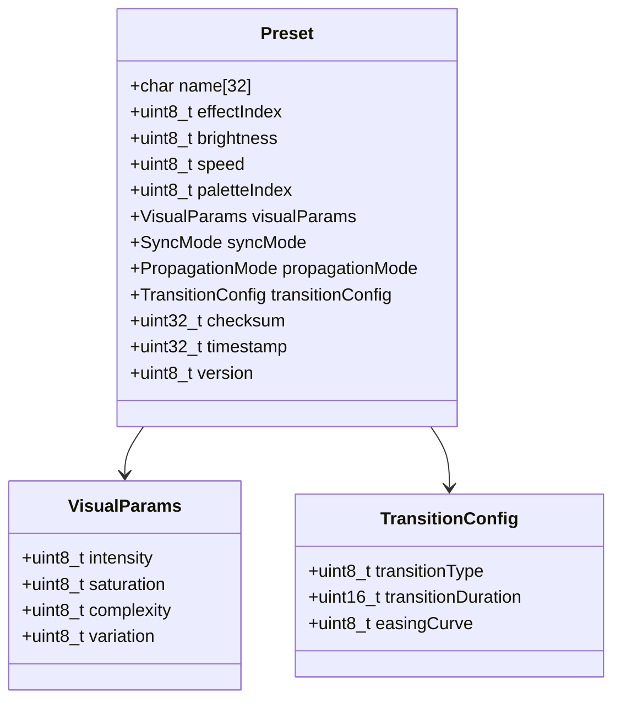
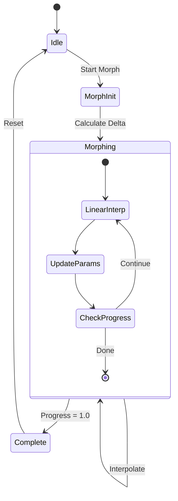
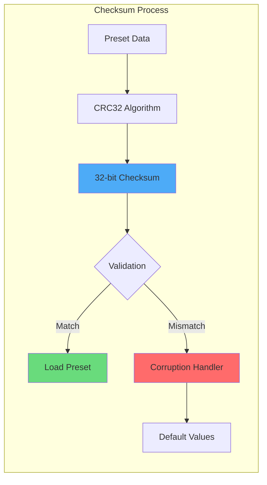
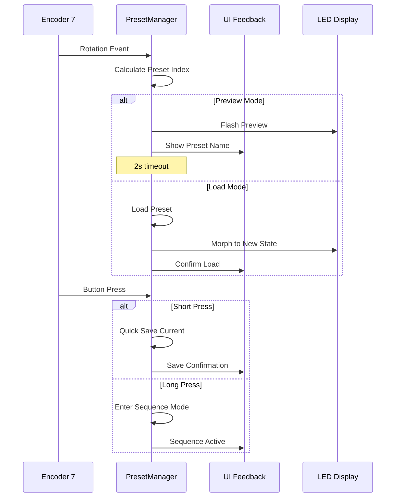
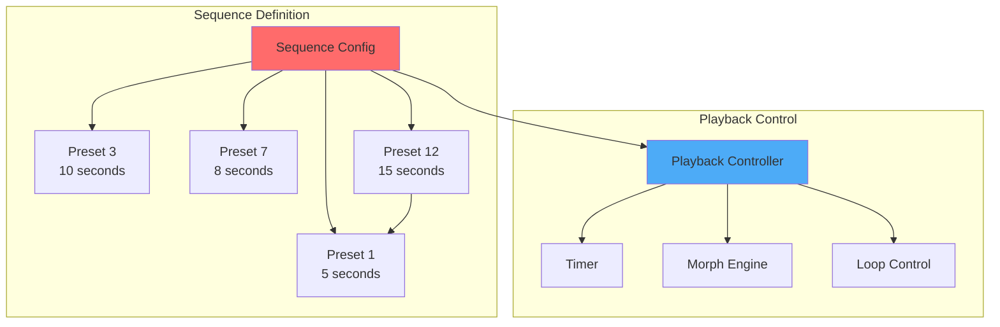
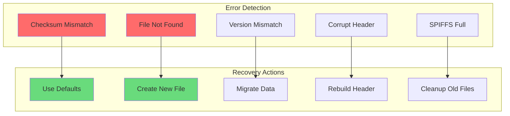
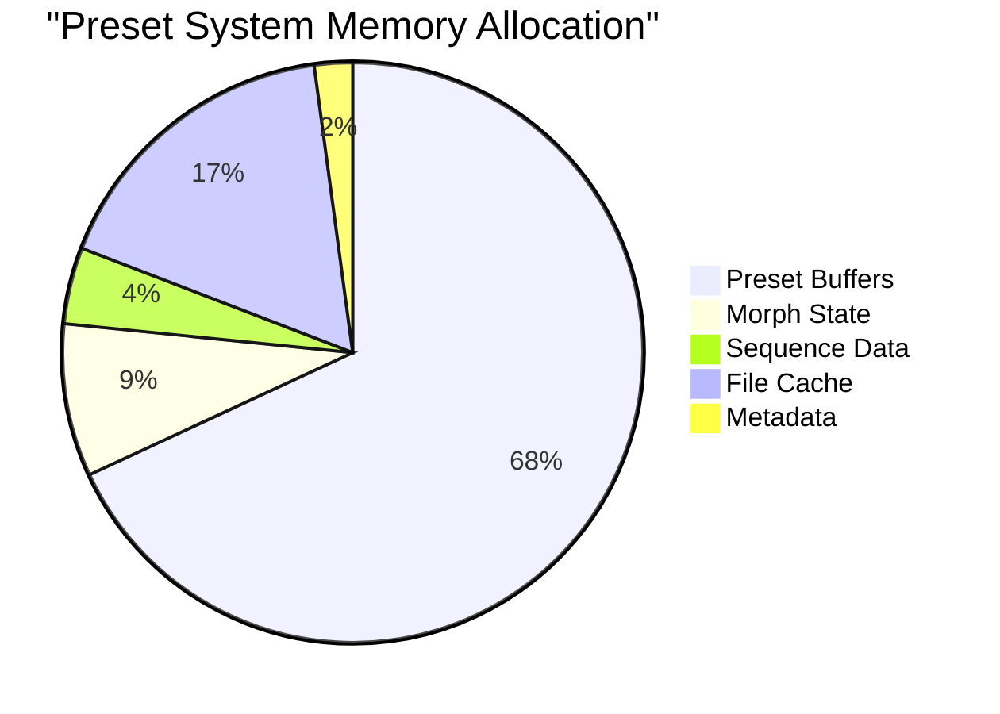

# 🎭 Document 01: Preset Management System - Deep Dive

<div align="center">

```
╔═══════════════════════════════════════════════════════════════════════════════╗
║                         PRESET MANAGEMENT SYSTEM                               ║
║                   Advanced State Persistence & Morphing                        ║
║                         16 Slots • Morphing • Sequences                        ║
╚═══════════════════════════════════════════════════════════════════════════════╝
```

**Module:** PresetManager | **Storage:** SPIFFS | **Features:** Morphing, Sequences, Quick Save

</div>

---

## 📋 Executive Summary

The Preset Management System in LightwaveOS provides sophisticated state persistence with 16 preset slots, smooth morphing between presets, sequence playback, and intelligent encoder navigation. This document reveals the intricate architecture that enables instant recall of complex visual states while maintaining data integrity through checksums and versioning.

### 🎯 Key Capabilities
- **16 Preset Slots**: Each with metadata and checksum validation
- **Smooth Morphing**: Real-time interpolation between presets
- **Sequence Playback**: Automated preset progression with timing
- **Quick Save/Load**: One-button state capture and recall
- **Encoder Navigation**: Encoder 7 for preset browsing and morphing

---

## 🏗️ System Architecture

### Preset Data Structure



### Storage Architecture

```
┌─────────────────────────────────────────────────────────────────────────┐
│                        SPIFFS PRESET STORAGE                             │
├─────────────────────────────────────────────────────────────────────────┤
│  File Structure:                                                        │
│  ┌─────────────────┐  ┌─────────────────┐  ┌─────────────────┐       │
│  │ /presets/0.dat  │  │ /presets/1.dat  │  │ /presets/15.dat │  ...  │
│  │ 256 bytes       │  │ 256 bytes       │  │ 256 bytes       │       │
│  └─────────────────┘  └─────────────────┘  └─────────────────┘       │
│                                                                         │
│  Metadata File:                                                         │
│  ┌─────────────────────────────────────────────────────────────┐      │
│  │ /presets/meta.dat                                            │      │
│  │ - Last preset index                                          │      │
│  │ - Sequence configuration                                     │      │
│  │ - Global settings                                            │      │
│  └─────────────────────────────────────────────────────────────┘      │
│                                                                         │
│  Total Storage: 16 × 256 + 512 = 4,608 bytes                          │
└─────────────────────────────────────────────────────────────────────────┘
```

---

## 🔄 Preset Morphing System

### Morphing State Machine



### Interpolation Algorithm

```
╔════════════════════════════════════════════════════════════════════════╗
║                     MORPHING INTERPOLATION ENGINE                       ║
╠════════════════════════════════════════════════════════════════════════╣
║ Parameter Interpolation:                                                ║
║                                                                        ║
║ value(t) = source + (target - source) × ease(t)                       ║
║                                                                        ║
║ Where:                                                                 ║
║ • t = progress (0.0 to 1.0)                                           ║
║ • ease(t) = easing function (linear, cubic, sine, etc.)              ║
║                                                                        ║
║ Special Handling:                                                      ║
║ • Effect Index: Switches at t = 0.5 with transition                   ║
║ • Palette Index: Smooth color interpolation in HSV space             ║
║ • Sync/Propagation Modes: Discrete switch at t = 0.5                 ║
╚════════════════════════════════════════════════════════════════════════╝
```

### Morphing Timeline

```
Morphing Timeline (2000ms default)
━━━━━━━━━━━━━━━━━━━━━━━━━━━━━━━━━━━━━━━━━━━━━━━━━━━━━━━━━━━━━━━━━━━━━━

0ms                 500ms               1000ms              1500ms              2000ms
├───────────────────┼───────────────────┼───────────────────┼───────────────────┤
│                   │                   │                   │                   │
│ Brightness    ████████████████████████████████████████████████████████████    │
│ Speed         ████████████████████████████████████████████████████████████    │
│ Visual Params ████████████████████████████████████████████████████████████    │
│                   │                   │                   │                   │
│ Effect Switch     │         ██████    │                   │                   │
│ Palette Blend ████████████████████████████████████████████████████████████    │
│                   │                   │                   │                   │
│ Progress Bar  ████████████████████████████████████████████████████████████    │

Legend: ███ Active Interpolation  ██ Discrete Switch
```

---

## 💾 Data Persistence & Integrity

### Checksum Calculation



### Version Migration

```
┌─────────────────────────────────────────────────────────────────────────┐
│                      PRESET VERSION MIGRATION                            │
├─────────────────────────────────────────────────────────────────────────┤
│ Version │ Changes                          │ Migration Strategy         │
├─────────┼──────────────────────────────────┼────────────────────────────┤
│ 1       │ Basic parameters                 │ -                          │
│ 2       │ + VisualParams                   │ Set defaults               │
│ 3       │ + Sync/Propagation modes         │ Use SYNC_SYNCHRONIZED     │
│ 4       │ + Transition config              │ Use fade/1000ms           │
│ 5       │ + Timestamp & metadata           │ Set current time          │
└─────────┴──────────────────────────────────┴────────────────────────────┘
```

---

## 🎮 Encoder Integration

### Encoder 7 Control Flow



### Navigation States

```
╔════════════════════════════════════════════════════════════════════════╗
║                     ENCODER 7 NAVIGATION STATES                         ║
╠════════════════════════════════════════════════════════════════════════╣
║ State          │ Trigger           │ Action                            ║
├────────────────┼───────────────────┼────────────────────────────────────┤
║ Browse         │ Rotation          │ Preview presets without loading    ║
║ Load           │ Rotation + 2s     │ Auto-load after preview timeout    ║
║ Quick Save     │ Short Press       │ Save to current slot               ║
║ Sequence       │ Long Press        │ Enter sequence playback mode       ║
║ Morph Control  │ Rotation (active) │ Manual morph speed control         ║
╚════════════════╧═══════════════════╧════════════════════════════════════╝
```

---

## 🔄 Sequence Playback Engine

### Sequence Configuration



### Sequence File Format

```
┌─────────────────────────────────────────────────────────────────────────┐
│                        SEQUENCE FILE FORMAT                              │
├─────────────────────────────────────────────────────────────────────────┤
│ Header (16 bytes):                                                      │
│ ┌─────────────┬─────────────┬─────────────┬─────────────┐            │
│ │ Magic: "SEQ" │ Version: 1  │ Count: 4    │ Flags: 0x01 │            │
│ └─────────────┴─────────────┴─────────────┴─────────────┘            │
│                                                                         │
│ Sequence Entries (16 bytes each):                                      │
│ ┌─────────────┬─────────────┬─────────────┬─────────────┐            │
│ │ Preset ID   │ Duration(ms) │ Transition  │ Reserved    │            │
│ │ uint8_t     │ uint32_t     │ uint8_t     │ 6 bytes     │            │
│ └─────────────┴─────────────┴─────────────┴─────────────┘            │
│                                                                         │
│ Total Size: 16 + (16 × sequence_count) bytes                           │
└─────────────────────────────────────────────────────────────────────────┘
```

---

## 🛡️ Error Handling & Recovery

### Fault Tolerance Matrix



### Recovery Strategies

```
╔════════════════════════════════════════════════════════════════════════╗
║                      PRESET RECOVERY STRATEGIES                         ║
╠════════════════════════════════════════════════════════════════════════╣
║ 1. Checksum Validation Failure                                         ║
║    → Log corruption event                                              ║
║    → Attempt header recovery                                           ║
║    → Fall back to factory defaults                                    ║
║    → Mark slot as corrupted                                           ║
║                                                                        ║
║ 2. SPIFFS Operation Failure                                            ║
║    → Retry with exponential backoff                                   ║
║    → Cache in RAM temporarily                                         ║
║    → Defer write operations                                           ║
║    → Alert user via LED feedback                                      ║
║                                                                        ║
║ 3. Version Migration Failure                                           ║
║    → Keep original data intact                                        ║
║    → Create new file with migrated data                               ║
║    → Verify migration success                                         ║
║    → Atomic file replacement                                          ║
╚════════════════════════════════════════════════════════════════════════╝
```

---

## 📊 Performance Characteristics

### Operation Timing

```
┌─────────────────────────────────────────────────────────────────────────┐
│                      PRESET OPERATION TIMINGS                            │
├─────────────────────────┬───────────────────────────────────────────────┤
│ Operation              │ Typical Time    │ Worst Case    │ Notes       │
├────────────────────────┼─────────────────┼───────────────┼─────────────┤
│ Load Preset            │ 15-20ms         │ 50ms          │ SPIFFS read │
│ Save Preset            │ 30-40ms         │ 100ms         │ SPIFFS write│
│ Calculate Checksum     │ <1ms            │ 2ms           │ CRC32       │
│ Morph Step (per frame) │ 0.5ms           │ 1ms           │ Interpolate │
│ Sequence Transition    │ 20ms            │ 50ms          │ Load + init │
│ Preview Generation     │ 5ms             │ 10ms          │ Render only │
└────────────────────────┴─────────────────┴───────────────┴─────────────┘
```

### Memory Usage



---

## 🔮 Future Enhancements

### Planned Features

```
╔════════════════════════════════════════════════════════════════════════╗
║                    FUTURE PRESET SYSTEM FEATURES                        ║
╠════════════════════════════════════════════════════════════════════════╣
║ 1. Cloud Preset Sharing                                                ║
║    • Upload presets to cloud service                                   ║
║    • Browse community presets                                          ║
║    • One-click download and install                                    ║
║                                                                        ║
║ 2. Preset Categories & Tags                                            ║
║    • Organize presets by mood/occasion                                 ║
║    • Tag-based filtering                                               ║
║    • Smart recommendations                                             ║
║                                                                        ║
║ 3. Advanced Morphing                                                   ║
║    • Multi-point morphing paths                                        ║
║    • Custom easing curve editor                                        ║
║    • Morphing effect preview                                           ║
║                                                                        ║
║ 4. Preset Analytics                                                    ║
║    • Usage statistics                                                  ║
║    • Favorite preset tracking                                          ║
║    • Automatic preset optimization                                     ║
╚════════════════════════════════════════════════════════════════════════╝
```

---

## 🎯 Implementation Best Practices

### Code Example: Saving a Preset

```cpp
bool PresetManager::savePreset(uint8_t slot) {
    if (slot >= MAX_PRESETS) return false;
    
    Preset preset;
    
    // Capture current state
    preset.effectIndex = currentEffect;
    preset.brightness = strip.getBrightness();
    preset.speed = currentSpeed;
    preset.paletteIndex = currentPalette;
    preset.visualParams = visualParams;
    preset.syncMode = stripSync;
    preset.propagationMode = propagationMode;
    preset.transitionConfig = transitionEngine.getConfig();
    preset.timestamp = millis();
    preset.version = PRESET_VERSION;
    
    // Generate name
    snprintf(preset.name, sizeof(preset.name), 
             "Preset %d - %s", slot, effects[currentEffect].name);
    
    // Calculate checksum
    preset.checksum = calculateCRC32(&preset, 
                                    sizeof(Preset) - sizeof(uint32_t));
    
    // Write to SPIFFS
    char filename[32];
    snprintf(filename, sizeof(filename), "/presets/%d.dat", slot);
    
    File file = SPIFFS.open(filename, "w");
    if (!file) return false;
    
    size_t written = file.write((uint8_t*)&preset, sizeof(Preset));
    file.close();
    
    return written == sizeof(Preset);
}
```

### Morphing Implementation

```cpp
void PresetManager::updateMorph() {
    if (!morphActive) return;
    
    float progress = (millis() - morphStartTime) / (float)morphDuration;
    if (progress >= 1.0f) {
        progress = 1.0f;
        morphActive = false;
    }
    
    // Apply easing
    float eased = applyEasing(progress, morphEasing);
    
    // Interpolate parameters
    uint8_t brightness = lerp(morphSource.brightness, 
                            morphTarget.brightness, eased);
    strip.setBrightness(brightness);
    
    currentSpeed = lerp(morphSource.speed, 
                       morphTarget.speed, eased);
    
    // Interpolate visual params
    visualParams.intensity = lerp(morphSource.visualParams.intensity,
                                morphTarget.visualParams.intensity, eased);
    // ... other parameters
    
    // Handle discrete switches at midpoint
    if (progress >= 0.5f && !morphEffectSwitched) {
        currentEffect = morphTarget.effectIndex;
        currentPalette = morphTarget.paletteIndex;
        stripSync = morphTarget.syncMode;
        propagationMode = morphTarget.propagationMode;
        morphEffectSwitched = true;
        
        // Start transition for effect change
        transitionEngine.startTransition(morphTarget.transitionConfig);
    }
}
```

---

<div align="center">

**"Presets: Where Art Meets Persistence"**

*Transform moments into memories, one preset at a time.*

</div>