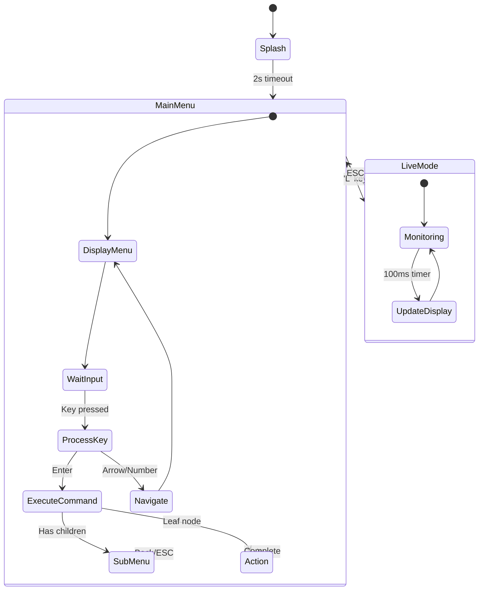
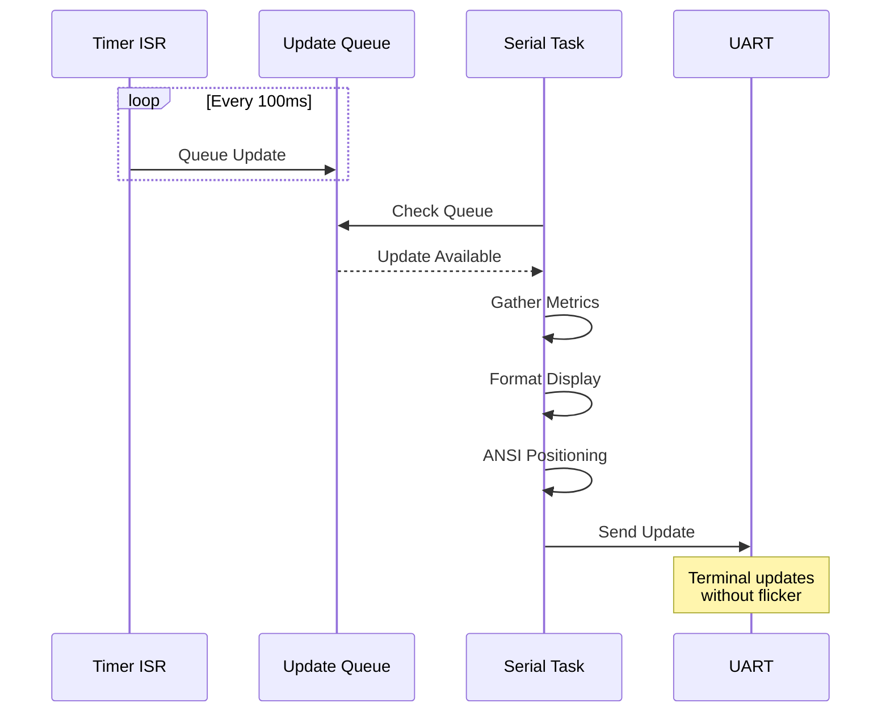
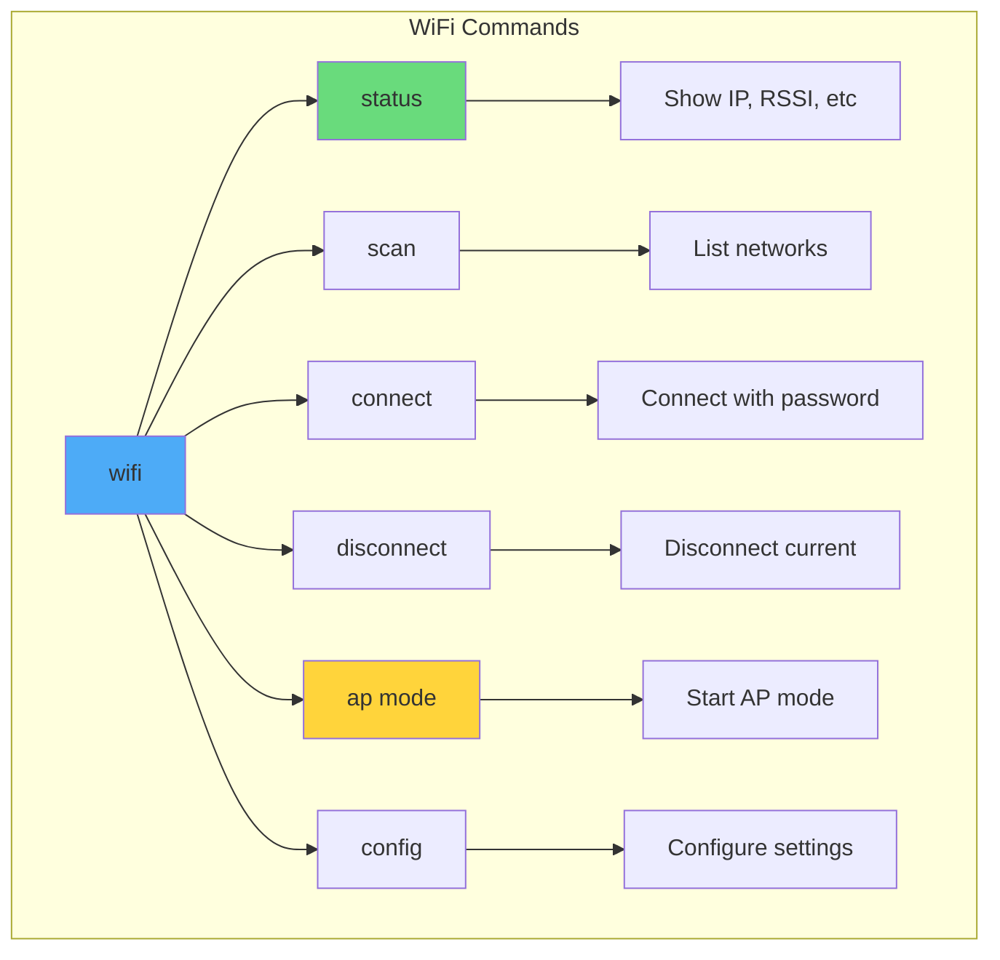
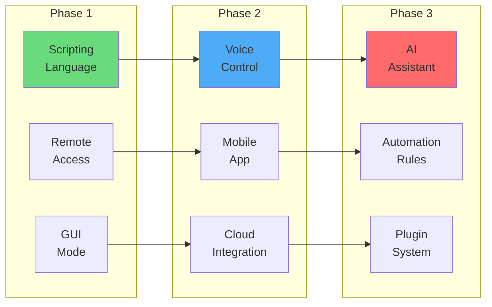

# 🖥️ Document 03: Serial Menu Interface & Command System

<div align="center">

```
╔═══════════════════════════════════════════════════════════════════════════════╗
║                          SERIAL MENU INTERFACE                                 ║
║                    Advanced CLI for System Control                             ║
║                   115200 baud • ANSI Colors • Tree Navigation                 ║
╚═══════════════════════════════════════════════════════════════════════════════╝
```

**Module:** SerialMenu | **Protocol:** UART | **Features:** Hierarchical, Extensible, Non-blocking

</div>

---

## 📋 Executive Summary

The Serial Menu Interface provides a comprehensive command-line interface for LightwaveOS, offering deep system control, real-time monitoring, and debugging capabilities. Built with a hierarchical menu structure and non-blocking input handling, it serves as both a powerful development tool and a production diagnostic interface.

### 🎯 Key Features
- **Hierarchical Navigation**: Tree-based menu structure with breadcrumb trail
- **Real-time Updates**: Live parameter monitoring without blocking
- **ANSI Color Support**: Enhanced readability with color-coded output
- **Command History**: Arrow key navigation through previous commands
- **Macro System**: Record and playback command sequences

---

## 🏗️ Menu Architecture

### Hierarchical Menu Structure

```mermaid
graph TD
    ROOT[Main Menu]
    
    ROOT --> SYS[System]
    ROOT --> EFF[Effects]
    ROOT --> LED[LED Control]
    ROOT --> NET[Network]
    ROOT --> DBG[Debug]
    ROOT --> CFG[Config]
    
    SYS --> INFO[System Info]
    SYS --> PERF[Performance]
    SYS --> MEM[Memory]
    SYS --> RST[Reset Options]
    
    EFF --> LIST[List Effects]
    EFF --> SEL[Select Effect]
    EFF --> PARAM[Parameters]
    EFF --> TRANS[Transitions]
    
    LED --> BRIGHT[Brightness]
    LED --> PAL[Palettes]
    LED --> SYNC[Sync Modes]
    LED --> PROP[Propagation]
    
    NET --> WIFI[WiFi Status]
    NET --> WEB[Web Server]
    NET --> MDNS[mDNS Config]
    NET --> OTA[OTA Update]
    
    DBG --> HEAP[Heap Trace]
    DBG --> LOG[Log Level]
    DBG --> TEST[Test Mode]
    DBG --> DUMP[State Dump]
    
    style ROOT fill:#ff6b6b,stroke:#c92a2a,stroke-width:3px
    style DBG fill:#4dabf7,stroke:#1971c2
    style EFF fill:#69db7c,stroke:#2f9e44
```



### Menu State Machine



---

## 📊 Command Structure

### Command Format

```
┌─────────────────────────────────────────────────────────────────────────┐
│                         COMMAND FORMAT GRAMMAR                           │
├─────────────────────────────────────────────────────────────────────────┤
│ Basic Commands:                                                         │
│   <number>              - Select menu item                             │
│   <command>             - Execute command                              │
│   <command> <args...>   - Command with arguments                       │
│                                                                         │
│ Navigation:                                                             │
│   ↑/↓                   - Navigate history                             │
│   ←/→                   - Move cursor                                  │
│   TAB                   - Auto-complete                                │
│   ESC                   - Back/Cancel                                  │
│                                                                         │
│ Special Commands:                                                       │
│   help                  - Context help                                 │
│   back                  - Previous menu                                │
│   home                  - Main menu                                    │
│   exit                  - Close serial menu                            │
│                                                                         │
│ Shortcuts:                                                              │
│   !<n>                  - Repeat command n from history               │
│   !!                    - Repeat last command                          │
│   @<macro>              - Execute macro                                │
│   /<search>             - Search commands                              │
└─────────────────────────────────────────────────────────────────────────┘
```

### Menu Display Format

```
╔════════════════════════════════════════════════════════════════════════╗
║ LightwaveOS v2.0 - Serial Control Interface                           ║
╠════════════════════════════════════════════════════════════════════════╣
║ 📍 Main Menu > Effects > Parameters                                    ║
╠════════════════════════════════════════════════════════════════════════╣
║                                                                        ║
║  1. 🎨 Brightness      [████████░░] 200/255                          ║
║  2. ⚡ Speed           [██████░░░░] 128/255                          ║
║  3. 🎭 Intensity       [████████░░] 200/255                          ║
║  4. 🌈 Saturation      [██████████] 255/255                          ║
║  5. 🔧 Complexity      [█████░░░░░] 100/255                          ║
║  6. 🎲 Variation       [███░░░░░░░]  64/255                          ║
║                                                                        ║
║  L. 📊 Live Mode       - Real-time parameter display                  ║
║  R. 🔄 Reset All       - Reset to defaults                           ║
║  B. ⬅️  Back           - Return to Effects menu                       ║
║                                                                        ║
╠════════════════════════════════════════════════════════════════════════╣
║ > _                                                                    ║
╚════════════════════════════════════════════════════════════════════════╝
```

---

## 🎨 ANSI Color System

### Color Scheme

```cpp
namespace AnsiColors {
    // Basic colors
    const char* BLACK   = "\033[30m";
    const char* RED     = "\033[31m";
    const char* GREEN   = "\033[32m";
    const char* YELLOW  = "\033[33m";
    const char* BLUE    = "\033[34m";
    const char* MAGENTA = "\033[35m";
    const char* CYAN    = "\033[36m";
    const char* WHITE   = "\033[37m";
    
    // Bright colors
    const char* BRIGHT_RED     = "\033[91m";
    const char* BRIGHT_GREEN   = "\033[92m";
    const char* BRIGHT_YELLOW  = "\033[93m";
    const char* BRIGHT_BLUE    = "\033[94m";
    
    // Special
    const char* RESET   = "\033[0m";
    const char* BOLD    = "\033[1m";
    const char* DIM     = "\033[2m";
    const char* INVERSE = "\033[7m";
    
    // Background
    const char* BG_RED    = "\033[41m";
    const char* BG_GREEN  = "\033[42m";
    const char* BG_BLUE   = "\033[44m";
}
```

### Color Usage Guidelines

```
╔════════════════════════════════════════════════════════════════════════╗
║                         COLOR USAGE STANDARDS                           ║
╠════════════════════════════════════════════════════════════════════════╣
║ Element              │ Color         │ Usage                          ║
├──────────────────────┼───────────────┼─────────────────────────────────┤
║ Headers              │ BRIGHT_BLUE   │ Section titles                 ║
║ Success              │ BRIGHT_GREEN  │ Confirmations, OK status       ║
║ Warning              │ YELLOW        │ Warnings, cautions             ║
║ Error                │ BRIGHT_RED    │ Errors, failures               ║
║ Info                 │ CYAN          │ Information, tips              ║
║ Values               │ WHITE         │ Numeric values, data           ║
║ Prompts              │ BRIGHT_YELLOW │ Input prompts                  ║
║ Dimmed               │ DIM           │ Disabled options, hints        ║
║ Highlighted          │ INVERSE       │ Selected items                 ║
╚══════════════════════╧═══════════════╧═════════════════════════════════╝
```

---

## 📈 Live Monitoring Mode

### Real-time Display

```
╔════════════════════════════════════════════════════════════════════════╗
║ 📊 LIVE MONITORING MODE - Press ESC to exit                           ║
╠════════════════════════════════════════════════════════════════════════╣
║ System Performance                      │ LED Status                   ║
║ ├─ FPS:        176 [████████████████] │ ├─ Effect:    Rainbow Wave   ║
║ ├─ Frame Time: 5.68ms                  │ ├─ Brightness: 200           ║
║ ├─ CPU Load:   79%                     │ ├─ Palette:    Ocean Breeze  ║
║ └─ Temp:       42°C                    │ └─ Sync Mode:  Synchronized  ║
║                                        │                              ║
║ Memory Status                          │ Network Status               ║
║ ├─ Heap Free:  125KB (38%)            │ ├─ WiFi:      Connected      ║
║ ├─ Largest:    45KB                   │ ├─ IP:        192.168.1.42   ║
║ ├─ Fragment:   12%                    │ ├─ Clients:   2              ║
║ └─ PSRAM:      14MB (87%)             │ └─ Uptime:    3d 14h 27m     ║
║                                        │                              ║
║ Encoder States                         │ Visual Parameters            ║
║ ├─ E0: 12 [Effect Select]             │ ├─ Intensity:  200 ████████  ║
║ ├─ E1: 200 [Brightness]               │ ├─ Saturation: 255 ██████████║
║ ├─ E2: 5 [Palette]                    │ ├─ Complexity: 100 ████      ║
║ └─ E3: 128 [Speed]                    │ └─ Variation:  64  ███       ║
╚════════════════════════════════════════════════════════════════════════╝
Updated: 21:45:32.456                                         [Auto-refresh]
```

### Update Mechanism



---

## 🔧 Command Implementation

### Menu Item Structure

```cpp
struct MenuItem {
    const char* label;          // Display text
    const char* shortcut;       // Single key shortcut
    MenuItemType type;          // MENU, ACTION, PARAMETER
    union {
        Menu* submenu;          // For MENU type
        MenuAction action;      // For ACTION type
        Parameter* param;       // For PARAMETER type
    };
    const char* help;          // Help text
    bool (*isEnabled)();       // Dynamic enable/disable
    uint8_t icon;              // Unicode icon code
};

struct Menu {
    const char* title;
    MenuItem* items;
    uint8_t itemCount;
    Menu* parent;
    void (*onEnter)();         // Called when entering menu
    void (*onExit)();          // Called when leaving menu
    void (*onRefresh)();       // Called for live updates
};
```

### Parameter Control

```cpp
class ParameterController {
    void handleParameterInput(Parameter* param, const char* input) {
        switch (param->type) {
            case PARAM_UINT8:
                handleUint8(param, input);
                break;
                
            case PARAM_SLIDER:
                handleSlider(param, input);
                break;
                
            case PARAM_ENUM:
                handleEnum(param, input);
                break;
                
            case PARAM_COLOR:
                handleColor(param, input);
                break;
        }
    }
    
    void displayParameter(Parameter* param) {
        // Show parameter with visual representation
        Serial.printf("%s: ", param->name);
        
        if (param->type == PARAM_SLIDER) {
            // Draw ASCII progress bar
            drawProgressBar(param->currentValue, param->maxValue);
        }
        
        Serial.printf(" %d/%d\n", param->currentValue, param->maxValue);
    }
    
    void drawProgressBar(int value, int max) {
        const int barWidth = 10;
        int filled = (value * barWidth) / max;
        
        Serial.print("[");
        for (int i = 0; i < barWidth; i++) {
            Serial.print(i < filled ? "█" : "░");
        }
        Serial.print("]");
    }
};
```

---

## 💾 Command History & Macros

### History Management

```cpp
class CommandHistory {
    static const int MAX_HISTORY = 50;
    String history[MAX_HISTORY];
    int historyIndex = 0;
    int historyCount = 0;
    int currentPos = 0;
    
    void addCommand(const String& cmd) {
        // Don't add duplicates or empty commands
        if (cmd.isEmpty() || 
            (historyCount > 0 && history[(historyIndex - 1 + MAX_HISTORY) % MAX_HISTORY] == cmd)) {
            return;
        }
        
        history[historyIndex] = cmd;
        historyIndex = (historyIndex + 1) % MAX_HISTORY;
        historyCount = min(historyCount + 1, MAX_HISTORY);
        currentPos = historyCount;
    }
    
    String getPrevious() {
        if (currentPos > 0) {
            currentPos--;
            return history[(historyIndex - historyCount + currentPos + MAX_HISTORY) % MAX_HISTORY];
        }
        return "";
    }
    
    String getNext() {
        if (currentPos < historyCount - 1) {
            currentPos++;
            return history[(historyIndex - historyCount + currentPos + MAX_HISTORY) % MAX_HISTORY];
        }
        return "";
    }
};
```

### Macro System

```
╔════════════════════════════════════════════════════════════════════════╗
║                          MACRO SYSTEM                                   ║
╠════════════════════════════════════════════════════════════════════════╣
║ Define Macro:                                                          ║
║   macro define rainbow_party                                          ║
║   > set_effect rainbow                                                 ║
║   > set_speed 200                                                      ║
║   > set_brightness 255                                                 ║
║   > set_sync chase                                                     ║
║   macro end                                                            ║
║                                                                        ║
║ Execute Macro:                                                         ║
║   @rainbow_party                                                       ║
║                                                                        ║
║ List Macros:                                                           ║
║   macro list                                                           ║
║   1. rainbow_party    - 4 commands                                     ║
║   2. debug_mode       - 6 commands                                     ║
║   3. performance_test - 8 commands                                     ║
╚════════════════════════════════════════════════════════════════════════╝
```

---

## 🔍 Debug Commands

### System Diagnostics

```cpp
void executeDebugCommand(const String& cmd) {
    if (cmd == "heap") {
        printHeapInfo();
    } else if (cmd == "tasks") {
        printTaskList();
    } else if (cmd == "gpio") {
        printGPIOState();
    } else if (cmd == "i2c scan") {
        scanI2CBus();
    } else if (cmd.startsWith("peek ")) {
        peekMemory(cmd.substring(5));
    } else if (cmd.startsWith("poke ")) {
        pokeMemory(cmd.substring(5));
    }
}

void printTaskList() {
    Serial.println(F("\n╔════════════════════════════════════════════════╗"));
    Serial.println(F("║              TASK LIST                         ║"));
    Serial.println(F("╠════════════════════════════════════════════════╣"));
    Serial.println(F("║ Name            │ State │ Prio │ Stack │ Core ║"));
    Serial.println(F("╟─────────────────┼───────┼──────┼───────┼──────╢"));
    
    // Get task information
    TaskStatus_t* taskStatusArray;
    volatile UBaseType_t taskCount = uxTaskGetNumberOfTasks();
    taskStatusArray = (TaskStatus_t*)pvPortMalloc(taskCount * sizeof(TaskStatus_t));
    
    if (taskStatusArray != NULL) {
        taskCount = uxTaskGetSystemState(taskStatusArray, taskCount, NULL);
        
        for (int i = 0; i < taskCount; i++) {
            Serial.printf("║ %-15s │ %-5s │ %4d │ %4dB │  %d   ║\n",
                taskStatusArray[i].pcTaskName,
                getTaskStateString(taskStatusArray[i].eCurrentState),
                taskStatusArray[i].uxCurrentPriority,
                taskStatusArray[i].usStackHighWaterMark * 4,
                taskStatusArray[i].xCoreID);
        }
        
        vPortFree(taskStatusArray);
    }
    
    Serial.println(F("╚═════════════════╧═══════╧══════╧═══════╧══════╝"));
}
```

### Memory Inspection

```
╔════════════════════════════════════════════════════════════════════════╗
║                      MEMORY INSPECTION COMMANDS                         ║
╠════════════════════════════════════════════════════════════════════════╣
║ Command          │ Description              │ Example                  ║
├──────────────────┼──────────────────────────┼──────────────────────────┤
║ peek <addr>      │ Read 16 bytes at address │ peek 0x3FFB0000         ║
║ dump <a> <len>   │ Dump memory region       │ dump 0x3FFB0000 256     ║
║ find <pattern>   │ Search for byte pattern  │ find DEADBEEF           ║
║ watch <addr>     │ Monitor address changes  │ watch 0x3FFB1234        ║
║ map              │ Show memory map          │ map                      ║
╚══════════════════╧══════════════════════════╧══════════════════════════╝

Example Output:
> peek 0x3FFB0000
0x3FFB0000: 48 65 6C 6C 6F 20 57 6F 72 6C 64 21 00 00 00 00  Hello World!....
```

---

## 🌐 Network Control

### WiFi Management



### Network Status Display

```
╔════════════════════════════════════════════════════════════════════════╗
║                        NETWORK STATUS                                   ║
╠════════════════════════════════════════════════════════════════════════╣
║ WiFi Status:     Connected ✓                                          ║
║ SSID:           LightwaveNetwork                                       ║
║ BSSID:          AA:BB:CC:DD:EE:FF                                    ║
║ Channel:        6                                                      ║
║ RSSI:           -42 dBm [████████░░]                                 ║
║ IP Address:     192.168.1.42                                          ║
║ Subnet:         255.255.255.0                                         ║
║ Gateway:        192.168.1.1                                           ║
║ DNS:            8.8.8.8, 8.8.4.4                                     ║
║ MAC:            24:6F:28:12:34:56                                    ║
║                                                                        ║
║ Web Server:     Running on port 80                                    ║
║ WebSocket:      2 clients connected                                   ║
║ mDNS:           lightwaveos.local                                     ║
║ Uptime:         3d 14h 27m 15s                                        ║
╚════════════════════════════════════════════════════════════════════════╝
```

---

## 🛡️ Access Control & Security

### Permission Levels

```cpp
enum PermissionLevel {
    PERM_NONE = 0,
    PERM_VIEW = 1,      // Read-only access
    PERM_CONTROL = 2,   // Change parameters
    PERM_CONFIG = 3,    // System configuration
    PERM_DEBUG = 4      // Full debug access
};

class SerialAuth {
    PermissionLevel currentLevel = PERM_VIEW;
    uint32_t lastAuthTime = 0;
    uint8_t failedAttempts = 0;
    
    bool authenticate(const char* password) {
        // Simple password check (should be more secure in production)
        uint32_t hash = calculateHash(password);
        
        if (hash == CONTROL_PASSWORD_HASH) {
            currentLevel = PERM_CONTROL;
            return true;
        } else if (hash == DEBUG_PASSWORD_HASH) {
            currentLevel = PERM_DEBUG;
            return true;
        }
        
        failedAttempts++;
        if (failedAttempts > 3) {
            // Lock out for increasing time
            lockoutTime = 1000 * pow(2, failedAttempts - 3);
        }
        
        return false;
    }
};
```

### Secure Commands

```
╔════════════════════════════════════════════════════════════════════════╗
║                     PERMISSION-BASED COMMANDS                           ║
╠════════════════════════════════════════════════════════════════════════╣
║ Level     │ Commands Available                                         ║
├───────────┼─────────────────────────────────────────────────────────────┤
║ VIEW      │ • Status displays                                          ║
║           │ • Effect list                                              ║
║           │ • Current parameters                                       ║
├───────────┼─────────────────────────────────────────────────────────────┤
║ CONTROL   │ • All VIEW commands                                        ║
║           │ • Change effects                                           ║
║           │ • Adjust parameters                                        ║
║           │ • Save/load presets                                        ║
├───────────┼─────────────────────────────────────────────────────────────┤
║ CONFIG    │ • All CONTROL commands                                     ║
║           │ • Network configuration                                    ║
║           │ • System settings                                          ║
║           │ • Factory reset                                            ║
├───────────┼─────────────────────────────────────────────────────────────┤
║ DEBUG     │ • All commands                                             ║
║           │ • Memory access                                            ║
║           │ • Task control                                             ║
║           │ • Raw hardware access                                      ║
╚═══════════╧═════════════════════════════════════════════════════════════╝
```

---

## 📊 Performance Optimization

### Non-blocking Input Handler

```cpp
class NonBlockingSerialInput {
    static const int BUFFER_SIZE = 128;
    char buffer[BUFFER_SIZE];
    int bufferPos = 0;
    uint32_t lastKeyTime = 0;
    
    bool processInput() {
        while (Serial.available()) {
            char c = Serial.read();
            uint32_t now = millis();
            
            // Handle special keys
            if (c == 27) { // ESC sequence
                return handleEscapeSequence();
            } else if (c == '\t') { // Tab completion
                return handleTabCompletion();
            } else if (c == '\r' || c == '\n') { // Enter
                return executeCommand();
            } else if (c == 127 || c == 8) { // Backspace
                return handleBackspace();
            } else if (c >= 32 && c < 127) { // Printable
                return handleCharacter(c);
            }
            
            lastKeyTime = now;
        }
        
        return false;
    }
    
    bool handleEscapeSequence() {
        // Wait for sequence completion (non-blocking)
        static uint8_t escBuffer[8];
        static uint8_t escPos = 0;
        static uint32_t escTimeout = 0;
        
        if (escPos == 0) {
            escTimeout = millis() + 100; // 100ms timeout
        }
        
        while (Serial.available() && escPos < 8 && millis() < escTimeout) {
            escBuffer[escPos++] = Serial.read();
        }
        
        if (escPos >= 2 || millis() >= escTimeout) {
            // Process escape sequence
            bool handled = processEscapeCode(escBuffer, escPos);
            escPos = 0;
            return handled;
        }
        
        return false; // Still waiting
    }
};
```

### Output Buffering

```
╔════════════════════════════════════════════════════════════════════════╗
║                      OUTPUT OPTIMIZATION                                ║
╠════════════════════════════════════════════════════════════════════════╣
║ Strategy         │ Description                │ Benefit               ║
├──────────────────┼────────────────────────────┼───────────────────────┤
║ Line Buffering   │ Buffer full lines          │ Reduce UART calls     ║
║ ANSI Optimization│ Minimize escape sequences  │ Reduce data sent      ║
║ Dirty Tracking   │ Only update changed areas  │ Reduce flicker        ║
║ Rate Limiting    │ Max updates per second     │ Prevent overflow      ║
║ Compression      │ RLE for repeated chars     │ Reduce bandwidth      ║
╚══════════════════╧════════════════════════════╧═══════════════════════╝
```

---

## 🔮 Future Enhancements

### Planned Features



---

<div align="center">

**"Command line: Where power users feel at home"**

*Type 'help' to begin your journey into the depths of LightwaveOS*

</div>