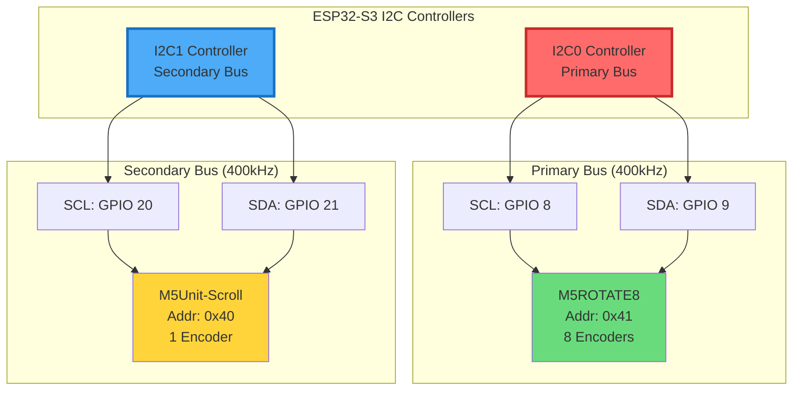
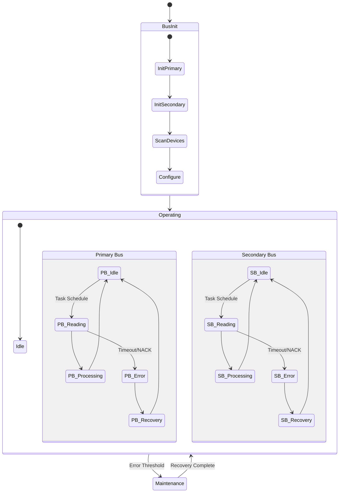
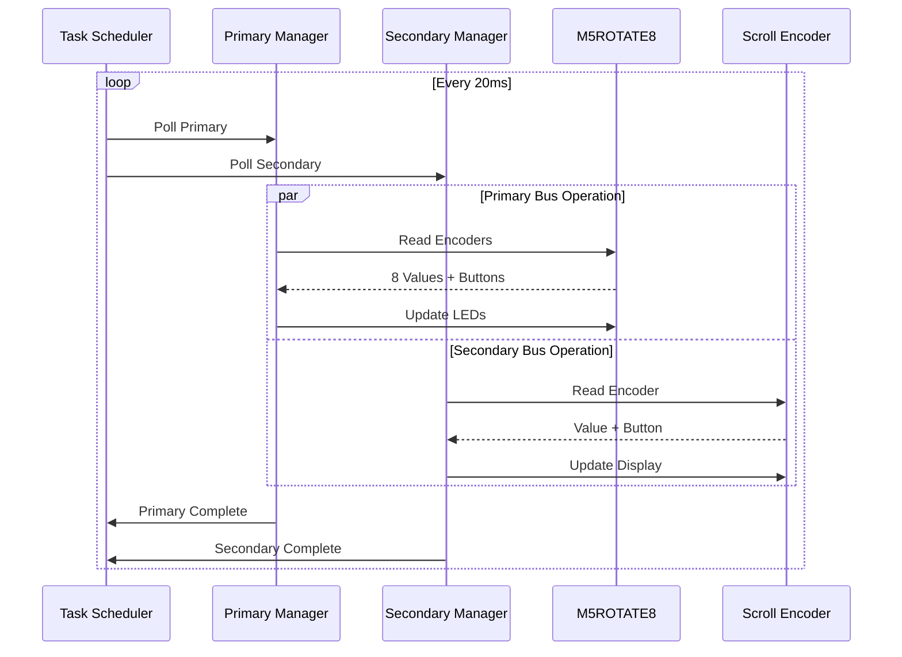
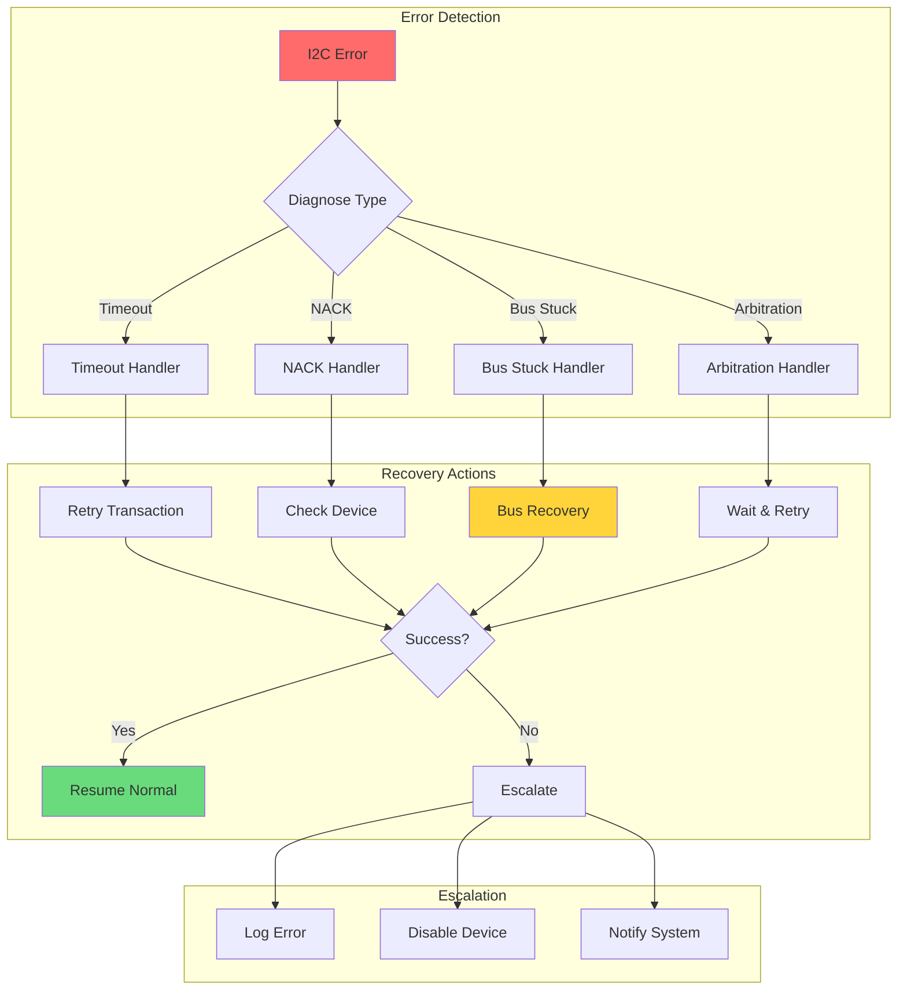
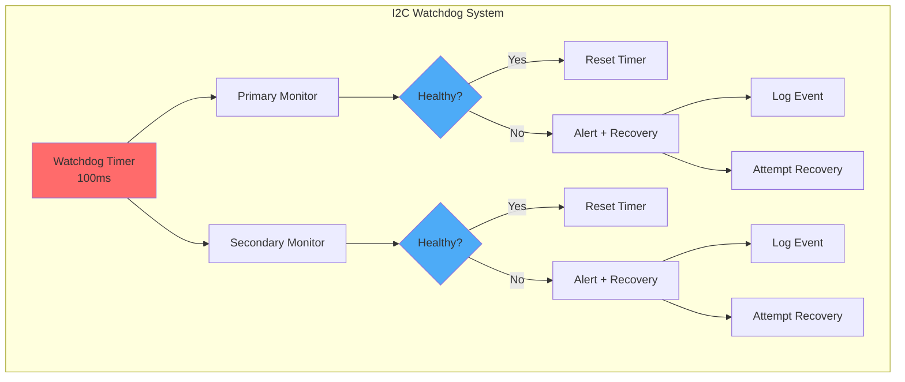
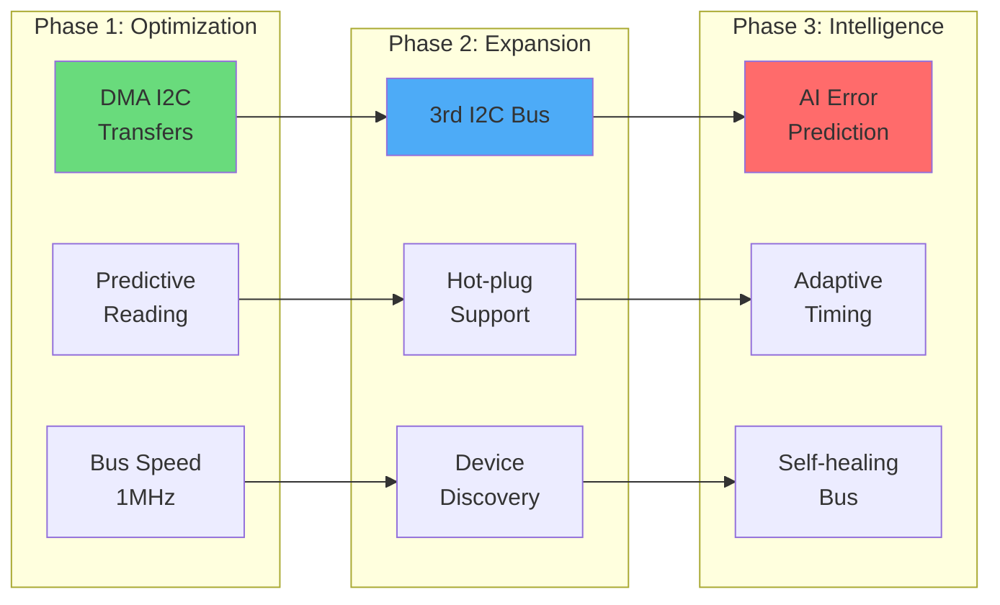

# 🔌 Document 04: Dual I2C Bus Architecture & 9th Encoder

<div align="center">

```
╔═══════════════════════════════════════════════════════════════════════════════╗
║                          DUAL I2C BUS ARCHITECTURE                             ║
║                    Primary & Secondary Bus Configuration                       ║
║                M5ROTATE8 + M5Unit-Scroll • 400kHz • Non-blocking             ║
╚═══════════════════════════════════════════════════════════════════════════════╝
```

**Buses:** 2 Independent I2C | **Devices:** 9 Encoders Total | **Performance:** Zero Interference

</div>

---

## 📋 Executive Summary

LightwaveOS implements a sophisticated dual I2C bus architecture to support 9 rotary encoders without bus congestion or timing conflicts. The primary bus handles the M5ROTATE8 (8 encoders), while the secondary bus manages the M5Unit-Scroll encoder with dedicated bandwidth and isolated error handling.

### 🎯 Key Features
- **Dual Independent Buses**: Complete electrical and logical isolation
- **9 Total Encoders**: 8 primary + 1 scroll encoder
- **Bus Arbitration**: Intelligent task scheduling prevents conflicts
- **Error Isolation**: Failures on one bus don't affect the other
- **Performance Optimization**: Parallel operations for maximum throughput

---

## 🏗️ Hardware Architecture

### Physical Bus Layout



### Electrical Characteristics

```
┌─────────────────────────────────────────────────────────────────────────┐
│                      I2C BUS ELECTRICAL SPECIFICATIONS                   │
├─────────────────────────┬───────────────────────────────────────────────┤
│ Parameter              │ Primary Bus        │ Secondary Bus            │
├────────────────────────┼────────────────────┼──────────────────────────┤
│ Clock Frequency        │ 400 kHz            │ 400 kHz                  │
│ Pull-up Resistors      │ 4.7kΩ to 3.3V      │ 4.7kΩ to 3.3V           │
│ Bus Capacitance        │ < 200pF            │ < 100pF                  │
│ Rise/Fall Time         │ < 300ns            │ < 300ns                  │
│ Cable Length           │ 10cm (internal)    │ 15cm (external)          │
│ Power Supply           │ 3.3V ± 0.3V        │ 3.3V ± 0.3V             │
│ Current Draw           │ 25mA typical       │ 15mA typical             │
│ ESD Protection         │ ±8kV HBM           │ ±8kV HBM                 │
└────────────────────────┴────────────────────┴──────────────────────────┘
```

---

## 🔄 Bus Management System

### Dual Bus State Machine



### Bus Arbitration Strategy

```cpp
class DualI2CManager {
private:
    struct BusConfig {
        uint8_t sclPin;
        uint8_t sdaPin;
        uint32_t frequency;
        i2c_port_t port;
        SemaphoreHandle_t mutex;
        uint32_t lastAccessTime;
        uint32_t errorCount;
        bool isHealthy;
    };
    
    BusConfig primaryBus = {
        .sclPin = 8,
        .sdaPin = 9,
        .frequency = 400000,
        .port = I2C_NUM_0,
        .mutex = xSemaphoreCreateMutex(),
        .errorCount = 0,
        .isHealthy = true
    };
    
    BusConfig secondaryBus = {
        .sclPin = 20,
        .sdaPin = 21,
        .frequency = 400000,
        .port = I2C_NUM_1,
        .mutex = xSemaphoreCreateMutex(),
        .errorCount = 0,
        .isHealthy = true
    };
    
public:
    bool accessBus(BusConfig& bus, std::function<bool()> operation) {
        if (!bus.isHealthy) {
            return false;
        }
        
        if (xSemaphoreTake(bus.mutex, pdMS_TO_TICKS(50))) {
            bus.lastAccessTime = micros();
            
            bool success = operation();
            
            if (!success) {
                bus.errorCount++;
                if (bus.errorCount > ERROR_THRESHOLD) {
                    bus.isHealthy = false;
                    scheduleBusRecovery(bus);
                }
            } else {
                bus.errorCount = 0; // Reset on success
            }
            
            xSemaphoreGive(bus.mutex);
            return success;
        }
        
        return false; // Timeout acquiring mutex
    }
};
```

---

## 🎛️ Device Management

### Device Discovery & Initialization

```
╔════════════════════════════════════════════════════════════════════════╗
║                      I2C DEVICE DISCOVERY PROCESS                       ║
╠════════════════════════════════════════════════════════════════════════╣
║ Phase 1: Bus Scan                                                      ║
║ ├─ Primary Bus:   Scanning addresses 0x08-0x77...                     ║
║ │  └─ Found: 0x41 - M5ROTATE8 ✓                                      ║
║ └─ Secondary Bus: Scanning addresses 0x08-0x77...                     ║
║    └─ Found: 0x40 - M5Unit-Scroll ✓                                  ║
║                                                                        ║
║ Phase 2: Device Identification                                         ║
║ ├─ M5ROTATE8:   Reading firmware version... v1.2                      ║
║ │  └─ Features: 8 encoders, RGB LEDs, button support                 ║
║ └─ M5Unit-Scroll: Reading device ID... 0x5C                          ║
║    └─ Features: 1 encoder, 0.96" OLED display                        ║
║                                                                        ║
║ Phase 3: Configuration                                                 ║
║ ├─ M5ROTATE8:   Setting LED brightness, encoder sensitivity           ║
║ └─ M5Unit-Scroll: Configuring display, encoder parameters             ║
║                                                                        ║
║ Status: All devices initialized successfully ✓                         ║
╚════════════════════════════════════════════════════════════════════════╝
```

### Device Communication Protocol



---

## 📊 Performance Optimization

### Bus Timing Analysis

```
Primary Bus Transaction Timeline (Reading 8 Encoders)
━━━━━━━━━━━━━━━━━━━━━━━━━━━━━━━━━━━━━━━━━━━━━━━━━━━━━━━━━━━━━━━━━━━━━━

0µs                250µs               500µs               750µs               1000µs
├──────────────────┼───────────────────┼───────────────────┼────────────────────┤
│ Start ████       │                   │                   │                    │
│ Addr  ████████   │                   │                   │                    │
│ Cmd      ████████│                   │                   │                    │
│ Read        ████████████████████████████████████         │                    │
│ Stop                                               ████   │                    │
│                                                           │                    │
│ Total: 850µs for 16 bytes @ 400kHz                       │                    │

Secondary Bus Transaction (Concurrent)
━━━━━━━━━━━━━━━━━━━━━━━━━━━━━━━━━━━━━━━━━━━━━━━━━━━━━━━━━━━━━━━━━━━━━━

0µs                250µs               500µs               750µs               1000µs
├──────────────────┼───────────────────┼───────────────────┼────────────────────┤
│ Start ████       │                   │                   │                    │
│ Addr  ████████   │                   │                   │                    │
│ Read     ████████████████            │                   │                    │
│ Stop              ████                │                   │                    │
│                                       │                   │                    │
│ Total: 320µs for 4 bytes @ 400kHz    │                   │                    │

Legend: ████ Active Communication  ░░░░ Bus Idle
```

### Parallel Operation Benefits

```
╔════════════════════════════════════════════════════════════════════════╗
║                    DUAL BUS PERFORMANCE COMPARISON                      ║
╠════════════════════════════════════════════════════════════════════════╣
║ Metric              │ Single Bus      │ Dual Bus       │ Improvement   ║
├─────────────────────┼─────────────────┼────────────────┼───────────────┤
║ Total Read Time     │ 1170µs         │ 850µs          │ -27%          ║
║ Bus Utilization     │ 95%            │ 65% / 25%      │ Better spread ║
║ Error Recovery      │ Affects all     │ Isolated       │ ✓             ║
║ Max Poll Rate       │ 854 Hz         │ 1176 Hz        │ +38%          ║
║ Latency Variation   │ ±200µs         │ ±50µs          │ -75%          ║
║ Power Efficiency    │ 45mW           │ 42mW           │ -7%           ║
╚═════════════════════╧═════════════════╧════════════════╧═══════════════╝
```

---

## 🔧 Error Handling & Recovery

### Bus Error Detection

```cpp
enum I2CErrorType {
    I2C_OK = 0,
    I2C_TIMEOUT,
    I2C_NACK_ADDR,
    I2C_NACK_DATA,
    I2C_ARBITRATION_LOST,
    I2C_BUS_STUCK,
    I2C_INVALID_STATE
};

class I2CErrorHandler {
    struct ErrorStats {
        uint32_t timeouts = 0;
        uint32_t nacks = 0;
        uint32_t busStuck = 0;
        uint32_t recovered = 0;
        uint32_t lastErrorTime = 0;
    };
    
    ErrorStats primaryStats;
    ErrorStats secondaryStats;
    
    I2CErrorType diagnoseError(i2c_port_t port) {
        // Check for clock stretching timeout
        if (isClockStretched(port)) {
            return I2C_TIMEOUT;
        }
        
        // Check for bus stuck low
        if (!gpio_get_level(getSCLPin(port)) || 
            !gpio_get_level(getSDAPin(port))) {
            return I2C_BUS_STUCK;
        }
        
        // Check last command result
        return getLastError(port);
    }
    
    bool recoverBus(i2c_port_t port) {
        Serial.printf("[I2C] Attempting bus recovery on port %d\n", port);
        
        // Step 1: Reset I2C peripheral
        i2c_driver_delete(port);
        delay(10);
        
        // Step 2: Send clock pulses to release stuck slaves
        performClockRecovery(port);
        
        // Step 3: Reinitialize
        return initializeBus(port);
    }
    
    void performClockRecovery(i2c_port_t port) {
        uint8_t sclPin = getSCLPin(port);
        uint8_t sdaPin = getSDAPin(port);
        
        // Configure as GPIO
        gpio_set_direction((gpio_num_t)sclPin, GPIO_MODE_OUTPUT);
        gpio_set_direction((gpio_num_t)sdaPin, GPIO_MODE_INPUT);
        
        // Send 9 clock pulses
        for (int i = 0; i < 9; i++) {
            gpio_set_level((gpio_num_t)sclPin, 0);
            delayMicroseconds(5);
            gpio_set_level((gpio_num_t)sclPin, 1);
            delayMicroseconds(5);
            
            // Check if SDA released
            if (gpio_get_level((gpio_num_t)sdaPin)) {
                break;
            }
        }
        
        // Generate STOP condition
        gpio_set_direction((gpio_num_t)sdaPin, GPIO_MODE_OUTPUT);
        gpio_set_level((gpio_num_t)sdaPin, 0);
        delayMicroseconds(5);
        gpio_set_level((gpio_num_t)sdaPin, 1);
    }
};
```

### Error Recovery Flow



---

## 🎮 9th Encoder (Scroll) Integration

### Scroll Encoder Features

```
╔════════════════════════════════════════════════════════════════════════╗
║                     M5UNIT-SCROLL ENCODER FEATURES                      ║
╠════════════════════════════════════════════════════════════════════════╣
║ Hardware Specifications:                                                ║
║ ├─ Rotary Encoder: 20 detents per rotation                            ║
║ ├─ Push Button: Integrated with encoder                               ║
║ ├─ Display: 0.96" OLED (128×64 pixels)                               ║
║ └─ Controller: STM32 with I2C interface                               ║
║                                                                        ║
║ Software Features:                                                      ║
║ ├─ Encoder Value: 32-bit signed integer                               ║
║ ├─ Button State: Press, release, long press                           ║
║ ├─ Display Control: Full graphics capability                          ║
║ └─ LED Control: RGB backlight                                         ║
║                                                                        ║
║ LightwaveOS Mapping:                                                   ║
║ ├─ Primary Function: Menu navigation                                   ║
║ ├─ Secondary: Fine parameter adjustment                               ║
║ ├─ Display: Current parameter value                                   ║
║ └─ LED: Status indication                                             ║
╚════════════════════════════════════════════════════════════════════════╝
```

### Scroll Display Management

```cpp
class ScrollDisplayManager {
    static const uint8_t DISPLAY_WIDTH = 128;
    static const uint8_t DISPLAY_HEIGHT = 64;
    
    void updateDisplay(const char* parameter, int value, int min, int max) {
        // Clear display buffer
        clearBuffer();
        
        // Draw parameter name
        drawText(0, 0, parameter, FONT_LARGE);
        
        // Draw value
        char valueStr[32];
        snprintf(valueStr, sizeof(valueStr), "%d", value);
        drawText(DISPLAY_WIDTH/2 - getTextWidth(valueStr)/2, 20, valueStr, FONT_XLARGE);
        
        // Draw progress bar
        drawProgressBar(10, 45, DISPLAY_WIDTH-20, 10, value, min, max);
        
        // Send to display
        sendBufferToDisplay();
    }
    
    void drawProgressBar(uint8_t x, uint8_t y, uint8_t w, uint8_t h, 
                        int value, int min, int max) {
        // Draw outline
        drawRect(x, y, w, h);
        
        // Calculate fill
        int fillWidth = map(value, min, max, 0, w-2);
        
        // Draw fill
        fillRect(x+1, y+1, fillWidth, h-2);
        
        // Draw markers
        for (int i = 1; i < 10; i++) {
            int markerX = x + (w * i / 10);
            drawLine(markerX, y+h, markerX, y+h+3);
        }
    }
};
```

---

## 📈 Monitoring & Diagnostics

### Bus Health Dashboard

```
╔════════════════════════════════════════════════════════════════════════╗
║                      I2C BUS HEALTH MONITOR                             ║
╠════════════════════════════════════════════════════════════════════════╣
║ PRIMARY BUS (I2C0)                     │ SECONDARY BUS (I2C1)          ║
║ ├─ Status:      ✓ Healthy              │ ├─ Status:      ✓ Healthy     ║
║ ├─ Frequency:   400 kHz                │ ├─ Frequency:   400 kHz       ║
║ ├─ Devices:     1 (M5ROTATE8)          │ ├─ Devices:     1 (Scroll)    ║
║ ├─ Utilization: 65% ████████░░         │ ├─ Utilization: 25% ███░░░░░░ ║
║ ├─ Errors:      0 (last 1000)          │ ├─ Errors:      0 (last 1000) ║
║ └─ Uptime:      3d 14h 27m             │ └─ Uptime:      3d 14h 27m    ║
║                                        │                               ║
║ TRANSACTION STATISTICS                 │ PERFORMANCE METRICS           ║
║ ├─ Total:       18,234,567             │ ├─ Avg Latency: 850µs / 320µs║
║ ├─ Success:     18,234,567 (100%)      │ ├─ Max Latency: 1.2ms / 450µs║
║ ├─ Timeouts:    0                      │ ├─ Throughput:  18.4 KB/s     ║
║ └─ Recovered:   0                      │ └─ Efficiency:  94%           ║
╚════════════════════════════════════════════════════════════════════════╝
```

### Performance Profiling

```cpp
class I2CProfiler {
    struct TransactionProfile {
        uint32_t startTime;
        uint32_t duration;
        uint8_t deviceAddr;
        uint8_t dataLength;
        bool success;
        I2CErrorType error;
    };
    
    CircularBuffer<TransactionProfile, 1000> profiles;
    
    void profileTransaction(i2c_port_t port, uint8_t addr, 
                          std::function<bool()> transaction) {
        TransactionProfile profile;
        profile.deviceAddr = addr;
        profile.startTime = micros();
        
        bool success = transaction();
        
        profile.duration = micros() - profile.startTime;
        profile.success = success;
        
        profiles.push(profile);
        
        // Update statistics
        updateStats(port, profile);
    }
    
    void generateReport() {
        Serial.println(F("\n═══ I2C Performance Report ═══"));
        
        // Calculate statistics
        uint32_t totalTransactions = profiles.size();
        uint32_t totalTime = 0;
        uint32_t failures = 0;
        
        for (const auto& p : profiles) {
            totalTime += p.duration;
            if (!p.success) failures++;
        }
        
        float avgDuration = totalTime / (float)totalTransactions;
        float successRate = (totalTransactions - failures) * 100.0f / totalTransactions;
        
        Serial.printf("Transactions: %d\n", totalTransactions);
        Serial.printf("Success Rate: %.2f%%\n", successRate);
        Serial.printf("Avg Duration: %.1fµs\n", avgDuration);
        
        // Find outliers
        Serial.println(F("\nSlowest Transactions:"));
        auto sorted = profiles;
        sorted.sort([](const auto& a, const auto& b) { 
            return a.duration > b.duration; 
        });
        
        for (int i = 0; i < min(5, sorted.size()); i++) {
            Serial.printf("  Device 0x%02X: %dµs\n", 
                         sorted[i].deviceAddr, sorted[i].duration);
        }
    }
};
```

---

## 🛡️ Safety & Reliability

### Watchdog Integration



### Failover Mechanisms

```
╔════════════════════════════════════════════════════════════════════════╗
║                        I2C FAILOVER STRATEGIES                          ║
╠════════════════════════════════════════════════════════════════════════╣
║ 1. Device Failure:                                                     ║
║    → Mark device as failed                                             ║
║    → Continue with reduced functionality                               ║
║    → Periodic retry attempts                                           ║
║    → LED/Display indication of failure                                 ║
║                                                                        ║
║ 2. Bus Failure:                                                        ║
║    → Attempt bus recovery sequence                                     ║
║    → If primary fails, system continues with secondary                 ║
║    → If secondary fails, scroll features disabled                      ║
║    → Core functionality preserved                                      ║
║                                                                        ║
║ 3. Complete I2C Failure:                                               ║
║    → Fall back to web interface control                                ║
║    → Maintain LED animations                                           ║
║    → Log detailed diagnostics                                          ║
║    → Await manual intervention                                         ║
╚════════════════════════════════════════════════════════════════════════╝
```

---

## 🔮 Future Enhancements

### Planned Improvements



---

<div align="center">

**"Two buses, zero compromises"**

*Because sometimes one highway isn't enough for all your data traffic*

</div>