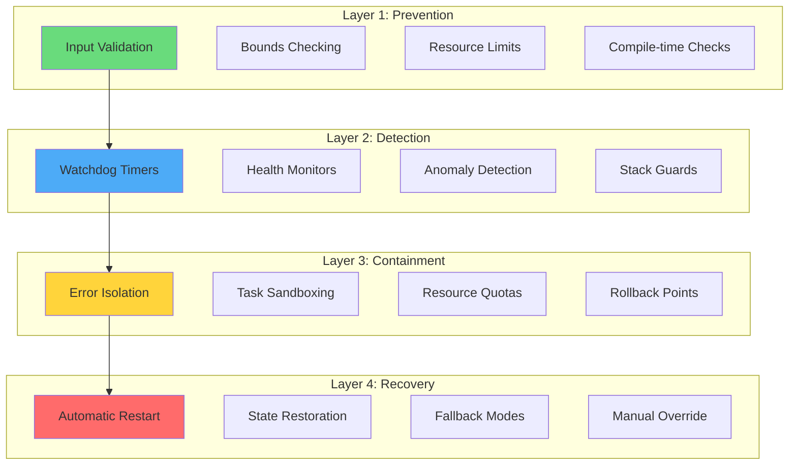
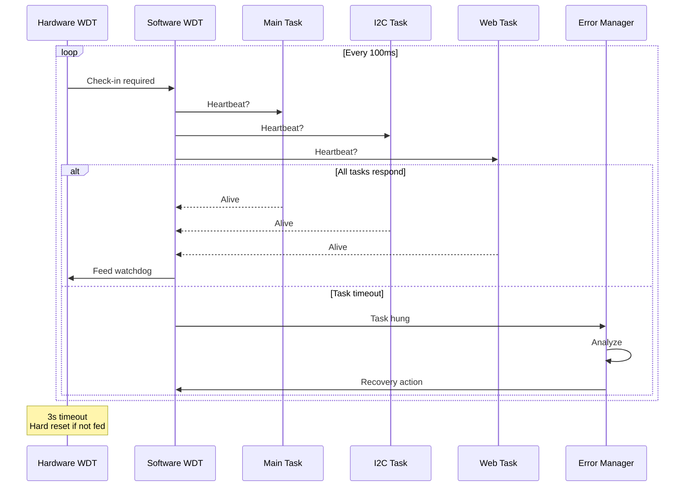
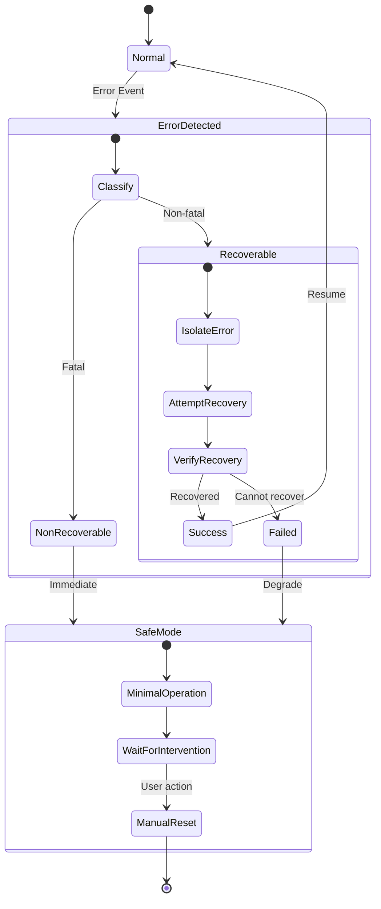
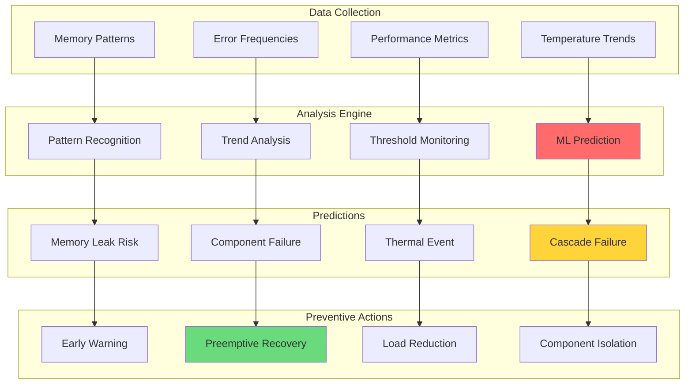

# 🛡️ Document 06: Error Handling & Fault Tolerance System

<div align="center">

```
╔═══════════════════════════════════════════════════════════════════════════════╗
║                    ERROR HANDLING & FAULT TOLERANCE                            ║
║                     Resilient Architecture for 24/7 Operation                  ║
║                Recovery • Isolation • Graceful Degradation • Logging          ║
╚═══════════════════════════════════════════════════════════════════════════════╝
```

**Philosophy:** Fail Gracefully | **Recovery:** Automatic | **Uptime Target:** 99.9%

</div>

---

## 📋 Executive Summary

LightwaveOS implements a comprehensive fault tolerance system designed for continuous operation in entertainment environments where reliability is paramount. This document reveals the multi-layered defense strategies, automatic recovery mechanisms, and graceful degradation paths that keep the lights on even when components fail.

### 🎯 Core Principles
- **Defense in Depth**: Multiple layers of error detection and handling
- **Graceful Degradation**: System remains functional with reduced features
- **Automatic Recovery**: Self-healing mechanisms for transient failures
- **Comprehensive Logging**: Detailed forensics for post-mortem analysis
- **User Transparency**: Clear indication of system health status

---

## 🏗️ Error Handling Architecture

### Multi-Layer Defense System



### Error Classification System

```cpp
enum class ErrorSeverity {
    INFO = 0,       // Informational, no action needed
    WARNING = 1,    // Potential issue, monitor closely
    ERROR = 2,      // Recoverable error, action taken
    CRITICAL = 3,   // Major failure, degraded operation
    FATAL = 4       // System failure, restart required
};

enum class ErrorCategory {
    HARDWARE,       // I2C, GPIO, LED hardware
    NETWORK,        // WiFi, WebSocket, HTTP
    MEMORY,         // Heap, stack, allocation
    TIMING,         // Frame rate, deadlines
    EFFECT,         // Rendering, calculation
    USER_INPUT,     // Invalid parameters
    SYSTEM          // Task, watchdog, core
};

struct ErrorContext {
    ErrorSeverity severity;
    ErrorCategory category;
    uint32_t errorCode;
    const char* file;
    int line;
    uint32_t timestamp;
    TaskHandle_t task;
    uint32_t freeHeap;
    float cpuUsage;
    char message[128];
};
```

---

## 🔍 Error Detection Mechanisms

### Watchdog Timer System



### Stack Overflow Detection

```cpp
class StackGuardian {
    static const uint32_t CANARY_VALUE = 0xDEADC0DE;
    static const size_t GUARD_SIZE = 32;
    
    struct TaskStackInfo {
        TaskHandle_t task;
        uint32_t* stackBottom;
        uint32_t* guardStart;
        size_t stackSize;
        size_t minFree;
        bool overflowDetected;
    };
    
    std::vector<TaskStackInfo> monitoredTasks;
    
    void initializeStackGuards() {
        // For each task, set up guard region
        for (auto& info : monitoredTasks) {
            // Fill guard region with canary values
            for (size_t i = 0; i < GUARD_SIZE; i++) {
                info.guardStart[i] = CANARY_VALUE;
            }
        }
    }
    
    void checkStackHealth() {
        for (auto& info : monitoredTasks) {
            // Check canary values
            bool corrupted = false;
            for (size_t i = 0; i < GUARD_SIZE; i++) {
                if (info.guardStart[i] != CANARY_VALUE) {
                    corrupted = true;
                    break;
                }
            }
            
            if (corrupted && !info.overflowDetected) {
                info.overflowDetected = true;
                handleStackOverflow(info);
            }
            
            // Update minimum free stack
            UBaseType_t currentFree = uxTaskGetStackHighWaterMark(info.task);
            if (currentFree < info.minFree) {
                info.minFree = currentFree;
                
                if (currentFree < STACK_WARNING_THRESHOLD) {
                    issueStackWarning(info);
                }
            }
        }
    }
    
    void handleStackOverflow(const TaskStackInfo& info) {
        // Critical error - stack overflow detected
        ErrorContext ctx = {
            .severity = ErrorSeverity::CRITICAL,
            .category = ErrorCategory::MEMORY,
            .errorCode = ERR_STACK_OVERFLOW,
            .timestamp = millis()
        };
        
        snprintf(ctx.message, sizeof(ctx.message), 
                "Stack overflow in task %s, free: %d bytes",
                pcTaskGetName(info.task), info.minFree);
        
        ErrorManager::getInstance().handleError(ctx);
        
        // Attempt recovery
        if (isTaskRecoverable(info.task)) {
            restartTask(info.task);
        } else {
            // Cannot recover - enter safe mode
            enterSafeMode();
        }
    }
};
```

---

## 💥 Crash Recovery System

### Automatic Recovery Flow



### Crash Context Preservation

```cpp
// Stored in RTC memory - survives reboot
RTC_DATA_ATTR struct CrashContext {
    uint32_t magic;          // 0xCRASHDATA - validity check
    uint32_t resetCount;     // Number of consecutive resets
    uint32_t lastResetTime;  // RTC time of last reset
    uint32_t crashPC;        // Program counter at crash
    uint32_t crashSP;        // Stack pointer at crash
    uint32_t crashA0;        // Return address
    uint32_t exceptionCause; // Exception type
    uint32_t exceptionAddr;  // Exception address
    char taskName[16];       // Task that crashed
    uint32_t freeHeap;       // Heap state at crash
    uint32_t uptime;         // System uptime before crash
} lastCrash;

void IRAM_ATTR panicHandler(void* frame) {
    // Save crash context to RTC memory
    lastCrash.magic = 0xCRASHDATA;
    lastCrash.resetCount++;
    lastCrash.lastResetTime = rtc_time_get();
    
    // Extract exception frame data
    XtExcFrame* excFrame = (XtExcFrame*)frame;
    lastCrash.crashPC = excFrame->pc;
    lastCrash.crashSP = excFrame->a1;
    lastCrash.crashA0 = excFrame->a0;
    lastCrash.exceptionCause = excFrame->exccause;
    lastCrash.exceptionAddr = excFrame->excvaddr;
    
    // Save current task name
    strncpy(lastCrash.taskName, pcTaskGetName(NULL), sizeof(lastCrash.taskName));
    
    // Save system state
    lastCrash.freeHeap = esp_get_free_heap_size();
    lastCrash.uptime = esp_timer_get_time() / 1000000; // Convert to seconds
    
    // Force restart
    esp_restart();
}

void checkCrashRecovery() {
    if (lastCrash.magic == 0xCRASHDATA) {
        Serial.println(F("\n╔════════════════════════════════════════════════╗"));
        Serial.println(F("║           CRASH RECOVERY REPORT                ║"));
        Serial.println(F("╠════════════════════════════════════════════════╣"));
        Serial.printf("║ Reset Count:  %d                               ║\n", lastCrash.resetCount);
        Serial.printf("║ Crashed Task: %-16s             ║\n", lastCrash.taskName);
        Serial.printf("║ Exception:    0x%08X                  ║\n", lastCrash.exceptionCause);
        Serial.printf("║ PC:           0x%08X                  ║\n", lastCrash.crashPC);
        Serial.printf("║ Free Heap:    %d bytes                    ║\n", lastCrash.freeHeap);
        Serial.printf("║ Uptime:       %d seconds                  ║\n", lastCrash.uptime);
        Serial.println(F("╚════════════════════════════════════════════════╝"));
        
        // Determine recovery strategy
        if (lastCrash.resetCount > 3) {
            // Too many resets - enter safe mode
            enterSafeMode();
        } else {
            // Attempt normal startup with extra monitoring
            enableEnhancedMonitoring();
        }
        
        // Clear magic to prevent re-reporting
        lastCrash.magic = 0;
    }
}
```

---

## 🔄 Graceful Degradation

### Feature Degradation Matrix

```
╔════════════════════════════════════════════════════════════════════════╗
║                      GRACEFUL DEGRADATION MATRIX                        ║
╠════════════════════════════════════════════════════════════════════════╣
║ Failed Component    │ Degraded Operation         │ User Impact        ║
├─────────────────────┼────────────────────────────┼────────────────────┤
║ I2C Bus (Primary)   │ No encoder input           │ Web control only   ║
║ I2C Bus (Secondary) │ No scroll encoder          │ 8 encoders work    ║
║ WiFi                │ No web interface           │ Encoders only      ║
║ WebSocket           │ No live updates            │ HTTP refresh mode  ║
║ SPIFFS              │ No preset save/load        │ RAM presets only   ║
║ Effect Engine       │ Fallback to solid color    │ Basic modes only   ║
║ Transition Engine   │ Direct effect switching    │ No smooth trans.   ║
║ PSRAM               │ Reduced effect complexity  │ Simpler effects    ║
║ One LED Strip       │ Single strip mode          │ 50% output         ║
╚═════════════════════╧════════════════════════════╧════════════════════╝
```

### Safe Mode Implementation

```cpp
class SafeMode {
    enum SafeModeLevel {
        NORMAL = 0,
        REDUCED = 1,      // Some features disabled
        MINIMAL = 2,      // Core functions only
        EMERGENCY = 3     // Solid color, basic control
    };
    
    SafeModeLevel currentLevel = NORMAL;
    std::set<Feature> disabledFeatures;
    
    void enterSafeMode(SafeModeLevel level) {
        Serial.printf("[SAFE MODE] Entering level %d\n", level);
        currentLevel = level;
        
        switch (level) {
            case REDUCED:
                // Disable complex effects
                disabledFeatures.insert(FEATURE_COMPLEX_EFFECTS);
                disabledFeatures.insert(FEATURE_TRANSITIONS);
                setMaxFPS(60); // Reduce frame rate
                break;
                
            case MINIMAL:
                // Disable most features
                disabledFeatures.insert(FEATURE_WEB_SERVER);
                disabledFeatures.insert(FEATURE_PRESETS);
                disabledFeatures.insert(FEATURE_ADVANCED_EFFECTS);
                setMaxFPS(30);
                break;
                
            case EMERGENCY:
                // Bare minimum operation
                disableAllEffects();
                setSolidColor(CRGB::DarkOrange); // Warning color
                disabledFeatures.insert(FEATURE_ALL_EXCEPT_BASIC);
                break;
        }
        
        // Update status indicators
        updateStatusLEDs();
        notifyWebClients();
    }
    
    bool isFeatureEnabled(Feature feature) {
        return disabledFeatures.find(feature) == disabledFeatures.end();
    }
    
    void attemptRecovery() {
        if (currentLevel == NORMAL) return;
        
        // Try to restore features one by one
        Serial.println("[SAFE MODE] Attempting recovery...");
        
        bool allRestored = true;
        for (auto it = disabledFeatures.begin(); it != disabledFeatures.end();) {
            if (tryRestoreFeature(*it)) {
                it = disabledFeatures.erase(it);
            } else {
                allRestored = false;
                ++it;
            }
        }
        
        if (allRestored) {
            currentLevel = NORMAL;
            Serial.println("[SAFE MODE] Full recovery successful!");
        }
    }
};
```

---

## 📊 Error Logging & Diagnostics

### Comprehensive Error Logger

```cpp
class ErrorLogger {
    static const size_t MAX_LOG_ENTRIES = 100;
    static const size_t MAX_LOG_SIZE = 32768; // 32KB
    
    struct LogEntry {
        uint32_t timestamp;
        ErrorSeverity severity;
        ErrorCategory category;
        uint16_t errorCode;
        uint16_t lineNumber;
        char file[32];
        char message[96];
        uint32_t metadata[4]; // Additional context
    };
    
    CircularBuffer<LogEntry, MAX_LOG_ENTRIES> ramLog;
    File spiffsLog;
    
    void logError(const ErrorContext& ctx) {
        LogEntry entry;
        entry.timestamp = ctx.timestamp;
        entry.severity = ctx.severity;
        entry.category = ctx.category;
        entry.errorCode = ctx.errorCode;
        entry.lineNumber = ctx.line;
        strncpy(entry.file, ctx.file, sizeof(entry.file));
        strncpy(entry.message, ctx.message, sizeof(entry.message));
        
        // Add to RAM buffer
        ramLog.push(entry);
        
        // Write to SPIFFS if critical
        if (ctx.severity >= ErrorSeverity::ERROR) {
            writeToSPIFFS(entry);
        }
        
        // Send to monitoring
        sendToMonitoring(entry);
        
        // Console output with color coding
        printColoredLog(entry);
    }
    
    void printColoredLog(const LogEntry& entry) {
        const char* color = "";
        const char* prefix = "";
        
        switch (entry.severity) {
            case ErrorSeverity::INFO:
                color = AnsiColors::CYAN;
                prefix = "[INFO]";
                break;
            case ErrorSeverity::WARNING:
                color = AnsiColors::YELLOW;
                prefix = "[WARN]";
                break;
            case ErrorSeverity::ERROR:
                color = AnsiColors::BRIGHT_RED;
                prefix = "[ERROR]";
                break;
            case ErrorSeverity::CRITICAL:
                color = AnsiColors::BG_RED;
                prefix = "[CRITICAL]";
                break;
            case ErrorSeverity::FATAL:
                color = AnsiColors::INVERSE;
                prefix = "[FATAL]";
                break;
        }
        
        Serial.printf("%s%s %s:%d - %s%s\n", 
                     color, prefix, entry.file, entry.lineNumber, 
                     entry.message, AnsiColors::RESET);
    }
};
```

### Error Report Generation

```
╔════════════════════════════════════════════════════════════════════════╗
║                      ERROR ANALYSIS REPORT                              ║
║                   Generated: 2024-07-02 21:50:00                       ║
╠════════════════════════════════════════════════════════════════════════╣
║ ERROR SUMMARY (Last 24 hours)                                          ║
║ ├─ Total Errors:     23                                                ║
║ ├─ Critical:         2                                                 ║
║ ├─ Warnings:         18                                                ║
║ └─ Info:             3                                                 ║
║                                                                        ║
║ ERROR DISTRIBUTION                                                     ║
║ ├─ Network:          45% ████████████                                 ║
║ ├─ Memory:           25% ██████                                       ║
║ ├─ Hardware:         20% █████                                        ║
║ └─ Other:            10% ██                                           ║
║                                                                        ║
║ TOP ERRORS                                                             ║
║ 1. WiFi disconnect   (8x) - Auto-recovered                            ║
║ 2. I2C timeout       (5x) - Bus reset performed                       ║
║ 3. Heap fragment.    (3x) - Defrag scheduled                         ║
║                                                                        ║
║ SYSTEM HEALTH                                                          ║
║ ├─ Uptime:           45d 3h 21m                                       ║
║ ├─ Last Reset:       Power cycle                                      ║
║ ├─ Error Rate:       0.96/hour (▼ -15%)                              ║
║ └─ Recovery Rate:    91% successful                                   ║
╚════════════════════════════════════════════════════════════════════════╝
```

---

## 🚨 Critical Error Handlers

### Memory Allocation Failure

```cpp
void* safeAlloc(size_t size, const char* purpose) {
    void* ptr = nullptr;
    
    // Try primary allocation
    ptr = malloc(size);
    
    if (ptr == nullptr) {
        // Primary failed - try recovery
        Serial.printf("[MEMORY] Allocation failed for %s (%d bytes)\n", purpose, size);
        
        // Step 1: Run garbage collection
        runGarbageCollection();
        ptr = malloc(size);
        
        if (ptr == nullptr) {
            // Step 2: Free cached resources
            freeCachedResources();
            ptr = malloc(size);
            
            if (ptr == nullptr) {
                // Step 3: Try PSRAM
                ptr = ps_malloc(size);
                
                if (ptr == nullptr) {
                    // Step 4: Enter memory emergency mode
                    handleMemoryEmergency(size, purpose);
                    // Function may not return
                }
            }
        }
    }
    
    // Track allocation
    trackAllocation(ptr, size, purpose);
    return ptr;
}

void handleMemoryEmergency(size_t requestedSize, const char* purpose) {
    ErrorContext ctx = {
        .severity = ErrorSeverity::CRITICAL,
        .category = ErrorCategory::MEMORY,
        .errorCode = ERR_OUT_OF_MEMORY,
        .timestamp = millis()
    };
    
    snprintf(ctx.message, sizeof(ctx.message), 
            "Memory exhausted requesting %d bytes for %s", 
            requestedSize, purpose);
    
    ErrorManager::getInstance().handleError(ctx);
    
    // Aggressive recovery
    emergencyMemoryRecovery();
    
    // If we're still here, degrade gracefully
    SafeMode::getInstance().enterSafeMode(SafeMode::MINIMAL);
}
```

### Effect Crash Protection

```cpp
class EffectSandbox {
    static const uint32_t EFFECT_TIMEOUT_MS = 100; // 10x frame budget
    
    bool runEffectSafely(EffectFunction effect) {
        uint32_t startTime = millis();
        bool completed = false;
        bool crashed = false;
        
        // Set up exception handler
        esp_err_t oldHandler = esp_set_watchpoint(0, 
            ESP_WATCHPOINT_TRIGGER_ON_RW, handleEffectCrash);
        
        // Run with timeout
        xTaskCreate([](void* param) {
            EffectFunction* fx = (EffectFunction*)param;
            (*fx)(); // Run effect
            completed = true;
        }, "effect", 4096, &effect, 1, NULL);
        
        // Wait for completion or timeout
        uint32_t elapsed = 0;
        while (!completed && elapsed < EFFECT_TIMEOUT_MS) {
            vTaskDelay(1);
            elapsed = millis() - startTime;
        }
        
        if (!completed) {
            // Effect hung - kill it
            crashed = true;
            handleEffectTimeout(currentEffect);
        }
        
        // Restore handler
        esp_clear_watchpoint(0);
        
        return !crashed;
    }
    
    void handleEffectTimeout(uint8_t effectIndex) {
        Serial.printf("[EFFECT] Effect %d timed out!\n", effectIndex);
        
        // Mark effect as problematic
        problematicEffects.insert(effectIndex);
        
        // Switch to safe effect
        currentEffect = EFFECT_SOLID_COLOR;
        
        // Log for analysis
        ErrorContext ctx = {
            .severity = ErrorSeverity::ERROR,
            .category = ErrorCategory::EFFECT,
            .errorCode = ERR_EFFECT_TIMEOUT
        };
        ErrorManager::getInstance().handleError(ctx);
    }
};
```

---

## 📈 Health Monitoring Dashboard

### Real-Time Health Metrics

```cpp
class SystemHealthMonitor {
    struct HealthMetrics {
        float cpuUsage;
        float memoryUsage;
        float temperature;
        uint32_t freeHeap;
        uint32_t largestFreeBlock;
        uint32_t errorRate;
        uint32_t recoveryRate;
        bool i2cHealthy;
        bool wifiHealthy;
        bool effectsHealthy;
        uint32_t uptime;
    };
    
    HealthMetrics current;
    HealthMetrics average;
    HealthMetrics worst;
    
    void updateHealth() {
        // CPU usage
        current.cpuUsage = calculateCPUUsage();
        
        // Memory health
        current.freeHeap = esp_get_free_heap_size();
        current.largestFreeBlock = esp_get_minimum_free_heap_size();
        current.memoryUsage = 100.0f - (current.freeHeap * 100.0f / TOTAL_HEAP_SIZE);
        
        // Temperature
        current.temperature = temperatureRead();
        
        // Error metrics
        current.errorRate = errorCount / (float)(millis() / 3600000); // per hour
        current.recoveryRate = recoveryCount * 100.0f / errorCount;
        
        // Component health
        current.i2cHealthy = I2CManager::getInstance().isHealthy();
        current.wifiHealthy = WiFi.status() == WL_CONNECTED;
        current.effectsHealthy = !SafeMode::getInstance().isActive();
        
        // Update averages
        updateAverages();
        
        // Check thresholds
        checkHealthThresholds();
    }
    
    void displayHealthStatus() {
        Serial.println(F("\n╔════════════════════════════════════════════════╗"));
        Serial.println(F("║              SYSTEM HEALTH STATUS               ║"));
        Serial.println(F("╠════════════════════════════════════════════════╣"));
        
        // Overall health score
        float healthScore = calculateHealthScore();
        Serial.printf("║ Overall Health: ");
        printHealthBar(healthScore);
        Serial.printf(" %.0f%%\n", healthScore);
        
        // Individual metrics
        Serial.printf("║ CPU Usage:      %5.1f%% ", current.cpuUsage);
        printStatusIcon(current.cpuUsage < 85);
        
        Serial.printf("║ Memory Usage:   %5.1f%% ", current.memoryUsage);
        printStatusIcon(current.memoryUsage < 80);
        
        Serial.printf("║ Temperature:    %5.1f°C ", current.temperature);
        printStatusIcon(current.temperature < 70);
        
        Serial.printf("║ Error Rate:     %5.1f/hr ", current.errorRate);
        printStatusIcon(current.errorRate < 5);
        
        Serial.println(F("║                                                ║"));
        Serial.println(F("║ Component Status:                              ║"));
        Serial.printf("║ ├─ I2C Bus:     %s\n", current.i2cHealthy ? "✓ Healthy" : "✗ Failed");
        Serial.printf("║ ├─ WiFi:        %s\n", current.wifiHealthy ? "✓ Connected" : "✗ Disconnected");
        Serial.printf("║ └─ Effects:     %s\n", current.effectsHealthy ? "✓ Normal" : "⚠ Degraded");
        
        Serial.println(F("╚════════════════════════════════════════════════╝"));
    }
};
```

---

## 🔮 Predictive Failure Detection

### Anomaly Detection Engine



---

<div align="center">

**"Failure is not an option—it's a recovery opportunity"**

*Building resilience one error at a time*

</div>