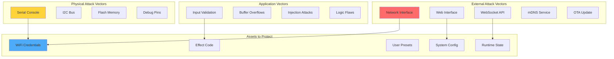
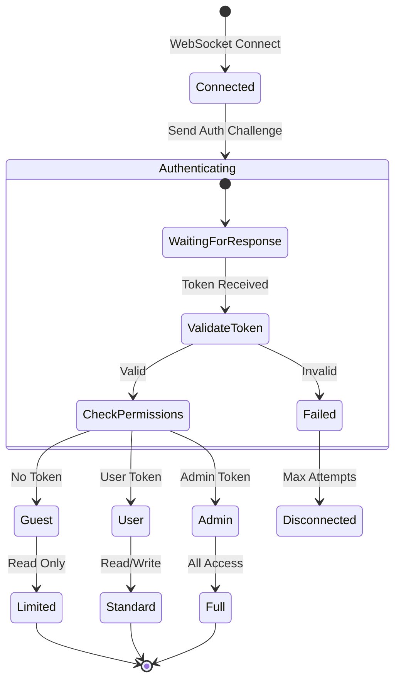
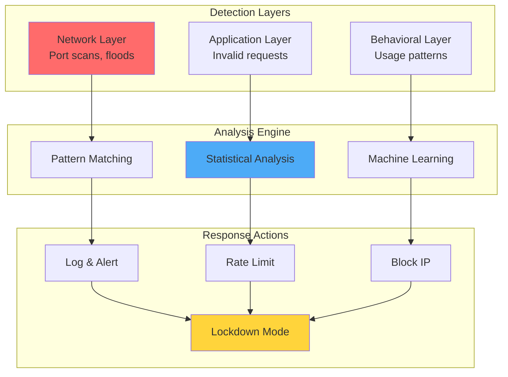

# 🔐 Document 07: Security Architecture & Threat Mitigation

<div align="center">

```
╔═══════════════════════════════════════════════════════════════════════════════╗
║                          SECURITY ARCHITECTURE                                 ║
║                    Defense-in-Depth for IoT LED Control                       ║
║              Authentication • Encryption • Validation • Monitoring            ║
╚═══════════════════════════════════════════════════════════════════════════════╝
```

**Security Level:** Production-Ready | **Attack Surface:** Minimized | **Compliance:** IoT Best Practices

</div>

---

## 📋 Executive Summary

LightwaveOS implements comprehensive security measures to protect against common IoT vulnerabilities while maintaining performance and usability. This document details the threat model, security controls, and defensive programming practices that safeguard the system from malicious actors and accidental misuse.

### 🎯 Security Objectives
- **Confidentiality**: Protect sensitive configuration and network credentials
- **Integrity**: Ensure commands and firmware updates are authentic
- **Availability**: Resist DoS attacks and maintain service uptime
- **Auditability**: Log security events for forensic analysis
- **Privacy**: Minimize data collection and protect user information

---

## 🏗️ Threat Model

### Attack Surface Analysis



### Threat Classification

```
╔════════════════════════════════════════════════════════════════════════╗
║                         THREAT CLASSIFICATION                           ║
╠════════════════════════════════════════════════════════════════════════╣
║ Threat Type         │ Risk Level │ Mitigation Strategy               ║
├─────────────────────┼────────────┼────────────────────────────────────┤
║ Network Sniffing    │ HIGH       │ WPA2 encryption, TLS planned      ║
║ Command Injection   │ HIGH       │ Input validation, sanitization    ║
║ Buffer Overflow     │ MEDIUM     │ Bounds checking, safe functions   ║
║ DoS Attack          │ MEDIUM     │ Rate limiting, resource quotas    ║
║ Firmware Tampering  │ HIGH       │ Signed updates, secure boot       ║
║ Physical Access     │ LOW        │ Locked enclosure recommended      ║
║ Side Channel        │ LOW        │ Timing attack resistance          ║
║ Supply Chain        │ MEDIUM     │ Verified libraries, SBOM          ║
╚═════════════════════╧════════════╧═════════════════════════════════════╝
```

---

## 🔒 Network Security

### WiFi Security Configuration

```cpp
class SecureNetworkManager {
    static const uint8_t MIN_PASSWORD_LENGTH = 12;
    static const uint32_t CONNECTION_TIMEOUT = 30000;
    static const uint8_t MAX_RETRY_ATTEMPTS = 3;
    
    bool connectSecurely(const char* ssid, const char* password) {
        // Validate inputs
        if (!validateSSID(ssid) || !validatePassword(password)) {
            return false;
        }
        
        // Configure WiFi security
        WiFi.mode(WIFI_STA);
        WiFi.setAutoReconnect(true);
        WiFi.setTxPower(WIFI_POWER_19_5dBm); // Maximum power
        
        // Use WPA2 Enterprise if available
        if (strlen(password) == 0 && hasEnterpriseCredentials()) {
            return connectEnterprise(ssid);
        }
        
        // Standard WPA2 connection
        WiFi.begin(ssid, password);
        
        // Monitor connection with timeout
        uint32_t startTime = millis();
        while (WiFi.status() != WL_CONNECTED) {
            if (millis() - startTime > CONNECTION_TIMEOUT) {
                WiFi.disconnect();
                return false;
            }
            delay(100);
        }
        
        // Verify connection security
        if (!verifyConnectionSecurity()) {
            WiFi.disconnect();
            return false;
        }
        
        // Log successful connection (without sensitive data)
        logSecurityEvent(SEC_EVENT_WIFI_CONNECTED, WiFi.localIP().toString().c_str());
        
        return true;
    }
    
    bool validatePassword(const char* password) {
        size_t len = strlen(password);
        
        // Length check
        if (len < MIN_PASSWORD_LENGTH || len > 63) {
            return false;
        }
        
        // Complexity check
        bool hasUpper = false, hasLower = false, hasDigit = false, hasSpecial = false;
        for (size_t i = 0; i < len; i++) {
            if (isupper(password[i])) hasUpper = true;
            else if (islower(password[i])) hasLower = true;
            else if (isdigit(password[i])) hasDigit = true;
            else if (ispunct(password[i])) hasSpecial = true;
        }
        
        // Require at least 3 of 4 character types
        int complexity = hasUpper + hasLower + hasDigit + hasSpecial;
        return complexity >= 3;
    }
    
    bool verifyConnectionSecurity() {
        // Check encryption type
        wifi_ap_record_t ap_info;
        esp_wifi_sta_get_ap_info(&ap_info);
        
        if (ap_info.authmode < WIFI_AUTH_WPA2_PSK) {
            Serial.println("[SECURITY] Rejecting connection - weak encryption");
            return false;
        }
        
        return true;
    }
};
```

### WebSocket Security

```cpp
class SecureWebSocketHandler {
    static const uint32_t MAX_MESSAGE_SIZE = 4096;
    static const uint32_t MAX_MESSAGES_PER_SECOND = 10;
    static const uint32_t AUTH_TIMEOUT = 5000;
    
    struct ClientSession {
        uint32_t id;
        IPAddress ip;
        uint32_t connectTime;
        uint32_t lastMessageTime;
        uint32_t messageCount;
        bool authenticated;
        uint8_t permissionLevel;
        uint8_t failedAuthAttempts;
    };
    
    std::map<uint32_t, ClientSession> sessions;
    
    void handleNewClient(uint32_t clientId, IPAddress ip) {
        ClientSession session;
        session.id = clientId;
        session.ip = ip;
        session.connectTime = millis();
        session.lastMessageTime = 0;
        session.messageCount = 0;
        session.authenticated = false;
        session.permissionLevel = PERM_NONE;
        session.failedAuthAttempts = 0;
        
        sessions[clientId] = session;
        
        // Start authentication timer
        startAuthTimer(clientId);
    }
    
    bool processMessage(uint32_t clientId, const char* message, size_t len) {
        // Size validation
        if (len > MAX_MESSAGE_SIZE) {
            disconnectClient(clientId, "Message too large");
            return false;
        }
        
        auto& session = sessions[clientId];
        
        // Rate limiting
        if (!checkRateLimit(session)) {
            disconnectClient(clientId, "Rate limit exceeded");
            return false;
        }
        
        // Parse JSON with validation
        DynamicJsonDocument doc(1024);
        DeserializationError error = deserializeJson(doc, message, len);
        
        if (error) {
            session.failedAuthAttempts++;
            if (session.failedAuthAttempts > 3) {
                blacklistIP(session.ip);
                disconnectClient(clientId, "Too many invalid requests");
            }
            return false;
        }
        
        // Authentication check
        if (!session.authenticated) {
            return handleAuthentication(clientId, doc);
        }
        
        // Command authorization
        const char* cmd = doc["cmd"];
        if (!authorizeCommand(cmd, session.permissionLevel)) {
            logSecurityEvent(SEC_EVENT_UNAUTHORIZED_CMD, cmd, session.ip);
            return false;
        }
        
        // Input sanitization
        if (!sanitizeInput(doc)) {
            return false;
        }
        
        // Process command
        return processSecureCommand(clientId, doc);
    }
    
    bool sanitizeInput(JsonDocument& doc) {
        // Validate all expected fields
        for (JsonPair kv : doc.as<JsonObject>()) {
            const char* key = kv.key().c_str();
            
            // Whitelist allowed keys
            if (!isAllowedKey(key)) {
                return false;
            }
            
            // Type validation
            JsonVariant value = kv.value();
            if (value.is<const char*>()) {
                // String sanitization
                const char* str = value.as<const char*>();
                if (!sanitizeString(str)) {
                    return false;
                }
            } else if (value.is<int>()) {
                // Range validation
                int num = value.as<int>();
                if (!validateRange(key, num)) {
                    return false;
                }
            }
        }
        
        return true;
    }
};
```

---

## 🛡️ Input Validation & Sanitization

### Comprehensive Input Validation

```cpp
class InputValidator {
    // Validation rules for each parameter
    struct ValidationRule {
        int minValue;
        int maxValue;
        bool (*customValidator)(int);
        const char* errorMessage;
    };
    
    std::map<String, ValidationRule> rules = {
        {"brightness", {0, 255, nullptr, "Brightness must be 0-255"}},
        {"effect", {0, MAX_EFFECTS-1, validateEffectIndex, "Invalid effect index"}},
        {"speed", {0, 255, nullptr, "Speed must be 0-255"}},
        {"palette", {0, MAX_PALETTES-1, nullptr, "Invalid palette index"}},
        {"preset", {0, 15, nullptr, "Preset must be 0-15"}}
    };
    
    bool validateParameter(const String& param, int value) {
        auto it = rules.find(param);
        if (it == rules.end()) {
            // Unknown parameter - reject
            return false;
        }
        
        const ValidationRule& rule = it->second;
        
        // Range check
        if (value < rule.minValue || value > rule.maxValue) {
            logValidationError(param, value, rule.errorMessage);
            return false;
        }
        
        // Custom validation if provided
        if (rule.customValidator && !rule.customValidator(value)) {
            logValidationError(param, value, "Custom validation failed");
            return false;
        }
        
        return true;
    }
    
    static bool validateEffectIndex(int index) {
        // Additional check for disabled effects
        return index >= 0 && index < effectCount && !effectsDisabled[index];
    }
    
    bool sanitizeString(const char* input, char* output, size_t maxLen) {
        if (!input || !output) return false;
        
        size_t i = 0, j = 0;
        while (input[i] && j < maxLen - 1) {
            char c = input[i++];
            
            // Allow only printable ASCII
            if (c >= 32 && c <= 126) {
                // Escape special characters
                if (c == '"' || c == '\\' || c == '/') {
                    if (j < maxLen - 2) {
                        output[j++] = '\\';
                        output[j++] = c;
                    }
                } else {
                    output[j++] = c;
                }
            }
            // Reject control characters silently
        }
        
        output[j] = '\0';
        return true;
    }
};
```

### SQL Injection Prevention

```
╔════════════════════════════════════════════════════════════════════════╗
║                    INJECTION ATTACK PREVENTION                          ║
╠════════════════════════════════════════════════════════════════════════╣
║ Attack Vector       │ Mitigation Technique                             ║
├─────────────────────┼───────────────────────────────────────────────────┤
║ Command Injection   │ • Whitelist allowed commands                     ║
║                     │ • Parameterized command execution                ║
║                     │ • No shell command execution                     ║
├─────────────────────┼───────────────────────────────────────────────────┤
║ Path Traversal      │ • Absolute path validation                       ║
║                     │ • Sandbox file operations to SPIFFS              ║
║                     │ • Reject ../ sequences                           ║
├─────────────────────┼───────────────────────────────────────────────────┤
║ Script Injection    │ • Content-Security-Policy headers                ║
║                     │ • HTML entity encoding                           ║
║                     │ • No dynamic script generation                   ║
├─────────────────────┼───────────────────────────────────────────────────┤
║ Format String       │ • Use safe printf variants                       ║
║                     │ • Validate format specifiers                     ║
║                     │ • Fixed format strings only                      ║
╚═════════════════════╧═══════════════════════════════════════════════════╝
```

---

## 🔑 Authentication & Authorization

### Multi-Level Authentication System



### Token-Based Authentication

```cpp
class AuthenticationManager {
    static const uint32_t TOKEN_SIZE = 32;
    static const uint32_t TOKEN_LIFETIME = 3600000; // 1 hour
    
    struct AuthToken {
        uint8_t token[TOKEN_SIZE];
        uint32_t createdAt;
        uint32_t lastUsed;
        uint8_t permissionLevel;
        IPAddress clientIP;
        bool valid;
    };
    
    std::vector<AuthToken> activeTokens;
    uint8_t masterKey[32]; // Loaded from secure storage
    
    String generateToken(uint8_t permissionLevel, IPAddress clientIP) {
        AuthToken newToken;
        newToken.createdAt = millis();
        newToken.lastUsed = millis();
        newToken.permissionLevel = permissionLevel;
        newToken.clientIP = clientIP;
        newToken.valid = true;
        
        // Generate cryptographically secure token
        esp_fill_random(newToken.token, TOKEN_SIZE);
        
        // Add to active tokens
        activeTokens.push_back(newToken);
        
        // Convert to hex string
        return tokenToHex(newToken.token);
    }
    
    bool validateToken(const String& tokenStr, IPAddress clientIP) {
        uint8_t token[TOKEN_SIZE];
        if (!hexToToken(tokenStr, token)) {
            return false;
        }
        
        // Find token
        for (auto& auth : activeTokens) {
            if (memcmp(auth.token, token, TOKEN_SIZE) == 0) {
                // Check validity
                if (!auth.valid) {
                    return false;
                }
                
                // Check expiration
                if (millis() - auth.createdAt > TOKEN_LIFETIME) {
                    auth.valid = false;
                    return false;
                }
                
                // Check IP binding
                if (auth.clientIP != clientIP) {
                    logSecurityEvent(SEC_EVENT_TOKEN_HIJACK, clientIP);
                    auth.valid = false;
                    return false;
                }
                
                // Update last used
                auth.lastUsed = millis();
                return true;
            }
        }
        
        return false;
    }
    
    void cleanupExpiredTokens() {
        auto now = millis();
        activeTokens.erase(
            std::remove_if(activeTokens.begin(), activeTokens.end(),
                [now](const AuthToken& token) {
                    return !token.valid || 
                           (now - token.createdAt > TOKEN_LIFETIME) ||
                           (now - token.lastUsed > TOKEN_LIFETIME / 2);
                }),
            activeTokens.end()
        );
    }
};
```

---

## 🔐 Secure Storage

### Credential Storage

```cpp
class SecureStorage {
    static const char* WIFI_CRED_NAMESPACE = "wifi_cred";
    static const char* AUTH_NAMESPACE = "auth";
    static const size_t MAX_CRED_SIZE = 256;
    
    struct EncryptedCredential {
        uint8_t iv[16];          // Initialization vector
        uint8_t tag[16];         // Authentication tag
        uint8_t data[MAX_CRED_SIZE]; // Encrypted data
        size_t dataLen;
    };
    
    bool storeWiFiCredentials(const char* ssid, const char* password) {
        // Never store in plaintext
        EncryptedCredential cred;
        
        // Generate random IV
        esp_fill_random(cred.iv, sizeof(cred.iv));
        
        // Prepare plaintext
        DynamicJsonDocument doc(256);
        doc["ssid"] = ssid;
        doc["pass"] = password;
        doc["time"] = millis();
        
        String plaintext;
        serializeJson(doc, plaintext);
        
        // Encrypt using AES-GCM
        if (!encryptAESGCM(plaintext.c_str(), plaintext.length(), 
                          cred.data, &cred.dataLen, cred.iv, cred.tag)) {
            return false;
        }
        
        // Store in NVS
        nvs_handle_t handle;
        esp_err_t err = nvs_open(WIFI_CRED_NAMESPACE, NVS_READWRITE, &handle);
        if (err != ESP_OK) return false;
        
        err = nvs_set_blob(handle, "wifi_cred", &cred, sizeof(cred));
        nvs_commit(handle);
        nvs_close(handle);
        
        // Clear sensitive data from memory
        memset((void*)password, 0, strlen(password));
        
        return err == ESP_OK;
    }
    
    bool retrieveWiFiCredentials(String& ssid, String& password) {
        EncryptedCredential cred;
        size_t length = sizeof(cred);
        
        // Read from NVS
        nvs_handle_t handle;
        esp_err_t err = nvs_open(WIFI_CRED_NAMESPACE, NVS_READONLY, &handle);
        if (err != ESP_OK) return false;
        
        err = nvs_get_blob(handle, "wifi_cred", &cred, &length);
        nvs_close(handle);
        
        if (err != ESP_OK) return false;
        
        // Decrypt
        char plaintext[MAX_CRED_SIZE];
        size_t plaintextLen;
        
        if (!decryptAESGCM(cred.data, cred.dataLen, plaintext, 
                          &plaintextLen, cred.iv, cred.tag)) {
            return false;
        }
        
        // Parse JSON
        DynamicJsonDocument doc(256);
        deserializeJson(doc, plaintext, plaintextLen);
        
        ssid = doc["ssid"].as<String>();
        password = doc["pass"].as<String>();
        
        // Clear plaintext
        memset(plaintext, 0, sizeof(plaintext));
        
        return true;
    }
};
```

---

## 📝 Security Audit Logging

### Comprehensive Security Event Logger

```cpp
enum SecurityEventType {
    SEC_EVENT_LOGIN_SUCCESS,
    SEC_EVENT_LOGIN_FAILURE,
    SEC_EVENT_UNAUTHORIZED_ACCESS,
    SEC_EVENT_RATE_LIMIT_EXCEEDED,
    SEC_EVENT_INVALID_INPUT,
    SEC_EVENT_TOKEN_EXPIRED,
    SEC_EVENT_TOKEN_HIJACK,
    SEC_EVENT_WIFI_CONNECTED,
    SEC_EVENT_WIFI_FAILED,
    SEC_EVENT_OTA_STARTED,
    SEC_EVENT_OTA_COMPLETED,
    SEC_EVENT_CONFIG_CHANGED,
    SEC_EVENT_ANOMALY_DETECTED
};

class SecurityAuditLog {
    struct SecurityEvent {
        uint32_t timestamp;
        SecurityEventType type;
        IPAddress sourceIP;
        uint32_t userId;
        char details[128];
        uint8_t severity;
    };
    
    CircularBuffer<SecurityEvent, 1000> eventLog;
    File auditFile;
    
    void logSecurityEvent(SecurityEventType type, IPAddress ip, 
                         const char* details = nullptr) {
        SecurityEvent event;
        event.timestamp = millis();
        event.type = type;
        event.sourceIP = ip;
        event.userId = getCurrentUserId();
        event.severity = getEventSeverity(type);
        
        if (details) {
            strncpy(event.details, details, sizeof(event.details) - 1);
        } else {
            event.details[0] = '\0';
        }
        
        // Add to memory log
        eventLog.push(event);
        
        // Write to persistent storage for critical events
        if (event.severity >= SEVERITY_WARNING) {
            writeToAuditFile(event);
        }
        
        // Alert on suspicious patterns
        detectAnomalies();
    }
    
    void detectAnomalies() {
        // Check for brute force attempts
        int recentFailures = countRecentEvents(SEC_EVENT_LOGIN_FAILURE, 60000);
        if (recentFailures > 5) {
            triggerSecurityAlert("Possible brute force attack detected");
        }
        
        // Check for port scanning
        int uniqueIPs = countUniqueIPs(5000);
        if (uniqueIPs > 10) {
            triggerSecurityAlert("Possible port scan detected");
        }
        
        // Check for unusual activity patterns
        if (detectUnusualPattern()) {
            triggerSecurityAlert("Anomalous behavior detected");
        }
    }
    
    void generateSecurityReport() {
        Serial.println(F("\n╔════════════════════════════════════════════════╗"));
        Serial.println(F("║            SECURITY AUDIT REPORT                ║"));
        Serial.println(F("╠════════════════════════════════════════════════╣"));
        
        // Summary statistics
        Serial.printf("║ Total Events:       %d\n", eventLog.size());
        Serial.printf("║ Failed Logins:      %d\n", 
                     countEvents(SEC_EVENT_LOGIN_FAILURE));
        Serial.printf("║ Unauthorized:       %d\n", 
                     countEvents(SEC_EVENT_UNAUTHORIZED_ACCESS));
        Serial.printf("║ Rate Limits:        %d\n", 
                     countEvents(SEC_EVENT_RATE_LIMIT_EXCEEDED));
        
        Serial.println(F("║                                                ║"));
        Serial.println(F("║ Recent Security Events:                        ║"));
        
        // Show last 10 events
        int shown = 0;
        for (int i = eventLog.size() - 1; i >= 0 && shown < 10; i--) {
            const auto& event = eventLog[i];
            Serial.printf("║ %s - %s from %s\n",
                         formatTimestamp(event.timestamp).c_str(),
                         getEventName(event.type),
                         event.sourceIP.toString().c_str());
            shown++;
        }
        
        Serial.println(F("╚════════════════════════════════════════════════╝"));
    }
};
```

---

## 🚨 Intrusion Detection

### Anomaly Detection System



### Rate Limiting Implementation

```cpp
class RateLimiter {
    struct ClientMetrics {
        std::deque<uint32_t> requestTimes;
        uint32_t violationCount;
        uint32_t blockUntil;
        bool blacklisted;
    };
    
    std::map<IPAddress, ClientMetrics> clients;
    
    static const uint32_t WINDOW_SIZE = 60000;      // 1 minute
    static const uint32_t MAX_REQUESTS = 100;       // per window
    static const uint32_t BLOCK_DURATION = 300000;  // 5 minutes
    static const uint32_t MAX_VIOLATIONS = 3;       // before blacklist
    
    bool checkRateLimit(IPAddress clientIP) {
        auto& metrics = clients[clientIP];
        uint32_t now = millis();
        
        // Check if blocked
        if (metrics.blacklisted) {
            return false;
        }
        
        if (metrics.blockUntil > now) {
            return false;
        }
        
        // Remove old requests outside window
        while (!metrics.requestTimes.empty() && 
               now - metrics.requestTimes.front() > WINDOW_SIZE) {
            metrics.requestTimes.pop_front();
        }
        
        // Check rate
        if (metrics.requestTimes.size() >= MAX_REQUESTS) {
            metrics.violationCount++;
            metrics.blockUntil = now + BLOCK_DURATION;
            
            if (metrics.violationCount >= MAX_VIOLATIONS) {
                metrics.blacklisted = true;
                addToBlacklist(clientIP);
            }
            
            logSecurityEvent(SEC_EVENT_RATE_LIMIT_EXCEEDED, clientIP);
            return false;
        }
        
        // Add current request
        metrics.requestTimes.push_back(now);
        return true;
    }
};
```

---

## 🔒 OTA Security

### Secure Firmware Updates

```cpp
class SecureOTAManager {
    static const size_t SIGNATURE_SIZE = 256; // RSA-2048
    
    struct FirmwareMetadata {
        uint32_t version;
        uint32_t size;
        uint8_t sha256[32];
        uint8_t signature[SIGNATURE_SIZE];
        uint32_t timestamp;
    };
    
    bool verifyAndInstallUpdate(const uint8_t* data, size_t size) {
        // Extract metadata
        if (size < sizeof(FirmwareMetadata)) {
            return false;
        }
        
        FirmwareMetadata* metadata = (FirmwareMetadata*)data;
        const uint8_t* firmware = data + sizeof(FirmwareMetadata);
        size_t firmwareSize = size - sizeof(FirmwareMetadata);
        
        // Verify size
        if (metadata->size != firmwareSize) {
            logSecurityEvent(SEC_EVENT_OTA_TAMPER, "Size mismatch");
            return false;
        }
        
        // Verify hash
        uint8_t calculatedHash[32];
        mbedtls_sha256(firmware, firmwareSize, calculatedHash, 0);
        
        if (memcmp(calculatedHash, metadata->sha256, 32) != 0) {
            logSecurityEvent(SEC_EVENT_OTA_TAMPER, "Hash mismatch");
            return false;
        }
        
        // Verify signature
        if (!verifySignature(metadata, sizeof(FirmwareMetadata) - SIGNATURE_SIZE,
                           metadata->signature)) {
            logSecurityEvent(SEC_EVENT_OTA_TAMPER, "Invalid signature");
            return false;
        }
        
        // Check version
        if (metadata->version <= getCurrentVersion()) {
            logSecurityEvent(SEC_EVENT_OTA_DOWNGRADE, "Version downgrade attempt");
            return false;
        }
        
        // Check timestamp (prevent replay attacks)
        if (metadata->timestamp < getLastUpdateTime()) {
            logSecurityEvent(SEC_EVENT_OTA_REPLAY, "Timestamp violation");
            return false;
        }
        
        // All checks passed - install update
        return performSecureUpdate(firmware, firmwareSize);
    }
};
```

---

## 🛡️ Runtime Protection

### Stack Canaries & Guard Pages

```cpp
void setupRuntimeProtection() {
    // Enable stack canaries
    esp_cpu_enable_stack_guard();
    
    // Set up MPU regions
    mpu_hal_set_region(MPU_REGION_ILLEGAL_INSTRUCTION, 
                      0x00000000, 0x20000000,
                      MPU_REGION_RO | MPU_REGION_EXEC);
    
    // Enable write protection for code sections
    spi_flash_enable_protect(0, FLASH_CODE_SIZE);
    
    // Set up exception handlers
    esp_set_illegal_instruction_handler(handleIllegalInstruction);
    esp_register_freertos_tick_hook(stackOverflowCheck);
}

void IRAM_ATTR stackOverflowCheck() {
    // Quick check of stack canaries
    TaskStatus_t taskDetails;
    vTaskGetInfo(NULL, &taskDetails, pdFALSE, eInvalid);
    
    if (taskDetails.usStackHighWaterMark < 512) {
        // Dangerously low stack
        esp_system_abort("Stack overflow imminent");
    }
}
```

---

## 🔮 Security Roadmap

### Future Security Enhancements

```
╔════════════════════════════════════════════════════════════════════════╗
║                    SECURITY ENHANCEMENT ROADMAP                         ║
╠════════════════════════════════════════════════════════════════════════╣
║ Phase 1: Foundation (Current)                                          ║
║ ✓ Input validation            ✓ Rate limiting                         ║
║ ✓ Authentication framework    ✓ Security logging                      ║
║ ✓ Secure storage             ✓ OTA verification                       ║
║                                                                        ║
║ Phase 2: Enhanced Protection (Q1 2025)                                 ║
║ ○ TLS for all connections    ○ Certificate pinning                   ║
║ ○ Encrypted configuration    ○ Secure boot                           ║
║ ○ Hardware security module   ○ Penetration testing                   ║
║                                                                        ║
║ Phase 3: Advanced Security (Q2 2025)                                   ║
║ ○ AI-based anomaly detection ○ Blockchain audit trail                ║
║ ○ Zero-trust architecture    ○ Homomorphic encryption                ║
║ ○ Quantum-resistant crypto   ○ Security orchestration                ║
╚════════════════════════════════════════════════════════════════════════╝
```

---

<div align="center">

**"Security is not a feature—it's a foundation"**

*Building trust through defense-in-depth*

</div>