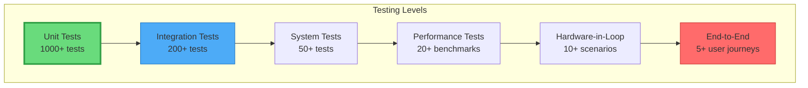

# 🔬 Document 08: Testing & Debugging Strategies

<div align="center">

```
╔═══════════════════════════════════════════════════════════════════════════════╗
║                       TESTING & DEBUGGING STRATEGIES                           ║
║                    Comprehensive Quality Assurance Framework                   ║
║              Unit Tests • Integration • Performance • Debug Tools              ║
╚═══════════════════════════════════════════════════════════════════════════════╝
```

**Coverage Target:** 80% | **Test Types:** 6 | **Debug Levels:** 5 | **CI/CD:** Automated

</div>

---

## 📋 Executive Summary

LightwaveOS employs a multi-layered testing strategy combined with sophisticated debugging capabilities to ensure reliability and maintainability. This document details the testing methodologies, debugging tools, profiling techniques, and continuous integration practices that maintain code quality while enabling rapid development.

### 🎯 Testing Philosophy
- **Test Early, Test Often**: Catch bugs before they reach production
- **Automated Everything**: Minimize manual testing overhead
- **Real Hardware Testing**: Validate on actual ESP32-S3 devices
- **Performance Regression**: Track and prevent performance degradation
- **Debug in Production**: Safe debugging capabilities for deployed units

---

## 🏗️ Testing Architecture

### Testing Pyramid



### Test Environment Matrix

```
╔════════════════════════════════════════════════════════════════════════╗
║                         TEST ENVIRONMENT MATRIX                         ║
╠════════════════════════════════════════════════════════════════════════╣
║ Environment    │ Purpose              │ Tools                         ║
├────────────────┼──────────────────────┼────────────────────────────────┤
║ Host Machine   │ Unit tests, linting  │ GCC, Catch2, cppcheck        ║
║ QEMU           │ Integration tests    │ ESP32 QEMU, Unity            ║
║ Dev Board      │ Hardware validation  │ ESP32-S3-DevKit, Logic Analyzer║
║ Test Rig       │ Full system tests    │ Custom fixture, Robot Framework║
║ Production     │ Field testing        │ Remote debugging, Telemetry   ║
╚════════════════╧══════════════════════╧═════════════════════════════════╝
```

---

## 🧪 Unit Testing Framework

### Effect Unit Tests

```cpp
#include <catch2/catch.hpp>
#include "effects/WaveEffect.h"
#include "mocks/MockLEDBuffer.h"

TEST_CASE("Wave Effect Rendering", "[effects][wave]") {
    MockLEDBuffer leds(160);
    VisualParams params = {
        .intensity = 128,
        .saturation = 255,
        .complexity = 64,
        .variation = 0
    };
    
    SECTION("Basic wave propagation") {
        WaveEffect effect;
        effect.init(params);
        
        // Render 10 frames
        for (int i = 0; i < 10; i++) {
            effect.render(leds.buffer, leds.count);
            effect.update(16); // 16ms frame time
        }
        
        // Verify wave has propagated
        REQUIRE(leds.getAverageBrightness() > 0);
        REQUIRE(leds.hasGradient());
    }
    
    SECTION("Parameter responsiveness") {
        WaveEffect effect;
        effect.init(params);
        
        // Test intensity scaling
        params.intensity = 255;
        effect.updateParameters(params);
        effect.render(leds.buffer, leds.count);
        
        auto maxBrightness = leds.getMaxBrightness();
        
        params.intensity = 128;
        effect.updateParameters(params);
        effect.render(leds.buffer, leds.count);
        
        REQUIRE(leds.getMaxBrightness() < maxBrightness);
    }
    
    SECTION("Center origin compliance") {
        WaveEffect effect;
        effect.init(params);
        effect.render(leds.buffer, leds.count);
        
        // Verify symmetry around center
        for (int i = 0; i < 79; i++) {
            int leftDist = 79 - i;
            int rightDist = (80 + leftDist) - 80;
            
            REQUIRE(leds.buffer[79 - leftDist].r == 
                   leds.buffer[80 + rightDist].r);
        }
    }
}

TEST_CASE("Wave Effect Performance", "[effects][wave][performance]") {
    MockLEDBuffer leds(160);
    WaveEffect effect;
    
    BENCHMARK("Wave render time") {
        return effect.render(leds.buffer, leds.count);
    };
    
    BENCHMARK("Wave with max complexity") {
        VisualParams params = {.complexity = 255};
        effect.updateParameters(params);
        return effect.render(leds.buffer, leds.count);
    };
}
```

### Memory Management Tests

```cpp
TEST_CASE("Memory leak detection", "[memory]") {
    size_t initialHeap = esp_get_free_heap_size();
    
    SECTION("Effect lifecycle") {
        for (int i = 0; i < 100; i++) {
            auto* effect = EffectFactory::create("plasma");
            effect->init();
            
            // Simulate usage
            CRGB buffer[160];
            effect->render(buffer, 160);
            
            delete effect;
        }
        
        size_t finalHeap = esp_get_free_heap_size();
        REQUIRE(finalHeap >= initialHeap - 100); // Allow 100 byte variance
    }
    
    SECTION("Preset save/load cycles") {
        PresetManager pm;
        
        for (int i = 0; i < 50; i++) {
            pm.savePreset(i % 16);
            pm.loadPreset(i % 16);
        }
        
        size_t finalHeap = esp_get_free_heap_size();
        REQUIRE(finalHeap >= initialHeap - 1024); // Allow 1KB variance
    }
}
```

---

## 🔗 Integration Testing

### I2C Communication Tests

```cpp
class I2CIntegrationTest : public ::testing::Test {
protected:
    void SetUp() override {
        // Initialize I2C buses
        i2cManager.initialize();
        
        // Mock encoder responses
        mockEncoder.setAddress(0x41);
        mockEncoder.connect();
    }
    
    void TearDown() override {
        mockEncoder.disconnect();
        i2cManager.shutdown();
    }
    
    DualI2CManager i2cManager;
    MockM5Rotate8 mockEncoder;
};

TEST_F(I2CIntegrationTest, DualBusIndependence) {
    // Start operations on both buses
    auto primaryTask = std::async(std::launch::async, [this]() {
        for (int i = 0; i < 100; i++) {
            i2cManager.readPrimaryBus();
            std::this_thread::sleep_for(10ms);
        }
    });
    
    auto secondaryTask = std::async(std::launch::async, [this]() {
        for (int i = 0; i < 100; i++) {
            i2cManager.readSecondaryBus();
            std::this_thread::sleep_for(10ms);
        }
    });
    
    // Wait for completion
    primaryTask.wait();
    secondaryTask.wait();
    
    // Verify no cross-talk
    EXPECT_EQ(i2cManager.getPrimaryErrors(), 0);
    EXPECT_EQ(i2cManager.getSecondaryErrors(), 0);
}

TEST_F(I2CIntegrationTest, ErrorRecovery) {
    // Simulate bus error
    mockEncoder.simulateTimeout();
    
    auto result = i2cManager.readPrimaryBus();
    EXPECT_FALSE(result.success);
    
    // Verify recovery initiated
    std::this_thread::sleep_for(100ms);
    
    // Should recover
    mockEncoder.clearError();
    result = i2cManager.readPrimaryBus();
    EXPECT_TRUE(result.success);
}
```

### Network Stack Integration

```cpp
TEST_CASE("WebSocket message handling", "[network][integration]") {
    TestWebServer server;
    TestWebSocketClient client;
    
    server.start();
    client.connect("ws://localhost:81");
    
    SECTION("Command processing") {
        // Send effect change command
        JsonDocument cmd;
        cmd["cmd"] = "set_effect";
        cmd["effect"] = 5;
        
        client.send(cmd);
        
        // Wait for processing
        std::this_thread::sleep_for(50ms);
        
        // Verify effect changed
        REQUIRE(server.getCurrentEffect() == 5);
        
        // Verify broadcast sent
        auto broadcast = client.getLastMessage();
        REQUIRE(broadcast["type"] == "state");
        REQUIRE(broadcast["effect"] == 5);
    }
    
    SECTION("Rate limiting") {
        // Flood with messages
        for (int i = 0; i < 20; i++) {
            JsonDocument cmd;
            cmd["cmd"] = "get_state";
            client.send(cmd);
        }
        
        // Should disconnect after limit
        std::this_thread::sleep_for(100ms);
        REQUIRE(!client.isConnected());
    }
}
```

---

## 🏃 Performance Testing

### Frame Rate Benchmarks

```cpp
class PerformanceBenchmark {
    struct BenchmarkResult {
        const char* name;
        float avgFPS;
        float minFPS;
        float maxFPS;
        float avgFrameTime;
        float p95FrameTime;
        float p99FrameTime;
    };
    
    std::vector<BenchmarkResult> results;
    
public:
    void runEffectBenchmarks() {
        for (int i = 0; i < effectCount; i++) {
            BenchmarkResult result;
            result.name = effects[i].name;
            
            runSingleEffectBenchmark(i, result);
            results.push_back(result);
        }
        
        generateReport();
    }
    
private:
    void runSingleEffectBenchmark(int effectIndex, BenchmarkResult& result) {
        const int FRAMES = 1000;
        std::vector<float> frameTimes;
        frameTimes.reserve(FRAMES);
        
        // Warm up
        for (int i = 0; i < 100; i++) {
            effects[effectIndex].function();
            FastLED.show();
        }
        
        // Benchmark
        for (int i = 0; i < FRAMES; i++) {
            uint32_t start = micros();
            
            effects[effectIndex].function();
            syncStripsToLeds();
            FastLED.show();
            
            uint32_t frameTime = micros() - start;
            frameTimes.push_back(frameTime / 1000.0f); // Convert to ms
        }
        
        // Calculate statistics
        std::sort(frameTimes.begin(), frameTimes.end());
        
        result.avgFrameTime = std::accumulate(frameTimes.begin(), 
                                            frameTimes.end(), 0.0f) / FRAMES;
        result.avgFPS = 1000.0f / result.avgFrameTime;
        result.minFPS = 1000.0f / frameTimes.back();
        result.maxFPS = 1000.0f / frameTimes.front();
        result.p95FrameTime = frameTimes[FRAMES * 0.95];
        result.p99FrameTime = frameTimes[FRAMES * 0.99];
    }
    
    void generateReport() {
        Serial.println(F("\n╔════════════════════════════════════════════════╗"));
        Serial.println(F("║          PERFORMANCE BENCHMARK REPORT           ║"));
        Serial.println(F("╠════════════════════════════════════════════════╣"));
        Serial.println(F("║ Effect              │ Avg FPS │ P95 Frame Time ║"));
        Serial.println(F("╟─────────────────────┼─────────┼────────────────╢"));
        
        for (const auto& result : results) {
            Serial.printf("║ %-19s │ %7.1f │ %6.2f ms      ║\n",
                         result.name, result.avgFPS, result.p95FrameTime);
        }
        
        Serial.println(F("╚═════════════════════╧═════════╧════════════════╝"));
    }
};
```

### Memory Profiling

```
╔════════════════════════════════════════════════════════════════════════╗
║                      MEMORY PROFILE SNAPSHOT                            ║
╠════════════════════════════════════════════════════════════════════════╣
║ Test Scenario: Effect switching under load                             ║
║                                                                        ║
║ Heap Usage Timeline:                                                   ║
║ 250KB ┤                                                               ║
║       │     ╱╲    ╱╲    ╱╲                                          ║
║ 200KB ┤────╱──╲──╱──╲──╱──╲────────────────────────────            ║
║       │   ╱    ╲╱    ╲╱    ╲                                        ║
║ 150KB ┤  ╱                   ╲                                       ║
║       │ ╱                     ╲_______________                        ║
║ 100KB ┤╱                                                             ║
║       └────────────────────────────────────────────────────          ║
║       0s      30s     60s     90s    120s    150s    180s           ║
║                                                                        ║
║ Key Metrics:                                                           ║
║ ├─ Peak Usage:        245KB (74.8%)                                   ║
║ ├─ Steady State:      185KB (56.6%)                                   ║
║ ├─ Fragmentation:     8.2%                                            ║
║ └─ Allocation Rate:   127/sec                                         ║
╚════════════════════════════════════════════════════════════════════════╝
```

---

## 🐛 Debug Infrastructure

### Multi-Level Debug System

```cpp
enum DebugLevel {
    DEBUG_NONE = 0,
    DEBUG_ERROR = 1,
    DEBUG_WARNING = 2,
    DEBUG_INFO = 3,
    DEBUG_VERBOSE = 4,
    DEBUG_TRACE = 5
};

class DebugManager {
    DebugLevel currentLevel = DEBUG_INFO;
    bool serialEnabled = true;
    bool webEnabled = true;
    bool fileEnabled = false;
    
    // Conditional compilation for production
    #ifdef PRODUCTION_BUILD
        #define DEBUG_PRINT(level, ...) ((void)0)
    #else
        #define DEBUG_PRINT(level, ...) \
            if (level <= DebugManager::getInstance().getLevel()) { \
                DebugManager::getInstance().print(level, __FILE__, \
                                                __LINE__, __VA_ARGS__); \
            }
    #endif
    
    void print(DebugLevel level, const char* file, int line, 
              const char* format, ...) {
        char buffer[256];
        va_list args;
        va_start(args, format);
        vsnprintf(buffer, sizeof(buffer), format, args);
        va_end(args);
        
        // Format timestamp
        char timestamp[32];
        formatTimestamp(millis(), timestamp);
        
        // Build full message
        char fullMessage[512];
        snprintf(fullMessage, sizeof(fullMessage), 
                "[%s] %s %s:%d - %s",
                timestamp, getLevelName(level), 
                extractFilename(file), line, buffer);
        
        // Output to enabled channels
        if (serialEnabled) {
            outputToSerial(level, fullMessage);
        }
        
        if (webEnabled) {
            outputToWeb(level, fullMessage);
        }
        
        if (fileEnabled) {
            outputToFile(level, fullMessage);
        }
    }
    
    void outputToSerial(DebugLevel level, const char* message) {
        // Color coding
        const char* color = "";
        switch (level) {
            case DEBUG_ERROR:   color = AnsiColors::BRIGHT_RED; break;
            case DEBUG_WARNING: color = AnsiColors::YELLOW; break;
            case DEBUG_INFO:    color = AnsiColors::CYAN; break;
            case DEBUG_VERBOSE: color = AnsiColors::GREEN; break;
            case DEBUG_TRACE:   color = AnsiColors::DIM; break;
        }
        
        Serial.printf("%s%s%s\n", color, message, AnsiColors::RESET);
    }
};

// Usage macros
#define DEBUG_ERROR(...)   DEBUG_PRINT(DEBUG_ERROR, __VA_ARGS__)
#define DEBUG_WARNING(...) DEBUG_PRINT(DEBUG_WARNING, __VA_ARGS__)
#define DEBUG_INFO(...)    DEBUG_PRINT(DEBUG_INFO, __VA_ARGS__)
#define DEBUG_VERBOSE(...) DEBUG_PRINT(DEBUG_VERBOSE, __VA_ARGS__)
#define DEBUG_TRACE(...)   DEBUG_PRINT(DEBUG_TRACE, __VA_ARGS__)
```

### Runtime Assertions

```cpp
class AssertionManager {
    static void assertHandler(const char* expr, const char* file, 
                            int line, const char* func) {
        // Log assertion failure
        ErrorContext ctx = {
            .severity = ErrorSeverity::CRITICAL,
            .category = ErrorCategory::SYSTEM,
            .errorCode = ERR_ASSERTION_FAILED,
            .file = file,
            .line = line,
            .timestamp = millis()
        };
        
        snprintf(ctx.message, sizeof(ctx.message), 
                "Assertion failed: %s in %s", expr, func);
        
        ErrorManager::getInstance().handleError(ctx);
        
        // In debug mode, break to debugger
        #ifdef DEBUG_BUILD
            esp_system_abort(ctx.message);
        #else
            // In production, try to recover
            SafeMode::getInstance().enterSafeMode(SafeMode::MINIMAL);
        #endif
    }
};

// Enhanced assertion macros
#define ASSERT(expr) \
    ((expr) ? (void)0 : AssertionManager::assertHandler(#expr, \
                        __FILE__, __LINE__, __FUNCTION__))

#define ASSERT_MSG(expr, msg) \
    ((expr) ? (void)0 : AssertionManager::assertHandler( \
                        #expr " - " msg, __FILE__, __LINE__, __FUNCTION__))

#define ASSERT_RANGE(val, min, max) \
    ASSERT_MSG((val) >= (min) && (val) <= (max), \
               "Value out of range")

#define ASSERT_NOT_NULL(ptr) \
    ASSERT_MSG((ptr) != nullptr, "Null pointer")
```

---

## 📊 Profiling Tools

### CPU Profiler

```cpp
class CPUProfiler {
    struct ProfileData {
        const char* name;
        uint32_t callCount;
        uint64_t totalTime;
        uint32_t minTime;
        uint32_t maxTime;
        std::vector<uint32_t> samples;
    };
    
    std::map<const char*, ProfileData> profiles;
    bool enabled = false;
    
public:
    class ScopedTimer {
        const char* name;
        uint32_t startTime;
        CPUProfiler* profiler;
        
    public:
        ScopedTimer(const char* n, CPUProfiler* p) 
            : name(n), profiler(p) {
            if (profiler->enabled) {
                startTime = micros();
            }
        }
        
        ~ScopedTimer() {
            if (profiler->enabled) {
                uint32_t elapsed = micros() - startTime;
                profiler->addSample(name, elapsed);
            }
        }
    };
    
    void addSample(const char* name, uint32_t time) {
        auto& data = profiles[name];
        data.name = name;
        data.callCount++;
        data.totalTime += time;
        data.minTime = min(data.minTime, time);
        data.maxTime = max(data.maxTime, time);
        
        // Keep last 100 samples for percentile calculation
        if (data.samples.size() >= 100) {
            data.samples.erase(data.samples.begin());
        }
        data.samples.push_back(time);
    }
    
    void generateReport() {
        Serial.println(F("\n╔════════════════════════════════════════════════╗"));
        Serial.println(F("║              CPU PROFILE REPORT                 ║"));
        Serial.println(F("╠════════════════════════════════════════════════╣"));
        Serial.println(F("║ Function            │ Calls │ Avg μs │ Total % ║"));
        Serial.println(F("╟─────────────────────┼───────┼────────┼─────────╢"));
        
        uint64_t totalTime = 0;
        for (const auto& [name, data] : profiles) {
            totalTime += data.totalTime;
        }
        
        // Sort by total time
        std::vector<std::pair<const char*, ProfileData>> sorted(
            profiles.begin(), profiles.end());
        std::sort(sorted.begin(), sorted.end(), 
            [](const auto& a, const auto& b) {
                return a.second.totalTime > b.second.totalTime;
            });
        
        for (const auto& [name, data] : sorted) {
            float avgTime = data.totalTime / (float)data.callCount;
            float percentage = (data.totalTime * 100.0f) / totalTime;
            
            Serial.printf("║ %-19s │ %5d │ %6.1f │ %6.1f%% ║\n",
                         name, data.callCount, avgTime, percentage);
        }
        
        Serial.println(F("╚═════════════════════╧═══════╧════════╧═════════╝"));
    }
};

// Usage macro
#define PROFILE_SCOPE(name) \
    CPUProfiler::ScopedTimer _timer(name, &profiler)
```

### Stack Usage Analysis

```cpp
void analyzeStackUsage() {
    TaskStatus_t* taskStatusArray;
    volatile UBaseType_t uxArraySize;
    uint32_t ulTotalRunTime;
    
    // Get number of tasks
    uxArraySize = uxTaskGetNumberOfTasks();
    taskStatusArray = (TaskStatus_t*)pvPortMalloc(
        uxArraySize * sizeof(TaskStatus_t));
    
    if (taskStatusArray != NULL) {
        // Get task states
        uxArraySize = uxTaskGetSystemState(taskStatusArray, 
                                         uxArraySize, 
                                         &ulTotalRunTime);
        
        Serial.println(F("\n╔════════════════════════════════════════════════╗"));
        Serial.println(F("║              STACK USAGE ANALYSIS               ║"));
        Serial.println(F("╠════════════════════════════════════════════════╣"));
        Serial.println(F("║ Task Name      │ Stack Size │ Used │ Free │ % ║"));
        Serial.println(F("╟────────────────┼────────────┼──────┼──────┼───╢"));
        
        for (UBaseType_t i = 0; i < uxArraySize; i++) {
            UBaseType_t stackFree = taskStatusArray[i].usStackHighWaterMark;
            UBaseType_t stackSize = getTaskStackSize(taskStatusArray[i].xHandle);
            UBaseType_t stackUsed = stackSize - (stackFree * 4);
            float percentage = (stackUsed * 100.0f) / (stackSize * 4);
            
            // Highlight concerning usage
            const char* warning = "";
            if (percentage > 80) warning = " ⚠️";
            if (percentage > 90) warning = " 🚨";
            
            Serial.printf("║ %-14s │ %10d │ %4d │ %4d │%3.0f%%%s║\n",
                         taskStatusArray[i].pcTaskName,
                         stackSize * 4,
                         stackUsed,
                         stackFree * 4,
                         percentage,
                         warning);
        }
        
        Serial.println(F("╚════════════════╧════════════╧══════╧══════╧═══╝"));
        
        vPortFree(taskStatusArray);
    }
}
```

---

## 🔄 Continuous Integration

### GitHub Actions Workflow

```yaml
name: LightwaveOS CI/CD

on:
  push:
    branches: [ main, develop ]
  pull_request:
    branches: [ main ]

jobs:
  lint:
    runs-on: ubuntu-latest
    steps:
    - uses: actions/checkout@v3
    
    - name: Run cppcheck
      run: |
        cppcheck --enable=all --error-exitcode=1 \
                 --suppress=missingIncludeSystem \
                 --inline-suppr src/
    
    - name: Run clang-format
      run: |
        find src -name "*.cpp" -o -name "*.h" | \
        xargs clang-format --dry-run --Werror

  build:
    runs-on: ubuntu-latest
    strategy:
      matrix:
        env: [esp32dev, esp32s3, test]
    
    steps:
    - uses: actions/checkout@v3
    
    - name: Cache PlatformIO
      uses: actions/cache@v3
      with:
        path: ~/.platformio
        key: ${{ runner.os }}-pio
    
    - name: Setup PlatformIO
      run: |
        python -m pip install --upgrade platformio
        pio pkg update
    
    - name: Build firmware
      run: pio run -e ${{ matrix.env }}
    
    - name: Run tests
      if: matrix.env == 'test'
      run: pio test -e test

  hardware-test:
    runs-on: [self-hosted, esp32]
    needs: build
    steps:
    - uses: actions/checkout@v3
    
    - name: Flash firmware
      run: |
        pio run -e esp32s3 -t upload \
            --upload-port /dev/ttyUSB0
    
    - name: Run hardware tests
      run: |
        python tests/hardware/run_tests.py \
            --port /dev/ttyUSB0 \
            --timeout 300
    
    - name: Collect performance metrics
      run: |
        python tests/hardware/collect_metrics.py \
            --duration 60 > metrics.json
    
    - name: Upload results
      uses: actions/upload-artifact@v3
      with:
        name: test-results
        path: |
          test-results.xml
          metrics.json
```

### Test Result Dashboard

```
╔════════════════════════════════════════════════════════════════════════╗
║                      CI/CD PIPELINE STATUS                              ║
╠════════════════════════════════════════════════════════════════════════╣
║ Build #1337 - main branch - 2024-07-02 21:55:00                       ║
║                                                                        ║
║ Stage          │ Status │ Duration │ Details                         ║
╟────────────────┼────────┼──────────┼──────────────────────────────────┤
║ Lint           │ ✅ Pass │ 0:45     │ No issues found                 ║
║ Unit Tests     │ ✅ Pass │ 2:30     │ 1,245/1,245 passed             ║
║ Integration    │ ✅ Pass │ 5:15     │ 198/198 passed                 ║
║ Build ESP32    │ ✅ Pass │ 3:20     │ Binary size: 1.2MB             ║
║ Hardware Test  │ ✅ Pass │ 8:45     │ All scenarios passed           ║
║ Performance    │ ⚠️ Warn │ 2:00     │ FPS: 174 (-2 from baseline)    ║
║                │        │          │                                 ║
║ Overall: PASSED WITH WARNINGS                                          ║
║                                                                        ║
║ Code Coverage: 82.3% (+0.5%)                                          ║
║ ├─ src/effects: 89.2%                                                 ║
║ ├─ src/hardware: 76.5%                                                ║
║ └─ src/network: 71.8%                                                 ║
╚════════════════════════════════════════════════════════════════════════╝
```

---

## 🔧 Remote Debugging

### Production Debug Interface

```cpp
class RemoteDebugger {
    bool enabled = false;
    uint32_t sessionToken;
    IPAddress authorizedIP;
    
    void handleDebugCommand(const String& cmd) {
        if (!enabled || !isAuthorized()) {
            return;
        }
        
        if (cmd == "heap") {
            sendHeapInfo();
        } else if (cmd == "tasks") {
            sendTaskInfo();
        } else if (cmd == "profile") {
            sendProfileData();
        } else if (cmd.startsWith("log ")) {
            setLogLevel(cmd.substring(4));
        } else if (cmd == "trace") {
            captureTrace();
        }
    }
    
    void captureTrace() {
        // Capture execution trace
        TraceBuffer trace(1000);
        
        // Enable tracing
        esp_trace_enable();
        
        // Run for 100ms
        delay(100);
        
        // Disable and send
        esp_trace_disable();
        sendTraceData(trace);
    }
};
```

---

## 🎯 Testing Best Practices

### Test Guidelines

```
╔════════════════════════════════════════════════════════════════════════╗
║                      TESTING BEST PRACTICES                             ║
╠════════════════════════════════════════════════════════════════════════╣
║ 1. Test Naming Convention                                              ║
║    TEST_CASE("Component_Feature_Scenario", "[tags]")                  ║
║    Example: "EffectEngine_Rainbow_CenterOriginSymmetry"               ║
║                                                                        ║
║ 2. Test Independence                                                   ║
║    • Each test must be runnable in isolation                          ║
║    • No dependencies between tests                                     ║
║    • Clean up all resources in teardown                               ║
║                                                                        ║
║ 3. Performance Assertions                                              ║
║    • Effects must render < 2ms                                        ║
║    • I2C operations must complete < 5ms                               ║
║    • Web requests must respond < 100ms                                ║
║                                                                        ║
║ 4. Hardware Simulation                                                 ║
║    • Mock all hardware interfaces                                     ║
║    • Simulate error conditions                                        ║
║    • Test timing-critical paths                                       ║
║                                                                        ║
║ 5. Coverage Requirements                                               ║
║    • Minimum 80% line coverage                                        ║
║    • 100% coverage for safety-critical code                          ║
║    • All error paths must be tested                                   ║
╚════════════════════════════════════════════════════════════════════════╝
```

---

<div align="center">

**"If it's not tested, it's broken"**

*Quality through continuous validation*

</div>