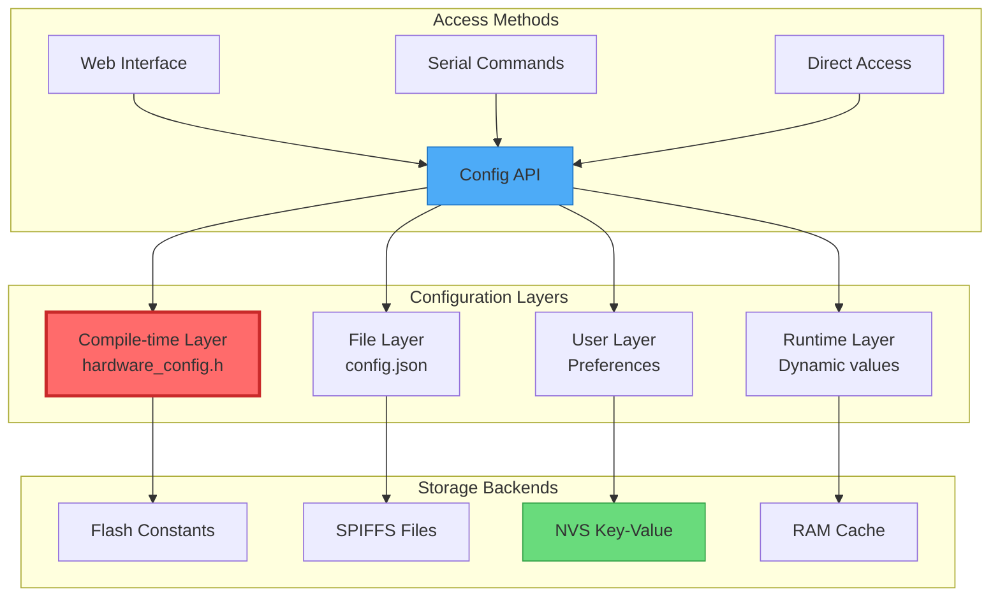
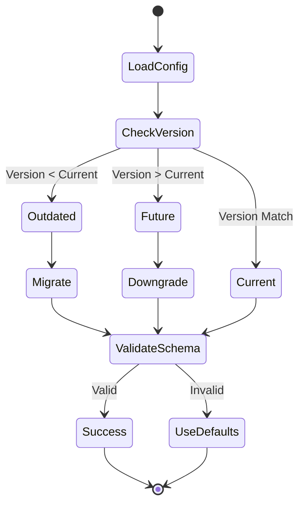

# ⚙️ Document 09: Configuration & Settings Persistence

<div align="center">

```
╔═══════════════════════════════════════════════════════════════════════════════╗
║                    CONFIGURATION & SETTINGS PERSISTENCE                        ║
║                     Hierarchical Configuration Management                      ║
║              Compile-time • Runtime • SPIFFS • NVS • Version Control          ║
╚═══════════════════════════════════════════════════════════════════════════════╝
```

**Storage Types:** 4 | **Config Layers:** 3 | **Migration:** Automatic | **Validation:** Schema-based

</div>

---

## 📋 Executive Summary

LightwaveOS implements a sophisticated multi-layered configuration system that seamlessly blends compile-time optimization with runtime flexibility. This document details the hierarchical configuration architecture, persistent storage strategies, version migration systems, and validation frameworks that enable both performance and adaptability.

### 🎯 Configuration Philosophy
- **Hierarchical Override**: Compile → File → Runtime → User preferences
- **Type Safety**: Strongly typed configuration with validation
- **Version Resilience**: Automatic migration between schema versions
- **Performance First**: Zero-cost abstractions for compile-time configs
- **User Friendly**: Web-based configuration with instant preview

---

## 🏗️ Configuration Architecture

### Multi-Layer Configuration Hierarchy



### Configuration Priority System

```
╔════════════════════════════════════════════════════════════════════════╗
║                     CONFIGURATION PRIORITY ORDER                        ║
╠════════════════════════════════════════════════════════════════════════╣
║ Priority │ Layer         │ Storage    │ Use Case                      ║
├──────────┼───────────────┼────────────┼────────────────────────────────┤
║ 1 (High) │ User Override │ NVS        │ User preferences              ║
║ 2        │ Runtime       │ RAM        │ Temporary adjustments         ║
║ 3        │ File Config   │ SPIFFS     │ System defaults               ║
║ 4 (Low)  │ Compile-time  │ Flash      │ Hardware constants            ║
╚══════════╧═══════════════╧════════════╧═════════════════════════════════╝
```

---

## 📁 Compile-Time Configuration

### Hardware Configuration (hardware_config.h)

```cpp
namespace HardwareConfig {
    // LED Strip Configuration
    constexpr uint16_t STRIP_LENGTH = 160;
    constexpr uint16_t NUM_STRIPS = 2;
    constexpr uint16_t NUM_LEDS = STRIP_LENGTH * NUM_STRIPS;
    constexpr uint8_t STRIP_1_PIN = 11;
    constexpr uint8_t STRIP_2_PIN = 12;
    constexpr uint8_t STRIP_CENTER_POINT = 79;
    
    // Performance Targets
    constexpr uint16_t TARGET_FPS = 120;
    constexpr uint32_t FRAME_TIME_US = 1000000 / TARGET_FPS;
    constexpr uint16_t MAX_BRIGHTNESS = 255;
    constexpr uint16_t DEFAULT_BRIGHTNESS = 128;
    
    // I2C Configuration
    constexpr uint8_t I2C_PRIMARY_SDA = 9;
    constexpr uint8_t I2C_PRIMARY_SCL = 8;
    constexpr uint8_t I2C_SECONDARY_SDA = 21;
    constexpr uint8_t I2C_SECONDARY_SCL = 20;
    constexpr uint32_t I2C_FREQUENCY = 400000;
    
    // Memory Allocation
    constexpr size_t EFFECT_BUFFER_SIZE = 4096;
    constexpr size_t TRANSITION_BUFFER_COUNT = 3;
    constexpr size_t MAX_PRESET_SIZE = 256;
    
    // Feature Flags
    #define FEATURE_ENCODER_SUPPORT 1
    #define FEATURE_WEB_INTERFACE 1
    #define FEATURE_PRESETS 1
    #define FEATURE_TRANSITIONS 1
    #define FEATURE_DEBUG_MODE 0
}
```

### Feature Configuration (features.h)

```cpp
// Feature toggle macros with validation
#ifndef FEATURE_WEB_INTERFACE
    #define FEATURE_WEB_INTERFACE 1
#endif

#if FEATURE_WEB_INTERFACE
    #ifndef FEATURE_WEBSOCKET
        #define FEATURE_WEBSOCKET 1
    #endif
    
    #ifndef FEATURE_OTA_UPDATE
        #define FEATURE_OTA_UPDATE 1
    #endif
#endif

// Conditional compilation helpers
#define IF_FEATURE(feature, code) \
    #if FEATURE_##feature \
        code \
    #endif

// Feature dependencies
static_assert(!FEATURE_OTA_UPDATE || FEATURE_WEB_INTERFACE,
              "OTA updates require web interface");

static_assert(!FEATURE_PRESETS || FEATURE_SPIFFS,
              "Presets require SPIFFS storage");
```

---

## 🗄️ Runtime Configuration System

### Configuration Manager

```cpp
class ConfigurationManager {
public:
    // Configuration schema version
    static constexpr uint32_t SCHEMA_VERSION = 3;
    
    // Configuration structure
    struct SystemConfig {
        // System Settings
        struct {
            char deviceName[32];
            uint8_t logLevel;
            bool serialEnabled;
            bool webEnabled;
            uint32_t uptimeSeconds;
        } system;
        
        // Network Settings
        struct {
            char ssid[32];
            char password[64];
            bool staticIP;
            uint32_t ip;
            uint32_t gateway;
            uint32_t subnet;
            uint16_t webPort;
            uint16_t wsPort;
            bool mdnsEnabled;
            char mdnsName[32];
        } network;
        
        // LED Settings
        struct {
            uint8_t brightness;
            uint8_t maxBrightness;
            uint8_t colorCorrection[3];
            uint8_t colorTemperature;
            SyncMode syncMode;
            PropagationMode propagationMode;
            bool gammaCorrection;
            float gammaCurve;
        } led;
        
        // Effect Settings
        struct {
            uint8_t defaultEffect;
            uint8_t defaultPalette;
            uint8_t defaultSpeed;
            bool randomEffects;
            uint32_t randomInterval;
            bool useOptimized;
            bool smoothTransitions;
            uint16_t transitionTime;
        } effects;
        
        // Performance Settings
        struct {
            uint16_t targetFPS;
            bool adaptiveFPS;
            uint8_t cpuFrequency;
            bool powerSaving;
            uint32_t sleepTimeout;
        } performance;
        
        // Schema version for migration
        uint32_t schemaVersion;
        uint32_t checksum;
    };
    
private:
    SystemConfig config;
    SystemConfig defaults;
    bool configLoaded = false;
    SemaphoreHandle_t configMutex;
    
public:
    bool begin() {
        configMutex = xSemaphoreCreateMutex();
        
        // Load defaults
        loadDefaults();
        
        // Try to load from storage
        if (!loadFromStorage()) {
            // Use defaults and save
            config = defaults;
            saveToStorage();
        }
        
        // Validate configuration
        if (!validateConfig()) {
            Serial.println("[CONFIG] Validation failed, using defaults");
            config = defaults;
        }
        
        configLoaded = true;
        return true;
    }
    
    template<typename T>
    T get(const String& path) {
        xSemaphoreTake(configMutex, portMAX_DELAY);
        T value = getValueByPath<T>(path);
        xSemaphoreGive(configMutex);
        return value;
    }
    
    template<typename T>
    bool set(const String& path, T value) {
        xSemaphoreTake(configMutex, portMAX_DELAY);
        
        bool success = setValueByPath(path, value);
        
        if (success) {
            updateChecksum();
            scheduleAutoSave();
        }
        
        xSemaphoreGive(configMutex);
        return success;
    }
};
```

### Dynamic Configuration Access

```cpp
// Type-safe configuration accessors
#define CONFIG_GET(path, type) \
    ConfigurationManager::getInstance().get<type>(#path)

#define CONFIG_SET(path, value) \
    ConfigurationManager::getInstance().set(#path, value)

// Usage examples
uint8_t brightness = CONFIG_GET(led.brightness, uint8_t);
CONFIG_SET(led.brightness, 200);

// Nested path access
String deviceName = CONFIG_GET(system.deviceName, String);
bool transitions = CONFIG_GET(effects.smoothTransitions, bool);
```

---

## 💾 Persistent Storage

### SPIFFS Configuration Storage

```cpp
class SPIFFSConfigStorage {
    static const char* CONFIG_FILE = "/config.json";
    static const char* BACKUP_FILE = "/config.bak";
    static const size_t MAX_FILE_SIZE = 8192;
    
    bool saveConfig(const SystemConfig& config) {
        // Create JSON document
        DynamicJsonDocument doc(4096);
        
        // Serialize configuration
        JsonObject root = doc.to<JsonObject>();
        serializeConfig(config, root);
        
        // Write to temporary file first
        File tempFile = SPIFFS.open("/config.tmp", "w");
        if (!tempFile) {
            return false;
        }
        
        // Pretty print for readability
        size_t written = serializeJsonPretty(doc, tempFile);
        tempFile.close();
        
        if (written == 0) {
            SPIFFS.remove("/config.tmp");
            return false;
        }
        
        // Backup current config
        if (SPIFFS.exists(CONFIG_FILE)) {
            SPIFFS.rename(CONFIG_FILE, BACKUP_FILE);
        }
        
        // Move temp to active
        SPIFFS.rename("/config.tmp", CONFIG_FILE);
        
        Serial.printf("[CONFIG] Saved %d bytes to SPIFFS\n", written);
        return true;
    }
    
    bool loadConfig(SystemConfig& config) {
        // Try primary file
        if (!loadFromFile(CONFIG_FILE, config)) {
            // Try backup
            Serial.println("[CONFIG] Primary config failed, trying backup");
            if (!loadFromFile(BACKUP_FILE, config)) {
                return false;
            }
        }
        
        return true;
    }
    
private:
    void serializeConfig(const SystemConfig& config, JsonObject& root) {
        // System settings
        JsonObject system = root.createNestedObject("system");
        system["deviceName"] = config.system.deviceName;
        system["logLevel"] = config.system.logLevel;
        system["serialEnabled"] = config.system.serialEnabled;
        system["webEnabled"] = config.system.webEnabled;
        
        // Network settings
        JsonObject network = root.createNestedObject("network");
        network["webPort"] = config.network.webPort;
        network["wsPort"] = config.network.wsPort;
        network["mdnsEnabled"] = config.network.mdnsEnabled;
        network["mdnsName"] = config.network.mdnsName;
        
        // LED settings
        JsonObject led = root.createNestedObject("led");
        led["brightness"] = config.led.brightness;
        led["maxBrightness"] = config.led.maxBrightness;
        led["syncMode"] = config.led.syncMode;
        led["propagationMode"] = config.led.propagationMode;
        
        // Effect settings
        JsonObject effects = root.createNestedObject("effects");
        effects["defaultEffect"] = config.effects.defaultEffect;
        effects["defaultPalette"] = config.effects.defaultPalette;
        effects["randomEffects"] = config.effects.randomEffects;
        effects["smoothTransitions"] = config.effects.smoothTransitions;
        
        // Schema version
        root["schemaVersion"] = config.schemaVersion;
    }
};
```

### NVS User Preferences

```cpp
class NVSPreferences {
    static const char* NAMESPACE = "lightwave";
    
    struct PreferenceKey {
        const char* key;
        PreferenceType type;
        size_t maxSize;
        bool encrypted;
    };
    
    static const PreferenceKey keys[] = {
        {"brightness", PREF_UINT8, 1, false},
        {"effect", PREF_UINT8, 1, false},
        {"palette", PREF_UINT8, 1, false},
        {"wifi_ssid", PREF_STRING, 32, false},
        {"wifi_pass", PREF_STRING, 64, true},
        {"api_key", PREF_BLOB, 32, true}
    };
    
    bool savePreference(const char* key, const void* value, size_t len) {
        nvs_handle_t handle;
        esp_err_t err = nvs_open(NAMESPACE, NVS_READWRITE, &handle);
        
        if (err != ESP_OK) {
            return false;
        }
        
        // Find key info
        const PreferenceKey* keyInfo = findKey(key);
        if (!keyInfo) {
            nvs_close(handle);
            return false;
        }
        
        // Encrypt if needed
        uint8_t buffer[256];
        const void* dataToSave = value;
        size_t sizeToSave = len;
        
        if (keyInfo->encrypted) {
            if (!encryptData(value, len, buffer, &sizeToSave)) {
                nvs_close(handle);
                return false;
            }
            dataToSave = buffer;
        }
        
        // Save based on type
        switch (keyInfo->type) {
            case PREF_UINT8:
                err = nvs_set_u8(handle, key, *(uint8_t*)dataToSave);
                break;
            case PREF_STRING:
                err = nvs_set_str(handle, key, (const char*)dataToSave);
                break;
            case PREF_BLOB:
                err = nvs_set_blob(handle, key, dataToSave, sizeToSave);
                break;
        }
        
        if (err == ESP_OK) {
            err = nvs_commit(handle);
        }
        
        nvs_close(handle);
        return err == ESP_OK;
    }
};
```

---

## 🔄 Configuration Migration

### Schema Migration System



### Migration Implementation

```cpp
class ConfigMigration {
    typedef std::function<bool(JsonObject&)> MigrationFunction;
    
    struct Migration {
        uint32_t fromVersion;
        uint32_t toVersion;
        MigrationFunction migrate;
        const char* description;
    };
    
    static const Migration migrations[] = {
        {1, 2, migrateV1toV2, "Add performance settings"},
        {2, 3, migrateV2toV3, "Restructure LED configuration"},
        {3, 4, migrateV3toV4, "Add security settings"}
    };
    
    bool migrateConfig(JsonObject& config) {
        uint32_t currentVersion = config["schemaVersion"] | 1;
        uint32_t targetVersion = ConfigurationManager::SCHEMA_VERSION;
        
        if (currentVersion == targetVersion) {
            return true; // No migration needed
        }
        
        Serial.printf("[MIGRATE] Migrating config from v%d to v%d\n",
                     currentVersion, targetVersion);
        
        // Find migration path
        while (currentVersion < targetVersion) {
            bool migrated = false;
            
            for (const auto& migration : migrations) {
                if (migration.fromVersion == currentVersion) {
                    Serial.printf("[MIGRATE] Applying: %s\n", 
                                 migration.description);
                    
                    if (migration.migrate(config)) {
                        currentVersion = migration.toVersion;
                        config["schemaVersion"] = currentVersion;
                        migrated = true;
                        break;
                    } else {
                        Serial.println("[MIGRATE] Migration failed!");
                        return false;
                    }
                }
            }
            
            if (!migrated) {
                Serial.println("[MIGRATE] No migration path found!");
                return false;
            }
        }
        
        return true;
    }
    
    static bool migrateV1toV2(JsonObject& config) {
        // Add performance section
        if (!config.containsKey("performance")) {
            JsonObject perf = config.createNestedObject("performance");
            perf["targetFPS"] = 120;
            perf["adaptiveFPS"] = true;
            perf["cpuFrequency"] = 240;
        }
        return true;
    }
    
    static bool migrateV2toV3(JsonObject& config) {
        // Restructure LED settings
        if (config.containsKey("brightness")) {
            JsonObject led = config.createNestedObject("led");
            led["brightness"] = config["brightness"];
            led["maxBrightness"] = 255;
            config.remove("brightness");
        }
        return true;
    }
};
```

---

## ✅ Configuration Validation

### Schema Validation

```cpp
class ConfigValidator {
    struct ValidationRule {
        const char* path;
        std::function<bool(const JsonVariant&)> validate;
        const char* errorMessage;
    };
    
    static const ValidationRule rules[] = {
        {"led.brightness", [](const JsonVariant& v) {
            return v.is<int>() && v >= 0 && v <= 255;
        }, "Brightness must be 0-255"},
        
        {"led.syncMode", [](const JsonVariant& v) {
            return v.is<int>() && v >= 0 && v <= 3;
        }, "Invalid sync mode"},
        
        {"network.webPort", [](const JsonVariant& v) {
            return v.is<int>() && v >= 1 && v <= 65535;
        }, "Invalid web port"},
        
        {"system.deviceName", [](const JsonVariant& v) {
            if (!v.is<const char*>()) return false;
            size_t len = strlen(v.as<const char*>());
            return len > 0 && len < 32;
        }, "Device name must be 1-31 characters"}
    };
    
    bool validateConfig(const JsonObject& config) {
        std::vector<String> errors;
        
        for (const auto& rule : rules) {
            JsonVariant value = getValueByPath(config, rule.path);
            
            if (!rule.validate(value)) {
                errors.push_back(String(rule.path) + ": " + rule.errorMessage);
            }
        }
        
        if (!errors.empty()) {
            Serial.println("[VALIDATE] Configuration errors found:");
            for (const auto& error : errors) {
                Serial.printf("  - %s\n", error.c_str());
            }
            return false;
        }
        
        return true;
    }
    
    JsonVariant getValueByPath(const JsonObject& obj, const char* path) {
        JsonVariant current = obj;
        char pathCopy[64];
        strncpy(pathCopy, path, sizeof(pathCopy));
        
        char* token = strtok(pathCopy, ".");
        while (token && current) {
            current = current[token];
            token = strtok(nullptr, ".");
        }
        
        return current;
    }
};
```

### Runtime Validation

```
╔════════════════════════════════════════════════════════════════════════╗
║                    CONFIGURATION VALIDATION RULES                       ║
╠════════════════════════════════════════════════════════════════════════╣
║ Category        │ Validation Checks                                    ║
├─────────────────┼─────────────────────────────────────────────────────┤
║ Type Safety     │ • Correct data types for all fields                ║
║                 │ • String length limits                              ║
║                 │ • Numeric range validation                          ║
├─────────────────┼─────────────────────────────────────────────────────┤
║ Consistency     │ • No conflicting settings                           ║
║                 │ • Dependencies satisfied                            ║
║                 │ • Feature flag alignment                            ║
├─────────────────┼─────────────────────────────────────────────────────┤
║ Security        │ • No plaintext passwords                            ║
║                 │ • Valid encryption keys                             ║
║                 │ • Safe network settings                             ║
├─────────────────┼─────────────────────────────────────────────────────┤
║ Performance     │ • Realistic FPS targets                             ║
║                 │ • Memory limits respected                           ║
║                 │ • CPU frequency valid                               ║
╚═════════════════╧══════════════════════════════════════════════════════╝
```

---

## 🌐 Web Configuration Interface

### Configuration API

```cpp
class ConfigWebAPI {
    void setupEndpoints(AsyncWebServer* server) {
        // Get configuration
        server->on("/api/config", HTTP_GET, [this](AsyncWebServerRequest* request) {
            String response;
            serializeConfig(response);
            request->send(200, "application/json", response);
        });
        
        // Update configuration
        server->on("/api/config", HTTP_POST, 
            [](AsyncWebServerRequest* request) {},
            nullptr,
            [this](AsyncWebServerRequest* request, uint8_t* data, size_t len, size_t index, size_t total) {
                handleConfigUpdate(request, data, len, index, total);
            }
        );
        
        // Get specific value
        server->on("/api/config/*", HTTP_GET, [this](AsyncWebServerRequest* request) {
            String path = request->url().substring(12); // Remove "/api/config/"
            handleGetValue(request, path);
        });
        
        // Reset to defaults
        server->on("/api/config/reset", HTTP_POST, [this](AsyncWebServerRequest* request) {
            if (resetToDefaults()) {
                request->send(200, "application/json", "{\"status\":\"success\"}");
            } else {
                request->send(500, "application/json", "{\"status\":\"error\"}");
            }
        });
        
        // Export configuration
        server->on("/api/config/export", HTTP_GET, [this](AsyncWebServerRequest* request) {
            AsyncWebServerResponse* response = request->beginResponse(
                SPIFFS, "/config.json", "application/json", true);
            response->addHeader("Content-Disposition", "attachment; filename=\"lightwave-config.json\"");
            request->send(response);
        });
        
        // Import configuration
        server->on("/api/config/import", HTTP_POST,
            [](AsyncWebServerRequest* request) {},
            [this](AsyncWebServerRequest* request, String filename, size_t index, uint8_t* data, size_t len, bool final) {
                handleConfigImport(request, filename, index, data, len, final);
            }
        );
    }
    
    void handleConfigUpdate(AsyncWebServerRequest* request, uint8_t* data, size_t len, size_t index, size_t total) {
        static String buffer;
        
        if (index == 0) {
            buffer = "";
        }
        
        buffer += String((char*)data).substring(0, len);
        
        if (index + len == total) {
            // Parse and validate
            DynamicJsonDocument doc(4096);
            DeserializationError error = deserializeJson(doc, buffer);
            
            if (error) {
                request->send(400, "application/json", 
                    "{\"status\":\"error\",\"message\":\"Invalid JSON\"}");
                return;
            }
            
            // Apply changes
            JsonObject root = doc.as<JsonObject>();
            std::vector<String> changes;
            
            for (JsonPair kv : root) {
                if (applyConfigChange(kv.key().c_str(), kv.value())) {
                    changes.push_back(kv.key().c_str());
                }
            }
            
            // Save configuration
            ConfigurationManager::getInstance().save();
            
            // Send response
            DynamicJsonDocument response(1024);
            response["status"] = "success";
            response["changed"] = changes;
            
            String responseStr;
            serializeJson(response, responseStr);
            request->send(200, "application/json", responseStr);
        }
    }
};
```

### Live Configuration Preview

```javascript
// Web interface configuration editor
class ConfigEditor {
    constructor() {
        this.original = {};
        this.modified = {};
        this.ws = new WebSocket(`ws://${window.location.hostname}:81`);
    }
    
    async loadConfig() {
        const response = await fetch('/api/config');
        this.original = await response.json();
        this.modified = JSON.parse(JSON.stringify(this.original));
        this.render();
    }
    
    updateValue(path, value) {
        // Update local copy
        setValueByPath(this.modified, path, value);
        
        // Preview change via WebSocket
        this.ws.send(JSON.stringify({
            cmd: 'preview_config',
            path: path,
            value: value
        }));
        
        // Mark as changed
        this.markChanged(path);
    }
    
    async saveChanges() {
        const changes = this.getChangedValues();
        
        if (changes.length === 0) {
            showToast('No changes to save');
            return;
        }
        
        const response = await fetch('/api/config', {
            method: 'POST',
            headers: {'Content-Type': 'application/json'},
            body: JSON.stringify(changes)
        });
        
        const result = await response.json();
        
        if (result.status === 'success') {
            showToast(`Saved ${result.changed.length} changes`);
            this.original = JSON.parse(JSON.stringify(this.modified));
            this.clearChanged();
        } else {
            showToast('Failed to save changes', 'error');
        }
    }
}
```

---

## 📊 Configuration Monitoring

### Configuration Change Tracking

```cpp
class ConfigChangeTracker {
    struct ChangeEvent {
        uint32_t timestamp;
        String path;
        String oldValue;
        String newValue;
        String source; // "web", "serial", "api", "system"
        IPAddress clientIP;
    };
    
    CircularBuffer<ChangeEvent, 100> changeHistory;
    std::function<void(const ChangeEvent&)> changeCallback;
    
    void trackChange(const String& path, const JsonVariant& oldVal, 
                    const JsonVariant& newVal, const String& source) {
        ChangeEvent event;
        event.timestamp = millis();
        event.path = path;
        event.oldValue = oldVal.as<String>();
        event.newValue = newVal.as<String>();
        event.source = source;
        
        changeHistory.push(event);
        
        // Notify listeners
        if (changeCallback) {
            changeCallback(event);
        }
        
        // Log important changes
        if (isImportantChange(path)) {
            Serial.printf("[CONFIG] Changed %s: %s -> %s (via %s)\n",
                         path.c_str(), event.oldValue.c_str(), 
                         event.newValue.c_str(), source.c_str());
        }
    }
    
    void generateChangeReport() {
        Serial.println(F("\n╔════════════════════════════════════════════════╗"));
        Serial.println(F("║         CONFIGURATION CHANGE HISTORY            ║"));
        Serial.println(F("╠════════════════════════════════════════════════╣"));
        
        int shown = 0;
        for (int i = changeHistory.size() - 1; i >= 0 && shown < 20; i--) {
            const auto& event = changeHistory[i];
            
            char timeStr[20];
            formatTimestamp(event.timestamp, timeStr);
            
            Serial.printf("║ %s │ %-20s │ %s\n",
                         timeStr, event.path.c_str(), event.source.c_str());
            Serial.printf("║           │ %s -> %s\n",
                         event.oldValue.c_str(), event.newValue.c_str());
            shown++;
        }
        
        Serial.println(F("╚════════════════════════════════════════════════╝"));
    }
};
```

---

## 🔒 Configuration Security

### Sensitive Data Protection

```cpp
class SecureConfig {
    // Fields that should never be exposed
    static const char* sensitiveFields[] = {
        "network.password",
        "security.apiKey",
        "security.otaPassword"
    };
    
    JsonObject sanitizeForExport(const JsonObject& config) {
        DynamicJsonDocument sanitized(4096);
        JsonObject root = sanitized.to<JsonObject>();
        
        // Deep copy with sanitization
        copyWithSanitization(config, root);
        
        return root;
    }
    
    void copyWithSanitization(const JsonObject& src, JsonObject& dst, 
                             const String& path = "") {
        for (JsonPair kv : src) {
            String fullPath = path.isEmpty() ? 
                             kv.key().c_str() : 
                             path + "." + kv.key().c_str();
            
            if (isSensitive(fullPath)) {
                // Redact sensitive data
                dst[kv.key()] = "********";
            } else if (kv.value().is<JsonObject>()) {
                // Recurse into objects
                JsonObject child = dst.createNestedObject(kv.key());
                copyWithSanitization(kv.value(), child, fullPath);
            } else {
                // Copy value
                dst[kv.key()] = kv.value();
            }
        }
    }
    
    bool isSensitive(const String& path) {
        for (const auto& field : sensitiveFields) {
            if (path == field) {
                return true;
            }
        }
        return false;
    }
};
```

---

## 🎯 Configuration Best Practices

### Guidelines

```
╔════════════════════════════════════════════════════════════════════════╗
║                   CONFIGURATION BEST PRACTICES                          ║
╠════════════════════════════════════════════════════════════════════════╣
║ 1. Hierarchy Design                                                    ║
║    • Group related settings logically                                  ║
║    • Use consistent naming conventions                                 ║
║    • Limit nesting to 3 levels maximum                                ║
║                                                                        ║
║ 2. Default Values                                                      ║
║    • Always provide sensible defaults                                  ║
║    • Document why defaults were chosen                                 ║
║    • Test with default configuration                                   ║
║                                                                        ║
║ 3. Validation                                                          ║
║    • Validate on load, save, and change                              ║
║    • Provide clear error messages                                     ║
║    • Never trust external input                                       ║
║                                                                        ║
║ 4. Migration                                                           ║
║    • Always increment schema version                                   ║
║    • Test migration paths thoroughly                                   ║
║    • Keep migration code forever                                       ║
║                                                                        ║
║ 5. Performance                                                         ║
║    • Cache frequently accessed values                                  ║
║    • Batch configuration changes                                       ║
║    • Use compile-time config when possible                            ║
╚════════════════════════════════════════════════════════════════════════╝
```

---

<div align="center">

**"Configuration is code—treat it with respect"**

*Flexible today, maintainable tomorrow*

</div>