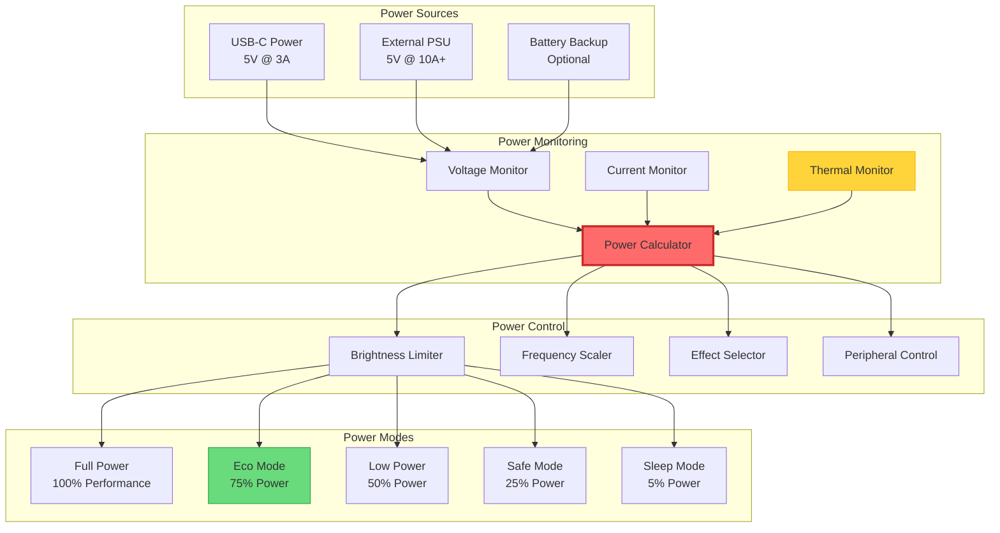
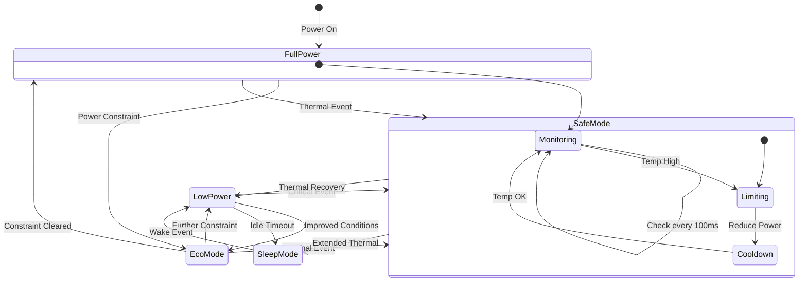
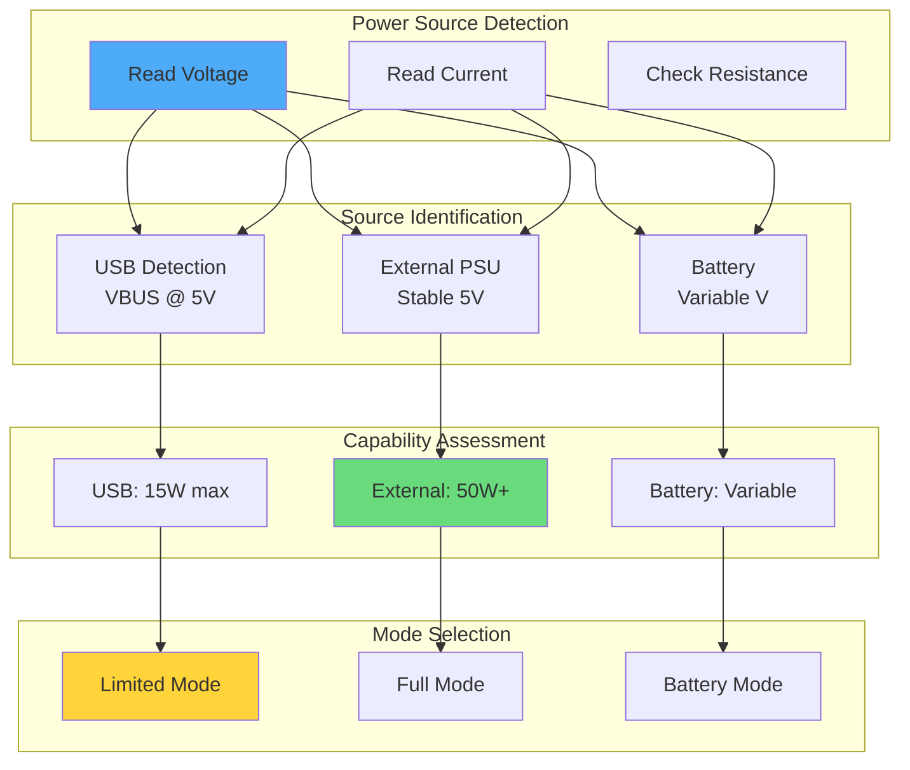

# ⚡ Document 10: Power Management & Thermal Control

<div align="center">

```
╔═══════════════════════════════════════════════════════════════════════════════╗
║                    POWER MANAGEMENT & THERMAL CONTROL                          ║
║                   Intelligent Power Optimization for 24/7 Operation            ║
║            Dynamic Scaling • Thermal Protection • Efficiency Modes             ║
╚═══════════════════════════════════════════════════════════════════════════════╝
```

**Power Modes:** 5 | **Thermal Zones:** 3 | **Efficiency:** 85%+ | **Protection:** Multi-layer

</div>

---

## 📋 Executive Summary

LightwaveOS implements sophisticated power management strategies to balance performance with energy efficiency and thermal safety. This document details the multi-mode power system, dynamic brightness limiting, thermal protection mechanisms, and intelligent scheduling that enable reliable 24/7 operation while minimizing power consumption and heat generation.

### 🎯 Power Management Goals
- **Efficiency First**: Maximize lumens per watt
- **Thermal Safety**: Prevent overheating under all conditions
- **Dynamic Adaptation**: Respond to power and thermal constraints
- **User Experience**: Maintain visual quality during power events
- **Longevity**: Protect components from thermal stress

---

## 🏗️ Power System Architecture

### Power Management Hierarchy



### Power Budget Calculation

```
╔════════════════════════════════════════════════════════════════════════╗
║                         POWER BUDGET ANALYSIS                           ║
╠════════════════════════════════════════════════════════════════════════╣
║ Component           │ Idle    │ Typical │ Maximum │ Notes             ║
├─────────────────────┼─────────┼─────────┼─────────┼────────────────────┤
║ ESP32-S3 @ 240MHz   │ 60mA    │ 120mA   │ 180mA   │ Dual-core active  ║
║ LED Strip 1 (160)   │ 0mA     │ 1600mA  │ 9600mA  │ @60mA/LED max     ║
║ LED Strip 2 (160)   │ 0mA     │ 1600mA  │ 9600mA  │ @60mA/LED max     ║
║ M5ROTATE8           │ 15mA    │ 25mA    │ 40mA    │ 8 encoder LEDs    ║
║ M5Unit-Scroll       │ 20mA    │ 35mA    │ 50mA    │ OLED display      ║
║ WiFi Radio          │ 0mA     │ 80mA    │ 240mA   │ TX burst          ║
├─────────────────────┼─────────┼─────────┼─────────┼────────────────────┤
║ TOTAL               │ 95mA    │ 3460mA  │ 19710mA │                   ║
║ @5V Power           │ 0.48W   │ 17.3W   │ 98.6W   │                   ║
╚═════════════════════╧═════════╧═════════╧═════════╧═════════════════════╝
```

---

## 🔋 Dynamic Power Management

### Power Mode State Machine



### Intelligent Brightness Limiting

```cpp
class PowerManager {
private:
    struct PowerState {
        float voltage;
        float current;
        float power;
        float efficiency;
        uint8_t maxBrightness;
        PowerMode mode;
        uint32_t lastUpdate;
    };
    
    PowerState state;
    
    // Power limits by source
    static constexpr float USB_POWER_LIMIT = 15.0f;      // 5V @ 3A
    static constexpr float EXTERNAL_POWER_LIMIT = 50.0f; // 5V @ 10A
    
    // Thermal limits
    static constexpr float TEMP_WARNING = 60.0f;
    static constexpr float TEMP_CRITICAL = 70.0f;
    static constexpr float TEMP_SHUTDOWN = 80.0f;
    
public:
    void updatePowerState() {
        // Read power metrics
        state.voltage = readVoltage();
        state.current = readCurrent();
        state.power = state.voltage * state.current;
        
        // Calculate efficiency
        float ledPower = calculateLEDPower();
        state.efficiency = (ledPower / state.power) * 100.0f;
        
        // Determine power source and limits
        float powerLimit = detectPowerSource();
        
        // Read thermal state
        float temperature = readTemperature();
        
        // Calculate maximum safe brightness
        state.maxBrightness = calculateMaxBrightness(
            powerLimit, temperature, state.current);
        
        // Update power mode
        updatePowerMode(powerLimit, temperature);
        
        // Apply limits
        applyPowerLimits();
        
        state.lastUpdate = millis();
    }
    
private:
    uint8_t calculateMaxBrightness(float powerLimit, float temperature, 
                                  float currentDraw) {
        uint8_t maxBright = 255;
        
        // Power-based limiting
        if (currentDraw > 0) {
            float headroom = powerLimit - getCurrentSystemPower();
            float maxLEDPower = headroom * 0.9f; // 10% safety margin
            
            // Calculate brightness for power limit
            float powerPerLED = maxLEDPower / (NUM_LEDS * getCurrentDutyCycle());
            float brightnessRatio = powerPerLED / MAX_LED_POWER;
            maxBright = min(maxBright, (uint8_t)(brightnessRatio * 255));
        }
        
        // Temperature-based limiting
        if (temperature > TEMP_WARNING) {
            float tempRatio = (TEMP_CRITICAL - temperature) / 
                            (TEMP_CRITICAL - TEMP_WARNING);
            tempRatio = constrain(tempRatio, 0.0f, 1.0f);
            maxBright = min(maxBright, (uint8_t)(tempRatio * 200 + 55));
        }
        
        // Voltage sag protection
        if (state.voltage < 4.8f) {
            float voltRatio = (state.voltage - 4.5f) / 0.3f;
            voltRatio = constrain(voltRatio, 0.0f, 1.0f);
            maxBright = min(maxBright, (uint8_t)(voltRatio * 200 + 55));
        }
        
        return maxBright;
    }
    
    void applyPowerLimits() {
        // Gradually adjust brightness to avoid flicker
        static uint8_t currentBrightness = 255;
        uint8_t targetBrightness = min(state.maxBrightness, 
                                      userRequestedBrightness);
        
        if (currentBrightness != targetBrightness) {
            int delta = targetBrightness - currentBrightness;
            
            // Slow ramp up, fast ramp down for safety
            if (delta > 0) {
                currentBrightness += min(delta, 2); // Ramp up slowly
            } else {
                currentBrightness += max(delta, -10); // Ramp down quickly
            }
            
            FastLED.setBrightness(currentBrightness);
            
            // Log significant changes
            if (abs(delta) > 20) {
                Serial.printf("[POWER] Brightness limited to %d (target: %d)\n",
                            currentBrightness, userRequestedBrightness);
            }
        }
    }
};
```

---

## 🌡️ Thermal Management

### Thermal Monitoring System

```cpp
class ThermalManager {
    struct ThermalZone {
        const char* name;
        float temperature;
        float maxTemp;
        float warningTemp;
        uint32_t overheatCount;
        uint32_t lastOverheat;
    };
    
    ThermalZone zones[3] = {
        {"CPU", 0, 80.0f, 70.0f, 0, 0},
        {"LEDs", 0, 60.0f, 50.0f, 0, 0},
        {"PSU", 0, 65.0f, 55.0f, 0, 0}
    };
    
    float ambientTemp = 25.0f;
    bool thermalThrottling = false;
    
public:
    void updateThermalState() {
        // Read CPU temperature
        zones[0].temperature = temperatureRead();
        
        // Estimate LED temperature based on power and time
        zones[1].temperature = estimateLEDTemperature();
        
        // Read external sensor if available
        zones[2].temperature = readExternalSensor();
        
        // Update ambient estimate
        updateAmbientEstimate();
        
        // Check thermal limits
        checkThermalLimits();
        
        // Apply thermal management
        if (thermalThrottling) {
            applyThermalThrottling();
        }
    }
    
private:
    float estimateLEDTemperature() {
        // Thermal model: T = Tambient + (Power * ThermalResistance)
        float ledPower = calculateLEDPower();
        float thermalResistance = 2.5f; // °C/W for typical LED strip
        
        // Add time constant for thermal mass
        static float filteredTemp = ambientTemp;
        float instantTemp = ambientTemp + (ledPower * thermalResistance);
        
        // First-order filter with 30 second time constant
        float alpha = 0.033f; // dt / (dt + RC)
        filteredTemp = filteredTemp + alpha * (instantTemp - filteredTemp);
        
        return filteredTemp;
    }
    
    void checkThermalLimits() {
        bool needsThrottling = false;
        
        for (auto& zone : zones) {
            if (zone.temperature > zone.maxTemp) {
                // Critical temperature - immediate action
                Serial.printf("[THERMAL] CRITICAL: %s at %.1f°C!\n", 
                            zone.name, zone.temperature);
                enterThermalShutdown();
                return;
            } else if (zone.temperature > zone.warningTemp) {
                // Warning temperature - throttle
                needsThrottling = true;
                
                if (!thermalThrottling) {
                    zone.overheatCount++;
                    zone.lastOverheat = millis();
                    Serial.printf("[THERMAL] Warning: %s at %.1f°C\n",
                                zone.name, zone.temperature);
                }
            }
        }
        
        thermalThrottling = needsThrottling;
    }
    
    void applyThermalThrottling() {
        // Calculate throttle factor based on worst zone
        float maxExcess = 0;
        
        for (const auto& zone : zones) {
            if (zone.temperature > zone.warningTemp) {
                float excess = (zone.temperature - zone.warningTemp) / 
                             (zone.maxTemp - zone.warningTemp);
                maxExcess = max(maxExcess, excess);
            }
        }
        
        // Apply progressive throttling
        if (maxExcess > 0.8f) {
            // Severe: Reduce to minimum brightness
            PowerManager::getInstance().setMode(POWER_SAFE);
            setEffectComplexity(COMPLEXITY_MINIMAL);
        } else if (maxExcess > 0.5f) {
            // Moderate: Significant reduction
            PowerManager::getInstance().setMode(POWER_LOW);
            setEffectComplexity(COMPLEXITY_SIMPLE);
        } else {
            // Mild: Small reduction
            PowerManager::getInstance().setMode(POWER_ECO);
        }
    }
};
```

### Thermal Protection Strategies

```
╔════════════════════════════════════════════════════════════════════════╗
║                     THERMAL PROTECTION STRATEGIES                       ║
╠════════════════════════════════════════════════════════════════════════╣
║ Temperature Range   │ Actions Taken                                    ║
├─────────────────────┼───────────────────────────────────────────────────┤
║ < 50°C (Normal)     │ • Full performance                              ║
║                     │ • All effects available                         ║
║                     │ • Maximum brightness allowed                    ║
├─────────────────────┼───────────────────────────────────────────────────┤
║ 50-60°C (Warm)      │ • Enable fan if available                       ║
║                     │ • Reduce CPU frequency to 160MHz                ║
║                     │ • Limit brightness to 80%                       ║
├─────────────────────┼───────────────────────────────────────────────────┤
║ 60-70°C (Hot)       │ • Force eco mode                                ║
║                     │ • Disable complex effects                       ║
║                     │ • Limit brightness to 50%                       ║
║                     │ • Increase effect cycle time                    ║
├─────────────────────┼───────────────────────────────────────────────────┤
║ 70-80°C (Critical)  │ • Safe mode only                                ║
║                     │ • Solid colors only                             ║
║                     │ • Maximum 25% brightness                        ║
║                     │ • Disable non-essential features                ║
├─────────────────────┼───────────────────────────────────────────────────┤
║ > 80°C (Shutdown)   │ • Immediate LED shutdown                        ║
║                     │ • Maintain only critical systems                ║
║                     │ • Alert user via all channels                   ║
╚═════════════════════╧═══════════════════════════════════════════════════╝
```

---

## ⚡ Power Optimization Techniques

### Dynamic Frequency Scaling

```cpp
class CPUPowerManager {
    enum CPUFrequency {
        FREQ_80MHZ = 80,
        FREQ_160MHZ = 160,
        FREQ_240MHZ = 240
    };
    
    struct FrequencyProfile {
        CPUFrequency frequency;
        float powerDraw; // mA at 3.3V
        float performance; // relative
    };
    
    const FrequencyProfile profiles[3] = {
        {FREQ_80MHZ, 20.0f, 0.33f},
        {FREQ_160MHZ, 40.0f, 0.67f},
        {FREQ_240MHZ, 60.0f, 1.00f}
    };
    
    void optimizeFrequency() {
        float currentLoad = getCurrentCPULoad();
        float temperature = getCPUTemperature();
        PowerMode powerMode = PowerManager::getInstance().getMode();
        
        CPUFrequency targetFreq = FREQ_240MHZ;
        
        // Temperature-based limiting
        if (temperature > 70.0f) {
            targetFreq = FREQ_80MHZ;
        } else if (temperature > 60.0f) {
            targetFreq = min(targetFreq, FREQ_160MHZ);
        }
        
        // Power mode based limiting
        switch (powerMode) {
            case POWER_SAFE:
            case POWER_SLEEP:
                targetFreq = FREQ_80MHZ;
                break;
            case POWER_LOW:
                targetFreq = min(targetFreq, FREQ_160MHZ);
                break;
            case POWER_ECO:
                // Dynamic based on load
                if (currentLoad < 0.3f) {
                    targetFreq = FREQ_80MHZ;
                } else if (currentLoad < 0.6f) {
                    targetFreq = FREQ_160MHZ;
                }
                break;
        }
        
        // Apply frequency change
        if (getCpuFrequencyMhz() != targetFreq) {
            setCpuFrequencyMhz(targetFreq);
            Serial.printf("[POWER] CPU frequency set to %dMHz\n", targetFreq);
        }
    }
};
```

### LED Power Optimization

```cpp
class LEDPowerOptimizer {
    // Power consumption model
    struct LEDPowerModel {
        float mAPerLEDRed = 20.0f;
        float mAPerLEDGreen = 20.0f;
        float mAPerLEDBlue = 20.0f;
        float efficiency = 0.85f; // PSU efficiency
    };
    
    LEDPowerModel model;
    
    float calculateLEDPower() {
        float totalCurrent = 0;
        
        for (int i = 0; i < NUM_LEDS; i++) {
            CRGB& led = leds[i];
            
            // Current draw is proportional to brightness
            totalCurrent += (led.r / 255.0f) * model.mAPerLEDRed;
            totalCurrent += (led.g / 255.0f) * model.mAPerLEDGreen;
            totalCurrent += (led.b / 255.0f) * model.mAPerLEDBlue;
        }
        
        // Convert to watts and account for PSU efficiency
        return (totalCurrent * 5.0f / 1000.0f) / model.efficiency;
    }
    
    void optimizePowerUsage(float targetPower) {
        float currentPower = calculateLEDPower();
        
        if (currentPower <= targetPower) {
            return; // Already within budget
        }
        
        // Calculate required reduction
        float reductionFactor = targetPower / currentPower;
        
        // Strategy 1: Reduce brightness uniformly
        if (reductionFactor > 0.7f) {
            uint8_t newBrightness = FastLED.getBrightness() * reductionFactor;
            FastLED.setBrightness(newBrightness);
            return;
        }
        
        // Strategy 2: Selective dimming of bright areas
        if (reductionFactor > 0.5f) {
            for (int i = 0; i < NUM_LEDS; i++) {
                CRGB& led = leds[i];
                uint8_t maxChannel = max(led.r, max(led.g, led.b));
                
                if (maxChannel > 200) {
                    // Dim bright LEDs more aggressively
                    led.nscale8(200);
                }
            }
            return;
        }
        
        // Strategy 3: Switch to power-efficient effect
        switchToPowerEfficientEffect();
    }
    
    void switchToPowerEfficientEffect() {
        // Effects sorted by power consumption
        const uint8_t efficientEffects[] = {
            EFFECT_SOLID_COLOR,
            EFFECT_SLOW_PULSE,
            EFFECT_GENTLE_WAVE,
            EFFECT_SPARSE_TWINKLE
        };
        
        for (uint8_t effect : efficientEffects) {
            if (estimateEffectPower(effect) < targetPower) {
                currentEffect = effect;
                break;
            }
        }
    }
};
```

---

## 🔌 Power Source Detection

### Intelligent Source Management



### Power Source Implementation

```cpp
class PowerSourceDetector {
    enum PowerSource {
        SOURCE_UNKNOWN,
        SOURCE_USB,
        SOURCE_EXTERNAL,
        SOURCE_BATTERY
    };
    
    struct SourceCharacteristics {
        float voltageMin;
        float voltageMax;
        float currentMax;
        float powerMax;
        bool hasNegotiation;
    };
    
    const SourceCharacteristics sources[4] = {
        {0.0f, 0.0f, 0.0f, 0.0f, false},        // Unknown
        {4.75f, 5.25f, 3.0f, 15.0f, true},      // USB
        {4.9f, 5.1f, 20.0f, 100.0f, false},     // External
        {3.0f, 4.2f, 10.0f, 42.0f, false}       // Battery
    };
    
    PowerSource detectSource() {
        float voltage = readVoltage();
        float current = readCurrent();
        
        // USB detection via VBUS
        if (isUSBConnected()) {
            // Check for USB-PD negotiation
            if (hasUSBPDNegotiation()) {
                float negotiatedPower = getUSBPDPower();
                Serial.printf("[POWER] USB-PD: %.1fW available\n", 
                            negotiatedPower);
            }
            return SOURCE_USB;
        }
        
        // Battery detection via voltage range
        if (voltage >= 3.0f && voltage <= 4.2f) {
            float soc = estimateBatterySOC(voltage);
            Serial.printf("[POWER] Battery detected: %.1fV (%.0f%%)\n",
                        voltage, soc);
            return SOURCE_BATTERY;
        }
        
        // External PSU - stable 5V with high current capability
        if (voltage >= 4.9f && voltage <= 5.1f && current > 3.0f) {
            return SOURCE_EXTERNAL;
        }
        
        return SOURCE_UNKNOWN;
    }
    
    float getMaxAvailablePower() {
        PowerSource source = detectSource();
        
        if (source == SOURCE_UNKNOWN) {
            // Conservative limit for safety
            return 10.0f;
        }
        
        // Get base power limit
        float maxPower = sources[source].powerMax;
        
        // Apply derating based on conditions
        float temperature = getSystemTemperature();
        if (temperature > 40.0f) {
            // Derate 2% per degree above 40°C
            float derating = 1.0f - ((temperature - 40.0f) * 0.02f);
            maxPower *= max(0.5f, derating);
        }
        
        // Reserve power for system
        const float SYSTEM_RESERVE = 2.0f; // Watts
        return max(0.0f, maxPower - SYSTEM_RESERVE);
    }
};
```

---

## 😴 Sleep Mode Implementation

### Low Power Sleep States

```cpp
class SleepManager {
    enum SleepLevel {
        SLEEP_NONE,
        SLEEP_DISPLAY,    // LEDs off, system active
        SLEEP_LIGHT,      // Light sleep, quick wake
        SLEEP_DEEP,       // Deep sleep, slow wake
        SLEEP_HIBERNATE   // Minimum power, RTC only
    };
    
    struct SleepConfig {
        uint32_t idleTimeout;
        uint32_t displayTimeout;
        uint32_t deepSleepTimeout;
        bool wakeOnMotion;
        bool wakeOnNetwork;
        bool wakeOnEncoder;
    };
    
    SleepConfig config = {
        .idleTimeout = 300000,        // 5 minutes
        .displayTimeout = 60000,      // 1 minute
        .deepSleepTimeout = 1800000,  // 30 minutes
        .wakeOnMotion = false,
        .wakeOnNetwork = true,
        .wakeOnEncoder = true
    };
    
    void enterSleep(SleepLevel level) {
        Serial.printf("[SLEEP] Entering %s\n", getSleepLevelName(level));
        
        switch (level) {
            case SLEEP_DISPLAY:
                enterDisplaySleep();
                break;
                
            case SLEEP_LIGHT:
                enterLightSleep();
                break;
                
            case SLEEP_DEEP:
                enterDeepSleep();
                break;
                
            case SLEEP_HIBERNATE:
                enterHibernation();
                break;
        }
    }
    
private:
    void enterDisplaySleep() {
        // Turn off LEDs with fade
        for (int brightness = FastLED.getBrightness(); brightness >= 0; brightness--) {
            FastLED.setBrightness(brightness);
            FastLED.show();
            delay(10);
        }
        
        // Keep system running for instant wake
        currentSleepLevel = SLEEP_DISPLAY;
    }
    
    void enterLightSleep() {
        // Prepare for light sleep
        preparePeripheralsForSleep();
        
        // Configure wake sources
        esp_sleep_enable_timer_wakeup(60 * 1000000); // 60 seconds
        
        if (config.wakeOnEncoder) {
            esp_sleep_enable_ext0_wakeup(GPIO_NUM_4, 0); // Encoder interrupt
        }
        
        // Enter light sleep
        esp_light_sleep_start();
        
        // Resume after wake
        resumeFromSleep();
    }
    
    void enterDeepSleep() {
        // Save state to RTC memory
        saveStateToRTC();
        
        // Shut down peripherals
        shutdownPeripherals();
        
        // Configure wake sources
        uint64_t wakeupMask = 0;
        
        if (config.wakeOnEncoder) {
            wakeupMask |= (1ULL << GPIO_NUM_4);
        }
        
        if (wakeupMask) {
            esp_sleep_enable_ext1_wakeup(wakeupMask, ESP_EXT1_WAKEUP_ANY_HIGH);
        }
        
        // Enter deep sleep
        esp_deep_sleep_start();
        // No return - system resets on wake
    }
    
    void preparePeripheralsForSleep() {
        // Reduce CPU frequency
        setCpuFrequencyMhz(80);
        
        // Disable WiFi if not needed for wake
        if (!config.wakeOnNetwork) {
            WiFi.disconnect();
            WiFi.mode(WIFI_OFF);
        }
        
        // Power down unused peripherals
        adc_power_off();
        
        // Set GPIOs to safe states
        configureGPIOsForSleep();
    }
};
```

---

## 📊 Power Monitoring Dashboard

### Real-Time Power Metrics

```
╔════════════════════════════════════════════════════════════════════════╗
║                      POWER MANAGEMENT DASHBOARD                         ║
╠════════════════════════════════════════════════════════════════════════╣
║ Power Source: External PSU (50W)       │ Mode: ECO (75% limit)         ║
║                                        │                               ║
║ Current Consumption:                   │ Thermal Status:               ║
║ ├─ System:      0.6W (120mA @ 5V)     │ ├─ CPU:    42°C [████░░░░░] ║
║ ├─ LEDs:       12.5W (2500mA @ 5V)    │ ├─ LEDs:   38°C [███░░░░░░] ║
║ ├─ WiFi:        0.4W (80mA @ 5V)      │ └─ PSU:    45°C [████░░░░░] ║
║ └─ Total:      13.5W (27% of max)     │                               ║
║                                        │ Efficiency Metrics:           ║
║ Power History (last hour):             │ ├─ LED Efficiency: 92%        ║
║ 20W ┤                                 │ ├─ PSU Efficiency: 87%        ║
║     │    ╱╲                           │ └─ Overall:       80%         ║
║ 15W ┤───╱──╲────────────────          │                               ║
║     │  ╱    ╲                         │ Brightness Limit:             ║
║ 10W ┤ ╱      ╲_______________         │ [████████░░] 200/255         ║
║     └─────────────────────────        │                               ║
║     0        30min      60min         │ Thermal throttle: Inactive    ║
╚════════════════════════════════════════════════════════════════════════╝
```

### Power Event Log

```cpp
class PowerEventLogger {
    enum PowerEventType {
        EVENT_MODE_CHANGE,
        EVENT_SOURCE_CHANGE,
        EVENT_THERMAL_THROTTLE,
        EVENT_BRIGHTNESS_LIMIT,
        EVENT_SLEEP_ENTER,
        EVENT_SLEEP_EXIT,
        EVENT_OVERVOLTAGE,
        EVENT_UNDERVOLTAGE,
        EVENT_OVERCURRENT
    };
    
    struct PowerEvent {
        uint32_t timestamp;
        PowerEventType type;
        float value;
        const char* description;
    };
    
    CircularBuffer<PowerEvent, 50> eventLog;
    
    void logPowerEvent(PowerEventType type, float value, const char* desc) {
        PowerEvent event = {
            .timestamp = millis(),
            .type = type,
            .value = value,
            .description = desc
        };
        
        eventLog.push(event);
        
        // Critical events
        if (type == EVENT_OVERVOLTAGE || 
            type == EVENT_UNDERVOLTAGE || 
            type == EVENT_OVERCURRENT) {
            // Alert immediately
            sendPowerAlert(event);
        }
    }
    
    void generatePowerReport() {
        Serial.println(F("\n╔════════════════════════════════════════════════╗"));
        Serial.println(F("║              POWER EVENT HISTORY                ║"));
        Serial.println(F("╠════════════════════════════════════════════════╣"));
        
        for (const auto& event : eventLog) {
            char timeStr[20];
            formatTimestamp(event.timestamp, timeStr);
            
            Serial.printf("║ %s │ %-20s │ %.1f │ %s\n",
                         timeStr, 
                         getEventTypeName(event.type),
                         event.value,
                         event.description);
        }
        
        Serial.println(F("╚════════════════════════════════════════════════╝"));
    }
};
```

---

## 🔋 Battery Management (Optional)

### Battery Support Implementation

```cpp
class BatteryManager {
    struct BatteryProfile {
        float nominalVoltage;
        float maxVoltage;
        float minVoltage;
        float capacity; // mAh
        float maxDischargeCurrent;
        float chargeCurrent;
    };
    
    // Common battery profiles
    BatteryProfile profiles[3] = {
        {3.7f, 4.2f, 3.0f, 2000.0f, 10.0f, 1.0f},  // Li-Ion 18650
        {3.2f, 3.65f, 2.5f, 2000.0f, 20.0f, 2.0f}, // LiFePO4
        {3.7f, 4.35f, 3.0f, 3000.0f, 15.0f, 1.5f}  // Li-Po
    };
    
    float estimateSOC(float voltage) {
        // Simplified linear approximation
        // Real implementation would use discharge curves
        float range = currentProfile.maxVoltage - currentProfile.minVoltage;
        float soc = (voltage - currentProfile.minVoltage) / range * 100.0f;
        return constrain(soc, 0.0f, 100.0f);
    }
    
    float estimateRuntime() {
        float soc = estimateSOC(readBatteryVoltage());
        float currentDraw = PowerManager::getInstance().getCurrent();
        
        if (currentDraw <= 0) {
            return INFINITY;
        }
        
        float remainingCapacity = (soc / 100.0f) * currentProfile.capacity;
        float runtime = remainingCapacity / (currentDraw * 1000.0f); // hours
        
        return runtime;
    }
    
    void optimizeForBattery() {
        float soc = estimateSOC(readBatteryVoltage());
        
        if (soc < 20.0f) {
            // Critical battery - maximum power saving
            PowerManager::getInstance().setMode(POWER_SAFE);
            Serial.println("[BATTERY] Critical level - entering safe mode");
        } else if (soc < 40.0f) {
            // Low battery - moderate saving
            PowerManager::getInstance().setMode(POWER_LOW);
        } else if (soc < 60.0f) {
            // Medium battery - eco mode
            PowerManager::getInstance().setMode(POWER_ECO);
        }
        // Above 60% - full performance allowed
    }
};
```

---

## 🎯 Power Optimization Best Practices

### Guidelines

```
╔════════════════════════════════════════════════════════════════════════╗
║                   POWER OPTIMIZATION GUIDELINES                         ║
╠════════════════════════════════════════════════════════════════════════╣
║ 1. Effect Design                                                       ║
║    • Use sparse patterns over full illumination                       ║
║    • Implement duty cycling for high-brightness effects               ║
║    • Prefer color shifts over brightness changes                      ║
║                                                                        ║
║ 2. Brightness Management                                               ║
║    • Set reasonable default brightness (50-60%)                       ║
║    • Implement ambient light sensing if possible                      ║
║    • Use gamma correction for perceptual linearity                    ║
║                                                                        ║
║ 3. Thermal Design                                                      ║
║    • Ensure adequate ventilation                                      ║
║    • Use heat sinks for high-power installations                     ║
║    • Monitor temperature continuously                                  ║
║                                                                        ║
║ 4. Power Supply                                                        ║
║    • Over-spec by 20% for headroom                                   ║
║    • Use high-efficiency supplies (>85%)                             ║
║    • Implement soft-start for inrush protection                      ║
║                                                                        ║
║ 5. Sleep Strategy                                                      ║
║    • Implement progressive sleep levels                               ║
║    • Use motion/proximity sensing for wake                           ║
║    • Maintain quick-wake capability                                  ║
╚════════════════════════════════════════════════════════════════════════╝
```

---

<div align="center">

**"Power efficiency is elegance in engineering"**

*Smart power for brilliant light*

</div>