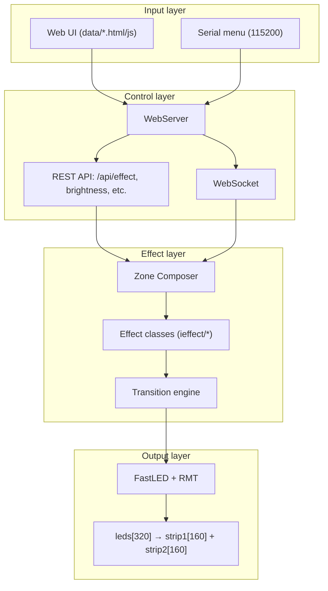

# LightwaveOS Architecture Map

Single high-level map for tooling (e.g. Nogic) and onboarding. Full detail: [00_LIGHTWAVEOS_INFRASTRUCTURE_COMPREHENSIVE.md](00_LIGHTWAVEOS_INFRASTRUCTURE_COMPREHENSIVE.md).

---

## System identity

| Property | Value |
|----------|--------|
| MCU | ESP32-S3 @ 240 MHz, dual-core |
| LEDs | 320 total (2 × 160 WS2812) |
| Target FPS | 120 (achieving 176) |
| Centre | LEDs 79/80 (CENTER_LEFT / CENTER_RIGHT) |

---

## Data flow (high level)

---

## Key paths

| Task | Entry / path |
|------|----------------|
| Add effect | `IEffect` in `firmware/v2/src/effects/ieffect/` → register in `CoreEffects.cpp` |
| Web API | `firmware/v2/src/network/WebServer.cpp`, V1ApiRoutes, WsGateway |
| Zone composition | Zone Composer → effect render → composite → transition → FastLED |
| Audio-reactive | Audio pipeline → VisualParams → effect params (see audio-visual docs) |

---

## Related docs

- [ARCHITECTURE.md](../../ARCHITECTURE.md) — Quick reference, invariants, pitfalls
- [00_LIGHTWAVEOS_INFRASTRUCTURE_COMPREHENSIVE.md](00_LIGHTWAVEOS_INFRASTRUCTURE_COMPREHENSIVE.md) — Full Mermaid diagrams, timing, memory, network
- [NOGIC_WORKFLOW.md](../agent/NOGIC_WORKFLOW.md) — Nogic review and `agent_canvas` usage
