# 🚀 Genesis Audio-Sync Integration Plan  
*LightwaveOS × VP_DECODER – From Stand-Alone Lightshow to Fully-Synchronized Audio-Visual Instrument*  

<div align="center">

```
╔════════════════════════════════════════════════════════════════════════╗
║                   GENESIS AUDIO-SYNC INTEGRATION ROADMAP              ║
║      Dual-Strip • ESP32-S3 • 176 FPS • CENTER ORIGIN • OTA-Ready      ║
╚════════════════════════════════════════════════════════════════════════╝
```

**Firmware Lineage:** LightwaveOS v2.x | **Target Branch:** `feature/genesis-audio-sync` | **Execution Window:** 3 Weeks

</div>

---

## 📋 Executive Summary  

Genesis introduces pre-analysed, latency-compensated musical data (VP_DECODER) and a full web portal for file upload, calibration, and monitoring.  
This plan grafts Genesis onto the current 176 FPS dual-strip firmware without sacrificing real-time performance, memory headroom, or CENTER ORIGIN philosophy.  

### 🎯 Integration Goals  
1. **Add Audio-Reactive Effects** (5 reference implementations, extensible).  
2. **Chunked JSON/MP3 Uploads** up to 20 MB with retry & CRC validation.  
3. **Streaming Parser** to keep DRAM peaks < 30 KB (PSRAM-backed).  
4. **Network Latency Compensation** (±10 ms drift).  
5. **Compile-Time Opt-Out** via `FEATURE_GENESIS_AUDIO`.  
6. **Zero Regression** for existing web UI, presets, encoder workflow, and OTA.

---

## 🏗️ System-Level Architecture  

```mermaid
graph TD
    A[Web Portal<br/>Browser] --WS 81 / HTTP 80--> B(AsyncWebServer<br/>Core-1)
    B --Binary 48 B @ 60 fps--> C(Audio Ring Buffer<br/>PSRAM)
    C --> D(VP_DECODER<br/>PSRAM Sliding Window)
    D -->|AudioFrame*| E(Effect Dispatcher<br/>Core-1)
    E --> F(TransitionEngine)
    F --> G(FastLED DMA<br/>RMT Ch2 & Ch3)
    subgraph "Core-0"
        H(Encoder I²C Task<br/>50 Hz)
    end
    H --Queue--> E
```



*All new traffic (uploads, binary frames, metrics) is **asynchronous**; the 5.68 ms render loop remains single-core and deterministic.*

---

## 🗂️ Deliverables  

| ID | Deliverable | Owner | ETA |
|----|-------------|-------|-----|
| D-1 | `audio/` module (VP_DECODER sources) migrated & namespaced | FW Team | W1-D3 |
| D-2 | `WebServerAudioSynq.*` merged into existing `network/` layer | FW Team | W1-D5 |
| D-3 | Web portal (`data/audio-sync/*`) with chunk upload & calibration UI | Frontend Team | W2-D2 |
| D-4 | Five audio-reactive effects ported (`FrequencySpectrum`, etc.) | FX Team | W2-D5 |
| D-5 | Preset struct v6 with `audioEnabled` migration | FW Team | W3-D1 |
| D-6 | CI Matrix (audio flag ON/OFF) + memory/perf gates | DevOps | W3-D3 |
| D-7 | 24 h soak test report (< 6 ms avg frame, drift < 20 ms) | QA | W3-D5 |

---

## 🔬 Component-Level Design  

### 1. Effect Interface Upgrade  

```cpp
struct Effect {
    const char* name;
    void (*renderFn)(const AudioFrame*);  // nullptr = legacy
    uint8_t type;
    bool needsAudio;
};
```

Macro helper:

```cpp
#define REGISTER_AUDIO_EFFECT(CLASS)                           \
    static CLASS _##CLASS;                                     \
    static void CLASS##_trampoline(const AudioFrame* af) {     \
        _##CLASS.setAudioFrame(af);                            \
        _##CLASS.render(leds, visualParams);                   \
    }
```

### 2. AudioFrame Transport

*Frame Size:* `48 bytes`  
*Rate:* ≤ 60 fps  
*Protocol:* Raw binary over dedicated WebSocket `/audio`  

```mermaid
sequenceDiagram
    participant JS as Portal JS
    participant WS as /audio Socket
    participant RB as Ring Buffer (4 slots)
    participant LOOP as Main Loop
    JS->>WS: Binary 48 B
    WS->>RB: memcpy (48 B)
    LOOP->>RB: pop latest
    LOOP->>Effects: renderFn(&AudioFrame)
```

### 3. Chunked Upload Flow  


*1 MB chunks, CRC-32 per chunk; server stores state in `activeUploads` map.*

### 4. Preset Version 6  

```cpp
struct PresetV6 : PresetV5 {
    uint8_t audioEnabled;  // 0|1
    uint8_t audioGain;     // 0-255
    uint8_t version = 6;
};
```

Migration path: load V≤5 → set `audioEnabled=0`.

### 5. Task & Core Affinity  

| Task | Core | Priority | Stack |
|------|------|----------|-------|
| Main Render Loop | 1 | 24 | 6 kB |
| AsyncWebServer | 1 | 22 | 8 kB |
| VP_DECODER Parsing | 1 | 21 | 6 kB (PSRAM) |
| Encoder I²C | 0 | 23 | 4 kB |
| Upload Cleanup | 1 | 18 | 2 kB |

*WebSocket callbacks never block; heavy JSON parsing occurs in VP_DECODER's background chunks.*

---

## 📈 Performance Budget  

| Item | Time (µs) | Notes |
|------|-----------|-------|
| Legacy Effect (max) | 1200 | pre-integration |
| Audio Effect (+FFT read) | 1400 | bound incl. AudioFrame fetch |
| TransitionEngine (worst) | 800 | unchanged |
| FastLED.show(320) | 2500 | hardware DMA |
| **Total** | 4700 | < 5680 µs budget (176 FPS) |

Heap after init **≥ 35 kB**, PSRAM usage ~40 kB.

---

## ⚠️ Risk Register  

| # | Risk | Likelihood | Impact | Mitigation |
|---|------|------------|--------|------------|
| R-1 | PSRAM absent on some boards | Low | High | Boot-time check → disable AudioMode |
| R-2 | WS flood drops FPS | Med | High | Ring buffer size 4 + frame-skip |
| R-3 | Chunk upload corruption | Low | Med | CRC-32 & missing-chunk query |
| R-4 | Preset incompatibility | Low | Med | Auto-migration, keep backup file |
| R-5 | Latency calc spoofing | Low | Low | Trimmed-mean + server-side sanity cap (≥ 200 ms → reject) |

---

## 🛠️ Implementation Schedule  


---

## 🧪 Validation Matrix  

| Test | Success Criteria | Tool |
|------|------------------|------|
| Unit: CRC-Chunk | Detect 1-byte flip | GoogleTest |
| Unit: Ring Buffer | Overwrite oldest, no crash | GoogleTest |
| Integration: FPS | ≥ 160 FPS w/ audio | Logic-analyzer GPIO toggle |
| Integration: Drift | |∆| < 20 ms @ 10 min | Portal metrics |
| Memory: Heap | Free RAM ≥ 30 kB | `heap_caps_get_free_size()` |
| OTA | Upload 2 MB bin post-audio | PlatformIO OTA |

---

## 📜 Reference Implementations  

```cpp
// AudioFrame pop in render loop (Core-1)
const AudioFrame* pullFrame() {
    static AudioFrame local;
    if(audioRing.available()) {
        memcpy(&local, audioRing.back(), sizeof(local));
        return &local;
    }
    return nullptr;
}

// Wrapped render
void renderCurrent() {
    const AudioFrame* af = effects[cur].needsAudio ? pullFrame() : nullptr;
    effects[cur].renderFn(af);
}
```

```cpp
// WebSocket binary handler (Core-1, low-priority)
void onAudioBinary(void* data, size_t len) {
    if(len == sizeof(AudioFrame)) {
        audioRing.push((AudioFrame*)data);   // zero-copy into PSRAM-ring
    }
}
```

---

## 📝 Post-Merge Checklist  

- [ ] CI green on both flag modes.  
- [ ] `docs/architecture/GENESIS_AUDIO_SYNC.md` committed.  
- [ ] Release notes with **"feat(audio): initial Genesis integration"**.  
- [ ] Tag `v2.5.0-beta1` and publish portal instructions.

---

<div align="center">

**"Sound gives the light its rhythm—this integration gives it a heartbeat."**

</div> 