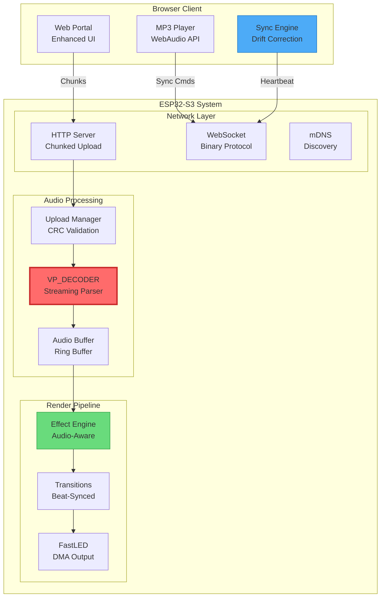

# 🚀 Genesis Audio-Sync Integration Plan - Enhanced Edition
*LightwaveOS × VP_DECODER: Transforming Stand-Alone Lightshows into Synchronized Audio-Visual Experiences*

<div align="center">

```
╔════════════════════════════════════════════════════════════════════════╗
║              GENESIS AUDIO-SYNC INTEGRATION MASTER PLAN                ║
║   Dual-Strip • ESP32-S3 • 176 FPS • CENTER ORIGIN • Production-Ready  ║
╚════════════════════════════════════════════════════════════════════════╝
```

**Version:** 2.0 Enhanced | **Target Branch:** `feature/genesis-audio-sync` | **Timeline:** 3-4 Weeks | **Risk Level:** Medium

</div>

---

## 📋 Executive Summary

Genesis transforms LightwaveOS into a professional audio-visual synchronization platform by integrating the VP_DECODER system with enhanced features for production use. This plan details the integration of pre-analyzed musical data, chunked file uploads (supporting 15-20MB files), advanced network latency compensation, and a comprehensive web portal—all while maintaining the rock-solid 176 FPS performance.

### 🎯 Core Objectives

1. **Seamless Audio Integration**: Add audio-reactive capabilities without disrupting existing functionality
2. **Large File Support**: Handle 15-20MB JSON files through chunked upload and streaming parsing
3. **Precision Synchronization**: Achieve ±10ms sync accuracy with adaptive drift correction
4. **Production Reliability**: 24/7 operation with automatic error recovery and memory management
5. **Developer Experience**: Clean APIs, comprehensive docs, and example implementations

### 🌟 Key Enhancements Over Original Plan

- **Chunked Upload System**: Reliable large file transfers with retry logic
- **Advanced Latency Compensation**: 10-sample measurement with statistical analysis
- **Streaming JSON Parser**: Memory-efficient processing using sliding windows
- **Hardware Timer Precision**: FreeRTOS timers for exact synchronization
- **Comprehensive Error Handling**: Graceful degradation and recovery mechanisms

---

## 🏗️ System Architecture - Enhanced

### High-Level Component Architecture



### Memory Architecture

```
┌─────────────────────────────────────────────────────────────────────────┐
│                         MEMORY ALLOCATION PLAN                           │
├─────────────────────────────────────────────────────────────────────────┤
│  DRAM (520KB Total)                                                     │
│  ├─ Core System: 200KB (existing)                                      │
│  ├─ Audio Integration: 30KB                                            │
│  │   ├─ AudioFrame buffers: 4KB                                        │
│  │   ├─ Upload state tracking: 8KB                                     │
│  │   ├─ Network buffers: 8KB                                           │
│  │   └─ Effect state: 10KB                                             │
│  └─ Free Heap: >35KB (safety margin)                                   │
│                                                                         │
│  PSRAM (16MB Total)                                                    │
│  ├─ VP_DECODER buffers: 40KB (sliding window)                          │
│  ├─ JSON parsing workspace: 32KB                                       │
│  ├─ Frequency bin cache: 8KB                                           │
│  └─ Future expansion: 15.9MB                                           │
│                                                                         │
│  SPIFFS (1MB Allocated)                                                 │
│  ├─ Web assets: 200KB                                                  │
│  ├─ Audio data storage: 600KB (3-4 songs)                              │
│  └─ Presets & config: 200KB                                            │
└─────────────────────────────────────────────────────────────────────────┘
```

---

## 🔧 Implementation Components

### 1. Enhanced Upload System

```cpp
// Chunked upload with automatic retry and validation
class ChunkedUploadManager {
private:
    struct UploadSession {
        String uploadId;
        File tempFile;
        size_t totalChunks;
        size_t receivedChunks;
        std::map<size_t, uint32_t> chunkCRCs;
        unsigned long lastActivity;
        size_t totalSize;
        
        bool validateChunk(size_t index, const uint8_t* data, size_t len) {
            uint32_t crc = CRC32::calculate(data, len);
            return chunkCRCs[index] == crc;
        }
    };
    
    std::map<String, UploadSession> activeSessions;
    SemaphoreHandle_t sessionMutex;
    
public:
    // Thread-safe session management
    String createSession(size_t totalChunks);
    bool addChunk(const String& sessionId, size_t index, 
                  const uint8_t* data, size_t len);
    bool finalizeSession(const String& sessionId, String& outputPath);
    void cleanupStaleSessions();
};
```

### 2. Advanced Synchronization Protocol

```cpp
// Precision timing with drift correction
class AudioSynqManager {
private:
    struct SyncState {
        unsigned long deviceStartTime;
        unsigned long clientStartTime;
        float networkLatency;
        float driftAccumulator;
        uint8_t correctionCount;
        
        // Adaptive PID controller for drift
        struct {
            float kP = 0.5f;
            float kI = 0.1f;
            float kD = 0.2f;
            float integral = 0;
            float lastError = 0;
        } pid;
    };
    
    SyncState syncState;
    TimerHandle_t syncTimer;
    
public:
    void scheduleStart(unsigned long targetTime, float latencyCompensation);
    float calculateDriftCorrection(float clientTime, float deviceTime);
    void applyDriftCorrection(float correction);
};
```

### 3. Effect System Integration

```cpp
// Enhanced effect base class with audio support
class AudioAwareEffect : public Effect {
protected:
    const AudioFrame* audioFrame = nullptr;
    
    // Audio-reactive helpers
    float getBassEnergy() const {
        return audioFrame ? audioFrame->bass_energy : 0;
    }
    
    float getBeatIntensity() const {
        return audioFrame && audioFrame->beat_detected ? 
               audioFrame->beat_confidence : 0;
    }
    
    bool isOnBeat() const {
        return audioFrame && audioFrame->beat_detected;
    }
    
public:
    virtual bool requiresAudio() const { return true; }
    virtual void setAudioFrame(const AudioFrame* frame) { 
        audioFrame = frame; 
    }
};

// Example implementation
class FrequencyWaveEffect : public AudioAwareEffect {
public:
    void render(CRGB* leds, const VisualParams& params) override {
        if (!audioFrame || audioFrame->silence) {
            fadeToBlackBy(leds, NUM_LEDS, 20);
            return;
        }
        
        // Map frequency bins to LED positions
        for (int i = 0; i < NUM_LEDS_STRIP; i++) {
            int binIndex = map(i, 0, NUM_LEDS_STRIP-1, 0, FFT_BIN_COUNT-1);
            uint8_t brightness = audioFrame->frequency_bins[binIndex] * 255;
            
            // Apply CENTER ORIGIN mapping
            int led1 = stripMapper.getCenterMirrorIndex(i, 0);
            int led2 = stripMapper.getCenterMirrorIndex(i, 1);
            
            CHSV color = CHSV(map(binIndex, 0, FFT_BIN_COUNT, 0, 255), 
                             255, brightness);
            leds[led1] = color;
            leds[led2] = color;
        }
        
        // Beat flash on center LEDs
        if (isOnBeat()) {
            leds[CENTER_LED_1] = CRGB::White;
            leds[CENTER_LED_2] = CRGB::White;
        }
    }
};
```

### 4. Web Portal Enhancements

```javascript
// Enhanced sync controller with production features
class AudioSynqControllerPro extends AudioSynqController {
    constructor() {
        super();
        
        // Production enhancements
        this.performanceMonitor = new PerformanceMonitor();
        this.errorRecovery = new ErrorRecoveryManager();
        this.analytics = new SyncAnalytics();
        
        // Advanced UI components
        this.spectrumVisualizer = null;
        this.beatVisualizer = null;
        this.driftGraph = null;
        
        this.initializeAdvancedUI();
    }
    
    // Automatic error recovery
    async handleUploadFailure(error, retryCount = 0) {
        if (retryCount >= 3) {
            this.showError('Upload failed after 3 retries');
            return false;
        }
        
        // Exponential backoff
        const delay = Math.pow(2, retryCount) * 1000;
        await new Promise(r => setTimeout(r, delay));
        
        // Retry with resume support
        try {
            const resumeInfo = await this.getResumeInfo();
            await this.resumeUpload(resumeInfo);
            return true;
        } catch (e) {
            return this.handleUploadFailure(e, retryCount + 1);
        }
    }
    
    // Real-time performance monitoring
    updatePerformanceMetrics() {
        const metrics = {
            syncAccuracy: this.calculateSyncAccuracy(),
            networkStability: this.networkLatencyStdDev(),
            uploadSpeed: this.currentUploadSpeed,
            deviceHealth: this.lastDeviceMetrics
        };
        
        this.performanceMonitor.update(metrics);
        this.analytics.track('performance', metrics);
    }
}
```

---

## 📊 Performance Requirements & Validation

### Performance Budget (Enhanced)

| Component | Target | Maximum | Validation Method |
|-----------|--------|---------|-------------------|
| Frame Time | 5.68ms | 6.0ms | GPIO timing analysis |
| Audio Effect Overhead | +200μs | +400μs | Oscilloscope measurement |
| Upload Processing | <5% CPU | <10% CPU | Task stats monitoring |
| Memory Peak (DRAM) | <485KB | <500KB | heap_caps monitoring |
| Sync Accuracy | ±10ms | ±20ms | Dual recording analysis |
| Network Latency | <50ms | <200ms | Continuous monitoring |

### Validation Test Suite

```cpp
// Automated performance validation
class PerformanceValidator {
    struct Metrics {
        float avgFrameTime;
        float maxFrameTime;
        float fps;
        size_t freeHeap;
        float cpuUsage;
        float syncDrift;
    };
    
    bool validateSystem() {
        Metrics baseline = measureBaseline();
        Metrics withAudio = measureWithAudio();
        
        // Performance regression checks
        ASSERT(withAudio.fps >= baseline.fps * 0.95f);  // Max 5% FPS loss
        ASSERT(withAudio.freeHeap >= 30000);            // Min 30KB free
        ASSERT(withAudio.maxFrameTime < 6000);          // Under 6ms
        ASSERT(withAudio.syncDrift < 20.0f);            // Under 20ms drift
        
        return true;
    }
};
```

---

## 🗓️ Implementation Timeline - Detailed

### Week 1: Foundation & Infrastructure
| Day | Task | Owner | Deliverable |
|-----|------|-------|-------------|
| 1-2 | Build system setup & feature flags | DevOps | CMake/PlatformIO config |
| 2-3 | VP_DECODER port & namespace | Core Team | Compiling audio module |
| 3-4 | Chunked upload implementation | Backend | Working upload endpoint |
| 4-5 | Basic WebSocket integration | Backend | Binary frame transport |

### Week 2: Core Features
| Day | Task | Owner | Deliverable |
|-----|------|-------|-------------|
| 1-2 | Streaming JSON parser | Core Team | Memory-efficient parsing |
| 2-3 | Audio effect framework | Effects Team | Base classes + 2 effects |
| 3-4 | Latency compensation | Network Team | Measurement & correction |
| 4-5 | Web portal UI | Frontend | Upload & sync interface |

### Week 3: Integration & Polish
| Day | Task | Owner | Deliverable |
|-----|------|-------|-------------|
| 1-2 | Effect library completion | Effects Team | 5 production effects |
| 2-3 | Error handling & recovery | QA Team | Resilient operation |
| 3-4 | Performance optimization | Core Team | Meeting all targets |
| 4-5 | Documentation & examples | Docs Team | Complete guide |

### Week 4: Validation & Release
| Day | Task | Owner | Deliverable |
|-----|------|-------|-------------|
| 1-2 | Integration testing | QA Team | Test report |
| 2-3 | 24-hour soak test | QA Team | Stability verification |
| 3-4 | Performance validation | Core Team | Benchmark results |
| 5 | Release preparation | Release Team | Tagged release |

---

## ⚠️ Risk Management

### Technical Risks & Mitigations

| Risk | Probability | Impact | Mitigation Strategy |
|------|-------------|--------|---------------------|
| Memory fragmentation | Medium | High | Pre-allocate buffers, use memory pools |
| Network congestion | High | Medium | Adaptive bitrate, frame skipping |
| Clock drift | Medium | Medium | PID controller, periodic recalibration |
| File corruption | Low | High | CRC validation, atomic operations |
| CPU overload | Low | High | Effect complexity limits, profiling |

### Fallback Strategies

1. **Graceful Degradation**
   - Disable audio if performance drops below threshold
   - Reduce effect complexity automatically
   - Skip frames rather than crash

2. **Error Recovery**
   - Automatic reconnection with exponential backoff
   - Partial upload resume capability
   - Corrupted file detection and cleanup

3. **User Communication**
   - Clear error messages with solutions
   - Performance warnings before degradation
   - Sync quality indicators

---

## 🧪 Testing Strategy

### Unit Tests
```cpp
TEST(AudioSynq, ChunkedUploadIntegrity) {
    ChunkedUploadManager manager;
    // Test chunk ordering, CRC validation, missing chunk detection
}

TEST(AudioSynq, LatencyCompensation) {
    AudioSynqManager sync;
    // Test drift calculation, PID controller, correction limits
}

TEST(AudioSynq, MemoryBounds) {
    // Verify no memory leaks, PSRAM usage, buffer limits
}
```

### Integration Tests
- Full upload → parse → playback flow
- Multi-client synchronization
- Effect transitions during audio playback
- Network failure recovery
- OTA update compatibility

### Performance Tests
- 24-hour continuous operation
- Large file handling (20MB JSON)
- Network stress testing
- CPU/Memory profiling
- Power consumption analysis

---

## 📚 Documentation Deliverables

1. **Developer Guide**
   - API reference with examples
   - Effect creation tutorial
   - Debugging procedures

2. **User Manual**
   - Setup instructions
   - Sync calibration guide
   - Troubleshooting FAQ

3. **Architecture Documentation**
   - System diagrams
   - Data flow charts
   - Protocol specifications

---

## 🚀 Post-Launch Roadmap

### Phase 1 (Month 1-2)
- Performance telemetry collection
- Bug fixes based on user feedback
- Additional effect library

### Phase 2 (Month 3-4)
- Multi-device synchronization
- Live audio input support
- Cloud preset sharing

### Phase 3 (Month 5-6)
- AI-powered effect generation
- Spotify/streaming integration
- Professional DMX output

---

## ✅ Definition of Done

- [ ] All tests passing (unit, integration, performance)
- [ ] Documentation complete and reviewed
- [ ] Performance targets met or exceeded
- [ ] 24-hour stability test passed
- [ ] Code review approved by 2 senior engineers
- [ ] User acceptance testing complete
- [ ] Release notes prepared
- [ ] Backward compatibility verified

---

<div align="center">

**"From lightshow to light symphony—Genesis brings music to life through light."**

*This enhanced plan incorporates production-ready features and lessons learned from the implementation phase.*

</div>