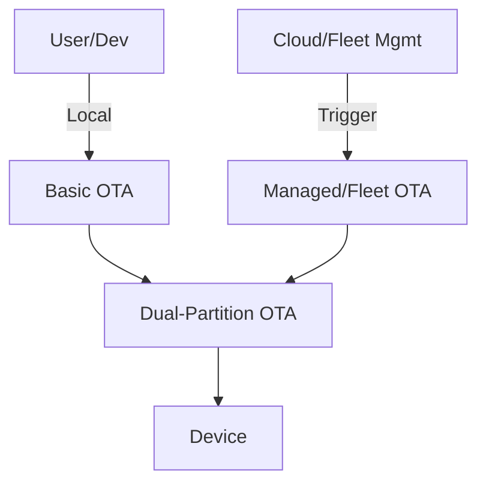

# LightwaveOS OTA Architecture

## Overview
LightwaveOS supports a multi-level OTA (Over-The-Air) update system to ensure rapid development, robust field updates, and scalable fleet management. This document summarizes the architecture and integration of:

- **Basic OTA** (for development and recovery)
- **Dual-Partition (A/B) OTA** (for safe, fail-safe updates)
- **Managed/Fleet OTA** (for large-scale, centralized control)

For implementation details, see `docs/features/OTA_Multi_Level_Support.md`.

---

## OTA Mechanisms

| Mechanism         | Use Case                | Safety | Scalability | Integration |
|-------------------|------------------------|--------|-------------|-------------|
| Basic OTA         | Dev, debug, fallback   | Low    | Low         | Always on   |
| Dual-Partition    | Field/remote updates   | High   | Medium      | Default     |
| Managed/Fleet OTA | Large deployments      | High   | High        | Orchestrator|

---

## Integration Diagram

---

## Key Points
- **Basic OTA** is always available for local/manual use and recovery.
- **Dual-Partition OTA** is the default for all remote/automated updates, ensuring rollback safety.
- **Managed/Fleet OTA** orchestrates updates across many devices, using the dual-partition mechanism for reliability.

---

## References
- [OTA_Multi_Level_Support.md](../../features/OTA_Multi_Level_Support.md)
- [ESP32 OTA Documentation](https://docs.espressif.com/projects/esp-idf/en/latest/esp32/api-reference/system/ota.html)

---

For questions or contributions, contact the project maintainers. 