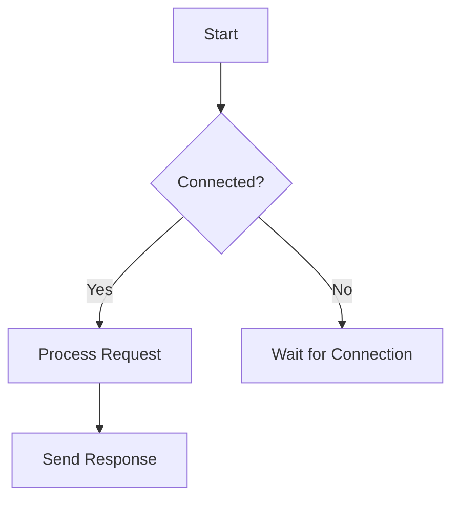

# LightwaveOS Documentation Standards

**Version:** 1.0.0
**Status:** Current
**Last Updated:** 2025-01-02
**Author:** Documentation Team

---

## Table of Contents

1. [Overview](#1-overview)
2. [File and Directory Naming](#2-file-and-directory-naming)
3. [Document Header Template](#3-document-header-template)
4. [Status Markers](#4-status-markers)
5. [Document Structure](#5-document-structure)
6. [Cross-Reference Format](#6-cross-reference-format)
7. [Source Directory READMEs](#7-source-directory-readmes)
8. [Code Documentation](#8-code-documentation)
9. [Diagrams and Visuals](#9-diagrams-and-visuals)
10. [Archive Procedures](#10-archive-procedures)
11. [Templates](#11-templates)
12. [Enforcement and Review](#12-enforcement-and-review)

---

## 1. Overview

This document establishes the canonical documentation standards for the LightwaveOS project. All documentation must conform to these standards to ensure consistency, discoverability, and long-term maintainability.

### Purpose

- Ensure consistent naming and structure across all documentation
- Enable efficient navigation and search
- Support automated tooling and indexing
- Facilitate onboarding of new contributors
- Maintain documentation quality over time

### Scope

These standards apply to:

| Category | Location | Examples |
|----------|----------|----------|
| Technical docs | `docs/` | API specs, architecture guides |
| Source READMEs | `firmware/*/src/*/` | Module overviews |
| Agent documentation | `.claude/` | Agent personas, skills |
| Harness documentation | `.claude/harness/` | Progress tracking |
| Project root files | `/` | `README.md`, `CLAUDE.md` |

### Canonical References

The following documents exemplify these standards:

| Document | Location | Pattern Demonstrated |
|----------|----------|---------------------|
| Audio Subsystem README | `firmware/v2/src/audio/README.md` | Source directory README |
| ShowDirector Guide | `docs/shows/README.md` | Feature documentation |
| Agent Inventory | `.claude/agents/README.md` | Inventory format |

---

## 2. File and Directory Naming

### File Naming Rules

| Rule | Format | Examples |
|------|--------|----------|
| Standard documents | `kebab-case.md` | `pattern-development-guide.md`, `api-migration-plan.md` |
| Version-specific docs | `feature-name-v2.md` | `audio-pipeline-v2.md` |
| Date-stamped analysis | `topic-YYYY-MM-DD.md` | `performance-audit-2025-01-02.md` |

### Exceptions (Uppercase)

| File | Reason |
|------|--------|
| `README.md` | Git/GitHub convention |
| `CLAUDE.md` | Claude Code agent standard |
| `CHANGELOG.md` | Git convention |
| `LICENSE.md` | Git convention |
| `CONTRIBUTING.md` | Git convention |
| `AGENTS.md` | Project configuration file |

### Legacy Uppercase Files

Existing uppercase files (e.g., `API_V1.md`, `ENHANCEMENT_ENGINE_API.md`) are grandfathered but should be migrated to kebab-case when substantially revised.

### Directory Naming Rules

| Rule | Format | Examples |
|------|--------|----------|
| Standard directories | `lowercase-with-dashes` | `audio-visual/`, `ci-cd/` |
| Source directories | `lowercase` or `PascalCase` | `audio/`, `WebServer/` |

### Prohibited Patterns

| Pattern | Problem | Correct Alternative |
|---------|---------|---------------------|
| `snake_case.md` | Inconsistent with kebab-case | `kebab-case.md` |
| `SCREAMING_CASE.md` | Violates naming rules | `topic-name.md` |
| Spaces in filenames | URL/path issues | Use dashes |
| Special characters | Shell escaping | Alphanumeric + dashes |
| Trailing numbers | Version confusion | Use version suffix: `-v2.md` |

---

## 3. Document Header Template

### Standard Header

Every document must begin with a metadata header:

```markdown
# Document Title

**Version:** X.Y.Z
**Status:** Current | Draft | Archived | Deprecated
**Last Updated:** YYYY-MM-DD
**Author:** Name or Team

---
```

### Extended Header (Optional)

For complex documents:

```markdown
# Document Title

**Version:** X.Y.Z
**Status:** Current
**Last Updated:** YYYY-MM-DD
**Author:** Name or Team
**Reviewers:** Name1, Name2
**Related:** [link1](path), [link2](path)

---
```

### Version Numbering

Use semantic versioning for documentation:

| Component | When to Increment |
|-----------|-------------------|
| Major (X) | Breaking changes, complete rewrites |
| Minor (Y) | New sections, significant additions |
| Patch (Z) | Typos, clarifications, minor updates |

---

## 4. Status Markers

### Status Definitions

| Status | Badge | Meaning | Maintenance |
|--------|-------|---------|-------------|
| **Current** | Active | Accurate, up-to-date, authoritative | Regular review |
| **Draft** | In Progress | Under development, not yet reviewed | Active editing |
| **Archived** | Historical | Superseded but preserved for reference | No updates |
| **Deprecated** | Phase-out | Being replaced, avoid new usage | Migration docs |

### Status Lifecycle

```
Draft → Current → Deprecated → Archived
                      ↓
              (or direct) → Archived
```

### Inline Status Markers

Use these markers within documents for section-level status:

```markdown
> **Note:** This section is under active development.

> **Warning:** This API is deprecated. See [migration-guide.md](./migration-guide.md).

> **Experimental:** This feature is not yet stable.
```

---

## 5. Document Structure

### Standard Outline

For technical documentation:

```markdown
# Title

**Header metadata**

---

## Table of Contents (for docs > 3 sections)

## 1. Overview
   ### Purpose
   ### Scope
   ### Target Audience (optional)

## 2. Architecture / Design
   ### System Diagram
   ### Component Responsibilities
   ### Data Flow

## 3. Implementation Details
   ### Core Data Structures
   ### Key Algorithms
   ### Configuration

## 4. Usage
   ### Prerequisites
   ### Quick Start
   ### Examples

## 5. API Reference (if applicable)

## 6. Troubleshooting
   ### Common Issues
   ### Debug Logging

## 7. References
   ### Related Documents
   ### External Resources
```

### Heading Hierarchy

| Level | Purpose | Example |
|-------|---------|---------|
| H1 (`#`) | Document title only | `# API Reference` |
| H2 (`##`) | Major sections | `## Architecture` |
| H3 (`###`) | Subsections | `### Data Flow` |
| H4 (`####`) | Detailed topics | `#### Request Format` |
| H5+ | Avoid | Restructure instead |

### Table of Contents

Include for documents with 4+ sections:

```markdown
## Table of Contents

1. [Overview](#1-overview)
2. [Architecture](#2-architecture)
3. [Implementation](#3-implementation)
4. [Usage](#4-usage)
```

---

## 6. Cross-Reference Format

### Internal Links

| Scenario | Format | Example |
|----------|--------|---------|
| Same directory | `[text](file.md)` | `[API Guide](api-guide.md)` |
| Subdirectory | `[text](sub/file.md)` | `[Audio](audio/README.md)` |
| Parent directory | `[text](../file.md)` | `[Main](../README.md)` |
| Specific section | `[text](file.md#section)` | `[Setup](guide.md#installation)` |

### Source Code Links

Use relative paths from repo root with line numbers:

```markdown
See implementation: [WebServer.cpp:1915-1958](../firmware/v2/src/network/WebServer.cpp#L1915-L1958)
```

Or file-only:

```markdown
Configuration: [features.h](../firmware/v2/src/config/features.h)
```

### External Links

```markdown
- [FastLED Documentation](https://github.com/FastLED/FastLED/wiki)
- [ESP-IDF Reference](https://docs.espressif.com/projects/esp-idf/en/latest/)
```

### Cross-Reference Table

For documents with many dependencies:

```markdown
## Related Documents

| Document | Purpose | Location |
|----------|---------|----------|
| API v1 Spec | REST endpoint definitions | [docs/api/API_V1.md](api/API_V1.md) |
| Architecture | System overview | [docs/architecture/](architecture/) |
| Troubleshooting | Common issues | [docs/debugging/](debugging/) |
```

---

## 7. Source Directory READMEs

### Requirements

Every source directory containing multiple related files MUST have a `README.md` explaining:

1. **Purpose**: What this module/subsystem does
2. **Architecture**: How components relate
3. **Key Files**: Table of files with descriptions
4. **Usage**: How to use the module
5. **Thread Safety** (if applicable): Concurrency model
6. **Memory Budget** (if applicable): RAM/Flash usage

### Template

```markdown
# Module Name

## Overview

Brief description of the module's purpose and role in the system.

## Architecture

```
ASCII diagram showing component relationships
```

## Key Files

| File | Purpose |
|------|---------|
| `Component.h` | Interface definitions |
| `Component.cpp` | Implementation |
| `Types.h` | Data structures |

## Usage

```cpp
// Example usage code
```

## Thread Safety

- Thread X only calls methods A, B
- Thread Y only calls methods C, D
- Shared state protected by mutex M

## Memory Budget

| Component | RAM | Flash |
|-----------|-----|-------|
| Instance  | 128 B | - |
| Constants | - | 2 KB |
```

### Exemplar

See `firmware/v2/src/audio/README.md` for a complete example demonstrating:

- ASCII architecture diagram
- Detailed API documentation per contract
- Code examples with context
- Thread safety documentation
- Memory budget table
- Performance characteristics
- Test references

---

## 8. Code Documentation

### Header File Documentation

```cpp
/**
 * @file WebServer.h
 * @brief HTTP and WebSocket server for LightwaveOS
 * @version 2.0.0
 *
 * Provides REST API v1 endpoints and real-time WebSocket control.
 * Thread-safe with rate limiting.
 *
 * @see docs/api/API_V1.md for endpoint documentation
 */
```

### Function Documentation

```cpp
/**
 * @brief Triggers a visual transition between effects
 *
 * @param type Transition type (0-11, see TransitionType enum)
 * @param durationMs Duration in milliseconds (100-5000)
 * @param easing Easing curve (0-14, see EasingType enum)
 *
 * @return true if transition started, false if invalid params
 *
 * @note Thread-safe. Can be called from any task.
 * @warning Do not call from ISR context.
 */
bool triggerTransition(uint8_t type, uint16_t durationMs, uint8_t easing);
```

### Inline Comments

```cpp
// CRITICAL: Clear stale event bits before connecting
// Without this, we may get false "Connected" states
if (m_wifiEventGroup) {
    xEventGroupClearBits(m_wifiEventGroup,
        EVENT_CONNECTED | EVENT_GOT_IP | EVENT_CONNECTION_FAILED);
}
```

---

## 9. Diagrams and Visuals

### ASCII Diagrams

Preferred for code proximity and version control:

```
┌─────────────────────────────────────────────────────────────┐
│                      Web Interface                          │
└─────────────────────────────────────────────────────────────┘
                              │
                    REST API + WebSocket
                              │
┌─────────────────────────────────────────────────────────────┐
│                     WebServer                                │
└─────────────────────────────────────────────────────────────┘
```

### Table Format for Component Lists

```markdown
| Component | RAM | Flash | Purpose |
|-----------|-----|-------|---------|
| AudioActor | 2 KB | - | Audio capture and analysis |
| MusicalGrid | 128 B | - | Beat/tempo tracking |
```

### Flowcharts (Mermaid)

For complex flows, use Mermaid syntax (GitHub renders automatically):

```markdown

```

### Image Files

When necessary:

| Requirement | Format |
|-------------|--------|
| Screenshots | PNG, compressed |
| Diagrams | SVG preferred, PNG acceptable |
| Location | `docs/images/` or adjacent to document |
| Naming | `feature-diagram-description.png` |

---

## 10. Archive Procedures

### When to Archive

| Condition | Action |
|-----------|--------|
| Feature removed | Archive immediately |
| Document superseded | Archive when replacement is Current |
| API deprecated | Archive after migration period |
| Analysis completed | Keep in analysis/, no archival needed |

### Archive Location

```
docs/
  archive/
    YYYY-MM/           # Month-based organization
      old-document.md
    experimental/      # Experimental/abandoned features
      feature-name/
    legacy/            # Old versions of current features
      api-v0/
```

### Archive Process

1. Update status to `Archived` in document header
2. Add archive notice at top:

```markdown
> **Archived:** This document is no longer maintained.
> Superseded by [new-document.md](../path/to/new-document.md).
> Archived on YYYY-MM-DD.
```

3. Move to `docs/archive/YYYY-MM/`
4. Update any documents linking to it
5. Remove from navigation/index if present

### Archive Metadata

Add to archived documents:

```markdown
**Archive Date:** YYYY-MM-DD
**Archive Reason:** Superseded by feature-v2
**Superseded By:** [new-document.md](../new-document.md)
```

---

## 11. Templates

### Technical Feature Documentation

```markdown
# Feature Name

**Version:** 1.0.0
**Status:** Current
**Last Updated:** YYYY-MM-DD
**Author:** Name

---

## Table of Contents

1. [Project Overview](#1-project-overview)
2. [Architecture Design](#2-architecture-design)
3. [Implementation Details](#3-implementation-details)
4. [Installation & Setup](#4-installation--setup)
5. [Usage Instructions](#5-usage-instructions)
6. [Extension & Customization](#6-extension--customization)
7. [Improvement & Contribution](#7-improvement--contribution)
8. [Troubleshooting](#8-troubleshooting)

---

## 1. Project Overview

### Purpose

[What problem does this feature solve?]

### Key Features

- Feature 1
- Feature 2
- Feature 3

### Target Audience

- Developers: [use case]
- Users: [use case]

---

## 2. Architecture Design

### System Architecture

```
[ASCII diagram]
```

### Component Responsibilities

| Component | Purpose | Location |
|-----------|---------|----------|
| Name | Description | `path/to/file.cpp` |

### Data Flow

1. Step 1
2. Step 2
3. Step 3

---

## 3. Implementation Details

### Core Data Structures

```cpp
struct Example {
    uint8_t field1;
    uint16_t field2;
};
```

### Memory Budget

| Component | RAM | Flash |
|-----------|-----|-------|
| Total | X bytes | Y bytes |

---

## 4. Installation & Setup

### Prerequisites

- Requirement 1
- Requirement 2

### Build Command

```bash
pio run -e esp32dev_audio -t upload
```

---

## 5. Usage Instructions

### API Endpoints

| Endpoint | Method | Description |
|----------|--------|-------------|
| `/api/v1/feature` | GET | Get feature state |

### Code Example

```cpp
// Example code
```

---

## 6. Extension & Customization

### Adding Custom Components

[Step-by-step guide]

---

## 7. Improvement & Contribution

### Known Limitations

1. Limitation 1
2. Limitation 2

### Roadmap

| Feature | Priority | Status |
|---------|----------|--------|
| Feature A | High | Planned |

---

## 8. Troubleshooting

### Common Issues

#### Issue Name

**Symptom:** Description

**Cause:** Explanation

**Solution:** Fix

---

## File Reference

| File | Purpose |
|------|---------|
| `file.h` | Interface |
| `file.cpp` | Implementation |
```

### Source Directory README

```markdown
# Module Name

## Overview

[One paragraph describing the module's purpose and role in the system.]

## Architecture

```
[ASCII diagram showing component relationships]
```

## Key Files

| File | Purpose |
|------|---------|
| `Main.h` | Primary interface |
| `Main.cpp` | Implementation |
| `Types.h` | Data structures |

## Dependencies

- Dependency 1 (purpose)
- Dependency 2 (purpose)

## Usage

```cpp
#include "Module.h"

Module::getInstance().doSomething();
```

## Thread Safety

[Describe which threads access this module and synchronization approach]

## Memory Budget

| Component | RAM | Flash |
|-----------|-----|-------|
| Instance | X bytes | - |
| Static data | - | Y bytes |

## Feature Flags

```cpp
#if FEATURE_MODULE
// Module enabled
#endif
```

## Testing

```bash
pio test -e native -f test_module
```

## References

- [Related Documentation](../docs/related.md)
- [External Resource](https://example.com)
```

### API Endpoint Documentation

```markdown
## Endpoint Name

**Method:** GET | POST | PUT | DELETE
**Path:** `/api/v1/resource`
**Authentication:** None | Bearer Token
**Rate Limit:** 20 req/sec

### Request

#### Headers

| Header | Required | Description |
|--------|----------|-------------|
| Content-Type | Yes | `application/json` |

#### Body

```json
{
  "field1": "value",
  "field2": 123
}
```

### Response

#### Success (200 OK)

```json
{
  "success": true,
  "data": {
    "result": "value"
  },
  "timestamp": 12345,
  "version": "1.0"
}
```

#### Error (4xx/5xx)

```json
{
  "success": false,
  "error": "Error message",
  "code": "ERROR_CODE"
}
```

### Example

```bash
curl -X POST http://lightwaveos.local/api/v1/resource \
  -H "Content-Type: application/json" \
  -d '{"field1": "value"}'
```
```

### Inventory/Matrix Document

```markdown
# Inventory Name

**Version:** 1.0.0
**Last Updated:** YYYY-MM-DD
**Purpose:** [Description of what this inventory tracks]

---

## Overview

[Brief description of the inventory's scope and purpose.]

---

## Inventory

### Category 1

#### Item Name

**Description:** [What this item does]

**Properties:**
- Property 1
- Property 2

**When to Use:**
- Situation 1
- Situation 2

---

### Category 2

[Continue pattern...]

---

## Selection Matrix

| Item | Primary Use | Secondary Use | Complexity |
|------|-------------|---------------|------------|
| Item 1 | Use A | Use B | High |
| Item 2 | Use C | Use D | Low |

---

## Version History

- **v1.0.0** (YYYY-MM-DD): Initial inventory creation
```

---

## 12. Enforcement and Review

### Pre-Commit Checklist

Before committing documentation:

- [ ] File uses kebab-case (or is an exception)
- [ ] Header includes Version, Status, Last Updated, Author
- [ ] Status is one of: Current, Draft, Archived, Deprecated
- [ ] Cross-references use correct relative paths
- [ ] Code examples are tested and accurate
- [ ] Tables are properly formatted
- [ ] No broken links

### Review Requirements

| Document Type | Review Required |
|---------------|-----------------|
| API changes | Technical lead |
| Architecture | 2+ reviewers |
| New feature | Feature owner |
| Bug fix notes | Self-review sufficient |

### Documentation Debt

Track documentation improvements in `.claude/harness/feature_list.json`:

```json
{
  "id": "doc-xxx",
  "title": "Update outdated API documentation",
  "status": "FAILING",
  "category": "documentation"
}
```

### Periodic Review

| Document Category | Review Frequency |
|-------------------|------------------|
| API documentation | Every API change |
| Architecture docs | Quarterly |
| Source READMEs | When module changes |
| Guides & tutorials | Biannually |

---

## Quick Reference

### File Naming

```
kebab-case.md          # Standard
README.md              # Exception (uppercase)
CLAUDE.md              # Exception (agent standard)
topic-v2.md            # Version suffix
topic-YYYY-MM-DD.md    # Date suffix
```

### Header

```markdown
# Title

**Version:** 1.0.0
**Status:** Current
**Last Updated:** YYYY-MM-DD
**Author:** Name
```

### Status Values

| Status | Use When |
|--------|----------|
| Current | Active, accurate |
| Draft | In development |
| Archived | Superseded |
| Deprecated | Being replaced |

### Cross-References

```markdown
[Same dir](file.md)
[Subdir](sub/file.md)
[Parent](../file.md)
[Section](file.md#section)
[Code](../path/file.cpp#L10-L20)
```

---

*This document is the canonical reference for LightwaveOS documentation standards.*
