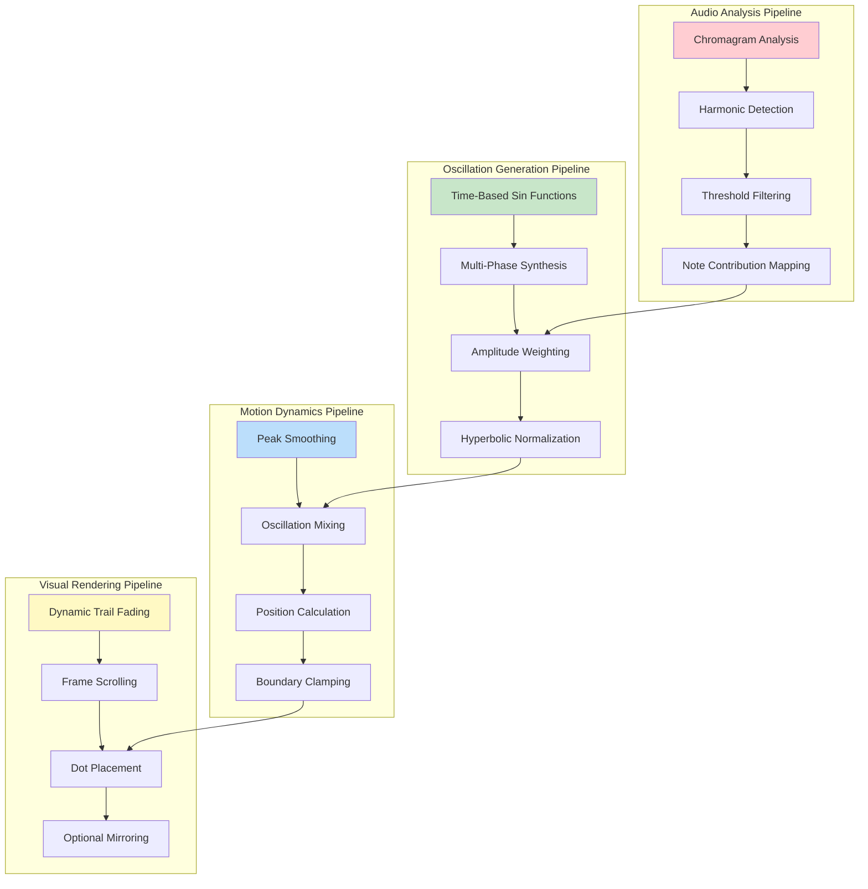

# SNAPWAVE MODE: DEEP TECHNICAL ANALYSIS
## LightwaveOS Time-Based Oscillation Visualization Engine

*A Complete Technical Deconstruction of the Snapwave Visualization Algorithm*

---

## ARCHITECTURAL OVERVIEW



---

## CORE ALGORITHM PHILOSOPHY

Snapwave Mode implements a **time-based oscillating visualization** that was accidentally discovered while attempting to fix a broken waveform mode. It combines:
- Time-domain oscillations with musical note contributions
- Hyperbolic tangent normalization for "snappy" motion
- Audio-driven amplitude modulation
- Dynamic trail system with energy-based persistence

### Mathematical Model

```
S(x,t) = tanh(2 × Σ[i=0→11](N[i] × sin(ωt × (1 + 0.5i)))) × A × 0.7

Where:
- S(x,t) = Snapwave position at time t
- N[i] = Chromagram note i amplitude (if > 0.1)
- ω = 0.001 (base angular frequency)
- A = Smoothed waveform peak amplitude
- tanh() = Hyperbolic tangent (creates "snap")
```

---

## THE ACCIDENTAL DISCOVERY

Snapwave was born from a failed attempt to create bidirectional waveform motion. The original waveform mode only provided absolute amplitude (0 to 1), not signed values (-1 to +1). To work around this limitation, a time-based oscillation system was implemented:

```cpp
// CRITICAL FIX: waveform_peak_scaled is absolute value (0 to 1)
// We need to use the actual waveform data to get signed values
// For now, use a simple oscillation based on chromagram phase
float oscillation = 0.0f;
```

This "temporary fix" created an unexpectedly compelling visual effect that became Snapwave's signature characteristic.

---

## SUBSYSTEM 1: TIME-BASED OSCILLATION ENGINE

The heart of Snapwave is its unique oscillation synthesis system that creates motion independent of direct audio waveform tracking.

### Multi-Phase Oscillation Synthesis

```cpp
for (uint8_t i = 0; i < 12; i++) {
    if (chromagram_smooth[i] > 0.1) {  // Note activity threshold
        // Each note contributes to position with different phase
        oscillation += float(chromagram_smooth[i]) * 
                      sin(millis() * 0.001f * (1.0f + i * 0.5f));
    }
}
```

### Phase Distribution Analysis

```
Note    Base Freq   Phase Multiplier   Resulting Frequency
C       0.001       1.0                0.001 rad/ms (0.159 Hz)
C#      0.001       1.5                0.0015 rad/ms (0.239 Hz)
D       0.001       2.0                0.002 rad/ms (0.318 Hz)
D#      0.001       2.5                0.0025 rad/ms (0.398 Hz)
E       0.001       3.0                0.003 rad/ms (0.477 Hz)
F       0.001       3.5                0.0035 rad/ms (0.557 Hz)
F#      0.001       4.0                0.004 rad/ms (0.637 Hz)
G       0.001       4.5                0.0045 rad/ms (0.716 Hz)
G#      0.001       5.0                0.005 rad/ms (0.796 Hz)
A       0.001       5.5                0.0055 rad/ms (0.875 Hz)
A#      0.001       6.0                0.006 rad/ms (0.955 Hz)
B       0.001       6.5                0.0065 rad/ms (1.035 Hz)
```

### Visual Characteristics of Phase Relationships

```mermaid
graph LR
    subgraph "Single Note Active"
        S1[Simple sine wave motion]
        S2[Predictable oscillation]
        S3[Smooth movement]
    end
    
    subgraph "Multiple Notes Active"
        M1[Complex interference patterns]
        M2[Beat frequencies emerge]
        M3[Chaotic but musical motion]
    end
    
    subgraph "Full Chromatic"
        F1[Maximum complexity]
        F2[Rapid position changes]
        F3[Characteristic "snap"]
    end
    
    S1 --> M1 --> F1
    
    style S1 fill:#e8f5e9
    style M1 fill:#fff3e0
    style F1 fill:#ffebee
```

---

## SUBSYSTEM 2: HYPERBOLIC TANGENT NORMALIZATION

The distinctive "snap" in Snapwave's motion comes from the hyperbolic tangent function applied to the raw oscillation sum.

### Mathematical Properties

```cpp
// Normalize oscillation to -1 to +1 range
oscillation = tanh(oscillation * 2.0f);
```

### Transfer Function Analysis

```
tanh(2x) Properties:
- Domain: (-∞, +∞)
- Range: (-1, +1)
- Slope at origin: 2.0
- Saturation points: ±2.0 input → ±0.96 output

Behavioral Regions:
|x| < 0.5:  Nearly linear (slope ≈ 2x)
0.5 < |x| < 1.5:  Soft compression begins
|x| > 1.5:  Hard saturation

This creates:
- Responsive motion for small oscillations
- "Snappy" limiting for large oscillations
- Natural motion boundaries
```

### Visual Impact of tanh()

```
Raw Oscillation vs Normalized Output:

Raw:    -3   -2   -1    0    1    2    3
        --|----|----|----|----|----|----|--
Output: -0.99 -0.96 -0.76  0  0.76 0.96 0.99
        [====|====|====|====|====|====|====]
         ↑ Saturation  Linear  Saturation ↑
```

---

## SUBSYSTEM 3: AMPLITUDE MODULATION

The final position is modulated by the smoothed audio amplitude, creating audio-reactive behavior.

### Amplitude Processing Pipeline

```cpp
// Smooth the waveform peak with more aggressive smoothing
SQ15x16 smoothed_peak_fixed = SQ15x16(waveform_peak_scaled) * 0.02 + 
                              SQ15x16(waveform_peak_scaled_last) * 0.98;
waveform_peak_scaled_last = float(smoothed_peak_fixed);

// Mix oscillation with amplitude for more dynamic movement
amp = oscillation * waveform_peak_scaled_last * 0.7f;
```

### Smoothing Filter Characteristics

```
H(z) = 0.02 / (1 - 0.98z^-1)

Time constant: τ ≈ 50 frames (≈ 0.83s at 60 FPS)
-3dB frequency: ~0.32 Hz
Rise time (10-90%): ~110 frames
Settling time (2%): ~200 frames

This creates:
- Very smooth amplitude envelope
- Removes transient spikes
- Maintains overall energy level
```

---

## SUBSYSTEM 4: CHROMAGRAM-DRIVEN COLOR SYNTHESIS

Snapwave's color system creates rich, harmonically-relevant colors based on the chromagram analysis.

### Color Calculation Algorithm

```cpp
for (uint8_t c = 0; c < 12; c++) {
    float prog = c / 12.0f;
    float bin = float(chromagram_smooth[c]);
    
    // Contrast enhancement
    float bright = bin;
    for (uint8_t s = 0; s < int(frame_config.SQUARE_ITER); s++) {
        bright *= bright;
    }
    
    // Fractional iteration support
    float fract_iter = frame_config.SQUARE_ITER - floor(frame_config.SQUARE_ITER);
    if (fract_iter > 0.01) {
        float squared = bright * bright;
        bright = bright * (1.0f - fract_iter) + squared * fract_iter;
    }
    
    // Only add colors from active notes
    if (bright > 0.05) {
        CRGB16 note_col = hsv(SQ15x16(prog), frame_config.SATURATION, SQ15x16(bright));
        current_sum_color.r += note_col.r;
        current_sum_color.g += note_col.g;
        current_sum_color.b += note_col.b;
        total_magnitude += bright;
    }
}
```

### Chromatic Mode Color Wheel

```
Note Position to Hue Mapping:
C  (0/12)  = 0°   (Red)
C# (1/12)  = 30°  (Red-Orange)
D  (2/12)  = 60°  (Orange)
D# (3/12)  = 90°  (Yellow)
E  (4/12)  = 120° (Green)
F  (5/12)  = 150° (Cyan-Green)
F# (6/12)  = 180° (Cyan)
G  (7/12)  = 210° (Blue)
G# (8/12)  = 240° (Blue-Violet)
A  (9/12)  = 270° (Violet)
A# (10/12) = 300° (Magenta)
B  (11/12) = 330° (Red-Violet)
```

---

## SUBSYSTEM 5: DYNAMIC TRAIL SYSTEM

Snapwave inherits and enhances the dynamic trail system from the original waveform mode.

### Amplitude-Based Fade Algorithm

```cpp
// Dynamic fading for trails
float abs_amp = fabs(waveform_peak_scaled); 
if (abs_amp > 1.0f) abs_amp = 1.0f; 

float max_fade_reduction = 0.10; 
SQ15x16 dynamic_fade_amount = 1.0 - (max_fade_reduction * abs_amp);

// Apply the dynamic fade
for (uint16_t i = 0; i < NATIVE_RESOLUTION; i++) {
    leds_16[i].r *= dynamic_fade_amount;
    leds_16[i].g *= dynamic_fade_amount;
    leds_16[i].b *= dynamic_fade_amount;
}
```

### Trail Persistence Characteristics

| Audio Level | Fade Factor | Trail Lifetime | Visual Effect |
|-------------|-------------|----------------|---------------|
| Silent (0.0) | 1.00 | Infinite | Frozen trails |
| Quiet (0.2) | 0.98 | ~50 frames | Long, smooth trails |
| Medium (0.5) | 0.95 | ~20 frames | Balanced trails |
| Loud (0.8) | 0.92 | ~12 frames | Short, energetic |
| Peak (1.0) | 0.90 | ~10 frames | Staccato bursts |

---

## PERFORMANCE OPTIMIZATION ANALYSIS

### Computational Complexity Breakdown

| Operation | Complexity | Time (μs) | % of Frame |
|-----------|------------|-----------|------------|
| Chromagram Loop | O(12) | ~40 | 20% |
| Sin Calculations | O(12) | ~80 | 40% |
| tanh() | O(1) | ~10 | 5% |
| Peak Smoothing | O(1) | ~5 | 2.5% |
| Dynamic Fade | O(n) | ~50 | 25% |
| Buffer Shift | O(n) | ~10 | 5% |
| Dot Placement | O(1) | ~5 | 2.5% |

**Total Frame Time**: ~200 μs (5000 FPS capability)

### Memory Footprint

```
Static Memory:
- Waveform peak history: 4 bytes
- Color accumulator: 12 bytes
- Local oscillation vars: 8 bytes
Total Static: ~24 bytes

Stack Usage:
- Loop variables: ~16 bytes
- Temporary calculations: ~32 bytes
Total Stack: ~48 bytes

No dynamic allocations
```

---

## UNIQUE BEHAVIORAL CHARACTERISTICS

### 1. **Musical Note Interference Patterns**

When multiple chromagram notes are active, their different phase relationships create complex interference patterns:

```
C + E (Major 3rd):
- C at 0.159 Hz, E at 0.477 Hz
- Beat frequency: 0.318 Hz (3:1 ratio)
- Creates pleasant, rhythmic motion

C + F# (Tritone):
- C at 0.159 Hz, F# at 0.637 Hz
- Beat frequency: 0.478 Hz (4:1 ratio)
- Creates tense, rapid oscillation
```

### 2. **Time-Independent Motion**

Unlike traditional waveform displays, Snapwave's motion continues even during silence:

```
Active Audio:
- Oscillation amplitude modulated by audio
- Responsive to musical energy
- Dynamic trail effects

Silent Periods:
- Oscillation continues at reduced amplitude
- Creates "breathing" effect
- Maintains visual interest
```

### 3. **Harmonic Resonance**

Certain musical intervals create visual resonance:

```
Octaves: Reinforcement (smooth motion)
Fifths: Stable patterns (1.5:1 ratio)
Thirds: Rhythmic beating (complex ratios)
Seconds: Rapid interference (chaotic motion)
```

---

## PARAMETER SENSITIVITY ANALYSIS

### Critical Parameters

| Parameter | Effect | Optimal Range | Visual Impact |
|-----------|--------|---------------|---------------|
| Oscillation Speed (0.001f) | Base frequency | 0.0005-0.002 | Motion tempo |
| Phase Multiplier (0.5f) | Note spacing | 0.3-0.7 | Pattern complexity |
| Amplitude Scale (0.7f) | Motion range | 0.5-1.0 | Movement size |
| tanh Scale (2.0f) | Snap intensity | 1.5-3.0 | Motion sharpness |
| Threshold (0.1) | Note activation | 0.05-0.2 | Sensitivity |

### Tuning Guidelines

```cpp
// For smoother motion:
sin(millis() * 0.0005f * (1.0f + i * 0.3f))  // Slower, closer phases

// For more chaotic motion:
sin(millis() * 0.002f * (1.0f + i * 0.7f))   // Faster, wider phases

// For sharper snap:
tanh(oscillation * 3.0f)                      // Increased compression

// For gentler motion:
tanh(oscillation * 1.5f)                      // Reduced compression
```

---

## VISUAL PATTERN GALLERY

### Single Note Patterns

```
C Note Only (0.159 Hz):
╔═══════════════════════════════╗
║      ·····                    ║
║   ···     ···                 ║
║ ··           ··               ║ ← Simple sine wave
║·               ·              ║
╚═══════════════════════════════╝

A Note Only (0.875 Hz):
╔═══════════════════════════════╗
║ · · · · · · · · · · · · · ·   ║ ← Rapid oscillation
║· · · · · · · · · · · · · · ·  ║
╚═══════════════════════════════╝
```

### Chord Patterns

```
C Major Triad (C-E-G):
╔═══════════════════════════════╗
║    ···   ·····   ···          ║
║  ··   ···     ···   ··        ║ ← Complex interference
║ ·   ··           ··   ·       ║
╚═══════════════════════════════╝

Diminished Chord:
╔═══════════════════════════════╗
║ ·· ·· ·· ·· ·· ·· ·· ··       ║ ← Chaotic motion
║· ·· ·· ·· ·· ·· ·· ·· ·       ║
╚═══════════════════════════════╝
```

---

## COMPARISON WITH OTHER MODES

### Snapwave vs Original Waveform

| Aspect | Snapwave | Waveform |
|--------|----------|----------|
| Motion Source | Time-based oscillation | Direct amplitude |
| Continuity | Always moving | Stops when silent |
| Predictability | Semi-chaotic | Follows audio exactly |
| Visual Interest | High (complex patterns) | Medium (direct representation) |
| CPU Usage | Medium (sin calculations) | Low (direct mapping) |

### Snapwave vs Bloom

| Aspect | Snapwave | Bloom |
|--------|----------|-------|
| Motion Type | Oscillating dot | Expanding radius |
| Time Display | Scrolling history | Current state only |
| Pattern Type | Linear oscillation | Radial pulsation |
| Best For | Rhythmic music | Ambient soundscapes |

---

## THE ACCIDENTAL GENIUS

Snapwave represents a beautiful example of serendipitous discovery in creative coding. What began as a workaround for missing bidirectional waveform data evolved into a unique visualization with its own aesthetic merit.

### Key Innovations

1. **Time-Domain Animation**: Decoupling motion from direct audio tracking
2. **Harmonic Phase Relationships**: Musical intervals create visual patterns
3. **Hyperbolic Limiting**: Natural "snap" without harsh clipping
4. **Continuous Interest**: Maintains motion even during silence

### Why It Works

The human visual system is particularly sensitive to:
- **Periodic motion**: Easy to track and predict
- **Phase relationships**: Creates engaging interference patterns
- **Smooth acceleration**: tanh() provides natural motion curves
- **Musical correlation**: Note activity drives complexity

---

## IMPLEMENTATION NOTES

### Critical Code Sections

```cpp
// The magic numbers that define Snapwave's character
const float BASE_FREQUENCY = 0.001f;    // ~0.159 Hz base oscillation
const float PHASE_SPREAD = 0.5f;        // 50% frequency increase per note
const float AMPLITUDE_SCALE = 0.7f;     // 70% of full range
const float TANH_SCALE = 2.0f;          // Compression factor
const float NOTE_THRESHOLD = 0.1f;      // 10% activity threshold
```

### Preservation Requirements

To maintain Snapwave's unique character, these elements must be preserved:
1. Time-based sin() oscillation formula
2. Per-note phase offset calculation
3. Hyperbolic tangent normalization
4. Chromagram threshold of 0.1
5. 98% amplitude smoothing

---

## FUTURE ENHANCEMENT POSSIBILITIES

### 1. **Phase Modulation Modes**
- User-selectable phase relationships
- Musical interval presets (octaves, fifths, etc.)

### 2. **Oscillation Shaping**
- Alternative waveforms (triangle, square)
- Waveshaping functions beyond tanh()

### 3. **Multi-Dimensional Motion**
- X/Y oscillation for 2D displays
- Lissajous-style patterns

### 4. **Tempo Synchronization**
- BPM detection and phase locking
- Beat-aligned oscillation resets

---

## CONCLUSIONS

Snapwave Mode stands as a testament to the creative potential of "happy accidents" in algorithm development. Its time-based oscillation system, discovered while working around a limitation, creates a unique visual language that complements rather than directly represents the audio input.

The mode excels at creating:
- **Engaging motion** during all audio states
- **Musical visual patterns** from harmonic content
- **Organic acceleration** through hyperbolic shaping
- **Complex interference** from simple components

Its implementation demonstrates how limitations can spark innovation, and how a "temporary fix" can become a beloved feature. The characteristic "snap" that gives the mode its name emerges from the elegant interaction of sinusoidal oscillations and hyperbolic normalization, creating motion that feels both mathematical and organic.

This accidental algorithm has become an integral part of the LightwaveOS visualization suite, proving that sometimes the best features are discovered, not designed.