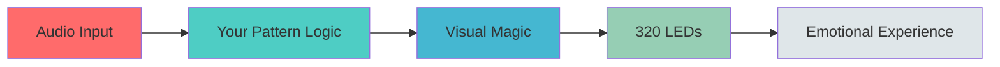
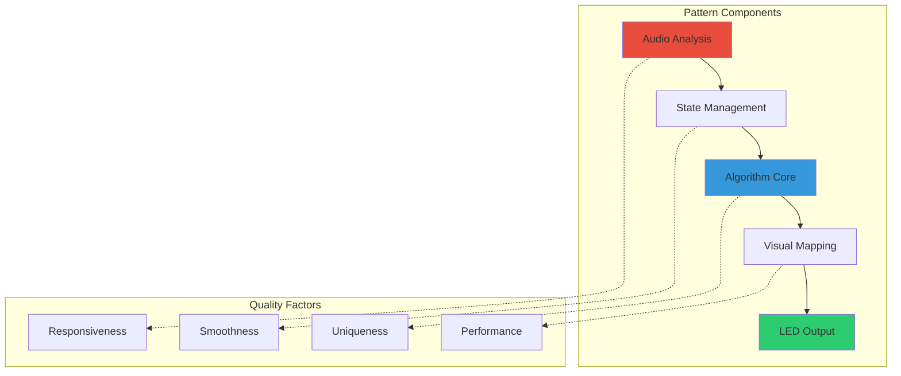
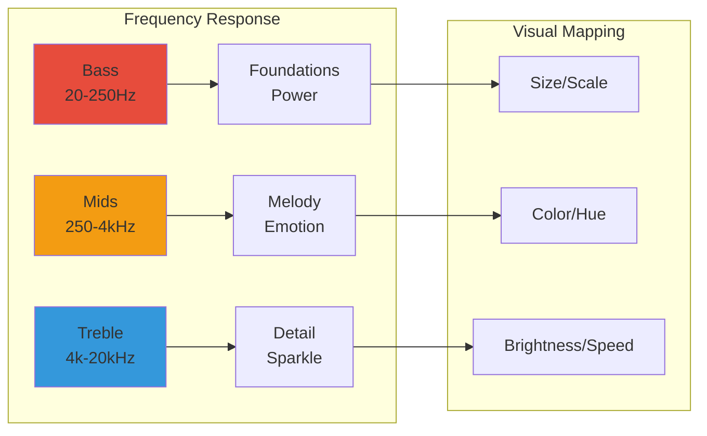
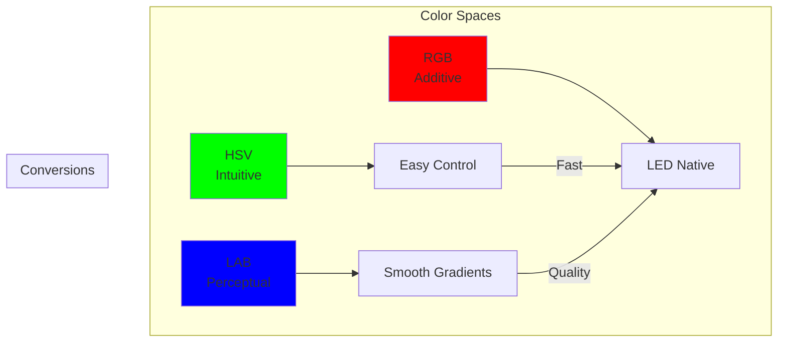
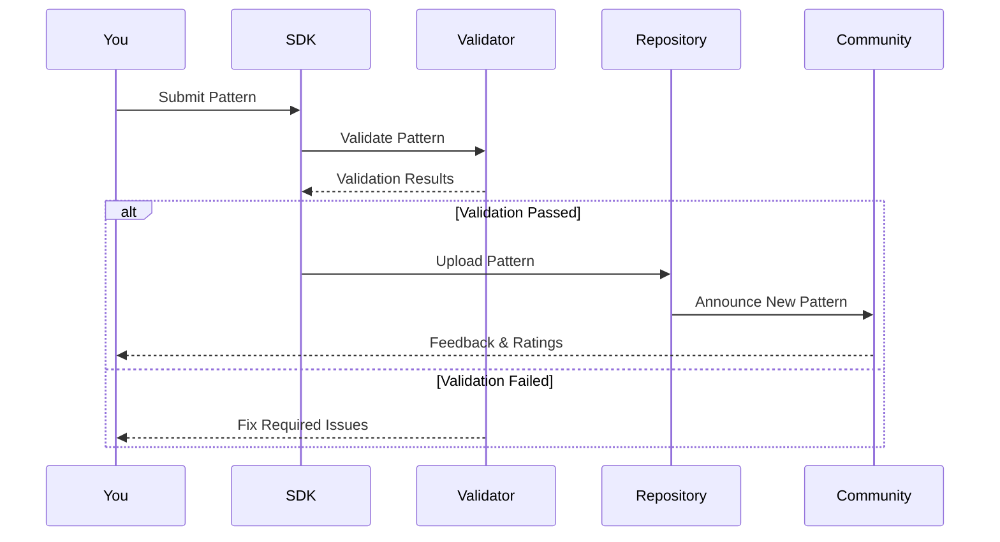

# PATTERN CREATOR'S GUIDE
## From Concept to Community: The Complete Journey

```
╔═══════════════════════════════════════════════════════════════╗
║                  🎨 PATTERN CREATOR'S GUIDE 🎨                 ║
║                                                                ║
║        "Transform your vision into living light"               ║
║                                                                ║
║   Beginner ────▶ Intermediate ────▶ Advanced ────▶ Master     ║
╚═══════════════════════════════════════════════════════════════╝
```

---

## TABLE OF CONTENTS

1. [Welcome to Pattern Creation](#welcome)
2. [Your First Pattern](#first-pattern)
3. [Understanding the Audio Pipeline](#audio-pipeline)
4. [Mastering Color Theory](#color-theory)
5. [Motion Dynamics](#motion-dynamics)
6. [Performance Optimization](#performance)
7. [Advanced Techniques](#advanced)
8. [Testing & Debugging](#testing)
9. [Publishing Your Pattern](#publishing)
10. [Community Best Practices](#community)

---

## WELCOME TO PATTERN CREATION {#welcome}

### What is a Pattern?

A pattern is more than code—it's a living, breathing visualization that transforms music into light. Each pattern you create becomes part of the K1 Lightwave ecosystem, ready to paint emotions across 320 LEDs.



### The Pattern Creator's Journey

```
Level 1: Apprentice (Week 1)
├── Create simple reactive effects
├── Understand basic audio response
└── Master fundamental colors

Level 2: Journeyman (Month 1)
├── Implement complex algorithms
├── Optimize performance
└── Create unique visual signatures

Level 3: Master (Month 3)
├── Push hardware limits
├── Innovate new techniques
└── Inspire the community

Level 4: Visionary (Month 6+)
├── Define new paradigms
├── Mentor others
└── Shape the future
```

---

## YOUR FIRST PATTERN {#first-pattern}

### Step 1: Setting Up Your Environment

```bash
# Install K1 Pattern SDK
npm install -g k1-pattern-sdk

# Create your first pattern
k1-pattern create MyFirstPattern

# Navigate to your pattern
cd MyFirstPattern

# Open in your favorite editor
code .
```

### Step 2: Understanding the Pattern Structure

```cpp
// MyFirstPattern.h
#pragma once
#include <PatternBase.h>

class MyFirstPattern : public PatternBase {
private:
    // Pattern state variables
    float energy = 0.0f;
    CRGB primaryColor = CRGB::Blue;
    
public:
    // Required: Pattern metadata
    PatternMetadata getMetadata() override {
        return {
            .name = "My First Pattern",
            .author = "Your Name",
            .version = "1.0.0",
            .description = "A journey begins with a single LED"
        };
    }
    
    // Required: Initialize your pattern
    void initialize() override {
        // Set up initial state
        energy = 0.0f;
        primaryColor = CRGB::Blue;
    }
    
    // Required: The magic happens here
    void render(CRGB* leds, const AudioData& audio) override {
        // Your visualization logic
        updateEnergy(audio);
        generateVisuals(leds);
    }
    
private:
    void updateEnergy(const AudioData& audio) {
        // React to the music
        energy = audio.amplitude * 0.1f + energy * 0.9f; // Smooth the energy
    }
    
    void generateVisuals(CRGB* leds) {
        // Create the visual effect
        for (int i = 0; i < NUM_LEDS; i++) {
            float brightness = sin(i * 0.1f + millis() * 0.001f) * energy;
            leds[i] = primaryColor;
            leds[i].fadeToBlackBy(255 - brightness * 255);
        }
    }
};
```

### Step 3: The Anatomy of a Great Pattern



### Your First Pattern: Pulse

Let's create a simple but beautiful pulse effect that responds to music:

```cpp
class PulsePattern : public PatternBase {
private:
    struct Pulse {
        float position;
        float velocity;
        float size;
        float brightness;
        CRGB color;
    };
    
    static constexpr int MAX_PULSES = 5;
    Pulse pulses[MAX_PULSES];
    float beatEnergy = 0.0f;
    
public:
    void initialize() override {
        // Initialize pulses at center
        for (int i = 0; i < MAX_PULSES; i++) {
            pulses[i] = {
                .position = NUM_LEDS / 2.0f,
                .velocity = 0.0f,
                .size = 0.0f,
                .brightness = 0.0f,
                .color = CRGB::Black
            };
        }
    }
    
    void render(CRGB* leds, const AudioData& audio) override {
        // Detect beats
        if (audio.beat.detected && beatEnergy < 0.5f) {
            spawnPulse(audio);
        }
        
        // Update beat energy
        beatEnergy = audio.beat.detected ? 1.0f : beatEnergy * 0.95f;
        
        // Clear the strip
        fadeToBlackBy(leds, NUM_LEDS, 20);
        
        // Update and render each pulse
        for (int i = 0; i < MAX_PULSES; i++) {
            updatePulse(pulses[i], audio);
            renderPulse(pulses[i], leds);
        }
    }
    
private:
    void spawnPulse(const AudioData& audio) {
        // Find an inactive pulse
        for (int i = 0; i < MAX_PULSES; i++) {
            if (pulses[i].brightness < 0.01f) {
                pulses[i] = {
                    .position = NUM_LEDS / 2.0f,
                    .velocity = (i % 2 == 0) ? 2.0f : -2.0f,
                    .size = 5.0f + audio.amplitude * 10.0f,
                    .brightness = 1.0f,
                    .color = CHSV(audio.dominantFrequency * 255, 255, 255)
                };
                break;
            }
        }
    }
    
    void updatePulse(Pulse& pulse, const AudioData& audio) {
        // Move the pulse
        pulse.position += pulse.velocity;
        
        // Bounce at edges
        if (pulse.position < 0 || pulse.position >= NUM_LEDS) {
            pulse.velocity *= -0.9f; // Lose some energy on bounce
            pulse.position = constrain(pulse.position, 0, NUM_LEDS - 1);
        }
        
        // Fade out
        pulse.brightness *= 0.98f;
        
        // React to audio
        pulse.size = pulse.size * 0.9f + audio.amplitude * 5.0f * 0.1f;
    }
    
    void renderPulse(const Pulse& pulse, CRGB* leds) {
        if (pulse.brightness < 0.01f) return;
        
        // Render pulse with gaussian falloff
        for (int i = 0; i < NUM_LEDS; i++) {
            float distance = abs(i - pulse.position);
            if (distance < pulse.size) {
                float intensity = exp(-distance * distance / (pulse.size * pulse.size));
                intensity *= pulse.brightness;
                
                CRGB pixelColor = pulse.color;
                pixelColor.nscale8(intensity * 255);
                
                leds[i] += pixelColor; // Additive blending
            }
        }
    }
};
```

---

## UNDERSTANDING THE AUDIO PIPELINE {#audio-pipeline}

### Audio Data Structure

The heart of every pattern is its response to music. Understanding the audio data structure is crucial:

```cpp
struct AudioData {
    // Time Domain
    float waveform[WAVEFORM_SIZE];      // Raw audio samples
    float amplitude;                     // Current amplitude (0-1)
    float peakAmplitude;                // Recent peak amplitude
    
    // Frequency Domain
    float spectrum[SPECTRUM_SIZE];       // FFT frequency bins
    float bass;                         // Low frequency energy (0-1)
    float mid;                          // Mid frequency energy (0-1)
    float treble;                       // High frequency energy (0-1)
    float dominantFrequency;            // Normalized dominant frequency
    
    // Rhythm Analysis
    struct {
        bool detected;                   // Beat detected this frame
        float confidence;               // Beat detection confidence (0-1)
        float bpm;                      // Estimated BPM
        float phase;                    // Beat phase (0-1)
    } beat;
    
    // Advanced Features
    float spectralCentroid;             // Brightness measure
    float spectralFlux;                 // Change in spectrum
    float zeroCrossingRate;             // Percussion indicator
    Chromagram chromagram;              // 12-note harmonic analysis
};
```

### Audio Response Patterns



### Common Audio Response Techniques

#### 1. Amplitude Following
```cpp
// Simple amplitude response
float smoothedAmplitude = 0.0f;

void updateAmplitude(const AudioData& audio) {
    // Smooth the amplitude for less jittery response
    float attack = 0.1f;   // How quickly to respond to increases
    float release = 0.05f; // How quickly to fade
    
    float target = audio.amplitude;
    if (target > smoothedAmplitude) {
        smoothedAmplitude += (target - smoothedAmplitude) * attack;
    } else {
        smoothedAmplitude += (target - smoothedAmplitude) * release;
    }
}
```

#### 2. Frequency Band Isolation
```cpp
// React to specific frequency ranges
void analyzeBands(const AudioData& audio) {
    // Custom frequency band analysis
    float subBass = averageFrequencies(audio.spectrum, 20, 60);
    float kickDrum = averageFrequencies(audio.spectrum, 60, 130);
    float snare = averageFrequencies(audio.spectrum, 200, 300);
    float vocals = averageFrequencies(audio.spectrum, 300, 3000);
    float cymbals = averageFrequencies(audio.spectrum, 6000, 16000);
    
    // Map to visual elements
    bassResponse = subBass + kickDrum;
    rhythmResponse = snare;
    melodyResponse = vocals;
    detailResponse = cymbals;
}
```

#### 3. Beat Synchronization
```cpp
// Sync effects to the beat
class BeatSyncEffect {
    float beatPhase = 0.0f;
    float beatRate = 1.0f;
    
    void update(const AudioData& audio) {
        if (audio.beat.detected) {
            // Reset phase on beat
            beatPhase = 0.0f;
            // Adjust rate based on BPM
            beatRate = audio.beat.bpm / 120.0f; // Normalized to 120 BPM
        }
        
        // Advance phase
        beatPhase += 0.01f * beatRate;
        if (beatPhase > 1.0f) beatPhase -= 1.0f;
        
        // Create beat-synced wave
        float wave = sin(beatPhase * TWO_PI);
    }
};
```

---

## MASTERING COLOR THEORY {#color-theory}

### Color Space Understanding



### Color Harmony Techniques

#### 1. Complementary Colors
```cpp
CRGB getComplementary(CRGB color) {
    CHSV hsv = rgb2hsv_approximate(color);
    hsv.hue += 128; // 180 degrees in HSV
    return CHSV(hsv);
}
```

#### 2. Triadic Harmony
```cpp
void getTriadic(CRGB base, CRGB& color1, CRGB& color2) {
    CHSV hsv = rgb2hsv_approximate(base);
    color1 = CHSV(hsv.hue + 85, hsv.sat, hsv.val);  // +120 degrees
    color2 = CHSV(hsv.hue + 170, hsv.sat, hsv.val); // +240 degrees
}
```

#### 3. Gradient Magic
```cpp
class GradientEffect {
    CRGBPalette16 musicPalette;
    
    void updatePalette(const AudioData& audio) {
        // Create dynamic palette based on audio
        CRGB color1 = CHSV(audio.bass * 255, 255, 255);
        CRGB color2 = CHSV(audio.mid * 255, 200, 255);
        CRGB color3 = CHSV(audio.treble * 255, 150, 255);
        
        musicPalette = CRGBPalette16(
            color1, color2, color3, color1,
            color2, color3, color1, color2,
            color3, color1, color2, color3,
            color1, color2, color3, color1
        );
    }
    
    void render(CRGB* leds) {
        // Map palette to LEDs with motion
        uint8_t startIndex = millis() / 10;
        fill_palette(leds, NUM_LEDS, startIndex, 255 / NUM_LEDS,
                    musicPalette, 255, LINEARBLEND);
    }
};
```

### Advanced Color Techniques

#### Perceptual Brightness Correction
```cpp
// Human eyes perceive colors differently
CRGB perceptualDim(CRGB color, float amount) {
    // Weight channels by perceptual importance
    float r = color.r * 0.299f;
    float g = color.g * 0.587f;
    float b = color.b * 0.114f;
    float brightness = (r + g + b) / 255.0f;
    
    // Gamma-correct dimming
    float dimmed = pow(brightness * amount, 2.2f);
    
    return color.nscale8(dimmed * 255);
}
```

---

## MOTION DYNAMICS {#motion-dynamics}

### Types of Motion

```
Linear Motion      ━━━━━▶
Oscillating       ◀━━━━▶
Circular          ↻ ○ ↺
Explosive         💥→→→
Organic          〰️〰️〰️
Quantum          ✨?✨?✨
```

### Physics-Based Motion

#### 1. Spring System
```cpp
class SpringMotion {
    struct Spring {
        float position;
        float velocity;
        float target;
        float stiffness = 0.1f;
        float damping = 0.9f;
    };
    
    void update(Spring& spring) {
        // Calculate spring force
        float force = (spring.target - spring.position) * spring.stiffness;
        
        // Apply force to velocity
        spring.velocity += force;
        
        // Apply damping
        spring.velocity *= spring.damping;
        
        // Update position
        spring.position += spring.velocity;
    }
};
```

#### 2. Particle System
```cpp
class ParticleSystem {
    struct Particle {
        float position;
        float velocity;
        float life;
        CRGB color;
    };
    
    static constexpr int MAX_PARTICLES = 50;
    Particle particles[MAX_PARTICLES];
    
    void emit(float position, const AudioData& audio) {
        for (int i = 0; i < MAX_PARTICLES; i++) {
            if (particles[i].life <= 0) {
                particles[i] = {
                    .position = position,
                    .velocity = random(-5, 5) * audio.amplitude,
                    .life = 1.0f,
                    .color = CHSV(random8(), 255, 255)
                };
                break;
            }
        }
    }
    
    void update() {
        for (auto& p : particles) {
            if (p.life > 0) {
                p.position += p.velocity;
                p.velocity *= 0.98f; // Friction
                p.life -= 0.02f;
                
                // Bounce at edges
                if (p.position < 0 || p.position >= NUM_LEDS) {
                    p.velocity *= -0.8f;
                    p.position = constrain(p.position, 0, NUM_LEDS - 1);
                }
            }
        }
    }
};
```

#### 3. Wave Propagation
```cpp
class WaveMotion {
    float waveBuffer[NUM_LEDS];
    float waveVelocity[NUM_LEDS];
    
    void propagate() {
        const float tension = 0.025f;
        const float damping = 0.999f;
        
        // Calculate forces
        for (int i = 1; i < NUM_LEDS - 1; i++) {
            float force = (waveBuffer[i-1] + waveBuffer[i+1]) / 2 - waveBuffer[i];
            waveVelocity[i] += force * tension;
        }
        
        // Update positions
        for (int i = 0; i < NUM_LEDS; i++) {
            waveVelocity[i] *= damping;
            waveBuffer[i] += waveVelocity[i];
        }
    }
    
    void excite(int position, float energy) {
        waveBuffer[position] += energy;
    }
};
```

---

## PERFORMANCE OPTIMIZATION {#performance}

### Performance Hierarchy

```
┌─────────────────────────────────────────────────┐
│              PERFORMANCE TARGETS                 │
├─────────────────────────────────────────────────┤
│ CRITICAL: 120 FPS minimum (8.33ms frame time)  │
│ OPTIMAL:  150+ FPS (6.67ms frame time)         │
│ AMAZING:  200+ FPS (5ms frame time)            │
└─────────────────────────────────────────────────┘
```

### Optimization Techniques

#### 1. Precomputation
```cpp
class OptimizedPattern {
    // Precompute expensive values
    static constexpr int LUT_SIZE = 256;
    uint8_t sineLUT[LUT_SIZE];
    uint8_t expLUT[LUT_SIZE];
    
    void initialize() override {
        // Build lookup tables
        for (int i = 0; i < LUT_SIZE; i++) {
            float normalized = i / float(LUT_SIZE - 1);
            sineLUT[i] = sin(normalized * TWO_PI) * 127 + 128;
            expLUT[i] = exp(-normalized * 3) * 255;
        }
    }
    
    // Use lookup instead of calculation
    uint8_t fastSin(uint8_t angle) {
        return sineLUT[angle];
    }
};
```

#### 2. Fixed-Point Math
```cpp
// Replace floating point with fixed point
class FixedPointPattern {
    // 16.16 fixed point type
    using Fixed16 = int32_t;
    
    static constexpr Fixed16 toFixed(float f) {
        return f * 65536;
    }
    
    static constexpr float fromFixed(Fixed16 f) {
        return f / 65536.0f;
    }
    
    Fixed16 position = 0;
    Fixed16 velocity = toFixed(1.5f);
    
    void update() {
        // All math in fixed point
        position += velocity;
        
        // Wrap around
        if (position >= toFixed(NUM_LEDS)) {
            position -= toFixed(NUM_LEDS);
        }
    }
};
```

#### 3. Loop Optimization
```cpp
// Optimize hot loops
void optimizedRender(CRGB* leds) {
    // Unroll small loops
    for (int i = 0; i < NUM_LEDS; i += 4) {
        leds[i]   = calculatePixel(i);
        leds[i+1] = calculatePixel(i+1);
        leds[i+2] = calculatePixel(i+2);
        leds[i+3] = calculatePixel(i+3);
    }
    
    // Use pointer arithmetic
    CRGB* end = leds + NUM_LEDS;
    while (leds < end) {
        *leds++ = calculatePixel(leds - start);
    }
}
```

### Performance Profiling

```cpp
class PatternProfiler {
    uint32_t frameStart;
    uint32_t audioTime;
    uint32_t renderTime;
    uint32_t outputTime;
    
    void beginFrame() {
        frameStart = micros();
    }
    
    void markAudioComplete() {
        audioTime = micros() - frameStart;
    }
    
    void markRenderComplete() {
        renderTime = micros() - frameStart - audioTime;
    }
    
    void endFrame() {
        outputTime = micros() - frameStart - audioTime - renderTime;
        
        if (frameCount % 100 == 0) {
            Serial.printf("Frame %d: Audio=%dus Render=%dus Output=%dus Total=%dus\n",
                         frameCount, audioTime, renderTime, outputTime,
                         audioTime + renderTime + outputTime);
        }
    }
};
```

---

## ADVANCED TECHNIQUES {#advanced}

### Multi-Layer Compositing

```cpp
class LayeredPattern : public PatternBase {
    // Multiple visual layers
    Layer backgroundLayer;
    Layer midgroundLayer;
    Layer foregroundLayer;
    Layer effectsLayer;
    
    void render(CRGB* leds, const AudioData& audio) override {
        // Clear buffer
        fill_solid(leds, NUM_LEDS, CRGB::Black);
        
        // Render each layer
        backgroundLayer.render(leds, audio, BLEND_ADD);
        midgroundLayer.render(leds, audio, BLEND_SCREEN);
        foregroundLayer.render(leds, audio, BLEND_LIGHTEST);
        effectsLayer.render(leds, audio, BLEND_OVERLAY);
    }
};
```

### State Machine Patterns

```cpp
class StatePattern : public PatternBase {
    enum State {
        IDLE,
        BUILD_UP,
        DROP,
        BREAKDOWN
    };
    
    State currentState = IDLE;
    float stateProgress = 0.0f;
    
    void updateState(const AudioData& audio) {
        switch (currentState) {
            case IDLE:
                if (audio.amplitude > 0.7f) {
                    transitionTo(BUILD_UP);
                }
                break;
                
            case BUILD_UP:
                stateProgress += 0.01f;
                if (stateProgress > 1.0f || audio.beat.detected) {
                    transitionTo(DROP);
                }
                break;
                
            case DROP:
                if (audio.amplitude < 0.3f) {
                    transitionTo(BREAKDOWN);
                }
                break;
                
            case BREAKDOWN:
                stateProgress -= 0.005f;
                if (stateProgress < 0) {
                    transitionTo(IDLE);
                }
                break;
        }
    }
    
    void renderState(CRGB* leds) {
        switch (currentState) {
            case IDLE:
                renderIdleState(leds);
                break;
            case BUILD_UP:
                renderBuildUp(leds, stateProgress);
                break;
            case DROP:
                renderDrop(leds);
                break;
            case BREAKDOWN:
                renderBreakdown(leds, stateProgress);
                break;
        }
    }
};
```

### Generative Algorithms

```cpp
class GenerativePattern : public PatternBase {
    // L-System for pattern generation
    struct LSystem {
        string axiom = "F";
        map<char, string> rules = {
            {'F', "FF+[+F-F-F]-[-F+F+F]"}
        };
        
        string generate(int iterations) {
            string current = axiom;
            for (int i = 0; i < iterations; i++) {
                string next;
                for (char c : current) {
                    if (rules.count(c)) {
                        next += rules[c];
                    } else {
                        next += c;
                    }
                }
                current = next;
            }
            return current;
        }
    };
    
    // Cellular Automaton
    class CellularAutomaton {
        bool cells[NUM_LEDS];
        bool nextCells[NUM_LEDS];
        uint8_t rule = 30; // Wolfram rule
        
        void evolve() {
            for (int i = 0; i < NUM_LEDS; i++) {
                int left = (i - 1 + NUM_LEDS) % NUM_LEDS;
                int right = (i + 1) % NUM_LEDS;
                
                uint8_t neighborhood = 
                    (cells[left] << 2) | 
                    (cells[i] << 1) | 
                    cells[right];
                
                nextCells[i] = (rule >> neighborhood) & 1;
            }
            
            memcpy(cells, nextCells, sizeof(cells));
        }
    };
};
```

---

## TESTING & DEBUGGING {#testing}

### Test Harness Setup

```cpp
class PatternTestHarness {
    Pattern* patternUnderTest;
    MockAudioSource audioSource;
    VirtualLEDStrip virtualStrip;
    PerformanceMonitor perfMon;
    
    void runTestSuite() {
        testAudioResponse();
        testVisualQuality();
        testPerformance();
        testEdgeCases();
        testMemorySafety();
    }
    
    void testAudioResponse() {
        // Test with various audio scenarios
        TestScenarios scenarios[] = {
            {"Silence", generateSilence()},
            {"Pure Sine", generateSineWave(440)},
            {"White Noise", generateWhiteNoise()},
            {"Bass Heavy", generateBassHeavy()},
            {"Complex Music", loadTestTrack()}
        };
        
        for (auto& scenario : scenarios) {
            audioSource.setSource(scenario.audio);
            runFrames(300); // 5 seconds at 60fps
            
            auto metrics = analyzeResponse();
            ASSERT(metrics.responseTime < 100, "Response too slow");
            ASSERT(metrics.smoothness > 0.8, "Motion not smooth");
        }
    }
};
```

### Debugging Techniques

#### Visual Debugging
```cpp
class DebugPattern : public PatternBase {
    bool debugMode = true;
    
    void render(CRGB* leds, const AudioData& audio) override {
        if (debugMode) {
            // Show audio levels as bars
            int bassBar = audio.bass * NUM_LEDS / 3;
            int midBar = audio.mid * NUM_LEDS / 3;
            int trebleBar = audio.treble * NUM_LEDS / 3;
            
            fill_solid(leds, bassBar, CRGB::Red);
            fill_solid(leds + NUM_LEDS/3, midBar, CRGB::Green);
            fill_solid(leds + 2*NUM_LEDS/3, trebleBar, CRGB::Blue);
            
            // Flash on beat
            if (audio.beat.detected) {
                fill_solid(leds, NUM_LEDS, CRGB::White);
            }
        } else {
            // Normal pattern rendering
            normalRender(leds, audio);
        }
    }
};
```

#### Performance Debugging
```cpp
#ifdef DEBUG_PERFORMANCE
    #define PERF_START(name) uint32_t _perf_##name = micros()
    #define PERF_END(name) Serial.printf(#name ": %dus\n", micros() - _perf_##name)
#else
    #define PERF_START(name)
    #define PERF_END(name)
#endif

void render(CRGB* leds, const AudioData& audio) {
    PERF_START(total);
    
    PERF_START(audio_analysis);
    analyzeAudio(audio);
    PERF_END(audio_analysis);
    
    PERF_START(state_update);
    updateState();
    PERF_END(state_update);
    
    PERF_START(render_pixels);
    renderPixels(leds);
    PERF_END(render_pixels);
    
    PERF_END(total);
}
```

---

## PUBLISHING YOUR PATTERN {#publishing}

### Pre-Publishing Checklist

```
□ Pattern runs at 120+ FPS
□ No memory leaks detected
□ Responds well to various music genres
□ Parameters are well-documented
□ Code follows style guidelines
□ Includes at least 3 presets
□ Has preview video/images
□ Metadata is complete
□ Tests pass 100%
□ Community guidelines followed
```

### Creating Your Lightshow Card

```bash
# Generate lightshow card automatically
k1-pattern generate-card MyPattern.cpp

# Review the generated card
cat MyPattern_card.json

# Create preview media
k1-pattern record-preview MyPattern.cpp --duration 30s --audio sample.mp3

# Package everything
k1-pattern package MyPattern.cpp --include-media
```

### Publishing Process



---

## COMMUNITY BEST PRACTICES {#community}

### Sharing Philosophy

> "A pattern shared is a pattern evolved"

When you share your pattern, you're not just sharing code—you're sharing:
- Your unique perspective
- A new way to experience music
- Inspiration for others
- Part of yourself

### Attribution and Remixing

```cpp
// Always attribute original creators
class RemixedPattern : public OriginalPattern {
    PatternMetadata getMetadata() override {
        return {
            .name = "Original Pattern (Your Remix)",
            .author = "You",
            .originalAuthor = "Original Creator",
            .version = "1.0.0-remix",
            .description = "Remix: Added dynamic color shifts"
        };
    }
};
```

### Community Engagement

1. **Share Your Story**: Why did you create this pattern?
2. **Document Your Process**: Help others learn
3. **Accept Feedback**: Every comment helps you grow
4. **Remix Respectfully**: Always credit originals
5. **Teach Others**: Your knowledge multiplies when shared

---

## PATTERN PHILOSOPHY

### The Four Pillars

```
     Performance                    Creativity
         ▲                              ▲
         │                              │
    ┌────┴────┐                    ┌────┴────┐
    │ Fast    │                    │ Unique  │
    │ Smooth  │                    │ Expressive│
    │ Efficient│                    │ Beautiful│
    └─────────┘                    └─────────┘
         │                              │
         ▼                              ▼
   Accessibility                   Community
```

### Your Creative Journey

Remember:
- **Every pattern starts simple**: Don't aim for perfection immediately
- **Iterate constantly**: Each version teaches you something
- **Music is your guide**: Let the audio drive your decisions
- **Performance matters**: But not at the cost of beauty
- **Share early, share often**: Community feedback accelerates growth

### Inspirational Patterns to Study

1. **Visualiception**: Multi-layered motion systems
2. **Quantum Collapse**: Chaos theory in action
3. **Bloom Mode**: Organic growth patterns
4. **Waveform**: Elegant simplicity

---

## RESOURCES AND NEXT STEPS

### Essential Resources

- **SDK Documentation**: [k1-lightwave.dev/docs](https://k1-lightwave.dev/docs)
- **Pattern Gallery**: [k1-lightwave.dev/patterns](https://k1-lightwave.dev/patterns)
- **Community Forum**: [forum.k1-lightwave.dev](https://forum.k1-lightwave.dev)
- **Video Tutorials**: [youtube.com/k1lightwave](https://youtube.com/k1lightwave)

### Challenge Yourself

**Week 1 Challenge**: Create a pattern that responds only to bass frequencies
**Week 2 Challenge**: Implement smooth color transitions based on harmony
**Week 3 Challenge**: Create a pattern with multiple visual layers
**Week 4 Challenge**: Optimize your pattern to run at 200+ FPS

### Join the Revolution

The K1 Lightwave community is more than developers—we're artists, dreamers, and pioneers. Every pattern you create adds to the collective canvas of human creativity.

```
┌─────────────────────────────────────────────────┐
│                                                 │
│   "In code we trust, in light we create,       │
│    in community we thrive."                     │
│                                                 │
│              Welcome, Pattern Creator.          │
│              Your journey begins now.           │
│                                                 │
└─────────────────────────────────────────────────┘
```

---

*Pattern Creator's Guide v1.0*
*For the artists, by the artists*

**K1 LIGHTWAVE: WHERE YOUR CREATIVITY BECOMES LIGHT**