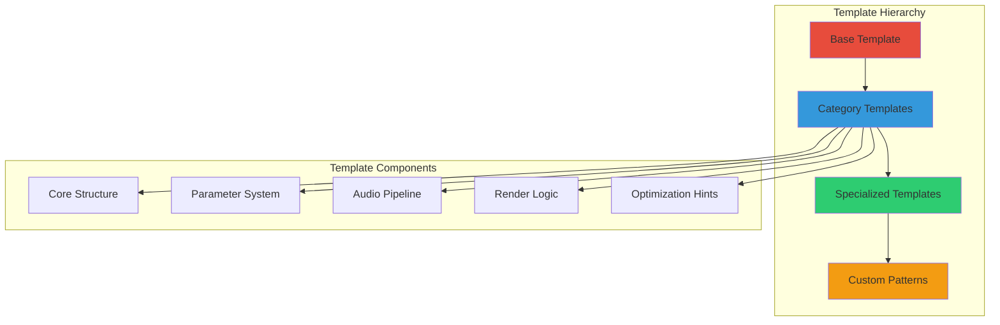

# PATTERN TEMPLATE SYSTEM
## Architectural Framework for Rapid Pattern Development

```
████████╗███████╗███╗   ███╗██████╗ ██╗      █████╗ ████████╗███████╗
╚══██╔══╝██╔════╝████╗ ████║██╔══██╗██║     ██╔══██╗╚══██╔══╝██╔════╝
   ██║   █████╗  ██╔████╔██║██████╔╝██║     ███████║   ██║   █████╗  
   ██║   ██╔══╝  ██║╚██╔╝██║██╔═══╝ ██║     ██╔══██║   ██║   ██╔══╝  
   ██║   ███████╗██║ ╚═╝ ██║██║     ███████╗██║  ██║   ██║   ███████╗
   ╚═╝   ╚══════╝╚═╝     ╚═╝╚═╝     ╚══════╝╚═╝  ╚═╝   ╚═╝   ╚══════╝
                        SYSTEM SPECIFICATION v1.0
```

---

## ARCHITECTURAL OVERVIEW

The Pattern Template System provides a comprehensive framework for generating new patterns from proven architectures. By abstracting common functionality into reusable templates, we accelerate development while maintaining quality standards.

### System Philosophy



---

## BASE PATTERN TEMPLATE

### Core Template Structure

```cpp
// PatternTemplate.h - The foundational template
#pragma once
#include <LightwaveCore.h>
#include <AudioProcessor.h>
#include <ColorEngine.h>
#include <PerformanceMonitor.h>

namespace LightwaveTemplates {

template<typename DerivedPattern>
class PatternTemplate : public IPattern {
protected:
    // ============== CORE STATE ==============
    struct PatternState {
        // Timing
        uint32_t frameCount = 0;
        uint32_t lastFrameTime = 0;
        float deltaTime = 0.0f;
        
        // Audio state
        AudioState audioState;
        float smoothedAmplitude = 0.0f;
        float beatPhase = 0.0f;
        
        // Visual state
        float globalBrightness = 1.0f;
        float effectIntensity = 1.0f;
        CRGB primaryColor = CRGB::White;
        
        // Performance tracking
        PerformanceMetrics metrics;
    } state;
    
    // ============== PARAMETER SYSTEM ==============
    struct ParameterDefinitions {
        Parameter brightness{"brightness", 0.0f, 1.0f, 1.0f, 0.01f};
        Parameter speed{"speed", 0.0f, 5.0f, 1.0f, 0.1f};
        Parameter sensitivity{"sensitivity", 0.0f, 2.0f, 1.0f, 0.1f};
        Parameter colorMode{"color_mode", 0, 3, 0, 1};
        
        // Template method for derived patterns to add parameters
        virtual void defineCustomParameters() {}
    } parameters;
    
    // ============== CONFIGURATION ==============
    struct PatternConfig {
        bool enableAudioResponse = true;
        bool enableBeatSync = true;
        bool enableColorCycling = false;
        bool enableMirroring = false;
        
        // Performance hints
        bool useFixedPoint = false;
        bool useLookupTables = false;
        uint8_t maxCPUPercent = 25;
    } config;
    
public:
    // ============== LIFECYCLE METHODS ==============
    
    void initialize() override final {
        // Base initialization
        initializeState();
        initializeParameters();
        
        // Call derived pattern initialization
        static_cast<DerivedPattern*>(this)->onInitialize();
        
        // Post-initialization validation
        validateConfiguration();
    }
    
    void render(CRGB* leds, const AudioData& audio) override final {
        // Pre-render updates
        updateTiming();
        updateAudioState(audio);
        
        // Performance tracking
        state.metrics.startFrame();
        
        // Clear or fade based on pattern needs
        static_cast<DerivedPattern*>(this)->prepareLEDs(leds);
        
        // Main render call to derived pattern
        static_cast<DerivedPattern*>(this)->renderPattern(leds, audio);
        
        // Post-processing
        applyGlobalEffects(leds);
        
        // Performance tracking
        state.metrics.endFrame();
        state.frameCount++;
    }
    
    void cleanup() override final {
        // Save any persistent state
        savePersistentState();
        
        // Call derived cleanup
        static_cast<DerivedPattern*>(this)->onCleanup();
        
        // Base cleanup
        releaseResources();
    }
    
protected:
    // ============== TEMPLATE METHODS FOR DERIVED PATTERNS ==============
    
    // Required implementations
    virtual void onInitialize() = 0;
    virtual void renderPattern(CRGB* leds, const AudioData& audio) = 0;
    
    // Optional implementations with defaults
    virtual void onCleanup() {}
    virtual void prepareLEDs(CRGB* leds) {
        fadeToBlackBy(leds, NUM_LEDS, 20);
    }
    
    // ============== UTILITY METHODS ==============
    
    void updateAudioState(const AudioData& audio) {
        // Smooth amplitude tracking
        float targetAmp = audio.amplitude * parameters.sensitivity.getValue();
        state.smoothedAmplitude += (targetAmp - state.smoothedAmplitude) * 0.1f;
        
        // Beat tracking
        if (audio.beat.detected) {
            state.beatPhase = 0.0f;
        } else {
            state.beatPhase += state.deltaTime * (audio.beat.bpm / 60.0f);
            if (state.beatPhase > 1.0f) state.beatPhase -= 1.0f;
        }
        
        // Update audio state
        state.audioState.update(audio);
    }
    
    void applyGlobalEffects(CRGB* leds) {
        // Apply brightness
        if (state.globalBrightness < 1.0f) {
            for (int i = 0; i < NUM_LEDS; i++) {
                leds[i].nscale8(state.globalBrightness * 255);
            }
        }
        
        // Apply mirroring if enabled
        if (config.enableMirroring) {
            mirrorPattern(leds);
        }
    }
    
    // ============== HELPER CLASSES ==============
    
    class AudioState {
        struct FrequencyBand {
            float current = 0.0f;
            float smoothed = 0.0f;
            float peak = 0.0f;
            float average = 0.0f;
        };
        
        FrequencyBand bass, mid, treble;
        
    public:
        void update(const AudioData& audio) {
            updateBand(bass, audio.bass);
            updateBand(mid, audio.mid);
            updateBand(treble, audio.treble);
        }
        
    private:
        void updateBand(FrequencyBand& band, float value) {
            band.current = value;
            band.smoothed += (value - band.smoothed) * 0.1f;
            band.peak = max(band.peak * 0.99f, value);
            band.average = band.average * 0.95f + value * 0.05f;
        }
    };
};

} // namespace LightwaveTemplates
```

---

## CATEGORY TEMPLATES

### 1. Reactive Pattern Template

```cpp
template<typename Derived>
class ReactivePatternTemplate : public PatternTemplate<Derived> {
protected:
    // Reactive-specific state
    struct ReactiveState {
        float energyLevel = 0.0f;
        float reactionSpeed = 0.1f;
        float threshold = 0.3f;
        bool isReacting = false;
    } reactive;
    
    // Additional parameters for reactive patterns
    struct ReactiveParameters {
        Parameter attackTime{"attack", 0.01f, 0.5f, 0.1f, 0.01f};
        Parameter releaseTime{"release", 0.01f, 2.0f, 0.5f, 0.01f};
        Parameter threshold{"threshold", 0.0f, 1.0f, 0.3f, 0.05f};
        Parameter reactivity{"reactivity", 0.0f, 1.0f, 0.7f, 0.05f};
    } reactiveParams;
    
public:
    void onInitialize() override {
        this->config.enableAudioResponse = true;
        this->config.enableBeatSync = true;
    }
    
protected:
    void updateReactiveState(const AudioData& audio) {
        float input = getReactiveInput(audio);
        
        // Threshold detection
        reactive.isReacting = input > reactive.threshold;
        
        // Energy envelope
        if (reactive.isReacting) {
            // Attack
            float attack = reactiveParams.attackTime.getValue();
            reactive.energyLevel += (1.0f - reactive.energyLevel) * attack;
        } else {
            // Release
            float release = reactiveParams.releaseTime.getValue();
            reactive.energyLevel *= (1.0f - release);
        }
        
        // Apply reactivity scaling
        reactive.energyLevel *= reactiveParams.reactivity.getValue();
    }
    
    virtual float getReactiveInput(const AudioData& audio) {
        // Default: react to overall amplitude
        return audio.amplitude;
    }
    
    // Reactive utility functions
    float getReactiveValue(float baseValue) {
        return baseValue * reactive.energyLevel;
    }
    
    CRGB getReactiveColor(CRGB baseColor) {
        return baseColor.scale8(reactive.energyLevel * 255);
    }
};
```

### 2. Wave Pattern Template

```cpp
template<typename Derived>
class WavePatternTemplate : public PatternTemplate<Derived> {
protected:
    struct WaveState {
        float phase[MAX_WAVES];
        float frequency[MAX_WAVES];
        float amplitude[MAX_WAVES];
        int waveCount = 1;
    } waves;
    
    struct WaveParameters {
        Parameter waveCount{"wave_count", 1, MAX_WAVES, 1, 1};
        Parameter frequency{"frequency", 0.1f, 10.0f, 1.0f, 0.1f};
        Parameter wavelength{"wavelength", 1.0f, 100.0f, 20.0f, 1.0f};
        Parameter interference{"interference", 0.0f, 1.0f, 0.5f, 0.05f};
    } waveParams;
    
    static constexpr int MAX_WAVES = 4;
    
protected:
    void updateWaves(float deltaTime) {
        for (int w = 0; w < waves.waveCount; w++) {
            waves.phase[w] += waves.frequency[w] * deltaTime;
            if (waves.phase[w] > TWO_PI) waves.phase[w] -= TWO_PI;
        }
    }
    
    float calculateWaveValue(float position) {
        float result = 0.0f;
        
        for (int w = 0; w < waves.waveCount; w++) {
            float wavePos = position / waveParams.wavelength.getValue();
            float value = sin(wavePos * TWO_PI + waves.phase[w]);
            value *= waves.amplitude[w];
            result += value;
        }
        
        // Normalize based on wave count
        return result / waves.waveCount;
    }
    
    void renderWave(CRGB* leds, std::function<CRGB(float)> colorFunc) {
        for (int i = 0; i < NUM_LEDS; i++) {
            float value = calculateWaveValue(i);
            value = (value + 1.0f) * 0.5f; // Normalize to 0-1
            leds[i] = colorFunc(value);
        }
    }
};
```

### 3. Particle Pattern Template

```cpp
template<typename Derived>
class ParticlePatternTemplate : public PatternTemplate<Derived> {
protected:
    struct Particle {
        float position;
        float velocity;
        float life;
        float size;
        CRGB color;
        uint8_t id;
        
        bool isAlive() const { return life > 0.0f; }
    };
    
    struct ParticleSystemConfig {
        int maxParticles = 50;
        float gravity = 0.0f;
        float friction = 0.98f;
        float bounceEnergy = 0.8f;
        bool collisions = false;
        bool wrap = false;
    } particleConfig;
    
    std::vector<Particle> particles;
    uint8_t nextParticleId = 0;
    
protected:
    void initializeParticleSystem() {
        particles.reserve(particleConfig.maxParticles);
    }
    
    Particle* emitParticle(float position, float velocity, CRGB color) {
        // Find dead particle to reuse
        for (auto& p : particles) {
            if (!p.isAlive()) {
                p = createParticle(position, velocity, color);
                return &p;
            }
        }
        
        // Add new particle if space available
        if (particles.size() < particleConfig.maxParticles) {
            particles.push_back(createParticle(position, velocity, color));
            return &particles.back();
        }
        
        return nullptr;
    }
    
    void updateParticles(float deltaTime) {
        for (auto& p : particles) {
            if (!p.isAlive()) continue;
            
            // Physics update
            p.velocity += particleConfig.gravity * deltaTime;
            p.velocity *= particleConfig.friction;
            p.position += p.velocity * deltaTime;
            
            // Boundary handling
            handleBoundaries(p);
            
            // Life update
            p.life -= deltaTime;
        }
        
        // Optional collision detection
        if (particleConfig.collisions) {
            handleCollisions();
        }
    }
    
    void renderParticles(CRGB* leds) {
        for (const auto& p : particles) {
            if (!p.isAlive()) continue;
            renderParticle(leds, p);
        }
    }
    
private:
    Particle createParticle(float pos, float vel, CRGB color) {
        return {
            .position = pos,
            .velocity = vel,
            .life = 1.0f,
            .size = 1.0f,
            .color = color,
            .id = nextParticleId++
        };
    }
    
    void renderParticle(CRGB* leds, const Particle& p) {
        // Gaussian falloff rendering
        for (int i = 0; i < NUM_LEDS; i++) {
            float dist = abs(i - p.position);
            if (dist < p.size * 3) {
                float intensity = exp(-dist * dist / (p.size * p.size));
                intensity *= p.life; // Fade with life
                
                CRGB color = p.color;
                color.nscale8(intensity * 255);
                leds[i] += color; // Additive blending
            }
        }
    }
};
```

### 4. Generative Pattern Template

```cpp
template<typename Derived>
class GenerativePatternTemplate : public PatternTemplate<Derived> {
protected:
    // Rule-based generation system
    struct Rule {
        std::function<bool(int, float)> condition;
        std::function<CRGB(int, float)> action;
        float probability = 1.0f;
    };
    
    std::vector<Rule> rules;
    std::vector<float> stateBuffer;
    std::vector<float> nextStateBuffer;
    
    // Noise generators
    PerlinNoise perlin;
    SimplexNoise simplex;
    CellularNoise cellular;
    
protected:
    void initializeGenerative(int stateSize) {
        stateBuffer.resize(stateSize);
        nextStateBuffer.resize(stateSize);
        
        // Initialize with noise
        for (int i = 0; i < stateSize; i++) {
            stateBuffer[i] = perlin.noise(i * 0.1f);
        }
    }
    
    void addRule(Rule rule) {
        rules.push_back(rule);
    }
    
    void evolveState() {
        // Apply rules to generate next state
        for (int i = 0; i < stateBuffer.size(); i++) {
            float value = stateBuffer[i];
            
            for (const auto& rule : rules) {
                if (rule.condition(i, value)) {
                    if (random8() < rule.probability * 255) {
                        // Apply rule action
                        auto color = rule.action(i, value);
                        nextStateBuffer[i] = (color.r + color.g + color.b) / (3.0f * 255.0f);
                    }
                }
            }
        }
        
        // Swap buffers
        std::swap(stateBuffer, nextStateBuffer);
    }
    
    // Cellular automaton helpers
    void setupElementaryCA(uint8_t rule) {
        rules.clear();
        
        for (int i = 0; i < 8; i++) {
            bool output = (rule >> i) & 1;
            
            addRule({
                .condition = [i](int pos, float val) {
                    int left = (pos - 1 + NUM_LEDS) % NUM_LEDS;
                    int right = (pos + 1) % NUM_LEDS;
                    int pattern = 
                        (stateBuffer[left] > 0.5f ? 4 : 0) |
                        (val > 0.5f ? 2 : 0) |
                        (stateBuffer[right] > 0.5f ? 1 : 0);
                    return pattern == i;
                },
                .action = [output](int pos, float val) {
                    return output ? CRGB::White : CRGB::Black;
                }
            });
        }
    }
};
```

---

## SPECIALIZED TEMPLATES

### Music Visualizer Template

```cpp
template<typename Derived>
class MusicVisualizerTemplate : public ReactivePatternTemplate<Derived> {
protected:
    // Frequency analysis
    struct FrequencyAnalyzer {
        static constexpr int BANDS = 16;
        float bands[BANDS];
        float peakBands[BANDS];
        float avgBands[BANDS];
        
        void analyze(const float* spectrum, int spectrumSize) {
            int binSize = spectrumSize / BANDS;
            
            for (int b = 0; b < BANDS; b++) {
                float sum = 0.0f;
                for (int i = 0; i < binSize; i++) {
                    sum += spectrum[b * binSize + i];
                }
                
                bands[b] = sum / binSize;
                peakBands[b] = max(peakBands[b] * 0.99f, bands[b]);
                avgBands[b] = avgBands[b] * 0.95f + bands[b] * 0.05f;
            }
        }
        
        float getNormalizedBand(int band) {
            if (avgBands[band] > 0) {
                return bands[band] / avgBands[band];
            }
            return bands[band];
        }
    } freqAnalyzer;
    
    // Beat pattern detection
    struct BeatPattern {
        std::vector<float> pattern;
        int currentIndex = 0;
        
        void recordBeat(bool detected) {
            if (pattern.size() < 32) {
                pattern.push_back(detected ? 1.0f : 0.0f);
            } else {
                pattern[currentIndex] = detected ? 1.0f : 0.0f;
                currentIndex = (currentIndex + 1) % pattern.size();
            }
        }
        
        float getPatternMatch(const std::vector<float>& target) {
            float match = 0.0f;
            int size = min(pattern.size(), target.size());
            
            for (int i = 0; i < size; i++) {
                int idx = (currentIndex - i + pattern.size()) % pattern.size();
                match += (pattern[idx] == target[i]) ? 1.0f : 0.0f;
            }
            
            return match / size;
        }
    } beatPattern;
    
protected:
    void analyzeMusic(const AudioData& audio) {
        // Frequency analysis
        freqAnalyzer.analyze(audio.spectrum, SPECTRUM_SIZE);
        
        // Beat pattern tracking
        beatPattern.recordBeat(audio.beat.detected);
        
        // Genre detection hints
        detectGenreHints(audio);
    }
    
    void detectGenreHints(const AudioData& audio) {
        // Simple genre detection based on frequency distribution
        float bassEnergy = 0.0f;
        float midEnergy = 0.0f;
        float highEnergy = 0.0f;
        
        for (int i = 0; i < 4; i++) bassEnergy += freqAnalyzer.bands[i];
        for (int i = 4; i < 12; i++) midEnergy += freqAnalyzer.bands[i];
        for (int i = 12; i < 16; i++) highEnergy += freqAnalyzer.bands[i];
        
        // Normalize
        float total = bassEnergy + midEnergy + highEnergy;
        if (total > 0) {
            bassEnergy /= total;
            midEnergy /= total;
            highEnergy /= total;
        }
        
        // Set visualization hints based on distribution
        if (bassEnergy > 0.6f) {
            // Bass-heavy (EDM, Hip-hop)
            this->config.enableBeatSync = true;
            this->reactive.threshold = 0.7f;
        } else if (midEnergy > 0.6f) {
            // Mid-heavy (Rock, Pop)
            this->reactive.reactionSpeed = 0.15f;
        } else if (highEnergy > 0.4f) {
            // High-heavy (Classical, Jazz)
            this->config.enableColorCycling = true;
            this->reactive.reactionSpeed = 0.05f;
        }
    }
};
```

### Matrix Rain Template

```cpp
template<typename Derived>
class MatrixRainTemplate : public PatternTemplate<Derived> {
protected:
    struct RainDrop {
        float position;
        float speed;
        float length;
        uint8_t hue;
        float brightness;
    };
    
    static constexpr int MAX_DROPS = 20;
    RainDrop drops[MAX_DROPS];
    
    // Matrix-specific parameters
    struct MatrixParameters {
        Parameter dropRate{"drop_rate", 0.0f, 1.0f, 0.3f, 0.05f};
        Parameter dropSpeed{"drop_speed", 0.5f, 5.0f, 2.0f, 0.1f};
        Parameter dropLength{"drop_length", 2.0f, 20.0f, 8.0f, 1.0f};
        Parameter colorShift{"color_shift", 0.0f, 1.0f, 0.1f, 0.05f};
    } matrixParams;
    
protected:
    void onInitialize() override {
        // Initialize drops
        for (int i = 0; i < MAX_DROPS; i++) {
            drops[i] = createRandomDrop();
            // Stagger initial positions
            drops[i].position = random16(NUM_LEDS);
        }
    }
    
    void updateDrops(float deltaTime) {
        for (auto& drop : drops) {
            // Move drop
            drop.position += drop.speed * deltaTime;
            
            // Reset at bottom
            if (drop.position >= NUM_LEDS + drop.length) {
                if (random8() < matrixParams.dropRate.getValue() * 255) {
                    drop = createRandomDrop();
                } else {
                    drop.position = -drop.length;
                }
            }
        }
    }
    
    void renderDrops(CRGB* leds) {
        // Render each drop with trail
        for (const auto& drop : drops) {
            for (float i = 0; i < drop.length; i++) {
                int pos = drop.position - i;
                if (pos >= 0 && pos < NUM_LEDS) {
                    float intensity = (1.0f - i / drop.length) * drop.brightness;
                    intensity = pow(intensity, 2.2f); // Gamma correction
                    
                    CRGB color = CHSV(drop.hue, 255 - i * 10, intensity * 255);
                    leds[pos] = blend(leds[pos], color, intensity * 255);
                }
            }
        }
    }
    
private:
    RainDrop createRandomDrop() {
        return {
            .position = -random16(20),
            .speed = matrixParams.dropSpeed.getValue() * (0.5f + random8() / 255.0f),
            .length = matrixParams.dropLength.getValue() * (0.5f + random8() / 255.0f),
            .hue = 96 + random8(32), // Green range
            .brightness = 0.5f + random8() / 510.0f
        };
    }
};
```

---

## TEMPLATE INSTANTIATION SYSTEM

### Template Factory

```cpp
class PatternTemplateFactory {
private:
    struct TemplateInfo {
        string name;
        string category;
        string description;
        std::function<std::unique_ptr<IPattern>()> creator;
    };
    
    std::map<string, TemplateInfo> templates;
    
public:
    static PatternTemplateFactory& getInstance() {
        static PatternTemplateFactory instance;
        return instance;
    }
    
    template<typename PatternClass>
    void registerTemplate(const string& name, const string& category, 
                         const string& description) {
        templates[name] = {
            .name = name,
            .category = category,
            .description = description,
            .creator = []() { return std::make_unique<PatternClass>(); }
        };
    }
    
    std::unique_ptr<IPattern> createPattern(const string& templateName) {
        auto it = templates.find(templateName);
        if (it != templates.end()) {
            return it->second.creator();
        }
        throw std::runtime_error("Template not found: " + templateName);
    }
    
    std::vector<string> getTemplatesByCategory(const string& category) {
        std::vector<string> result;
        for (const auto& [name, info] : templates) {
            if (info.category == category) {
                result.push_back(name);
            }
        }
        return result;
    }
};

// Template registration macros
#define REGISTER_TEMPLATE(ClassName, TemplateName, Category, Description) \
    namespace { \
        struct ClassName##_Registrar { \
            ClassName##_Registrar() { \
                PatternTemplateFactory::getInstance().registerTemplate<ClassName>( \
                    TemplateName, Category, Description); \
            } \
        } ClassName##_registrar; \
    }
```

### Template Inheritance Example

```cpp
// Using reactive template to create a bass visualizer
class BassBloomPattern : public ReactivePatternTemplate<BassBloomPattern> {
private:
    struct Bloom {
        float position;
        float size;
        float intensity;
        CRGB color;
    };
    
    static constexpr int MAX_BLOOMS = 5;
    Bloom blooms[MAX_BLOOMS];
    
public:
    void onInitialize() override {
        // Configure for bass response
        this->reactive.threshold = 0.6f;
        this->reactiveParams.attackTime.setValue(0.05f);
        this->reactiveParams.releaseTime.setValue(0.3f);
    }
    
    void renderPattern(CRGB* leds, const AudioData& audio) override {
        // Update reactive state
        updateReactiveState(audio);
        
        // Spawn blooms on bass hits
        if (audio.bass > reactive.threshold && reactive.energyLevel > 0.8f) {
            spawnBloom(audio);
        }
        
        // Update and render blooms
        updateBlooms();
        renderBlooms(leds);
    }
    
    float getReactiveInput(const AudioData& audio) override {
        // React specifically to bass
        return audio.bass;
    }
    
private:
    void spawnBloom(const AudioData& audio) {
        for (auto& bloom : blooms) {
            if (bloom.intensity <= 0) {
                bloom = {
                    .position = NUM_LEDS / 2.0f + random(-5, 5),
                    .size = 10.0f + audio.bass * 20.0f,
                    .intensity = 1.0f,
                    .color = CHSV(audio.dominantFrequency * 255, 200, 255)
                };
                break;
            }
        }
    }
    
    void updateBlooms() {
        for (auto& bloom : blooms) {
            bloom.size += 0.5f;
            bloom.intensity *= 0.95f;
        }
    }
    
    void renderBlooms(CRGB* leds) {
        for (const auto& bloom : blooms) {
            if (bloom.intensity > 0.01f) {
                renderRadialGradient(leds, bloom.position, bloom.size, 
                                   bloom.color, bloom.intensity);
            }
        }
    }
};

REGISTER_TEMPLATE(BassBloomPattern, "Bass Bloom", "Reactive", 
                 "Explosive blooms that react to bass frequencies");
```

---

## TEMPLATE CONFIGURATION SYSTEM

### Dynamic Configuration

```cpp
class TemplateConfiguration {
private:
    json config;
    
public:
    void loadFromFile(const string& filename) {
        std::ifstream file(filename);
        file >> config;
    }
    
    template<typename T>
    T get(const string& path, T defaultValue = T{}) {
        try {
            return config.at(json::json_pointer(path)).get<T>();
        } catch (...) {
            return defaultValue;
        }
    }
    
    void applyToPattern(IPattern* pattern) {
        // Apply parameter values
        if (config.contains("parameters")) {
            for (auto& [name, value] : config["parameters"].items()) {
                pattern->setParameter(name, value.get<float>());
            }
        }
        
        // Apply configuration flags
        if (config.contains("config")) {
            auto& cfg = config["config"];
            // Apply configuration through pattern interface
        }
    }
};

// Example configuration file
/*
{
    "template": "ReactivePattern",
    "name": "Custom Bass Reactor",
    "parameters": {
        "brightness": 0.8,
        "sensitivity": 1.5,
        "attack": 0.02,
        "release": 0.4
    },
    "config": {
        "enableAudioResponse": true,
        "enableBeatSync": true,
        "maxCPUPercent": 30
    },
    "custom": {
        "colorScheme": "rainbow",
        "responseMode": "bass"
    }
}
*/
```

---

## TEMPLATE VALIDATION SYSTEM

### Static Analysis

```cpp
class TemplateValidator {
private:
    struct ValidationResult {
        bool passed = true;
        std::vector<string> errors;
        std::vector<string> warnings;
        std::map<string, float> metrics;
    };
    
public:
    ValidationResult validate(IPattern* pattern) {
        ValidationResult result;
        
        // Check metadata
        validateMetadata(pattern, result);
        
        // Check parameters
        validateParameters(pattern, result);
        
        // Performance analysis
        validatePerformance(pattern, result);
        
        // Memory usage
        validateMemory(pattern, result);
        
        return result;
    }
    
private:
    void validateMetadata(IPattern* pattern, ValidationResult& result) {
        auto metadata = pattern->getMetadata();
        
        if (metadata.name.empty()) {
            result.errors.push_back("Pattern name is required");
            result.passed = false;
        }
        
        if (metadata.author.empty()) {
            result.warnings.push_back("Pattern author is not specified");
        }
        
        if (!isValidVersion(metadata.version)) {
            result.errors.push_back("Invalid version format");
            result.passed = false;
        }
    }
    
    void validatePerformance(IPattern* pattern, ValidationResult& result) {
        // Run performance test
        TestHarness harness;
        auto metrics = harness.benchmarkPattern(pattern, 1000); // 1000 frames
        
        result.metrics["avgFrameTime"] = metrics.averageFrameTime;
        result.metrics["maxFrameTime"] = metrics.maxFrameTime;
        result.metrics["fps"] = 1000000.0f / metrics.averageFrameTime;
        
        if (metrics.averageFrameTime > 8333) { // Less than 120 FPS
            result.warnings.push_back("Pattern may not achieve 120 FPS");
        }
        
        if (metrics.maxFrameTime > 16666) { // Less than 60 FPS worst case
            result.errors.push_back("Pattern has performance spikes below 60 FPS");
            result.passed = false;
        }
    }
};
```

---

## TEMPLATE DOCUMENTATION GENERATOR

### Automatic Documentation

```cpp
class TemplateDocGenerator {
public:
    void generateDocs(const string& templateName, const string& outputPath) {
        auto pattern = PatternTemplateFactory::getInstance()
                          .createPattern(templateName);
        
        std::ofstream doc(outputPath);
        
        // Generate header
        doc << "# " << pattern->getMetadata().name << " Pattern\n\n";
        doc << generateMetadataSection(pattern.get());
        doc << generateParametersSection(pattern.get());
        doc << generateUsageSection(templateName);
        doc << generateExamplesSection(templateName);
        doc << generatePerformanceSection(pattern.get());
    }
    
private:
    string generateParametersSection(IPattern* pattern) {
        std::stringstream ss;
        ss << "## Parameters\n\n";
        ss << "| Name | Range | Default | Description |\n";
        ss << "|------|-------|---------|-------------|\n";
        
        auto params = pattern->getParameters();
        for (const auto& param : params) {
            ss << "| " << param.name 
               << " | " << param.minValue << "-" << param.maxValue
               << " | " << param.defaultValue
               << " | " << param.description << " |\n";
        }
        
        return ss.str();
    }
};
```

---

## BEST PRACTICES

### Template Design Guidelines

1. **Single Responsibility**: Each template should focus on one pattern category
2. **Extensibility**: Provide virtual methods for customization
3. **Performance**: Keep base template overhead minimal
4. **Documentation**: Include inline documentation for all template methods
5. **Examples**: Provide at least one concrete implementation

### Performance Considerations

```cpp
// Good: Minimal overhead in base template
template<typename Derived>
class LightweightTemplate : public PatternTemplate<Derived> {
    // Only essential state
    float phase = 0.0f;
    
    // Inline critical path functions
    inline void updatePhase(float delta) {
        phase += delta;
        if (phase > TWO_PI) phase -= TWO_PI;
    }
};

// Bad: Heavy base template
template<typename Derived>
class HeavyTemplate : public PatternTemplate<Derived> {
    // Avoid large allocations in base
    float hugeArray[10000]; // Bad!
    
    // Avoid virtual calls in hot path
    virtual void hotPathFunction() { // Bad!
        // Called every pixel
    }
};
```

---

## CONCLUSION

The Pattern Template System provides a robust foundation for rapid pattern development while maintaining the performance and quality standards of the K1 Lightwave platform. By leveraging template inheritance and composition, developers can focus on creative expression rather than boilerplate implementation.

### Key Benefits

- **Rapid Development**: From template to working pattern in minutes
- **Consistency**: All patterns follow best practices automatically
- **Performance**: Optimized base implementations
- **Flexibility**: Easy to extend and customize
- **Community**: Shared templates accelerate ecosystem growth

### Next Steps

1. Choose an appropriate template for your pattern concept
2. Extend the template with your unique implementation
3. Leverage built-in utilities and helpers
4. Test using the validation system
5. Share your creation with the community

---

*Pattern Template System v1.0*
*Building on the shoulders of giants*

**K1 LIGHTWAVE: TEMPLATES FOR TOMORROW'S PATTERNS**