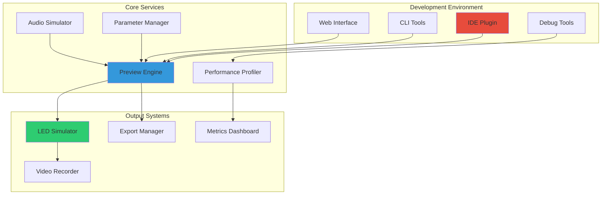

# DEVELOPMENT TOOLS SPECIFICATION
## Interactive Pattern Development Infrastructure

```
╔══════════════════════════════════════════════════════════════════╗
║                    DEVELOPMENT TOOLS SUITE                        ║
║                                                                   ║
║  IDE Integration │ Real-time Preview │ Performance Monitoring    ║
║  Parameter Tuning │ Debug Visualization │ Export Pipeline        ║
║                                                                   ║
║              "See it. Tweak it. Perfect it."                     ║
╚══════════════════════════════════════════════════════════════════╝
```

---

## ARCHITECTURAL OVERVIEW

The K1 Lightwave Development Tools provide a comprehensive environment for creating, testing, and optimizing LED patterns. This suite integrates seamlessly with popular development environments while providing specialized tools for audio-reactive visualization.

### System Architecture



---

## REAL-TIME PREVIEW SYSTEM

### Preview Engine Architecture

```cpp
class PreviewEngine {
private:
    // Core components
    std::unique_ptr<PatternRenderer> renderer;
    std::unique_ptr<AudioProcessor> audioProcessor;
    std::unique_ptr<LEDSimulator> ledSimulator;
    std::unique_ptr<PerformanceMonitor> perfMonitor;
    
    // State management
    struct PreviewState {
        bool isRunning = false;
        bool isPaused = false;
        float playbackSpeed = 1.0f;
        uint32_t frameCount = 0;
        
        // Timing
        std::chrono::steady_clock::time_point startTime;
        std::chrono::steady_clock::time_point lastFrameTime;
        double totalRuntime = 0.0;
        
        // Pattern state
        std::unique_ptr<IPattern> currentPattern;
        PatternParameters parameters;
        
        // Audio state
        AudioSource audioSource = AudioSource::MICROPHONE;
        std::string audioFile;
        float audioGain = 1.0f;
    } state;
    
    // Threading
    std::thread renderThread;
    std::thread audioThread;
    std::atomic<bool> shouldStop{false};
    
    // Communication
    moodycamel::ReaderWriterQueue<PreviewCommand> commandQueue;
    moodycamel::ReaderWriterQueue<PreviewEvent> eventQueue;
    
public:
    void initialize() {
        // Initialize subsystems
        renderer = std::make_unique<PatternRenderer>();
        audioProcessor = std::make_unique<AudioProcessor>();
        ledSimulator = std::make_unique<LEDSimulator>();
        perfMonitor = std::make_unique<PerformanceMonitor>();
        
        // Configure LED simulator
        LEDConfig config;
        config.ledCount = 320;
        config.arrangement = LEDArrangement::DUAL_STRIP;
        config.stripLength = 160;
        ledSimulator->configure(config);
        
        // Start threads
        renderThread = std::thread(&PreviewEngine::renderLoop, this);
        audioThread = std::thread(&PreviewEngine::audioLoop, this);
    }
    
    void loadPattern(const std::string& patternPath) {
        // Compile and load pattern
        auto compiler = PatternCompiler();
        auto compiledPattern = compiler.compile(patternPath);
        
        if (compiledPattern.success) {
            PreviewCommand cmd;
            cmd.type = CommandType::LOAD_PATTERN;
            cmd.patternData = std::move(compiledPattern.binary);
            commandQueue.enqueue(std::move(cmd));
        } else {
            throw std::runtime_error("Pattern compilation failed: " + 
                                   compiledPattern.errorMessage);
        }
    }
    
private:
    void renderLoop() {
        CRGB leds[320];
        AudioData audioData;
        
        while (!shouldStop) {
            auto frameStart = std::chrono::steady_clock::now();
            
            // Process commands
            processCommands();
            
            if (state.isRunning && !state.isPaused && state.currentPattern) {
                // Get latest audio data
                audioData = audioProcessor->getLatestData();
                
                // Start performance measurement
                perfMonitor->beginFrame();
                
                // Render pattern
                state.currentPattern->render(leds, audioData);
                
                // Update LED simulator
                ledSimulator->update(leds);
                
                // End performance measurement
                auto metrics = perfMonitor->endFrame();
                
                // Send performance event
                PreviewEvent event;
                event.type = EventType::PERFORMANCE_UPDATE;
                event.metrics = metrics;
                eventQueue.enqueue(std::move(event));
                
                // Frame timing
                state.frameCount++;
                auto frameEnd = std::chrono::steady_clock::now();
                auto frameTime = frameEnd - frameStart;
                
                // Maintain target framerate
                auto targetFrameTime = std::chrono::microseconds(16667); // 60 FPS
                if (frameTime < targetFrameTime) {
                    std::this_thread::sleep_for(targetFrameTime - frameTime);
                }
            } else {
                std::this_thread::sleep_for(std::chrono::milliseconds(10));
            }
        }
    }
    
    void processCommands() {
        PreviewCommand cmd;
        while (commandQueue.try_dequeue(cmd)) {
            switch (cmd.type) {
                case CommandType::LOAD_PATTERN:
                    handleLoadPattern(cmd);
                    break;
                case CommandType::UPDATE_PARAMETER:
                    handleUpdateParameter(cmd);
                    break;
                case CommandType::PLAY_PAUSE:
                    state.isPaused = !state.isPaused;
                    break;
                case CommandType::RESET:
                    handleReset();
                    break;
                case CommandType::SET_AUDIO_SOURCE:
                    handleSetAudioSource(cmd);
                    break;
            }
        }
    }
};
```

### LED Simulator Renderer

```cpp
class LEDSimulator {
private:
    struct SimulatedLED {
        glm::vec3 position;
        glm::vec3 normal;
        CRGB currentColor;
        CRGB targetColor;
        float brightness;
        float glowRadius;
    };
    
    struct RenderConfig {
        float ledSize = 5.0f;
        float glowIntensity = 2.0f;
        float diffusionAmount = 0.3f;
        bool enableBloom = true;
        bool enableReflections = false;
        glm::vec3 ambientLight = glm::vec3(0.1f);
    } config;
    
    std::vector<SimulatedLED> leds;
    std::unique_ptr<GLRenderer> glRenderer;
    std::unique_ptr<PostProcessor> postProcessor;
    
public:
    void configure(const LEDConfig& ledConfig) {
        leds.clear();
        
        switch (ledConfig.arrangement) {
            case LEDArrangement::LINEAR:
                setupLinearArrangement(ledConfig);
                break;
            case LEDArrangement::DUAL_STRIP:
                setupDualStripArrangement(ledConfig);
                break;
            case LEDArrangement::CIRCULAR:
                setupCircularArrangement(ledConfig);
                break;
            case LEDArrangement::MATRIX:
                setupMatrixArrangement(ledConfig);
                break;
            case LEDArrangement::CUSTOM:
                loadCustomArrangement(ledConfig.customLayout);
                break;
        }
        
        // Initialize OpenGL renderer
        glRenderer = std::make_unique<GLRenderer>();
        glRenderer->initialize(leds.size());
        
        // Setup post-processing
        postProcessor = std::make_unique<PostProcessor>();
        postProcessor->addEffect(new BloomEffect(config.glowIntensity));
        if (config.enableReflections) {
            postProcessor->addEffect(new ReflectionEffect());
        }
    }
    
    void update(const CRGB* ledData) {
        // Update LED colors with smooth transition
        for (size_t i = 0; i < leds.size(); i++) {
            leds[i].targetColor = ledData[i];
            
            // Smooth color transition
            leds[i].currentColor = blend(
                leds[i].currentColor, 
                leds[i].targetColor, 
                128 // 50% blend
            );
            
            // Calculate brightness and glow
            uint8_t maxChannel = max(leds[i].currentColor.r,
                                   max(leds[i].currentColor.g, 
                                       leds[i].currentColor.b));
            leds[i].brightness = maxChannel / 255.0f;
            leds[i].glowRadius = config.ledSize * (1.0f + leds[i].brightness);
        }
    }
    
    void render(int windowWidth, int windowHeight) {
        // Setup viewport
        glViewport(0, 0, windowWidth, windowHeight);
        
        // Clear framebuffer
        glClear(GL_COLOR_BUFFER_BIT | GL_DEPTH_BUFFER_BIT);
        
        // Setup camera
        glm::mat4 view = glm::lookAt(
            glm::vec3(0, 0, 5),  // Camera position
            glm::vec3(0, 0, 0),  // Look at origin
            glm::vec3(0, 1, 0)   // Up vector
        );
        
        glm::mat4 projection = glm::perspective(
            glm::radians(45.0f),
            float(windowWidth) / float(windowHeight),
            0.1f, 100.0f
        );
        
        // Render LEDs
        glRenderer->beginFrame(view, projection);
        
        for (const auto& led : leds) {
            renderLED(led);
        }
        
        glRenderer->endFrame();
        
        // Post-processing
        if (config.enableBloom || config.enableReflections) {
            postProcessor->process(glRenderer->getFramebuffer());
        }
    }
    
private:
    void setupDualStripArrangement(const LEDConfig& config) {
        int halfCount = config.stripLength;
        float spacing = 1.0f / halfCount;
        
        // First strip (0-159)
        for (int i = 0; i < halfCount; i++) {
            SimulatedLED led;
            led.position = glm::vec3(
                (i - halfCount/2) * spacing,
                0.2f,
                0
            );
            led.normal = glm::vec3(0, 0, 1);
            leds.push_back(led);
        }
        
        // Second strip (160-319)
        for (int i = 0; i < halfCount; i++) {
            SimulatedLED led;
            led.position = glm::vec3(
                (i - halfCount/2) * spacing,
                -0.2f,
                0
            );
            led.normal = glm::vec3(0, 0, 1);
            leds.push_back(led);
        }
    }
    
    void renderLED(const SimulatedLED& led) {
        // Convert color to linear space
        glm::vec3 linearColor = glm::pow(
            glm::vec3(led.currentColor.r / 255.0f,
                     led.currentColor.g / 255.0f,
                     led.currentColor.b / 255.0f),
            glm::vec3(2.2f)
        );
        
        // Render LED body
        glRenderer->drawSphere(
            led.position,
            config.ledSize * 0.01f,
            linearColor,
            led.brightness
        );
        
        // Render glow
        if (led.brightness > 0.01f) {
            glRenderer->drawGlow(
                led.position,
                led.glowRadius * 0.01f,
                linearColor,
                led.brightness * config.glowIntensity
            );
        }
    }
};
```

---

## PARAMETER TUNING INTERFACE

### Interactive Parameter System

```cpp
class ParameterTuningSystem {
private:
    struct ParameterWidget {
        PatternParameter parameter;
        std::unique_ptr<IWidget> widget;
        std::function<void(float)> onChange;
        
        // UI state
        bool isHovered = false;
        bool isDragging = false;
        float dragStartValue;
        glm::vec2 dragStartPos;
        
        // Animation
        float displayValue;
        float animationSpeed = 0.1f;
    };
    
    struct ParameterGroup {
        std::string name;
        std::vector<ParameterWidget> widgets;
        bool isExpanded = true;
    };
    
    std::vector<ParameterGroup> parameterGroups;
    std::function<void(const std::string&, float)> onParameterChange;
    
    // Preset management
    struct Preset {
        std::string name;
        std::map<std::string, float> values;
        std::string description;
    };
    std::vector<Preset> presets;
    int activePresetIndex = -1;
    
public:
    void loadParameters(IPattern* pattern) {
        parameterGroups.clear();
        
        auto params = pattern->getParameters();
        
        // Group parameters by category
        std::map<std::string, std::vector<PatternParameter>> grouped;
        for (const auto& param : params) {
            grouped[param.group].push_back(param);
        }
        
        // Create widgets for each group
        for (const auto& [groupName, groupParams] : grouped) {
            ParameterGroup group;
            group.name = groupName;
            
            for (const auto& param : groupParams) {
                ParameterWidget widget;
                widget.parameter = param;
                widget.displayValue = param.getValue();
                
                // Create appropriate widget based on parameter type
                widget.widget = createWidget(param);
                
                // Setup change callback
                widget.onChange = [this, paramName = param.name](float value) {
                    if (onParameterChange) {
                        onParameterChange(paramName, value);
                    }
                };
                
                group.widgets.push_back(std::move(widget));
            }
            
            parameterGroups.push_back(std::move(group));
        }
    }
    
    void render() {
        ImGui::Begin("Pattern Parameters", nullptr, 
                    ImGuiWindowFlags_AlwaysAutoResize);
        
        // Preset selection
        renderPresetControls();
        
        ImGui::Separator();
        
        // Parameter groups
        for (auto& group : parameterGroups) {
            if (ImGui::CollapsingHeader(group.name.c_str(), 
                                       group.isExpanded ? 
                                       ImGuiTreeNodeFlags_DefaultOpen : 0)) {
                ImGui::PushID(group.name.c_str());
                
                for (auto& widget : group.widgets) {
                    renderParameterWidget(widget);
                }
                
                ImGui::PopID();
            }
        }
        
        ImGui::Separator();
        
        // Action buttons
        renderActionButtons();
        
        ImGui::End();
    }
    
private:
    void renderParameterWidget(ParameterWidget& widget) {
        auto& param = widget.parameter;
        
        // Animate display value
        widget.displayValue += (param.getValue() - widget.displayValue) * 
                              widget.animationSpeed;
        
        ImGui::PushID(param.name.c_str());
        
        // Label with tooltip
        ImGui::Text("%s", param.displayName.c_str());
        if (ImGui::IsItemHovered() && !param.description.empty()) {
            ImGui::SetTooltip("%s", param.description.c_str());
        }
        
        ImGui::SameLine(150);
        
        // Value display
        ImGui::Text("%.2f", widget.displayValue);
        
        ImGui::SameLine(200);
        
        // Widget based on type
        switch (param.type) {
            case PatternParameter::Type::FLOAT:
                renderSlider(widget);
                break;
            case PatternParameter::Type::INTEGER:
                renderIntSlider(widget);
                break;
            case PatternParameter::Type::BOOLEAN:
                renderCheckbox(widget);
                break;
            case PatternParameter::Type::COLOR:
                renderColorPicker(widget);
                break;
            case PatternParameter::Type::ENUM:
                renderDropdown(widget);
                break;
            case PatternParameter::Type::CURVE:
                renderCurveEditor(widget);
                break;
        }
        
        // Reset button
        ImGui::SameLine();
        if (ImGui::SmallButton("R")) {
            param.setValue(param.defaultValue);
            widget.onChange(param.defaultValue);
        }
        if (ImGui::IsItemHovered()) {
            ImGui::SetTooltip("Reset to default (%.2f)", param.defaultValue);
        }
        
        ImGui::PopID();
    }
    
    void renderSlider(ParameterWidget& widget) {
        float value = widget.parameter.getValue();
        
        ImGui::PushItemWidth(200);
        
        if (ImGui::SliderFloat("##slider", &value, 
                              widget.parameter.minValue,
                              widget.parameter.maxValue)) {
            widget.parameter.setValue(value);
            widget.onChange(value);
        }
        
        // Fine control with ctrl+drag
        if (ImGui::IsItemActive() && ImGui::GetIO().KeyCtrl) {
            float delta = ImGui::GetIO().MouseDelta.x * 0.001f;
            value = widget.parameter.getValue() + delta;
            value = clamp(value, widget.parameter.minValue, 
                         widget.parameter.maxValue);
            widget.parameter.setValue(value);
            widget.onChange(value);
        }
        
        ImGui::PopItemWidth();
    }
    
    void renderPresetControls() {
        ImGui::Text("Presets:");
        ImGui::SameLine();
        
        // Preset dropdown
        if (ImGui::BeginCombo("##presets", 
                             activePresetIndex >= 0 ? 
                             presets[activePresetIndex].name.c_str() : 
                             "None")) {
            for (int i = 0; i < presets.size(); i++) {
                bool isSelected = (activePresetIndex == i);
                if (ImGui::Selectable(presets[i].name.c_str(), isSelected)) {
                    loadPreset(i);
                }
                if (isSelected) {
                    ImGui::SetItemDefaultFocus();
                }
            }
            ImGui::EndCombo();
        }
        
        ImGui::SameLine();
        
        // Save current as preset
        if (ImGui::Button("Save")) {
            ImGui::OpenPopup("Save Preset");
        }
        
        // Save preset popup
        if (ImGui::BeginPopupModal("Save Preset", nullptr, 
                                  ImGuiWindowFlags_AlwaysAutoResize)) {
            static char presetName[128] = "";
            ImGui::InputText("Name", presetName, sizeof(presetName));
            
            if (ImGui::Button("Save")) {
                saveCurrentAsPreset(presetName);
                ImGui::CloseCurrentPopup();
            }
            ImGui::SameLine();
            if (ImGui::Button("Cancel")) {
                ImGui::CloseCurrentPopup();
            }
            
            ImGui::EndPopup();
        }
    }
};
```

### Advanced Parameter Controls

```cpp
class AdvancedParameterControls {
private:
    // Curve editor for complex parameter relationships
    class CurveEditor {
        struct ControlPoint {
            float x, y;
            float inTangentX, inTangentY;
            float outTangentX, outTangentY;
            bool isSelected = false;
        };
        
        std::vector<ControlPoint> controlPoints;
        int selectedPoint = -1;
        
    public:
        void render(const std::string& id, std::function<void(float)> onChange) {
            ImDrawList* drawList = ImGui::GetWindowDrawList();
            ImVec2 canvasPos = ImGui::GetCursorScreenPos();
            ImVec2 canvasSize(300, 200);
            
            // Draw background
            drawList->AddRectFilled(canvasPos, 
                                   ImVec2(canvasPos.x + canvasSize.x, 
                                          canvasPos.y + canvasSize.y),
                                   IM_COL32(50, 50, 50, 255));
            
            // Draw grid
            for (int i = 0; i <= 10; i++) {
                float x = canvasPos.x + (canvasSize.x * i / 10);
                float y = canvasPos.y + (canvasSize.y * i / 10);
                
                drawList->AddLine(ImVec2(x, canvasPos.y),
                                 ImVec2(x, canvasPos.y + canvasSize.y),
                                 IM_COL32(80, 80, 80, 255));
                drawList->AddLine(ImVec2(canvasPos.x, y),
                                 ImVec2(canvasPos.x + canvasSize.x, y),
                                 IM_COL32(80, 80, 80, 255));
            }
            
            // Draw curve
            if (controlPoints.size() >= 2) {
                for (int i = 0; i < canvasSize.x; i++) {
                    float t = i / canvasSize.x;
                    float value = evaluateCurve(t);
                    
                    float y = canvasPos.y + (1.0f - value) * canvasSize.y;
                    
                    if (i > 0) {
                        float prevT = (i - 1) / canvasSize.x;
                        float prevValue = evaluateCurve(prevT);
                        float prevY = canvasPos.y + (1.0f - prevValue) * canvasSize.y;
                        
                        drawList->AddLine(
                            ImVec2(canvasPos.x + i - 1, prevY),
                            ImVec2(canvasPos.x + i, y),
                            IM_COL32(0, 255, 0, 255), 2.0f
                        );
                    }
                }
            }
            
            // Draw control points
            for (auto& point : controlPoints) {
                ImVec2 pos(canvasPos.x + point.x * canvasSize.x,
                          canvasPos.y + (1.0f - point.y) * canvasSize.y);
                
                drawList->AddCircleFilled(pos, 5.0f,
                                         point.isSelected ? 
                                         IM_COL32(255, 255, 0, 255) :
                                         IM_COL32(200, 200, 200, 255));
            }
            
            // Handle input
            ImGui::InvisibleButton(id.c_str(), canvasSize);
            if (ImGui::IsItemHovered()) {
                ImVec2 mousePos = ImGui::GetMousePos();
                float mx = (mousePos.x - canvasPos.x) / canvasSize.x;
                float my = 1.0f - (mousePos.y - canvasPos.y) / canvasSize.y;
                
                if (ImGui::IsMouseClicked(0)) {
                    // Check if clicking on existing point
                    selectedPoint = -1;
                    for (int i = 0; i < controlPoints.size(); i++) {
                        float dist = sqrt(pow(mx - controlPoints[i].x, 2) + 
                                        pow(my - controlPoints[i].y, 2));
                        if (dist < 0.05f) {
                            selectedPoint = i;
                            break;
                        }
                    }
                    
                    // Add new point if not clicking existing
                    if (selectedPoint == -1) {
                        ControlPoint newPoint;
                        newPoint.x = mx;
                        newPoint.y = my;
                        controlPoints.push_back(newPoint);
                        sortControlPoints();
                    }
                }
                
                // Drag selected point
                if (selectedPoint >= 0 && ImGui::IsMouseDragging(0)) {
                    controlPoints[selectedPoint].x = mx;
                    controlPoints[selectedPoint].y = my;
                    sortControlPoints();
                    
                    // Notify change
                    onChange(evaluateCurve(0.5f)); // Or current time
                }
            }
        }
        
    private:
        float evaluateCurve(float t) {
            if (controlPoints.size() < 2) return 0.5f;
            
            // Find surrounding points
            int i = 0;
            while (i < controlPoints.size() - 1 && controlPoints[i + 1].x < t) {
                i++;
            }
            
            if (i >= controlPoints.size() - 1) {
                return controlPoints.back().y;
            }
            
            // Hermite interpolation
            float t0 = controlPoints[i].x;
            float t1 = controlPoints[i + 1].x;
            float localT = (t - t0) / (t1 - t0);
            
            float h1 = 2 * localT * localT * localT - 3 * localT * localT + 1;
            float h2 = -2 * localT * localT * localT + 3 * localT * localT;
            float h3 = localT * localT * localT - 2 * localT * localT + localT;
            float h4 = localT * localT * localT - localT * localT;
            
            return h1 * controlPoints[i].y + 
                   h2 * controlPoints[i + 1].y +
                   h3 * controlPoints[i].outTangentY * (t1 - t0) +
                   h4 * controlPoints[i + 1].inTangentY * (t1 - t0);
        }
        
        void sortControlPoints() {
            std::sort(controlPoints.begin(), controlPoints.end(),
                     [](const ControlPoint& a, const ControlPoint& b) {
                         return a.x < b.x;
                     });
        }
    };
    
    // 2D parameter space for complex relationships
    class Parameter2DSpace {
        float valueX = 0.5f;
        float valueY = 0.5f;
        
    public:
        void render(const std::string& labelX, const std::string& labelY,
                   std::function<void(float, float)> onChange) {
            ImDrawList* drawList = ImGui::GetWindowDrawList();
            ImVec2 canvasPos = ImGui::GetCursorScreenPos();
            ImVec2 canvasSize(200, 200);
            
            // Background
            drawList->AddRectFilled(canvasPos,
                                   ImVec2(canvasPos.x + canvasSize.x,
                                          canvasPos.y + canvasSize.y),
                                   IM_COL32(30, 30, 30, 255));
            
            // Grid
            for (int i = 0; i <= 4; i++) {
                float pos = i / 4.0f;
                drawList->AddLine(
                    ImVec2(canvasPos.x + pos * canvasSize.x, canvasPos.y),
                    ImVec2(canvasPos.x + pos * canvasSize.x, canvasPos.y + canvasSize.y),
                    IM_COL32(60, 60, 60, 255)
                );
                drawList->AddLine(
                    ImVec2(canvasPos.x, canvasPos.y + pos * canvasSize.y),
                    ImVec2(canvasPos.x + canvasSize.x, canvasPos.y + pos * canvasSize.y),
                    IM_COL32(60, 60, 60, 255)
                );
            }
            
            // Current position
            ImVec2 currentPos(canvasPos.x + valueX * canvasSize.x,
                            canvasPos.y + (1.0f - valueY) * canvasSize.y);
            
            drawList->AddCircleFilled(currentPos, 8.0f, IM_COL32(255, 100, 100, 255));
            drawList->AddCircle(currentPos, 8.0f, IM_COL32(255, 255, 255, 255), 12, 2.0f);
            
            // Labels
            drawList->AddText(ImVec2(canvasPos.x + canvasSize.x / 2 - 20,
                                   canvasPos.y + canvasSize.y + 5),
                            IM_COL32(255, 255, 255, 255), labelX.c_str());
            
            // Handle input
            ImGui::InvisibleButton("2dparam", canvasSize);
            if (ImGui::IsItemActive()) {
                ImVec2 mousePos = ImGui::GetMousePos();
                valueX = clamp((mousePos.x - canvasPos.x) / canvasSize.x, 0.0f, 1.0f);
                valueY = clamp(1.0f - (mousePos.y - canvasPos.y) / canvasSize.y, 0.0f, 1.0f);
                onChange(valueX, valueY);
            }
            
            // Value display
            ImGui::Text("%s: %.2f, %s: %.2f", labelX.c_str(), valueX, 
                       labelY.c_str(), valueY);
        }
    };
};
```

---

## PERFORMANCE MONITORING DASHBOARD

### Real-time Performance Metrics

```cpp
class PerformanceDashboard {
private:
    struct FrameMetrics {
        uint64_t timestamp;
        float totalTime;
        float audioTime;
        float renderTime;
        float outputTime;
        uint32_t cpuUsage;
        uint32_t memoryUsage;
    };
    
    // Circular buffer for history
    CircularBuffer<FrameMetrics, 1000> metricsHistory;
    
    // Statistics
    struct Statistics {
        float avgFrameTime = 0.0f;
        float minFrameTime = FLT_MAX;
        float maxFrameTime = 0.0f;
        float percentile95 = 0.0f;
        float percentile99 = 0.0f;
        uint32_t avgCpuUsage = 0;
        uint32_t peakMemoryUsage = 0;
    } stats;
    
    // Visualization
    struct GraphData {
        std::vector<float> frameTimeHistory;
        std::vector<float> cpuHistory;
        std::vector<float> memoryHistory;
        size_t maxSamples = 300;
    } graphs;
    
public:
    void update(const FrameMetrics& metrics) {
        metricsHistory.push(metrics);
        updateStatistics();
        updateGraphs(metrics);
    }
    
    void render() {
        ImGui::Begin("Performance Monitor", nullptr,
                    ImGuiWindowFlags_AlwaysAutoResize);
        
        // Summary panel
        renderSummaryPanel();
        
        ImGui::Separator();
        
        // Frame time graph
        renderFrameTimeGraph();
        
        // CPU usage graph
        renderCPUGraph();
        
        // Memory usage graph
        renderMemoryGraph();
        
        // Detailed metrics table
        renderDetailedMetrics();
        
        ImGui::End();
    }
    
private:
    void renderSummaryPanel() {
        ImGui::Columns(4, "SummaryColumns");
        
        // FPS
        float fps = 1000000.0f / stats.avgFrameTime;
        ImGui::Text("FPS");
        ImGui::Text("%.1f", fps);
        if (fps < 60) {
            ImGui::TextColored(ImVec4(1, 0, 0, 1), "LOW!");
        } else if (fps < 120) {
            ImGui::TextColored(ImVec4(1, 1, 0, 1), "OK");
        } else {
            ImGui::TextColored(ImVec4(0, 1, 0, 1), "GOOD");
        }
        
        ImGui::NextColumn();
        
        // Frame time
        ImGui::Text("Frame Time");
        ImGui::Text("%.2f ms", stats.avgFrameTime / 1000.0f);
        ImGui::Text("95%%: %.2f ms", stats.percentile95 / 1000.0f);
        
        ImGui::NextColumn();
        
        // CPU usage
        ImGui::Text("CPU Usage");
        ImGui::Text("%d%%", stats.avgCpuUsage);
        renderSparkline(graphs.cpuHistory, 0, 100);
        
        ImGui::NextColumn();
        
        // Memory
        ImGui::Text("Memory");
        ImGui::Text("%d KB", stats.peakMemoryUsage / 1024);
        renderSparkline(graphs.memoryHistory, 0, stats.peakMemoryUsage);
        
        ImGui::Columns(1);
    }
    
    void renderFrameTimeGraph() {
        ImGui::Text("Frame Time (ms)");
        
        if (ImPlot::BeginPlot("##FrameTime", ImVec2(-1, 200))) {
            ImPlot::SetupAxes("Time", "ms");
            ImPlot::SetupAxisLimits(ImAxis_Y1, 0, 20);
            
            // Target lines
            double targetLine60[] = {16.67, 16.67};
            double targetLine120[] = {8.33, 8.33};
            double xData[] = {0, (double)graphs.frameTimeHistory.size()};
            
            ImPlot::PushStyleColor(ImPlotCol_Line, ImVec4(1, 0, 0, 0.5f));
            ImPlot::PlotLine("60 FPS", xData, targetLine60, 2);
            ImPlot::PopStyleColor();
            
            ImPlot::PushStyleColor(ImPlotCol_Line, ImVec4(0, 1, 0, 0.5f));
            ImPlot::PlotLine("120 FPS", xData, targetLine120, 2);
            ImPlot::PopStyleColor();
            
            // Frame time data
            if (!graphs.frameTimeHistory.empty()) {
                std::vector<float> msData;
                for (auto t : graphs.frameTimeHistory) {
                    msData.push_back(t / 1000.0f);
                }
                
                ImPlot::PlotLine("Frame Time", msData.data(), msData.size());
            }
            
            ImPlot::EndPlot();
        }
    }
    
    void renderDetailedMetrics() {
        if (ImGui::CollapsingHeader("Detailed Metrics")) {
            ImGui::BeginTable("Metrics", 5, 
                            ImGuiTableFlags_Borders | 
                            ImGuiTableFlags_RowBg);
            
            ImGui::TableSetupColumn("Component");
            ImGui::TableSetupColumn("Avg (μs)");
            ImGui::TableSetupColumn("Min (μs)");
            ImGui::TableSetupColumn("Max (μs)");
            ImGui::TableSetupColumn("% of Frame");
            ImGui::TableHeadersRow();
            
            // Audio processing
            renderMetricRow("Audio Processing", 
                          getComponentStats("audio"));
            
            // Pattern rendering
            renderMetricRow("Pattern Render", 
                          getComponentStats("render"));
            
            // LED output
            renderMetricRow("LED Output", 
                          getComponentStats("output"));
            
            // Other
            renderMetricRow("Other", 
                          getComponentStats("other"));
            
            ImGui::EndTable();
        }
    }
    
    void renderSparkline(const std::vector<float>& data, 
                        float minValue, float maxValue) {
        if (data.empty()) return;
        
        ImDrawList* drawList = ImGui::GetWindowDrawList();
        ImVec2 pos = ImGui::GetCursorScreenPos();
        ImVec2 size(60, 20);
        
        // Draw sparkline
        for (size_t i = 1; i < data.size(); i++) {
            float x1 = pos.x + (i - 1) * size.x / data.size();
            float x2 = pos.x + i * size.x / data.size();
            
            float y1 = pos.y + size.y * (1.0f - (data[i-1] - minValue) / 
                                         (maxValue - minValue));
            float y2 = pos.y + size.y * (1.0f - (data[i] - minValue) / 
                                         (maxValue - minValue));
            
            drawList->AddLine(ImVec2(x1, y1), ImVec2(x2, y2),
                            IM_COL32(100, 200, 100, 255));
        }
        
        ImGui::Dummy(size);
    }
};
```

### Performance Profiler Integration

```cpp
class IntegratedProfiler {
private:
    struct ProfileBlock {
        std::string name;
        uint64_t startTime;
        uint64_t totalTime = 0;
        uint32_t callCount = 0;
        uint64_t minTime = UINT64_MAX;
        uint64_t maxTime = 0;
        std::vector<ProfileBlock> children;
    };
    
    ProfileBlock rootBlock{"Root", 0};
    ProfileBlock* currentBlock = &rootBlock;
    std::stack<ProfileBlock*> blockStack;
    
    // Flame graph data
    struct FlameGraphNode {
        std::string name;
        uint64_t value;
        std::vector<FlameGraphNode> children;
    };
    
public:
    class ScopedProfiler {
        IntegratedProfiler* profiler;
        std::string name;
        uint64_t startTime;
        
    public:
        ScopedProfiler(IntegratedProfiler* p, const std::string& n) 
            : profiler(p), name(n) {
            startTime = getCurrentMicros();
            profiler->enterBlock(name);
        }
        
        ~ScopedProfiler() {
            uint64_t elapsed = getCurrentMicros() - startTime;
            profiler->exitBlock(elapsed);
        }
    };
    
    void enterBlock(const std::string& name) {
        // Find or create child block
        ProfileBlock* childBlock = nullptr;
        for (auto& child : currentBlock->children) {
            if (child.name == name) {
                childBlock = &child;
                break;
            }
        }
        
        if (!childBlock) {
            currentBlock->children.emplace_back();
            childBlock = &currentBlock->children.back();
            childBlock->name = name;
        }
        
        blockStack.push(currentBlock);
        currentBlock = childBlock;
        currentBlock->startTime = getCurrentMicros();
    }
    
    void exitBlock(uint64_t elapsed) {
        currentBlock->totalTime += elapsed;
        currentBlock->callCount++;
        currentBlock->minTime = std::min(currentBlock->minTime, elapsed);
        currentBlock->maxTime = std::max(currentBlock->maxTime, elapsed);
        
        currentBlock = blockStack.top();
        blockStack.pop();
    }
    
    void renderFlameGraph() {
        ImGui::Begin("Flame Graph", nullptr);
        
        FlameGraphNode flameData = buildFlameGraphData(&rootBlock);
        renderFlameGraphNode(flameData, 0, ImGui::GetContentRegionAvail().x);
        
        ImGui::End();
    }
    
private:
    FlameGraphNode buildFlameGraphData(ProfileBlock* block) {
        FlameGraphNode node;
        node.name = block->name;
        node.value = block->totalTime;
        
        for (auto& child : block->children) {
            node.children.push_back(buildFlameGraphData(&child));
        }
        
        // Sort children by time
        std::sort(node.children.begin(), node.children.end(),
                 [](const FlameGraphNode& a, const FlameGraphNode& b) {
                     return a.value > b.value;
                 });
        
        return node;
    }
    
    void renderFlameGraphNode(const FlameGraphNode& node, 
                             float xOffset, float width,
                             int depth = 0) {
        if (width < 2.0f || node.value == 0) return;
        
        ImDrawList* drawList = ImGui::GetWindowDrawList();
        ImVec2 pos = ImGui::GetCursorScreenPos();
        
        float height = 20.0f;
        float y = pos.y + depth * height;
        
        // Color based on depth
        ImU32 color = ImGui::GetColorU32(ImVec4(
            0.3f + depth * 0.1f,
            0.5f - depth * 0.05f,
            0.7f - depth * 0.1f,
            1.0f
        ));
        
        // Draw rectangle
        drawList->AddRectFilled(
            ImVec2(pos.x + xOffset, y),
            ImVec2(pos.x + xOffset + width, y + height - 1),
            color
        );
        
        // Draw text if wide enough
        if (width > 50) {
            std::string label = node.name + " (" + 
                               std::to_string(node.value / 1000) + "ms)";
            drawList->AddText(
                ImVec2(pos.x + xOffset + 2, y + 2),
                IM_COL32(255, 255, 255, 255),
                label.c_str()
            );
        }
        
        // Tooltip on hover
        if (ImGui::IsMouseHoveringRect(
                ImVec2(pos.x + xOffset, y),
                ImVec2(pos.x + xOffset + width, y + height))) {
            ImGui::SetTooltip("%s\nTotal: %.2f ms\nPercent: %.1f%%",
                            node.name.c_str(),
                            node.value / 1000.0f,
                            100.0f * node.value / rootBlock.totalTime);
        }
        
        // Render children
        float childX = xOffset;
        for (const auto& child : node.children) {
            float childWidth = width * child.value / node.value;
            renderFlameGraphNode(child, childX, childWidth, depth + 1);
            childX += childWidth;
        }
    }
};

// Usage macro
#define PROFILE(profiler, name) \
    IntegratedProfiler::ScopedProfiler _prof(profiler, name)
```

---

## DEBUG VISUALIZATION TOOLS

### Pattern Debug Overlay

```cpp
class DebugVisualizationSystem {
private:
    struct DebugOverlay {
        bool showAudioWaveform = false;
        bool showFrequencySpectrum = false;
        bool showBeatDetection = false;
        bool showParameterValues = false;
        bool showPerformanceStats = false;
        bool showLEDIndices = false;
        bool showColorAnalysis = false;
    } overlays;
    
    // Audio visualization buffers
    CircularBuffer<float, 1024> waveformBuffer;
    std::array<float, 128> spectrumBuffer;
    
public:
    void renderDebugOverlay(const AudioData& audio, 
                           const CRGB* leds,
                           const FrameMetrics& metrics) {
        ImGui::Begin("Debug Visualization", nullptr);
        
        // Overlay toggles
        ImGui::Checkbox("Audio Waveform", &overlays.showAudioWaveform);
        ImGui::SameLine();
        ImGui::Checkbox("Spectrum", &overlays.showFrequencySpectrum);
        ImGui::SameLine();
        ImGui::Checkbox("Beat", &overlays.showBeatDetection);
        
        ImGui::Checkbox("Parameters", &overlays.showParameterValues);
        ImGui::SameLine();
        ImGui::Checkbox("Performance", &overlays.showPerformanceStats);
        ImGui::SameLine();
        ImGui::Checkbox("LED Indices", &overlays.showLEDIndices);
        
        ImGui::Separator();
        
        // Render active overlays
        if (overlays.showAudioWaveform) {
            renderWaveformOverlay(audio);
        }
        
        if (overlays.showFrequencySpectrum) {
            renderSpectrumOverlay(audio);
        }
        
        if (overlays.showBeatDetection) {
            renderBeatOverlay(audio);
        }
        
        if (overlays.showColorAnalysis) {
            renderColorAnalysis(leds);
        }
        
        ImGui::End();
    }
    
private:
    void renderWaveformOverlay(const AudioData& audio) {
        // Update waveform buffer
        for (int i = 0; i < WAVEFORM_SIZE; i++) {
            waveformBuffer.push(audio.waveform[i]);
        }
        
        ImGui::Text("Audio Waveform");
        
        if (ImPlot::BeginPlot("##Waveform", ImVec2(-1, 150))) {
            ImPlot::SetupAxes("Sample", "Amplitude");
            ImPlot::SetupAxisLimits(ImAxis_Y1, -1.0, 1.0);
            
            // Get waveform data
            std::vector<float> waveData;
            for (size_t i = 0; i < waveformBuffer.size(); i++) {
                waveData.push_back(waveformBuffer[i]);
            }
            
            ImPlot::PlotLine("Waveform", waveData.data(), waveData.size());
            
            // Mark current amplitude
            double x[] = {(double)waveData.size() - 1};
            double y[] = {audio.amplitude};
            ImPlot::PlotScatter("Current", x, y, 1);
            
            ImPlot::EndPlot();
        }
    }
    
    void renderSpectrumOverlay(const AudioData& audio) {
        ImGui::Text("Frequency Spectrum");
        
        // Update spectrum buffer
        for (int i = 0; i < 128 && i < SPECTRUM_SIZE; i++) {
            spectrumBuffer[i] = audio.spectrum[i];
        }
        
        if (ImPlot::BeginPlot("##Spectrum", ImVec2(-1, 150))) {
            ImPlot::SetupAxes("Frequency Bin", "Magnitude");
            ImPlot::SetupAxisLimits(ImAxis_Y1, 0.0, 1.0);
            
            ImPlot::PlotBars("Spectrum", spectrumBuffer.data(), 
                           spectrumBuffer.size(), 0.8);
            
            // Highlight bass, mid, treble regions
            ImPlot::PushStyleColor(ImPlotCol_Fill, ImVec4(1, 0, 0, 0.3f));
            double bassX[] = {0, 32};
            double bassY[] = {0, 1};
            ImPlot::PlotShaded("Bass", bassX, bassY, bassY, 2);
            ImPlot::PopStyleColor();
            
            ImPlot::EndPlot();
        }
    }
    
    void renderBeatOverlay(const AudioData& audio) {
        static CircularBuffer<float, 200> beatHistory;
        static float beatPhase = 0.0f;
        
        // Update beat history
        beatHistory.push(audio.beat.detected ? 1.0f : 0.0f);
        
        // Update phase
        if (audio.beat.detected) {
            beatPhase = 0.0f;
        } else {
            beatPhase += 1.0f / 60.0f; // Assuming 60 FPS
        }
        
        ImGui::Text("Beat Detection");
        
        // Beat indicator
        float indicatorSize = 50.0f;
        ImVec2 center = ImGui::GetCursorScreenPos();
        center.x += indicatorSize;
        center.y += indicatorSize;
        
        ImDrawList* drawList = ImGui::GetWindowDrawList();
        
        // Pulsing circle
        float pulseSize = indicatorSize * (1.0f + 0.5f * exp(-beatPhase * 5.0f));
        ImU32 color = audio.beat.detected ? 
                     IM_COL32(255, 100, 100, 255) : 
                     IM_COL32(100, 100, 100, 255);
        
        drawList->AddCircleFilled(center, pulseSize, color);
        
        // BPM display
        ImGui::SetCursorPosY(ImGui::GetCursorPosY() + indicatorSize * 2 + 10);
        ImGui::Text("BPM: %.1f", audio.beat.bpm);
        ImGui::Text("Confidence: %.2f", audio.beat.confidence);
        
        // Beat history graph
        if (ImPlot::BeginPlot("##BeatHistory", ImVec2(-1, 100))) {
            std::vector<float> histData;
            for (size_t i = 0; i < beatHistory.size(); i++) {
                histData.push_back(beatHistory[i]);
            }
            
            ImPlot::PlotBars("Beats", histData.data(), histData.size());
            ImPlot::EndPlot();
        }
    }
    
    void renderColorAnalysis(const CRGB* leds) {
        ImGui::Text("Color Analysis");
        
        // Calculate color statistics
        uint32_t totalR = 0, totalG = 0, totalB = 0;
        uint8_t maxR = 0, maxG = 0, maxB = 0;
        std::map<uint32_t, int> colorHistogram;
        
        for (int i = 0; i < NUM_LEDS; i++) {
            totalR += leds[i].r;
            totalG += leds[i].g;
            totalB += leds[i].b;
            
            maxR = max(maxR, leds[i].r);
            maxG = max(maxG, leds[i].g);
            maxB = max(maxB, leds[i].b);
            
            uint32_t packed = (leds[i].r << 16) | (leds[i].g << 8) | leds[i].b;
            colorHistogram[packed]++;
        }
        
        // Display averages
        ImGui::Text("Average: R=%.0f G=%.0f B=%.0f",
                   totalR / (float)NUM_LEDS,
                   totalG / (float)NUM_LEDS,
                   totalB / (float)NUM_LEDS);
        
        // Display dominant colors
        std::vector<std::pair<uint32_t, int>> sortedColors(
            colorHistogram.begin(), colorHistogram.end()
        );
        std::sort(sortedColors.begin(), sortedColors.end(),
                 [](const auto& a, const auto& b) {
                     return a.second > b.second;
                 });
        
        ImGui::Text("Dominant Colors:");
        for (int i = 0; i < min(5, (int)sortedColors.size()); i++) {
            uint32_t color = sortedColors[i].first;
            ImVec4 displayColor(
                ((color >> 16) & 0xFF) / 255.0f,
                ((color >> 8) & 0xFF) / 255.0f,
                (color & 0xFF) / 255.0f,
                1.0f
            );
            
            ImGui::ColorButton("##dom", displayColor, 0, ImVec2(20, 20));
            ImGui::SameLine();
            ImGui::Text("%d LEDs", sortedColors[i].second);
        }
    }
};
```

---

## EXPORT AND PACKAGING SYSTEM

### Pattern Export Pipeline

```cpp
class PatternExportSystem {
private:
    struct ExportConfig {
        bool includeSource = true;
        bool includePreview = true;
        bool includeDocumentation = true;
        bool compileForPlatforms = true;
        std::vector<std::string> targetPlatforms = {"esp32s3", "esp32c6"};
        VideoFormat previewFormat = VideoFormat::MP4_H264;
        int previewDuration = 30; // seconds
        std::string outputPath = "./exports/";
    };
    
public:
    void exportPattern(IPattern* pattern, const ExportConfig& config) {
        // Create export directory
        std::string exportDir = createExportDirectory(pattern);
        
        // Export stages
        ExportProgress progress;
        
        // Stage 1: Generate metadata
        progress.updateStage("Generating metadata");
        exportMetadata(pattern, exportDir);
        
        // Stage 2: Compile binaries
        if (config.compileForPlatforms) {
            progress.updateStage("Compiling binaries");
            compileBinaries(pattern, config.targetPlatforms, exportDir);
        }
        
        // Stage 3: Generate preview
        if (config.includePreview) {
            progress.updateStage("Recording preview");
            generatePreview(pattern, config, exportDir);
        }
        
        // Stage 4: Generate documentation
        if (config.includeDocumentation) {
            progress.updateStage("Generating documentation");
            generateDocumentation(pattern, exportDir);
        }
        
        // Stage 5: Package everything
        progress.updateStage("Creating package");
        createPackage(exportDir);
        
        progress.complete();
    }
    
private:
    void generatePreview(IPattern* pattern, const ExportConfig& config,
                        const std::string& exportDir) {
        // Setup video encoder
        VideoEncoder encoder;
        encoder.initialize(
            exportDir + "/preview.mp4",
            1920, 1080, // HD resolution
            60, // FPS
            config.previewFormat
        );
        
        // Setup LED simulator for high quality
        LEDSimulator simulator;
        LEDConfig ledConfig;
        ledConfig.ledCount = 320;
        ledConfig.arrangement = LEDArrangement::DUAL_STRIP;
        simulator.configure(ledConfig);
        
        // Setup audio playback
        AudioPlayer audioPlayer;
        audioPlayer.loadFile("preview_audio.mp3");
        
        // Record frames
        CRGB leds[320];
        int totalFrames = config.previewDuration * 60;
        
        for (int frame = 0; frame < totalFrames; frame++) {
            // Get audio data
            AudioData audio = audioPlayer.getCurrentAudioData();
            
            // Render pattern
            pattern->render(leds, audio);
            
            // Update simulator
            simulator.update(leds);
            
            // Render to framebuffer
            FrameBuffer frameBuffer(1920, 1080);
            simulator.renderHighQuality(frameBuffer);
            
            // Add overlay information
            addPreviewOverlay(frameBuffer, pattern, frame, totalFrames);
            
            // Encode frame
            encoder.encodeFrame(frameBuffer);
            
            // Advance audio
            audioPlayer.advance(1.0f / 60.0f);
        }
        
        encoder.finalize();
        
        // Generate thumbnail
        generateThumbnail(pattern, exportDir);
    }
    
    void addPreviewOverlay(FrameBuffer& frame, IPattern* pattern,
                          int currentFrame, int totalFrames) {
        // Pattern name
        frame.drawText(50, 50, pattern->getMetadata().name, 48);
        
        // Progress bar
        float progress = currentFrame / (float)totalFrames;
        frame.drawRect(50, 1000, 1820, 30, Color::DARK_GRAY);
        frame.drawRect(50, 1000, 1820 * progress, 30, Color::GREEN);
        
        // Watermark
        frame.drawText(1700, 1050, "K1 Lightwave", 24, Color::WHITE * 0.5f);
    }
    
    void compileBinaries(IPattern* pattern, 
                        const std::vector<std::string>& platforms,
                        const std::string& exportDir) {
        PatternCompiler compiler;
        
        for (const auto& platform : platforms) {
            CompilerConfig config;
            config.targetPlatform = platform;
            config.optimizationLevel = OptimizationLevel::MAXIMUM;
            config.enableLTO = true;
            
            auto result = compiler.compile(pattern, config);
            
            if (result.success) {
                std::string filename = exportDir + "/binaries/" + 
                                     pattern->getMetadata().name + "_" + 
                                     platform + ".bin";
                writeBinaryFile(filename, result.binary);
                
                // Generate checksum
                std::string checksum = calculateSHA256(result.binary);
                writeTextFile(filename + ".sha256", checksum);
            } else {
                throw std::runtime_error("Compilation failed for " + platform + 
                                       ": " + result.errorMessage);
            }
        }
    }
};
```

### Live Development Server

```cpp
class LiveDevelopmentServer {
private:
    httplib::Server server;
    WebSocketServer wsServer;
    PreviewEngine previewEngine;
    std::string currentPatternPath;
    FileWatcher fileWatcher;
    
public:
    void start(int port = 8080) {
        // Initialize preview engine
        previewEngine.initialize();
        
        // Setup HTTP routes
        setupHTTPRoutes();
        
        // Setup WebSocket handlers
        setupWebSocketHandlers();
        
        // Start file watcher
        fileWatcher.watch(currentPatternPath, [this](const std::string& path) {
            onFileChanged(path);
        });
        
        // Start servers
        std::thread httpThread([this, port]() {
            server.listen("localhost", port);
        });
        
        std::thread wsThread([this]() {
            wsServer.listen(8081);
        });
        
        std::cout << "Development server running at http://localhost:" 
                  << port << std::endl;
    }
    
private:
    void setupHTTPRoutes() {
        // Serve web UI
        server.set_mount_point("/", "./web_ui");
        
        // API endpoints
        server.Get("/api/pattern/current", [this](const Request& req, Response& res) {
            json response;
            response["path"] = currentPatternPath;
            response["metadata"] = getCurrentPatternMetadata();
            res.set_content(response.dump(), "application/json");
        });
        
        server.Post("/api/pattern/load", [this](const Request& req, Response& res) {
            json request = json::parse(req.body);
            loadPattern(request["path"]);
            res.set_content("{\"status\":\"ok\"}", "application/json");
        });
        
        server.Post("/api/parameter/update", [this](const Request& req, Response& res) {
            json request = json::parse(req.body);
            updateParameter(request["name"], request["value"]);
            res.set_content("{\"status\":\"ok\"}", "application/json");
        });
    }
    
    void setupWebSocketHandlers() {
        // Handle new connections
        wsServer.onConnection([this](WebSocketConnection* conn) {
            // Send initial state
            json state;
            state["type"] = "initial_state";
            state["pattern"] = getCurrentPatternMetadata();
            state["parameters"] = getCurrentParameters();
            conn->send(state.dump());
        });
        
        // Handle messages
        wsServer.onMessage([this](WebSocketConnection* conn, const std::string& msg) {
            json message = json::parse(msg);
            
            if (message["type"] == "parameter_change") {
                updateParameter(message["parameter"], message["value"]);
            } else if (message["type"] == "request_preview_frame") {
                sendPreviewFrame(conn);
            }
        });
    }
    
    void onFileChanged(const std::string& path) {
        std::cout << "File changed: " << path << std::endl;
        
        // Recompile pattern
        try {
            previewEngine.loadPattern(path);
            
            // Notify all connected clients
            json notification;
            notification["type"] = "pattern_reloaded";
            notification["success"] = true;
            wsServer.broadcast(notification.dump());
        } catch (const std::exception& e) {
            json notification;
            notification["type"] = "compilation_error";
            notification["error"] = e.what();
            wsServer.broadcast(notification.dump());
        }
    }
    
    void sendPreviewFrame(WebSocketConnection* conn) {
        // Get current LED data
        CRGB leds[320];
        previewEngine.getCurrentFrame(leds);
        
        // Convert to base64 PNG
        std::string pngData = renderLEDsToP NG(leds);
        std::string base64 = base64_encode(pngData);
        
        // Send frame
        json frame;
        frame["type"] = "preview_frame";
        frame["data"] = base64;
        conn->send(frame.dump());
    }
};
```

---

## INTEGRATION WITH DEVELOPMENT ENVIRONMENTS

### VS Code Extension

```typescript
// K1 Lightwave VS Code Extension
import * as vscode from 'vscode';
import { LanguageClient } from 'vscode-languageclient/node';

export function activate(context: vscode.ExtensionContext) {
    // Register language support
    const languageClient = new LanguageClient(
        'k1lightwave',
        'K1 Lightwave Language Server',
        {
            command: 'k1-language-server',
            args: ['--stdio']
        },
        {
            documentSelector: [
                { scheme: 'file', language: 'cpp', pattern: '**/*Pattern.cpp' }
            ]
        }
    );
    
    // Start language client
    languageClient.start();
    
    // Register commands
    context.subscriptions.push(
        vscode.commands.registerCommand('k1lightwave.newPattern', createNewPattern),
        vscode.commands.registerCommand('k1lightwave.preview', startPreview),
        vscode.commands.registerCommand('k1lightwave.exportPattern', exportPattern)
    );
    
    // Register preview panel
    const previewPanel = vscode.window.createWebviewPanel(
        'k1Preview',
        'K1 Pattern Preview',
        vscode.ViewColumn.Two,
        {
            enableScripts: true,
            retainContextWhenHidden: true
        }
    );
    
    // Update preview on save
    vscode.workspace.onDidSaveTextDocument((document) => {
        if (document.languageId === 'cpp' && document.fileName.includes('Pattern')) {
            updatePreview(previewPanel, document);
        }
    });
}

async function createNewPattern() {
    // Show template picker
    const template = await vscode.window.showQuickPick([
        'Reactive Pattern',
        'Wave Pattern',
        'Particle System',
        'Music Visualizer',
        'Generative Pattern'
    ], {
        placeHolder: 'Select a pattern template'
    });
    
    if (!template) return;
    
    // Get pattern name
    const name = await vscode.window.showInputBox({
        prompt: 'Pattern name',
        placeHolder: 'MyAwesomePattern'
    });
    
    if (!name) return;
    
    // Generate pattern from template
    const patternCode = generatePatternFromTemplate(template, name);
    
    // Create new file
    const doc = await vscode.workspace.openTextDocument({
        content: patternCode,
        language: 'cpp'
    });
    
    vscode.window.showTextDocument(doc);
}
```

---

## CONCLUSION

The K1 Lightwave Development Tools provide a comprehensive environment for pattern creation, testing, and distribution. By combining real-time visualization, performance monitoring, and seamless IDE integration, developers can focus on creativity while the tools handle the technical complexity.

### Key Features Recap

- **Real-time Preview**: See changes instantly
- **Performance Monitoring**: Never sacrifice FPS
- **Parameter Tuning**: Perfect every detail
- **Debug Visualization**: Understand what's happening
- **Export Pipeline**: Share with one click
- **IDE Integration**: Work in your favorite environment

### The Developer Experience

```
Code → Preview → Tweak → Perfect → Share
  ↑                                    ↓
  ←────────── Community Feedback ←─────↓
```

---

*Development Tools Specification v1.0*
*Tools that empower creativity*

**K1 LIGHTWAVE: WHERE DEVELOPMENT MEETS ART**