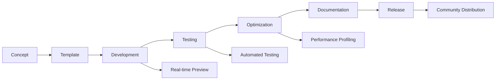

# 04_Tools_and_Workflow
## Professional Development Environment

```
🛠️ TOOLS & WORKFLOW - Your Development Powerhouse
```

Professional pattern development requires professional tools. This section covers the complete development toolchain, from IDE setup to performance profiling, ensuring you have everything needed for efficient, high-quality pattern creation.

## 📋 Section Contents

### 🛠️ [DEVELOPMENT_TOOLS_SPECIFICATION.md](DEVELOPMENT_TOOLS_SPECIFICATION.md) ✅ **Complete**
**Time: 4-6 hours** | **Skill: Intermediate to Advanced**

Complete specification of the K1 Lightwave development tools ecosystem.

**What's Inside:**
- Real-time preview system architecture
- Parameter tuning interface
- Performance monitoring dashboard
- Debug visualization tools
- Export and packaging system
- IDE integration (VS Code extension)
- Live development server

**Perfect for:** Professional developers, team environments

### 🧪 [Testing_and_Debugging.md](Testing_and_Debugging.md) *(Coming Soon)*
**Time: 2-3 hours** | **Skill: Intermediate**

Comprehensive testing strategies and debugging techniques for pattern development.

**What's Coming:**
- Unit testing framework for patterns
- Integration testing with audio sources
- Visual regression testing
- Hardware-in-the-loop testing
- Debugging techniques and tools
- Common error patterns and solutions

### 📊 [Performance_Profiling.md](Performance_Profiling.md) *(Coming Soon)*
**Time: 2-3 hours** | **Skill: Intermediate to Advanced**

Master performance analysis and optimization workflows.

**What's Coming:**
- Profiling tools setup and usage
- Frame rate analysis
- Memory usage profiling
- CPU utilization monitoring
- Bottleneck identification
- Optimization strategies

### 📋 [Version_Control_Best_Practices.md](Version_Control_Best_Practices.md) *(Coming Soon)*
**Time: 1-2 hours** | **Skill: Beginner to Intermediate**

Git workflows and collaboration strategies for pattern development.

**What's Coming:**
- Repository structure recommendations
- Branching strategies for pattern development
- Commit message conventions
- Collaborative development workflows
- Release management
- Pattern versioning strategies

## 🎯 Development Environment Tiers

### 🌱 **Starter Setup** (30 minutes)
**Perfect for: Beginners, hobby developers**

- Basic IDE with syntax highlighting
- Simple upload/test workflow
- Basic debugging capabilities
- Manual performance monitoring

**Tools:**
- Arduino IDE or VS Code
- Serial monitor for debugging
- Basic compile/upload workflow

### 🚀 **Professional Setup** (2-3 hours)
**Perfect for: Serious developers, small teams**

- Advanced IDE with K1 Lightwave extensions
- Real-time preview and tuning
- Automated testing integration
- Performance profiling tools
- Version control integration

**Tools:**
- VS Code with K1 Lightwave extension
- Real-time LED simulator
- Performance monitoring dashboard
- Git integration with pattern-specific workflows

### 🏗️ **Enterprise Setup** (1 day)
**Perfect for: Large teams, commercial development**

- Complete CI/CD pipeline
- Automated quality assurance
- Team collaboration tools
- Advanced debugging and profiling
- Automated documentation generation

**Tools:**
- Full development server
- Automated testing suite
- Team collaboration features
- Advanced profiling and optimization tools
- Pattern marketplace integration

## 🔧 Core Tools Overview

### **IDE Integration**
```
VS Code Extension → Real-time Preview → Pattern Upload → Live Testing
```

### **Development Server**
```
Pattern Source → Hot Reload → LED Simulator → Performance Monitor
```

### **Testing Pipeline**
```
Unit Tests → Integration Tests → Performance Tests → Hardware Tests
```

### **Profiling Workflow**
```
Pattern Execution → Data Collection → Analysis → Optimization Recommendations
```

## 📈 Workflow Optimization

### **Development Cycle**
1. **Write** - Code in IDE with real-time syntax checking
2. **Preview** - See changes instantly in LED simulator
3. **Test** - Automated testing with various audio sources
4. **Profile** - Monitor performance metrics
5. **Optimize** - Apply performance improvements
6. **Deploy** - Upload to device for final testing

### **Team Collaboration**
1. **Branch** - Feature branches for new patterns
2. **Develop** - Collaborative development with shared tools
3. **Review** - Code review with pattern-specific guidelines
4. **Integrate** - Automated testing and validation
5. **Release** - Versioned releases with documentation

## 🎨 Real-time Development Features

### **Live Preview**
- WebGL-based LED simulation
- Real-time parameter adjustment
- Audio source selection (mic, file, generated)
- Multiple visualization modes

### **Performance Monitoring**
- Frame rate graphs
- CPU usage meters
- Memory allocation tracking
- Execution time profiling

### **Debug Visualization**
- Variable state inspection
- Audio data visualization
- Pattern state debugging
- Timeline scrubbing

## 🔍 Quality Assurance

### **Automated Testing**
- Pattern compilation verification
- Performance regression testing
- Audio response validation
- Cross-platform compatibility

### **Code Quality**
- Style guide enforcement
- Static analysis
- Documentation completeness
- Security scanning

### **Performance Validation**
- Frame rate requirements
- Memory usage limits
- CPU utilization thresholds
- Latency measurements

## 🚀 Advanced Workflows

### **Pattern Development Pipeline**


### **Team Development**
- Shared development server
- Collaborative pattern editing
- Real-time feedback and review
- Automated deployment pipelines

## 📊 Performance Metrics

### **Development Efficiency**
- Time from concept to working pattern
- Code-test-debug cycle time
- Build and deployment speed
- Developer onboarding time

### **Pattern Quality**
- Performance benchmark scores
- Code quality metrics
- User satisfaction ratings
- Community adoption rates

## 🔗 Integration Points

### **With Pattern Development**
→ [📁 03_Pattern_Development](../03_Pattern_Development/) (Development workflow)

### **With Distribution**
→ [📁 05_Distribution](../05_Distribution/) (Publishing pipeline)

### **With Reference**
→ [📁 06_Reference](../06_Reference/) (API documentation)

## 💡 Best Practices

### **Tool Configuration**
- Consistent development environment across team
- Automated tool setup and configuration
- Regular tool updates and maintenance
- Performance-optimized tool settings

### **Workflow Efficiency**
- Keyboard shortcuts and automation
- Template-based project creation
- Automated repetitive tasks
- Streamlined testing procedures

### **Quality Maintenance**
- Regular code reviews
- Continuous integration
- Performance monitoring
- Documentation updates

## 🎯 Getting Started

### **Quick Setup**
1. **Install Tools** → [DEVELOPMENT_TOOLS_SPECIFICATION.md](DEVELOPMENT_TOOLS_SPECIFICATION.md)
2. **Configure IDE** → Follow setup guides
3. **Test Workflow** → Create and deploy test pattern
4. **Optimize Setup** → Tune for your development style

### **Professional Setup**
1. **Team Planning** → Define workflow requirements
2. **Infrastructure Setup** → Development server and CI/CD
3. **Tool Integration** → Connect all development tools
4. **Team Training** → Onboard team members
5. **Process Optimization** → Refine workflows based on usage

---

*Ready to supercharge your development workflow?* ⚡🛠️

**Start with:** [DEVELOPMENT_TOOLS_SPECIFICATION.md](DEVELOPMENT_TOOLS_SPECIFICATION.md)