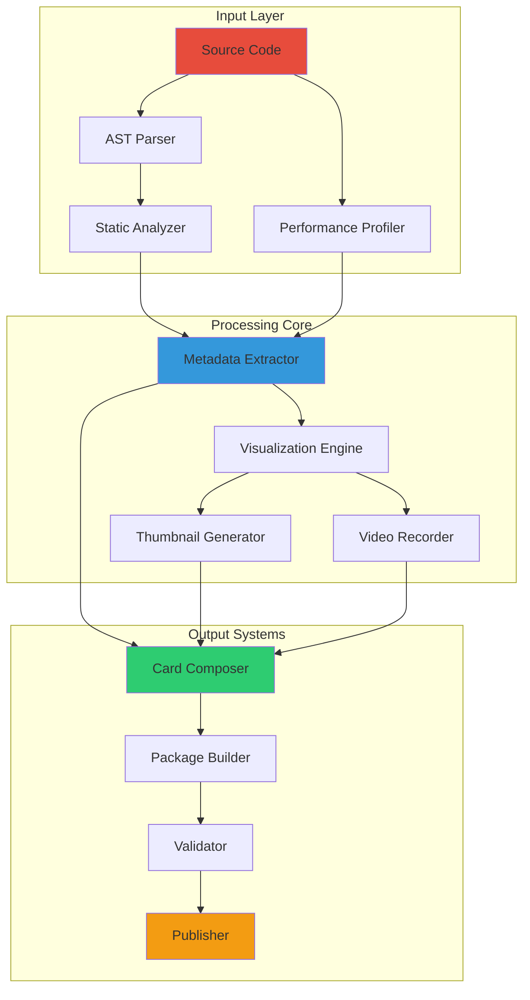

# LIGHTSHOW CARD GENERATOR SPECIFICATION
## Automated Pattern Metadata Extraction & Distribution System

```
╔═══════════════════════════════════════════════════════════════════╗
║                    LIGHTSHOW CARD GENERATOR                        ║
║                                                                    ║
║   Source Code ──▶ Analysis ──▶ Metadata ──▶ Card ──▶ Community   ║
║                                                                    ║
║            "Your pattern's passport to the world"                  ║
╚═══════════════════════════════════════════════════════════════════╝
```

---

## ARCHITECTURAL OVERVIEW

The Lightshow Card Generator represents the final bridge between pattern development and community distribution. This sophisticated system automatically extracts metadata, analyzes performance characteristics, generates preview media, and packages everything into a standardized format for seamless community sharing.

### System Architecture



---

## LIGHTSHOW CARD SPECIFICATION

### Card Schema Definition

```typescript
interface LightshowCard {
    // Core Metadata
    metadata: {
        id: string;                    // UUID v4
        name: string;                  // Pattern display name
        author: string;                // Creator name
        version: string;               // Semantic version
        created: ISO8601;              // Creation timestamp
        updated: ISO8601;              // Last update timestamp
        description: string;           // Rich description
        tags: string[];                // Searchable tags
        category: PatternCategory;     // Primary category
        license: string;               // SPDX identifier
    };
    
    // Technical Specifications
    technical: {
        minFirmware: string;           // Minimum firmware version
        maxLEDs: number;               // Maximum LED count supported
        memoryUsage: {
            heap: number;              // Bytes of heap required
            stack: number;             // Stack depth in bytes
            program: number;           // Program size in bytes
        };
        performance: {
            avgFPS: number;            // Average frames per second
            minFPS: number;            // Minimum observed FPS
            maxFPS: number;            // Maximum observed FPS
            cpuUsage: number;          // Average CPU percentage
            renderTime: {
                p50: number;           // 50th percentile (microseconds)
                p95: number;           // 95th percentile
                p99: number;           // 99th percentile
            };
        };
        features: {
            audioReactive: boolean;
            beatSync: boolean;
            colorCycling: boolean;
            multiLayer: boolean;
            generative: boolean;
            interactive: boolean;
        };
    };
    
    // Parameter Definitions
    parameters: Array<{
        name: string;                  // Parameter identifier
        displayName: string;           // Human-readable name
        type: ParameterType;           // Data type
        min?: number;                  // Minimum value
        max?: number;                  // Maximum value
        default: any;                  // Default value
        step?: number;                 // Increment step
        description: string;           // Parameter description
        group?: string;                // Parameter grouping
        advanced?: boolean;            // Hidden by default
    }>;
    
    // Preset Configurations
    presets: Array<{
        name: string;                  // Preset name
        description: string;           // What makes this preset special
        thumbnail: string;             // Base64 encoded image
        parameters: Record<string, any>; // Parameter values
        audioProfile?: AudioProfile;   // Optimized for music type
    }>;
    
    // Media Assets
    media: {
        thumbnail: string;             // Base64 encoded primary image
        gallery: Array<{
            type: 'image' | 'video';
            data: string;              // Base64 encoded content
            caption?: string;          // Media description
            audioSync?: boolean;       // Shows audio response
        }>;
        preview: {
            duration: number;          // Preview length in seconds
            format: 'mp4' | 'webm';
            data: string;              // Base64 encoded video
            audioTrack?: string;       // Sample audio used
        };
    };
    
    // Community Integration
    community: {
        downloads: number;             // Download count
        rating: number;                // Average rating (0-5)
        reviews: number;               // Number of reviews
        remixes: number;               // Number of remixes
        featured: boolean;             // Staff picked
        verified: boolean;             // Verified by team
    };
    
    // Distribution Information
    distribution: {
        source: {
            repository?: string;       // Git repository URL
            commit?: string;           // Specific commit hash
            path?: string;             // Path within repository
        };
        binary: {
            platform: string;          // Target platform
            checksum: string;          // SHA256 hash
            size: number;              // Binary size in bytes
            compressed: boolean;       // Compression applied
        };
        dependencies: Array<{
            name: string;              // Dependency name
            version: string;           // Required version
            optional: boolean;         // Optional dependency
        }>;
    };
}

enum PatternCategory {
    REACTIVE = "reactive",
    AMBIENT = "ambient",
    RHYTHMIC = "rhythmic",
    GENERATIVE = "generative",
    PARTICLE = "particle",
    WAVE = "wave",
    MATRIX = "matrix",
    EXPERIMENTAL = "experimental"
}

enum ParameterType {
    FLOAT = "float",
    INTEGER = "integer",
    BOOLEAN = "boolean",
    COLOR = "color",
    SELECT = "select",
    RANGE = "range"
}

enum AudioProfile {
    ELECTRONIC = "electronic",
    ROCK = "rock",
    CLASSICAL = "classical",
    JAZZ = "jazz",
    AMBIENT = "ambient",
    VOCAL = "vocal",
    UNIVERSAL = "universal"
}
```

---

## METADATA EXTRACTION ENGINE

### AST-Based Analysis

```cpp
class MetadataExtractor {
private:
    std::unique_ptr<clang::ASTUnit> astUnit;
    PatternMetadata metadata;
    std::vector<ParameterInfo> parameters;
    std::vector<FeatureFlag> features;
    
public:
    LightshowCard extractFromSource(const std::string& sourcePath) {
        // Parse source file
        astUnit = parseSourceFile(sourcePath);
        
        // Extract pattern class
        auto patternClass = findPatternClass();
        
        // Extract metadata method
        extractMetadata(patternClass);
        
        // Analyze parameters
        extractParameters(patternClass);
        
        // Detect features
        detectFeatures(patternClass);
        
        // Profile performance
        auto perfData = profilePattern(sourcePath);
        
        // Generate media
        auto media = generateMedia(sourcePath);
        
        // Compose card
        return composeCard(metadata, parameters, features, perfData, media);
    }
    
private:
    void extractMetadata(const clang::CXXRecordDecl* patternClass) {
        // Find getMetadata method
        auto metadataMethod = findMethod(patternClass, "getMetadata");
        
        if (metadataMethod) {
            // Analyze return statement
            MetadataVisitor visitor;
            visitor.TraverseStmt(metadataMethod->getBody());
            
            metadata = visitor.getExtractedMetadata();
        }
        
        // Extract from comments if needed
        extractFromComments(patternClass);
    }
    
    void extractParameters(const clang::CXXRecordDecl* patternClass) {
        ParameterVisitor visitor;
        
        // Visit all member variables
        for (auto field : patternClass->fields()) {
            if (isParameter(field)) {
                auto param = extractParameterInfo(field);
                parameters.push_back(param);
            }
        }
        
        // Visit parameter initialization
        auto initMethod = findMethod(patternClass, "initializeParameters");
        if (initMethod) {
            visitor.TraverseStmt(initMethod->getBody());
            
            // Merge with field analysis
            mergeParameterInfo(parameters, visitor.getParameters());
        }
    }
    
    void detectFeatures(const clang::CXXRecordDecl* patternClass) {
        FeatureDetector detector;
        
        // Analyze render method
        auto renderMethod = findMethod(patternClass, "render");
        if (renderMethod) {
            detector.analyze(renderMethod);
            
            features.audioReactive = detector.usesAudioData();
            features.beatSync = detector.usesBeatDetection();
            features.colorCycling = detector.usesColorAnimation();
            features.multiLayer = detector.usesLayering();
            features.generative = detector.usesGenerativeAlgorithms();
            features.interactive = detector.usesInteractiveControls();
        }
    }
};
```

### Performance Profiling System

```cpp
class PatternProfiler {
private:
    struct ProfilingSession {
        std::unique_ptr<IPattern> pattern;
        MockAudioSource audioSource;
        PerformanceMonitor perfMon;
        
        // Profiling results
        std::vector<FrameMetrics> frameMetrics;
        MemoryProfile memoryProfile;
        CPUProfile cpuProfile;
    };
    
public:
    PerformanceData profilePattern(const std::string& sourcePath) {
        // Compile pattern
        auto pattern = compilePattern(sourcePath);
        
        // Create profiling session
        ProfilingSession session{
            .pattern = std::move(pattern),
            .audioSource = MockAudioSource(),
            .perfMon = PerformanceMonitor()
        };
        
        // Run profiling scenarios
        runScenarios(session);
        
        // Analyze results
        return analyzeResults(session);
    }
    
private:
    void runScenarios(ProfilingSession& session) {
        struct Scenario {
            std::string name;
            std::function<AudioData()> audioGenerator;
            int frames;
        };
        
        Scenario scenarios[] = {
            {"Silence", generateSilence, 300},
            {"Pure Tone", generatePureTone, 300},
            {"Bass Heavy", generateBassHeavy, 300},
            {"Complex Music", generateComplexMusic, 600},
            {"Beat Pattern", generateBeatPattern, 600},
            {"White Noise", generateWhiteNoise, 300}
        };
        
        for (const auto& scenario : scenarios) {
            profileScenario(session, scenario);
        }
    }
    
    void profileScenario(ProfilingSession& session, const Scenario& scenario) {
        // Reset pattern state
        session.pattern->initialize();
        
        // Warm up (30 frames)
        for (int i = 0; i < 30; i++) {
            CRGB leds[NUM_LEDS];
            auto audio = scenario.audioGenerator();
            session.pattern->render(leds, audio);
        }
        
        // Profile frames
        for (int i = 0; i < scenario.frames; i++) {
            CRGB leds[NUM_LEDS];
            auto audio = scenario.audioGenerator();
            
            // Memory snapshot
            auto memBefore = getMemoryUsage();
            
            // CPU monitoring
            auto cpuBefore = getCPUCycles();
            auto timeBefore = micros();
            
            // Render frame
            session.pattern->render(leds, audio);
            
            // Collect metrics
            auto timeAfter = micros();
            auto cpuAfter = getCPUCycles();
            auto memAfter = getMemoryUsage();
            
            FrameMetrics metrics{
                .frameTime = timeAfter - timeBefore,
                .cpuCycles = cpuAfter - cpuBefore,
                .memoryDelta = memAfter - memBefore,
                .scenario = scenario.name
            };
            
            session.frameMetrics.push_back(metrics);
        }
    }
    
    PerformanceData analyzeResults(const ProfilingSession& session) {
        PerformanceData data;
        
        // Calculate FPS statistics
        std::vector<float> frameRates;
        for (const auto& metric : session.frameMetrics) {
            frameRates.push_back(1000000.0f / metric.frameTime);
        }
        
        std::sort(frameRates.begin(), frameRates.end());
        
        data.avgFPS = std::accumulate(frameRates.begin(), frameRates.end(), 0.0f) 
                      / frameRates.size();
        data.minFPS = frameRates.front();
        data.maxFPS = frameRates.back();
        
        // Calculate percentiles
        data.renderTime.p50 = getPercentile(session.frameMetrics, 50);
        data.renderTime.p95 = getPercentile(session.frameMetrics, 95);
        data.renderTime.p99 = getPercentile(session.frameMetrics, 99);
        
        // Memory analysis
        data.memoryUsage = analyzeMemoryUsage(session);
        
        // CPU usage
        data.cpuUsage = analyzeCPUUsage(session);
        
        return data;
    }
};
```

---

## MEDIA GENERATION SYSTEM

### Thumbnail Generator

```cpp
class ThumbnailGenerator {
private:
    struct RenderContext {
        CRGB leds[NUM_LEDS];
        std::unique_ptr<IPattern> pattern;
        MockAudioSource audioSource;
        LEDVisualizer visualizer;
    };
    
public:
    std::string generateThumbnail(const std::string& patternPath, 
                                 const ThumbnailConfig& config = {}) {
        RenderContext context;
        
        // Initialize pattern
        context.pattern = loadPattern(patternPath);
        context.pattern->initialize();
        
        // Set up audio for interesting visual
        context.audioSource.setScenario(config.audioScenario);
        
        // Find visually interesting moment
        auto keyFrame = findKeyFrame(context, config);
        
        // Render at key frame
        renderFrame(context, keyFrame);
        
        // Generate image
        auto image = context.visualizer.renderToImage(context.leds, config);
        
        // Encode to base64
        return encodeToBase64(image);
    }
    
private:
    struct ThumbnailConfig {
        int width = 800;
        int height = 400;
        VisualizationStyle style = VisualizationStyle::WAVE;
        AudioScenario audioScenario = AudioScenario::PEAK_MOMENT;
        float brightness = 1.0f;
        bool showReflection = true;
        bool addGlow = true;
    };
    
    int findKeyFrame(RenderContext& context, const ThumbnailConfig& config) {
        std::vector<VisualInterestScore> scores;
        
        // Analyze 10 seconds of pattern
        for (int frame = 0; frame < 600; frame++) {
            auto audio = context.audioSource.getFrame(frame);
            context.pattern->render(context.leds, audio);
            
            // Calculate visual interest
            VisualInterestScore score{
                .frame = frame,
                .colorDiversity = calculateColorDiversity(context.leds),
                .brightness = calculateAverageBrightness(context.leds),
                .motion = calculateMotionScore(context.leds, frame),
                .symmetry = calculateSymmetryScore(context.leds)
            };
            
            score.total = score.colorDiversity * 0.3f +
                         score.brightness * 0.2f +
                         score.motion * 0.3f +
                         score.symmetry * 0.2f;
            
            scores.push_back(score);
        }
        
        // Find frame with highest interest
        auto best = std::max_element(scores.begin(), scores.end(),
            [](const auto& a, const auto& b) { return a.total < b.total; });
        
        return best->frame;
    }
};
```

### Video Preview Generator

```cpp
class VideoPreviewGenerator {
private:
    struct VideoConfig {
        int duration = 30;              // seconds
        int fps = 60;
        int width = 1920;
        int height = 400;
        VideoCodec codec = VideoCodec::H264;
        int bitrate = 4000000;          // 4 Mbps
        AudioTrack audioTrack = AudioTrack::SAMPLE_ELECTRONIC;
    };
    
    class VideoEncoder {
        AVFormatContext* formatContext;
        AVCodecContext* codecContext;
        AVStream* videoStream;
        AVStream* audioStream;
        SwsContext* swsContext;
        
    public:
        void initialize(const VideoConfig& config) {
            // Initialize FFmpeg
            av_register_all();
            
            // Allocate output context
            avformat_alloc_output_context2(&formatContext, nullptr, 
                                         "mp4", nullptr);
            
            // Add video stream
            videoStream = addVideoStream(config);
            
            // Add audio stream
            audioStream = addAudioStream(config);
            
            // Open codecs and prepare for writing
            openVideo(config);
            openAudio(config);
        }
        
        void encodeFrame(const CRGB* leds, int frameNumber) {
            // Convert LED data to video frame
            AVFrame* frame = av_frame_alloc();
            frame->format = AV_PIX_FMT_YUV420P;
            frame->width = codecContext->width;
            frame->height = codecContext->height;
            frame->pts = frameNumber;
            
            av_frame_get_buffer(frame, 0);
            
            // Render LEDs to frame
            renderLEDsToFrame(leds, frame);
            
            // Encode frame
            encodeVideoFrame(frame);
            
            av_frame_free(&frame);
        }
        
    private:
        void renderLEDsToFrame(const CRGB* leds, AVFrame* frame) {
            // Create visualization
            cv::Mat visualization = createVisualization(leds);
            
            // Add effects
            addGlowEffect(visualization);
            addReflection(visualization);
            addWaveform(visualization);
            
            // Convert to YUV
            cv::Mat yuv;
            cv::cvtColor(visualization, yuv, cv::COLOR_BGR2YUV_I420);
            
            // Copy to frame
            memcpy(frame->data[0], yuv.data, frame->width * frame->height);
            memcpy(frame->data[1], yuv.data + frame->width * frame->height,
                   frame->width * frame->height / 4);
            memcpy(frame->data[2], yuv.data + frame->width * frame->height * 5/4,
                   frame->width * frame->height / 4);
        }
    };
    
public:
    std::string generatePreview(const std::string& patternPath,
                               const VideoConfig& config = {}) {
        // Initialize pattern
        auto pattern = loadPattern(patternPath);
        pattern->initialize();
        
        // Load audio track
        auto audioData = loadAudioTrack(config.audioTrack);
        
        // Initialize encoder
        VideoEncoder encoder;
        encoder.initialize(config);
        
        // Generate frames
        int totalFrames = config.duration * config.fps;
        for (int frame = 0; frame < totalFrames; frame++) {
            // Get audio for this frame
            auto audio = audioData.getFrame(frame * 1000 / config.fps);
            
            // Render pattern
            CRGB leds[NUM_LEDS];
            pattern->render(leds, audio);
            
            // Encode frame
            encoder.encodeFrame(leds, frame);
            
            // Progress callback
            if (frame % 60 == 0) {
                float progress = float(frame) / totalFrames;
                onProgress(progress);
            }
        }
        
        // Finalize video
        auto videoData = encoder.finalize();
        
        // Encode to base64
        return encodeToBase64(videoData);
    }
};
```

---

## CARD COMPOSITION ENGINE

### Card Builder

```cpp
class LightshowCardBuilder {
private:
    LightshowCard card;
    ValidationEngine validator;
    
public:
    class Builder {
        LightshowCard card;
        
    public:
        Builder& withMetadata(const PatternMetadata& metadata) {
            card.metadata.name = metadata.name;
            card.metadata.author = metadata.author;
            card.metadata.version = metadata.version;
            card.metadata.description = metadata.description;
            card.metadata.created = std::chrono::system_clock::now();
            card.metadata.updated = card.metadata.created;
            card.metadata.id = generateUUID();
            return *this;
        }
        
        Builder& withTechnicalSpecs(const TechnicalSpecs& specs) {
            card.technical = specs;
            return *this;
        }
        
        Builder& withParameters(const std::vector<ParameterDef>& params) {
            card.parameters = params;
            return *this;
        }
        
        Builder& withPresets(const std::vector<Preset>& presets) {
            card.presets = presets;
            return *this;
        }
        
        Builder& withMedia(const MediaAssets& media) {
            card.media = media;
            return *this;
        }
        
        Builder& withDistribution(const DistributionInfo& dist) {
            card.distribution = dist;
            return *this;
        }
        
        LightshowCard build() {
            // Validate card
            auto validation = ValidationEngine::validate(card);
            if (!validation.isValid()) {
                throw ValidationException(validation.errors);
            }
            
            // Add community defaults
            card.community = {
                .downloads = 0,
                .rating = 0.0f,
                .reviews = 0,
                .remixes = 0,
                .featured = false,
                .verified = false
            };
            
            return card;
        }
    };
    
    static Builder create() {
        return Builder();
    }
};
```

### Preset Extractor

```cpp
class PresetExtractor {
private:
    struct PresetCandidate {
        std::string name;
        std::map<std::string, float> parameters;
        float visualInterest;
        AudioProfile audioProfile;
    };
    
public:
    std::vector<Preset> extractPresets(IPattern* pattern) {
        std::vector<PresetCandidate> candidates;
        
        // Generate parameter combinations
        auto combinations = generateParameterCombinations(pattern);
        
        // Test each combination
        for (const auto& combo : combinations) {
            auto candidate = evaluateCombination(pattern, combo);
            if (candidate.visualInterest > 0.7f) {
                candidates.push_back(candidate);
            }
        }
        
        // Select best candidates
        auto selected = selectBestPresets(candidates);
        
        // Generate preview media
        return generatePresetMedia(pattern, selected);
    }
    
private:
    std::vector<ParameterCombination> generateParameterCombinations(IPattern* pattern) {
        std::vector<ParameterCombination> combinations;
        
        // Get parameter definitions
        auto params = pattern->getParameters();
        
        // Generate interesting combinations
        // 1. Default values
        combinations.push_back(getDefaultCombination(params));
        
        // 2. Extreme values
        combinations.push_back(getMinimalCombination(params));
        combinations.push_back(getMaximalCombination(params));
        
        // 3. Genre-specific
        for (auto profile : {AudioProfile::ELECTRONIC, AudioProfile::ROCK, 
                           AudioProfile::CLASSICAL, AudioProfile::AMBIENT}) {
            combinations.push_back(getProfileOptimized(params, profile));
        }
        
        // 4. Random exploration
        std::random_device rd;
        std::mt19937 gen(rd());
        
        for (int i = 0; i < 20; i++) {
            combinations.push_back(getRandomCombination(params, gen));
        }
        
        return combinations;
    }
    
    PresetCandidate evaluateCombination(IPattern* pattern, 
                                      const ParameterCombination& combo) {
        PresetCandidate candidate;
        candidate.parameters = combo.values;
        
        // Apply parameters
        for (const auto& [name, value] : combo.values) {
            pattern->setParameter(name, value);
        }
        
        // Run pattern with test audio
        MockAudioSource audioSource;
        std::vector<float> interestScores;
        
        for (auto profile : getAllAudioProfiles()) {
            audioSource.setProfile(profile);
            float score = evaluateVisualInterest(pattern, audioSource);
            interestScores.push_back(score);
            
            if (score > candidate.visualInterest) {
                candidate.visualInterest = score;
                candidate.audioProfile = profile;
            }
        }
        
        // Generate name based on characteristics
        candidate.name = generatePresetName(combo, candidate);
        
        return candidate;
    }
};
```

---

## VALIDATION SYSTEM

### Card Validator

```cpp
class LightshowCardValidator {
private:
    struct ValidationRule {
        std::string name;
        std::function<ValidationResult(const LightshowCard&)> validate;
        ValidationSeverity severity;
    };
    
    std::vector<ValidationRule> rules;
    
public:
    LightshowCardValidator() {
        initializeRules();
    }
    
    ValidationReport validate(const LightshowCard& card) {
        ValidationReport report;
        
        for (const auto& rule : rules) {
            auto result = rule.validate(card);
            
            if (!result.passed) {
                switch (rule.severity) {
                    case ValidationSeverity::ERROR:
                        report.errors.push_back({rule.name, result.message});
                        break;
                    case ValidationSeverity::WARNING:
                        report.warnings.push_back({rule.name, result.message});
                        break;
                    case ValidationSeverity::INFO:
                        report.info.push_back({rule.name, result.message});
                        break;
                }
            }
        }
        
        report.isValid = report.errors.empty();
        return report;
    }
    
private:
    void initializeRules() {
        // Metadata validation
        rules.push_back({
            "metadata.name",
            [](const auto& card) {
                if (card.metadata.name.empty()) {
                    return ValidationResult{false, "Pattern name is required"};
                }
                if (card.metadata.name.length() > 50) {
                    return ValidationResult{false, "Pattern name too long (max 50)"};
                }
                return ValidationResult{true};
            },
            ValidationSeverity::ERROR
        });
        
        // Performance validation
        rules.push_back({
            "performance.minFPS",
            [](const auto& card) {
                if (card.technical.performance.minFPS < 60) {
                    return ValidationResult{false, 
                        "Pattern must maintain 60+ FPS (found: " + 
                        std::to_string(card.technical.performance.minFPS) + ")"};
                }
                return ValidationResult{true};
            },
            ValidationSeverity::ERROR
        });
        
        // Media validation
        rules.push_back({
            "media.thumbnail",
            [](const auto& card) {
                if (card.media.thumbnail.empty()) {
                    return ValidationResult{false, "Thumbnail is required"};
                }
                
                // Check base64 validity
                if (!isValidBase64(card.media.thumbnail)) {
                    return ValidationResult{false, "Invalid thumbnail encoding"};
                }
                
                // Check size (warn if > 500KB)
                auto decodedSize = getBase64DecodedSize(card.media.thumbnail);
                if (decodedSize > 500 * 1024) {
                    return ValidationResult{false, 
                        "Thumbnail too large (max 500KB, found: " + 
                        formatBytes(decodedSize) + ")"};
                }
                
                return ValidationResult{true};
            },
            ValidationSeverity::ERROR
        });
        
        // Parameter validation
        rules.push_back({
            "parameters.defaults",
            [](const auto& card) {
                for (const auto& param : card.parameters) {
                    if (param.type == ParameterType::FLOAT || 
                        param.type == ParameterType::INTEGER) {
                        float def = std::get<float>(param.default);
                        if (def < param.min || def > param.max) {
                            return ValidationResult{false, 
                                "Parameter '" + param.name + 
                                "' default value outside range"};
                        }
                    }
                }
                return ValidationResult{true};
            },
            ValidationSeverity::ERROR
        });
        
        // Add more rules...
    }
};
```

---

## PUBLISHING SYSTEM

### Package Builder

```cpp
class PatternPackageBuilder {
private:
    struct PackageContents {
        LightshowCard card;
        std::vector<uint8_t> binaryData;
        std::string sourceCode;
        std::map<std::string, std::vector<uint8_t>> resources;
    };
    
public:
    std::vector<uint8_t> buildPackage(const std::string& patternPath) {
        PackageContents contents;
        
        // Generate card
        LightshowCardGenerator generator;
        contents.card = generator.generateCard(patternPath);
        
        // Compile binary
        PatternCompiler compiler;
        contents.binaryData = compiler.compile(patternPath);
        
        // Include source (if open source)
        if (shouldIncludeSource(contents.card)) {
            contents.sourceCode = readFile(patternPath);
        }
        
        // Package everything
        return createArchive(contents);
    }
    
private:
    std::vector<uint8_t> createArchive(const PackageContents& contents) {
        // Create ZIP archive
        mz_zip_archive zip = {};
        mz_zip_writer_init_heap(&zip, 0, 0);
        
        // Add card JSON
        auto cardJson = serializeCard(contents.card);
        mz_zip_writer_add_mem(&zip, "lightshow.json", 
                             cardJson.data(), cardJson.size(),
                             MZ_DEFAULT_COMPRESSION);
        
        // Add binary
        mz_zip_writer_add_mem(&zip, "pattern.bin",
                             contents.binaryData.data(), 
                             contents.binaryData.size(),
                             MZ_DEFAULT_COMPRESSION);
        
        // Add source if present
        if (!contents.sourceCode.empty()) {
            mz_zip_writer_add_mem(&zip, "source/pattern.cpp",
                                 contents.sourceCode.data(),
                                 contents.sourceCode.size(),
                                 MZ_DEFAULT_COMPRESSION);
        }
        
        // Add resources
        for (const auto& [name, data] : contents.resources) {
            std::string path = "resources/" + name;
            mz_zip_writer_add_mem(&zip, path.c_str(),
                                 data.data(), data.size(),
                                 MZ_DEFAULT_COMPRESSION);
        }
        
        // Finalize
        size_t archiveSize;
        void* archiveData = mz_zip_writer_finalize_heap_archive(&zip, 
                                                               &archiveSize);
        
        std::vector<uint8_t> result(static_cast<uint8_t*>(archiveData),
                                   static_cast<uint8_t*>(archiveData) + archiveSize);
        
        mz_zip_writer_end(&zip);
        free(archiveData);
        
        return result;
    }
};
```

### Distribution Manager

```cpp
class DistributionManager {
private:
    struct PublishingPipeline {
        std::unique_ptr<PackageBuilder> packageBuilder;
        std::unique_ptr<CDNUploader> cdnUploader;
        std::unique_ptr<DatabaseUpdater> dbUpdater;
        std::unique_ptr<NotificationService> notifier;
    };
    
public:
    PublishResult publish(const std::string& patternPath, 
                         const PublishOptions& options = {}) {
        PublishResult result;
        
        try {
            // Build package
            updateStatus("Building package...");
            auto package = pipeline.packageBuilder->build(patternPath);
            
            // Validate package
            updateStatus("Validating...");
            auto validation = validatePackage(package);
            if (!validation.isValid) {
                throw PublishException(validation.errors);
            }
            
            // Upload to CDN
            updateStatus("Uploading...");
            auto cdnUrl = pipeline.cdnUploader->upload(package);
            
            // Update database
            updateStatus("Registering...");
            auto patternId = pipeline.dbUpdater->register(package, cdnUrl);
            
            // Notify community
            if (options.announce) {
                updateStatus("Announcing...");
                pipeline.notifier->announceNewPattern(patternId);
            }
            
            result.success = true;
            result.patternId = patternId;
            result.downloadUrl = cdnUrl;
            
        } catch (const std::exception& e) {
            result.success = false;
            result.error = e.what();
        }
        
        return result;
    }
    
private:
    struct PublishOptions {
        bool announce = true;
        bool includeSource = true;
        std::vector<std::string> tags;
        std::string releaseNotes;
    };
    
    struct PublishResult {
        bool success;
        std::string patternId;
        std::string downloadUrl;
        std::string error;
    };
};
```

---

## COMMAND LINE INTERFACE

### CLI Tool Implementation

```cpp
class LightshowCardCLI {
private:
    CLI::App app{"Lightshow Card Generator", "k1-card"};
    
public:
    LightshowCardCLI() {
        setupCommands();
    }
    
    int run(int argc, char** argv) {
        CLI11_PARSE(app, argc, argv);
        return 0;
    }
    
private:
    void setupCommands() {
        // Generate command
        auto generate = app.add_subcommand("generate", 
                                         "Generate lightshow card from pattern");
        
        std::string patternPath;
        generate->add_option("pattern", patternPath, "Pattern source file")
                ->required()
                ->check(CLI::ExistingFile);
        
        std::string outputPath;
        generate->add_option("-o,--output", outputPath, 
                           "Output card file (default: <pattern>_card.json)");
        
        bool includeMedia = true;
        generate->add_flag("--no-media", includeMedia, 
                         "Skip media generation")->capture_default_str();
        
        generate->callback([=]() {
            generateCard(patternPath, outputPath, includeMedia);
        });
        
        // Validate command
        auto validate = app.add_subcommand("validate", 
                                         "Validate existing card");
        
        std::string cardPath;
        validate->add_option("card", cardPath, "Card file to validate")
                ->required()
                ->check(CLI::ExistingFile);
        
        validate->callback([=]() {
            validateCard(cardPath);
        });
        
        // Preview command
        auto preview = app.add_subcommand("preview", 
                                        "Generate preview media");
        
        preview->add_option("pattern", patternPath, "Pattern source file")
               ->required()
               ->check(CLI::ExistingFile);
        
        int duration = 30;
        preview->add_option("-d,--duration", duration, 
                          "Preview duration in seconds", true);
        
        std::string audioFile;
        preview->add_option("-a,--audio", audioFile, 
                          "Audio file for preview")
               ->check(CLI::ExistingFile);
        
        preview->callback([=]() {
            generatePreview(patternPath, duration, audioFile);
        });
        
        // Publish command
        auto publish = app.add_subcommand("publish", 
                                        "Publish pattern to community");
        
        publish->add_option("pattern", patternPath, "Pattern to publish")
               ->required()
               ->check(CLI::ExistingFile);
        
        std::string message;
        publish->add_option("-m,--message", message, "Release message");
        
        publish->callback([=]() {
            publishPattern(patternPath, message);
        });
    }
    
    void generateCard(const std::string& patternPath, 
                     const std::string& outputPath,
                     bool includeMedia) {
        std::cout << "Generating lightshow card for: " << patternPath << "\n";
        
        try {
            LightshowCardGenerator generator;
            auto card = generator.generateFromSource(patternPath, includeMedia);
            
            // Determine output path
            std::string outPath = outputPath;
            if (outPath.empty()) {
                outPath = getBaseName(patternPath) + "_card.json";
            }
            
            // Write card
            std::ofstream out(outPath);
            out << std::setw(2) << card.toJson() << std::endl;
            
            std::cout << "✓ Card generated successfully: " << outPath << "\n";
            
            // Display summary
            displayCardSummary(card);
            
        } catch (const std::exception& e) {
            std::cerr << "✗ Error: " << e.what() << "\n";
            std::exit(1);
        }
    }
};
```

---

## INTEGRATION EXAMPLES

### Basic Usage

```cpp
// Simple card generation
LightshowCardGenerator generator;
auto card = generator.generateFromSource("MyPattern.cpp");

// Save to file
card.saveToFile("MyPattern_card.json");

// With custom options
GeneratorOptions options{
    .includeSource = true,
    .generateVideo = true,
    .videoDuration = 60,
    .presetCount = 5
};
auto customCard = generator.generateFromSource("MyPattern.cpp", options);
```

### Advanced Integration

```cpp
// Custom pipeline
class CustomCardPipeline {
    LightshowCardBuilder builder;
    
public:
    LightshowCard generate(const std::string& patternPath) {
        // Extract metadata
        auto metadata = extractMetadata(patternPath);
        
        // Profile performance
        auto perfData = profilePattern(patternPath);
        
        // Generate custom presets
        auto presets = generateCustomPresets(patternPath);
        
        // Create custom media
        auto media = createCustomMedia(patternPath);
        
        // Build card
        return builder.create()
            .withMetadata(metadata)
            .withPerformance(perfData)
            .withPresets(presets)
            .withMedia(media)
            .build();
    }
};
```

---

## BEST PRACTICES

### Card Quality Guidelines

1. **Rich Metadata**
   - Comprehensive description
   - Accurate categorization
   - Meaningful tags
   - Clear versioning

2. **Visual Media**
   - High-quality thumbnail
   - Multiple preview angles
   - Video demonstration
   - Audio-synced examples

3. **Performance Data**
   - Honest FPS reporting
   - Memory usage disclosure
   - CPU utilization metrics
   - Optimization notes

4. **Parameter Documentation**
   - Clear descriptions
   - Sensible defaults
   - Grouped logically
   - Range explanations

5. **Community Integration**
   - Open source when possible
   - Attribution for remixes
   - Responsive to feedback
   - Regular updates

---

## FUTURE ENHANCEMENTS

### Planned Features

1. **AI-Powered Analysis**
   - Automatic categorization
   - Style detection
   - Similarity matching
   - Quality scoring

2. **Enhanced Media Generation**
   - 3D visualizations
   - Interactive previews
   - VR/AR support
   - Real-time streaming

3. **Advanced Distribution**
   - Blockchain verification
   - P2P distribution
   - Delta updates
   - Dependency resolution

4. **Community Features**
   - Collaborative editing
   - Fork tracking
   - Achievement system
   - Pattern challenges

---

## CONCLUSION

The Lightshow Card Generator represents the culmination of the K1 Lightwave SDK, providing a complete pipeline from pattern development to community distribution. By automating metadata extraction, performance profiling, and media generation, we enable creators to focus on what matters most: creating amazing visual experiences.

### Key Achievements

- **Automated Extraction**: Zero-friction metadata generation
- **Performance Transparency**: Honest, verified performance metrics
- **Rich Media**: Automatic preview generation
- **Quality Assurance**: Built-in validation and verification
- **Community Ready**: Seamless distribution pipeline

### The Journey Continues

Every pattern tells a story. Every card shares that story with the world. The Lightshow Card Generator ensures your creative vision reaches its audience in the most impactful way possible.

---

*Lightshow Card Generator v1.0*
*Connecting creators with community*

**K1 LIGHTWAVE: YOUR PATTERN'S PASSPORT TO THE WORLD**