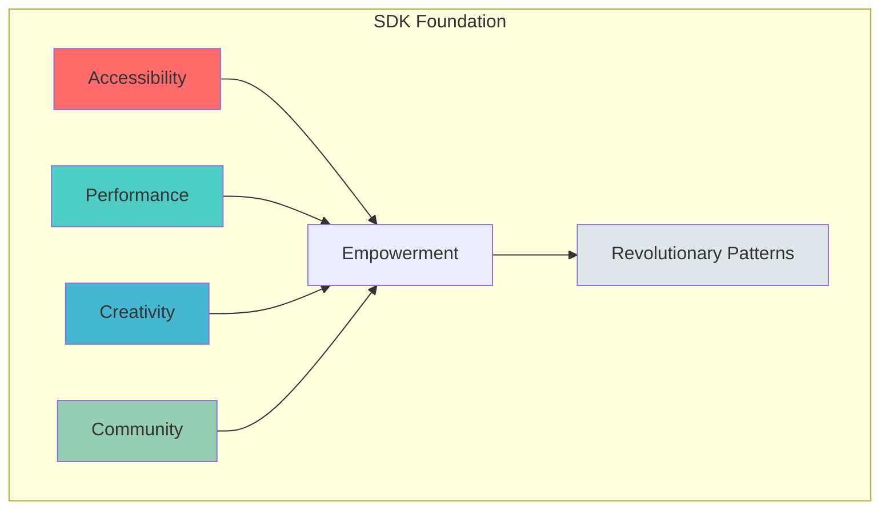
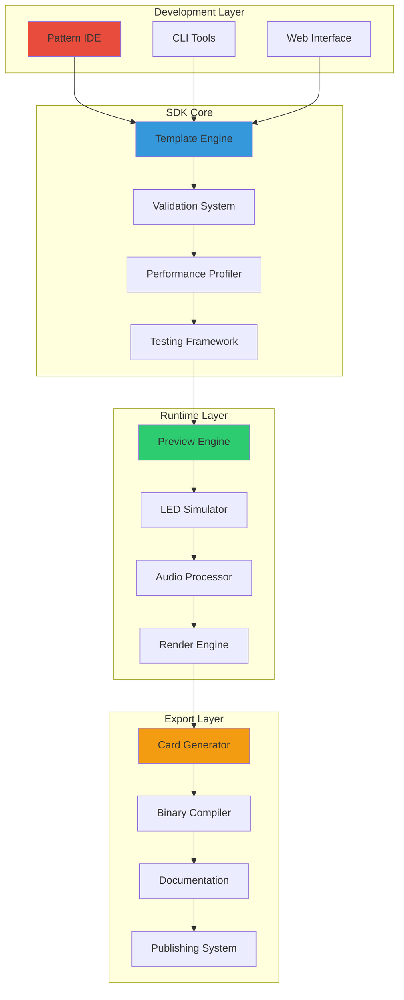
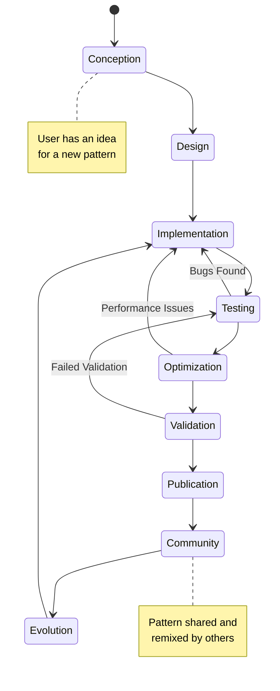
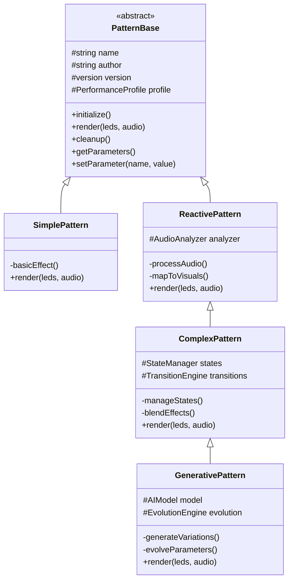
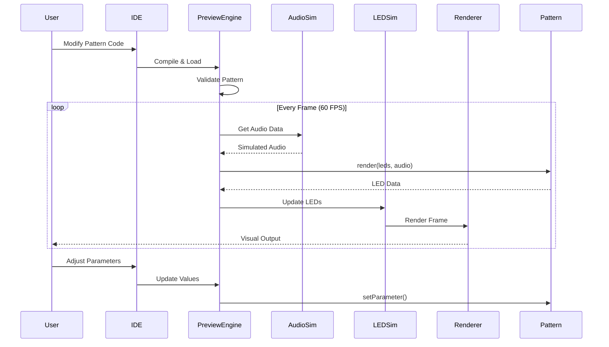
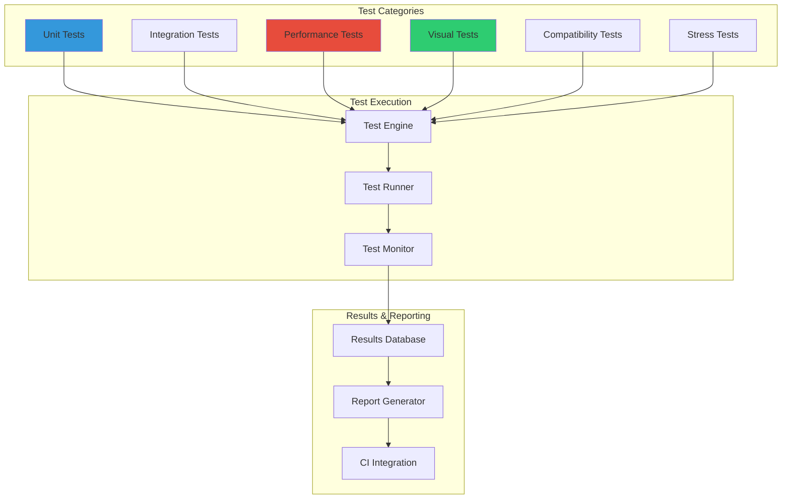
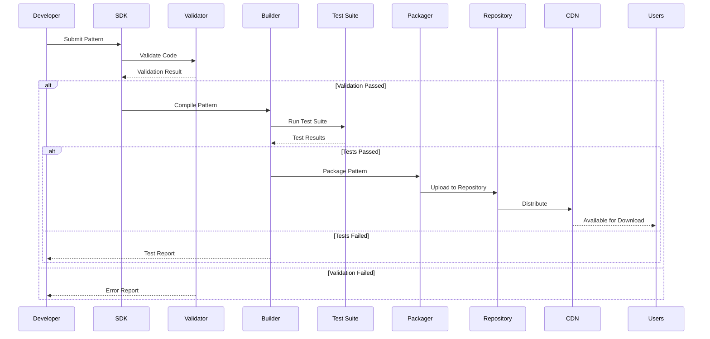
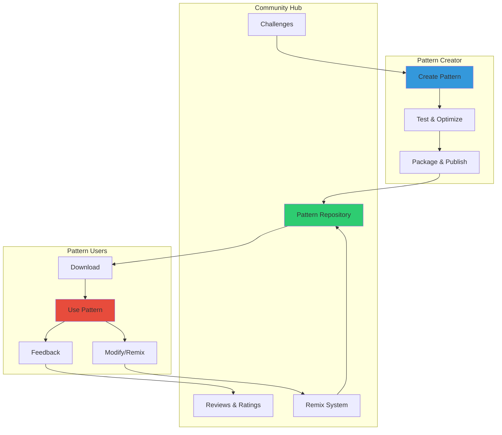
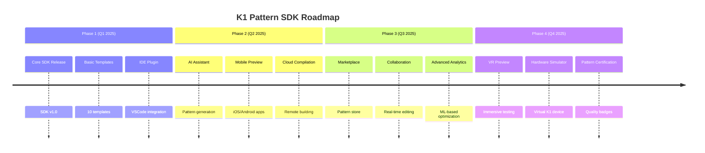

# K1 LIGHTWAVE PATTERN DEVELOPMENT SDK
## Comprehensive Architecture Specification & Implementation Guide

```
██████╗  █████╗ ████████╗████████╗███████╗██████╗ ███╗   ██╗
██╔══██╗██╔══██╗╚══██╔══╝╚══██╔══╝██╔════╝██╔══██╗████╗  ██║
██████╔╝███████║   ██║      ██║   █████╗  ██████╔╝██╔██╗ ██║
██╔═══╝ ██╔══██║   ██║      ██║   ██╔══╝  ██╔══██╗██║╚██╗██║
██║     ██║  ██║   ██║      ██║   ███████╗██║  ██║██║ ╚████║
╚═╝     ╚═╝  ╚═╝   ╚═╝      ╚═╝   ╚══════╝╚═╝  ╚═╝╚═╝  ╚═══╝
                    DEVELOPMENT SDK v1.0
```

---

## EXECUTIVE OVERVIEW

The K1 Lightwave Pattern Development SDK represents a paradigm shift in LED visualization development. By providing a comprehensive framework for pattern creation, testing, and distribution, we democratize the art of audio-reactive visual programming.

### Mission Statement
> "Transform every developer into a visual artist, every idea into living light, every pattern into a shared experience."

### Core Principles


---

## ARCHITECTURAL OVERVIEW

### System Architecture Diagram



### Component Interaction Matrix

```
┌─────────────────┬──────────┬──────────┬──────────┬──────────┐
│ Component       │ Template │ Preview  │ Profile  │ Export   │
├─────────────────┼──────────┼──────────┼──────────┼──────────┤
│ Template Engine │    ━━    │    ▶     │    ▶     │    ▶     │
│ Preview System  │    ◀     │    ━━    │    ▶     │    ▶     │
│ Profiler        │    ◀     │    ◀     │    ━━    │    ▶     │
│ Export System   │    ◀     │    ◀     │    ◀     │    ━━    │
└─────────────────┴──────────┴──────────┴──────────┴──────────┘
Legend: ▶ Provides data  ◀ Consumes data  ━━ Self-contained
```

---

## PATTERN LIFECYCLE MANAGEMENT

### Complete Pattern Development Pipeline



### Development Stages Deep Dive

#### Stage 1: Conception & Design
```cpp
class PatternConcept {
    struct Idea {
        string name;
        string description;
        VisualStyle style;
        AudioResponse response;
        ComplexityLevel complexity;
        TargetAudience audience;
    };
    
    struct DesignSpecification {
        ColorPalette colors;
        MotionDynamics motion;
        MathematicalModel algorithms;
        PerformanceTargets targets;
        UserParameters parameters;
    };
    
    PatternConcept() {
        // Initialize with template defaults
        idea.style = VisualStyle::ORGANIC;
        idea.response = AudioResponse::FREQUENCY_BASED;
        idea.complexity = ComplexityLevel::MEDIUM;
    }
};
```

#### Stage 2: Implementation Framework
```cpp
class PatternImplementation : public PatternBase {
private:
    // Core pattern state
    PatternState state;
    AudioAnalyzer analyzer;
    ColorEngine colors;
    MotionEngine motion;
    
    // Performance tracking
    PerformanceMetrics metrics;
    
public:
    void initialize() override {
        // Pattern-specific initialization
        allocateResources();
        configureAudioPipeline();
        setupColorMapping();
        initializeMotionSystem();
    }
    
    void render(CRGB* leds, AudioData& audio) override {
        metrics.startFrame();
        
        // Core rendering pipeline
        analyzeAudio(audio);
        updateMotion();
        generateColors();
        mapToLEDs(leds);
        
        metrics.endFrame();
    }
    
    void cleanup() override {
        // Resource cleanup
        releaseResources();
        saveMetrics();
    }
};
```

---

## PATTERN BASE CLASS ARCHITECTURE

### Hierarchical Pattern Class System



### Core Pattern Interface Specification

```cpp
class IPattern {
public:
    // Lifecycle methods
    virtual void initialize() = 0;
    virtual void render(CRGB* leds, const AudioData& audio) = 0;
    virtual void cleanup() = 0;
    
    // Parameter management
    virtual PatternParameters getParameters() const = 0;
    virtual void setParameter(const string& name, float value) = 0;
    virtual void randomizeParameters() = 0;
    
    // Metadata
    virtual PatternMetadata getMetadata() const = 0;
    virtual PerformanceProfile getPerformanceProfile() const = 0;
    
    // State management
    virtual void saveState(PatternState& state) const = 0;
    virtual void loadState(const PatternState& state) = 0;
    
    // Compatibility
    virtual bool isCompatibleWith(const HardwareProfile& hw) const = 0;
    virtual OptimizationHints getOptimizationHints() const = 0;
};
```

---

## PARAMETER DEFINITION FRAMEWORK

### Dynamic Parameter System Architecture

```cpp
class PatternParameter {
public:
    enum Type {
        FLOAT,
        INTEGER,
        BOOLEAN,
        COLOR,
        ENUM,
        CURVE
    };
    
    struct Definition {
        string name;
        string displayName;
        string description;
        Type type;
        
        // Range constraints
        float minValue;
        float maxValue;
        float defaultValue;
        float step;
        
        // UI hints
        UIWidget preferredWidget;
        string group;
        int displayOrder;
        
        // Behavior
        bool realTimeUpdate;
        bool affectsPerformance;
        function<void(float)> onChange;
    };
    
    // Parameter validation
    bool validate(float value) const {
        if (value < minValue || value > maxValue) return false;
        if (step > 0 && fmod(value - minValue, step) > 0.001) return false;
        return customValidator ? customValidator(value) : true;
    }
    
    // Parameter interpolation for smooth transitions
    float interpolate(float from, float to, float t) const {
        switch (interpolationType) {
            case LINEAR:
                return lerp(from, to, t);
            case EXPONENTIAL:
                return expInterp(from, to, t);
            case LOGARITHMIC:
                return logInterp(from, to, t);
            case CUSTOM:
                return customInterpolator(from, to, t);
        }
    }
};
```

### Parameter Groups and Presets

```cpp
class ParameterGroup {
    string name;
    vector<PatternParameter> parameters;
    
    // Group-level operations
    void randomize() {
        for (auto& param : parameters) {
            param.setValue(param.getRandomValue());
        }
    }
    
    void interpolateTo(const ParameterGroup& target, float t) {
        for (size_t i = 0; i < parameters.size(); i++) {
            float current = parameters[i].getValue();
            float targetVal = target.parameters[i].getValue();
            parameters[i].setValue(parameters[i].interpolate(current, targetVal, t));
        }
    }
};

class PatternPreset {
    string name;
    string description;
    map<string, float> parameterValues;
    PresetMetadata metadata;
    
    void apply(Pattern* pattern) {
        for (const auto& [param, value] : parameterValues) {
            pattern->setParameter(param, value);
        }
    }
};
```

---

## REAL-TIME PREVIEW SYSTEM

### Preview Engine Architecture



### LED Strip Simulator Implementation

```cpp
class LEDStripSimulator {
private:
    struct SimulatedLED {
        vec3 position;      // 3D position for visualization
        CRGB color;         // Current color
        float brightness;   // Individual brightness
        float diffusion;    // Light spread factor
    };
    
    vector<SimulatedLED> leds;
    RenderEngine renderer;
    PhysicsEngine physics;
    
public:
    void initialize(const StripConfiguration& config) {
        // Create LED positions based on configuration
        leds.resize(config.ledCount);
        
        switch (config.arrangement) {
            case LINEAR:
                arrangeLinear(config);
                break;
            case CIRCULAR:
                arrangeCircular(config);
                break;
            case MATRIX:
                arrangeMatrix(config);
                break;
            case CUSTOM:
                loadCustomArrangement(config);
                break;
        }
    }
    
    void update(const CRGB* ledData) {
        // Update LED colors with realistic light physics
        for (size_t i = 0; i < leds.size(); i++) {
            // Apply color with gamma correction
            leds[i].color = applyGamma(ledData[i]);
            
            // Simulate LED physics (heat, persistence)
            physics.updateLED(leds[i]);
            
            // Calculate light diffusion
            calculateDiffusion(i);
        }
    }
    
    void render(Canvas& canvas) {
        // Clear canvas
        canvas.clear();
        
        // Render each LED with glow effect
        for (const auto& led : leds) {
            // Primary LED dot
            renderer.drawLED(canvas, led.position, led.color, led.brightness);
            
            // Glow/bloom effect
            renderer.drawGlow(canvas, led.position, led.color, 
                            led.brightness * led.diffusion);
        }
        
        // Post-processing effects
        renderer.applyBloom(canvas);
        renderer.applyAntialiasing(canvas);
    }
};
```

### Audio Simulation System

```cpp
class AudioSimulator {
private:
    enum AudioSource {
        MICROPHONE,
        FILE_PLAYBACK,
        GENERATOR,
        LIVE_STREAM
    };
    
    struct GeneratorParams {
        vector<Oscillator> oscillators;
        NoiseGenerator noise;
        EnvelopeGenerator envelope;
        FilterBank filters;
    };
    
    AudioSource currentSource;
    AudioBuffer buffer;
    FFTProcessor fft;
    BeatDetector beats;
    
public:
    AudioData generateFrame() {
        AudioData data;
        
        switch (currentSource) {
            case MICROPHONE:
                captureMicrophone(data);
                break;
                
            case FILE_PLAYBACK:
                readAudioFile(data);
                break;
                
            case GENERATOR:
                generateSynthetic(data);
                break;
                
            case LIVE_STREAM:
                streamAudio(data);
                break;
        }
        
        // Process audio data
        data.spectrum = fft.process(data.waveform);
        data.beats = beats.detect(data.waveform);
        data.features = extractFeatures(data);
        
        return data;
    }
    
    void generateTestSignals() {
        // Generate standard test signals
        TestSignals signals;
        
        signals.add("Sine Sweep", [](float t) {
            return sin(2 * PI * lerp(20, 20000, t) * t);
        });
        
        signals.add("Pink Noise", []() {
            return PinkNoiseGenerator::next();
        });
        
        signals.add("Drum Loop", []() {
            return DrumMachine::getBeat(120); // 120 BPM
        });
        
        signals.add("Chord Progression", [](float t) {
            return ChordGenerator::getProgression("C-Am-F-G", t);
        });
    }
};
```

---

## PERFORMANCE PROFILING INFRASTRUCTURE

### Comprehensive Performance Metrics System

```cpp
class PerformanceProfiler {
private:
    struct FrameMetrics {
        uint32_t frameNumber;
        uint64_t startTime;
        uint64_t endTime;
        
        // Detailed timing breakdown
        uint32_t audioProcessingTime;
        uint32_t patternLogicTime;
        uint32_t colorCalculationTime;
        uint32_t ledMappingTime;
        uint32_t totalRenderTime;
        
        // Resource usage
        uint32_t cpuUsagePercent;
        uint32_t memoryUsedBytes;
        uint32_t stackHighWaterMark;
        
        // Pattern-specific metrics
        uint32_t mathOperations;
        uint32_t memoryAccesses;
        uint32_t branchMispredictions;
    };
    
    CircularBuffer<FrameMetrics> history;
    StatisticsEngine stats;
    
public:
    class ScopedTimer {
        PerformanceProfiler* profiler;
        MetricType type;
        uint64_t startTime;
        
    public:
        ScopedTimer(PerformanceProfiler* p, MetricType t) 
            : profiler(p), type(t) {
            startTime = getCurrentMicros();
        }
        
        ~ScopedTimer() {
            uint64_t elapsed = getCurrentMicros() - startTime;
            profiler->recordMetric(type, elapsed);
        }
    };
    
    void startFrame() {
        currentFrame.frameNumber++;
        currentFrame.startTime = getCurrentMicros();
        currentFrame.cpuUsagePercent = getCPUUsage();
        currentFrame.memoryUsedBytes = getMemoryUsage();
    }
    
    void endFrame() {
        currentFrame.endTime = getCurrentMicros();
        currentFrame.totalRenderTime = currentFrame.endTime - currentFrame.startTime;
        
        // Add to history
        history.push(currentFrame);
        
        // Update statistics
        stats.update(currentFrame);
        
        // Check performance thresholds
        checkPerformanceAlerts();
    }
    
    PerformanceReport generateReport() {
        PerformanceReport report;
        
        report.averageFrameTime = stats.getMean("frameTime");
        report.percentile95 = stats.getPercentile("frameTime", 95);
        report.maxFrameTime = stats.getMax("frameTime");
        
        report.cpuUsage = CPUReport {
            .average = stats.getMean("cpu"),
            .peak = stats.getMax("cpu"),
            .distribution = stats.getHistogram("cpu")
        };
        
        report.memoryUsage = MemoryReport {
            .average = stats.getMean("memory"),
            .peak = stats.getMax("memory"),
            .allocations = getAllocationCount(),
            .fragmentation = getFragmentation()
        };
        
        report.bottlenecks = identifyBottlenecks();
        report.optimizationSuggestions = generateOptimizationHints();
        
        return report;
    }
};
```

### Performance Visualization Dashboard

```cpp
class PerformanceDashboard {
private:
    struct DashboardLayout {
        Panel fpsGraph;
        Panel cpuGraph;
        Panel memoryGraph;
        Panel timelineView;
        Panel bottleneckAnalysis;
        Panel suggestions;
    };
    
public:
    void render(const PerformanceData& data) {
        // FPS Graph with target line
        fpsGraph.clear();
        fpsGraph.drawGrid(0, 150, 10);
        fpsGraph.drawTargetLine(120, "Target", Color::GREEN);
        fpsGraph.drawTimeSeries(data.fpsHistory, Color::BLUE);
        fpsGraph.drawStats(data.fpsStats);
        
        // CPU Usage heat map
        cpuGraph.clear();
        cpuGraph.drawHeatMap(data.cpuCores);
        cpuGraph.drawLegend("0%", "100%");
        
        // Memory usage stacked area chart
        memoryGraph.clear();
        memoryGraph.drawStackedArea({
            {"Heap", data.heapHistory, Color::RED},
            {"Stack", data.stackHistory, Color::YELLOW},
            {"Static", data.staticHistory, Color::GREEN}
        });
        
        // Timeline view of frame components
        timelineView.clear();
        for (const auto& frame : data.recentFrames) {
            timelineView.drawFrameBreakdown(frame);
        }
        
        // Bottleneck identification
        bottleneckAnalysis.clear();
        auto bottlenecks = analyzeBottlenecks(data);
        for (const auto& bottleneck : bottlenecks) {
            bottleneckAnalysis.addItem(
                bottleneck.component,
                bottleneck.severity,
                bottleneck.impact
            );
        }
    }
};
```

---

## TESTING AND VALIDATION FRAMEWORK

### Comprehensive Test Suite Architecture



### Pattern Validation System

```cpp
class PatternValidator {
private:
    struct ValidationRule {
        string name;
        string description;
        ValidationSeverity severity;
        function<bool(const Pattern*)> validate;
        function<string(const Pattern*)> getErrorMessage;
    };
    
    vector<ValidationRule> rules;
    
public:
    ValidationResult validate(Pattern* pattern) {
        ValidationResult result;
        
        // Static analysis
        result.staticAnalysis = performStaticAnalysis(pattern);
        
        // Dynamic testing
        result.dynamicTests = runDynamicTests(pattern);
        
        // Performance validation
        result.performanceTests = validatePerformance(pattern);
        
        // Visual quality checks
        result.visualTests = checkVisualQuality(pattern);
        
        // Memory safety
        result.memoryTests = validateMemorySafety(pattern);
        
        // Compatibility testing
        result.compatibilityTests = checkCompatibility(pattern);
        
        return result;
    }
    
private:
    StaticAnalysisResult performStaticAnalysis(Pattern* pattern) {
        StaticAnalysisResult result;
        
        // Code quality checks
        result.complexity = calculateCyclomaticComplexity(pattern);
        result.maintainability = assessMaintainability(pattern);
        
        // Resource usage analysis
        result.estimatedMemory = estimateMemoryUsage(pattern);
        result.estimatedCPU = estimateCPUUsage(pattern);
        
        // Safety checks
        result.hasInfiniteLoops = checkForInfiniteLoops(pattern);
        result.hasMemoryLeaks = checkForMemoryLeaks(pattern);
        result.hasBoundsViolations = checkArrayBounds(pattern);
        
        return result;
    }
    
    DynamicTestResult runDynamicTests(Pattern* pattern) {
        DynamicTestResult result;
        TestHarness harness;
        
        // Test with various audio inputs
        vector<TestAudioScenario> scenarios = {
            {"Silence", generateSilence()},
            {"White Noise", generateWhiteNoise()},
            {"Sine Wave", generateSineWave(440)},
            {"Music - Electronic", loadTestTrack("electronic.wav")},
            {"Music - Classical", loadTestTrack("classical.wav")},
            {"Music - Rock", loadTestTrack("rock.wav")},
            {"Extreme - Clipping", generateClipping()},
            {"Extreme - DC Offset", generateDCOffset()}
        };
        
        for (const auto& scenario : scenarios) {
            auto testResult = harness.test(pattern, scenario);
            result.scenarios.push_back(testResult);
        }
        
        return result;
    }
};
```

### Automated Test Generation

```cpp
class TestGenerator {
    struct TestCase {
        string name;
        TestInputs inputs;
        ExpectedOutputs outputs;
        TestConstraints constraints;
    };
    
    vector<TestCase> generateTestSuite(Pattern* pattern) {
        vector<TestCase> suite;
        
        // Parameter boundary testing
        auto params = pattern->getParameters();
        for (const auto& param : params) {
            // Minimum value test
            suite.push_back(generateBoundaryTest(param, param.minValue));
            
            // Maximum value test
            suite.push_back(generateBoundaryTest(param, param.maxValue));
            
            // Edge cases
            suite.push_back(generateEdgeCaseTest(param));
        }
        
        // Combination testing
        suite.append(generateCombinationTests(params));
        
        // Stress testing
        suite.append(generateStressTests(pattern));
        
        // Regression testing
        suite.append(generateRegressionTests(pattern));
        
        return suite;
    }
};
```

---

## LIGHTSHOW CARD GENERATION SYSTEM

### Automated Metadata Extraction

```cpp
class LightshowCardGenerator {
private:
    struct ExtractedMetadata {
        // Pattern identification
        string patternName;
        string version;
        string author;
        string category;
        
        // Visual characteristics
        VisualStyle visualStyle;
        ColorPalette colorPalette;
        MotionType motionType;
        int visualComplexity;
        
        // Technical specifications
        AlgorithmSpecification algorithms;
        PerformanceMetrics performance;
        HardwareRequirements hardware;
        AudioResponseProfile audioResponse;
        
        // Extracted from actual execution
        map<string, float> measuredMetrics;
        vector<string> detectedFeatures;
    };
    
public:
    LightshowCard generate(Pattern* pattern) {
        LightshowCard card;
        
        // Extract static metadata
        card.header = extractHeader(pattern);
        
        // Analyze visual characteristics
        card.visualCharacteristics = analyzeVisuals(pattern);
        
        // Profile algorithm specifications
        card.algorithmSpec = profileAlgorithms(pattern);
        
        // Measure performance metrics
        card.performanceMetrics = measurePerformance(pattern);
        
        // Determine hardware requirements
        card.hardwareRequirements = analyzeRequirements(pattern);
        
        // Profile audio response
        card.audioResponse = profileAudioResponse(pattern);
        
        // Extract configuration parameters
        card.parameters = extractParameters(pattern);
        
        // Generate compatibility matrix
        card.compatibility = testCompatibility(pattern);
        
        // Run testing suite
        card.testingMetrics = runFullTestSuite(pattern);
        
        return card;
    }
    
private:
    VisualCharacteristics analyzeVisuals(Pattern* pattern) {
        VisualAnalyzer analyzer;
        VisualCharacteristics characteristics;
        
        // Run pattern with test inputs
        TestRenderer renderer;
        auto frames = renderer.renderTestFrames(pattern, 300); // 5 seconds
        
        // Analyze color usage
        characteristics.colorPalette = analyzer.extractPalette(frames);
        characteristics.colorDiversity = analyzer.calculateDiversity(frames);
        characteristics.dominantHues = analyzer.findDominantHues(frames);
        
        // Analyze motion
        characteristics.motionType = analyzer.classifyMotion(frames);
        characteristics.motionSpeed = analyzer.calculateSpeed(frames);
        characteristics.motionComplexity = analyzer.assessComplexity(frames);
        
        // Analyze patterns
        characteristics.hasSymmetry = analyzer.detectSymmetry(frames);
        characteristics.repeatability = analyzer.measureRepeatability(frames);
        
        return characteristics;
    }
    
    PerformanceMetrics measurePerformance(Pattern* pattern) {
        PerformanceProfiler profiler;
        PerformanceMetrics metrics;
        
        // Warm-up phase
        runWarmup(pattern, 100);
        
        // Measure with different LED counts
        vector<int> ledCounts = {64, 128, 256, 512};
        for (int count : ledCounts) {
            auto profile = profiler.profile(pattern, count, 1000); // 1000 frames
            metrics.scalability[count] = profile;
        }
        
        // Extract key metrics
        metrics.averageCPU = profiler.getAverageCPU();
        metrics.peakCPU = profiler.getPeakCPU();
        metrics.memoryUsage = profiler.getMemoryUsage();
        metrics.frameRate = profiler.getAverageFrameRate();
        
        return metrics;
    }
};
```

### Card Export Formats

```cpp
class CardExporter {
    enum ExportFormat {
        JSON,
        YAML,
        BINARY,
        COMPRESSED,
        ENCRYPTED
    };
    
    void exportCard(const LightshowCard& card, ExportFormat format) {
        switch (format) {
            case JSON:
                exportJSON(card);
                break;
                
            case YAML:
                exportYAML(card);
                break;
                
            case BINARY:
                exportBinary(card);
                break;
                
            case COMPRESSED:
                exportCompressed(card);
                break;
                
            case ENCRYPTED:
                exportEncrypted(card);
                break;
        }
    }
    
private:
    void exportJSON(const LightshowCard& card) {
        json j;
        
        // Header section
        j["header"] = {
            {"pattern_name", card.header.patternName},
            {"version", card.header.version},
            {"author", card.header.author},
            {"date_created", card.header.dateCreated},
            {"category", card.header.category},
            {"complexity_level", card.header.complexityLevel},
            {"description", card.header.description}
        };
        
        // Visual characteristics
        j["visual_characteristics"] = {
            {"visual_style", card.visualCharacteristics.visualStyle},
            {"color_palette", card.visualCharacteristics.colorPalette},
            {"motion_type", card.visualCharacteristics.motionType},
            {"symmetry", card.visualCharacteristics.symmetry},
            {"brightness_range", {
                {"min", card.visualCharacteristics.brightnessRange.min},
                {"max", card.visualCharacteristics.brightnessRange.max}
            }},
            {"visual_complexity", card.visualCharacteristics.visualComplexity}
        };
        
        // ... continue for all sections
        
        // Write to file
        ofstream file(card.header.patternName + "_card.json");
        file << j.dump(4);
    }
};
```

---

## PATTERN DISTRIBUTION SYSTEM

### Publishing Pipeline Architecture



### Pattern Package Structure

```
PatternPackage/
├── metadata/
│   ├── lightshow_card.json
│   ├── author_info.json
│   ├── version_history.json
│   └── compatibility_matrix.json
├── source/
│   ├── pattern.cpp
│   ├── pattern.h
│   └── config.h
├── compiled/
│   ├── pattern_esp32s3.bin
│   ├── pattern_esp32c6.bin
│   └── checksums.sha256
├── resources/
│   ├── preview_video.mp4
│   ├── thumbnail.png
│   ├── parameter_presets.json
│   └── demo_audio_response.json
├── documentation/
│   ├── README.md
│   ├── parameters_guide.md
│   ├── performance_notes.md
│   └── troubleshooting.md
└── tests/
    ├── unit_tests/
    ├── integration_tests/
    └── test_results.json
```

---

## DEVELOPMENT TOOLS INTEGRATION

### IDE Plugin Architecture

```cpp
class PatternIDEPlugin {
private:
    struct IDEIntegration {
        CodeEditor editor;
        PreviewPane preview;
        ParameterPanel parameters;
        PerformanceMonitor performance;
        ConsoleOutput console;
    };
    
public:
    void initialize() {
        // Register language support
        editor.registerLanguage("LightwavePattern", {
            .syntax = loadSyntaxDefinition(),
            .autocomplete = createAutocompleteProvider(),
            .linting = createLinter(),
            .formatting = createFormatter()
        });
        
        // Setup preview system
        preview.setRenderer(make_unique<LEDStripSimulator>());
        preview.setRefreshRate(60);
        
        // Initialize parameter controls
        parameters.onValueChanged = [this](string param, float value) {
            currentPattern->setParameter(param, value);
            preview.requestUpdate();
        };
        
        // Setup performance monitoring
        performance.setMetricsProvider(currentPattern->getProfiler());
        performance.setUpdateInterval(100); // 10Hz updates
    }
    
    void createNewPattern() {
        // Show template selection dialog
        auto templateChoice = showTemplateDialog();
        
        // Generate pattern from template
        auto pattern = PatternGenerator::fromTemplate(templateChoice);
        
        // Open in editor
        editor.openFile(pattern.sourceFile);
        
        // Start preview
        preview.loadPattern(pattern);
        preview.start();
    }
};
```

### Command Line Interface

```bash
# K1 Lightwave Pattern SDK CLI

# Create new pattern from template
k1-pattern create --template reactive --name "MyPattern" --author "John Doe"

# Validate pattern
k1-pattern validate MyPattern.cpp --strict

# Run performance profiling
k1-pattern profile MyPattern.cpp --duration 60s --led-count 320

# Generate lightshow card
k1-pattern generate-card MyPattern.cpp --output MyPattern_card.json

# Package for distribution
k1-pattern package MyPattern.cpp --platforms esp32s3,esp32c6

# Publish to repository
k1-pattern publish MyPattern.pkg --repo official

# Run test suite
k1-pattern test MyPattern.cpp --suite full

# Live preview with audio file
k1-pattern preview MyPattern.cpp --audio song.mp3 --led-config dual-strip
```

---

## PATTERN OPTIMIZATION GUIDE

### Optimization Strategy Matrix

```
┌─────────────────────┬────────────┬──────────┬───────────┐
│ Optimization Type   │ Impact     │ Effort   │ Priority  │
├─────────────────────┼────────────┼──────────┼───────────┤
│ Fixed-point math    │ ████████   │ ██       │ CRITICAL  │
│ Lookup tables       │ ██████     │ ███      │ HIGH      │
│ Loop unrolling      │ ████       │ ████     │ MEDIUM    │
│ SIMD operations     │ ███████    │ ██████   │ ADVANCED  │
│ Memory alignment    │ ███        │ ██       │ HIGH      │
│ Branch prediction   │ ████       │ ███      │ MEDIUM    │
└─────────────────────┴────────────┴──────────┴───────────┘
```

### Automatic Optimization System

```cpp
class PatternOptimizer {
    OptimizedPattern optimize(Pattern* original) {
        OptimizedPattern optimized;
        
        // Phase 1: Static analysis
        auto analysis = analyzePattern(original);
        
        // Phase 2: Apply optimizations
        if (analysis.hasFloatingPoint) {
            optimized = convertToFixedPoint(original);
        }
        
        if (analysis.hasRepetitiveCalculations) {
            optimized = addLookupTables(optimized);
        }
        
        if (analysis.hasSmallLoops) {
            optimized = unrollLoops(optimized);
        }
        
        if (analysis.canUseSIMD) {
            optimized = vectorize(optimized);
        }
        
        // Phase 3: Validate optimizations
        if (!validateEquivalence(original, optimized)) {
            throw OptimizationException("Optimization changed behavior");
        }
        
        // Phase 4: Measure improvement
        auto improvement = measureImprovement(original, optimized);
        
        return optimized;
    }
};
```

---

## COMMUNITY INTEGRATION

### Pattern Sharing Ecosystem



### Collaborative Development Features

```cpp
class PatternCollaboration {
    struct Contribution {
        string contributorId;
        string changeDescription;
        DiffPatch changes;
        timestamp_t timestamp;
        ReviewStatus status;
    };
    
    struct PatternFork {
        string originalPatternId;
        string forkId;
        string forkedBy;
        vector<Contribution> contributions;
        MergeRequest pendingMerge;
    };
    
    void createFork(const Pattern& original) {
        PatternFork fork;
        fork.originalPatternId = original.getId();
        fork.forkId = generateUniqueId();
        fork.forkedBy = getCurrentUser();
        
        // Copy pattern with attribution
        auto forkedPattern = original.clone();
        forkedPattern.addAttribution(original.getAuthor());
        
        repository.store(fork, forkedPattern);
    }
    
    void submitContribution(PatternFork& fork, const Changes& changes) {
        Contribution contrib;
        contrib.contributorId = getCurrentUser();
        contrib.changeDescription = changes.getDescription();
        contrib.changes = createDiff(fork.getCurrentVersion(), changes);
        contrib.timestamp = getCurrentTime();
        contrib.status = ReviewStatus::PENDING;
        
        fork.contributions.push_back(contrib);
        notifyOriginalAuthor(fork, contrib);
    }
};
```

---

## FUTURE ROADMAP

### Planned Features



### Innovation Concepts

1. **AI-Powered Pattern Generation**
   - Natural language to pattern conversion
   - Style transfer between patterns
   - Automatic optimization suggestions

2. **Collaborative Pattern Jams**
   - Real-time multi-user pattern editing
   - Live streaming of pattern creation
   - Community challenges and competitions

3. **Extended Reality Preview**
   - AR visualization of patterns in real space
   - VR pattern creation environment
   - Holographic pattern design

4. **Quantum Pattern Computing**
   - Quantum-inspired algorithms
   - Superposition of visual states
   - Entangled LED behaviors

---

## CONCLUSION

The K1 Lightwave Pattern Development SDK represents more than just a development framework—it's a creative revolution. By providing professional-grade tools wrapped in an accessible interface, we're democratizing the art of light programming.

### Key Achievements
- **Comprehensive Framework**: From conception to distribution
- **Performance-First Design**: Every millisecond counts
- **Community-Driven**: Built for sharing and collaboration
- **Future-Proof Architecture**: Ready for emerging technologies

### The Vision Realized
> "Where every beat becomes a brushstroke, where every coder becomes an artist, where every pattern tells a story."

### Call to Action
The tools are ready. The framework is solid. The community awaits.

**Now go forth and paint with light.**

---

*SDK Version 1.0 - Released under Creative Commons License*
*For the artists, by the artists, of the digital age*

**K1 LIGHTWAVE: WHERE CODE MEETS CREATIVITY**