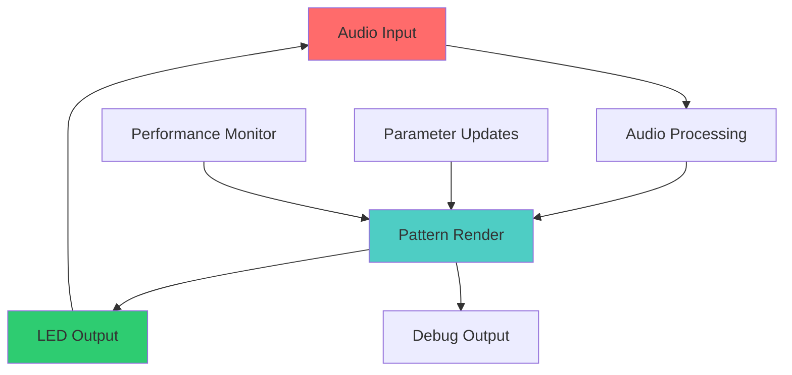

# 06_Reference
## Complete Technical Documentation

```
📚 REFERENCE - Your Technical Knowledge Base
```

This is your comprehensive technical reference section. Whether you need to look up an API function, understand the hardware specifications, or find implementation details, everything is documented here with precision and clarity.

## 📋 Section Contents

### 🏛️ [SDK_ARCHITECTURE_SPECIFICATION.md](SDK_ARCHITECTURE_SPECIFICATION.md) ✅ **Complete**
**Time: As needed** | **Skill: Intermediate to Advanced**

Complete architectural documentation of the K1 Lightwave SDK system.

**What's Inside:**
- System architecture overview
- Component interaction matrix
- Pattern lifecycle management
- Audio processing pipeline
- Performance optimization framework
- Memory management strategies
- Threading and real-time considerations

**Perfect for:** System architects, advanced developers, troubleshooting

### 📚 [API_Reference.md](API_Reference.md) *(Coming Soon)*
**Time: As needed** | **Skill: All Levels**

Comprehensive reference for all SDK classes, methods, and functions.

**What's Coming:**
- Complete class hierarchy
- Method signatures and parameters
- Return values and error conditions
- Usage examples for each API
- Parameter ranges and validation
- Performance characteristics
- Thread safety information

### 🔌 [Hardware_Specification.md](Hardware_Specification.md) *(Coming Soon)*
**Time: As needed** | **Skill: Intermediate**

Complete technical specifications for K1 Lightwave hardware.

**What's Coming:**
- ESP32-S3/C6 technical specifications
- Memory architecture and constraints
- GPIO configuration and capabilities
- Power consumption and thermal characteristics
- LED driver specifications
- Audio input specifications
- Expansion connector details

### 🎵 [Audio_Data_Structures.md](Audio_Data_Structures.md) *(Coming Soon)*
**Time: As needed** | **Skill: Intermediate**

Detailed documentation of all audio-related data structures and processing.

**What's Coming:**
- AudioData structure complete reference
- FFT implementation details
- Beat detection algorithms
- Frequency band processing
- Chromagram analysis
- Audio preprocessing pipeline
- Real-time constraints and timing

### ❌ [Error_Codes.md](Error_Codes.md) *(Coming Soon)*
**Time: As needed** | **Skill: All Levels**

Complete reference for all error codes and troubleshooting information.

**What's Coming:**
- Compilation error codes
- Runtime error conditions
- Hardware communication errors
- Audio processing errors
- Memory allocation failures
- Performance warning conditions
- Recovery strategies

## 🔍 Quick Reference Guides

### **Common Lookups**
- **Pattern Class Structure** → [SDK_ARCHITECTURE_SPECIFICATION.md](SDK_ARCHITECTURE_SPECIFICATION.md)
- **Audio Data Access** → [Audio_Data_Structures.md](Audio_Data_Structures.md) *(Coming Soon)*
- **Hardware Limits** → [Hardware_Specification.md](Hardware_Specification.md) *(Coming Soon)*
- **Error Debugging** → [Error_Codes.md](Error_Codes.md) *(Coming Soon)*

### **Performance Specifications**

| Component | Specification | Notes |
|-----------|---------------|-------|
| **CPU** | ESP32-S3 @ 240MHz | Dual-core Xtensa LX7 |
| **Memory** | 512KB SRAM | Shared heap/stack space |
| **Flash** | 8MB | Program and data storage |
| **LEDs** | 320 maximum | APA102 compatible |
| **Frame Rate** | 120+ FPS | Minimum requirement |
| **Audio Latency** | <10ms | Input to visual response |

### **Memory Layout**

```
┌─────────────────────────────────────┐
│              ESP32-S3 Memory         │
├─────────────────────────────────────┤
│ 0x3FC88000 │ DRAM (328KB)          │ ← Pattern heap
│ 0x3FCE0000 │ DRAM (128KB)          │ ← System reserved  
│ 0x40378000 │ IRAM (128KB)          │ ← Pattern code
│ 0x42000000 │ Flash Cache (32MB)    │ ← Memory mapping
└─────────────────────────────────────┘
```

### **GPIO Assignments**

| Pin | Function | Notes |
|-----|----------|-------|
| GPIO 11 | LED Data (Strip 1) | APA102 compatible |
| GPIO 12 | LED Data (Strip 2) | APA102 compatible |
| GPIO 13 | LED Clock | Shared clock signal |
| GPIO 21 | I2C SDA | M5ROTATE8 encoder |
| GPIO 22 | I2C SCL | M5ROTATE8 encoder |
| GPIO 43 | Audio Input | I2S microphone |
| GPIO 44 | Audio Clock | I2S clock signal |

## 📖 Documentation Standards

### **API Documentation Format**
```cpp
/**
 * @brief Brief description of function
 * @param paramName Description of parameter
 * @return Description of return value
 * @throws ExceptionType When this exception occurs
 * @since Version when function was added
 * @see RelatedFunction, RelatedClass
 * @example
 * // Usage example
 * result = functionName(param);
 */
```

### **Performance Documentation**
Each API includes:
- **Time Complexity** - O(n) notation
- **Space Complexity** - Memory usage
- **Real-time Suitability** - Safe for render loop?
- **Thread Safety** - Concurrent access safety

### **Hardware Integration**
- **Power Requirements** - Current consumption
- **Timing Constraints** - Setup/hold times
- **Electrical Specifications** - Voltage levels
- **Thermal Considerations** - Operating temperatures

## 🎯 Reference Categories

### **Core API**
- Pattern base classes
- Audio data structures
- Color manipulation
- LED control functions
- Performance monitoring

### **Advanced API**
- Custom audio processors
- Hardware abstraction layer
- Memory management
- Threading primitives
- Debugging interfaces

### **System API**
- Firmware interfaces
- Hardware configuration
- Power management
- Diagnostic functions
- Update mechanisms

## 🔧 Implementation Details

### **Pattern Execution Model**


### **Memory Management**
- **Stack**: 8KB default, expandable
- **Heap**: Dynamic allocation with limits
- **Static**: Compile-time allocation preferred
- **DMA**: Hardware-managed buffers

### **Real-time Constraints**
- **Frame Budget**: 8.33ms @ 120 FPS
- **Audio Latency**: <10ms total pipeline
- **Memory Allocation**: Avoid in render loop
- **Interrupt Handling**: Audio has priority

## 📊 Performance Characteristics

### **Typical Benchmarks**
| Operation | Time (μs) | Notes |
|-----------|-----------|-------|
| Pattern render | 2000-6000 | Depends on complexity |
| Audio processing | 500-1500 | FFT + analysis |
| LED output | 300-800 | SPI transfer |
| Parameter update | <100 | Cache-optimized |

### **Memory Usage Patterns**
| Component | RAM Usage | Notes |
|-----------|-----------|-------|
| Pattern state | 1-8KB | Varies by pattern |
| Audio buffers | 4KB | Fixed allocation |
| LED buffers | 960B | 320 LEDs × 3 bytes |
| System overhead | 16KB | OS and drivers |

## 🔗 Cross-References

### **Related Sections**
- **Development** → [📁 03_Pattern_Development](../03_Pattern_Development/)
- **Tools** → [📁 04_Tools_and_Workflow](../04_Tools_and_Workflow/)
- **Troubleshooting** → [📁 08_Appendices](../08_Appendices/)

### **External Resources**
- **ESP32-S3 Datasheet** → [Espressif Documentation](https://docs.espressif.com/)
- **APA102 Specification** → LED controller documentation
- **I2S Audio** → Audio interface specifications

## 💡 Usage Tips

### **Efficient Reference**
- Use browser search (Ctrl+F) for quick lookups
- Bookmark frequently used sections
- Cross-reference related concepts
- Check examples before implementation

### **Troubleshooting Workflow**
1. **Identify Error** → Check error codes reference
2. **Understand Context** → Review architecture docs
3. **Check Constraints** → Verify hardware limitations
4. **Find Examples** → Look for similar implementations
5. **Test Systematically** → Isolate the issue

### **Performance Optimization**
1. **Profile First** → Measure before optimizing
2. **Check Specifications** → Understand hardware limits
3. **Review Best Practices** → Follow proven patterns
4. **Validate Results** → Measure improvements

---

*Your technical knowledge base for K1 Lightwave development* 📚⚡

**Quick Start Reference:** [SDK_ARCHITECTURE_SPECIFICATION.md](SDK_ARCHITECTURE_SPECIFICATION.md)