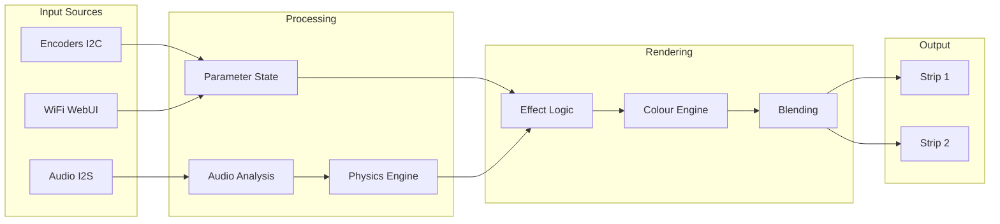

# Pattern Implementation Playbook
## Technical Specifications and Procedures for LGP Pattern Development

```
╔═══════════════════════════════════════════════════════════════════════════════╗
║                     SPECTRASYNQ K1-LIGHTWAVE                                   ║
║              Pattern Implementation Playbook v1.0                              ║
║                                                                                ║
║   "From Concept to Code: The Engineer's Guide to Light Art"                   ║
╚═══════════════════════════════════════════════════════════════════════════════╝
```

**Related Documents:**
- [Creative Pattern Guide](LGP_CREATIVE_PATTERN_GUIDE.md) - Physics and artistic fundamentals
- [Storytelling Framework](LIGHTSHOW_STORYTELLING_FRAMEWORK.md) - Emotional narrative design

---

## Table of Contents

1. [System Architecture Overview](#1-system-architecture-overview)
2. [Pattern Architecture Template](#2-pattern-architecture-template)
3. [Performance Budget Allocation](#3-performance-budget-allocation)
4. [Hardware Constants Reference](#4-hardware-constants-reference)
5. [Testing Procedures](#5-testing-procedures)
6. [Safety Protocols](#6-safety-protocols)
7. [Integration Checklist](#7-integration-checklist)
8. [Code Templates](#8-code-templates)
9. [Debugging Guide](#9-debugging-guide)
10. [Performance Optimisation Techniques](#10-performance-optimisation-techniques)

---

## 1. System Architecture Overview

### 1.1 Hardware Configuration

```
┌─────────────────────────────────────────────────────────────────────────────┐
│                         ESP32-S3 HARDWARE PLATFORM                          │
├─────────────────────────────────────────────────────────────────────────────┤
│                                                                             │
│   ┌───────────────┐         ┌──────────────────────────────────────────┐   │
│   │   ESP32-S3    │         │           Light Guide Plate              │   │
│   │   @ 240MHz    │         │                                          │   │
│   │               │         │    Strip 1 (160 LEDs) ━━━━━━━━━━━▶      │   │
│   │  Core 0: I2C  │────────▶│                                          │   │
│   │  Core 1: LED  │         │    ◀━━━━━━━━━━━ Strip 2 (160 LEDs)      │   │
│   │               │         │                                          │   │
│   │  16MB Flash   │         │       CENTER ORIGIN: LEDs 79/80          │   │
│   │  8MB PSRAM    │         │                                          │   │
│   └───────────────┘         └──────────────────────────────────────────┘   │
│           │                                                                 │
│           │                                                                 │
│   ┌───────┴───────┐                                                        │
│   │  M5ROTATE8    │                                                        │
│   │  8 Encoders   │                                                        │
│   │  I2C @ 400kHz │                                                        │
│   └───────────────┘                                                        │
│                                                                             │
└─────────────────────────────────────────────────────────────────────────────┘
```

### 1.2 Software Stack

```
┌─────────────────────────────────────────────────────────────────┐
│                      APPLICATION LAYER                          │
│   Effects │ Patterns │ Transitions │ Audio Response            │
├─────────────────────────────────────────────────────────────────┤
│                       ENGINE LAYER                              │
│   ColorEngine │ MotionEngine │ BlendingEngine │ PhysicsEngine  │
├─────────────────────────────────────────────────────────────────┤
│                     ABSTRACTION LAYER                           │
│   LightGuideEffect │ EffectBase │ ZoneComposer                 │
├─────────────────────────────────────────────────────────────────┤
│                       DRIVER LAYER                              │
│   FastLED │ I2C Driver │ Audio System │ WiFi Stack             │
├─────────────────────────────────────────────────────────────────┤
│                      HARDWARE LAYER                             │
│   ESP32-S3 │ WS2812B │ SPH0645 Mic │ M5ROTATE8                │
└─────────────────────────────────────────────────────────────────┘
```

### 1.3 Data Flow Pipeline



---

## 2. Pattern Architecture Template

### 2.1 Base Class Hierarchy

```cpp
// All LGP patterns inherit from LightGuideEffect
// Which inherits from EffectBase

class YourNewPattern : public LightGuideEffect {
private:
    // ═══════════════════════════════════════════════════════════
    // STATIC STATE ALLOCATION
    // All state must be statically allocated - NO heap allocation
    // ═══════════════════════════════════════════════════════════
    
    // Physics state
    float waveBuffer[HardwareConfig::STRIP_LENGTH];
    float velocityBuffer[HardwareConfig::STRIP_LENGTH];
    
    // Animation state
    float phase = 0.0f;
    uint32_t lastUpdateTime = 0;
    
    // Audio response state
    float smoothedEnergy = 0.0f;
    float beatAccumulator = 0.0f;
    
public:
    // ═══════════════════════════════════════════════════════════
    // CONSTRUCTOR
    // Must call parent constructor with effect name
    // ═══════════════════════════════════════════════════════════
    
    YourNewPattern(CRGB* strip1, CRGB* strip2) 
        : LightGuideEffect("Your Pattern Name", strip1, strip2, 
                          128,  // default brightness
                          10,   // default speed
                          20)   // default fade
    {
        reset();
    }
    
    // ═══════════════════════════════════════════════════════════
    // LIFECYCLE METHODS
    // ═══════════════════════════════════════════════════════════
    
    void reset() override {
        // Clear all state buffers
        memset(waveBuffer, 0, sizeof(waveBuffer));
        memset(velocityBuffer, 0, sizeof(velocityBuffer));
        phase = 0.0f;
        smoothedEnergy = 0.0f;
        lastUpdateTime = millis();
    }
    
    void update() override {
        // Calculate delta time
        uint32_t now = millis();
        float deltaTime = (now - lastUpdateTime) * 0.001f;
        lastUpdateTime = now;
        
        // Update physics
        updatePhysics(deltaTime);
        
        // Update audio response
        updateAudioResponse(deltaTime);
        
        // Render to strips
        render();
    }
    
private:
    // ═══════════════════════════════════════════════════════════
    // PHYSICS UPDATE
    // ═══════════════════════════════════════════════════════════
    
    void updatePhysics(float deltaTime) {
        float speed = paletteSpeed * 0.1f;
        
        // Wave propagation with CENTER ORIGIN constraint
        for (uint16_t i = 1; i < HardwareConfig::STRIP_LENGTH - 1; i++) {
            float gradient = (waveBuffer[i+1] - waveBuffer[i-1]) * 0.5f;
            velocityBuffer[i] += gradient * speed;
            velocityBuffer[i] *= 0.99f;  // Damping
        }
        
        for (uint16_t i = 0; i < HardwareConfig::STRIP_LENGTH; i++) {
            waveBuffer[i] += velocityBuffer[i] * deltaTime;
            waveBuffer[i] *= 0.98f;  // Decay
        }
        
        // Phase advancement
        phase += deltaTime * speed;
        if (phase > TWO_PI) phase -= TWO_PI;
    }
    
    // ═══════════════════════════════════════════════════════════
    // AUDIO RESPONSE
    // ═══════════════════════════════════════════════════════════
    
    void updateAudioResponse(float deltaTime) {
        // Get current audio energy (from AudioSystem)
        float currentEnergy = AudioSystem::getEnergy();
        
        // Smooth the energy with attack/release
        float attack = 0.1f;
        float release = 0.05f;
        
        if (currentEnergy > smoothedEnergy) {
            smoothedEnergy += (currentEnergy - smoothedEnergy) * attack;
        } else {
            smoothedEnergy += (currentEnergy - smoothedEnergy) * release;
        }
        
        // Beat detection response
        if (AudioSystem::isBeatDetected()) {
            beatAccumulator = 1.0f;
            // Inject energy at centre (CENTER ORIGIN)
            waveBuffer[HardwareConfig::STRIP_CENTER_POINT] += smoothedEnergy;
        }
        
        // Decay beat accumulator
        beatAccumulator *= 0.95f;
    }
    
    // ═══════════════════════════════════════════════════════════
    // RENDERING
    // ═══════════════════════════════════════════════════════════
    
    void render() {
        float intensityNorm = visualParams.getIntensityNorm();
        float saturationNorm = visualParams.getSaturationNorm();
        
        for (uint16_t i = 0; i < HardwareConfig::STRIP_LENGTH; i++) {
            // Calculate visual value from physics
            float value = waveBuffer[i];
            
            // Apply interference between strips
            float interference = calculateInterference(i, 
                HardwareConfig::STRIP_LENGTH - i - 1, phase);
            
            // Calculate brightness
            uint8_t brightness = constrain(
                (value * 127 + 128) * intensityNorm * interference,
                0, 255
            );
            
            // Calculate colour from position and global hue
            uint8_t hue = gHue + (i * 2);
            uint8_t saturation = 255 * saturationNorm;
            
            // Apply to both strips with CENTER ORIGIN mirroring
            CHSV colour(hue, saturation, brightness);
            
            // Strip 1: Direct
            setEdge1LED(i, colour);
            
            // Strip 2: Phase-offset for interference
            CHSV colour2(hue + 128, saturation, brightness);
            setEdge2LED(i, colour2);
        }
    }
};
```

### 2.2 File Structure

```
src/effects/
├── lightguide/
│   ├── LightGuideEffect.h          # Base class
│   ├── LGPPhysicsEngine.h          # Physics simulation
│   ├── YourNewPattern.cpp          # Implementation
│   └── YourNewPattern.h            # Header (if needed)
├── EffectRegistry.h                 # Registration
└── EffectMetadata.h                 # Metadata definitions
```

---

## 3. Performance Budget Allocation

### 3.1 Frame Time Budget (120 FPS = 8.33ms per frame)

```
┌────────────────────────────────────────────────────────────────┐
│              FRAME TIME BUDGET: 8.33ms TOTAL                   │
├────────────────────────────────────────────────────────────────┤
│                                                                │
│  ┌──────────────────────────────────────┐                     │
│  │ FastLED.show()          5.80ms  70% │ ████████████████████ │
│  └──────────────────────────────────────┘                     │
│  (Fixed by hardware - 320 LEDs @ 800kHz)                      │
│                                                                │
│  ┌──────────────────────────────────────┐                     │
│  │ Effect Computation      1.50ms  18% │ █████                │
│  └──────────────────────────────────────┘                     │
│  (Your pattern code budget)                                    │
│                                                                │
│  ┌──────────────────────────────────────┐                     │
│  │ Audio Processing        0.50ms   6% │ ██                   │
│  └──────────────────────────────────────┘                     │
│                                                                │
│  ┌──────────────────────────────────────┐                     │
│  │ System Overhead         0.53ms   6% │ ██                   │
│  └──────────────────────────────────────┘                     │
│                                                                │
└────────────────────────────────────────────────────────────────┘

YOUR EFFECT MUST COMPLETE IN < 1.5ms
```

### 3.2 Memory Budget

```
┌────────────────────────────────────────────────────────────────┐
│                   MEMORY ALLOCATION LIMITS                     │
├────────────────────────────────────────────────────────────────┤
│                                                                │
│  STATIC RAM (320KB available):                                 │
│  ════════════════════════════                                  │
│  LED Buffers (2 × 160 × 3)        960 bytes    RESERVED       │
│  Audio Buffers                    4,096 bytes  RESERVED       │
│  System Overhead                  50,000 bytes RESERVED       │
│  ────────────────────────────────────────────                  │
│  Available for Effects:          ~264KB                        │
│                                                                │
│  PER-EFFECT ALLOCATION GUIDE:                                  │
│  ═══════════════════════════                                   │
│  Simple effect:     < 1KB                                      │
│  Medium effect:     1-4KB                                      │
│  Complex effect:    4-8KB                                      │
│  Maximum allowed:   16KB                                       │
│                                                                │
│  PROHIBITED:                                                   │
│  ═══════════                                                   │
│  ✗ Dynamic allocation (new, malloc)                           │
│  ✗ std::vector, std::string                                   │
│  ✗ Recursive functions with deep stacks                       │
│                                                                │
└────────────────────────────────────────────────────────────────┘
```

### 3.3 Complexity Cost Reference

| Operation | Time Cost | Memory Cost | Recommended Limit |
|-----------|-----------|-------------|-------------------|
| `sin()` float | ~2.0µs | 0 | Use sin16() instead |
| `sin16()` | ~0.2µs | 0 | Unlimited |
| `sqrt()` | ~1.5µs | 0 | < 50 per frame |
| `ColorFromPalette()` | ~0.1µs | 0 | Unlimited |
| `scale8()` | ~0.02µs | 0 | Unlimited |
| `blur1d()` | ~0.5µs/LED | 0 | 1-2 per frame |
| Per-LED loop iteration | ~0.1µs | 0 | Always 160 |
| Particle update | ~0.5µs | 12 bytes | < 50 particles |
| Wave propagation step | ~0.8µs | 4 bytes/LED | 1 buffer pair |

---

## 4. Hardware Constants Reference

### 4.1 Core Configuration

```cpp
namespace HardwareConfig {
    // LED Strip Configuration
    constexpr uint16_t STRIP_LENGTH = 160;
    constexpr uint16_t TOTAL_LEDS = 320;  // 2 strips
    constexpr uint16_t STRIP_CENTER_POINT = 79;  // CENTER ORIGIN
    constexpr uint16_t STRIP_HALF_LENGTH = 80;
    
    // GPIO Pins
    constexpr uint8_t LED_PIN_1 = 11;
    constexpr uint8_t LED_PIN_2 = 12;
    
    // Performance Targets
    constexpr uint16_t TARGET_FPS = 120;
    constexpr uint32_t FRAME_TIME_US = 8333;  // 1,000,000 / 120
    
    // LED Type
    using LED_TYPE = WS2812B;
    constexpr EOrder COLOR_ORDER = GRB;
}
```

### 4.2 Light Guide Plate Physical Constants

```cpp
namespace LightGuide {
    // Physical Properties
    constexpr float PLATE_LENGTH_MM = 329.0f;
    constexpr float LED_SPACING_MM = PLATE_LENGTH_MM / 160;  // ~2.06mm
    
    // Optical Properties
    constexpr float REFRACTIVE_INDEX = 1.49f;      // Acrylic
    constexpr float CRITICAL_ANGLE = 42.2f;        // degrees
    constexpr float PROPAGATION_LOSS_DB_M = 0.1f;  // Material loss
    
    // Simulation Constants
    constexpr uint8_t INTERFERENCE_MAP_RESOLUTION = 32;
    constexpr uint8_t MAX_DEPTH_LAYERS = 5;
}
```

### 4.3 Encoder Configuration

```cpp
// Encoder Assignments
enum EncoderFunction : uint8_t {
    ENC_EFFECT_SELECT   = 0,  // Effect selection
    ENC_BRIGHTNESS      = 1,  // Global brightness
    ENC_PALETTE         = 2,  // Palette selection
    ENC_SPEED           = 3,  // Animation speed
    ENC_INTENSITY       = 4,  // Effect intensity
    ENC_SATURATION      = 5,  // Colour saturation
    ENC_COMPLEXITY      = 6,  // Pattern complexity
    ENC_VARIATION       = 7   // Mode/variation
};

// Visual Parameters Structure
struct VisualParams {
    uint8_t intensity = 128;    // 0-255
    uint8_t saturation = 255;   // 0-255
    uint8_t complexity = 128;   // 0-255
    uint8_t variation = 0;      // 0-255
    
    float getIntensityNorm()  { return intensity / 255.0f; }
    float getSaturationNorm() { return saturation / 255.0f; }
    float getComplexityNorm() { return complexity / 255.0f; }
    float getVariationNorm()  { return variation / 255.0f; }
};

extern VisualParams visualParams;  // Global instance
extern uint8_t gHue;               // Global rotating hue
extern float paletteSpeed;         // Global animation speed
```

---

## 5. Testing Procedures

### 5.1 Visual Validation Checklist

```
┌────────────────────────────────────────────────────────────────┐
│              VISUAL VALIDATION CHECKLIST                       │
├────────────────────────────────────────────────────────────────┤
│                                                                │
│  □ CENTER ORIGIN COMPLIANCE                                    │
│    □ Effects originate from LEDs 79/80                        │
│    □ Expansion is outward toward edges                        │
│    □ No orphan effects starting at edges                      │
│                                                                │
│  □ DUAL STRIP COORDINATION                                     │
│    □ Both strips display coordinated patterns                 │
│    □ Interference patterns visible on LGP                     │
│    □ No strip operating independently (unless intended)       │
│                                                                │
│  □ COLOUR QUALITY                                              │
│    □ No colour banding or stepping                            │
│    □ Smooth gradients                                         │
│    □ Saturation parameter affects output                      │
│                                                                │
│  □ MOTION QUALITY                                              │
│    □ Smooth animation (no stuttering)                         │
│    □ Speed parameter affects velocity                         │
│    □ No jarring transitions                                   │
│                                                                │
│  □ BRIGHTNESS CONTROL                                          │
│    □ Brightness encoder affects output                        │
│    □ No flickering at low brightness                          │
│    □ Full brightness achievable                               │
│                                                                │
│  □ EDGE HANDLING                                               │
│    □ No wrapping artifacts at LED 0 or 159                    │
│    □ Smooth fade at boundaries (if applicable)                │
│    □ Reflections handled correctly (if applicable)            │
│                                                                │
└────────────────────────────────────────────────────────────────┘
```

### 5.2 Audio Response Verification

```
┌────────────────────────────────────────────────────────────────┐
│            AUDIO RESPONSE VERIFICATION                         │
├────────────────────────────────────────────────────────────────┤
│                                                                │
│  TEST 1: SILENCE BEHAVIOUR                                     │
│  ─────────────────────────                                     │
│  Input:  No audio / silence                                    │
│  Expected:                                                     │
│    □ Ambient pattern continues (no crash)                     │
│    □ No erratic behaviour                                     │
│    □ Smooth idle animation                                    │
│                                                                │
│  TEST 2: BEAT RESPONSE                                         │
│  ─────────────────────                                         │
│  Input:  120 BPM electronic track                              │
│  Expected:                                                     │
│    □ Visual response on every beat                            │
│    □ Timing matches music beat                                │
│    □ Response intensity matches beat strength                 │
│                                                                │
│  TEST 3: FREQUENCY MAPPING                                     │
│  ────────────────────────                                      │
│  Input:  Frequency sweep 50Hz → 5kHz                           │
│  Expected:                                                     │
│    □ Bass frequencies create expected response                │
│    □ Mid frequencies create expected response                 │
│    □ High frequencies create expected response                │
│                                                                │
│  TEST 4: DYNAMIC RANGE                                         │
│  ──────────────────────                                        │
│  Input:  Quiet passage → Loud passage                          │
│  Expected:                                                     │
│    □ Quiet sections produce subtle response                   │
│    □ Loud sections produce strong response                    │
│    □ No clipping or saturation artifacts                      │
│                                                                │
│  TEST 5: GENRE VARIETY                                         │
│  ─────────────────────                                         │
│  Input:  Classical, Electronic, Jazz, Rock                     │
│  Expected:                                                     │
│    □ Pattern works aesthetically with all genres              │
│    □ No genre-specific failures                               │
│                                                                │
└────────────────────────────────────────────────────────────────┘
```

### 5.3 Performance Profiling Methodology

```cpp
// Add profiling to your effect
class PerformanceProfiler {
private:
    uint32_t frameStart;
    uint32_t sampleCount = 0;
    uint32_t totalTime = 0;
    uint32_t maxTime = 0;
    uint32_t minTime = UINT32_MAX;
    
public:
    void beginFrame() {
        frameStart = micros();
    }
    
    void endFrame() {
        uint32_t elapsed = micros() - frameStart;
        totalTime += elapsed;
        sampleCount++;
        
        if (elapsed > maxTime) maxTime = elapsed;
        if (elapsed < minTime) minTime = elapsed;
        
        // Report every 120 frames (1 second)
        if (sampleCount >= 120) {
            Serial.printf(
                "Effect Performance: avg=%luus, min=%luus, max=%luus\n",
                totalTime / sampleCount, minTime, maxTime
            );
            
            // Check against budget
            if (totalTime / sampleCount > 1500) {
                Serial.println("WARNING: Effect exceeds 1.5ms budget!");
            }
            
            // Reset
            sampleCount = 0;
            totalTime = 0;
            maxTime = 0;
            minTime = UINT32_MAX;
        }
    }
};

// Usage in your effect
void update() override {
    profiler.beginFrame();
    
    // Your effect code here...
    
    profiler.endFrame();
}
```

### 5.4 CENTER ORIGIN Compliance Testing

```cpp
// Automated CENTER ORIGIN compliance test
bool testCenterOriginCompliance(LightGuideEffect* effect) {
    // Reset the effect
    effect->reset();
    
    // Clear test strips
    CRGB testStrip1[160], testStrip2[160];
    fill_solid(testStrip1, 160, CRGB::Black);
    fill_solid(testStrip2, 160, CRGB::Black);
    
    // Run one frame
    effect->update();
    
    // Check: First activity should be near centre
    int firstActiveIndex = -1;
    for (int i = 0; i < 160; i++) {
        if (testStrip1[i].getLuma() > 10) {
            firstActiveIndex = i;
            break;
        }
    }
    
    // Pass if first activity within 20 LEDs of centre
    bool passed = (firstActiveIndex >= 60 && firstActiveIndex <= 100);
    
    if (!passed) {
        Serial.printf("CENTER ORIGIN FAIL: First activity at LED %d\n", 
                      firstActiveIndex);
    }
    
    return passed;
}
```

---

## 6. Safety Protocols

### 6.1 Photosensitivity Protection

```cpp
// MANDATORY: All patterns must include photosensitivity protection

namespace PhotosensitivityProtection {
    // Maximum allowed flicker rate (Hz)
    // Rates between 3-60 Hz are potentially dangerous
    constexpr float MAX_SAFE_FLASH_RATE = 3.0f;
    constexpr float MIN_SAFE_FLASH_RATE = 60.0f;
    
    // Minimum on-time for bright flashes (ms)
    constexpr uint32_t MIN_FLASH_DURATION_MS = 100;
    
    // Maximum brightness change per frame
    constexpr uint8_t MAX_BRIGHTNESS_DELTA = 50;
    
    // Flash counter for rate limiting
    static uint32_t lastFlashTime = 0;
    static uint8_t flashCount = 0;
    
    bool isFlashSafe(uint8_t currentBrightness, uint8_t targetBrightness) {
        uint8_t delta = abs(targetBrightness - currentBrightness);
        
        // Large brightness change = potential flash
        if (delta > 200) {
            uint32_t now = millis();
            
            // Check flash rate
            if (now - lastFlashTime < 333) {  // 3Hz limit
                flashCount++;
                if (flashCount > 3) {
                    return false;  // Too many rapid flashes
                }
            } else {
                flashCount = 0;
            }
            
            lastFlashTime = now;
        }
        
        return true;
    }
    
    uint8_t safeBrightnessTransition(uint8_t current, uint8_t target) {
        int8_t delta = target - current;
        
        // Limit rate of change
        if (delta > MAX_BRIGHTNESS_DELTA) {
            return current + MAX_BRIGHTNESS_DELTA;
        } else if (delta < -MAX_BRIGHTNESS_DELTA) {
            return current - MAX_BRIGHTNESS_DELTA;
        }
        
        return target;
    }
}
```

### 6.2 Memory Safety Patterns

```cpp
// REQUIRED: All buffer access must be bounds-checked

// WRONG - Potential buffer overflow
void badExample() {
    for (int i = 0; i < 200; i++) {  // 200 > 160!
        strip1[i] = CRGB::Red;
    }
}

// CORRECT - Bounds-checked access
void goodExample() {
    for (uint16_t i = 0; i < HardwareConfig::STRIP_LENGTH; i++) {
        strip1[i] = CRGB::Red;
    }
}

// CORRECT - Using helper method with bounds check
void betterExample() {
    for (uint16_t i = 0; i < HardwareConfig::STRIP_LENGTH; i++) {
        setEdge1LED(i, CRGB::Red);  // Has internal bounds check
    }
}

// REQUIRED for particle systems - bounds checking
void safeParticleRender(float position, CRGB color) {
    int16_t pos = (int16_t)position;
    
    // Bounds check
    if (pos < 0 || pos >= HardwareConfig::STRIP_LENGTH) {
        return;  // Out of bounds - skip silently
    }
    
    strip1[pos] += color;
}
```

### 6.3 Numerical Stability

```cpp
// REQUIRED: Prevent numerical instability

// WRONG - Values can grow unbounded
void badPhysics() {
    velocity += acceleration;
    position += velocity;
    // No limits! Values can explode
}

// CORRECT - Constrained values
void goodPhysics() {
    velocity += acceleration;
    velocity = constrain(velocity, -10.0f, 10.0f);  // Limit
    velocity *= 0.99f;  // Damping
    
    position += velocity;
    position = fmod(position, (float)STRIP_LENGTH);  // Wrap
}

// REQUIRED: NaN/Inf protection
float safeCalculation(float input) {
    float result = complexCalculation(input);
    
    // Check for numerical errors
    if (isnan(result) || isinf(result)) {
        return 0.0f;  // Safe default
    }
    
    return result;
}
```

### 6.4 Power Safety

```cpp
// Brightness limiting to prevent overcurrent

namespace PowerSafety {
    // Maximum average brightness (prevents overcurrent)
    constexpr uint8_t MAX_AVERAGE_BRIGHTNESS = 180;
    
    // Calculate current brightness and limit if needed
    void enforcePowerLimit(CRGB* strip, uint16_t count) {
        uint32_t totalBrightness = 0;
        
        for (uint16_t i = 0; i < count; i++) {
            totalBrightness += strip[i].r + strip[i].g + strip[i].b;
        }
        
        uint32_t averageBrightness = totalBrightness / (count * 3);
        
        if (averageBrightness > MAX_AVERAGE_BRIGHTNESS) {
            // Scale down all LEDs
            uint8_t scaleFactor = (MAX_AVERAGE_BRIGHTNESS * 255) / averageBrightness;
            for (uint16_t i = 0; i < count; i++) {
                strip[i].nscale8(scaleFactor);
            }
        }
    }
}
```

---

## 7. Integration Checklist

### 7.1 Pre-Integration Checklist

```
┌────────────────────────────────────────────────────────────────┐
│              PRE-INTEGRATION CHECKLIST                         │
├────────────────────────────────────────────────────────────────┤
│                                                                │
│  CODE QUALITY                                                  │
│  □ No compiler warnings                                        │
│  □ No heap allocation (new/malloc)                            │
│  □ All buffers bounds-checked                                 │
│  □ Numerical stability verified                               │
│  □ Consistent coding style                                    │
│                                                                │
│  PERFORMANCE                                                   │
│  □ Profiled under 1.5ms average                              │
│  □ No blocking operations                                     │
│  □ Tested at target 120 FPS                                  │
│                                                                │
│  FUNCTIONALITY                                                 │
│  □ CENTER ORIGIN compliance verified                          │
│  □ All encoder parameters functional                          │
│  □ Audio response tested                                      │
│  □ Transitions to/from other effects smooth                   │
│                                                                │
│  SAFETY                                                        │
│  □ Photosensitivity protection implemented                    │
│  □ Power limiting active                                      │
│  □ No crash conditions found                                  │
│                                                                │
│  DOCUMENTATION                                                 │
│  □ Effect name and description                                │
│  □ Parameter mapping documented                               │
│  □ Performance characteristics noted                          │
│                                                                │
└────────────────────────────────────────────────────────────────┘
```

### 7.2 Effect Registration Process

```cpp
// Step 1: Add to EffectRegistry.h

// In the effects enum
enum EffectType : uint8_t {
    // ... existing effects ...
    EFFECT_YOUR_NEW_PATTERN,
    // ... 
    EFFECT_COUNT
};

// Step 2: Add metadata in EffectMetadata.h

const EffectMetadata effectMetadata[] = {
    // ... existing effects ...
    {
        .name = "Your Pattern Name",
        .category = CATEGORY_PHYSICS,  // or appropriate category
        .defaultIntensity = 128,
        .defaultComplexity = 128,
        .supportsDualStrip = true,
        .usesPhysics = true
    },
    // ...
};

// Step 3: Add to effect factory

LightGuideEffect* createEffect(EffectType type, CRGB* strip1, CRGB* strip2) {
    switch (type) {
        // ... existing cases ...
        case EFFECT_YOUR_NEW_PATTERN:
            return new YourNewPattern(strip1, strip2);
        // ...
    }
}
```

### 7.3 Encoder Mapping Configuration

```cpp
// Define how your effect responds to each encoder

void YourNewPattern::onEncoderChange(uint8_t encoder, int8_t delta) {
    switch (encoder) {
        case ENC_SPEED:
            // Map to animation speed
            animationSpeed = constrain(animationSpeed + delta * 5, 10, 255);
            break;
            
        case ENC_INTENSITY:
            // Already handled by visualParams
            break;
            
        case ENC_COMPLEXITY:
            // Map to wave frequency / detail level
            waveFrequency = 1 + visualParams.complexity / 32;  // 1-8 waves
            break;
            
        case ENC_VARIATION:
            // Map to mode selection
            currentMode = visualParams.variation / 64;  // 0-3 modes
            break;
    }
}
```

### 7.4 Palette Integration

```cpp
// Use the global palette system for colour consistency

void render() {
    // Access current palette
    CRGBPalette16& palette = currentPalette;
    
    for (uint16_t i = 0; i < STRIP_LENGTH; i++) {
        // Use palette for colours
        uint8_t paletteIndex = gHue + (i * 2);
        uint8_t brightness = calculateBrightness(i);
        
        CRGB color = ColorFromPalette(palette, paletteIndex, brightness);
        
        setEdge1LED(i, color);
    }
}
```

### 7.5 Transition Compatibility

```cpp
// Effects must support smooth transitions

// Implement state saving for transitions
void saveState(EffectState& state) {
    state.phase = this->phase;
    memcpy(state.buffer, this->waveBuffer, sizeof(waveBuffer));
}

// Implement state loading for transitions
void loadState(const EffectState& state) {
    this->phase = state.phase;
    memcpy(this->waveBuffer, state.buffer, sizeof(waveBuffer));
}

// Implement blend-to capability
void blendTo(const EffectState& target, float progress) {
    for (uint16_t i = 0; i < STRIP_LENGTH; i++) {
        waveBuffer[i] = lerp(waveBuffer[i], target.buffer[i], progress);
    }
    phase = lerp(phase, target.phase, progress);
}
```

---

## 8. Code Templates

### 8.1 Simple Wave Effect Template

```cpp
#ifndef YOUR_WAVE_EFFECT_H
#define YOUR_WAVE_EFFECT_H

#include "LightGuideEffect.h"

class YourWaveEffect : public LightGuideEffect {
private:
    float phase = 0.0f;
    float waveCount = 3.0f;
    
public:
    YourWaveEffect(CRGB* s1, CRGB* s2) 
        : LightGuideEffect("Your Wave Effect", s1, s2) {}
    
    void reset() override {
        phase = 0.0f;
    }
    
    void update() override {
        // Update wave count from complexity
        waveCount = 2.0f + visualParams.getComplexityNorm() * 8.0f;
        
        // Advance phase
        phase += paletteSpeed * 0.01f;
        if (phase > TWO_PI) phase -= TWO_PI;
        
        // Render waves
        float intensityNorm = visualParams.getIntensityNorm();
        
        for (uint16_t i = 0; i < HardwareConfig::STRIP_LENGTH; i++) {
            // Calculate distance from centre
            float distFromCenter = abs((int)i - HardwareConfig::STRIP_CENTER_POINT);
            float normalizedDist = distFromCenter / HardwareConfig::STRIP_HALF_LENGTH;
            
            // Wave calculation
            float wave = sin(normalizedDist * waveCount * TWO_PI + phase);
            uint8_t brightness = (wave * 0.5f + 0.5f) * 255 * intensityNorm;
            
            // Colour from position
            uint8_t hue = gHue + (i * 2);
            
            // Apply to strips
            setEdge1LED(i, CHSV(hue, 255, brightness));
            setEdge2LED(i, CHSV(hue + 128, 255, brightness));  // Complementary
        }
    }
};

#endif
```

### 8.2 Particle System Template

```cpp
#ifndef YOUR_PARTICLE_EFFECT_H
#define YOUR_PARTICLE_EFFECT_H

#include "LightGuideEffect.h"

struct SimpleParticle {
    float position;
    float velocity;
    float life;
    uint8_t hue;
};

class YourParticleEffect : public LightGuideEffect {
private:
    static constexpr uint8_t MAX_PARTICLES = 20;
    SimpleParticle particles[MAX_PARTICLES];
    uint8_t activeCount = 0;
    
public:
    YourParticleEffect(CRGB* s1, CRGB* s2)
        : LightGuideEffect("Your Particle Effect", s1, s2) {}
    
    void reset() override {
        activeCount = 0;
        for (auto& p : particles) {
            p.life = 0;
        }
    }
    
    void update() override {
        // Spawn particles on beat (CENTER ORIGIN)
        if (AudioSystem::isBeatDetected()) {
            spawnParticle(HardwareConfig::STRIP_CENTER_POINT);
        }
        
        // Update particles
        for (uint8_t i = 0; i < MAX_PARTICLES; i++) {
            if (particles[i].life > 0) {
                particles[i].position += particles[i].velocity;
                particles[i].velocity *= 0.98f;  // Friction
                particles[i].life -= 0.02f;
                
                // Boundary bounce
                if (particles[i].position < 0 || 
                    particles[i].position >= HardwareConfig::STRIP_LENGTH) {
                    particles[i].velocity *= -0.8f;
                    particles[i].position = constrain(
                        particles[i].position, 0, 
                        HardwareConfig::STRIP_LENGTH - 1
                    );
                }
            }
        }
        
        // Render
        fadeToBlackBy(edge1, HardwareConfig::STRIP_LENGTH, 20);
        fadeToBlackBy(edge2, HardwareConfig::STRIP_LENGTH, 20);
        
        for (uint8_t i = 0; i < MAX_PARTICLES; i++) {
            if (particles[i].life > 0) {
                renderParticle(particles[i]);
            }
        }
    }
    
private:
    void spawnParticle(float position) {
        for (auto& p : particles) {
            if (p.life <= 0) {
                p.position = position;
                p.velocity = (random8() % 2 == 0 ? 2.0f : -2.0f);
                p.life = 1.0f;
                p.hue = gHue + random8(64);
                return;
            }
        }
    }
    
    void renderParticle(const SimpleParticle& p) {
        int pos = (int)p.position;
        if (pos < 0 || pos >= HardwareConfig::STRIP_LENGTH) return;
        
        uint8_t brightness = p.life * 255;
        CRGB color = CHSV(p.hue, 255, brightness);
        
        edge1[pos] += color;
        edge2[pos] += color;
    }
};

#endif
```

### 8.3 Physics-Based Effect Template

```cpp
#ifndef YOUR_PHYSICS_EFFECT_H
#define YOUR_PHYSICS_EFFECT_H

#include "LightGuideEffect.h"
#include "LGPPhysicsEngine.h"

class YourPhysicsEffect : public LightGuideEffect {
private:
    LGPPhysicsEngine physics;
    float energyBuffer[HardwareConfig::STRIP_LENGTH];
    
public:
    YourPhysicsEffect(CRGB* s1, CRGB* s2)
        : LightGuideEffect("Your Physics Effect", s1, s2) {}
    
    void reset() override {
        physics.reset();
        memset(energyBuffer, 0, sizeof(energyBuffer));
    }
    
    void update() override {
        // Add wave sources on beat
        if (AudioSystem::isBeatDetected()) {
            // Add waves from both edges
            physics.addWaveSource(0.5f, AudioSystem::getEnergy(), 3.0f, 0);
            physics.addWaveSource(0.5f, AudioSystem::getEnergy(), 3.0f, 1);
        }
        
        // Update physics simulation
        physics.update();
        
        // Render interference pattern
        physics.renderWaveInterference(edge1, edge2, currentPalette, gHue);
        
        // Optional: Add particles
        physics.renderParticlesToStrips(edge1, edge2);
    }
};

#endif
```

---

## 9. Debugging Guide

### 9.1 Common Issues and Solutions

| Issue | Possible Cause | Solution |
|-------|----------------|----------|
| **Flickering** | Unstable calculations | Add damping, check for NaN |
| **No response to encoders** | Parameter not mapped | Check encoder callback |
| **Pattern only on one strip** | Not setting both strips | Use both setEdge1LED and setEdge2LED |
| **Effects at edges not centre** | Not following CENTER ORIGIN | Start calculations from STRIP_CENTER_POINT |
| **Choppy animation** | Effect takes too long | Profile and optimise |
| **Memory crash** | Stack overflow | Reduce buffer sizes |
| **Wrap-around artifacts** | Index out of bounds | Add bounds checking |
| **No audio response** | Not reading audio system | Call AudioSystem methods |

### 9.2 Debug Output Patterns

```cpp
// Conditional debug output (remove for production)
#ifdef DEBUG_EFFECTS
    #define DEBUG_PRINT(x) Serial.print(x)
    #define DEBUG_PRINTLN(x) Serial.println(x)
    #define DEBUG_PRINTF(...) Serial.printf(__VA_ARGS__)
#else
    #define DEBUG_PRINT(x)
    #define DEBUG_PRINTLN(x)
    #define DEBUG_PRINTF(...)
#endif

// Usage
void update() override {
    DEBUG_PRINTF("Phase: %.2f, Energy: %.2f\n", phase, smoothedEnergy);
    // ... effect code ...
}
```

### 9.3 Visual Debug Mode

```cpp
// Add visual debug overlay
void renderDebugOverlay() {
    // Show centre point
    edge1[HardwareConfig::STRIP_CENTER_POINT] = CRGB::White;
    edge2[HardwareConfig::STRIP_CENTER_POINT] = CRGB::White;
    
    // Show beat detection
    if (AudioSystem::isBeatDetected()) {
        edge1[0] = CRGB::Red;
        edge2[0] = CRGB::Red;
    }
    
    // Show audio energy as bar
    uint8_t energyBar = AudioSystem::getEnergy() * 10;
    for (uint8_t i = 0; i < energyBar && i < 10; i++) {
        edge1[i] = CRGB::Green;
    }
}
```

---

## 10. Performance Optimisation Techniques

### 10.1 FastLED Optimisations

```cpp
// Use integer math instead of float
// BEFORE (slow):
float wave = sin(phase);
uint8_t brightness = (wave + 1.0f) * 127.5f;

// AFTER (10x faster):
int16_t wave16 = sin16(phase16);
uint8_t brightness = (wave16 >> 8) + 128;
```

### 10.2 Lookup Table Usage

```cpp
// Pre-compute expensive calculations
class OptimizedEffect : public LightGuideEffect {
private:
    // Pre-computed sine wave for 160 positions
    uint8_t sinLUT[160];
    
    void generateLUT() {
        for (uint16_t i = 0; i < 160; i++) {
            sinLUT[i] = sin8(i * 256 / 160);
        }
    }
    
public:
    OptimizedEffect(CRGB* s1, CRGB* s2) : LightGuideEffect("...", s1, s2) {
        generateLUT();
    }
    
    void update() override {
        for (uint16_t i = 0; i < 160; i++) {
            // Use LUT instead of calculation
            uint8_t brightness = sinLUT[(i + phase) % 160];
            // ...
        }
    }
};
```

### 10.3 Loop Unrolling

```cpp
// Process multiple pixels per iteration
void fastRender() {
    for (uint16_t i = 0; i < STRIP_LENGTH; i += 4) {
        // Process 4 pixels at once
        edge1[i]   = calculatePixel(i);
        edge1[i+1] = calculatePixel(i+1);
        edge1[i+2] = calculatePixel(i+2);
        edge1[i+3] = calculatePixel(i+3);
    }
}
```

### 10.4 Avoiding Branches

```cpp
// BEFORE (branch):
if (brightness > 255) brightness = 255;
if (brightness < 0) brightness = 0;

// AFTER (branchless):
brightness = constrain(brightness, 0, 255);

// Or use saturating math:
uint8_t result = qadd8(a, b);  // Saturating add
uint8_t result = qsub8(a, b);  // Saturating subtract
```

---

## Conclusion

This playbook provides the technical foundation for implementing professional-quality LGP patterns. Remember:

1. **Always respect CENTER ORIGIN** - It's the foundation of the visual system
2. **Stay within budgets** - 1.5ms CPU, 16KB memory
3. **Safety first** - Photosensitivity and power protection are mandatory
4. **Test thoroughly** - Use all checklists before integration
5. **Optimise wisely** - Profile first, then optimise hot paths

```
┌─────────────────────────────────────────────────────────────────┐
│                                                                 │
│   "Well-crafted code creates well-crafted light."              │
│                                                                 │
│                    — The LightwaveOS Engineering Creed          │
│                                                                 │
└─────────────────────────────────────────────────────────────────┘
```

---

*Pattern Implementation Playbook v1.0*
*SpectraSynq LightwaveOS R&D - Systems Engineering Division*

