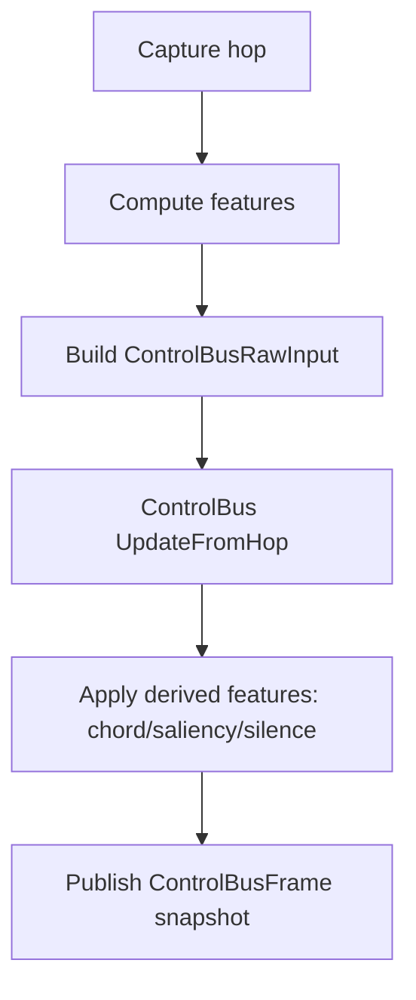
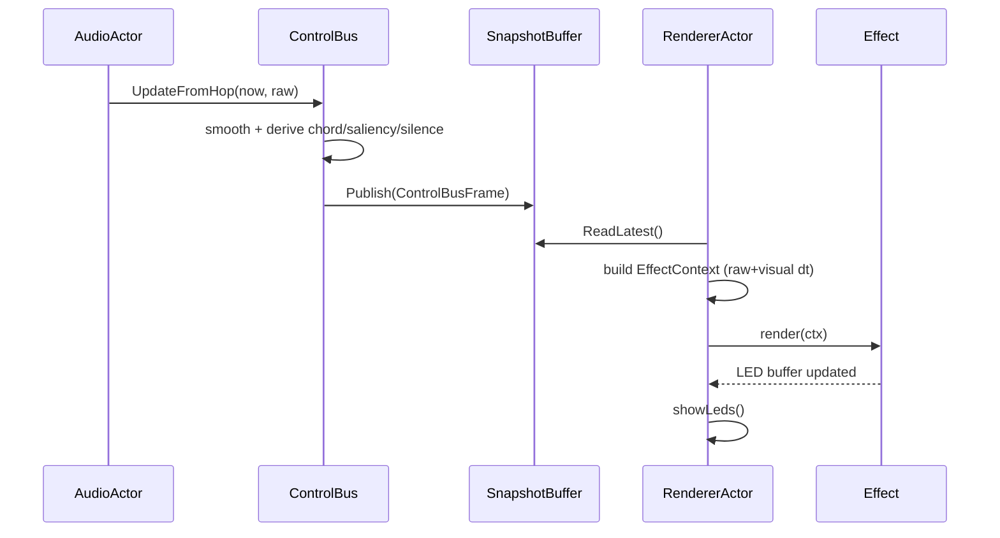
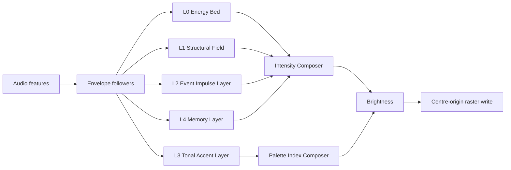
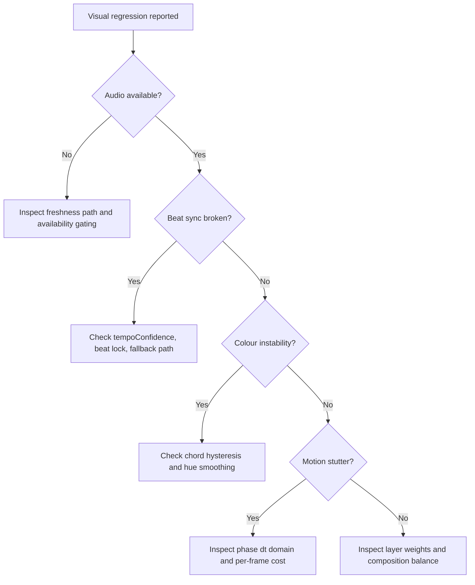
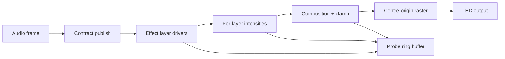

# Audio-Reactive Effects Pack 152-161

## Foundational Decomposition and Deconstruction Guide

## 0. Purpose and Reading Path
This document is a complete engineering reference for the ten audio-reactive effects in `LGPExperimentalAudioPack` (effect IDs `0x1A00` to `0x1A09`).

It is written so a technical reader can:
- understand the algorithmic domain,
- trace every data contract from audio capture to LED output,
- reason about maths, complexity, and edge behaviour,
- implement and maintain effects without external clarification.

Suggested reading order:
1. Sections 1-4: domain, prerequisites, formal model, architecture.
2. Section 5: shared render pattern used by all ten effects.
3. Section 6: per-effect deconstruction.
4. Sections 7-10: complexity, edge cases, implementation examples, tests.
5. Section 11: maintenance playbook.

---

## 1. Algorithmic Design Domain Context

### 1.1 Problem Domain
The firmware drives a dual-strip light-guide system (320 WS2812 LEDs total) with centre-origin visual semantics.

The target behaviour is not a generic LED strip animation. It is a real-time audio-reactive renderer with:
- musically coherent colour and motion,
- stable behaviour under noisy/quiet input,
- low-latency response without flicker,
- deterministic execution suitable for ~120 FPS render cadence.

### 1.2 System Objectives
At runtime, each effect must transform an audio feature stream into LED colour and motion using a strict contract.

Primary objectives:
- translate audio features (`RMS`, `flux`, `bands`, `chroma`, `beat`, `saliency`) into visual state,
- preserve centre-origin geometry,
- avoid transient artefacts (flicker, gating chatter, hue jitter),
- maintain hot-path efficiency.

### 1.3 Non-Negotiable Constraints
These constraints directly shape algorithm choices:
- Centre origin only: rendering expands/contracts from LEDs 79/80 on each strip.
- No hue-wheel rainbow sweeps: colour is palette driven with musically anchored indexing.
- No heap allocation in `render()`: all per-frame logic uses stack/static/local primitives only.
- 120 FPS target: per-effect render complexity must remain bounded and predictable.

Related implementation points:
- registrations: `firmware-v3/src/effects/CoreEffects.cpp:1107-1143`
- metadata/classification: `firmware-v3/src/effects/PatternRegistry.cpp:233-242`, `:489-498`

### 1.4 Effects in Scope
This guide covers:
1. `LGP Flux Rift`
2. `LGP Beat Prism`
3. `LGP Harmonic Tide`
4. `LGP Bass Quake`
5. `LGP Treble Net`
6. `LGP Rhythmic Gate`
7. `LGP Spectral Knot`
8. `LGP Saliency Bloom`
9. `LGP Transient Lattice`
10. `LGP Wavelet Mirror`

---

## 2. Prerequisite Concepts (with examples)

## 2.1 Audio Feature Vocabulary
The effect contract exposes these high-value signals (see Section 3.2 for exact structures):
- `rms`: loudness proxy in `[0,1]`.
- `flux` / `fastFlux`: short-term novelty/transient proxy.
- `bands[8]`: coarse spectral energy from bass to treble.
- `chroma[12]`: pitch-class energy (C..B, octave folded).
- `waveform[128]`: time-domain signed samples.
- `isOnBeat`, `beatStrength`, `tempoConfidence`: beat/tempo confidence channels.
- `harmonicSaliency`, `rhythmicSaliency`, `timbralSaliency`, `overallSaliency`: novelty dimensions.

Example:
- If `bands[0..1]` rises quickly, bass-focused effects should increase outward pressure/shock terms.
- If `chordConfidence` is high, tonal hue should prefer chord root over instantaneous chroma centroid.

## 2.2 Exponential Smoothing (EMA)
Many state variables use EMA-style updates:
\[
\text{state}_{t+1} = \text{state}_t + (\text{target}_t - \text{state}_t)\,\alpha
\]

Where \(\alpha = 1 - e^{-\Delta t/\tau}\).

Interpretation:
- low \(\tau\): fast reaction,
- high \(\tau\): smoother, slower evolution.

Example:
- `m_fluxEnv` in Flux Rift uses `tau=0.10s` to smooth `fastFlux` + `overallSaliency`.

## 2.3 Attack/Release Follower
The control bus uses asymmetric smoothing:
- rising signal uses `attack` alpha,
- falling signal uses `release` alpha.

This preserves transients while avoiding harsh decay flicker.

## 2.4 Schmitt Trigger (Hysteresis)
Two thresholds are used to prevent rapid toggling:
- open/enter threshold > close/exit threshold.

Example in tonal gating:
- open chord gate at `confidence >= 0.40`,
- close only when `confidence <= 0.25`.

This avoids hue flapping near marginal confidence.

## 2.5 Timing Domains
This pack intentionally separates timing domains:
- **Signal time** (raw/unscaled): audio envelopes and beat logic.
- **Visual time** (speed-scaled): phase motion and purely visual drift.

Policy source:
- `firmware-v3/src/effects/ieffect/AudioReactivePolicy.h:19-39`

## 2.6 Palette-Based Colour Mapping
Effects do not hardcode RGB gradients. They produce:
- `paletteIndex` (hue-like path),
- `brightness`.

Final colour is `ctx.palette.getColor(index, brightness)`.

This gives style consistency across palettes while keeping musically coherent hue anchoring.

---

## 3. Mathematical Structures and Formal Definitions

## 3.1 Symbols Used in This Document
- \(N\): radial samples per strip half (`HALF_LENGTH`, typically 80).
- \(d\): normalised radial distance in `[0,1]`.
- \(\Delta t_s\): raw signal delta seconds (`signalDt`).
- \(\Delta t_v\): visual delta seconds (`visualDt`).
- \(B\): master brightness scalar in `[0,1]`.
- \(H\): palette index/hue anchor in `[0,255]`.

## 3.2 Contract Data Structures

### 3.2.1 Raw producer contract: `ControlBusRawInput`
Defined at `firmware-v3/src/audio/contracts/ControlBus.h:51-82`.

Contains unsmoothed or lightly prepared hop-level signals:
- `rms`, `rmsUngated`, `flux`,
- `bands[8]`, `chroma[12]`, `waveform[128]`,
- percussion energies/triggers,
- tempo lock/confidence/tick/BPM fields,
- optional spectrum representations (`bins64`, `bins256`).

### 3.2.2 Published consumer contract: `ControlBusFrame`
Defined at `firmware-v3/src/audio/contracts/ControlBus.h:87-178`.

Contains smoothed + derived fields:
- smoothed bands/chroma (`bands`, `heavy_bands`, `chroma`, `heavy_chroma`),
- chord state,
- musical saliency frame,
- silence state (`silentScale`, `isSilent`),
- tempo and waveform channels.

### 3.2.3 Effect-side context: `EffectContext::AudioContext`
Defined at `firmware-v3/src/plugins/api/EffectContext.h:68-447`.

This is the only audio surface effects should read.

## 3.3 Core Equations

### 3.3.1 Clamp
\[
\operatorname{clamp01}(x)=\min(1,\max(0,x))
\]

### 3.3.2 EMA alpha from time constant
\[
\alpha(\Delta t,\tau)=1-e^{-\Delta t/\tau}
\]

### 3.3.3 Beat tick policy
From `BeatPulseTiming::computeBeatTick` (`BeatPulseRenderUtils.h:355-376`):

\[
\text{tick} =
\begin{cases}
\text{ctx.audio.isOnBeat()} & \text{if } \text{audioAvailable}\land \text{tempoConfidence}\ge 0.25 \\
\text{fallbackMetronome}(t_{raw},\text{fallbackBpm}) & \text{otherwise}
\end{cases}
\]

### 3.3.4 Circular hue smoothing
Hue is smoothed on a circular domain (mod 256) by shortest arc.

### 3.3.5 Saliency composition
`ControlBus::computeSaliency()` combines smoothed harmonic/rhythmic/timbral/dynamic novelty into `overallSaliency` by weighted sum, then clamps to `[0,1]`.

See `firmware-v3/src/audio/contracts/ControlBus.cpp:765-770`.

### 3.3.6 Silence detection
`silentScale` and `isSilent` are computed with threshold + hysteresis timing in `ControlBus::applyDerivedFeatures()` (`:554-587`).

## 3.4 Invariants
- Contract ranges are expected in `[0,1]` for most scalar channels.
- Effects treat `ctx.audio.available == false` as a first-class state (fade/fallback paths).
- Render output must remain centre-origin and palette-driven.

---

## 4. Architecture and Data Flow

## 4.1 High-Level Architecture Diagram

```mermaid
flowchart LR
    I2S[I2S Capture] --> AA[AudioActor]
    AA -->|Feature extraction| PA[PipelineAdapter or ESV11 path]
    PA --> RAW[ControlBusRawInput]
    RAW --> CB[ControlBus UpdateFromHop]
    CB --> FRAME[ControlBusFrame]
    FRAME --> SNAP[SnapshotBuffer Publish]
    SNAP --> RA[RendererActor]
    RA --> EC[EffectContext::audio]
    EC --> FX[LGPExperimentalAudioPack render()]
    FX --> LED[Dual-strip LED buffer]
    LED --> RMT[FastLED/RMT output]
```

## 4.2 Producer-Side Logic Flow



Key source references:
- PipelineCore path: `firmware-v3/src/audio/AudioActor.cpp:925-1113`
- ESV11 path: `firmware-v3/src/audio/AudioActor.cpp:1995-2707`
- Adapter mapping: `firmware-v3/src/audio/pipeline/PipelineAdapter.cpp:45-194`

## 4.3 Consumer-Side Logic Flow

```mermaid
flowchart TD
    A[Renderer frame tick] --> B[Read latest audio snapshot]
    B --> C[Populate EffectContext]
    C --> D[Attach behaviour context]
    D --> E[Apply optional audio->visual parameter mappings]
    E --> F[Compute raw/scaled timing]
    F --> G[effect->render(ctx)]
    G --> H[Show LEDs]
```

Reference:
- `firmware-v3/src/core/actors/RendererActor.cpp:1510-1622`

## 4.4 Sequence Diagram (one render frame)



## 4.5 Algorithmic Pattern Used by All Ten Effects
Each effect follows this sequence:
1. Read `signalDt` and `visualDt`.
2. Update audio presence follower and early-fade if absent.
3. Compute one or more target envelopes from contract inputs.
4. Smooth envelopes using EMA/decay.
5. Update phase/motion state with `visualDt`.
6. Compute tonal base hue from `selectMusicalHue` and smooth circularly.
7. Clear/fade current frame (`fadeToBlackBy`).
8. Loop radial distance `dist = 0..N-1`, compute intensity field.
9. Convert intensity to brightness and palette index.
10. Write centre-symmetric LED pairs on both strips.

See Section 5 for the shared utility layer.

---

## 5. Shared Pack Foundations (Pack 152-161)

## 5.1 Shared Utility Layer
Source: `firmware-v3/src/effects/ieffect/LGPExperimentalAudioPack.cpp:24-157`.

Important shared functions:
- `clamp01f`, `smoothstep01`, `expAlpha`, `smoothTo`, `decay`
- tonal helpers: `dominantNoteFromChroma`, `selectMusicalHue`, `smoothHue`, `smoothNoteCircular`
- geometry: `setCentrePairMono`, `setCentrePairDual`
- availability: `trackAudioPresence`

## 5.2 Shared State Pattern
Every effect class keeps:
- phase accumulator,
- one or more audio envelopes,
- optional beat/event envelope,
- smoothed hue,
- audio presence follower,
- chord-gate hysteresis state.

Class declarations:
- `firmware-v3/src/effects/ieffect/LGPExperimentalAudioPack.h:24-199`

## 5.3 Shared Colour Logic
Colour derivation is a two-stage process:
1. **Musical anchor** from chord/root/chroma (`selectMusicalHue`).
2. **Effect-local offsets/modulators** to produce palette index texture.

This separates harmonic semantics (stable) from local texture dynamics (animated).

## 5.4 Shared Motion Logic
Motion terms usually combine:
- a phase-advanced carrier field,
- an envelope-driven spatial locus (front/ring/seam),
- optional event reinforcement (beat/snare/hihat).

## 5.5 Shared Practical Example
Minimal pattern used by all ten effects:

```cpp
// 1) Timing split
const float dtSignal = AudioReactivePolicy::signalDt(ctx);
const float dtVisual = AudioReactivePolicy::visualDt(ctx);

// 2) Audio presence and master scale
m_audioPresence = trackAudioPresence(m_audioPresence, ctx.audio.available, dtSignal);
if (m_audioPresence <= 0.001f) {
    fadeToBlackBy(ctx.leds, ctx.ledCount, 30);
    return;
}
const float master = (ctx.brightness / 255.0f) * m_audioPresence;

// 3) Envelope + beat gate
m_env = smoothTo(m_env, target, dtSignal, tauEnv);
const bool beatTick = AudioReactivePolicy::audioBeatTick(ctx, 128.0f, m_lastBeatMs);
m_pulse = beatTick ? 1.0f : decay(m_pulse, dtSignal, tauPulse);

// 4) Visual phase and tonal anchor
m_phase += speedScale * dtVisual;
m_hue = smoothHue(m_hue, selectMusicalHue(ctx, m_chordGateOpen), dtSignal, 0.45f);
```

---

## 6. Per-Effect Deconstruction (Algorithm + Maths + Engineering Notes)

All effects in this section are implemented in:
- `firmware-v3/src/effects/ieffect/LGPExperimentalAudioPack.cpp`

For complexity terms below, let \(N = \text{HALF_LENGTH}\).

## 6.1 LGP Flux Rift (`EID_LGP_FLUX_RIFT`)
Source: `:178-222`

### Inputs
- `fastFlux`, `overallSaliency`, beat tick, musical hue anchor.

### Core equations
\[
\text{fluxTarget}=0.70\cdot \text{fastFlux}+0.30\cdot \text{overallSaliency}
\]
\[
\text{seamPos}=1-\text{beatPulse}
\]
\[
\text{phase}_{t+1}=\text{phase}_t + 0.85(0.55+1.20\,\text{fluxEnv})\Delta t_v
\]

### Visual translation
- Dislocation seam field (tanh-compressed) gives rift-like split.
- Beat creates a transient shock term near seam position.

### Colour translation
- Musical base hue is smoothed, then radially and envelope offset:
  - `idxA = baseHue + d*48 + fluxEnv*22`

### Complexity
- Time: `O(N)` per frame.
- Space: `O(1)` per effect instance.

### Boundary handling
- Audio unavailable: decays to black via `m_audioPresence`.
- Phase overflow: wrapped using `fmodf` guard.

## 6.2 LGP Beat Prism (`EID_LGP_BEAT_PRISM`)
Source: `:255-304`

### Inputs
- `beatStrength`, `bands[5..7]`, beat tick, musical hue anchor.

### Core equations
\[
\text{treble}=\frac{b_5+b_6+b_7}{3}
\]
\[
\text{prismTarget}=0.55\cdot \text{beatStrength}+0.45\cdot \text{treble}
\]
\[
\text{frontPos}=1-\text{beatPulse}
\]

### Visual translation
- Spoke/facet/refract carriers form prism texture.
- Beat-front term reinforces travelling pressure front.

### Colour translation
- Base musical hue + prism offset (`+8`), then spoke/radial offsets.

### Complexity
- Time: `O(N)`.
- Space: `O(1)`.

### Boundary handling
- Treble absent and beat low: prism envelope smoothly decays, preventing hard flicker.

## 6.3 LGP Harmonic Tide (`EID_LGP_HARMONIC_TIDE`)
Source: `:336-418`

### Inputs
- `harmonicSaliency`, `chordConfidence`, `rootNote`, `chroma`, `heavyMid`, `isMinor`.

### Core equations
\[
\text{harmonicTarget}=\max(\text{harmonicSaliency},\text{chordConfidence})
\]
\[
\text{rootTarget}=
\begin{cases}
\text{rootNote mod 12} & \text{if chord gate open} \\
\text{dominantChromaNote} & \text{otherwise}
\end{cases}
\]

Triad bins:
- root = \(r\)
- third = \(r+3\) (minor) or \(r+4\) (major)
- fifth = \(r+7\)

### Visual translation
- Outward/inward/standing wave superposition creates tidal field.
- Speed modulated by `heavyMid` (stable mid-band envelope).

### Colour translation
- Explicit triadic weighted blend (`root/third/fifth`) per radial position.

### Complexity
- Time: `O(N)`.
- Space: `O(1)`.

### Boundary handling
- Low chord confidence: falls back to chroma-derived root and retains hue continuity through circular smoothing.

## 6.4 LGP Bass Quake (`EID_LGP_BASS_QUAKE`)
Source: `:451-495`

### Inputs
- `heavyBass`, beat tick, musical hue anchor.

### Core equations
\[
\text{seed}=0.80\cdot \text{bassEnv} + 0.45\cdot \mathbb{1}_{\text{beatTick}}
\]
\[
\text{impact}_{t+1}=\max(\text{seed},\text{decay}(\text{impact}_t))
\]
\[
\text{shockPos}=1-\text{impact}
\]

### Visual translation
- Compression profile and harmonic carriers create quake texture.
- Beat/bass drives outward shock ring density and speed.

### Colour translation
- Musical hue with bass-biased offset (`+10`), shock-enhanced palette indexing.

### Complexity
- Time: `O(N)`.
- Space: `O(1)`.

### Boundary handling
- Sparse beats: heavy-bass envelope still provides motion continuity.

## 6.5 LGP Treble Net (`EID_LGP_TREBLE_NET`)
Source: `:527-573`

### Inputs
- `heavyTreble`, `timbralSaliency`, `isHihatHit`, musical hue anchor.

### Core equations
\[
\text{trebleTarget}=0.65\cdot \text{heavyTreble}+0.35\cdot \text{timbralSaliency}
\]
\[
\text{shimmer}=
\begin{cases}
1 & \text{if hihatHit or timbralSaliency}>0.55 \\
\text{decay} & \text{otherwise}
\end{cases}
\]

### Visual translation
- Two high-frequency sinusoid nets produce moire interference.
- Edge weighting creates filament emphasis near boundaries.

### Colour translation
- High-frequency palette region via large hue offset (`+116`) from musical anchor.

### Complexity
- Time: `O(N)`.
- Space: `O(1)`.

### Boundary handling
- If treble energy drops suddenly, shimmer decays smoothly rather than step-off.

## 6.6 LGP Rhythmic Gate (`EID_LGP_RHYTHMIC_GATE`)
Source: `:606-657`

### Inputs
- `rhythmicSaliency`, beat tick, `rawTotalTimeMs`, musical hue anchor.

### Core equations
\[
\text{gateRate}=0.0013 + 0.0034(0.25+0.75\,\text{gate})
\]
\[
\text{gateClock}=\operatorname{frac}(t_{raw}\cdot \text{gateRate})
\]
\[
\text{duty}=0.24 + 0.48\,\text{gate}
\]

### Visual translation
- Temporal shutter mask (`gateMask`) modulates radial bars.
- Beat pulse drives travelling seam term.

### Colour translation
- Musical hue + moderate warm offset (`+30`).

### Complexity
- Time: `O(N)`.
- Space: `O(1)`.

### Boundary handling
- Raw-time clock ensures gate cadence is not distorted by SPEED scaling.

## 6.7 LGP Spectral Knot (`EID_LGP_SPECTRAL_KNOT`)
Source: `:689-741`

### Inputs
- grouped bands (`low`, `mid`, `high`), musical hue anchor.

### Core equations
\[
\text{knotTarget}=|\text{low}-\text{high}| + 0.45\cdot \text{mid}
\]
\[
\text{knotPos}=0.5+0.28\sin(\text{rotation})
\]
\[
\text{antiPos}=1-\text{knotPos}
\]

### Visual translation
- Two counter-locus ring envelopes plus braid carriers create crossing-knot topology.

### Colour translation
- Musical hue + knot offset (`+44`), modulated by weave intensity.

### Complexity
- Time: `O(N)`.
- Space: `O(1)`.

### Boundary handling
- Balanced low/high content collapses knot contrast gracefully (envelope smoothing avoids abrupt collapse).

## 6.8 LGP Saliency Bloom (`EID_LGP_SALIENCY_BLOOM`)
Source: `:774-818`

### Inputs
- `overallSaliency`, beat tick, musical hue anchor.

### Core equations
\[
\text{bloom}=
\begin{cases}
1 & \text{on beat} \\
\max(\text{decay}(), 0.25\cdot\text{saliency}) & \text{otherwise}
\end{cases}
\]
\[
\text{ringPos}=1-\text{bloom}
\]

### Visual translation
- Diffusion bed + activator shell - inhibitor shell creates bloom morphology.

### Colour translation
- Musical hue + bloom offset (`+14`), activator-weighted palette index.

### Complexity
- Time: `O(N)`.
- Space: `O(1)`.

### Boundary handling
- Floor term `0.25*saliency` prevents total collapse during moderate novelty.

## 6.9 LGP Transient Lattice (`EID_LGP_TRANSIENT_LATTICE`)
Source: `:851-897`

### Inputs
- `fastFlux`, `isSnareHit`, `isHihatHit`, beat tick, musical hue anchor.

### Core equations
Seed with event overrides:
\[
\text{seed}=\max(\text{fastFlux},
0.95\cdot\mathbb{1}_{\text{snare}},
0.70\cdot\mathbb{1}_{\text{hihat}},
0.82\cdot\mathbb{1}_{\text{beat}})
\]
Memory term:
\[
\text{memory}_{t+1}=\operatorname{clamp01}\left(\text{memory}_t e^{-\Delta t_s/0.68}+0.20\cdot\text{transient}\right)
\]

### Visual translation
- Dual sinusoidal scaffold (`l1*l2`) with impact ring and afterglow memory.

### Colour translation
- Musical hue + large lattice offset (`+62`) with scaffold/memory modulation.

### Complexity
- Time: `O(N)`.
- Space: `O(1)`.

### Boundary handling
- Event sparsity still leaves memory-driven continuity.

## 6.10 LGP Wavelet Mirror (`EID_LGP_WAVELET_MIRROR`)
Source: `:930-997`

### Inputs
- `getWaveformNormalized(i)`, `rms`, beat tick, musical hue anchor.

### Core equations
Wave target:
\[
\text{waveTarget}=\max(\text{rms}, \text{waveAvg})
\]
where `waveAvg` is mean absolute amplitude sampled at 8 moving indices.

Beat ridge:
\[
\text{ridgePos}=1-\text{beatTrail}
\]

### Visual translation
- Mirror pair samples (`idx`, `127-idx`) generate symmetric crest energies.
- Beat ridge overlays travelling reinforcement.

### Colour translation
- Musical hue + wave offset (`+30`) with crest-strength modulation.

### Complexity
- Time: `O(N)` (plus constant-time 8-sample pre-pass).
- Space: `O(1)`.

### Boundary handling
- If waveform unavailable, fallback sinusoid path preserves deterministic motion.

---

## 7. Complexity Analysis

## 7.1 Producer Path Complexity

### 7.1.1 PipelineAdapter (`adapt`)
From `PipelineAdapter.cpp:45-194`:
- waveform subsample: `O(128)`
- bins256 normalise/copy: `O(256)`
- bins64 shim: `O(64)`
- band/chroma copies: `O(8+12)`
- percussion derivation: bounded by named band ranges (effectively constant per hop)

Overall adapter cost:
\[
T_{adapter}=O(256 + 128 + 64 + 8 + 12)=O(1) \text{ (fixed bounds)}
\]

### 7.1.2 ControlBus update
From `ControlBus.cpp`:
- despike + smooth + AGC loops over 8 and 12 bins,
- waveform copy 128,
- spectrum copies 64 and 256,
- chord detection 12,
- saliency and silence computations constant-time.

Bounded complexity per hop:
\[
T_{controlbus}=O(256+128+64+12+8)=O(1)
\]

### 7.1.3 Memory footprint
All arrays are fixed-size stack/class buffers. No dynamic allocation in hot hop loops.

## 7.2 Consumer Path Complexity (per frame)
Renderer operations before effect render are fixed-time plus context copying.

Then each effect executes one radial loop:
\[
T_{effect}=O(N),\quad N=\text{HALF_LENGTH}\;(\text{typically }80)
\]

## 7.3 Per-Effect Relative Cost Notes
All ten effects are `O(N)`, but constant factors differ:
- Lower constant: Harmonic Tide, Rhythmic Gate.
- Higher constant: Spectral Knot, Wavelet Mirror, Flux Rift (multiple transcendental ops per pixel).

Practical implication:
- keeping `N` fixed and constants bounded preserves frame-time predictability.

---

## 8. Edge Cases and Boundary Conditions

## 8.1 Runtime Edge Case Matrix

| Case | Risk | Current handling | Engineering recommendation |
|---|---|---|---|
| `ctx.audio.available == false` | abrupt blackout/freeze | `trackAudioPresence` + fade path in each effect | keep this pattern mandatory for new effects |
| low tempo confidence | beat jitter or missed pulses | confidence gate + fallback metronome (`kTempoConfMin=0.25`) | tune threshold with regression clips |
| chord confidence near threshold | hue flapping | Schmitt gate (0.40 open, 0.25 close) | do not replace with single threshold |
| low-level noise floor | false activity / shimmer chatter | control bus silence detection and smoothing | verify `silentScale` and adapter thresholds together |
| phase growth over long runtimes | floating-point drift | periodic `fmodf` wrap guards | preserve wrap guards in all phase accumulators |
| brightness=0 | divide/scale anomalies | `master` drives output to zero | include explicit early return only if profiling requires |
| waveform index bounds | OOB access | accessor clamps index in `EffectContext` | keep all direct accesses via accessors |
| palette mismatch | colour discontinuity | palette API always queried by index/brightness | maintain palette-driven logic; avoid raw RGB ramps |
| stale audio snapshot | delayed response | `audio.available` set from freshness policy in renderer | monitor with diagnostics and stale-age logs |

## 8.2 Numerical Boundary Guidelines
- Always clamp envelope targets to `[0,1]` before smoothing.
- Use circular smoothing for periodic domains (`hue`, note index).
- Use raw-time (`rawTotalTimeMs`) for beat/gate clocks that must ignore SPEED scaling.

## 8.3 Failure Modes to Watch in Field Reports
- "Effect goes dark too quickly": inspect `silentScale`, `isSilent`, adapter gate thresholds.
- "Hue flickers between notes": inspect chord confidence hysteresis state.
- "Beat-driven fronts drift": verify raw vs visual dt usage.

---

## 9. Implementation Examples (annotated)

## 9.1 Example A: Minimal reactive envelope + centre rendering

```cpp
void ExampleEffect::render(plugins::EffectContext& ctx) {
    const float dtSignal = AudioReactivePolicy::signalDt(ctx); // raw, beat-coupled
    const float dtVisual = AudioReactivePolicy::visualDt(ctx); // speed-scaled

    m_audioPresence = trackAudioPresence(m_audioPresence, ctx.audio.available, dtSignal);
    if (m_audioPresence <= 0.001f) {
        fadeToBlackBy(ctx.leds, ctx.ledCount, 30);
        return;
    }

    const float target = ctx.audio.available ? clamp01f(ctx.audio.fastFlux()) : 0.0f;
    m_env = smoothTo(m_env, target, dtSignal, 0.10f); // envelope uses signal time

    m_phase += (0.6f + m_env) * dtVisual; // motion uses visual time

    const float hueTarget = static_cast<float>(selectMusicalHue(ctx, m_chordGateOpen));
    m_hue = smoothHue(m_hue, hueTarget, dtSignal, 0.45f);

    fadeToBlackBy(ctx.leds, ctx.ledCount, 30);
    const float master = (ctx.brightness / 255.0f) * m_audioPresence;
    for (uint16_t dist = 0; dist < HALF_LENGTH; ++dist) {
        const float d = static_cast<float>(dist) / static_cast<float>(HALF_LENGTH);
        const float intensity = clamp01f((1.0f - d) * m_env);
        const uint8_t br = static_cast<uint8_t>(255.0f * intensity * master);
        const uint8_t idx = static_cast<uint8_t>(m_hue + d * 32.0f);
        setCentrePairMono(ctx, dist, ctx.palette.getColor(idx, br));
    }
}
```

## 9.2 Example B: Safe beat trigger with fallback

```cpp
// Works even if tempo lock drops; keeps visual rhythm deterministic.
const bool beatTick = AudioReactivePolicy::audioBeatTick(ctx, 128.0f, m_lastBeatMs);
if (beatTick) {
    m_pulse = 1.0f;
} else {
    m_pulse = decay(m_pulse, dtSignal, 0.20f);
}
```

## 9.3 Example C: Chord-aware hue with hysteresis

```cpp
// Inside selectMusicalHue():
// open when confidence is strong, close only after confidence falls lower.
if (conf >= 0.40f) chordGateOpen = true;
else if (conf <= 0.25f) chordGateOpen = false;

const uint8_t note = chordGateOpen
    ? static_cast<uint8_t>(ctx.audio.rootNote() % 12)
    : dominantNoteFromChroma(ctx);
```

## 9.4 Example D: Raw-time gate clock (speed-independent)

```cpp
const float gateRate = 0.0013f + 0.0034f * (0.25f + 0.75f * m_gate);
const float gateClock = fmodf(static_cast<float>(ctx.rawTotalTimeMs) * gateRate, 1.0f);
```

This pattern is essential if the gate cadence must remain tied to real beat time, not to user SPEED.

---

## 10. Testing Scenarios for Correctness and Maintenance

## 10.1 Test Pyramid for This Pack

1. Unit tests (math helpers and policy functions).
2. Contract tests (AudioActor -> ControlBus -> EffectContext field validity).
3. Deterministic render tests (effect state evolution under synthetic inputs).
4. Integration tests on device (timing, visual quality, no regressions).

## 10.2 Unit Tests

### 10.2.1 Timing policy
- Input: `tempoConfidence` below/above threshold.
- Assert: `computeBeatTick` uses fallback vs audio beat as specified.

### 10.2.2 Circular smoothing
- Input: hue transitions crossing wrap boundary (e.g. 250 -> 5).
- Assert: shortest-path transition, no long-way wrap.

### 10.2.3 Hysteresis
- Input sequence: `0.39, 0.41, 0.30, 0.26, 0.24`.
- Assert: gate opens at 0.41 and closes only at 0.24.

## 10.3 Contract Validation Tests

- Verify `ctx.audio.available` propagation under stale/fresh snapshots.
- Verify ranges (`[0,1]`) for key fields per frame:
  - `rms`, `flux`, `beatStrength`, saliency channels.
- Verify waveform length and index safety.

## 10.4 Effect-Level Deterministic Tests
For each of the ten effects:
- Silence path test:
  - set `audio.available=false` for 3 seconds of frames.
  - assert monotonic fade-to-black (no spikes).
- Beat impulse test:
  - inject deterministic beat ticks at 120 BPM.
  - assert ring/front/seam position monotonic travel from centre to edge.
- Tonal stability test:
  - hold root note, vary confidence around hysteresis thresholds.
  - assert hue stability when confidence oscillates in deadband.

## 10.5 Performance and Real-Time Tests

### 10.5.1 Frame-time profiling
- Measure average and p99 render time per effect.
- Acceptance target: keep per-frame effect compute comfortably below 2 ms budget target.

### 10.5.2 Hot-path allocation check
- Static scan for heap operations inside `render()` (`new`, `malloc`, `String`).
- Must remain zero.

### 10.5.3 Soak tests
- Multi-minute cycling across all 10 effects with AP + WS load.
- Assert:
  - no panics,
  - no stack canary trips,
  - no render starvation.

## 10.6 Suggested Scenario Table

| Scenario | Input profile | Expected behaviour |
|---|---|---|
| silence to music attack | 2 s silence then kick onset | smooth re-entry, no flash artifact |
| low-confidence tempo | tempo lock unstable | fallback metronome continuity |
| high treble percussion | dense hihat patterns | Treble Net shimmer triggers but no flicker storm |
| heavy bass sustained | sub-heavy loop | Bass Quake maintains compression body with beat shocks |
| harmonic progression | major->minor chord changes | Harmonic Tide re-voices third interval correctly |
| snare transients | intermittent snare bursts | Transient Lattice seeds high-impact rings + memory tails |

---

## 11. Maintenance Playbook

## 11.1 When Adding or Refactoring an Effect
Use this checklist:
1. Keep centre-origin geometry helpers (`setCentrePairMono/Dual`).
2. Use `AudioReactivePolicy` timing split.
3. Use availability smoothing (`trackAudioPresence`).
4. Use palette indexing (no direct hue-wheel sweep).
5. Avoid heap allocation in `render()`.
6. Add wrap guards for long-running phase accumulators.
7. Add/extend deterministic tests from Section 10.

## 11.2 Contract Change Impact Map
If these layers change, revisit this pack:
- `ControlBusRawInput` fields or normalisation.
- saliency computation weights/thresholds.
- tempo confidence gate semantics.
- silence gate thresholds/hysteresis.
- renderer timing semantics (`rawDelta` vs `delta`).

## 11.3 Debug-First Triage Order
When visual behaviour regresses, inspect in this order:
1. `audio.available` freshness and stale logic.
2. `silentScale` / `isSilent` and adapter gate thresholds.
3. beat lock and `tempoConfidence` transitions.
4. effect-local envelope values and phase rate.
5. palette index ranges and brightness scaling.

---

## 12. Quick Reference Tables

## 12.1 Primary Driver Matrix

| Effect | Main energy driver | Event driver | Tonal anchor |
|---|---|---|---|
| Flux Rift | `fastFlux`, `overallSaliency` | beat | chord/root/chroma |
| Beat Prism | `beatStrength`, `treble bands` | beat | chord/root/chroma |
| Harmonic Tide | `harmonicSaliency`, `heavyMid` | none | root + major/minor triad |
| Bass Quake | `heavyBass` | beat | chord/root/chroma |
| Treble Net | `heavyTreble`, `timbralSaliency` | hihat | chord/root/chroma |
| Rhythmic Gate | `rhythmicSaliency` | beat | chord/root/chroma |
| Spectral Knot | low-mid-high imbalance | none | chord/root/chroma |
| Saliency Bloom | `overallSaliency` | beat | chord/root/chroma |
| Transient Lattice | `fastFlux` | snare/hihat/beat | chord/root/chroma |
| Wavelet Mirror | waveform + `rms` | beat | chord/root/chroma |

## 12.2 Cross-Reference Index

- Data contracts: Section 3.2
- Timing policy: Section 2.5 and 3.3.3
- Producer flow: Section 4.2
- Consumer flow: Section 4.3
- Shared render scaffold: Section 5
- Per-effect details: Section 6
- Complexity: Section 7
- Edge handling: Section 8
- Tests: Section 10
- Real-world deployment examples: Section 13
- Source map: Section 14
- Multilayer architecture method: Section 15
- Full implementation workflow: Section 16
- Visual impact design heuristics: Section 17
- Long-term maintainability gates: Section 18
- Audio feature data dictionary: Section 19
- Parameter tuning cookbook: Section 20
- Failure-signature debug playbook: Section 21
- Effect architecture blueprints: Section 22
- End-to-end validation workflow: Section 23

---

## 13. Practical Real-World Application Examples

## 13.1 Small Venue Reactive Wall (club or live set)

Goal:
- maximise perceived synchrony between kick/snare events and visible motion fronts.

Suggested effect family usage:
- `LGP Bass Quake` and `LGP Transient Lattice` for punch and transient articulation.

Practical tuning emphasis:
- preserve beat fallback behaviour (Section 3.3.3) so visual tempo does not collapse when confidence dips,
- keep bass envelope attack fast (Section 2.3) and release moderate to avoid static overhang.

Observable success criteria:
- kick events produce clear outward front motion within 1-2 frames,
- snare/hihat events generate distinct secondary accents, not continuous noise.

## 13.2 Ambient Installation (lounge or gallery)

Goal:
- smooth, persistent motion that responds to music without aggressive strobing.

Suggested effect family usage:
- `LGP Harmonic Tide`, `LGP Saliency Bloom`, `LGP Wavelet Mirror`.

Practical tuning emphasis:
- rely on heavy-smoothed bands/chroma (`heavy_bands`, `heavy_chroma`) from ControlBus (Section 3.2.2),
- preserve chord hysteresis and circular hue smoothing (Sections 2.4 and 3.3.4) to avoid tonal jitter.

Observable success criteria:
- colour changes track harmonic progression rather than percussive spikes,
- centre-origin flow remains calm during low-energy passages.

## 13.3 Interactive Demo Mode (public-facing kiosk)

Goal:
- robust behaviour under unknown and inconsistent source material.

Suggested effect family usage:
- rotate across all ten effects with fallback-safe timing and explicit silence handling.

Practical tuning emphasis:
- verify `ctx.audio.available` and silence handling paths (Section 8.1),
- maintain palette-driven colour path to avoid hardcoded hue assumptions across content types.

Observable success criteria:
- no hard blackouts during quiet speech/music transitions,
- no tempo desynchronisation during lock/unlock transitions.

---

## 14. Source Reference Map

Core implementation files used in this guide:
- `firmware-v3/src/effects/ieffect/LGPExperimentalAudioPack.h`
- `firmware-v3/src/effects/ieffect/LGPExperimentalAudioPack.cpp`
- `firmware-v3/src/effects/ieffect/AudioReactivePolicy.h`
- `firmware-v3/src/effects/ieffect/BeatPulseRenderUtils.h`
- `firmware-v3/src/plugins/api/EffectContext.h`
- `firmware-v3/src/audio/contracts/ControlBus.h`
- `firmware-v3/src/audio/contracts/ControlBus.cpp`
- `firmware-v3/src/audio/pipeline/PipelineAdapter.h`
- `firmware-v3/src/audio/pipeline/PipelineAdapter.cpp`
- `firmware-v3/src/audio/AudioActor.cpp`
- `firmware-v3/src/core/actors/RendererActor.cpp`
- `firmware-v3/src/effects/CoreEffects.cpp`
- `firmware-v3/src/effects/PatternRegistry.cpp`

---

## 15. Multilayer Visual Architecture Framework

This section defines a reusable architecture for building "multi layer, visually expressive and impactful" effects that remain maintainable under firmware constraints.

## 15.1 Why a multilayer model is necessary
Single-field effects are easy to write but usually fail one or more production goals:
- weak emotional contrast,
- poor readability in noisy music,
- insufficient motion hierarchy,
- limited extensibility.

A multilayer effect solves this by separating responsibilities into independently tunable fields.

## 15.2 Canonical five-layer stack

Use the following stack as a default architecture:

1. **Layer L0: Energy Bed**
   - slow, continuous background luminance field,
   - driven by `rms`, `overallSaliency`, or heavy-smoothed bands.

2. **Layer L1: Structural Field**
   - standing or travelling geometric scaffold,
   - driven by one or two spectral envelopes (`mid`, `treble`, imbalance terms).

3. **Layer L2: Event Impulses**
   - beat/snare/hihat punctuations,
   - generated by impulse envelopes with explicit attack/decay constants.

4. **Layer L3: Tonal Accent Field**
   - harmonic colour direction and chord-aware indexing,
   - driven by `rootNote`, `chordConfidence`, `chroma` fallback.

5. **Layer L4: Atmosphere and Memory**
   - persistence tails, haze, or afterglow,
   - driven by a memory state over novelty transients.

Layer strategy:
- L0 and L1 establish continuity and legibility.
- L2 provides impact and punch.
- L3 provides musical semantic meaning (colour narrative).
- L4 prevents visual brittleness between events.

## 15.3 Layered composition as a formal model

Per radial sample \(d\in[0,1]\), define layer intensities:
- \(I_0(d,t)\): bed,
- \(I_1(d,t)\): structure,
- \(I_2(d,t)\): event impulse,
- \(I_3(d,t)\): tonal accent weight,
- \(I_4(d,t)\): memory/atmosphere.

A robust composition form is:
\[
I(d,t)=\operatorname{clamp01}\Big(
\underbrace{w_0 I_0 + w_1 I_1}_{\text{continuous body}}
+\underbrace{w_2 I_2}_{\text{impact}}
+\underbrace{w_4 I_4}_{\text{persistence}}
\Big)
\]

Then tonal modulation controls palette index:
\[
P(d,t)=H_\text{music}(t)+\Delta H_\text{structure}(d,t)+\Delta H_\text{event}(t)
\]

Where:
- \(H_\text{music}\) is chord/chroma anchor,
- \(\Delta H_\text{structure}\) tracks texture field,
- \(\Delta H_\text{event}\) gives transient punch offsets.

Final colour sample:
\[
\mathbf{C}(d,t)=\text{Palette}(P(d,t),\;255\cdot I(d,t)\cdot B(t))
\]

## 15.4 Multilayer data-flow diagram



## 15.5 Modulation matrix design method

Treat modulation as an explicit matrix mapping audio sources to visual targets.

Example matrix template:

| Source | Target | Curve | Smoothing | Rationale |
|---|---|---|---|---|
| `heavyBass` | shock radius velocity | linear | fast attack / medium release | preserve kick impact |
| `rhythmicSaliency` | shutter duty cycle | smoothstep | medium | avoid duty chatter |
| `overallSaliency` | bloom bed gain | soft-knee | slow | stable ambience |
| `timbralSaliency` | sparkle probability | threshold + decay | fast | crisp high-frequency accents |
| `chordConfidence` | tonal gate | hysteresis | stateful | avoid hue flicker |

Recommended workflow:
1. Choose 3-5 primary source channels only.
2. Assign one source to one dominant target role.
3. Add secondary couplings only after baseline is stable.
4. Tune one mapping at a time while others fixed.

## 15.6 Layer role anti-patterns

Avoid these design mistakes:
- One source driving every target (causes correlated visual collapse).
- Event layer without decay (strobe-like clipping).
- Tonal layer without hysteresis (rapid hue flapping).
- Memory layer that never decays (muddy static output).
- Structure layer frequency tied directly to noisy raw flux.

## 15.7 Complexity model for multilayer effects

Let:
- \(N\): radial samples (`HALF_LENGTH`),
- \(L\): number of layers evaluated per sample,
- \(K\): constant-sized envelope and state updates.

Total per-frame complexity:
\[
T_{frame}=O(K)+O(N\cdot L)
\]

For fixed small \(L\) (typically 4-6), this remains linear in \(N\) and practical for 120 FPS targets.

Space:
\[
S=O(1)
\]
with fixed-size state and no per-frame allocation.

---

## 16. Full Implementation Workflow (Concept -> Production)

This is the complete procedure to create a new effect that is architecturally aligned with this pack.

## 16.1 Step 0: Define artistic intent in measurable terms

Write intent in two parts:
- perceptual goal, for example: "centre shock fronts with harmonic afterglow".
- measurable outcome, for example: "beat-triggered front reaches edge in 180-260 ms".

## 16.2 Step 1: Choose source channels by role

Pick channels by function, not by convenience:
- body continuity: `rms` or heavy-smoothed bands,
- impact: beat/snare/hihat triggers,
- detail texture: `timbralSaliency` or treble bands,
- tonal semantics: `rootNote/chordConfidence/chroma`.

## 16.3 Step 2: Define state variables and time constants

State checklist:
- envelope followers (at least one for each major source role),
- phase accumulator(s),
- impulse/memory state,
- hue state + chord hysteresis gate.

Time-constant checklist:
- one fast envelope (`~0.05-0.12s`),
- one medium envelope (`~0.15-0.35s`),
- one long memory tail (`~0.4-0.9s`).

## 16.4 Step 3: Implement render skeleton first

Write the effect skeleton before layer maths:
1. timing split (`signalDt`, `visualDt`),
2. audio presence gate,
3. base master scalar,
4. hue anchor and smoothing,
5. centre-origin radial write loop.

Only then add layers incrementally.

## 16.5 Step 4: Add one layer at a time

Integration order:
1. L0 energy bed,
2. L1 structure,
3. L2 event impulse,
4. L4 memory,
5. tune L3 tonal offsets last.

Reason:
- this preserves observability while tuning and avoids confounded behaviour.

## 16.6 Step 5: Integrate into firmware surfaces

Required integration points:
- effect class declaration in `LGPExperimentalAudioPack.h`,
- render implementation in `.cpp`,
- registration in `CoreEffects.cpp`,
- metadata and tags in `PatternRegistry.cpp`,
- classification if reactive list changes.

## 16.7 Step 6: Validate by deterministic and live tests

Run tests from Section 10 and add one new scenario specific to the new effect's core visual promise.

## 16.8 Annotated "new effect" production template

```cpp
class LGPImpactWeaveEffect final : public plugins::IEffect {
public:
    bool init(plugins::EffectContext& ctx) override {
        (void)ctx;
        m_phase = 0.0f;
        m_bed = 0.0f;
        m_impact = 0.0f;
        m_memory = 0.0f;
        m_hue = 24.0f;
        m_audioPresence = 0.0f;
        m_chordGateOpen = false;
        m_lastBeatMs = 0;
        return true;
    }

    void render(plugins::EffectContext& ctx) override {
        // A) Contract timing split
        const float dtSignal = AudioReactivePolicy::signalDt(ctx);
        const float dtVisual = AudioReactivePolicy::visualDt(ctx);

        // B) Availability envelope for graceful audio loss handling
        m_audioPresence = trackAudioPresence(m_audioPresence, ctx.audio.available, dtSignal);
        if (m_audioPresence <= 0.001f) {
            fadeToBlackBy(ctx.leds, ctx.ledCount, 30);
            return;
        }

        // C) Layer drivers
        const float bedTarget = ctx.audio.available ? clamp01f(ctx.audio.rms()) : 0.0f;
        m_bed = smoothTo(m_bed, bedTarget, dtSignal, 0.22f);

        const bool beatTick = AudioReactivePolicy::audioBeatTick(ctx, 128.0f, m_lastBeatMs);
        m_impact = beatTick ? 1.0f : decay(m_impact, dtSignal, 0.20f);

        m_memory = clamp01f(m_memory * expf(-dtSignal / 0.60f) + 0.18f * m_impact);

        // D) Motion and tonal anchor
        m_phase += (0.55f + 1.3f * m_bed) * dtVisual;
        const float hueTarget = static_cast<float>(selectMusicalHue(ctx, m_chordGateOpen));
        m_hue = smoothHue(m_hue, hueTarget, dtSignal, 0.45f);

        // E) Raster
        fadeToBlackBy(ctx.leds, ctx.ledCount, 30);
        const float master = (ctx.brightness / 255.0f) * m_audioPresence;
        const float ringPos = clamp01f(1.0f - m_impact);

        for (uint16_t dist = 0; dist < HALF_LENGTH; ++dist) {
            const float d = static_cast<float>(dist) / static_cast<float>(HALF_LENGTH);
            const float bed = (1.0f - d) * m_bed;
            const float weave = fabsf(sinf(dist * 0.21f + m_phase * 3.7f));
            const float impact = expf(-fabsf(d - ringPos) * 11.0f) * m_impact;
            const float memory = expf(-d * 2.1f) * m_memory;

            const float intensity = clamp01f(0.45f * bed + 0.35f * weave + 0.85f * impact + 0.25f * memory);
            const uint8_t br = static_cast<uint8_t>(255.0f * intensity * master + 0.5f);
            const uint8_t idx = static_cast<uint8_t>(m_hue + weave * 34.0f + d * 18.0f);
            setCentrePairMono(ctx, dist, ctx.palette.getColor(idx, br));
        }
    }

private:
    float m_phase;
    float m_bed;
    float m_impact;
    float m_memory;
    float m_hue;
    float m_audioPresence;
    bool m_chordGateOpen;
    uint32_t m_lastBeatMs;
};
```

What this template demonstrates:
- complete contract-safe timing usage,
- multilayer decomposition by role,
- deterministic centre-origin raster path,
- no heap allocation in render.

---

## 17. Visual Impact Design Heuristics (for expressive results)

This section focuses on artistic engineering choices that materially improve perceived impact.

## 17.1 Build contrast across three timescales

Use explicit temporal tiers:
- micro (20-120 ms): event impulses,
- meso (150-700 ms): structural motion,
- macro (0.8-4 s): atmosphere drift.

If all layers share one timescale, the output looks flat.

## 17.2 Build contrast across radial space

Use separate radial roles:
- centre: authority and punch,
- mid-zone: detail and texture,
- edge: release and shimmer.

This creates directional narrative (origin -> expansion -> dissipation).

## 17.3 Build contrast across colour semantics

Recommended colour split:
- harmonic anchor from tonal layer,
- dynamic offsets from structure/event layers.

This avoids either of the extremes:
- static tonal lock with no motion colour,
- random hue motion with no musical meaning.

## 17.4 Keep impact sparse and intentional

Event boosts should be brief and strong, not continuous.

Rule of thumb:
- prefer 0.15-0.30 s decay for impact layers,
- avoid continuously high impulse floor unless artistically required.

## 17.5 Preserve legibility under noise

Design for imperfect input:
- rely on smoothed envelopes for body layers,
- reserve raw transients for impulse-only layers,
- retain fallback beat behaviour for rhythm continuity.

## 17.6 Visual architecture checklist

Before accepting a new effect, verify:
- Can an observer identify at least two independent motion components?
- Is there a clear centre-origin narrative?
- Do beat events create distinct perceptual punctuation?
- Is colour progression musically interpretable?
- Does the effect remain aesthetically coherent in low-energy passages?

---

## 18. Long-Term Maintainability Gates

## 18.1 Release gate checklist for new or modified effects

1. Contract gate
   - uses `EffectContext::audio` accessors only.
2. Timing gate
   - signal logic uses raw dt,
   - purely visual logic uses scaled dt.
3. Geometry gate
   - centre-origin compliance preserved.
4. Colour gate
   - palette driven, no hue-wheel sweep.
5. Memory gate
   - no heap allocation in `render()`.
6. Performance gate
   - linear radial loop only, bounded constants.
7. Behaviour gate
   - no flicker at threshold edges (hysteresis where needed).
8. Validation gate
   - deterministic + live scenarios pass (Section 10).

## 18.2 Decision tree for regression triage



## 18.3 Required artefacts for maintainable handover

For each new effect branch, include:
- updated entry in this document Section 6-style format,
- explicit modulation matrix for the effect,
- test scenario additions in Section 10 format,
- short tuning log with chosen time constants and rationale.

This prevents undocumented "magic numbers" becoming unmaintainable debt.

---

## 19. Audio Feature Data Dictionary (Operational Reference)

This section maps each commonly used contract signal to its semantics, expected range, and best use in multilayer designs.

| Signal | Typical range | Meaning | Best usage | Anti-pattern |
|---|---|---|---|---|
| `rms` | 0.0-1.0 | Overall loudness envelope | Slow body intensity | Directly driving fast flashes |
| `peak` | 0.0-1.0 | Recent local peak | Transient boosts | Using alone for base brightness |
| `onset` | 0.0-1.0 | Onset confidence | Trigger candidate | Continuous intensity source |
| `beatStrength` | 0.0-1.0 | Beat confidence amplitude | Pulse layer gain | Hard-switching all layers |
| `overallSaliency` | 0.0-1.0 | Composite event salience | Global energy scaler | High-frequency oscillation |
| `harmonicSaliency` | 0.0-1.0 | Tonal prominence | Hue confidence weighting | Motion speed source |
| `rhythmicSaliency` | 0.0-1.0 | Rhythmic event prominence | Gate clocks / strobes | Slow atmosphere modulation |
| `timbralSaliency` | 0.0-1.0 | Timbre novelty | Texture modulation | Primary phase integrator |
| `fastFlux` | 0.0-1.0 | Rapid spectral change | Sparkles and impulse lattices | Base colour anchor |
| `spectralFlux` | 0.0-1.0 | Spectral-frame delta | Meso motion modulation | Direct event trigger without smoothing |
| `bands[0..N]` | 0.0-1.0 | Raw per-band energies | Detail accents | Stable body layer without smoothing |
| `heavy_bands[0..N]` | 0.0-1.0 | Heavily smoothed bands | Body and drift layers | Sharp impact trigger |
| `chroma[0..11]` | 0.0-1.0 | Pitch-class activity | Tonal hue mapping | Raw per-frame hue with no hysteresis |
| `heavy_chroma[0..11]` | 0.0-1.0 | Smoothed pitch classes | Stable tonal anchor | Fast event effects |
| `waveletLL/LH/HL/HH` | 0.0-1.0 | Multi-scale texture energy | Multi-scale visual layering | Single scalar replacement for all features |
| `kick/snare/hihat` | bool/score | Event-specific percussion tags | Accent overlays by event type | Long-running intensity envelopes |

Operational note:
- If a signal is used as a trigger, add hysteresis or threshold memory.
- If a signal is used as a continuous modulator, add smoothing and clamp.

## 20. Parameter Tuning Cookbook

This section turns equations into practical tuning routines.

## 20.1 Recommended initial constants by layer role

| Layer role | Typical source | Attack (s) | Release (s) | Notes |
|---|---|---|---|---|
| Bed / atmosphere | `rms`, `heavy_bands` | 0.08-0.20 | 0.30-0.80 | Avoid aggressive high-frequency response |
| Structural motion | `spectralFlux`, `timbralSaliency` | 0.03-0.10 | 0.18-0.45 | Controls perceived momentum |
| Event impulses | beat/onset/percussion | 0.00-0.03 | 0.12-0.28 | Keep sparse for impact |
| Tonal anchor | `heavy_chroma`, chord | 0.20-0.60 | 0.40-1.20 | Prevent colour jitter |
| Memory tail | event-derived integrator | 0.00-0.05 | 0.40-1.60 | Gives continuity between bursts |

## 20.2 Five-step tuning method

1. Stabilise base layer:
   - tune bed envelope first with no event layer active.
2. Add one impulse layer:
   - configure threshold and decay until punctuation is clear, not noisy.
3. Add tonal locking:
   - map chord/root, then smooth hue transitions using circular smoothing.
4. Add memory layer:
   - verify continuity without masking percussive detail.
5. Rebalance weights:
   - enforce `sum(weights) <= 2.0` before clamping to avoid always-saturated output.

## 20.3 Practical parameter interaction rules

- If visual output flickers in silence:
  - raise trigger threshold by `+0.03` to `+0.08`,
  - or increase release from `0.12 s` to `0.20 s`.
- If output feels sluggish:
  - decrease release by `20-35%`,
  - increase motion phase multiplier by `10-25%`.
- If colour chatters between adjacent notes:
  - increase chord hysteresis threshold,
  - increase hue smoothing time constant by `+0.15 s`.
- If centre appears overloaded:
  - reduce impulse weight near `dist=0`,
  - reallocate brightness to mid radial zone.

## 20.4 Preset tuning profiles

| Profile | Intent | Suggested settings |
|---|---|---|
| `Punchy` | High impact, short tails | Impulse decay 0.14 s, bed release 0.28 s, strong beat gate |
| `Balanced` | Club-safe clarity | Impulse decay 0.20 s, bed release 0.45 s, moderate hue smoothing |
| `Ambient` | Slow expressive drift | Impulse decay 0.30 s, bed release 0.75 s, strong tonal smoothing |
| `Textural` | Fine-grain detail | Flux-driven modulation, lower base gain, narrower event threshold |

## 21. Failure-Signature Debug Playbook

This section maps observable failures to likely root causes and concrete probes.

## 21.1 Symptom -> cause -> probe -> fix matrix

| Symptom | Likely cause | Probe | Typical fix |
|---|---|---|---|
| Stutter during AP+WS load | Hot-path WS/UI operations in frame loop | frame-time logger + heap telemetry | move non-render work to dirty-flag/event path |
| Beat effects stall intermittently | weak beat confidence path | log `beatStrength`, fallback beat state | tune fallback beat policy and tempo hysteresis |
| Colour flicker on stable chords | no hysteresis / raw chroma mapping | log chord candidate transitions | add Schmitt gate and circular hue smoothing |
| Visual freeze on audio dropout | hard dependency on `available` | force `audio.available=false` test | add graceful presence envelope fallback |
| Sudden brightness blowout | additive layer saturation | log per-layer intensities before clamp | rebalance weights, cap impulse injection |
| Uneven strip behaviour | per-channel timing contention | isolate channel order and load profiles | throttle non-critical network bursts during render |

## 21.2 Instrumentation points (minimal overhead)

```cpp
struct EffectFrameProbe {
    uint32_t frameUs;
    float rms;
    float beatStrength;
    float saliency;
    uint8_t layerSaturationCount;
};

static EffectFrameProbe g_probeRing[64];
static uint8_t g_probeHead = 0;

inline void pushProbe(uint32_t frameUs, float rms, float beatStrength, float saliency, uint8_t satCount) {
    EffectFrameProbe& p = g_probeRing[g_probeHead++ & 63];
    p.frameUs = frameUs;
    p.rms = rms;
    p.beatStrength = beatStrength;
    p.saliency = saliency;
    p.layerSaturationCount = satCount;
}
```

Use this only in debug builds or sampled windows. Avoid high-frequency serial logging in render paths.

## 21.3 Regression triage order (fastest signal first)

1. Validate contract freshness and `audio.available`.
2. Validate trigger path (beat/onset/percussion).
3. Validate tonal path (chord/root/hue smoothing).
4. Validate layer composition saturation metrics.
5. Validate render-loop frame budget and heap pressure.

## 21.4 Debug data-flow diagram



## 22. Effect Architecture Blueprints

Use these canonical blueprints when designing new expressive multilayer effects.

## 22.1 Blueprint A: Percussive impact architecture

Goal:
- strong event punctuation, clear rhythmic authority.

Layer plan:
- bed: `rms` / `heavy_bands` low weight,
- structure: `spectralFlux` phase modulation,
- impact: beat/snare trigger ring,
- tonal: chord-driven hue baseline,
- memory: short exponential tail on impact.

When to use:
- EDM, trap, drum-forward tracks.

## 22.2 Blueprint B: Harmonic flow architecture

Goal:
- melodic and harmonic expressiveness, low strobing.

Layer plan:
- bed: harmonic saliency envelope,
- structure: slow wavelet modulation,
- impact: low-weight beat accents,
- tonal: root/chord triad blend with heavy smoothing,
- memory: long chromatic drift term.

When to use:
- ambient, cinematic, melodic house.

## 22.3 Blueprint C: Hybrid narrative architecture

Goal:
- combine strong events with persistent atmosphere.

Layer plan:
- bed: smoothed low-mid energy,
- structure: independent weave oscillator,
- impact: sparse transient pulses,
- tonal: chord anchor with palette offset,
- memory: moderate decay event memory.

When to use:
- mixed-genre playlists and demo environments.

## 22.4 Blueprint selection table

| Track characteristics | Recommended blueprint |
|---|---|
| Dense percussion, weak harmonic stability | Blueprint A |
| Strong harmonic progression, moderate rhythm | Blueprint B |
| Balanced rhythm and tonal content | Blueprint C |

## 22.5 Blueprint to implementation mapping

For each blueprint, implementation still follows Section 16 exactly:
- define measurable intent,
- allocate drivers by layer role,
- tune time constants,
- validate with Section 10 scenarios,
- pass Section 18 release gates.

## 23. End-to-End Validation Workflow (Before Merging)

Treat this as the mandatory final checklist for any new or altered audio-reactive effect.

1. Compile all relevant hardware targets and verify zero new warnings.
2. Run deterministic tests from Section 10.2-10.4.
3. Run a minimum 15-minute live soak with AP+WS active.
4. Capture frame-time percentiles and confirm render budget compliance.
5. Capture heap telemetry and confirm no sustained low-heap shedding oscillation.
6. Verify centre-origin symmetry visually across at least two effect presets.
7. Verify behaviour under no-audio fallback and resume transitions.
8. Record final constants and rationale in a tuning log.

Completion artefact pack:
- effect summary entry (Section 6 style),
- modulation matrix,
- test evidence,
- tuning log,
- known limitations.

Without these artefacts, the change is not maintainable at scale.
