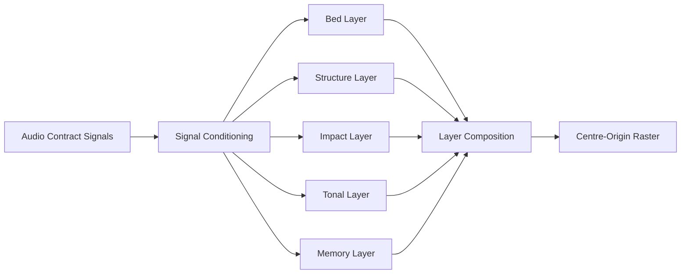

# Non-Audio Effects Pack 132-151 Audio-Reactive Refactor Blueprint

## 0. Purpose

This document defines how to refactor the 20 non-audio effects in old IDs `132-151` into audio-reactive variants while preserving each effect's original visual identity.

The goal is not to bolt on beat flashes. The goal is layered visual performance:
- stable atmosphere layer,
- structure/motion layer,
- event-impact layer,
- tonal/colour layer,
- memory/continuity layer.

This blueprint is implementation-facing and aligned to the firmware contract in `EffectContext::AudioContext`.

## 1. Scope and Target Set

This plan covers the 20 non-audio effects in the "last 30" old-ID window (`132-161`), excluding the already-reactive `152-161` pack.

| Old ID | Effect ID | Effect Name | Current State |
|---|---|---|---|
| 132 | `EID_LGP_WATER_CAUSTICS` | LGP Water Caustics | non-audio |
| 133 | `EID_LGP_SCHLIEREN_FLOW` | LGP Schlieren Flow | non-audio |
| 134 | `EID_LGP_REACTION_DIFFUSION` | LGP Reaction Diffusion | non-audio |
| 135 | `EID_LGP_REACTION_DIFFUSION_TRIANGLE` | LGP RD Triangle | non-audio |
| 136 | `EID_LGP_TALBOT_CARPET` | LGP Talbot Carpet | non-audio |
| 137 | `EID_LGP_AIRY_COMET` | LGP Airy Comet | non-audio |
| 138 | `EID_LGP_MOIRE_CATHEDRAL` | LGP Moire Cathedral | non-audio |
| 139 | `EID_LGP_SUPERFORMULA_GLYPH` | LGP Living Glyph | non-audio |
| 140 | `EID_LGP_SPIROGRAPH_CROWN` | LGP Spirograph Crown | non-audio |
| 141 | `EID_LGP_ROSE_BLOOM` | LGP Rose Bloom | non-audio |
| 142 | `EID_LGP_HARMONOGRAPH_HALO` | LGP Harmonograph Halo | non-audio |
| 143 | `EID_LGP_RULE30_CATHEDRAL` | LGP Rule 30 Cathedral | non-audio |
| 144 | `EID_LGP_LANGTON_HIGHWAY` | LGP Langton Highway | non-audio |
| 145 | `EID_LGP_CYMATIC_LADDER` | LGP Cymatic Ladder | non-audio |
| 146 | `EID_LGP_MACH_DIAMONDS` | LGP Mach Diamonds | non-audio |
| 147 | `EID_LGP_CHIMERA_CROWN` | Chimera Crown | non-audio |
| 148 | `EID_LGP_CATASTROPHE_CAUSTICS` | Catastrophe Caustics | non-audio |
| 149 | `EID_LGP_HYPERBOLIC_PORTAL` | Hyperbolic Portal | non-audio |
| 150 | `EID_LGP_LORENZ_RIBBON` | Lorenz Ribbon | non-audio |
| 151 | `EID_LGP_IFS_BIO_RELIC` | IFS Botanical Relic | non-audio |

## 2. Contract and Refactor Rules

All 20 conversions must follow these rules:

1. Keep centre-origin geometry:
   - all motion radiates from LED `79/80` outwards/inwards only.
2. No rainbow logic:
   - palette-indexed colour only, no hue-wheel sweeps.
3. No heap allocation in `render()`:
   - allocate persistent state in `init()`, free in `cleanup()`.
4. Use audio accessors only:
   - `ctx.audio.*` convenience API, no direct raw contract coupling in effect code.
5. Use timing split:
   - signal logic with `AudioReactivePolicy::signalDt(ctx)`,
   - pure visual drift with `AudioReactivePolicy::visualDt(ctx)`.
6. Graceful audio-loss behaviour:
   - keep motion coherent via fallback oscillators + availability envelope.
7. Per-frame budget target:
   - preserve `<~2 ms` effect render budget where feasible.

## 3. Shared Audio-Layer Architecture

Each refactor should follow this canonical layer model.



## 3.1 Recommended signal roles

| Role | Primary Inputs | Typical smoothing |
|---|---|---|
| Bed | `rms`, `heavy_bands` | 0.20-0.80 s |
| Structure | `spectralFlux`, `timbralSaliency`, `rhythmicSaliency` | 0.08-0.30 s |
| Impact | `beatStrength`, `isOnBeat()`, `isSnareHit()`, `isHihatHit()` | 0.12-0.30 s decay |
| Tonal | `rootNote`, `chordConfidence`, `heavy_chroma` | 0.30-0.80 s |
| Memory | integrated impact/novelty | 0.40-1.50 s |

## 3.2 Standard 16-control schema (recommended)

Use one shared control schema for all converted effects so Tab5/iOS parameter surfaces remain consistent.

| Control | Name | Purpose |
|---|---|---|
| 1 | `audio_mix` | Blend ambient base vs audio-driven modulation |
| 2 | `beat_gain` | Beat/event accent gain |
| 3 | `bass_gain` | Low-band modulation gain |
| 4 | `mid_gain` | Mid-band modulation gain |
| 5 | `treble_gain` | High-band modulation gain |
| 6 | `flux_gain` | Spectral flux/transient gain |
| 7 | `harmonic_gain` | Harmonic/chord influence |
| 8 | `rhythmic_gain` | Rhythmic saliency influence |
| 9 | `attack_s` | Envelope attack time |
| 10 | `release_s` | Envelope release time |
| 11 | `motion_rate` | Motion speed multiplier |
| 12 | `motion_depth` | Motion amplitude/depth |
| 13 | `colour_anchor_mix` | Root-note anchor vs local effect hue |
| 14 | `event_decay_s` | Impact decay constant |
| 15 | `memory_gain` | Memory tail accumulation |
| 16 | `silence_hold` | How strongly visuals persist in silence |

## 4. Per-Effect Refactor Specifications

Each item below defines the audio-reactive conversion strategy for one effect.

## 4.1 LGP Water Caustics (132)

Current visual DNA:
- derivative-driven caustic density filaments and cusp spikes.

Audio coupling:
- `heavyMid` drives sheet undulation amplitude.
- `fastFlux` drives cusp sparkle density.
- beat tick drives temporary focus pull (caustic tightening).
- tonal anchor uses chord/root with hysteresis.

Layer design:
- Bed: slow caustic sheet brightness from `rms`.
- Structure: refractive field warp from `heavyMid + timbralSaliency`.
- Impact: beat-triggered cusp gain burst.
- Tonal: root-note hue anchor + small density-based offset.
- Memory: integrate cusp activity for lingering glint.

Implementation notes:
- modulate existing `A/B/k1/k2` instead of replacing the base model.
- cap focus gain to avoid blown highlights.

Acceptance cues:
- low-energy audio retains fluid caustic motion.
- percussive hits visibly sharpen cusp filaments.

## 4.2 LGP Schlieren Flow (133)

Current visual DNA:
- knife-edge gradient field with heat-haze motion.

Audio coupling:
- `heavyBass` controls broad flow speed.
- `heavyTreble` and `hihat` control edge sharpening.
- `rhythmicSaliency` gates intermittent turbulence.

Layer design:
- Bed: smooth haze from `rms`.
- Structure: gradient slope modulation from `heavyBass`.
- Impact: hihat/snare edge-intensity pops.
- Tonal: restrained chord-linked colour drift.
- Memory: turbulence persistence after hits.

Implementation notes:
- drive `tanh(grad*gain)` gain from audio envelope.
- keep base edge readable at low input.

Acceptance cues:
- bright edge micro-detail tracks treble/percussion without flicker.

## 4.3 LGP Reaction Diffusion (134)

Current visual DNA:
- Gray-Scott 1D reaction-diffusion field (`u,v`) with seeded centre pocket.

Audio coupling:
- map `F` and `K` within safe pocket using `harmonicSaliency` and `rhythmicSaliency`.
- beat/snare inject local `v` seeding around centre region.
- `heavyBass` controls iteration count within hard bounds.

Layer design:
- Bed: concentration baseline from `rms`.
- Structure: pattern regime changes via `F/K`.
- Impact: beat-triggered nucleation pulses.
- Tonal: concentration-to-hue anchored by chord/root.
- Memory: decay-controlled residual growth regions.

Implementation notes:
- keep stability clamps; never push `F/K` outside validated ranges.
- do not increase iteration loops unboundedly.

Acceptance cues:
- clear pattern metamorphosis with music sections, no numeric blow-ups.

## 4.4 LGP RD Triangle (135)

Current visual DNA:
- tunable RD wedge isolation with parameters `F`, `K`, `melt`.

Audio coupling:
- `F` follows harmonic saliency.
- `K` follows rhythmic saliency.
- `melt` responds to bass envelope for wedge solidity.
- beat tick briefly increases local threshold contrast.

Layer design:
- Bed: baseline RD field.
- Structure: audio-driven wedge geometry.
- Impact: beat contrast pulses.
- Tonal: root/chroma hue anchor.
- Memory: retain recent wedge state for continuity.

Implementation notes:
- preserve manual parameter control as override ranges.
- expose audio modulation depth per parameter.

Acceptance cues:
- wedge width/boundary visibly follows groove density.

## 4.5 LGP Talbot Carpet (136)

Current visual DNA:
- Fresnel-style harmonic sum with self-imaging lattice motif.

Audio coupling:
- `rhythmicSaliency` modulates Talbot propagation term (`z` velocity).
- `mid` modulates grating pitch `p`.
- downbeat triggers short self-image lock pulse.

Layer design:
- Bed: low-contrast carpet luminance.
- Structure: harmonic-sum phase warp from rhythm.
- Impact: downbeat self-image snap.
- Tonal: harmonic/chord-driven hue plate.
- Memory: slow retention of last image clarity.

Implementation notes:
- keep harmonic loop count fixed for budget predictability.
- modulate phase and pitch only.

Acceptance cues:
- lattice appears to "breathe" with rhythm without becoming noisy.

## 4.6 LGP Airy Comet (137)

Current visual DNA:
- parabolic accelerating head with oscillatory decaying tail lobes.

Audio coupling:
- beat launches head acceleration bursts.
- treble/hihat energises tail lobe contrast.
- `rms` controls comet body mass/brightness.

Layer design:
- Bed: soft glow ribbon.
- Structure: head trajectory progression.
- Impact: beat-driven thrust pulses.
- Tonal: head warm/cool offset tied to chord/root.
- Memory: tail persistence proportional to `memory_gain`.

Implementation notes:
- clamp head displacement to avoid clipping at strip ends.
- keep bounce logic deterministic.

Acceptance cues:
- obvious per-beat acceleration while maintaining smooth comet narrative.

## 4.7 LGP Moire Cathedral (138)

Current visual DNA:
- dual close-grating moire arches with ribbed highlights.

Audio coupling:
- `rhythmicSaliency` modulates delta between `p1` and `p2` (beat frequency).
- `beatStrength` pulses arch contrast.
- `heavyMid` controls rib thickness.

Layer design:
- Bed: stained-glass low-frequency wash.
- Structure: moire arch breathing.
- Impact: beat-driven rib flash.
- Tonal: chord-anchored cathedral tint.
- Memory: linger arch emphasis through decay.

Implementation notes:
- avoid aggressive pitch changes each frame; smooth grating offsets.

Acceptance cues:
- giant arch cycles align to phrasing; no aliasing chatter.

## 4.8 LGP Living Glyph (139)

Current visual DNA:
- superformula morphing sigils projected as distance-to-curve bands.

Audio coupling:
- harmonic saliency maps to `(m,n1,n2,n3)` morph trajectory.
- `fastFlux` injects edge roughness micro-detail.
- beat snaps morph phase to prominent glyph poses.

Layer design:
- Bed: subtle glyph aura.
- Structure: morph continuum over bars.
- Impact: beat pose punctuation.
- Tonal: root/chord-colour anchoring.
- Memory: pose inertia between beats.

Implementation notes:
- quantise selected morph states on downbeat for legibility.
- keep continuity by shortest-arc interpolation in parameter space.

Acceptance cues:
- shape changes read as musically intentional, not random deformation.

## 4.9 LGP Spirograph Crown (140)

Current visual DNA:
- hypotrochoid crown loops with facet sparkle.

Audio coupling:
- `bpm` and `beatPhase` modulate rotational speed.
- `treble/hihat` drive facet sparkle gain.
- `harmonicSaliency` modulates ratio `r/R` subtly.

Layer design:
- Bed: crown baseline glow.
- Structure: hypotrochoid orbit evolution.
- Impact: beat sparkle crest.
- Tonal: harmonic hue ring.
- Memory: sparkle afterglow.

Implementation notes:
- preserve orbit stability; do not push ratio into degenerate loops.

Acceptance cues:
- crown feels rhythm-locked with crisp high-frequency jewel response.

## 4.10 LGP Rose Bloom (141)

Current visual DNA:
- rhodonea petal bands with opening/closing bloom modulation.

Audio coupling:
- `rms` controls bloom openness.
- `rootNote` selects petal count class (quantised set).
- beat produces petal-edge luminance pulse.

Layer design:
- Bed: continuous bloom glow.
- Structure: petal count/shape drift.
- Impact: beat petal highlight.
- Tonal: chord-led bloom tint.
- Memory: retain previous openness envelope.

Implementation notes:
- quantise petal count transitions with hysteresis to prevent chatter.

Acceptance cues:
- petals "breathe" with dynamics and reconfigure musically on harmony shifts.

## 4.11 LGP Harmonograph Halo (142)

Current visual DNA:
- Lissajous-derived halo orbitals with calm aura.

Audio coupling:
- `bpm` sets base orbit rotation.
- harmonic confidence selects frequency ratio family (`a:b`).
- `beatStrength` drives thin aura pulse ring.

Layer design:
- Bed: stable halo field.
- Structure: ratio-dependent orbital geometry.
- Impact: restrained beat pulse (do not over-strobe).
- Tonal: root/chord aura colour anchor.
- Memory: slow energy persistence.

Implementation notes:
- prioritise smoothness; this effect should stay premium and calm.

Acceptance cues:
- aura remains elegant while still synchronising to tempo.

## 4.12 LGP Rule 30 Cathedral (143)

Current visual DNA:
- Rule-30 textile with blurred neighbourhood ribs and binary tinting.

Audio coupling:
- `rhythmicSaliency` controls CA step rate.
- snare/kick inject controlled seed perturbations.
- `overallSaliency` controls blur-vs-crisp mix.

Layer design:
- Bed: blurred textile body.
- Structure: CA evolution speed.
- Impact: event-seeded local entropy bursts.
- Tonal: neighbourhood-pattern hue mapping with root anchor.
- Memory: persistence of recent entropy regions.

Implementation notes:
- keep ring wrap logic deterministic.
- apply perturbations sparsely to preserve recognisable Rule-30 identity.

Acceptance cues:
- clear musical complexity mapping without destroying CA character.

## 4.13 LGP Langton Highway (144)

Current visual DNA:
- 2D ant simulation projected into 1D drifting slice with ant spark.

Audio coupling:
- `bpm` and rhythmic saliency modulate ant steps/frame.
- beat changes scanline drift velocity.
- `hihat` triggers transient spark gain near ant location.

Layer design:
- Bed: projected grid texture.
- Structure: ant-driven emergent order tempo.
- Impact: local spark punctuations.
- Tonal: hue evolves with `m_steps` and chord anchor mix.
- Memory: retains highway formation emphasis.

Implementation notes:
- bound steps/frame for CPU safety.
- keep projection smoothing to avoid alias shimmer.

Acceptance cues:
- highway emergence speed correlates with groove intensity.

## 4.14 LGP Cymatic Ladder (145)

Current visual DNA:
- standing wave modes (2-8) with sculpted nodes/antinodes.

Audio coupling:
- dominant note/chroma cluster selects harmonic mode `n`.
- `rms` controls node contrast.
- beat adds antinode bloom accents.

Layer design:
- Bed: standing-wave body.
- Structure: mode transitions and phase speed.
- Impact: antinode hit bloom.
- Tonal: mode-aware hue plate with root anchor.
- Memory: mode hold to avoid rapid jumps.

Implementation notes:
- quantise mode selection + hysteresis.

Acceptance cues:
- visible mode changes feel musically meaningful.

## 4.15 LGP Mach Diamonds (146)

Current visual DNA:
- shock-cell triangular diamonds with subtle breathing.

Audio coupling:
- bass energy modulates shock spacing.
- `fastFlux` modulates edge sharpness and highlight.
- beat compresses spacing briefly to create "thrust" moments.

Layer design:
- Bed: baseline shock train.
- Structure: spacing drift by low-frequency energy.
- Impact: beat compression and release.
- Tonal: jewel hue anchored to chord.
- Memory: post-impact glow tail.

Implementation notes:
- enforce min/max spacing hard clamps.

Acceptance cues:
- diamonds visibly tighten on impacts and reopen smoothly.

## 4.16 Chimera Crown (147)

Current visual DNA:
- Kuramoto-Sakaguchi local coherence vs incoherence fracture.

Audio coupling:
- `rhythmicSaliency` modulates coupling `K`.
- harmonic saliency modulates phase-lag `alpha`.
- beat tick injects small synchronisation resets.

Layer design:
- Bed: oscillator bed luminance.
- Structure: coherence field dynamics.
- Impact: beat synchrony bursts.
- Tonal: coherent domains get tonal anchor lift.
- Memory: domain history persistence for cinematic fractures.

Implementation notes:
- keep oscillator update bounded and numerically stable.
- avoid hard resets; use softened phase nudges.

Acceptance cues:
- domains cohere and fracture with track energy shifts.

## 4.17 Catastrophe Caustics (148)

Current visual DNA:
- ray histogram caustic filaments with focus pull and cusp sparks.

Audio coupling:
- `beatStrength` controls focus depth `z`.
- `timbralSaliency` modulates lens field complexity.
- snare/hihat trigger cusp brightness spikes.

Layer design:
- Bed: decaying caustic field.
- Structure: focus pull breathing.
- Impact: cusp sparks on events.
- Tonal: low-amplitude refractive hue drift with chord anchor.
- Memory: histogram decay constant from `release_s`.

Implementation notes:
- keep histogram normalisation robust under spikes.

Acceptance cues:
- dramatic but controlled filament intensification on transients.

## 4.18 Hyperbolic Portal (149)

Current visual DNA:
- `atanh(r)` edge densification with multi-band ribs and portal rotation.

Audio coupling:
- `bpm` controls rotation phase velocity.
- treble/harmonic saliency controls rib density.
- downbeat adds aperture pulse.

Layer design:
- Bed: centre calm halo.
- Structure: hyperbolic rib transport.
- Impact: downbeat aperture contraction/expansion.
- Tonal: edge-depth hue lift from harmonic content.
- Memory: short-lived post-downbeat depth trail.

Implementation notes:
- clamp `r` below singularity (`<1.0`) exactly as current design.

Acceptance cues:
- portal turn and depth feel tempo-locked without instability.

## 4.19 Lorenz Ribbon (150)

Current visual DNA:
- Lorenz attractor radial trail with age-faded ribbon and specular edge.

Audio coupling:
- `overallSaliency` controls integration `dt` and trail refresh.
- beat injects small state perturbation to force phrase boundaries.
- `rms` scales ribbon thickness.

Layer design:
- Bed: chaotic base glow.
- Structure: attractor path modulation.
- Impact: beat perturbation highlights.
- Tonal: chaotic energy mapped to chord-anchored hue.
- Memory: trail ageing already present; audio controls fade curve.

Implementation notes:
- keep Lorenz constants fixed or tightly bounded.
- cap perturbation magnitude to avoid divergence.

Acceptance cues:
- visibly different phrase shapes between sections, no numerical instability.

## 4.20 IFS Botanical Relic (151)

Current visual DNA:
- mirrored Barnsley-style IFS histogram mapped into radial veins.

Audio coupling:
- `rms` and saliency control points-per-frame budget.
- harmonic/chord controls transform probability mix (species morph).
- beat adds blossom pulse to selected radial bins.

Layer design:
- Bed: stable botanical silhouette.
- Structure: growth-rate and branch distribution.
- Impact: blossom bursts.
- Tonal: museum-like restrained tint from root/chord.
- Memory: histogram decay already natural; audio tunes decay rate.

Implementation notes:
- keep per-frame point budget bounded.
- smooth probability transitions to avoid abrupt species jumps.

Acceptance cues:
- recognisable botanical form that evolves with musical structure.

## 5. Common Implementation Skeleton

Use the same skeleton for all conversions:

```cpp
void EffectAR::render(plugins::EffectContext& ctx) {
    const float dtSignal = AudioReactivePolicy::signalDt(ctx);
    const float dtVisual = AudioReactivePolicy::visualDt(ctx);

    m_audioPresence = trackAudioPresence(m_audioPresence, ctx.audio.available, dtSignal);
    if (m_audioPresence <= 0.001f) {
        // graceful fallback, not hard stop
    }

    // 1) update conditioned signals (envelopes/hysteresis)
    // 2) update per-layer state (bed/structure/impact/tonal/memory)
    // 3) compose intensity/colour
    // 4) write centre-origin pixels only
}
```

## 6. Validation Plan

## 6.1 Global tests (all 20)

1. Deterministic no-audio fallback:
   - visual continuity maintained, no abrupt freeze.
2. Beat response:
   - impact layer triggers within 1-2 frames.
3. Harmonic stability:
   - colour anchor does not chatter at chord-confidence threshold.
4. CPU budget:
   - render cost stays bounded (no new nested expensive loops).
5. Memory policy:
   - no new heap activity in `render()`.

## 6.2 Per-effect acceptance scenarios

| Effect | Key scenario |
|---|---|
| Water Caustics | kicks tighten caustic filaments, mids keep fluid motion |
| Schlieren Flow | hats sharpen gradients without persistent flicker |
| Reaction Diffusion | section changes alter pattern regime smoothly |
| RD Triangle | wedge boundary tracks groove density |
| Talbot Carpet | rhythmic passages produce strong self-image locks |
| Airy Comet | beat launches are clear, tails remain smooth |
| Moire Cathedral | giant arch beat frequency tracks rhythm energy |
| Living Glyph | morph phases align to harmonic changes |
| Spirograph Crown | facet sparkle follows treble hits |
| Rose Bloom | bloom openness breathes with dynamics |
| Harmonograph Halo | calm halo remains tempo aware |
| Rule30 Cathedral | rhythmic complexity increases CA textile entropy |
| Langton Highway | highway emergence accelerates with rhythmic drive |
| Cymatic Ladder | mode changes track note/harmonic shifts |
| Mach Diamonds | shock spacing compresses on strong beats |
| Chimera Crown | coherence domains fracture and re-lock musically |
| Catastrophe Caustics | transients create crisp cusp spark events |
| Hyperbolic Portal | downbeats produce perceptible aperture pulse |
| Lorenz Ribbon | phrase transitions alter attractor expression |
| IFS Bio Relic | growth density and blossom events follow dynamics |

## 7. Suggested Delivery Order

Prioritise by implementation risk vs visual payoff:

1. Low-risk, high-payoff:
   - `132`, `133`, `136`, `137`, `145`, `146`.
2. Medium complexity:
   - `138`, `139`, `140`, `141`, `142`, `149`, `151`.
3. Higher complexity/stateful:
   - `134`, `135`, `143`, `144`, `147`, `148`, `150`.

## 8. Output Naming and Compatibility

Recommended naming:
- keep existing IDs untouched,
- add explicit AR variant classes with predictable suffix, for example:
  - `LGPWaterCausticsAREffect`,
  - `LGPSchlierenFlowAREffect`, etc.

Migration options:
1. Side-by-side registration first (safe rollout).
2. Replace in-place only after visual QA and preset migration sign-off.

## 9. Summary

This conversion plan keeps the original maths signatures of each effect and adds audio reactivity as a layered modulation system, not as an overlay gimmick.

If implemented with the shared control schema and contract-safe timing policy, these 20 effects can become a coherent second audio-reactive pack with:
- preserved artistic identity,
- consistent operator controls,
- bounded runtime cost,
- stable behaviour under real audio conditions.

