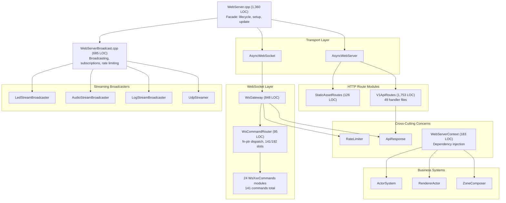

# WebServer Modular Architecture

**Status**: Phases 1-3 Complete, Phase 4 (Tests) In Progress
**Last Updated**: 2026-03-07

## Overview

The monolithic `WebServer.cpp` (6,633 LOC) has been fully refactored into a modular architecture with clear separation of concerns. All 141 WebSocket commands are dispatched via function-pointer lookup table. `processWsCommand()` has been completely removed. 100% backward compatibility maintained.

## Architecture Diagram


```mermaid
flowchart TD
    WebServerFacade["WebServer.cpp (1,360 LOC)\nFacade: lifecycle, setup, update"]
    WebServerBroadcast["WebServerBroadcast.cpp (685 LOC)\nBroadcasting, subscriptions, rate limiting"]

    subgraph transport[Transport Layer]
        HttpServer[AsyncWebServer]
        WsServer[AsyncWebSocket]
    end

    subgraph routes[HTTP Route Modules]
        StaticRoutes["StaticAssetRoutes (126 LOC)"]
        V1Routes["V1ApiRoutes (1,753 LOC)\n49 handler files"]
    end

    subgraph ws[WebSocket Layer]
        WsGateway["WsGateway (848 LOC)"]
        WsRouter["WsCommandRouter (95 LOC)\nfn-ptr dispatch, 141/192 slots"]
        WsModules["24 WsXxxCommands modules\n141 commands total"]
    end

    subgraph crosscut[Cross-Cutting Concerns]
        RateLimiter[RateLimiter]
        ApiResp[ApiResponse]
        Context["WebServerContext (183 LOC)\nDependency injection"]
    end

    subgraph streaming[Streaming Broadcasters]
        LedStream[LedStreamBroadcaster]
        AudioStream[AudioStreamBroadcaster]
        LogStream[LogStreamBroadcaster]
        UdpStream[UdpStreamer]
    end

    subgraph business[Business Systems]
        ActorSystem[ActorSystem]
        Renderer[RendererActor]
        ZoneComposer[ZoneComposer]
    end

    WebServerFacade --> HttpServer
    WebServerFacade --> WsServer
    WebServerFacade --> WebServerBroadcast
    HttpServer --> StaticRoutes
    HttpServer --> V1Routes
    WsServer --> WsGateway
    WsGateway --> WsRouter
    WsRouter --> WsModules
    WsGateway --> RateLimiter
    WsGateway --> ApiResp
    V1Routes --> ApiResp
    WebServerBroadcast --> LedStream
    WebServerBroadcast --> AudioStream
    WebServerBroadcast --> LogStream
    WebServerBroadcast --> UdpStream
    Context --> ActorSystem
    Context --> Renderer
    Context --> ZoneComposer
```

## Module Statistics

| Module | LOC | Role |
|--------|-----|------|
| `WebServer.cpp` (facade) | 1,360 | Lifecycle, setup, update loop |
| `WebServerBroadcast.cpp` | 685 | Broadcasting, subscriptions, rate limiting (same class, separate TU) |
| `WebServer.h` | 687 | Class declaration |
| `WebServerContext.h` | 183 | Dependency injection |
| `StaticAssetRoutes.cpp` | 126 | Static files |
| `V1ApiRoutes.cpp` | 1,753 | All REST endpoints (delegates to 49 handler files) |
| `WsGateway.cpp` | 848 | WebSocket connection management |
| `WsCommandRouter.cpp` | 95 | Function-pointer dispatch table |
| `WsEffectsCommands.cpp` | 717 | Largest WS command module |

## WebSocket Command Modules (24 total, 141 commands)

| Module | Commands |
|--------|----------|
| WsDeviceCommands | 3 |
| WsEffectsCommands | 18 |
| WsZonesCommands | 14 |
| WsAudioCommands | 10 |
| WsTransitionCommands | 5 |
| WsNarrativeCommands | 14 |
| WsMotionCommands | 12 |
| WsColorCommands | 12 |
| WsPaletteCommands | 5 |
| WsPresetCommands | 3 |
| WsZonePresetCommands | 5 |
| WsEffectPresetCommands | 5 |
| WsShowCommands | 11 |
| WsStreamCommands | 11 |
| WsBatchCommands | 1 |
| WsStimulusCommands | 4 |
| WsDebugCommands | 3 |
| WsFilesystemCommands | 5 |
| WsAuthCommands | 2 |
| WsSysCommands | 1 |
| WsTrinityCommands | 4 |
| WsOtaCommands | 7 |
| WsPluginCommands | 3 |
| WsModifierCommands | 0 (stub) |

## Key Design Decisions

1. **Function pointers, not `std::function`**: `WsCommandHandler = void(*)(...)` — zero heap allocation in dispatch hot path
2. **Split-file pattern for WebServerBroadcast**: Same `WebServer` class, separate translation unit — avoids over-abstraction while reducing file size
3. **`friend class` eliminated**: V1ApiRoutes uses public `getApiKeyManager()` getter instead of private member access
4. **`processWsCommand()` removed**: Was ~2,400 LOC if-else chain, replaced by 192-slot lookup table
5. **Pre-filter optimisation**: firstChar + typeLen check before `strcmp` — rejects ~95% of non-matching entries with 2-byte comparison

## Testing

| Test | Status | Environment |
|------|--------|-------------|
| `test_ws_router.cpp` (13 tests) | PASS | `native_test_ws_router` |
| `benchmark_ws_routing.cpp` | Baselined | `native_benchmark_ws_routing` |
| `test_webserver_routes.cpp` | Skeleton | Pending (deep mock deps) |
| `test_ws_gateway.cpp` | Skeleton | Pending (deep mock deps) |

**Benchmark baseline** (native x86-64, 141 handlers):
- Best case (index 0): p50 = 0.33 us, 3.1M ops/sec
- Worst case (index 140): p50 = 0.79 us, p99 = 1.0 us

## Extending the Architecture

### Adding a New WebSocket Command

1. Create handler in appropriate `WsXxxCommands.cpp`:
   ```cpp
   static void handleNewCmd(AsyncWebSocketClient* client, JsonDocument& doc,
                            const WebServerContext& ctx) {
       const char* requestId = doc["requestId"] | "";
       client->text(buildWsResponse("new.response", requestId, [](JsonObject& data) {
           data["value"] = 42;
       }));
   }
   ```

2. Register in module's `registerWsXxxCommands()`:
   ```cpp
   WsCommandRouter::registerCommand("new.command", handleNewCmd);
   ```

3. Registration is called from `WebServer::setupWebSocket()`.

### Adding a New HTTP Endpoint

Add to `V1ApiRoutes::registerRoutes()` or create a new handler file in `handlers/`.

## Backward Compatibility

100% maintained — all HTTP endpoints, WebSocket message types, response formats, error codes, auth flow, and rate limiting behaviour unchanged.
