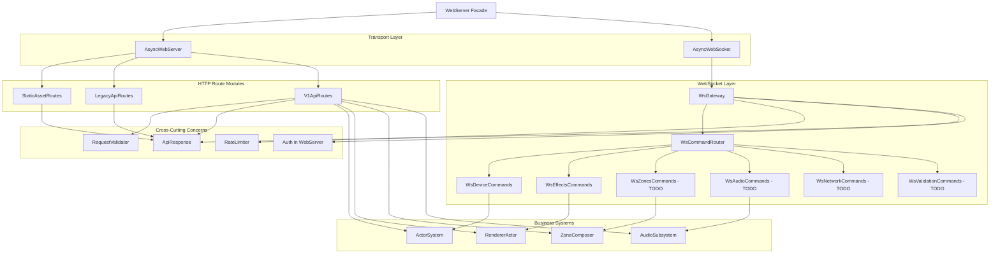

# WebServer Modular Architecture

**Status**: Phase 1-2 Complete (Route Registrars + WsGateway)  
**Last Updated**: 2025-01-XX

## Overview

The WebServer has been refactored from a monolithic 6500+ LOC implementation into a modular architecture with clear separation of concerns. The refactoring follows an **incremental facade** approach, maintaining full backward compatibility while extracting cohesive modules.

## Architecture Diagram



## Module Structure

### Core Modules

#### `WebServerContext`
**Location**: `v2/src/network/webserver/WebServerContext.h`  
**Purpose**: Non-owning reference container for business systems and state  
**Dependencies**: None (forward declarations only)  
**Size**: ~50 LOC

Provides a clean interface for modules to access:
- `ActorSystem&`
- `RendererActor*`
- `ZoneComposer*`
- `RateLimiter&`
- Stream broadcasters (LED, Audio, Benchmark)
- State flags (startTime, apMode)

#### `HttpRouteRegistry`
**Location**: `v2/src/network/webserver/HttpRouteRegistry.h`  
**Purpose**: Abstraction for HTTP route registration  
**Dependencies**: `AsyncWebServer`  
**Size**: ~80 LOC

Hides `AsyncWebServer` implementation details from route modules. Supports:
- `GET`, `POST`, `PUT`, `PATCH`, `DELETE`
- Body handlers for POST/PUT/PATCH
- `onNotFound` for 404 handling

**TODO**: Add regex pattern support for zone routes.

### HTTP Route Modules

#### `StaticAssetRoutes`
**Location**: `v2/src/network/webserver/StaticAssetRoutes.{h,cpp}`  
**Purpose**: Serve static files from LittleFS  
**Dependencies**: `HttpRouteRegistry`, `LittleFS`  
**Size**: ~120 LOC

Handles:
- Root `/` (index.html or fallback)
- `/favicon.ico`
- `/app.js`, `/styles.css`
- `/assets/*` dashboard files
- SPA fallback routing (404 handler)

#### `LegacyApiRoutes`
**Location**: `v2/src/network/webserver/LegacyApiRoutes.{h,cpp}`  
**Purpose**: Backward-compatible `/api/*` endpoints  
**Dependencies**: `HttpRouteRegistry`, `WebServerContext`, `RequestValidator`  
**Size**: ~450 LOC

Routes:
- `/api/status`, `/api/effect`, `/api/brightness`, `/api/speed`, `/api/palette`
- `/api/zone/*` (count, effect, config, preset)
- `/api/network/*` (status, scan, connect, disconnect)
- `/update` (OTA)

#### `V1ApiRoutes`
**Location**: `v2/src/network/webserver/V1ApiRoutes.{h,cpp}`  
**Purpose**: Modern `/api/v1/*` REST endpoints  
**Dependencies**: `HttpRouteRegistry`, `WebServerContext`, handler classes  
**Size**: ~600 LOC

Delegates to handler classes where available:
- `DeviceHandlers`, `EffectHandlers`, `ZoneHandlers`
- Calls `WebServer` methods for handlers not yet extracted

**Note**: Zone regex routes (`/api/v1/zones/:id/*`) are registered directly in `WebServer::setupZoneRegexRoutes()` until `HttpRouteRegistry` supports regex.

### WebSocket Modules

#### `WsGateway`
**Location**: `v2/src/network/webserver/WsGateway.{h,cpp}`  
**Purpose**: WebSocket connection management and message routing  
**Dependencies**: `AsyncWebSocket`, `WebServerContext`, `WsCommandRouter`  
**Size**: ~150 LOC

Responsibilities:
- Connection/disconnection handling
- Rate limiting (per-client IP)
- Authentication (via callback to WebServer)
- JSON parsing and validation
- Command routing via `WsCommandRouter`
- Fallback to legacy `processWsCommand` for unextracted commands

#### `WsCommandRouter`
**Location**: `v2/src/network/webserver/WsCommandRouter.{h,cpp}`  
**Purpose**: Table-driven command dispatch  
**Dependencies**: `WebServerContext`  
**Size**: ~100 LOC

Features:
- Static lookup table (max 80 handlers)
- Fast string matching (length + first char pre-filter)
- O(1) average case dispatch
- Handler signature: `void(AsyncWebSocketClient*, JsonDocument&, const WebServerContext&)`

#### Command Modules (`ws/`)

**Location**: `v2/src/network/webserver/ws/`  
**Pattern**: Each module provides `registerWs*Commands(const WebServerContext&)`

**Implemented**:
- `WsDeviceCommands` - Device status/info commands
- `WsEffectsCommands` - Effect metadata/list/current (partial)

**TODO** (migrate from `processWsCommand`):
- `WsZonesCommands` - Zone control commands
- `WsAudioCommands` - Audio parameter/control commands
- `WsNetworkCommands` - Network status/control
- `WsValidationCommands` - Effect validation commands

## Module Ownership & Dependencies

### Dependency Rules

1. **No circular dependencies**: Modules depend on `WebServerContext`, not `WebServer`
2. **Forward declarations**: Use forward declarations to break compile-time dependencies
3. **Friend classes**: `V1ApiRoutes` is a friend of `WebServer` to access private handlers (temporary, for incremental migration)

### Ownership Boundaries

| Component | Owner | Access Pattern |
|-----------|-------|----------------|
| `AsyncWebServer` | `WebServer` | Wrapped by `HttpRouteRegistry` |
| `AsyncWebSocket` | `WebServer` | Wrapped by `WsGateway` |
| Business systems | External | Referenced via `WebServerContext` |
| Route handlers | Route modules | Static functions or handler classes |
| WS command handlers | Command modules | Static functions registered with router |

## Migration Status

### Phase 1: Route Registrars ✓
- [x] `WebServerContext` created
- [x] `StaticAssetRoutes` extracted
- [x] `LegacyApiRoutes` extracted
- [x] `V1ApiRoutes` extracted (delegates to existing handlers)
- [x] `WebServer::setupRoutes()` refactored to use registrars

### Phase 2: WebSocket Gateway ✓
- [x] `WsGateway` implemented
- [x] `WsCommandRouter` updated to use `WebServerContext`
- [x] `WsDeviceCommands` extracted
- [x] `WsEffectsCommands` extracted (partial)
- [x] `WebServer::handleWsMessage()` delegates to `WsGateway`
- [ ] Remaining command modules (Zones, Audio, Network, Validation)

### Phase 3: Interface Tightening (In Progress)
- [x] `WsCommandRouter` uses `WebServerContext` instead of `WebServer*`
- [ ] Replace `std::function` with function pointers (performance)
- [ ] Remove `String` creation in routing hot paths
- [ ] Extract auth from WebServer to WsGateway

### Phase 4: Documentation & Testing (In Progress)
- [x] Architecture diagram
- [ ] Migration guide
- [ ] Unit tests (host-native)
- [ ] Integration tests
- [ ] Performance benchmarks

## Extending the Architecture

### Adding a New HTTP Route

1. **Determine route category**:
   - Static asset → `StaticAssetRoutes`
   - Legacy API → `LegacyApiRoutes`
   - V1 API → `V1ApiRoutes`

2. **If using existing handler class**:
   ```cpp
   // In V1ApiRoutes.cpp
   registry.onGet("/api/v1/new/endpoint", [&ctx, checkRateLimit, checkAPIKey](AsyncWebServerRequest* request) {
       if (!checkRateLimit(request)) return;
       if (!checkAPIKey(request)) return;
       handlers::NewHandler::handle(request, ctx);
   });
   ```

3. **If handler doesn't exist**:
   - Create handler in `v2/src/network/webserver/handlers/`
   - Or add inline handler in route module (if simple)

### Adding a New WebSocket Command

1. **Determine command category**:
   - Device → `WsDeviceCommands`
   - Effects → `WsEffectsCommands`
   - Zones → `WsZonesCommands` (create if needed)
   - Audio → `WsAudioCommands` (create if needed)
   - etc.

2. **Add handler function**:
   ```cpp
   // In WsXxxCommands.cpp
   static void handleNewCommand(AsyncWebSocketClient* client, JsonDocument& doc, const WebServerContext& ctx) {
       const char* requestId = doc["requestId"] | "";
       // ... handler logic ...
       String response = buildWsResponse("new.response", requestId, [](JsonObject& data) {
           // ... response data ...
       });
       client->text(response);
   }
   ```

3. **Register in module**:
   ```cpp
   void registerWsXxxCommands(const WebServerContext& ctx) {
       WsCommandRouter::registerCommand("new.command", handleNewCommand);
   }
   ```

4. **Call registration in `WebServer::setupWebSocket()`**:
   ```cpp
   webserver::ws::registerWsXxxCommands(ctx);
   ```

## Performance Considerations

### Current Optimizations

- **WsCommandRouter**: Length + first char pre-filtering reduces string comparisons
- **Static lookup table**: O(1) average case dispatch
- **No heap allocation in hot paths**: Fixed-size buffers, no `String` concatenation in routing

### Future Optimizations (Phase 3)

- Replace `std::function` with function pointers (eliminates heap allocation)
- Use `const char*` directly from `JsonDocument` (avoid `String` creation)
- Consider hash table for command lookup if handler count grows significantly

## Testing Strategy

### Unit Tests (Host-Native)

**Location**: `v2/test/test_native/`

- `test_webserver_routes.cpp` - Verify route registration
- `test_ws_router.cpp` - Command routing and error handling
- `test_ws_gateway.cpp` - Rate limiting, auth, parsing

### Integration Tests

- `test_webserver_integration_contract.cpp` - End-to-end HTTP/WS interactions

### Benchmarks

- `benchmark_ws_routing.cpp` - Command dispatch performance
- `benchmark_broadcast_fanout.cpp` - Multi-client broadcast performance

## Backward Compatibility

**All routes and WebSocket commands remain 100% backward compatible**:
- HTTP endpoints unchanged
- WebSocket message formats unchanged
- Response formats unchanged
- Error codes unchanged
- Authentication flow unchanged

The refactoring is **purely structural** - no behavioural changes.

## File Size Metrics

| Module | LOC | Status |
|--------|-----|--------|
| `WebServer.cpp` (facade) | ~3500 | Reduced from 6633 |
| `StaticAssetRoutes.cpp` | ~120 | ✓ |
| `LegacyApiRoutes.cpp` | ~450 | ✓ |
| `V1ApiRoutes.cpp` | ~600 | ✓ |
| `WsGateway.cpp` | ~150 | ✓ |
| `WsCommandRouter.cpp` | ~100 | ✓ |
| `WsDeviceCommands.cpp` | ~80 | ✓ |
| `WsEffectsCommands.cpp` | ~150 | ✓ (partial) |

**Target**: All modules ≤1000 LOC ✓

## Next Steps

1. **Complete command module extraction**: Migrate remaining WS commands from `processWsCommand` to domain modules
2. **Performance optimization**: Replace `std::function` with function pointers
3. **Testing**: Add comprehensive host-native unit/integration tests
4. **Documentation**: Complete migration guide with examples

