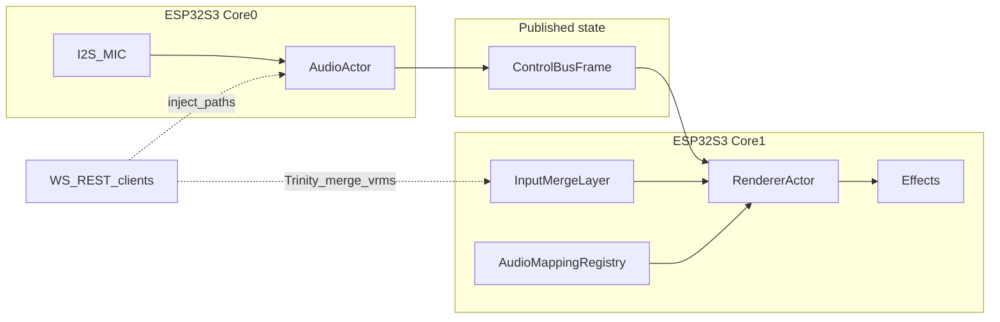

# Inference task placement matrix (K1 / LightwaveOS)

**Owner:** TBD — assign product DRI + firmware DRI (same person is acceptable only if explicitly named).  
**Status:** Rev **0.3** — SSA audit corrections (ESV11 beat clock vs `MusicalGrid`, merge hold semantics, translation silence path, effect-count footnote). `Mandatory_for_product_ship` still **Yes / No / Research only** (engineering defaults; product DRI must confirm).  
**Date:** 2026-04-12  
**Related:** Grounding and evidence discipline in [INFERENCE_TASK_DECISION_BRIEF.md](INFERENCE_TASK_DECISION_BRIEF.md).

---

## Class taxonomy (use exactly one per row)

| Class | Definition |
|-------|------------|
| **Deterministic_DSP** | Fixed signal-processing algorithm; bounded cost; reproducible from captured audio (FFT, Goertzel banks, spectral flux, STM decomposition, RMS). |
| **Heuristic_symbolic** | Rule-based or hand-tuned inference: state machines, thresholds, translation tables, triad chord rules, discrete style buckets, scene parameter blending. |
| **Statistical_ML** | Learned estimators or models trained from data. **As-built production path:** none on ESP32-S3 unless a row explicitly cites a shipped model. Use **Statistical_ML (external)** when the value is produced off-device and injected (e.g. Trinity macros). |

---

## Placement vs wire (read me first)

- **Placement** columns (`Execution_target`, `Update_rate`, `Max_staleness`) describe where and how fast the **firmware** produces or merges state.
- **Wire_exposure** compares **implemented** REST/WS handlers in `firmware-v3/src/network/` against the **authoritative** client contracts [docs/protocol/k1-rest-contract.yaml](../../../docs/protocol/k1-rest-contract.yaml) and [docs/protocol/k1-ws-contract.yaml](../../../docs/protocol/k1-ws-contract.yaml). **Verified (SSA 2026-04-12):** literal **`vrms`** / **`merge`** still **absent** from both YAMLs while firmware implements them — **contract drift**. **WS** documents `audio.parameters.*`, `stm.subscribe`, `beat.subscribe`, `trinity.*`. **REST** documents `/api/v1/audio/*` snapshots but **does not** mirror all WS keys; `trinity` appears only in stimulus **mode** prose on REST — **Verified** SSA.

---

## Task–placement matrix (seeded)

Production DSP cadence **Verified** for `esp32dev_audio_esv11_k1v2_32khz`: **125 Hz** audio hops (`HOP_SIZE=256`, `SAMPLE_RATE=32000` → 8 ms) — [audio_config.h](../../src/config/audio_config.h). Renderer cadence **Verified**: **120 Hz** frame pacing — [RendererActor.cpp](../../src/core/actors/RendererActor.cpp).

### `Mandatory_for_product_ship` legend (forced vocabulary)

| Value | Meaning |
|-------|---------|
| **Yes** | Default **K1 audio-reactive** SKU: required for shipped behaviour when `FEATURE_AUDIO_SYNC` (and dependents) remain on by default — **Inference** from default `features.h`; **must be confirmed** by product DRI. |
| **Research only** | Shipped in default firmware but **low effect usage** or **companion-only** workflow; safe to gate off for a slim SKU after product review — **Inference** from `features.h` comments. |
| **No** | Not implemented on S3 today; row exists for boundary clarity only. |

| Task / output | Class | Mandatory_for_product_ship | Update_rate | Max_staleness | Consumer | Execution_target | Failure_behavior | Wire_exposure |
|---------------|-------|----------------------------|--------------|----------------|----------|------------------|------------------|----------------|
| Onset + beat events (FFT flux, peak pick, kick; ES beat tick/strength) | Deterministic_DSP | **Yes** | **125 Hz** (ESV11 32 kHz hop); PipelineCore path **Inference** same-order hop when that backend is built | **0** (renderer reads latest `ControlBusFrame` for hop) | Effects, saliency inputs, translation, onset-derived scalars | **ESP32-S3 Core 0** (AudioActor) | **Discrete:** booleans / ticks default **false** each hop unless detector fires — **Inference**. **Continuous:** `onsetEnv` / flux follow detector dynamics (decay, not latched “hold fire”). **Product UI:** use `audioConfidence` / `silentScale` for mute cosmetics — **Verified** fields on `ControlBusFrame`. | REST `/api/v1/audio/state` (subset); WS `beat.subscribe`; **not** full onset tensor on wire |
| Tempo estimation & lock (BPM, confidence, `tempoLocked`, hop-aligned tick/strength from backends) | Deterministic_DSP | **Yes** | **125 Hz** | **0** (per hop snapshot) | Translation + `AudioEffectMapping` (`BPM`, `TEMPO_CONFIDENCE`) on Core 0; renderer beat clock consumes same `ControlBusFrame` on Core 1 — **Verified** [RendererActor.cpp](../../src/core/actors/RendererActor.cpp) | **ESP32-S3 Core 0** (AudioActor publishes hop) | **Numeric outputs** advance each published hop (new hop overwrites prior snapshot on read). **Confidence:** treat as **downgrade only** toward 0 when unlocked — **Inference**; product UI copy **Unknown — product**. | REST `/api/v1/audio/tempo`; WS `beat.subscribe`; no WS mirror of full REST tempo snapshot |
| Beat phase / grid snapshot (**backend-dependent** on Core 1) | Heuristic_symbolic | **Yes** | **120 Hz** render frames — **Verified** [RendererActor.cpp](../../src/core/actors/RendererActor.cpp) | **0** vs frame (`ReadLatest` / `snapshot`) | `m_sharedAudioCtx.musicalGrid`, mapping (`BEAT_PHASE`), effects | **ESP32-S3 Core 1** | **ESV11 (`FEATURE_AUDIO_BACKEND_ESV11`):** `EsBeatClock::tick` + `snapshot()` → `m_lastMusicalGrid` — **Verified** ~1414–1416. **PipelineCore:** `MusicalGrid::OnTempoEstimate` / `OnBeatObservation` on new hop + `Tick(render_now)` — **Verified** ~1417–1439. **Else (legacy Goertzel path):** `MusicalGrid::Tick` only — **Verified** ~1440–1442. **Decay:** `MusicalGrid` path decays `beat_strength` with τ≈0.15 s per tick — **Verified** [MusicalGrid.cpp](../../src/audio/contracts/MusicalGrid.cpp); **EsBeatClock** semantics — **Inference** (see `EsBeatClock` if product needs exact match). **Stale doc:** `MusicalGrid.h` references `RendererActor::processK1Updates` — **no such symbol** in tree — **Verified** absent via SSA. | Indirect via effects; **no** `musicalGrid.*` WS |
| Chroma (`chroma[]`, SB chroma side-car) | Deterministic_DSP | **Yes** | **125 Hz** | **0** | Chord detector, translation, SB parity consumers | Core 0 | **Hold:** value **held until next hop** overwrites (no intra-hop interpolation) — **Inference**. Flat chroma → chord path below. | REST `/api/v1/audio/parameters` (aggregated); WS `audio.parameters.get` — **not** raw 12-vector as first-class WS type |
| Chord state (`ChordState`) | Heuristic_symbolic | **Yes** | **125 Hz** | **0** | Translation, effects reading `ctx.audio` | Core 0 | **Explicit:** `ChordType::NONE`, `confidence → 0`, interval strengths low — **Verified** enum/fields in [ControlBus.h](../../src/audio/contracts/ControlBus.h). | Same as chroma / parameters — **no** dedicated `chord.*` WS in contract |
| Musical saliency (`MusicalSaliencyFrame`) | Heuristic_symbolic (energy statistics) | **Research only** | **125 Hz**; **~80 µs/hop** — **Verified** [features.h](../../src/config/features.h) | **0** | Few effects (grep: **4** distinct `*.cpp` under `src/effects` reference `harmonicSaliency` / `rhythmicSaliency` / `timbralSaliency` APIs — **Verified** SSA 2026-04-12) | Core 0 | **Scalar floors:** sub-metrics → **zero** when inputs absent — **Inference**; **disable dependent effect branch** for slim SKU — **Research only**. | Not separately exposed on wire |
| Style classification (`MusicStyle`, confidence) | Heuristic_symbolic | **Research only** | **125 Hz** surface; **~60 µs/hop** amortised — **Verified** [features.h](../../src/config/features.h) | **0** sample; internal windows may span seconds | `styleConfidence` in ≥1 effect (e.g. `LGPSpectrumDetailEffect.cpp` — **Verified** SSA); **`musicStyle(` not found under `src/effects`** — **Verified** SSA; `features.h` “2/76” comment likely **stale or different denominator** — **Inference** | Core 0 | **Explicit:** `MusicStyle::UNKNOWN`, `styleConfidence → 0` — **Verified** [ControlBus.h](../../src/audio/contracts/ControlBus.h). **Disable** style-tuned branches when unknown — **Research only** product rule. | Not dedicated in contract |
| Scene tension (`SceneParameters::tension`) | Heuristic_symbolic | **Yes** | **125 Hz** (from translation hop) | **0** on bus copy | e.g. `KuramotoTransportEffect` — **Verified** | Core 0 (translation) → `ControlBusFrame` | **Clamp 0..1** — **Verified** types. **Defaults:** `translation_init` + compile-time engine-off branches set baseline scene — **Verified** [TranslationEngine.cpp](../../src/audio/TranslationEngine.cpp), [AudioActor.cpp](../../src/audio/AudioActor.cpp). **Silence:** drives **LOCK** + `silent_scale` — **not** a literal reset to `kDefaultSceneParameters` — **Verified** SSA. | **No** direct wire field |
| Vocal presence (**Trinity WS macro inject only**) | Statistical_ML (external) | **Research only** | Client message rate (unbounded upper; typical human / agent pacing) | **Inference** ≤ one **120 Hz** renderer frame after successful inject (proxy writes before render read) | `TrinityControlBusProxy` — **Verified** [TrinityControlBusProxy.cpp](../../src/audio/TrinityControlBusProxy.cpp), [WsTrinityCommands.cpp](../../src/network/webserver/ws/WsTrinityCommands.cpp) | Off-S3 producer → Core 0 ingest | **Clamp 0..1** on ingest — **Verified** WS handler. **No long hold** of injected chroma beyond the written frame unless producer resends — **Inference**. | WS `trinity.macro` — **Verified** [k1-ws-contract.yaml](../../../docs/protocol/k1-ws-contract.yaml) |
| Vocal presence (**native on-device estimator**) | Statistical_ML | **No** | N/A | N/A | N/A | *Not implemented* | N/A — candidate row only. If added later: define **decay vs hold**, confidence, and Bucket A/B/C — **Unknown / requires spec**. | N/A |
| Translation → full `SceneParameters` | Heuristic_symbolic | **Yes** | **125 Hz** | **0** | Renderer + effects via `ControlBusFrame.scene` | Core 0 | **Compile-time engine off:** each hop publishes **`kDefaultSceneParameters`** — **Verified** [AudioActor.cpp](../../src/audio/AudioActor.cpp) `#else` branches. **`translation_init` on actor start:** seeds internal state from defaults; normal hops still run `translation_update` — **Verified** [TranslationEngine.cpp](../../src/audio/TranslationEngine.cpp). **Silence / gate:** **`LOCK` motion + `silent_scale` modulation** — **not** bitwise default struct — **Verified** SSA. **Defensive:** `translation_get_parameters(nullptr)` → defaults — **Verified** (non-runtime). | **No** dedicated scene blob on wire |
| External AI_AGENT merge (10 shared params) | Heuristic_symbolic (arbitration + IIR) | **Yes** | Event-driven (WS / serial / actor message) | **>10 s** no AI update → source **invalid** — **Verified** [InputMergeLayer.h](../../src/core/merge/InputMergeLayer.h) | Renderer pre-map | Core 1 merge (sources updated from Core 0/1) | **Stale / invalid source:** excluded from HTP/LTP (`!s.valid` / `!written`) — **Verified**. **Per-parameter:** if **no** valid+written candidate, **`m_merged[pi]` is not updated** this call — **holds previous merged value** (after cold boot, prior value was **0** from `memset`) — **Verified** SSA (no per-frame zeroing). **Smoothing:** AI_AGENT **2.0 s** tau — **Verified** same header. | Firmware `merge.submit` — **Verified** [WsStreamCommands.cpp](../../src/network/webserver/ws/WsStreamCommands.cpp); **not** in `k1-ws-contract.yaml` (drift) |

---

## Annex — AudioEffectMapping vs `ControlBus` (design rules)

These rules operationalise the brief’s mapping boundary.

### Bucket A — Mappable scalar controls (`AudioEffectMapping`)

- **Rule:** Only signals wired through `AudioSource` in [AudioEffectMapping.h](../../src/audio/contracts/AudioEffectMapping.h) and the `switch` in [AudioEffectMapping.cpp](../../src/audio/contracts/AudioEffectMapping.cpp) may participate in **generic** per-effect mappings (RMS, flux, eight bands, bass/mid/treble aggregates, beat phase, BPM, tempo confidence).
- **Consequence:** A new **scalar** that Tab5/iOS must drive through the same mapping UI needs: new `AudioSource` value, `applyMappings()` branch, persistence if stored, and **protocol** updates in `k1-rest-contract.yaml` / `k1-ws-contract.yaml` plus client updates.

### Bucket B — Effect-private semantic fields

- **Rule:** Vectors (`chroma[12]`, `bins256`, STM tensors), `scene.*`, saliency structs, chord structs, SB side-car payloads — consumed by **named effects** or translation — stay **out** of `AudioEffectMapping` unless product explicitly promotes a **scalar summary** to Bucket A.
- **Consequence:** Prefer `EffectContext` / helper accessors and focused unit tests over exploding the mapping registry.

### Bucket C — Do not map (default)

- **Rule:** High-rate buffers (`waveform[128]`, `bins256`, raw FFT magnitudes) **must not** be fed into the IIR mapping engine (cost + stability). Exceptions require ADR + performance proof + contract work.
- **Consequence:** Any “neural” or high-dimensional stream targets **merge.submit**, side-band UDP, or custom WS **after** contract work — not silent mapping extension.

---

## Data-flow diagram (placement)

Solid lines: **Verified** main path. Dotted: external or **contract-underdocumented** inject paths (`trinity.*`, `merge.submit`, `vrms.*` in firmware).

---

## Provenance (for matrix edits)

| Path | Use |
|------|-----|
| [ControlBus.h](../../src/audio/contracts/ControlBus.h) | Field inventory + `static_assert` size |
| [AudioEffectMapping.h](../../src/audio/contracts/AudioEffectMapping.h) | Allowed mapping sources |
| [InputMergeLayer.h](../../src/core/merge/InputMergeLayer.h) | Staleness + smoothing |
| [audio_config.h](../../src/config/audio_config.h) | Hop rate / sample rate |
| [k1-rest-contract.yaml](../../../docs/protocol/k1-rest-contract.yaml) | REST wire truth |
| [k1-ws-contract.yaml](../../../docs/protocol/k1-ws-contract.yaml) | WS wire truth |

When product DRIs **confirm or revise** `Mandatory_for_product_ship` and `Failure_behavior`, bump **Status** line and append revision history.

### Revision history

| Rev | Date | Author | Note |
|-----|------|--------|------|
| 0.1 | 2026-04-12 | Seeded from repo + parallel contract/config audit | Initial matrix |
| 0.2 | 2026-04-12 | Programme pass | Split tempo vs musical-grid phase; split vocal inject vs native placeholder; forced Mandatory {Yes,No,Research only}; hardened Failure_behavior; added Mandatory legend |
| 0.3 | 2026-04-12 | Parallel SSA research | ESV11 `EsBeatClock` vs `MusicalGrid` paths; merge **hold** semantics; translation silence vs defaults; effect-count vs `features.h`; wire REST/WS nuance; stale `MusicalGrid` Doxygen |
