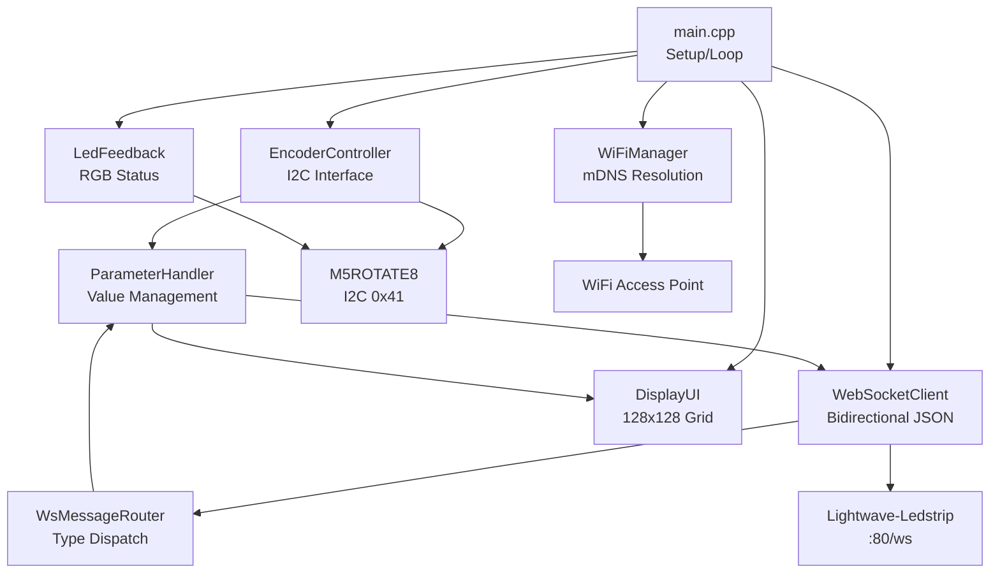
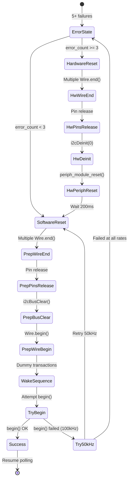
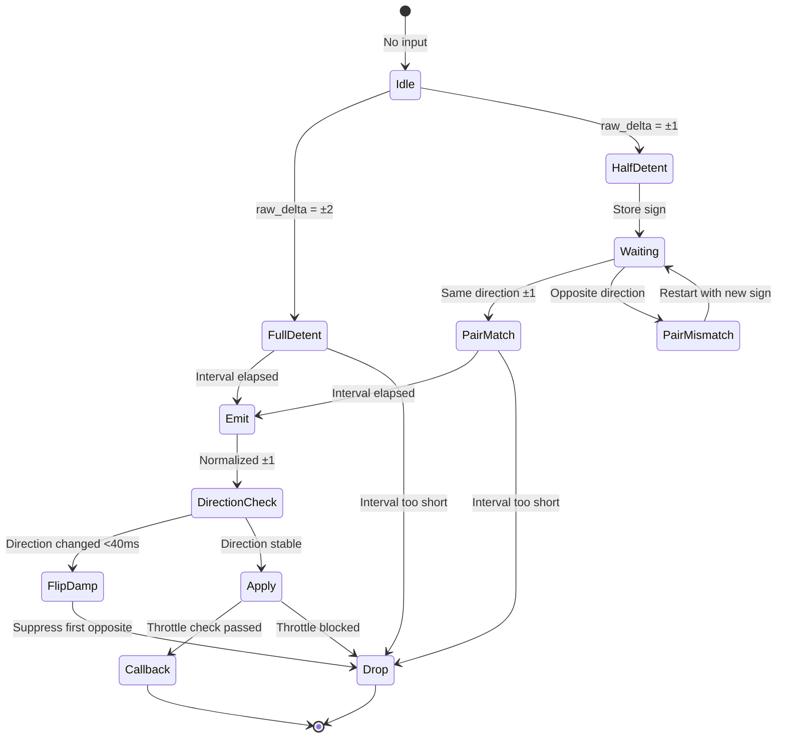

# CLAUDE.md - K1.8encoderS3

This file provides comprehensive technical documentation for the K1.8encoderS3 embedded application firmware.

---

## Project Type

**This is a full embedded application**, not a library-only project. The firmware is a complete Arduino/PlatformIO application with main entry point at `src/main.cpp`.

---

## Hardware Overview

| Component | Specifications |
|-----------|---------------|
| **Controller** | M5Stack AtomS3 (ESP32-S3, 8MB flash, 8MB PSRAM) |
| **Display** | 128×128px IPS LCD (M5GFX via M5Unified) |
| **Encoder Unit** | M5ROTATE8 (I2C address 0x41) |
| **Encoders** | 8 rotary encoders with push buttons |
| **LEDs** | 9 RGB LEDs (channels 0-7 per encoder, channel 8 extra) |
| **Onboard LED** | GPIO 35 (AtomS3 RGB LED, FastLED) |
| **I2C Buses** | Grove port (SDA=2, SCL=1) or Internal (SDA=38, SCL=39) |

### Display Specifications

- **Resolution**: 128×128px (not 135×240 as sometimes documented)
- **Layout**: 2×4 grid (8 parameter cells, 64×32px each)
- **Theme**: Neon cyberpunk aesthetic (glowing borders, scanlines)
- **Framework**: M5GFX (via M5Unified)
- **Touch**: Stubs present but AtomS3 has no touch hardware

---

## Application Architecture

### Module Structure

```
K1.8encoderS3/
├── src/
│   ├── main.cpp                 # Main entry point (setup/loop)
│   ├── config/
│   │   ├── Config.h             # I2C pins, parameter definitions
│   │   └── network_config.h     # WiFi credentials
│   ├── input/
│   │   ├── EncoderController.h  # Encoder interface & debouncing
│   │   └── EncoderController.cpp
│   ├── network/
│   │   ├── WiFiManager.h        # WiFi connection management
│   │   ├── WebSocketClient.h    # WebSocket client (links2004)
│   │   └── WsMessageRouter.h    # Message routing by type
│   ├── ui/
│   │   ├── DisplayUI.h          # 128×128px parameter grid
│   │   └── LedFeedback.h        # RGB LED status indicators
│   ├── parameters/
│   │   ├── ParameterHandler.h   # Parameter value management
│   │   └── ParameterMap.h       # Parameter definitions table
│   └── debug/
│       └── AgentDebugLog.h      # NDJSON structured logging
├── platformio.ini               # PlatformIO build configuration
└── .claude/                     # AI agent configuration
```

### Communication Architecture

```
AtomS3 (ESP32-S3)
     │
     ├── I2C (0x41, 100kHz) ───> M5ROTATE8
     │                                 │
     │                             8 encoders + 9 LEDs
     │
     ├── WiFi ───────────────────> Access Point
     │                                 │
     │                              mDNS: lightwaveos.local
     │                                 │
     └── WebSocket (:80/ws) ──────> Lightwave-Ledstrip v2
                                          │
                                     JSON parameter updates
```

### Core Components

#### 1. Main Application (`src/main.cpp`)

Entry point with encoder-first boot gate and hardware initialization.

**Key Functions**:
- `setup()`: Hardware init, encoder detection/initialization loop, network setup
- `loop()`: Main event loop (encoder polling, WebSocket servicing, WiFi management)
- `resetI2C0Hardware()`: ESP32-S3-specific I2C0 peripheral reset
- `i2cBusClear()`: Aggressive bus clearing for stuck I2C recovery
- `checkForRotate8MultiRate()`: Multi-rate I2C probe (100kHz → 50kHz → 25kHz)
- `attemptRotate8InitMultiRate()`: Multi-rate initialization
- `forceWatchdogReset()`: Watchdog-triggered hard reset on encoder init timeout

#### 2. Encoder Controller (`src/input/EncoderController.*`)

Manages M5ROTATE8 hardware interface with comprehensive debouncing and recovery.

**Features**:
- Direct per-channel polling (`getRelCounter`, `getKeyPressed`)
- DetentDebounce normalization (converts step-size 2/1 quirk to consistent ±1)
- Direction-flip damping (reduces jitter)
- Button debouncing (time-based, 40ms stable press)
- Per-parameter callback throttling (reduces WebSocket spam)
- Non-blocking I2C error recovery state machine
- Hardware I2C reset escalation (ESP-IDF level)

#### 3. Network Stack

**WiFi Manager** (`WiFiManager`): Manages WiFi connection, mDNS resolution (`lightwaveos.local` → IP)

**WebSocket Client** (`WebSocketClient`): Bidirectional JSON communication with exponential backoff reconnection

**Message Router** (`WsMessageRouter`): Routes incoming WebSocket messages by `type` field to appropriate handlers

#### 4. Parameter System

**Parameter Handler** (`ParameterHandler`): Manages 8 parameter values with min/max/default validation

**Parameter Map** (`ParameterMap`): Single source of truth for parameter definitions (encoder index, WebSocket field names, ranges)

**Parameters**:
- 0: Effect (0-95)
- 1: Brightness (0-255)
- 2: Palette (0-63)
- 3: Speed (1-100)
- 4: Intensity (0-255)
- 5: Saturation (0-255)
- 6: Complexity (0-255)
- 7: Variation (0-255)

#### 5. User Interface

**Display UI** (`DisplayUI`): 128×128px grid with neon cyberpunk theme, parameter value display

**LED Feedback** (`LedFeedback`): Onboard RGB LED status indicators (connection state, encoder flashes)

---

## Build System

### PlatformIO Configuration

**Platform**: `espressif32@6.12.0`  
**Board**: `m5stack-atoms3`  
**Framework**: `arduino`  
**Partitions**: `default_8MB.csv`

### Build Command

```bash
# From project root
pio run
```

### Dependencies (`platformio.ini`)

```
m5stack/M5Unified@^0.2.2        # Unified M5 device library
m5stack/M5AtomS3@^1.0.2         # AtomS3-specific wrapper
robtillaart/M5ROTATE8@^0.4.1    # I2C encoder driver
fastled/FastLED@3.10.0          # RGB LED control
bblanchon/ArduinoJson@^7.0.0    # JSON parsing/serialization
links2004/WebSockets@^2.4.0     # WebSocket client library
```

### Build Flags

- `CORE_DEBUG_LEVEL=3`: Verbose logging
- `ARDUINO_USB_CDC_ON_BOOT=1`: USB CDC serial on boot
- `AGENT_DEBUG_RUN_ID`: NDJSON logging session ID
- `WIFI_SSID` / `WIFI_PASSWORD`: WiFi credentials (from `network_config.h`)

---

## I2C Communication

### Configuration

Defined in `src/config/Config.h`:

```cpp
namespace I2C {
    constexpr uint8_t SDA_PIN = 2;        // Default (Grove port)
    constexpr uint8_t SCL_PIN = 1;        // Default (Grove port)
    constexpr uint8_t ROTATE8_ADDRESS = 0x41;
    constexpr uint32_t FREQ_HZ = 100000;  // 100kHz (conservative, 400kHz works but can timeout)
    constexpr uint16_t TIMEOUT_MS = 200;  // Extended timeout to reduce spurious errors
}
```

### Runtime Bus Auto-Detection

The firmware automatically detects which I2C bus the M5ROTATE8 is connected to:

**Bus Candidates**:
1. Grove port: SDA=2, SCL=1
2. Internal bus: SDA=38, SCL=39

**Detection Strategy**:
- Direct probe for address `0x41` only (no full bus scan)
- Multi-rate probing: 100kHz → 50kHz → 25kHz fallback
- First successful detection wins
- Pins stored via `EncoderController.setI2CPins()` for recovery

**Rationale**: Supports both Grove connector and internal I2C routing without manual configuration.

---

## Hardware I2C Recovery Mechanisms

### ESP32-S3-Specific Hardware Reset

The firmware implements ESP-IDF-level hardware reset for deeply stuck I2C states (common after firmware upload when encoder stays powered).

#### Function: `resetI2C0Hardware()`

Located in `src/main.cpp`:

```44:76:src/main.cpp
static void resetI2C0Hardware(uint8_t sda_pin, uint8_t scl_pin) {
    Serial.println("  [HARDWARE RESET] Resetting I2C0 at hardware level...");
    
    // Multiple Wire.end() cycles to release Arduino HAL
    Wire.end();
    delay(50);
    Wire.end();  // Second cycle
    delay(50);
    
    // Verify pins are released
    pinMode(sda_pin, INPUT_PULLUP);
    pinMode(scl_pin, INPUT_PULLUP);
    delay(10);
    
    // Delete ESP-IDF I2C driver for I2C0 (Wire = bus 0)
    // This releases the driver resources and stops the hardware peripheral
    esp_err_t err = i2cDeinit(0);  // 0 = I2C0 = Wire
    if (err != ESP_OK) {
        Serial.printf("  [HARDWARE RESET] i2cDeinit(0) returned: %d (may be OK if not initialized)\n", err);
    } else {
        Serial.println("  [HARDWARE RESET] I2C0 driver deleted successfully");
    }
    delay(50);
    
    // Reset the I2C0 hardware peripheral module at the SOC level
    // This resets all internal state, registers, and FSM of the I2C0 peripheral
    periph_module_reset(PERIPH_I2C0_MODULE);
    Serial.println("  [HARDWARE RESET] I2C0 peripheral module reset (hardware reset)");
    delay(100);  // Critical: allow hardware module time to fully reset
    
    // Additional delay for peripheral to settle after hardware reset
    delay(100);
}
```

**When Used**:
1. Immediately after `AtomS3.begin()` (M5Unified may leave I2C0 in bad state)
2. As escalation step in encoder initialization retry loop (after first failure)

**Required Headers**:
- `esp32-hal-i2c.h` (ESP-IDF I2C HAL)
- `driver/periph_ctrl.h` (Peripheral control)
- `soc/periph_defs.h` (Peripheral definitions)

**ESP32-S3 Specific**: This hardware-level reset is **not portable** to other ESP32 variants (ESP32, ESP32-C3, etc.) due to different peripheral architectures.

### Aggressive Bus Clearing

#### Function: `i2cBusClear()`

Implemented in both `src/main.cpp` and `src/input/EncoderController.cpp`:

```78:140:src/main.cpp
// Attempt to clear a potentially-stuck I2C bus (SDA held low, etc.)
// Uses SCL pulsing + STOP condition as per common I2C recovery practice.
// Enhanced with multiple cycles and more aggressive recovery.
// @param cycles Number of bus clear cycles to perform (default: 2, for post-reset recovery use 3)
static void i2cBusClear(uint8_t sda_pin, uint8_t scl_pin, int cycles = 2) {
    for (int cycle = 0; cycle < cycles; cycle++) {
        // Ensure Wire isn't driving the pins
        Wire.end();
        delay(5);

        pinMode(sda_pin, INPUT_PULLUP);
        pinMode(scl_pin, INPUT_PULLUP);
        delay(2);

        // If SDA is stuck low, try to clock it free (more aggressive: 18 pulses instead of 9)
        if (digitalRead(sda_pin) == LOW) {
            pinMode(scl_pin, OUTPUT_OPEN_DRAIN);
            digitalWrite(scl_pin, HIGH);
            delayMicroseconds(5);

            // More aggressive: 18 pulses (was 9)
            for (int i = 0; i < 18; i++) {
                digitalWrite(scl_pin, LOW);
                delayMicroseconds(5);
                digitalWrite(scl_pin, HIGH);
                delayMicroseconds(5);
            }

            pinMode(scl_pin, INPUT_PULLUP);
            delay(2);
        }

        // Send STOP sequence multiple times (2-3 times per cycle)
        for (int stop_count = 0; stop_count < 2; stop_count++) {
            pinMode(sda_pin, OUTPUT_OPEN_DRAIN);
            pinMode(scl_pin, OUTPUT_OPEN_DRAIN);
            digitalWrite(sda_pin, LOW);
            digitalWrite(scl_pin, HIGH);
            delayMicroseconds(5);
            digitalWrite(sda_pin, HIGH);
            delayMicroseconds(5);

            pinMode(sda_pin, INPUT_PULLUP);
            pinMode(scl_pin, INPUT_PULLUP);
            delay(2);
        }

        // Verify SDA release after each cycle
        pinMode(sda_pin, INPUT_PULLUP);
        pinMode(scl_pin, INPUT_PULLUP);
        delay(5);
        
        // If SDA is still stuck low and we have more cycles, try again
        if (cycle < cycles - 1 && digitalRead(sda_pin) == LOW) {
            delay(10);  // Extra delay before next cycle
        }
    }
    
    // Final verification: ensure SDA is released
    pinMode(sda_pin, INPUT_PULLUP);
    pinMode(scl_pin, INPUT_PULLUP);
    delay(5);
}
```

**Features**:
- Multiple cycles (configurable: 2-4 cycles for escalating retry levels)
- 18 SCL pulses per cycle (vs standard 9) for more aggressive recovery
- Multiple STOP sequences per cycle (2× per cycle)
- SDA release verification after each cycle (`digitalRead(sda_pin) == LOW` detection)
- Pin state checks ensure proper bus release

### Multi-Rate Probing

The firmware uses progressive frequency reduction to recover from stuck bus or brownout states:

**Strategy**: 100kHz → 50kHz → 25kHz fallback

**Functions**:
- `checkForRotate8MultiRate()`: Multi-rate probe for device detection
- `attemptRotate8InitMultiRate()`: Multi-rate initialization

**Rationale**: Slower I2C clock rates are more tolerant of:
- Bus capacitance issues
- Stuck clock/data lines
- Brownout/recovery states
- Electromagnetic interference

---

## Encoder-First Boot Gate

The firmware implements a **hard gate**: M5ROTATE8 **must** initialize before any other functionality proceeds.

### Boot Sequence

```333:502:src/main.cpp
void setup() {
    Serial.begin(115200);
    delay(100);
    Serial.println("\n\n=== K1.8encoderS3 Starting ===");

    // Initialize M5AtomS3
    auto cfg = M5.config();
    AtomS3.begin(cfg);
    Serial.println("AtomS3 initialized");
    
    // Extended settle time: Wait for M5 stack I2C initialization + let encoder firmware "wake up"
    // Increased from 200ms to 750ms for post-reset recovery
    delay(750);

    // CRITICAL: M5Unified initializes I2C0 during AtomS3.begin(), which can leave it in a bad state
    // Especially after firmware upload when encoder stays powered. Reset it IMMEDIATELY.
    Serial.println("Resetting I2C0 hardware (M5Unified may have left it in bad state)...");
    resetI2C0Hardware(2, 1);  // Reset I2C0 before first probe attempt
    delay(100);  // Additional settle after hardware reset

    // Initialize display UI (we still want local visibility while waiting for encoders)
    displayUI = new DisplayUI(AtomS3.Display);
    displayUI->begin();

    // Initialise default values for display
    uint8_t defaultValues[8] = {0, 128, 0, 25, 128, 255, 128, 0};
    displayUI->updateAll(defaultValues);
    Serial.println("Display UI initialized");

    // Encoder is the top priority: do NOT proceed until M5ROTATE8 is detected and initialised.
    // If encoder cannot be brought up within time window, force watchdog reset.
    // Escalating retry strategy: first attempt (normal), second (more aggressive), third (maximum)
    Serial.println("Checking for M5ROTATE8 (0x41)...");
    
    // Candidate bus configurations: Grove port first, then internal
    struct BusCandidate {
        uint8_t sda;
        uint8_t scl;
        const char* name;
    };
    
    BusCandidate candidates[] = {
        {2, 1, "Grove port"},
        {38, 39, "Internal bus"}
    };
    
    uint8_t selected_sda = 0;
    uint8_t selected_scl = 0;
    bool encoderInitialized = false;

    // Bounded time window: 30 seconds total (increased to allow for slower multi-frequency probes)
    const uint32_t MAX_ENCODER_INIT_TIME_MS = 30000;
    uint32_t encoder_init_start_ms = millis();
    uint32_t backoff_ms = 250;
    int attempt_count = 0;
    int retry_level = 0;  // 0=normal, 1=aggressive, 2=maximum

    while (!encoderInitialized) {
        attempt_count++;
        
        // Check if we've exceeded time window
        uint32_t elapsed_ms = millis() - encoder_init_start_ms;
        if (elapsed_ms >= MAX_ENCODER_INIT_TIME_MS) {
            char reason[128];
            snprintf(reason, sizeof(reason), 
                     "Timeout after %lu ms (%d attempts, retry_level=%d)", 
                     (unsigned long)elapsed_ms, attempt_count, retry_level);
            forceWatchdogReset(reason);
            // Will not return - forceWatchdogReset() triggers reset
        }

        // Escalating aggressiveness: determine bus_clear_cycles based on retry level
        int bus_clear_cycles = 2;  // Normal
        if (retry_level == 1) {
            bus_clear_cycles = 3;  // More aggressive
        } else if (retry_level >= 2) {
            bus_clear_cycles = 4;  // Maximum
        }

        // On retry attempts (after first failure), re-apply hardware reset
        if (attempt_count > 1) {
            Serial.println("  [RETRY RECOVERY] Performing hardware-level I2C0 peripheral reset...");
            resetI2C0Hardware(2, 1);
            delay(100);  // Settle time after hardware reset
        }

        bool found_bus = false;

        // Multi-pass bring-up: bus-clear → probe 0x41 (multi-rate) → init attempt
        for (size_t i = 0; i < sizeof(candidates) / sizeof(candidates[0]); i++) {
            if (retry_level > 0) {
                Serial.printf("[Attempt %d, Level %d] Checking %s (SDA=%d, SCL=%d)... ",
                              attempt_count, retry_level, candidates[i].name, candidates[i].sda, candidates[i].scl);
            } else {
                Serial.printf("[Attempt %d] Checking %s (SDA=%d, SCL=%d)... ",
                              attempt_count, candidates[i].name, candidates[i].sda, candidates[i].scl);
            }

            // Multi-rate probe: try 100kHz then 50kHz then 25kHz (with escalating bus clear cycles)
            bool found = checkForRotate8MultiRate(candidates[i].sda, candidates[i].scl, bus_clear_cycles);

            char data[128];
            snprintf(data, sizeof(data),
                     "{\"attempt\":%d,\"retry_level\":%d,\"bus\":\"%s\",\"sda\":%u,\"scl\":%u,\"found_0x41\":%s,\"bus_clear_cycles\":%d}",
                     attempt_count,
                     retry_level,
                     candidates[i].name,
                     (unsigned)candidates[i].sda,
                     (unsigned)candidates[i].scl,
                     found ? "true" : "false",
                     bus_clear_cycles);
            agent_dbg_log("H1", "src/main.cpp:setup", "M5ROTATE8 check result", data);

            if (found) {
                Serial.println("FOUND!");
                selected_sda = candidates[i].sda;
                selected_scl = candidates[i].scl;
                found_bus = true;
                break;
            }
        }

        if (found_bus) {
            Serial.printf("Initializing M5ROTATE8 on SDA=%d, SCL=%d (retry_level=%d)...\n", 
                          selected_sda, selected_scl, retry_level);
            encoderCtrl.setI2CPins(selected_sda, selected_scl);
            
            // Multi-rate initialization: try 100kHz then 50kHz then 25kHz (with escalating bus clear cycles)
            encoderInitialized = attemptRotate8InitMultiRate(selected_sda, selected_scl, true, bus_clear_cycles);
            if (encoderInitialized) {
                encoderCtrl.setChangeCallback(onEncoderChange);
                Serial.println("Encoder controller initialized");
                break;
            } else {
                Serial.printf("Initialization failed after multi-rate probe (retry_level=%d).\n", retry_level);
            }
        }

        // Escalate retry level: after 3 failed attempts, increase aggressiveness
        if (attempt_count % 3 == 0 && retry_level < 2) {
            retry_level++;
            Serial.printf("Escalating to retry level %d (more aggressive recovery)...\n", retry_level);
            delay(500);  // Extra delay before escalating
        }

        Serial.printf("ERROR: Encoders not ready yet (elapsed: %lu ms, level: %d). Retrying...\n", 
                      (unsigned long)(millis() - encoder_init_start_ms), retry_level);
        delay(backoff_ms);
        if (backoff_ms < 2000) backoff_ms += 250;
    }
```

### Escalating Retry Levels

| Level | Bus Clear Cycles | When Applied |
|-------|------------------|--------------|
| 0 (Normal) | 2 cycles | Initial attempts |
| 1 (Aggressive) | 3 cycles | After 3 failed attempts |
| 2 (Maximum) | 4 cycles | After 6 failed attempts |

### Watchdog Reset

If encoder initialization fails within 30 seconds, `forceWatchdogReset()` triggers a hard reset:

```305:331:src/main.cpp
// Force watchdog-triggered hard reset when encoder cannot be initialized
void forceWatchdogReset(const char* reason) {
    Serial.println("\n=== ENCODER INITIALIZATION FAILED ===");
    Serial.printf("Reason: %s\n", reason);
    Serial.println("M5ROTATE8 (0x41) is required for K1.8encoderS3 operation.");
    Serial.println("Forcing watchdog reset...");
    Serial.flush();
    delay(500);  // Give serial time to flush
    
    // Initialize task watchdog with 1 second timeout and panic enabled
    // This will trigger a hard reset if we stop feeding the watchdog
    esp_task_wdt_init(1, true);  // 1 second timeout, panic enabled
    
    // Add current task to watchdog
    esp_task_wdt_add(NULL);
    
    // Stop feeding watchdog - this will trigger reset after ~1 second
    Serial.println("Watchdog configured. Stopping watchdog feed to trigger reset...");
    Serial.flush();
    delay(100);
    
    // Infinite loop - watchdog will reset us
    while (true) {
        delay(1000);
        // Intentionally NOT calling esp_task_wdt_reset() here
    }
}
```

Uses ESP-IDF task watchdog (`esp_task_wdt_init(1, true)`) with intentional starvation to trigger hardware reset.

---

## Encoder Debouncing Implementation

The firmware implements comprehensive debouncing to handle the M5ROTATE8's physical quirks and provide reliable parameter control.

### DetentDebounce Normalization

The M5ROTATE8 exhibits a step-size quirk: it reports **2 steps per detent, occasionally 1**. The `DetentDebounce` struct normalizes this into consistent ±1 detent steps.

#### Struct Definition

```112:119:src/input/EncoderController.h
    struct DetentDebounce {
        int32_t pending_count = 0;
        uint32_t last_emit_time = 0;
        bool expecting_pair = false;

        bool processRawDelta(int32_t raw_delta, uint32_t now_ms);
        int32_t consumeNormalisedDelta();
    };
```

#### Algorithm

Located in `src/input/EncoderController.cpp`:

```108:159:src/input/EncoderController.cpp
bool EncoderController::DetentDebounce::processRawDelta(int32_t raw_delta, uint32_t now_ms) {
    if (raw_delta == 0) return false;

    // Full detent in one read (common): raw of ±2
    if (abs(raw_delta) == 2) {
        pending_count = (raw_delta > 0) ? 1 : -1;
        expecting_pair = false;
        if (now_ms - last_emit_time >= DETENT_DEBOUNCE_INTERVAL_MS) {
            last_emit_time = now_ms;
            return true;
        }
        pending_count = 0;
        return false;
    }

    // Half detent / timing artefacts: raw of ±1
    if (abs(raw_delta) == 1) {
        if (!expecting_pair) {
            pending_count = raw_delta;   // store sign
            expecting_pair = true;
            return false;                // wait for second half
        }

        // Second half arrived
        if ((pending_count > 0 && raw_delta > 0) || (pending_count < 0 && raw_delta < 0)) {
            // Same direction -> treat as full detent
            pending_count = (pending_count > 0) ? 1 : -1;
            expecting_pair = false;
            if (now_ms - last_emit_time >= DETENT_DEBOUNCE_INTERVAL_MS) {
                last_emit_time = now_ms;
                return true;
            }
            pending_count = 0;
            return false;
        }

        // Direction changed -> restart pairing
        pending_count = raw_delta;
        expecting_pair = true;
        return false;
    }

    // Unusual count (>2): normalise to ±1
    pending_count = (raw_delta > 0) ? 1 : -1;
    expecting_pair = false;
    if (now_ms - last_emit_time >= DETENT_DEBOUNCE_INTERVAL_MS) {
        last_emit_time = now_ms;
        return true;
    }
    pending_count = 0;
    return false;
}

int32_t EncoderController::DetentDebounce::consumeNormalisedDelta() {
    const int32_t out = pending_count;
    pending_count = 0;
    expecting_pair = false;
    return out;
}
```

**Behavior**:
- **Full detent (raw=±2)**: Immediate ±1 emission (if minimum interval elapsed)
- **Half detent (raw=±1)**: Pair with next ±1 (expecting_pair state)
- **Direction reversal during pairing**: Reset and restart pairing
- **Minimum interval**: `DETENT_DEBOUNCE_INTERVAL_MS = 60ms` prevents rapid-fire emissions

**Integration**: `safeGetRelDelta()` calls `processRawDelta()` → `consumeNormalisedDelta()` to get normalized steps.

### Direction-Flip Damping

Reduces jitter from mechanical bounce by filtering rapid direction reversals.

**Configuration**:
- Variables: `_last_direction[8]`, `_last_direction_change_time[8]`
- Window: `DIRECTION_FLIP_WINDOW_MS = 40ms`
- Logic: Drop first opposite step if direction flip occurs within window

**Purpose**: Prevents parameter values from oscillating due to encoder mechanical bounce.

### Button Debouncing

Time-based debouncing (not simple edge detection) for reliable button press detection.

**Configuration**:
- Variables: `_button_stable_state[8]`, `_button_state_change_time[8]`
- Requirement: `BUTTON_DEBOUNCE_MS = 40ms` stable press before registration
- Implementation: Button state must be stable for threshold before callback fires

**Behavior**: Short-press triggers parameter reset (via `processButtonPress()`).

### Per-Parameter Callback Throttling

Limits WebSocket message rate to reduce network traffic and server load.

**Configuration**:
- Variables: `_last_callback_time[8]`
- Throttle: `CALLBACK_THROTTLE_MS = 35ms` per parameter
- Applied in: `processEncoderDelta()` before invoking `_callback`

**Purpose**: Prevents WebSocket message spam when encoder is rapidly rotated.

### Coarse Mode (Disabled by Default)

The M5ROTATE8 includes a physical switch (`inputSwitch()`) that can enable coarse adjustment mode.

**Configuration**:
- Switch read: `_encoder.inputSwitch()` (returns switch position)
- Multiplier: `COARSE_MULTIPLIER = 3` (coarse steps are 3× fine steps)
- Default: `ENABLE_COARSE_SWITCH = false` (prevents erratic behavior if switch floats)
- Integration: Applied in `processEncoderDelta()` when `_coarse_mode == true`

**Rationale**: The switch line can float in some configurations, causing erratic 3× stepping. Disabled by default for stability.

---

## LightwaveOS Reliability Patterns

The firmware adopts several reliability patterns from LightwaveOS encoder handling:

### Polling Pattern

**LightwaveOS Style**: Direct per-channel reads, not mask-based polling

```cpp
// Current implementation (matches LightwaveOS)
for (uint8_t channel = 0; channel < 8; channel++) {
    int32_t delta = _encoder.getRelCounter(channel);
    bool pressed = _encoder.getKeyPressed(channel);
    // Process each channel independently
}
```

**Not Used**: V2 firmware change masks (`getEncoderChangeMask()`, `getButtonChangeMask()`) - direct polling is more reliable.

### Counter Reset Pattern

**LightwaveOS v1 EncoderManager**: Reset counter after reading if `raw_value != 0`

```468:484:src/input/EncoderController.cpp
int32_t EncoderController::safeGetRelDelta(uint8_t channel, uint32_t now_ms) {
    if (channel > 7) return 0;

    // LIGHTWAVEOS EXACT PATTERN: Lockout to avoid rapid cross-channel reads
    static const uint32_t encoder_lockout_ms = 50;
    if (_last_active_encoder_id != 255 &&
        _last_active_encoder_id != channel &&
        (now_ms - _last_encoder_change_time[_last_active_encoder_id] < encoder_lockout_ms)) {
        return 0;
    }

    // Read relative counter. On many ROTATE8 firmwares this is cumulative until reset.
    // v1 EncoderManager explicitly reset the counter after reading to keep per-poll deltas stable.
    int32_t raw_value = _encoder.getRelCounter(channel);
    if (raw_value != 0) {
        _encoder.resetCounter(channel);
    }
```

This ensures per-poll deltas are stable (non-cumulative).

### Error State Pattern

**LightwaveOS Style**: Enter error state after 5 consecutive failures

```cpp
if (_error_count > 5) {
    enterErrorState(now_ms, "consecutive_read_failures");
}
```

**Recovery**: Non-blocking state machine (see Runtime Recovery section).

### LED Clearing Pattern

**LightwaveOS Style**: Clear all 9 LEDs with `writeRGB(i, 0, 0, 0)` on init/recovery (not `resetAll()`)

```201:205:src/input/EncoderController.cpp
    // LIGHTWAVEOS PATTERN: Clear all LEDs (9 total, including LED 8) - NO resetAll() call
    // LightwaveOS does NOT call resetAll() after begin(), just clears LEDs
    for (uint8_t i = 0; i < 9; i++) {
        _encoder.writeRGB(i, 0, 0, 0);
    }
```

**Rationale**: `resetAll()` may have side effects; explicit LED clearing is safer.

---

## Runtime I2C Recovery

The firmware implements a **non-blocking recovery state machine** that maintains main loop responsiveness while recovering from I2C errors.

### Recovery Trigger

Error state entered when `_error_count > 5` consecutive read failures.

### Non-Blocking State Machine

Located in `src/input/EncoderController.cpp`:

```145:165:src/input/EncoderController.h
    // Non-blocking recovery state machine (keeps main loop responsive so WS stays serviced)
    enum class RecoveryStage : uint8_t {
        Idle = 0,
        HwWireEnd1,
        HwWireEnd2,
        HwPinsRelease,
        HwDeinit,
        HwPeriphReset,
        HwWaitAfterReset,
        PrepWireEnd1,
        PrepWireEnd2,
        PrepPinsRelease,
        PrepBusClear,
        PrepWaitAfterBusClear,
        PrepWireBegin,
        PrepWaitAfterWireBegin,
        WakeGeneralCall,
        WakeDeviceCall,
        Flush,
        TryBegin,
    };
```

### Recovery Flow

**Stages**:
1. **Hardware Reset (if escalated)**: `i2cDeinit(0)` + `periph_module_reset(PERIPH_I2C0_MODULE)`
2. **Wire.end() Cycles**: Multiple cycles to release Arduino HAL
3. **Pin Release**: `pinMode(INPUT_PULLUP)` to release pins
4. **Bus Clear**: Aggressive bus clearing (matches boot-time pattern)
5. **Wire.begin()**: Reinitialize with detected pins
6. **Wake-Up Sequences**: General call (0x00) + target address (0x41) dummy transactions
7. **Flush**: Dummy transmission to clear bus state
8. **Try Begin**: Attempt `_encoder.begin()` at 100kHz, fallback to 50kHz

**Escalation**: Hardware reset (`HwDeinit` → `HwPeriphReset`) applied if `_error_count >= 3`.

**Multi-Rate**: Tries 100kHz first, then 50kHz if initialization fails.

**Recovery Success**: Clears all 9 LEDs, resets error state, resumes polling.

---

## Network Architecture

### WebSocket Client

**Library**: `links2004/WebSockets@^2.4.0`  
**Protocol**: Bidirectional JSON over WebSocket  
**Connection**: mDNS resolution (`lightwaveos.local` → IP), then WebSocket to `:80/ws`  
**Reconnection**: Exponential backoff (1s initial, 30s max), auto-reconnect on disconnect

### Message Routing

**Router**: `WsMessageRouter` dispatches incoming messages by `type` field to registered handlers.

**Outbound Messages**: `{"type":"parameters.set","<param>":<value>}`  
**Throttling**: Per-parameter throttle (35ms minimum interval) to reduce message spam

### Parameter Communication

**Outbound Format**:
```json
{
  "type": "parameters.set",
  "brightness": 128,
  "speed": 25,
  ...
}
```

**Inbound Handling**: Routed via `WsMessageRouter::route()` → `ParameterHandler` for validation and display update.

**Compatibility**: Matches Lightwave-Ledstrip v2 API format (from `/Users/spectrasynq/Workspace_Management/Software/Lightwave-Ledstrip/v2/src/network/webserver/ws` and `/handlers`).

---

## Configuration Constants

### I2C Configuration (`src/config/Config.h`)

```cpp
namespace I2C {
    constexpr uint8_t SDA_PIN = 2;
    constexpr uint8_t SCL_PIN = 1;
    constexpr uint8_t ROTATE8_ADDRESS = 0x41;
    constexpr uint32_t FREQ_HZ = 100000;      // 100kHz (conservative)
    constexpr uint16_t TIMEOUT_MS = 200;      // Extended timeout
}
```

### Parameter Definitions

| Index | Parameter | Min | Max | Default | WebSocket Field |
|-------|-----------|-----|-----|---------|-----------------|
| 0 | Effect | 0 | 95 | 0 | `effectId` |
| 1 | Brightness | 0 | 255 | 128 | `brightness` |
| 2 | Palette | 0 | 63 | 0 | `paletteId` |
| 3 | Speed | 1 | 100 | 25 | `speed` |
| 4 | Intensity | 0 | 255 | 128 | `intensity` |
| 5 | Saturation | 0 | 255 | 255 | `saturation` |
| 6 | Complexity | 0 | 255 | 128 | `complexity` |
| 7 | Variation | 0 | 255 | 0 | `variation` |

### Debouncing Constants

| Constant | Value | Purpose |
|----------|-------|---------|
| `DETENT_DEBOUNCE_INTERVAL_MS` | 60ms | Minimum time between detent emissions |
| `DIRECTION_FLIP_WINDOW_MS` | 40ms | Window for direction-flip damping |
| `CALLBACK_THROTTLE_MS` | 35ms | Per-parameter callback throttle |
| `BUTTON_DEBOUNCE_MS` | 40ms | Button stable press requirement |
| `COARSE_MULTIPLIER` | 3 | Coarse mode step multiplier |
| `ENABLE_COARSE_SWITCH` | false | Coarse mode enabled (default: disabled) |

### Polling Constants

| Constant | Value | Purpose |
|----------|-------|---------|
| Encoder polling rate limit | 20ms | Minimum time between encoder updates |
| Encoder lockout | 50ms | Prevents rapid cross-channel reads |
| Sanity filter threshold | ±40 | Maximum raw delta before error |

---

## Constraints and Quirks

### I2C Communication

| Constraint | Details | Impact |
|------------|---------|--------|
| **I2C Speed** | Conservative 100kHz (400kHz works but can cause timeouts) | Slower but more reliable |
| **Timeout** | 200ms extended timeout | Reduces spurious ESP_ERR_TIMEOUT (263) errors |
| **Bus State** | M5Unified may leave I2C0 in bad state after `AtomS3.begin()` | Requires immediate hardware reset |

### Encoder Behavior

| Constraint | Details | Impact |
|------------|---------|--------|
| **Step Size** | Normalized via `DetentDebounce` (no longer "divide by 2") | Consistent ±1 detent steps |
| **Polling** | Direct per-channel reads (not mask-based) | More reliable than V2 change masks |
| **Counter Reset** | `resetCounter(channel)` after read if `raw_value != 0` | Ensures per-poll deltas are stable |
| **Polling Rate** | 20ms rate limit in `EncoderController::update()` | Prevents I2C bus overload |

### Error Handling

| Constraint | Details | Impact |
|------------|---------|--------|
| **Error Threshold** | 5 consecutive failures → error state | LightwaveOS-style reliability |
| **Recovery** | Non-blocking state machine | Maintains WebSocket responsiveness |
| **Escalation** | Hardware reset at 3+ error count | Aggressive recovery for deeply stuck states |

### Platform Specificity

| Constraint | Details | Impact |
|------------|---------|--------|
| **ESP32-S3 Only** | Hardware I2C reset uses ESP-IDF APIs (`i2cDeinit`, `periph_module_reset`) | **Not portable** to ESP32, ESP32-C3, ESP32-P4 |
| **M5Unified** | Requires M5AtomS3 library (v1.0.2) for display initialization | Display API is AtomS3-specific |
| **I2C Bus** | Uses I2C0 (Wire), not I2C1 (Wire1) | Arduino HAL limitation |

### Post-Reset Recovery

| Constraint | Details | Impact |
|------------|---------|--------|
| **Encoder Wake-Up** | 750ms delay after `AtomS3.begin()` | Allows encoder firmware to stabilize |
| **Hardware Reset** | Required immediately after `AtomS3.begin()` | M5Unified may leave I2C0 in bad state |
| **Watchdog Timeout** | 30 seconds maximum initialization window | Prevents infinite boot loop |

---

## Development Notes

### NDJSON Debug Logging

The firmware uses structured NDJSON (Newline Delimited JSON) logging via `AgentDebugLog` for observability:

```cpp
agent_dbg_log("H1", "src/main.cpp:setup", "M5ROTATE8 check result", data);
```

**Format**: `{"sessionId":"debug-session","runId":"i2c-scan","hypothesisId":"H1","location":"...","message":"...","data":{...},"timestamp":...}`

**Run ID**: Controlled via build flag `AGENT_DEBUG_RUN_ID` (default: "i2c-scan").

### Thread Safety

- Standard Arduino `Wire` library (no mutex protection)
- Single-threaded main loop (no FreeRTOS task concurrency)
- Non-blocking recovery state machine maintains responsiveness

### Firmware Compatibility

- **M5ROTATE8 Firmware**: Tested with V1 firmware (V2 functions available but not primary path)
- **Lightwave-Ledstrip**: Compatible with v2 API (`/ws` endpoint, `parameters.set` message format)
- **M5Unified**: Requires v0.2.2+ for ESP32-S3 support

---

## Architecture Diagrams

### Application Module Relationships



### I2C Recovery Escalation Flow



### Encoder Debouncing State Machine



---

## Known Issues and Limitations

1. **ESP32-S3 Hardware Reset**: Uses ESP-IDF APIs that are **not portable** to other ESP32 variants
2. **Coarse Mode**: Disabled by default due to switch line floating issues
3. **Post-Upload Recovery**: Encoder may require multiple boot attempts after firmware upload (mitigated by aggressive recovery)
4. **I2C Speed**: Conservative 100kHz chosen over 400kHz for reliability (trade-off between speed and timeout errors)
5. **Display Resolution**: Documentation sometimes incorrectly states 135×240; actual resolution is 128×128px

---

## References

- **LightwaveOS Reference**: `/Users/spectrasynq/Workspace_Management/Software/LightwaveOS_Official/src/encoders.h`
- **Lightwave-Ledstrip API**: `/Users/spectrasynq/Workspace_Management/Software/Lightwave-Ledstrip/v2/src/network/webserver/`
- **M5ROTATE8 Library**: `.pio/libdeps/atoms3/M5ROTATE8/`
- **M5ROTATE8 README**: Documents step-size quirk (steps of size 2, occasionally 1)

---

## Skills & Commands

### Skills (`.claude/skills/`)

| Skill | When to Use |
|-------|-------------|
| `m5rotate8-development` | I2C encoder library development |
| `arduino-library-patterns` | Arduino library conventions |
| `hardware-testing` | Physical hardware verification |

### Commands (`.claude/commands/`)

| Command | Purpose |
|---------|---------|
| `/build` | Compile firmware (`pio run`) |
| `/upload` | Flash firmware to device |
| `/monitor` | Open serial monitor (115200 baud) |
