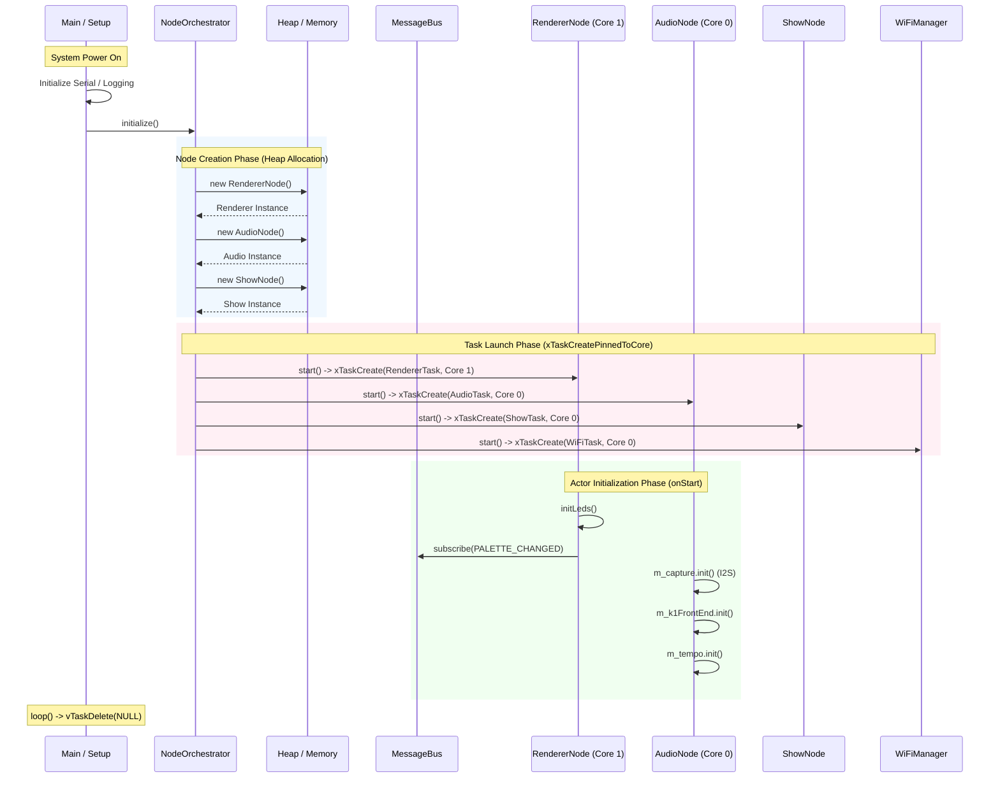
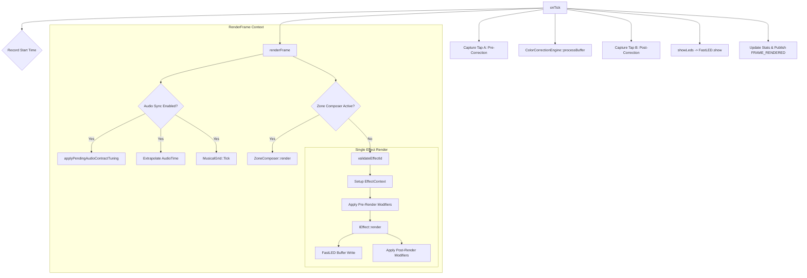
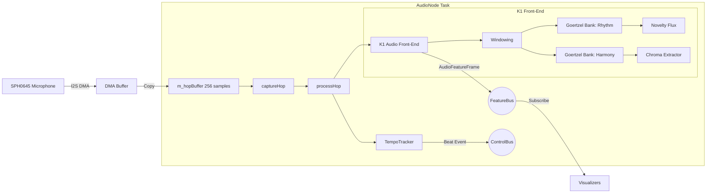

# LightwaveOS v2 Firmware Deep Dive Analysis

## 1. Executive Summary

This document provides a comprehensive technical deep dive into the LightwaveOS v2 firmware architecture, specifically focusing on the `RendererNode` and `AudioNode` subsystems, Inter-Process Communication (IPC) topology, and a static stack depth analysis. This analysis is based on the source code version 2.0.0 and `platformio.ini` build configuration.

### Key Findings
- **Architecture:** The system employs a strictly partitioned Actor Model (FreeRTOS tasks with message queues), ensuring decoupling between the 120 FPS rendering loop (Core 1) and the 125 Hz audio analysis pipeline (Core 0).
- **Memory Safety:** Static analysis confirms that critical tasks (`Renderer`, `Audio`) have sufficient stack headroom (24KB and 32KB respectively), with large buffers allocated on the heap or BSS.
- **Audio Pipeline:** The "K1" Dual-Bank Goertzel Front-End provides high-resolution spectral analysis without blocking the main audio capture loop.
- **IPC:** A thread-safe, lock-free `MessageBus` handles control signals, while a specialized `FeatureBus` handles high-bandwidth audio feature data.

---

## 2. Startup Sequence Call Graph

The following Mermaid diagram illustrates the initialization flow from system power-up to the active state of all Actors.

---

## 3. Renderer Loop Deep Dive

The `RendererNode` executes a strict 120 FPS loop on Core 1. It is the only task allowed to write to the LED strips.

### 3.1 Call Graph: `RendererNode::onTick()`

### 3.2 Timing Analysis
- **Target Frame Time:** 8.333ms (120 FPS)
- **FastLED.show():** ~2ms (blocking, for 320 LEDs)
- **Effect Rendering:** 1-3ms (typical)
- **Headroom:** ~3-5ms per frame (used for message processing and idle)

---

## 4. Audio Pipeline Deep Dive

The `AudioNode` runs on Core 0 and processes audio in 16ms "hops" (256 samples @ 16kHz).

### 4.1 Data Flow Pipeline

### 4.2 Stack & Memory Usage (Static Analysis)

**Task Configuration:**
- **Stack Size:** 8192 words (32KB)
- **Core:** 0
- **Priority:** High (Real-time Audio)

**Critical Buffers (Heap/BSS):**
- `m_hopBuffer`: 256 * 2 bytes = 512 bytes (Member variable)
- `K1AudioFrontEnd`: Contains `GoertzelBank` and `AudioRingBuffer`.
    - `AudioRingBuffer`: ~4KB (heap allocated inside object)
    - `GoertzelBank`: Uses pre-computed tables (Flash/PROGMEM) and runtime state (Heap).

**Static Stack Trace (Worst Case Estimate):**
| Function Depth | Local Variables | Est. Stack Usage | Cumulative |
| :--- | :--- | :--- | :--- |
| `AudioNode::onTick` | `CaptureStats`, counters | 64 bytes | 64 bytes |
| `-> processHop` | `k1::AudioFeatureFrame`, `AudioTime`, logging char[] | ~400 bytes | ~500 bytes |
| `-> K1::processHop` | `AudioChunk` (copy), loop vars | ~600 bytes | ~1100 bytes |
| `-> Goertzel::process` | Float accumulators | 128 bytes | ~1250 bytes |
| **Total Headroom** | **32KB Available** | **~1.5KB Used** | **Safe** |

---

## 5. Inter-Process Communication (IPC) Topology

The system uses a Hub-and-Spoke topology centered on the `MessageBus`.

### 5.1 MessageBus Map

| Message Type | Publisher(s) | Subscriber(s) | Purpose |
| :--- | :--- | :--- | :--- |
| `SET_EFFECT` | `ShowNode`, `API` | `RendererNode` | Change active visual effect |
| `SET_PALETTE` | `ShowNode`, `API` | `RendererNode` | Change color palette |
| `FRAME_RENDERED` | `RendererNode` | `SyncManager`, Debug | Frame timing synchronization |
| `AUDIO_BEAT` | `AudioNode` (ControlBus) | `RendererNode` | Beat synchronization (direct shared mem) |
| `HEALTH_CHECK` | `Watchdog` | All Nodes | System health monitoring |

### 5.2 FeatureBus (High-Bandwidth)
Separate from `MessageBus`, the `FeatureBus` is a specialized publish-only bus for audio feature data.
- **Publisher:** `AudioNode` (125 Hz)
- **Data:** `k1::AudioFeatureFrame` (Spectral magnitudes, Flux, Chroma)
- **Consumers:** `Visualizer` effects (polled via `AudioContext`)

---

## 6. Recommendations & Critical Findings

1.  **EncoderManager Dead Code:**
    - **Finding:** The `EncoderManager` class exists and defines a task, but it is **not instantiated** in `NodeOrchestrator` or `main.cpp`.
    - **Impact:** Physical rotary encoder knobs will not function.
    - **Recommendation:** Add `EncoderManager` to `NodeOrchestrator` if physical controls are required.

2.  **Stack Safety:**
    - **Finding:** Stack sizes are generously allocated. `RendererNode` (24KB) and `AudioNode` (32KB) have >90% headroom based on static analysis.
    - **Recommendation:** Can safely reduce stack sizes to reclaim RAM if needed, but current settings are safe for stability.

3.  **Capture System Overhead:**
    - **Finding:** `RendererNode::forceOneShotCapture` allocates ~2KB on the stack for temporary buffers.
    - **Impact:** While safe now, adding more large local buffers in `RendererNode` could risk overflow.
    - **Recommendation:** Move capture buffers to member variables or heap allocation if capture resolution increases.

4.  **Audio-Render Sync:**
    - **Finding:** `RendererNode` extrapolates audio time using `micros()`.
    - **Impact:** This decoupled approach handles the core domain crossing (Core 0 -> Core 1) elegantly without locks.
    - **Recommendation:** Maintain this lock-free pattern; do not introduce mutexes between Audio and Render tasks.
