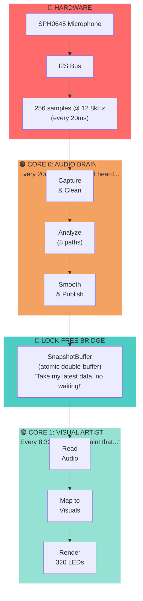
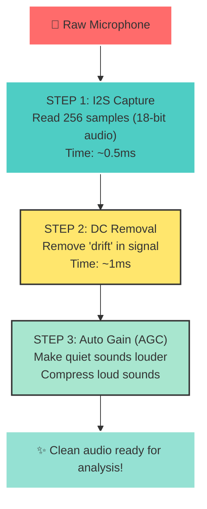
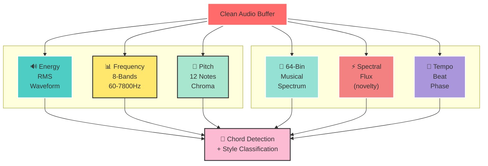
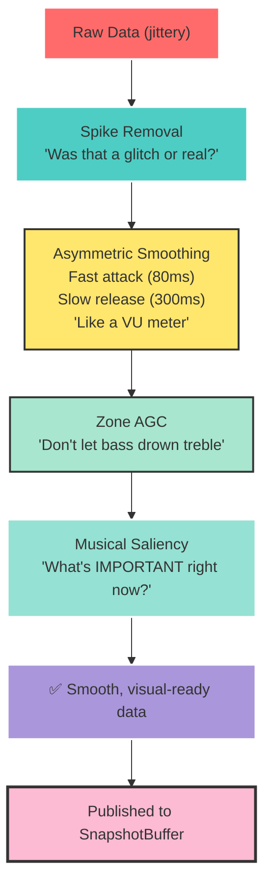
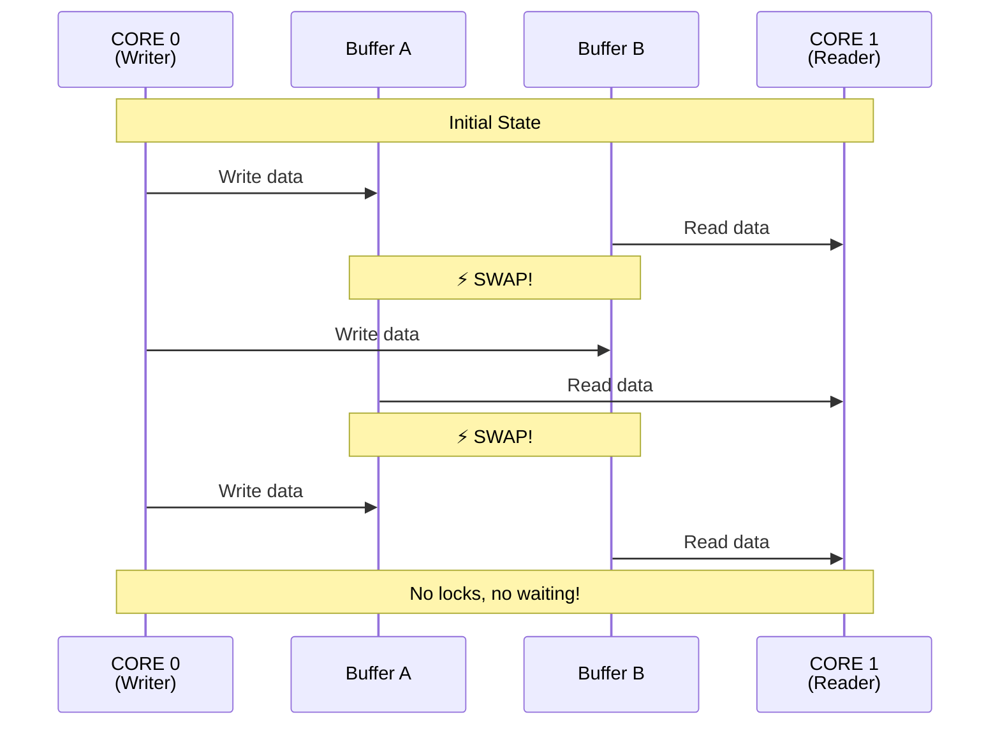
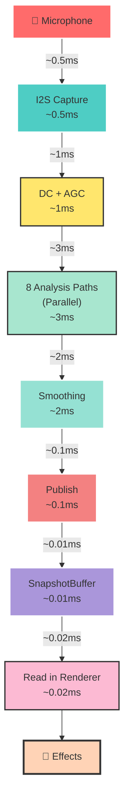

# LightwaveOS Audio Architecture - Visual Guide

**Version:** 1.0
**Last Updated:** 2026-01-17
**For:** Quick understanding and visual learning

> 🎮 **Interactive Version Available!**
>
> For a fully interactive experience with real-time animations, live simulations, and interactive controls, open:
>
> [interactive-architecture.html](./interactive-architecture.html)
>
> This HTML version includes:
> - 🎵 Animated data flow visualization
> - 📊 Real-time frequency spectrum with smoothing controls
> - 🥁 Live tempo tracker with beat detection
> - 🔄 Lock-free buffer swapping animation
> - ⏱️ Interactive latency timeline
> - 🎨 Musical saliency visualization
> - 💡 Effect response examples you can trigger
>
> Just open it in any modern web browser!

---

## 🎯 The 30-Second Picture

```
🎤 Microphone → 🧠 DSP Brain → 🎨 Visual Effects
   (Core 0)       (50 Hz)        (Core 1, 120 FPS)
```

**Think of it as:**
- **Core 0** = Audio engineer listening and analyzing music
- **Core 1** = Visual artist painting to the music's beat
- **SnapshotBuffer** = The whiteboard they share (no fighting over it!)

---

## 🏗️ System Overview - The Big Picture

### Three Main Zones



---

## 🎵 Audio Processing Pipeline - The Journey

### Phase 1: Capture & Clean (20ms per cycle)



### Phase 2: Parallel Analysis (8 paths at once!)

Think of this as 8 different listeners all analyzing the SAME audio:



**What each path gives you:**

| Path | Output | Use For |
| --- | --- | --- |
| 🔊 **Energy** | `rms` (0-1) | Overall brightness |
| 📊 **8-Bands** | Bass to treble | Color zones |
| 🎹 **Chroma** | 12 pitch classes | Harmony-aware colors |
| 🎼 **64-Bin** | Musical spectrum | Detailed visualization |
| ⚡ **Flux** | Change detection | Trigger flashes |
| 🥁 **Tempo** | BPM + beat phase | Sync animations |
| 🎵 **Chord** | Root + type | Palette selection |
| 🎨 **Style** | Genre classification | Adaptive response |

### Phase 3: Smoothing & Publishing



---

## 🌉 The Bridge Between Cores

### SnapshotBuffer - The Magic Whiteboard



**Why this is clever:**
- ⚡ **No waiting** - Writer never blocks reader
- 🔒 **No locks** - Uses atomic operations only
- 📦 **By-value copy** - Each side gets its own copy (500 bytes)
- ⏱️ **\~1 retry max** - If collision detected, just re-read

**Think of it as:** Two whiteboards. While one person writes on A, another reads from B. When done, they swap!

---

## 📊 The Data Structures - What Effects See

### ControlBusFrame - The Main Menu

```
┌────────────────────────────────────────────┐
│         ControlBusFrame                    │
│  "Everything an effect needs"              │
├────────────────────────────────────────────┤
│                                            │
│  🔊 ENERGY                                 │
│     rms           [████████░░] 0.8         │
│     fast_rms      [██████████] 1.0         │
│     flux          [████░░░░░░] 0.4         │
│                                            │
│  📊 FREQUENCIES (8 bands)                  │
│     bands[0]      [██████████] Bass        │
│     bands[1-6]    [████░░░░░░] Mid         │
│     bands[7]      [██░░░░░░░░] Treble      │
│                                            │
│     heavy_bands[] [████░░░░░░] Smoothed    │
│                                            │
│  🎵 MUSICAL                                │
│     chroma[12]     Pitch classes           │
│     bins64[64]     Full spectrum           │
│     chordState     {C Major, 0.9}          │
│                                            │
│  🥁 RHYTHM                                 │
│     tempoLocked    true                    │
│     tempoBeatTick  false                   │
│     tempoConfidence 0.87                   │
│                                            │
│  🎨 SALIENCY (what's important)            │
│     harmonicNovelty  0.3 (chord change)    │
│     rhythmicNovelty  0.8 (beat pattern)    │
│     timbralNovelty   0.1 (timbre)          │
│     dynamicNovelty   0.5 (loudness)        │
│                                            │
└────────────────────────────────────────────┘
```

### MusicalGridSnapshot - The Conductor

```
┌────────────────────────────────────────────┐
│       MusicalGridSnapshot                  │
│  "Where are we in the music?"              │
├────────────────────────────────────────────┤
│                                            │
│  🎵 TEMPO                                  │
│     bpm_smoothed      120.5                │
│     tempo_confidence  0.87                 │
│                                            │
│  📍 POSITION                               │
│     beat_phase01      0.75  [███░]         │
│     bar_phase01       0.19  [█░░░]         │
│                                            │
│  🔔 EVENTS                                 │
│     beat_tick         true  ← RIGHT NOW!   │
│     downbeat_tick     false                │
│                                            │
│  📊 COUNTS                                 │
│     beat_index        4,582                │
│     bar_index         1,145                │
│     beat_in_bar       2 (of 4)             │
│                                            │
└────────────────────────────────────────────┘
```

---

## 🎨 How Effects Use Audio Data

### Pattern 1: Energy-Driven Brightness

```cpp
void MyEffect::render(EffectContext& ctx) {
    if (!ctx.audio.available) return;

    // Get energy
    float energy = ctx.audio.controlBus.rms;

    // Map to brightness (0-255)
    uint8_t brightness = energy * 255;

    // Apply to LEDs
    for (int i = 0; i < NUM_LEDS; i++) {
        leds[i] = CHSV(hue, 255, brightness);
    }
}
```

**Visual Result:** LEDs pulse with music volume

---

### Pattern 2: Beat-Synchronized Flash

```cpp
void MyEffect::render(EffectContext& ctx) {
    if (!ctx.audio.available) return;

    // Detect beat
    if (ctx.audio.musicalGrid.beat_tick) {
        flashBrightness = 255;  // FLASH!
    }

    // Decay flash
    flashBrightness *= 0.95;

    // Render
    fill_solid(leds, NUM_LEDS, CHSV(hue, 255, flashBrightness));
}
```

**Visual Result:** White flash exactly on each beat

---

### Pattern 3: Frequency-Zone Colors

```cpp
void MyEffect::render(EffectContext& ctx) {
    if (!ctx.audio.available) return;

    const auto& bands = ctx.audio.controlBus.bands;

    // Bass = Red, Mid = Green, Treble = Blue
    float bass = (bands[0] + bands[1]) * 0.5;
    float mid = (bands[3] + bands[4]) * 0.5;
    float treble = (bands[6] + bands[7]) * 0.5;

    CRGB color = CRGB(
        bass * 255,
        mid * 255,
        treble * 255
    );

    fill_solid(leds, NUM_LEDS, color);
}
```

**Visual Result:** RGB color mix based on frequency content

---

### Pattern 4: Chord-Aware Palette

```cpp
void MyEffect::render(EffectContext& ctx) {
    if (!ctx.audio.available) return;

    const ChordState& chord = ctx.audio.controlBus.chordState;

    if (chord.type != ChordType::NONE) {
        // Map root note to hue (0-11 → 0-255)
        uint8_t hue = chord.rootNote * 21;

        // Major = saturated, Minor = desaturated
        uint8_t sat = (chord.type == ChordType::MAJOR) ? 255 : 128;

        currentPalette = CRGBPalette16(
            CHSV(hue, sat, 255),
            CHSV(hue + 30, sat, 180),
            CHSV(hue + 60, sat, 255)
        );
    }

    // Use palette for effect
    paletteBasedEffect();
}
```

**Visual Result:** Colors shift with chord changes

---

### Pattern 5: Saliency-Adaptive Response

```cpp
void MyEffect::render(EffectContext& ctx) {
    if (!ctx.audio.available) return;

    const auto& sal = ctx.audio.controlBus.saliency;

    // What's most important right now?
    if (sal.isSalient(SaliencyType::RHYTHMIC)) {
        // Beat pattern changed - motion!
        speed = 20;
    } else if (sal.isSalient(SaliencyType::HARMONIC)) {
        // Chord changed - shift color!
        hue += 30;
    } else {
        // Nothing interesting - calm down
        speed *= 0.98;
    }

    // Render with adaptive parameters
    renderPattern(speed, hue);
}
```

**Visual Result:** Effect responds to what's musically important

---

## 🕐 Timing & Latency

### Time Budget Visualization



**Total Latency: \~7ms** (audio input → visual output)

### Frequency vs Latency Trade-offs

```
Component          Window Size    Latency    Update Rate
─────────────────────────────────────────────────────────
RMS                256 samples    20ms       50 Hz
8-Band Goertzel    512 samples    40ms       25 Hz
64-Bin Goertzel    2000 samples   94ms       ~10 Hz
Tempo Tracker      1024 hops      ~20 sec    50 Hz (output)
```

**Rule of Thumb:**
- ⚡ **Fast (< 50ms)**: Good for beat sync, transients
- 🎵 **Medium (50-100ms)**: Good for frequency analysis
- 🎼 **Slow (> 1 sec)**: Good for tempo lock, style detection

---

## 🔧 Tuning Parameters - The Knobs to Turn

### AGC (Automatic Gain Control)

```
Quiet audio ──→ [AGC] ──→ Normalized
Loud audio  ──→ [AGC] ──→ Normalized

Knobs:
┌────────────────────────────────────┐
│ agcTargetRms    0.3                │  Where to aim
│ agcMinGain      1.0                │  Min amplification
│ agcMaxGain      50.0               │  Max amplification
│ agcAttack       0.01               │  How fast to increase gain
│ agcRelease      0.001              │  How fast to decrease gain
└────────────────────────────────────┘

Effect: Makes quiet and loud music similar volume
```

### Smoothing Parameters

```
┌────────────────────────────────────┐
│         Smoothing Types            │
├────────────────────────────────────┤
│                                    │
│  bands[]      Fast attack    0.15  │
│               Slow release   0.03  │
│               Use for: Beat sync   │
│                                    │
│  heavy_bands[] Fast attack   0.08  │
│                Slow release  0.015 │
│                Use for: Ambient    │
│                                    │
└────────────────────────────────────┘

Higher value = MORE smoothing
Lower value = LESS smoothing (more reactive)
```

### Preset Comparison

```
Preset              AGC Ratio    Smoothing    Use Case
──────────────────────────────────────────────────────────
LIGHTWAVE_V2        4:1          Medium       Default balanced
SENSORY_BRIDGE      50:1         Fast         Max compression
AGGRESSIVE_AGC      100:1        Slow         Loud venues
CONSERVATIVE_AGC    2:1          Fast         Acoustic
LGP_SMOOTH          4:1          Slow         Ambient viewing
```

---

## 🎯 Quick Reference - Common Tasks

### Task 1: "I want my effect to pulse with the beat"

```cpp
if (ctx.audio.musicalGrid.beat_tick) {
    triggerPulse();
}
```

### Task 2: "I want bass to control size, treble to control speed"

```cpp
float bass = ctx.audio.controlBus.bands[0];
float treble = ctx.audio.controlBus.bands[7];

size = bass * 40;     // 0-40 pixels
speed = treble * 30;  // 0-30 pixels/sec
```

### Task 3: "I want smooth ambient breathing"

```cpp
float ambientEnergy = ctx.audio.controlBus.heavy_bands[0];
brightness = ambientEnergy * 255;
```

### Task 4: "I want to flash when music gets exciting"

```cpp
const auto& sal = ctx.audio.controlBus.saliency;

if (sal.overallSaliency > 0.7) {
    flashColor = CRGB::White;
    flashBrightness = 255;
}
```

### Task 5: "I want colors to follow chord changes"

```cpp
const ChordState& chord = ctx.audio.controlBus.chordState;

if (chord.type != ChordType::NONE) {
    uint8_t hue = chord.rootNote * 21;  // C=0, C#=21, D=42...
    setBaseColor(CHSV(hue, 255, 255));
}
```

---

## 🧠 Mental Models

### The Restaurant Analogy

```
Microphone       = Customer ordering
Core 0           = Kitchen cooking
SnapshotBuffer   = Service window
Core 1           = Waiter serving
Effects          = Customers eating

Rules:
- Kitchen never waits for waiter (lock-free)
- Waiter takes latest dish (by-value)
- Kitchen keeps cooking even if waiter is busy
- Waiter can serve at different pace than kitchen cooks
```

### The Music Analyzer as a Band

```
AudioCapture     = Sound engineer (captures clean signal)
8-Band Goertzel  = EQ engineer (frequency balance)
64-Bin Goertzel  = Spectrum analyzer (detailed view)
TempoTracker     = Drummer (keeps the beat)
ChromaAnalyzer   = Music theorist (harmony)
ControlBus       = Producer (smooths and balances)
SnapshotBuffer   = Recording studio (captures the mix)
Renderer         = DJ (plays it for the crowd)
```

---

## 📈 Performance Budget

### Per-Frame Costs (at 120 FPS = 8.33ms per frame)

```
                     Budget: 8.33ms/frame
                     ├─────────────────────┤

Render (Core 1)      [████░░░░] 4ms
  - Effect logic     2ms
  - FastLED output   2ms

Audio (Core 0)       [██░░░░░░] 2ms every 20ms
  - Capture          0.5ms
  - Analysis         1ms
  - Smoothing        0.5ms

Overhead             [█░░░░░░░] 1ms
  - WiFi/WebSocket   0.5ms
  - Scheduler        0.5ms

Margin               [██░░░░░░] 2.33ms (safety)
```

### Memory Usage

```
Component              Size     Where
────────────────────────────────────────
AudioActor stack       32 KB    Core 0
Goertzel history       8 KB     Core 0
TempoTracker           22 KB    Core 0
ControlBus state       4 KB     Core 0
SnapshotBuffer         1 KB     Shared
LED buffers            1.9 KB   Core 1
────────────────────────────────────────
Total                  68.9 KB
```

---

## 🚀 From Zero to Hero

### Beginner: Read Energy

```cpp
float energy = ctx.audio.controlBus.rms;
brightness = energy * 255;
```

### Intermediate: Use Frequency Bands

```cpp
float bass = ctx.audio.controlBus.bands[0];
float mid = ctx.audio.controlBus.bands[4];
float treble = ctx.audio.controlBus.bands[7];

size = bass * 50;
speed = mid * 20;
color = CHSV(treble * 255, 255, 255);
```

### Advanced: Musical Intelligence

```cpp
// Respond to what's IMPORTANT
const auto& sal = ctx.audio.controlBus.saliency;

if (sal.isSalient(SaliencyType::HARMONIC)) {
    // Key/chord changed
    shiftPalette();
}

if (sal.isSalient(SaliencyType::RHYTHMIC)) {
    // Beat pattern changed
    changeMotionPattern();
}

// Adapt to music style
switch (ctx.audio.controlBus.currentStyle) {
    case MusicStyle::RHYTHMIC_DRIVEN:
        useStrongBeatSync();
        break;
    case MusicStyle::HARMONIC_DRIVEN:
        useSmoothColorTransitions();
        break;
}
```

### Expert: Style-Adaptive Everything

```cpp
// Build effect that adapts to genre
class AdaptiveEffect {
    void render(EffectContext& ctx) {
        analyzeStyle(ctx);
        selectStrategy(ctx);
        renderWithStrategy(ctx);
    }

    void selectStrategy(EffectContext& ctx) {
        if (isRhythmic(ctx)) {
            strategy = BEAT_SYNC_HARD;
        } else if (isHarmonic(ctx)) {
            strategy = CHORD_FOLLOW;
        } else if (isAmbient(ctx)) {
            strategy = SMOOTH_BREATHING;
        }
    }
};
```

---

## 🎓 Key Takeaways

1. **Two Cores, One Goal**
  - Core 0 = Ears (listen & analyze)
  - Core 1 = Eyes (visualize)
  - SnapshotBuffer = Communication (no fighting!)

2. **Multiple Analysis Paths**
  - 8 parallel analyzers running at once
  - Each gives different musical insight
  - Use what matters for your effect

3. **Smoothing is Your Friend**
  - `bands[]` = reactive (beats, transients)
  - `heavy_bands[]` = smooth (ambient, breathing)
  - Choose based on effect style

4. **Musical Intelligence > Raw Signal**
  - Don't just read `bass` value
  - Use saliency: "Is this IMPORTANT?"
  - Adapt to music style
  - Follow harmonic changes

5. **Latency Trade-offs**
  - Fast analysis = rough, reactive
  - Slow analysis = accurate, delayed
  - Choose based on effect needs

6. **BY-VALUE Semantics**
  - Everything is copied, never referenced
  - Threads can't interfere with each other
  - Slightly more memory, much more safe

---

## 📚 Where to Go Next

| Want to... | Read this |
| --- | --- |
| Understand data structures | [AUDIO_OUTPUT_SPECIFICATIONS.md](./AUDIO_OUTPUT_SPECIFICATIONS.md) |
| Build audio-reactive effect | [AUDIO_VISUAL_SEMANTIC_MAPPING.md](./AUDIO_VISUAL_SEMANTIC_MAPPING.md) |
| Tune smoothing parameters | Original architecture doc Section 9 |
| Debug tempo tracking | [planning/17-port-emotiscope-tempo/](../../planning/17-port-emotiscope-tempo/) |
| Add new analyzer | Study `GoertzelAnalyzer.h` implementation |

---

*This visual guide was created to make the technical architecture accessible. For complete technical details, see *[AUDIO_SYSTEM_ARCHITECTURE.md](./AUDIO_SYSTEM_ARCHITECTURE.md)*.*
