# Lightwave Dashboard Architecture

**Version:** 1.0  
**Last Updated:** 2025-01-XX  
**Purpose:** Single Source of Truth for React/Tailwind Dashboard Architecture

---

## Executive Summary

The Lightwave Dashboard is a **React 19 + TypeScript + Vite + Tailwind CSS** application that provides an external web interface for controlling the LightwaveOS ESP32-S3 LED controller. Unlike the embedded `data/` folder interface (constrained by ESP32 SPIFFS ~60KB), this dashboard has no size constraints and provides advanced visualization capabilities.

**Critical Hardware Constraint:** All effects MUST originate from center LEDs 79/80 (Light Guide Plate physics requirement).

---

## Technology Stack

### Core Framework
- **React 19.2.0**: Latest React with concurrent features
- **TypeScript 5.9.3**: Full type safety
- **Vite 7.2.5** (rolldown-vite): Fast build tool with Rust-based bundler
- **Tailwind CSS 3.4.17**: Utility-first CSS framework

### Key Dependencies
- **lucide-react**: Icon library
- **@dnd-kit**: Drag-and-drop for timeline editor
- **@playwright/test**: E2E testing
- **vitest**: Unit testing

### Build & Development
- **PostCSS**: CSS processing
- **ESLint**: Code quality
- **TypeScript ESLint**: Type-aware linting

---

## Application Architecture

### Component Hierarchy


### State Management Flow

```mermaid
graph LR
    A[V2Provider] --> B[V2State]
    A --> C[V2Actions]
    
    B --> D[settings]
    B --> E[connection]
    B --> F[deviceStatus]
    B --> G[parameters]
    B --> H[currentEffect]
    B --> I[effectsList]
    B --> J[metrics]
    
    C --> K[bootstrap]
    C --> L[setParameters]
    C --> M[setCurrentEffect]
    C --> N[refreshStatus]
    
    K --> O[V2Client]
    L --> O
    M --> O
    N --> O
    
    O --> P[API v2 Endpoints]
    
    A --> Q[V2WsClient]
    Q --> R[WebSocket Events]
    R --> B
```



### Data Flow: Parameter Updates


---

## Center-Origin Principle (CRITICAL)

### Hardware Constraint

The LightwaveOS hardware uses a **Light Guide Plate (LGP)** with dual 160-LED strips. The LGP creates interference patterns that require all visual effects to originate from the **center point** (LEDs 79/80).

### Visual Representation

```
LED Strip Layout (160 LEDs per strip):
┌───────────────────────────────────────────────────────────┐
│                                                          │
│  0 -----> -----> -----> [79|80] <----- <----- <----- 159 │
│  ↓                         ↑                         ↓  │
│  Edge                   CENTER                      Edge  │
│                         ORIGIN                           │
└───────────────────────────────────────────────────────────┘
```

### Valid Propagation Patterns

1. **Expand Outward**
   ```
   CENTER → [79|80] →→→ 159 (right)
   CENTER → [79|80] ←←← 0 (left)
   ```

2. **Contract Inward**
   ```
   0 →→→ [79|80] ←←← 159
   Edges converge at CENTER
   ```

3. **Interfere at Center**
   ```
   Wave1: 0 →→→ [79|80]
   Wave2: 159 →→→ [79|80]
   Interference occurs at CENTER
   ```

### Invalid Patterns (DO NOT IMPLEMENT)

- ❌ Linear left-to-right (0 → 159)
- ❌ Linear right-to-left (159 → 0)
- ❌ Random origin points
- ❌ Edge-originating effects

### Dashboard Implications

While the dashboard doesn't render effects directly, it must:
- Display effect metadata that indicates center-origin compliance
- Show visualizations (LGPVisualizer) that respect center-origin
- Filter/search effects by center-origin property
- Warn users if attempting to use non-center-origin effects

---

## API Integration Architecture

### V2Client Layer

The `V2Client` class provides a typed, retry-capable HTTP client:

```typescript
// Located: src/services/v2/client.ts
class V2Client {
  - baseUrl: string
  - auth: { mode: V2AuthMode; token?: string }
  - metrics: ApiMetrics
  - requestTimeoutMs: number
  
  Methods:
  - get<T>(path, opts?)
  - patch<T>(path, body)
  - put<T>(path, body)
  - post<T>(path, body)
  - getCached<T>(path, opts) // With TTL caching
}
```

### API Endpoints (v2)

All endpoints follow the pattern: `/api/v1/{resource}`

| Resource | Method | Purpose |
|----------|--------|---------|
| `/device` | GET | Device overview (status + info) |
| `/device/status` | GET | Real-time device status |
| `/device/info` | GET | Firmware/hardware info |
| `/parameters` | GET | Current parameters |
| `/parameters` | PATCH | Update parameters (debounced) |
| `/effects` | GET | List effects (paginated) |
| `/effects/current` | GET | Current active effect |
| `/effects/current` | PUT | Set current effect |
| `/effects/metadata` | GET | Effect metadata by ID |
| `/effects/categories` | GET | Effect categories |
| `/effects/families` | GET | Effect families |
| `/narrative/status` | GET | Narrative engine status |
| `/narrative/config` | GET/POST | Narrative configuration |

### WebSocket Protocol

The `V2WsClient` handles real-time updates:

```typescript
// Located: src/services/v2/ws.ts
class V2WsClient {
  Events:
  - 'parameters.changed' → Updates local state
  - 'effects.changed' → Updates current effect
  - 'transition.started' → Transition notifications
  
  Binary Stream:
  - LED frame data (961 bytes: 0xFE + 320×RGB)
  - Real-time visualization feed
}
```

### Response Envelope Format

All API responses follow this envelope:

```typescript
type V2Envelope<T> =
  | { success: true; data: T; timestamp: number; version: string }
  | { success: false; error: V2ErrorBody; timestamp: number; version: string };
```

---

## Component Patterns

### Container Components

**DashboardShell** (`src/components/DashboardShell.tsx`)
- Root container component
- Manages tab navigation
- Coordinates child tab components
- Handles connection status

**Tab Components** (`src/components/tabs/*.tsx`)
- Self-contained feature modules
- Access state via `useV2()` hook
- Follow consistent layout patterns

### Presentational Components

**UI Components** (`src/components/ui/*.tsx`)
- Reusable, stateless components
- Accept props for customization
- Follow Glass V4 design system

### Custom Hooks

**useV2** (`src/state/v2.tsx`)
- Provides state and actions from V2Provider
- Must be used within V2Provider context

**useLedStream** (`src/hooks/useLedStream.ts`)
- Subscribes to WebSocket LED frame stream
- Returns processed LED data for visualization

**useTimelineDrag** (`src/hooks/useTimelineDrag.ts`)
- Handles drag-and-drop for timeline editor
- Manages scene positioning and zone assignment

---

## File Structure

```
lightwave-dashboard/
├── src/
│   ├── App.tsx                 # Root component
│   ├── main.tsx                # Entry point
│   ├── index.css               # Global styles + animations
│   │
│   ├── components/
│   │   ├── DashboardShell.tsx  # Main container
│   │   ├── LGPVisualizer.tsx   # LED visualization
│   │   ├── TelemetryGraph.tsx  # Performance graphs
│   │   ├── NarrativeStatus.tsx # Narrative engine UI
│   │   │
│   │   ├── tabs/
│   │   │   ├── EffectsTab.tsx  # Effects browser
│   │   │   ├── ShowsTab.tsx     # Timeline editor
│   │   │   └── SystemTab.tsx    # System diagnostics
│   │   │
│   │   └── ui/
│   │       ├── SliderControl.tsx
│   │       ├── PresetButton.tsx
│   │       └── InfoRow.tsx
│   │
│   ├── state/
│   │   └── v2.tsx              # V2Provider + useV2 hook
│   │
│   ├── services/
│   │   └── v2/
│   │       ├── client.ts        # HTTP client
│   │       ├── ws.ts            # WebSocket client
│   │       ├── api.ts           # API method definitions
│   │       ├── types.ts         # TypeScript types
│   │       ├── config.ts        # Configuration helpers
│   │       └── metrics.ts       # API metrics tracking
│   │
│   ├── hooks/
│   │   ├── useLedStream.ts
│   │   └── useTimelineDrag.ts
│   │
│   └── types/
│       └── timeline.ts          # Timeline-specific types
│
├── docs/
│   ├── ARCHITECTURE.md          # This file
│   └── UI_STANDARDS.md          # Design system documentation
│
├── tailwind.config.js           # Tailwind configuration
├── vite.config.ts              # Vite build configuration
└── package.json                # Dependencies
```

---

## Development Workflow

### Local Development

```bash
npm run dev          # Start dev server (HMR enabled)
npm run build        # Production build
npm run preview      # Preview production build
```

### Testing

```bash
npm run test         # Unit tests (Vitest)
npm run test:e2e     # E2E tests (Playwright)
npm run test:all     # Run all tests
```

### Code Quality

```bash
npm run lint         # ESLint check
```

---

## Key Architectural Decisions

### Why React 19?
- Latest concurrent features for smooth UI updates
- Improved performance with automatic batching
- Better TypeScript integration

### Why Vite (rolldown-vite)?
- Fast HMR for rapid development
- Rust-based bundler for production builds
- Native ESM support

### Why Tailwind CSS?
- Utility-first approach matches component-based architecture
- Consistent design tokens via `tailwind.config.js`
- Small production bundle size (purged unused classes)

### Why Context API (not Redux)?
- Simpler state management for this use case
- No external dependencies
- Sufficient for current complexity level

### Why TypeScript?
- Type safety prevents runtime errors
- Better IDE support and autocomplete
- Self-documenting code via types

---

## Performance Considerations

### State Updates
- Parameters are debounced (80ms default) to reduce API calls
- WebSocket events update state directly (no debounce needed)
- Metrics are tracked per API call for performance monitoring

### Rendering Optimization
- React.memo used where appropriate
- useMemo for expensive computations
- useCallback for stable function references

### Bundle Size
- Tree-shaking via Vite
- Code splitting for routes (if added)
- Tailwind CSS purging removes unused classes

---

## Security Considerations

### Authentication
- Supports Bearer token and API Key modes
- Tokens stored in localStorage (configurable)
- No authentication by default (local network)

### CORS
- Configured for local development
- Production deployment should configure proper CORS headers

### Input Validation
- TypeScript types provide compile-time validation
- API responses validated via envelope format
- Error handling for malformed responses

---

## Future Enhancements

### Planned Features
- Zone control UI (currently missing)
- Enhancement engines UI
- Preset management (full implementation)
- Firmware OTA updates
- Audio sync portal integration

### Technical Debt
- Migrate remaining `/api/` endpoints to `/api/v1/`
- Add visual regression testing
- Implement proper error boundaries
- Add loading skeletons for better UX

---

## References

- [UI Standards Documentation](./UI_STANDARDS.md)
- [Component Gallery](../src/components/ui/README.md)
- [Main Project README](../../README.md)
- [Hardware Architecture](../../ARCHITECTURE.md)

---

**For AI Agents:** When implementing new features, always:
1. Check this architecture document first
2. Follow the Center-Origin Principle
3. Use existing component patterns
4. Maintain type safety with TypeScript
5. Follow the Glass V4 design system (see UI_STANDARDS.md)

