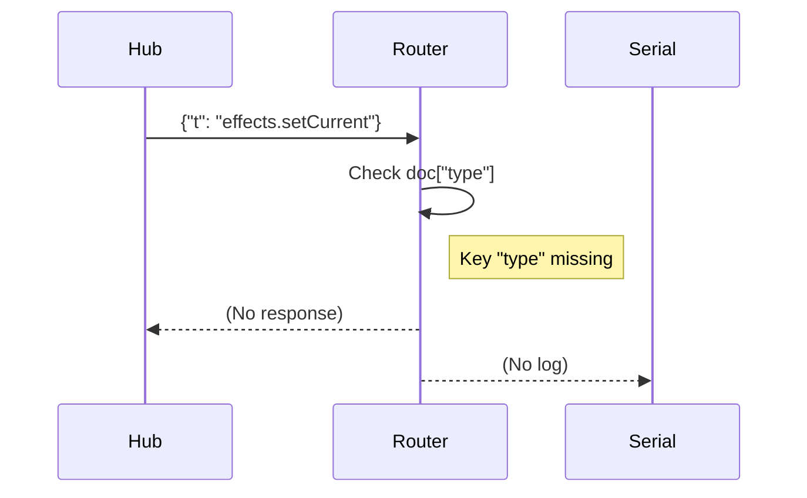
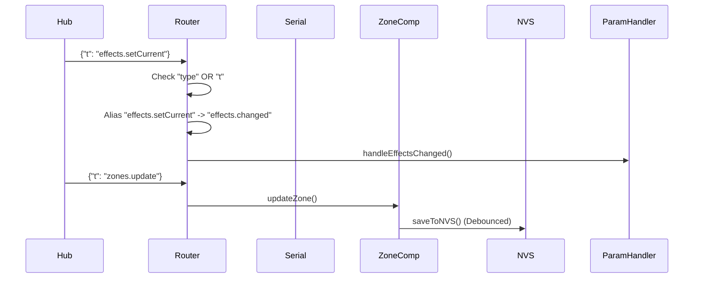
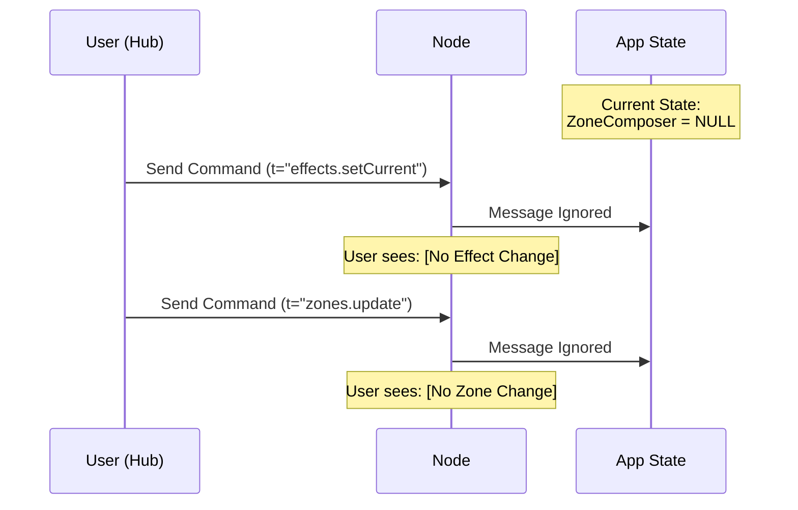
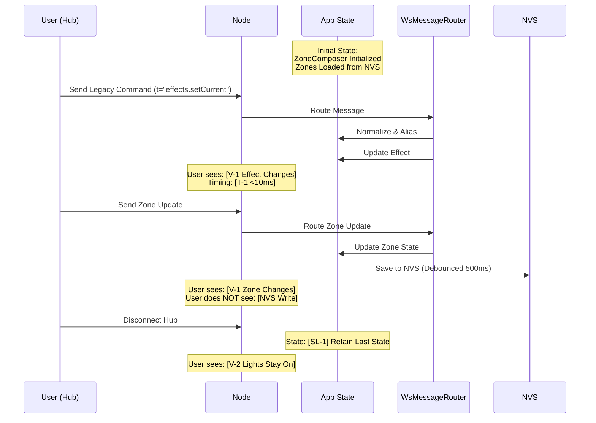
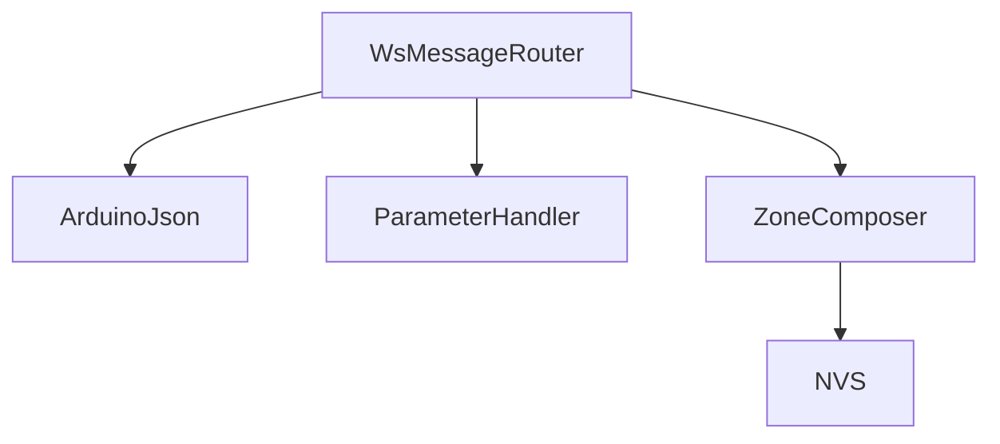

# Technical Implementation Blueprint: Legacy Parity Recovery

> **Traceability Note:** This Blueprint extracts from PRD sections §1-§10. All tables include "Source: PRD §X" annotations. Section numbers (§1-§11) are referenced by the Task List.

## §1. Current vs Target Analysis

### §1.1 Current System Architecture

```mermaid
graph TD
    Hub[Legacy Hub] --"ws (t key)"--> Node[K1.8encoderS3]
    Node --"Parse Error"--> Log[Serial]
    Node -.-> ZoneComp[ZoneComposer (Missing)]
    Node --"Only handles type key"--> WsRouter[WsMessageRouter]
```

### §1.2 Target System Architecture

```mermaid
graph TD
    Hub[Legacy Hub] --"ws (t key)"--> Node[K1.8encoderS3]
    Node --> Router[WsMessageRouter]
    
    subgraph Firmware
        Router -->|1. Normalize Key (t->type)| Normalizer[Protocol Adapter]
        Normalizer -->|2. Alias Command| Aliaser[Command Aliaser]
        Aliaser -->|3. Route| HandlerSelector{Message Type}
        
        HandlerSelector -->|"effects.changed"| ParamHandler[ParameterHandler]
        HandlerSelector -->|"zones.update"| ZoneComp[ZoneComposer]
        
        ZoneComp -->|Update State| RAM[Runtime State]
        ZoneComp -->|Persist| NVS[Preferences/Flash]
    end
    
    ParamHandler -->|Update| Encoder[EncoderController]
```

### §1.3 Current Data & Logic Flow



### §1.4 Target Data & Logic Flow



### §1.5 Current User Journey with Data & State Flow
*Source: PRD §6 (current state), §8 (current state)*

This diagram shows the existing flow: what the user does, what data flows, and what state changes occur BEFORE this feature is implemented.



### §1.6 Target User Journey with Data & State Flow
*Source: PRD §6 (V-1, V-2, T-1, T-2), §8 (SL-1, SL-2)*

This diagram shows the NEW flow after implementation: what the user does, what data flows, and what state changes occur.



### §1.7 Summary of Improvements
*Source: PRD §2 Problem Statement*

- Improvement 1 – Restores ability for Legacy Hub to control Node (Protocol Parity).
- Improvement 2 – Enables Zone-based effects (ZoneComposer Integration).
- Improvement 3 – Provides visibility into protocol errors (Error Logging).

---

## §2. System Boundaries
*Source: PRD §7 Artifact Ownership*

### §2.1 Artifact Ownership Enforcement
*Source: PRD §7.1 Creation Responsibility*

| PRD ID | Artifact | Created By | App's Role | Implementation Rule |
|--------|----------|------------|------------|---------------------|
| O-1 | ZoneComposer | App (main.cpp) | Owner | DO create in main, DO NOT create in Router |
| O-2 | Zone Config (NVS) | App | Manager | DO persist on change |
| O-3 | WS Error | App | Creator | DO send on parse failure |
| O-4 | Legacy Command | External | Consumer | DO alias to modern equivalent |

### §2.2 External System Behaviors
*Source: PRD §7.2 External System Dependencies*

| PRD ID | External System | Autonomous Actions | App's Response | Detection Method |
|--------|-----------------|-------------------|----------------|------------------|
| E-1 | Legacy Hub | Sends `t` keyed messages | Adapt & Route | Check `doc.containsKey("t")` |

### §2.3 Boundary Rules
*Source: PRD §7.3 Derived Ownership Rules*

| PRD Source | Rule | Rationale | Enforcement |
|------------|------|-----------|-------------|
| O-1 | Router must NOT own ZoneComposer | Lifecycle managed by main loop | Pass pointer in `init()` |
| O-4 | App must NOT reject `t` key | Legacy parity required | Dual-key check in `route()` |

---

## §3. State Transition Specifications
*Source: PRD §8 State Requirements*

### §3.1 Transition: Boot Initialization
*Source: PRD §8.2 SL-1, SL-2*

**Trigger:** System Power On

**Pre-conditions (State Before):**
*Source: PRD §8.1 State Isolation, §8.2 Lifecycle*

| PRD ID | State Variable | Current Value | Required Action |
|--------|----------------|---------------|----------------|
| SL-2 | ZoneComposer | Null | CREATE |
| SL-1 | ZoneConfig | NVS/Undefined | LOAD |

**Post-conditions (State After):**
*Source: PRD §8.2 Lifecycle*

| PRD ID | State Variable | New Value | Set By |
|--------|----------------|-----------|--------|
| SL-2 | ZoneComposer | Instance | `setup()` |
| SL-1 | ZoneConfig | Valid/Default | `ZoneComposer::begin()` |

### §3.2 Transition: Zone Update
*Source: PRD §8.2 SL-1*

**Trigger:** WS Message `zones.update`

**Pre-conditions (State Before):**
| PRD ID | State Variable | Current Value | Required Action |
|--------|----------------|---------------|----------------|
| SL-2 | ZoneComposer | Valid Instance | UPDATE |

**Post-conditions (State After):**
| PRD ID | State Variable | New Value | Set By |
|--------|----------------|-----------|--------|
| SL-1 | ZoneConfig | Updated | `ZoneComposer::updateZone()` |

**Side Effects:**
- NVS Write (Background, Debounced 500ms)

---

## §4. Integration Wiring
*Derived from: PRD §7 (ownership), §8 (state), §6 (visibility)*

### §4.1 Message Routing Pipeline
*Implements: PRD §4.1 FR-1, FR-2, FR-4*

```
WsMessageRouter::route(doc)
  ├─ FIRST: Validate JSON & Keys (type/t)  // Critical: PRD FR-1
  ├─ THEN: Normalize Key & Alias Command   // Critical: PRD FR-2
  ├─ THEN: Dispatch to Handler
  │         (ParameterHandler or ZoneComposer)
  └─ RETURN: Success/Fail
```

**Call Sequence:**
| Order | Call | Purpose | PRD Source | Critical |
|-------|------|---------|------------|----------|
| 1 | `doc["type"] | doc["t"]` | Dual Key Check | §4.1 FR-1 | Yes |
| 2 | `strcmp(type, alias)` | Command Aliasing | §4.1 FR-2 | Yes |
| 3 | `sendError()` | Error Feedback | §4.1 FR-4 | No |

### §4.2 Zone Initialization
*Implements: PRD §4.1 FR-3*

```
setup()
  ├─ ZoneComposer::begin() (Load NVS)
  └─ WsMessageRouter::init(..., zoneComposer)
```

**Call Sequence:**
| Order | Call | Purpose | PRD Source | Critical |
|-------|------|---------|------------|----------|
| 1 | `zoneComposer->begin()` | Restore State | §8.2 SL-1 | Yes |
| 2 | `router->init()` | Dependency Injection | §7.3 O-1 | Yes |

---

## §5. System Components
*Source: PRD §4.1 Functional Requirements, CODEBASE_CONTEXT*

### §5.1 Frontend Components
N/A (Firmware Only)

### §5.2 Backend Components

| Component | Purpose | PRD Source |
|-----------|---------|------------|
| `WsMessageRouter` | Protocol Adapter & Routing | FR-1, FR-2 |
| `ZoneComposer` | Zone State Management | FR-3, FR-9 |
| `ParameterHandler` | Global State Management | FR-2 |

---

## §6. Data Models
*Source: PRD §4.1 Functional Requirements, CODEBASE_CONTEXT*

### §6.1 Database Schema (NVS)

```cpp
// Source: PRD FR-9 requirements
// NVS Namespace: "zones"
// Key: "config" -> Binary Blob
// Policy: Debounce 500ms, Commit only on change
struct ZoneConfig {
    uint8_t version; // Schema version
    uint32_t crc;    // Integrity check
    uint8_t count;
    struct Zone {
        uint8_t id;
        uint8_t startLed;
        uint8_t endLed;
        uint8_t effectId;
        // ...
    } zones[MAX_ZONES];
};
```

---

## §7. API Specifications
*Source: PRD §4.1 Functional Requirements, Appendix B*

### §7.1 Endpoints (WebSocket Commands)

| Method | Endpoint (Command) | Purpose | PRD Source |
|--------|-------------------|---------|------------|
| WS | `effects.setCurrent` | Legacy Effect Change | FR-2 |
| WS | `zones.update` | Zone Configuration | FR-3 |
| WS | `state.snapshot` | Full Sync | FR-2 |

### §7.2 Error Response Schema
*Source: PRD Appendix B.3*
```json
{
  "type": "error",
  "code": "BAD_REQUEST",  // or UNKNOWN_TYPE
  "detail": "Missing 'type' or 't' field",
  "reqId": 123,
  "source": "Node"
}
```

---

## §8. Implementation Phases
*Derived from: PRD §4.1, §5 User Stories*

### Phase 1 – Foundation (Refactor Router)
*Implements: PRD §5.1, FR-1, FR-2*

- [ ] Implement Dual Key Check
- [ ] Implement Command Aliasing
- [ ] Update Handler Signatures

### Phase 2 – Core Components (ZoneComposer)
*Implements: PRD §5.3, FR-3*

- [ ] Initialize ZoneComposer in Main
- [ ] Inject ZoneComposer into Router
- [ ] Implement `zones.update` Handler

### Phase 3 – Persistence (NVS)
*Implements: PRD §5.3, FR-9*

- [ ] Implement NVS Load/Save (Debounced)
- [ ] Implement Disconnect Logic

### Phase 4 – Resilience (Error Handling)
*Implements: PRD §5.2, FR-4, NFR-1*

- [ ] Implement Rate Limiter (1 log/type/2s)
- [ ] Implement Strict Error Schema

### Phase 5 – Verification
*Implements: PRD §10*

- [ ] Golden Trace Replay
- [ ] Reboot Cycle Test

---

## §9. Technical Risks & Mitigation
*Source: PRD §4.2 Non-Functional Requirements, §9 Technical Considerations*

| Risk | PRD Source | Mitigation |
|------|------------|------------|
| Ping-Pong Loops | §8.1 SI-1 | **Source Tagging:** Ignore updates where `source == "Node"`. Echo with `source="Node"`. |
| NVS Wear | FR-9 | **Commit Strategy:** 500ms Debounce + Diff check (only write if changed). |
| Serial Spam | NFR-1 | **Rate Limiter:** Token bucket or timestamp check per message type. |

---

## §10. Testing Strategy
*Source: PRD §5 Acceptance Criteria, §10 Success Metrics*

### §10.1 Unit Testing
*Verifies: PRD §5.X.X acceptance criteria*

| Test Case | Verifies | PRD Source |
|-----------|----------|------------|
| Inject `{"t":...}` | Dual Key Support | §5.1.1 |
| Inject `effects.setCurrent` | Aliasing | §5.1.1 |
| Reboot Check | NVS Persistence | §5.3.1 |

### §10.2 Integration Testing
*Verifies: PRD §10 Success Metrics*

| Test Case | Verifies | PRD Source |
|-----------|----------|------------|
| Full Golden Trace | Legacy Compatibility | M-1 |

---

## §11. Deployment Considerations
*Source: PRD §4.2 Non-Functional Requirements, §9 Technical Considerations*

- Firmware update required for `K1.8encoderS3`.
- No changes needed for Hub.

---

## Annex A – Dependency Map
*Source: PRD §9 Technical Considerations*



---

## Annex B – PRD Extraction Verification

| PRD Section | Extracted To | Status |
|-------------|--------------|--------|
| §1 Overview | Header | ✅ |
| §2 Problem | §1.7 | ✅ |
| §3 Users | Diagrams | ✅ |
| §4.1 Functional | §5, §6, §7 | ✅ |
| §4.2 Non-Functional | §9, §11 | ✅ |
| §5 Stories | §1, §8, §10 | ✅ |
| §6 UX Contract | §1.5/1.6 | ✅ |
| §7 Ownership | §2 | ✅ |
| §8 State | §3 | ✅ |
| §9 Technical | §5, §6, §11, Annex A | ✅ |
| §10 Metrics | §10 | ✅ |

**Validation:** ✅ All PRD sections have been extracted. No information lost.
