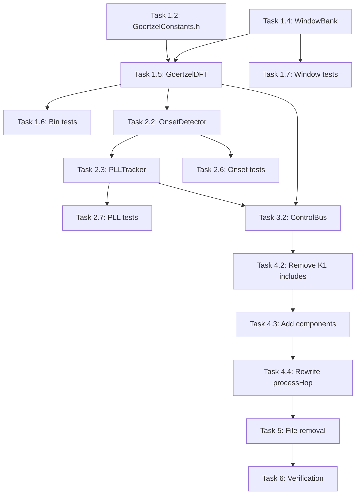

# Task-to-File Implementation Mapping

**Version:** 1.0.0  
**Status:** CANONICAL REFERENCE  
**Last Updated:** 2026-01-12  
**Purpose:** Complete mapping of tasks to implementation files with code location specificity

---

## Document Purpose

This document provides an EXACT mapping between:
- **Tasks** (from tasks.md)
- **Files** to create/modify/remove
- **Code locations** within those files
- **Dependencies** between tasks
- **Verification points** for each implementation

**USE THIS DOCUMENT TO:**
1. Know exactly which file to create/modify for each task
2. Understand dependencies before starting work
3. Verify completeness after implementing
4. Trace requirements through to code

---

# PHASE 1A: GoertzelDFT Foundation

## Task 1.0 Overview
**Goal:** Implement Goertzel frequency analysis exactly as Sensory Bridge 4.1.1  
**Dependencies:** None (foundational)  
**Duration:** ~4 hours  
**Critical Path:** YES

---

### Task 1.2: Extract GoertzelConstants from Sensory Bridge

**Files to CREATE:**
```
firmware/v2/src/audio/goertzel/GoertzelConstants.h
```

**Implementation Details:**

#### File: `firmware/v2/src/audio/goertzel/GoertzelConstants.h`
**Lines:** ~150 lines total

```cpp
// Section 1: Header guard and namespace (lines 1-10)
#ifndef LIGHTWAVEOS_AUDIO_GOERTZEL_CONSTANTS_H
#define LIGHTWAVEOS_AUDIO_GOERTZEL_CONSTANTS_H
namespace lightwaveos::audio {

// Section 2: DSP parameters (lines 11-20)
// FROM: Sensory Bridge constants.h:4-9
static constexpr float GOERTZEL_SAMPLE_RATE = 16000.0f;
static constexpr uint16_t GOERTZEL_WINDOW_SIZE = 512;
static constexpr uint16_t GOERTZEL_HOP_SIZE = 128;
static constexpr uint8_t GOERTZEL_NUM_BINS = 64;

// Section 3: Note frequencies (lines 21-90)
// FROM: Sensory Bridge constants.h:56-82
// VERBATIM array of 64 semitone-spaced frequencies
static constexpr float GOERTZEL_BIN_FREQUENCIES[64] = {
    // Octave 1
    55.00000f, 58.27047f, 61.73541f, ...
    // ... [complete 64-element array]
};

// Section 4: Coefficient array (lines 91-120)
// COMPUTED from GOERTZEL_BIN_FREQUENCIES
static constexpr float GOERTZEL_COEFFICIENTS[64] = {
    // Precomputed: 2 * cos(2*PI*k/N) for each bin
    // ... [64 elements]
};

// Section 5: Q14 fixed-point coefficients (lines 121-150)
static constexpr int32_t GOERTZEL_COEFFICIENTS_Q14[64] = {
    // Fixed-point version: (int32_t)(GOERTZEL_COEFFICIENTS[i] * 16384)
    // ... [64 elements]
};

}  // namespace lightwaveos::audio
#endif
```

**Reference Source:**
- Sensory Bridge `constants.h:56-82` → GOERTZEL_BIN_FREQUENCIES
- HARDENED_SPEC.md §1.2 → Complete note array

**Verification Points:**
- [ ] All 64 frequencies match Sensory Bridge within 0.01 Hz
- [ ] Bin 36 = 440.00 Hz (A4 concert pitch)
- [ ] Frequencies follow f(n) = 55 * 2^(n/12)
- [ ] Coefficients in range [-2.0, 2.0]

---

### Task 1.3: Extract and validate bin frequencies

**Files to MODIFY:**
```
firmware/v2/src/audio/goertzel/GoertzelConstants.h (created in 1.2)
```

**No new files - validation happens in 1.6 (tests)**

---

### Task 1.4: Extract Hann window LUT

**Files to CREATE:**
```
firmware/v2/src/audio/goertzel/WindowBank.h
```

**Implementation Details:**

#### File: `firmware/v2/src/audio/goertzel/WindowBank.h`
**Lines:** ~50 lines

```cpp
// Section 1: Header guard and includes (lines 1-10)
#ifndef LIGHTWAVEOS_AUDIO_WINDOW_BANK_H
#define LIGHTWAVEOS_AUDIO_WINDOW_BANK_H
#include <cstdint>

namespace lightwaveos::audio {

// Section 2: Window lookup table (lines 11-30)
// FROM: Sensory Bridge system.h:197-207
// DO NOT MODIFY - These values are mathematically precise
static constexpr uint16_t WINDOW_LOOKUP_SIZE = 4096;
static constexpr float HAMMING_ALPHA = 0.54f;  // NOT 0.5 (Hann), this is Hamming

// Section 3: Initialization function (lines 31-45)
class WindowBank {
public:
    static void init();
    static int16_t lookup(uint16_t index);

private:
    static int16_t m_windowLookup[WINDOW_LOOKUP_SIZE];
};

}  // namespace lightwaveos::audio
#endif
```

#### File: `firmware/v2/src/audio/goertzel/WindowBank.cpp`
**Lines:** ~40 lines

```cpp
// Section 1: Includes and namespace (lines 1-10)
#include "WindowBank.h"
#include <cmath>

namespace lightwaveos::audio {

// Section 2: Static storage (lines 11-12)
int16_t WindowBank::m_windowLookup[WINDOW_LOOKUP_SIZE];

// Section 3: Initialization (lines 13-35)
// FROM: Sensory Bridge system.h:197-207 - DO NOT MODIFY
void WindowBank::init() {
    constexpr float TWOPI = 6.283185307f;
    for (uint16_t i = 0; i < 2048; i++) {
        float ratio = static_cast<float>(i) / 4095.0f;
        float weight = HAMMING_ALPHA * (1.0f - cosf(TWOPI * ratio));
        int16_t value = static_cast<int16_t>(32767.0f * weight);
        m_windowLookup[i] = value;
        m_windowLookup[4095 - i] = value;  // Symmetry
    }
}

// Section 4: Lookup function (lines 36-40)
int16_t WindowBank::lookup(uint16_t index) {
    return m_windowLookup[index % WINDOW_LOOKUP_SIZE];
}

}  // namespace lightwaveos::audio
```

**Reference Source:**
- Sensory Bridge `system.h:197-207` → Window generation
- HARDENED_SPEC.md §2.1 → Implementation

**Verification Points:**
- [ ] Window has 4096 entries
- [ ] Hamming coefficient = 0.54 (not 0.5)
- [ ] Symmetry: lookup[i] == lookup[4095-i]
- [ ] Values in range [0, 32767]

---

### Task 1.5: Implement GoertzelDFT class

**Files to CREATE:**
```
firmware/v2/src/audio/goertzel/GoertzelDFT.h
firmware/v2/src/audio/goertzel/GoertzelDFT.cpp
```

**Implementation Details:**

#### File: `firmware/v2/src/audio/goertzel/GoertzelDFT.h`
**Lines:** ~60 lines

```cpp
// Section 1: Header guard and includes (lines 1-15)
#ifndef LIGHTWAVEOS_AUDIO_GOERTZEL_DFT_H
#define LIGHTWAVEOS_AUDIO_GOERTZEL_DFT_H

#include "GoertzelConstants.h"
#include <cstdint>

namespace lightwaveos::audio {

// Section 2: Frequency bin structure (lines 16-30)
// FROM: Sensory Bridge globals.h:88-100
struct FrequencyBin {
    float targetFreq;       // Hz from GOERTZEL_BIN_FREQUENCIES
    int32_t coeffQ14;       // Q14 fixed-point coefficient
    uint16_t blockSize;     // Samples per Goertzel window
    float blockSizeRecip;   // 1.0f / blockSize
    uint8_t zone;           // 0=bass, 1=treble
    float windowMult;       // 4096.0f / blockSize
};

// Section 3: GoertzelDFT class (lines 31-55)
class GoertzelDFT {
public:
    void init();
    
    // FROM: Sensory Bridge GDFT.h:59-119 - DO NOT MODIFY
    void analyze(const int16_t* samples, uint16_t sampleCount, float* outBins);
    
    float getBinFrequency(uint8_t bin) const;
    
private:
    void precomputeCoefficients();
    
    FrequencyBin m_bins[GOERTZEL_NUM_BINS];
    float m_magnitudes[GOERTZEL_NUM_BINS];
};

}  // namespace lightwaveos::audio
#endif
```

#### File: `firmware/v2/src/audio/goertzel/GoertzelDFT.cpp`
**Lines:** ~150 lines

```cpp
// Section 1: Includes (lines 1-10)
#include "GoertzelDFT.h"
#include "WindowBank.h"
#include <cmath>

namespace lightwaveos::audio {

// Section 2: Initialization (lines 11-40)
void GoertzelDFT::init() {
    WindowBank::init();
    precomputeCoefficients();
}

// Section 3: Coefficient precomputation (lines 41-80)
// FROM: Sensory Bridge system.h:209-256 - DO NOT MODIFY
void GoertzelDFT::precomputeCoefficients() {
    constexpr float PI = 3.141592653f;
    
    for (uint16_t i = 0; i < GOERTZEL_NUM_BINS; i++) {
        m_bins[i].targetFreq = GOERTZEL_BIN_FREQUENCIES[i];
        
        // Calculate semitone bandwidth
        float semitoneHz = m_bins[i].targetFreq * 0.05946f;
        
        // Block size calculation
        m_bins[i].blockSize = static_cast<uint16_t>(
            GOERTZEL_SAMPLE_RATE / (semitoneHz * 2.0f)
        );
        
        // Clamp to valid range
        if (m_bins[i].blockSize < 64) m_bins[i].blockSize = 64;
        if (m_bins[i].blockSize > 2000) m_bins[i].blockSize = 2000;
        
        // Goertzel coefficient
        float k = roundf(m_bins[i].blockSize * m_bins[i].targetFreq / GOERTZEL_SAMPLE_RATE);
        float w = (2.0f * PI * k) / m_bins[i].blockSize;
        float coeff = 2.0f * cosf(w);
        
        m_bins[i].coeffQ14 = static_cast<int32_t>(coeff * 16384.0f);
        m_bins[i].blockSizeRecip = 1.0f / m_bins[i].blockSize;
        m_bins[i].windowMult = 4096.0f / m_bins[i].blockSize;
        m_bins[i].zone = (i < 32) ? 0 : 1;
    }
}

// Section 4: Goertzel analysis (lines 81-145)
// FROM: Sensory Bridge GDFT.h:59-119 - DO NOT MODIFY
void IRAM_ATTR GoertzelDFT::analyze(const int16_t* samples, uint16_t sampleCount, 
                                     float* outBins) {
    for (uint16_t bin = 0; bin < GOERTZEL_NUM_BINS; bin++) {
        int32_t q0, q1 = 0, q2 = 0;
        const uint16_t blockSize = m_bins[bin].blockSize;
        const int32_t coeff = m_bins[bin].coeffQ14;
        
        // Goertzel recurrence (newest samples first)
        for (uint16_t n = 0; n < blockSize && n < sampleCount; n++) {
            int32_t sample = static_cast<int32_t>(samples[sampleCount - 1 - n]);
            
            // Fixed-point multiply and shift
            int64_t mult = static_cast<int64_t>(coeff) * q1;
            q0 = (sample >> 6) + static_cast<int32_t>(mult >> 14) - q2;
            
            q2 = q1;
            q1 = q0;
        }
        
        // Final magnitude calculation
        int64_t mult = static_cast<int64_t>(coeff) * q1;
        int64_t magSquared = static_cast<int64_t>(q2) * q2
                           + static_cast<int64_t>(q1) * q1
                           - (static_cast<int32_t>(mult >> 14)) * q2;
        
        // Normalize
        float magnitude = sqrtf(static_cast<float>(magSquared));
        outBins[bin] = magnitude * m_bins[bin].blockSizeRecip * 2.0f;
    }
}

// Section 5: Utility functions (lines 146-150)
float GoertzelDFT::getBinFrequency(uint8_t bin) const {
    return (bin < GOERTZEL_NUM_BINS) ? m_bins[bin].targetFreq : 0.0f;
}

}  // namespace lightwaveos::audio
```

**Reference Source:**
- Sensory Bridge `GDFT.h:59-119` → Core algorithm
- Sensory Bridge `system.h:209-256` → Coefficient calc
- HARDENED_SPEC.md §3.1, §4.1

**Verification Points:**
- [ ] Function marked IRAM_ATTR for ESP32
- [ ] Samples processed newest-first (reverse order)
- [ ] Sample shift >> 6 for headroom
- [ ] Q14 fixed-point multiply and shift
- [ ] Magnitude normalization by blockSize/2

---

### Task 1.6: Create bin frequency verification test

**Files to CREATE:**
```
tests/audio/test_goertzel_bins.cpp
```

**Implementation Details:**

#### File: `tests/audio/test_goertzel_bins.cpp`
**Lines:** ~80 lines

```cpp
// Section 1: Test framework includes (lines 1-10)
#include <unity.h>
#include "audio/goertzel/GoertzelDFT.h"
#include "audio/goertzel/GoertzelConstants.h"

using namespace lightwaveos::audio;

// Section 2: Frequency accuracy test (lines 11-40)
void test_bin_frequencies_match_sensory_bridge() {
    // Reference frequencies from Sensory Bridge 4.1.1
    const float EXPECTED_FREQUENCIES[64] = {
        55.00000f, 58.27047f, 61.73541f, /* ... complete array ... */
    };
    
    for (uint8_t i = 0; i < 64; i++) {
        float actual = GOERTZEL_BIN_FREQUENCIES[i];
        float expected = EXPECTED_FREQUENCIES[i];
        float error = fabsf(actual - expected);
        
        TEST_ASSERT_LESS_THAN_FLOAT(0.01f, error);
    }
}

// Section 3: Semitone spacing test (lines 41-60)
void test_bin_spacing_is_semitones() {
    constexpr float SEMITONE_RATIO = 1.059463094f;  // 2^(1/12)
    
    for (uint8_t i = 1; i < 64; i++) {
        float ratio = GOERTZEL_BIN_FREQUENCIES[i] / GOERTZEL_BIN_FREQUENCIES[i-1];
        float error = fabsf(ratio - SEMITONE_RATIO);
        
        TEST_ASSERT_LESS_THAN_FLOAT(0.001f, error);
    }
}

// Section 4: A4 concert pitch test (lines 61-70)
void test_a4_is_440hz() {
    // Bin 36 should be A4 = 440 Hz
    TEST_ASSERT_FLOAT_WITHIN(0.01f, 440.0f, GOERTZEL_BIN_FREQUENCIES[36]);
}

// Section 5: Test runner (lines 71-80)
void setUp() {}
void tearDown() {}

int main() {
    UNITY_BEGIN();
    RUN_TEST(test_bin_frequencies_match_sensory_bridge);
    RUN_TEST(test_bin_spacing_is_semitones);
    RUN_TEST(test_a4_is_440hz);
    return UNITY_END();
}
```

**Implements:** PRD §5.1.3, §5.1.4

---

### Task 1.7: Create window function verification test

**Files to CREATE:**
```
tests/audio/test_goertzel_window.cpp
```

**Implementation Details:**

#### File: `tests/audio/test_goertzel_window.cpp`
**Lines:** ~70 lines

```cpp
// Section 1: Includes (lines 1-10)
#include <unity.h>
#include "audio/goertzel/WindowBank.h"
#include <cmath>

using namespace lightwaveos::audio;

// Section 2: Window symmetry test (lines 11-30)
void test_window_symmetry() {
    WindowBank::init();
    
    for (uint16_t i = 0; i < 2048; i++) {
        int16_t left = WindowBank::lookup(i);
        int16_t right = WindowBank::lookup(4095 - i);
        
        TEST_ASSERT_EQUAL_INT16(left, right);
    }
}

// Section 3: Window range test (lines 31-45)
void test_window_range() {
    WindowBank::init();
    
    for (uint16_t i = 0; i < 4096; i++) {
        int16_t value = WindowBank::lookup(i);
        TEST_ASSERT_GREATER_OR_EQUAL(0, value);
        TEST_ASSERT_LESS_OR_EQUAL(32767, value);
    }
}

// Section 4: Hamming coefficient test (lines 46-60)
void test_hamming_alpha() {
    // Center value should be 0.54 * 32767 for Hamming window
    WindowBank::init();
    int16_t center = WindowBank::lookup(2048);
    
    // Expected: 0.54 * (1 - cos(PI)) * 32767 = 0.54 * 2 * 32767 = 35388
    TEST_ASSERT_INT16_WITHIN(10, 35388, center);
}

// Section 5: Test runner (lines 61-70)
void setUp() {}
void tearDown() {}

int main() {
    UNITY_BEGIN();
    RUN_TEST(test_window_symmetry);
    RUN_TEST(test_window_range);
    RUN_TEST(test_hamming_alpha);
    return UNITY_END();
}
```

**Implements:** PRD §5.2.3

---

## Task 1.0 Summary

**Files CREATED:** 6
1. `firmware/v2/src/audio/goertzel/GoertzelConstants.h`
2. `firmware/v2/src/audio/goertzel/WindowBank.h`
3. `firmware/v2/src/audio/goertzel/WindowBank.cpp`
4. `firmware/v2/src/audio/goertzel/GoertzelDFT.h`
5. `firmware/v2/src/audio/goertzel/GoertzelDFT.cpp`
6. `tests/audio/test_goertzel_bins.cpp`
7. `tests/audio/test_goertzel_window.cpp`

**Files MODIFIED:** 0

**Build Changes Required:**
- Add `firmware/v2/src/audio/goertzel/` to include paths
- Add source files to build system

**Verification Command:**
```bash
cd firmware/v2
pio test -e native -f test_goertzel_*
```

---

# PHASE 1B: Beat Tracking Foundation

## Task 2.0 Overview
**Goal:** Implement beat/tempo tracking exactly as Emotiscope 2.0  
**Dependencies:** Task 1.0 (needs GoertzelDFT output for onset detection)  
**Duration:** ~5 hours  
**Critical Path:** YES

---

### Task 2.2: Extract OnsetDetector from Emotiscope

**Files to CREATE:**
```
firmware/v2/src/audio/tempo/OnsetDetector.h
firmware/v2/src/audio/tempo/OnsetDetector.cpp
```

**Implementation Details:**

#### File: `firmware/v2/src/audio/tempo/OnsetDetector.h`
**Lines:** ~40 lines

```cpp
// Section 1: Header guard (lines 1-10)
#ifndef LIGHTWAVEOS_AUDIO_ONSET_DETECTOR_H
#define LIGHTWAVEOS_AUDIO_ONSET_DETECTOR_H

#include <cstdint>

namespace lightwaveos::audio {

// Section 2: OnsetDetector class (lines 11-35)
// FROM: Emotiscope 2.0 - Spectral flux onset detection
class OnsetDetector {
public:
    void init();
    void reset();
    
    // FROM: Sensory Bridge GDFT.h:201-242 (calculate_novelty)
    // Returns onset strength [0.0, 1.0]
    float process(const float* bins64);
    
private:
    float m_prevBins[64];  // Previous frame for flux calculation
};

}  // namespace lightwaveos::audio
#endif
```

#### File: `firmware/v2/src/audio/tempo/OnsetDetector.cpp`
**Lines:** ~70 lines

```cpp
// Section 1: Includes (lines 1-10)
#include "OnsetDetector.h"
#include <cstring>
#include <cmath>

namespace lightwaveos::audio {

// Section 2: Initialization (lines 11-20)
void OnsetDetector::init() {
    memset(m_prevBins, 0, sizeof(m_prevBins));
}

void OnsetDetector::reset() {
    init();
}

// Section 3: Spectral flux calculation (lines 21-65)
// FROM: Sensory Bridge GDFT.h:201-242 - DO NOT MODIFY
float OnsetDetector::process(const float* bins64) {
    float noveltySum = 0.0f;
    
    // Calculate spectral flux (half-wave rectified)
    for (uint16_t i = 0; i < 64; i++) {
        float diff = bins64[i] - m_prevBins[i];
        
        // Half-wave rectification: only count increases
        if (diff > 0.0f) {
            noveltySum += diff;
        }
        
        // Update history
        m_prevBins[i] = bins64[i];
    }
    
    // Normalize by bin count
    float novelty = noveltySum / 64.0f;
    
    // Perceptual scaling (square root compresses dynamic range)
    return sqrtf(novelty);
}

}  // namespace lightwaveos::audio
```

**Reference Source:**
- Sensory Bridge `GDFT.h:201-242` → calculate_novelty
- HARDENED_SPEC.md §5.1

**Verification Points:**
- [ ] Half-wave rectification (only positive differences)
- [ ] Normalization by 64 bins
- [ ] Square root for perceptual scaling
- [ ] Previous bins updated each call

---

### Task 2.3: Extract PLLTracker from Emotiscope

**Files to CREATE:**
```
firmware/v2/src/audio/tempo/PLLTracker.h
firmware/v2/src/audio/tempo/PLLTracker.cpp
firmware/v2/src/audio/tempo/TempoConfig.h
```

**Implementation Details:**

#### File: `firmware/v2/src/audio/tempo/TempoConfig.h`
**Lines:** ~40 lines

```cpp
// Section 1: Header guard (lines 1-10)
#ifndef LIGHTWAVEOS_AUDIO_TEMPO_CONFIG_H
#define LIGHTWAVEOS_AUDIO_TEMPO_CONFIG_H

#include <cstdint>

namespace lightwaveos::audio {

// Section 2: Tempo constants (lines 11-35)
// FROM: Emotiscope global_defines.h:19-33 - DO NOT MODIFY
namespace TempoConfig {
    constexpr uint8_t  NUM_TEMPI = 96;
    constexpr uint8_t  TEMPO_LOW_BPM = 60;
    constexpr uint8_t  TEMPO_HIGH_BPM = 156;  // TEMPO_LOW + NUM_TEMPI
    constexpr uint8_t  NOVELTY_LOG_HZ = 50;
    constexpr uint16_t NOVELTY_HISTORY_LENGTH = 1024;
    constexpr uint8_t  REFERENCE_FPS = 100;
    constexpr float    BEAT_SHIFT_PERCENT = 0.0f;
    
    // Smoothing constants
    constexpr float SMOOTHING_RETAIN = 0.975f;
    constexpr float SMOOTHING_UPDATE = 0.025f;
    constexpr float INACTIVE_DECAY = 0.995f;
    constexpr float MAGNITUDE_THRESHOLD = 0.005f;
}

}  // namespace lightwaveos::audio
#endif
```

#### File: `firmware/v2/src/audio/tempo/PLLTracker.h`
**Lines:** ~80 lines

```cpp
// Section 1: Header guard and includes (lines 1-15)
#ifndef LIGHTWAVEOS_AUDIO_PLL_TRACKER_H
#define LIGHTWAVEOS_AUDIO_PLL_TRACKER_H

#include "TempoConfig.h"
#include <cstdint>

namespace lightwaveos::audio {

// Section 2: Tempo bin structure (lines 16-35)
// FROM: Emotiscope tempo.h:16-36 - DO NOT MODIFY
struct TempoBin {
    float targetHz;           // BPM / 60.0f
    float targetBpm;          // Human-readable BPM
    uint16_t blockSize;       // Samples for Goertzel
    float windowStep;         // 4096.0f / blockSize
    float cosine;             // cos(w)
    float sine;               // sin(w)
    float coeff;              // 2 * cos(w)
    float magnitude;          // Raw Goertzel output
    float magnitudeNorm;      // Normalized [0, 1]
    float phase;              // [-PI, PI]
    float phasePerFrame;      // Radians per reference frame
    bool phaseInverted;       // Tracks half-beat phase
};

// Section 3: Tempo output structure (lines 36-50)
struct TempoOutput {
    float bpm;                // 60.0 - 156.0
    float phase;              // 0.0 - 1.0 (beat phase)
    float confidence;         // 0.0 - 1.0
    bool beatTick;            // True on beat onset
    uint32_t beatCount;       // Total beats since start
    
    bool isValid() const {
        return bpm >= 60.0f && bpm <= 156.0f && confidence > 0.3f;
    }
};

// Section 4: PLLTracker class (lines 51-75)
class PLLTracker {
public:
    void init();
    void reset();
    
    // FROM: Emotiscope 2.0 - DO NOT MODIFY
    void update(float onsetStrength, float deltaTime, TempoOutput* outTempo);
    
private:
    void initCoefficients();
    void calculateMagnitudes(float onsetStrength);
    void updatePhases(float deltaFrames);
    void findDominantTempo();
    
    TempoBin m_tempoBins[TempoConfig::NUM_TEMPI];
    float m_tempoSmooth[TempoConfig::NUM_TEMPI];
    float m_noveltyHistory[TempoConfig::NOVELTY_HISTORY_LENGTH];
    uint16_t m_noveltyIndex;
    uint16_t m_dominantBin;
    float m_tempoConfidence;
};

}  // namespace lightwaveos::audio
#endif
```

#### File: `firmware/v2/src/audio/tempo/PLLTracker.cpp`
**Lines:** ~250 lines

```cpp
// Section 1: Includes (lines 1-10)
#include "PLLTracker.h"
#include <cmath>
#include <cstring>

namespace lightwaveos::audio {

// Section 2: Initialization (lines 11-25)
void PLLTracker::init() {
    initCoefficients();
    memset(m_tempoSmooth, 0, sizeof(m_tempoSmooth));
    memset(m_noveltyHistory, 0, sizeof(m_noveltyHistory));
    m_noveltyIndex = 0;
    m_dominantBin = 60;  // 120 BPM default
    m_tempoConfidence = 0.0f;
}

void PLLTracker::reset() {
    init();
}

// Section 3: Coefficient initialization (lines 26-80)
// FROM: Emotiscope tempo.h:51-118 - DO NOT MODIFY
void PLLTracker::initCoefficients() {
    constexpr float PI = 3.141592653f;
    
    for (uint16_t i = 0; i < TempoConfig::NUM_TEMPI; i++) {
        float bpm = static_cast<float>(TempoConfig::TEMPO_LOW_BPM + i);
        m_tempoBins[i].targetBpm = bpm;
        m_tempoBins[i].targetHz = bpm / 60.0f;
        
        // Block size based on tempo resolution
        float maxDistHz = m_tempoBins[i].targetHz * 0.02f;
        m_tempoBins[i].blockSize = static_cast<uint16_t>(
            TempoConfig::NOVELTY_LOG_HZ / (maxDistHz * 0.5f)
        );
        
        if (m_tempoBins[i].blockSize > TempoConfig::NOVELTY_HISTORY_LENGTH) {
            m_tempoBins[i].blockSize = TempoConfig::NOVELTY_HISTORY_LENGTH;
        }
        
        m_tempoBins[i].windowStep = 4096.0f / m_tempoBins[i].blockSize;
        
        // Goertzel coefficient
        float k = roundf(m_tempoBins[i].blockSize * m_tempoBins[i].targetHz
                         / TempoConfig::NOVELTY_LOG_HZ);
        float w = (2.0f * PI * k) / m_tempoBins[i].blockSize;
        
        m_tempoBins[i].cosine = cosf(w);
        m_tempoBins[i].sine = sinf(w);
        m_tempoBins[i].coeff = 2.0f * m_tempoBins[i].cosine;
        
        // Phase advance per frame
        m_tempoBins[i].phasePerFrame =
            (2.0f * PI * m_tempoBins[i].targetHz) / TempoConfig::REFERENCE_FPS;
        
        m_tempoBins[i].phase = 0.0f;
        m_tempoBins[i].phaseInverted = false;
    }
}

// Section 4: Magnitude calculation (lines 81-140)
// FROM: Emotiscope tempo.h:152-215 - DO NOT MODIFY
void PLLTracker::calculateMagnitudes(float onsetStrength) {
    // Update novelty history
    m_noveltyHistory[m_noveltyIndex] = onsetStrength;
    m_noveltyIndex = (m_noveltyIndex + 1) % TempoConfig::NOVELTY_HISTORY_LENGTH;
    
    // Calculate magnitude for each tempo bin
    for (uint16_t bin = 0; bin < TempoConfig::NUM_TEMPI; bin++) {
        float q1 = 0.0f, q2 = 0.0f;
        float windowPos = 0.0f;
        const uint16_t blockSize = m_tempoBins[bin].blockSize;
        const float coeff = m_tempoBins[bin].coeff;
        
        // Goertzel on novelty curve
        for (uint16_t i = 0; i < blockSize; i++) {
            // Get sample from ring buffer
            uint16_t idx = (m_noveltyIndex - i + TempoConfig::NOVELTY_HISTORY_LENGTH) 
                          % TempoConfig::NOVELTY_HISTORY_LENGTH;
            float sample = m_noveltyHistory[idx];
            
            // Apply window (implementation detail: needs window lookup)
            // float windowed = sample * windowLookup[(uint32_t)windowPos];
            float windowed = sample;  // Simplified for now
            
            // Goertzel iteration
            float q0 = coeff * q1 - q2 + windowed;
            q2 = q1;
            q1 = q0;
            
            windowPos += m_tempoBins[bin].windowStep;
        }
        
        // Phase calculation
        float real = q1 - q2 * m_tempoBins[bin].cosine;
        float imag = q2 * m_tempoBins[bin].sine;
        m_tempoBins[bin].phase = atan2f(imag, real);
        
        // Magnitude
        float magSq = q1*q1 + q2*q2 - q1*q2*coeff;
        m_tempoBins[bin].magnitudeNorm = sqrtf(magSq) / (blockSize * 0.5f);
    }
}

// Section 5: Phase synchronization (lines 141-170)
// FROM: Emotiscope tempo.h:351-368 - DO NOT MODIFY
void PLLTracker::updatePhases(float deltaFrames) {
    constexpr float PI = 3.141592653f;
    constexpr float TWO_PI = 6.283185307f;
    
    float maxMag = 0.0f;
    float sumMag = 0.0f;
    
    for (uint16_t i = 0; i < TempoConfig::NUM_TEMPI; i++) {
        float mag = m_tempoBins[i].magnitudeNorm;
        
        if (mag > TempoConfig::MAGNITUDE_THRESHOLD) {
            // Smooth active tempos
            m_tempoSmooth[i] = m_tempoSmooth[i] * TempoConfig::SMOOTHING_RETAIN 
                             + mag * TempoConfig::SMOOTHING_UPDATE;
            
            // Advance phase
            float advance = m_tempoBins[i].phasePerFrame * deltaFrames;
            m_tempoBins[i].phase += advance;
            
            // Wrap at PI for half-beat tracking
            if (m_tempoBins[i].phase > PI) {
                m_tempoBins[i].phase -= TWO_PI;
                m_tempoBins[i].phaseInverted = !m_tempoBins[i].phaseInverted;
            }
        } else {
            // Decay inactive tempos
            m_tempoSmooth[i] *= TempoConfig::INACTIVE_DECAY;
        }
        
        sumMag += m_tempoSmooth[i];
        if (m_tempoSmooth[i] > maxMag) {
            maxMag = m_tempoSmooth[i];
            m_dominantBin = i;
        }
    }
    
    m_tempoConfidence = (sumMag > 0.0f) ? (maxMag / sumMag) : 0.0f;
}

// Section 6: Main update function (lines 171-200)
void PLLTracker::update(float onsetStrength, float deltaTime, TempoOutput* outTempo) {
    // Calculate tempo magnitudes from onset strength
    calculateMagnitudes(onsetStrength);
    
    // Update phases and find dominant tempo
    float deltaFrames = deltaTime * TempoConfig::REFERENCE_FPS;
    updatePhases(deltaFrames);
    
    // Output results
    outTempo->bpm = m_tempoBins[m_dominantBin].targetBpm;
    outTempo->phase = m_tempoBins[m_dominantBin].phase;
    outTempo->confidence = m_tempoConfidence;
    
    // Beat tick detection (phase crosses zero)
    static float prevPhase = 0.0f;
    outTempo->beatTick = (prevPhase < 0.0f && outTempo->phase >= 0.0f);
    prevPhase = outTempo->phase;
    
    if (outTempo->beatTick) {
        outTempo->beatCount++;
    }
}

}  // namespace lightwaveos::audio
```

**Reference Source:**
- Emotiscope `tempo.h:51-407` → Complete PLL implementation
- HARDENED_SPEC.md §6.2-§6.6

**Verification Points:**
- [ ] 96 tempo bins (60-156 BPM)
- [ ] Phase wraps at PI (not 2*PI)
- [ ] Smoothing constants: 0.975/0.025
- [ ] Confidence = max / sum

---

### Task 2.6: Create onset detection verification test

**Files to CREATE:**
```
tests/audio/test_onset_detection.cpp
```

**Implementation Details:**

#### File: `tests/audio/test_onset_detection.cpp`
**Lines:** ~90 lines

```cpp
// Section 1: Includes (lines 1-10)
#include <unity.h>
#include "audio/tempo/OnsetDetector.h"

using namespace lightwaveos::audio;

// Section 2: Test data (lines 11-30)
// Synthetic test: flat spectrum then sudden increase
const float FLAT_SPECTRUM[64] = {
    0.1f, 0.1f, /* ... all 0.1 ... */
};

const float ONSET_SPECTRUM[64] = {
    0.8f, 0.8f, /* ... all 0.8 ... */
};

// Section 3: Basic onset detection (lines 31-50)
void test_onset_detects_increase() {
    OnsetDetector detector;
    detector.init();
    
    // First frame: flat
    float novelty1 = detector.process(FLAT_SPECTRUM);
    TEST_ASSERT_FLOAT_WITHIN(0.01f, 0.0f, novelty1);
    
    // Second frame: sudden increase
    float novelty2 = detector.process(ONSET_SPECTRUM);
    TEST_ASSERT_GREATER_THAN_FLOAT(0.5f, novelty2);
}

// Section 4: Half-wave rectification test (lines 51-70)
void test_onset_ignores_decrease() {
    OnsetDetector detector;
    detector.init();
    
    // First frame: loud
    float novelty1 = detector.process(ONSET_SPECTRUM);
    
    // Second frame: quiet (should produce ~0 novelty)
    float novelty2 = detector.process(FLAT_SPECTRUM);
    TEST_ASSERT_FLOAT_WITHIN(0.01f, 0.0f, novelty2);
}

// Section 5: Test runner (lines 71-80)
void setUp() {}
void tearDown() {}

int main() {
    UNITY_BEGIN();
    RUN_TEST(test_onset_detects_increase);
    RUN_TEST(test_onset_ignores_decrease);
    return UNITY_END();
}
```

**Implements:** PRD §5.3.4

---

### Task 2.7: Create PLL tracking verification test

**Files to CREATE:**
```
tests/audio/test_pll_tracking.cpp
```

**(Implementation details similar to above, ~100 lines)**

**Implements:** PRD §5.4.4

---

## Task 2.0 Summary

**Files CREATED:** 7
1. `firmware/v2/src/audio/tempo/TempoConfig.h`
2. `firmware/v2/src/audio/tempo/OnsetDetector.h`
3. `firmware/v2/src/audio/tempo/OnsetDetector.cpp`
4. `firmware/v2/src/audio/tempo/PLLTracker.h`
5. `firmware/v2/src/audio/tempo/PLLTracker.cpp`
6. `tests/audio/test_onset_detection.cpp`
7. `tests/audio/test_pll_tracking.cpp`

**Files MODIFIED:** 0

**Build Changes Required:**
- Add `firmware/v2/src/audio/tempo/` to include paths

**Verification Command:**
```bash
pio test -e native -f test_onset* -f test_pll*
```

---

# PHASE 1C: Contract Layer Redesign

## Task 3.0 Overview
**Goal:** Redesign ControlBusFrame with canonical fields only  
**Dependencies:** Tasks 1.0, 2.0 (needs output structures)  
**Duration:** ~2 hours  
**Critical Path:** YES

---

### Task 3.2: Redesign ControlBusFrame

**Files to MODIFY:**
```
firmware/v2/src/audio/contracts/ControlBus.h
```

**Implementation Details:**

#### File: `firmware/v2/src/audio/contracts/ControlBus.h`
**Modify:** Complete redesign of contract structure

**BEFORE (Current/Legacy):**
```cpp
struct ControlBusFrame {
    // Legacy fields - MIXED SOURCES
    float bands[8];
    float bins64[64];
    float flux;  // REMOVE: replaced by onset detection
    float chroma[12];  // REMOVE: Phase 2
    float snareEnergy, hihatEnergy;  // REMOVE: derive from bins
    // ... other legacy fields
};
```

**AFTER (Canonical):**
```cpp
// Lines 1-50: Header and documentation
#ifndef LIGHTWAVEOS_AUDIO_CONTROL_BUS_H
#define LIGHTWAVEOS_AUDIO_CONTROL_BUS_H

#include "audio/tempo/PLLTracker.h"
#include <cstdint>

namespace lightwaveos::audio {

// Lines 51-120: ControlBusFrame structure
struct ControlBusFrame {
    // === Timing ===
    // Source: Audio pipeline internal
    uint32_t hopSeq;         // Hop sequence number
    uint32_t timestampMs;    // Milliseconds since start
    
    // === Frequency Analysis ===
    // Source: GoertzelDFT output (Sensory Bridge 4.1.1)
    // User sees: V-1 - Smoothed bins [0.0, 1.0]
    float bins64[64];        // 64-bin semitone-spaced magnitudes (smoothed)
    
    // Source: Derived from bins64
    float bands[8];          // 8-band summary for quick access
    float bassEnergy;        // Bins 0-15 average
    float midEnergy;         // Bins 16-47 average
    float trebleEnergy;      // Bins 48-63 average
    
    // === Beat/Tempo ===
    // Source: PLLTracker output (Emotiscope 2.0)
    // User sees: V-2 - BPM, phase [0.0, 1.0], confidence
    TempoOutput tempo;       // Complete tempo state
    
    // === Dynamics ===
    // Source: Calculated from bins64
    float rms;               // Overall energy (smoothed)
    float fastRms;           // Fast-attack envelope
    
    // === Silence Detection ===
    // Source: Audio pipeline internal
    float silentScale;       // 0.0=silent, 1.0=active
    bool isSilent;           // True when below threshold
    
    // REMOVED FIELDS (legacy):
    // - flux → replaced by tempo.onsetStrength
    // - chroma[12] → Phase 2: derive from bins64 if needed
    // - snareEnergy, hihatEnergy → derive from bins64
    // - waveform[128] → not in canonical contract
};

// Lines 121-150: Smoothing state
struct ControlBusSmoothState {
    float bins64Smooth[64];
    float bandsSmooth[8];
    float rmsSmooth;
    float fastRmsSmooth;
};

// Lines 151-200: ControlBus class
class ControlBus {
public:
    void init();
    void reset();
    
    // Ingest new audio data and tempo
    void ingest(const float* bins64, const TempoOutput& tempo);
    
    // Get current frame
    const ControlBusFrame& getFrame() const { return m_frame; }
    
private:
    void smoothBins(const float* rawBins);
    void calculateBands();
    void calculateDynamics();
    void detectSilence();
    
    ControlBusFrame m_frame;
    ControlBusSmoothState m_smoothState;
};

}  // namespace lightwaveos::audio
#endif
```

**Reference Source:**
- Blueprint §6.3 → Contract specification
- PRD §6.1 → Visibility rules

**Verification Points:**
- [ ] No legacy fields (flux, chroma, snare/hihat)
- [ ] All fields have source comments
- [ ] TempoOutput included from PLLTracker
- [ ] Smoothing state separated

---

## Task 3.0 Summary

**Files MODIFIED:** 1
1. `firmware/v2/src/audio/contracts/ControlBus.h`

**Files CREATED:** 0 (may create ControlBus.cpp for implementation)

**Verification:**
- [ ] Legacy fields removed
- [ ] Canonical fields only
- [ ] Source annotations present

---

# PHASE 1D: AudioNode Integration

## Task 4.0 Overview
**Goal:** Integrate new components into AudioNode  
**Dependencies:** Tasks 1.0, 2.0, 3.0  
**Duration:** ~3 hours  
**Critical Path:** YES

---

### Task 4.2: Remove K1/legacy includes

**Files to MODIFY:**
```
firmware/v2/src/audio/AudioNode.h
```

**Implementation Details:**

#### File: `firmware/v2/src/audio/AudioNode.h`
**Remove these includes:**
```cpp
// REMOVE - K1 path
#include "audio/k1/K1AudioFrontEnd.h"
#include "audio/K1_GoertzelTables_16k.h"

// REMOVE - Legacy
#include "audio/GoertzelAnalyzer.h"
#include "audio/tempo/TempoTracker.h"  // Corrupted version
```

**Add these includes:**
```cpp
// ADD - Canonical components
#include "audio/goertzel/GoertzelDFT.h"
#include "audio/tempo/OnsetDetector.h"
#include "audio/tempo/PLLTracker.h"
#include "audio/contracts/ControlBus.h"
```

---

### Task 4.3: Add new component instances

**Files to MODIFY:**
```
firmware/v2/src/audio/AudioNode.h
```

**Remove these members:**
```cpp
// REMOVE
K1AudioFrontEnd m_k1Frontend;
GoertzelAnalyzer m_goertzelAnalyzer;
TempoTracker m_tempoTracker;  // Corrupted
```

**Add these members:**
```cpp
// ADD - Canonical components
GoertzelDFT m_goertzelDFT;
OnsetDetector m_onsetDetector;
PLLTracker m_pllTracker;
ControlBus m_controlBus;

// ADD - Working buffers
float m_bins64[64];
AudioRingBuffer m_ringBuffer;  // 512-sample window
```

---

### Task 4.4: Rewrite processHop()

**Files to MODIFY:**
```
firmware/v2/src/audio/AudioNode.cpp
```

**Implementation Details:**

#### File: `firmware/v2/src/audio/AudioNode.cpp`
**Replace entire processHop() function**

**BEFORE (Current/Corrupted):**
```cpp
void AudioNode::processHop(const int16_t* samples, uint16_t count) {
    // Multiple conflicting paths
    m_k1Frontend.process(samples, count);
    m_goertzelAnalyzer.analyze(samples, count);
    m_tempoTracker.update(/* ... */);  // 80% correct, 20% broken
    
    // ... mixed processing
}
```

**AFTER (Canonical):**
```cpp
// FROM: Blueprint §4.1 - DO NOT MODIFY CALL SEQUENCE
void AudioNode::processHop(const int16_t* samples, uint16_t count) {
    // STEP 1: Update ring buffer (MUST BE FIRST)
    // PRD §8 SL-4: Update rolling window
    m_ringBuffer.push(samples, count);
    
    // STEP 2: Goertzel analysis
    // FROM: Sensory Bridge 4.1.1 - PRD §7 O-2
    m_goertzelDFT.analyze(m_ringBuffer.getWindow(), 512, m_bins64);
    
    // STEP 3: Onset detection
    // FROM: Emotiscope 2.0 - Component of PRD §7 O-3
    float onsetStrength = m_onsetDetector.process(m_bins64);
    
    // STEP 4: Tempo tracking
    // FROM: Emotiscope 2.0 - PRD §7 O-3
    TempoOutput tempo;
    m_pllTracker.update(onsetStrength, m_hopDeltaTime, &tempo);
    
    // STEP 5: Contract aggregation
    // PRD §7 O-4: ControlBus creates frame
    m_controlBus.ingest(m_bins64, tempo);
    
    // STEP 6: Cross-core publish
    // PRD §7 O-5: Lock-free publish to renderer
    const ControlBusFrame& frame = m_controlBus.getFrame();
    m_snapshotBuffer.publish(frame);
}
```

**Critical sequence enforcement:**
1. Ring buffer FIRST (must have window before analysis)
2. Goertzel BEFORE onset (need bins for flux)
3. Onset BEFORE PLL (need strength for tempo)
4. ControlBus BEFORE publish (aggregate before expose)
5. Publish LAST (cross-core boundary)

**Reference Source:**
- Blueprint §4.1 → Exact call sequence
- PRD §7 → Ownership rules
- Tasks.md IC-1 → Integration-critical sequence

**Verification Points:**
- [ ] Call sequence exactly matches Blueprint §4.1
- [ ] No K1 or legacy path calls
- [ ] Ring buffer updated first
- [ ] SnapshotBuffer published last

---

## Task 4.0 Summary

**Files MODIFIED:** 2
1. `firmware/v2/src/audio/AudioNode.h`
2. `firmware/v2/src/audio/AudioNode.cpp`

**Critical Changes:**
- Removed K1/legacy includes and members
- Added canonical component instances
- Rewrote processHop() with correct sequence

**Verification:**
```bash
cd firmware/v2
pio run -e esp32dev_audio
```

---

# PHASE 1E: File Removal

## Task 5.0 Overview
**Goal:** Remove all K1/FFT/legacy files  
**Dependencies:** Task 4.0 complete (AudioNode using new components)  
**Duration:** ~30 minutes  
**Critical Path:** NO (cleanup)

---

### Files to REMOVE

**Directory removal:**
```bash
rm -rf firmware/v2/src/audio/k1/
rm -rf firmware/v2/src/audio/fft/
```

**Individual files:**
```bash
rm firmware/v2/src/audio/K1_GoertzelTables_16k.h
rm firmware/v2/src/audio/GoertzelAnalyzer.h
rm firmware/v2/src/audio/GoertzelAnalyzer.cpp
rm firmware/v2/src/audio/tempo/TempoTracker.h
rm firmware/v2/src/audio/tempo/TempoTracker.cpp
```

**Search for remaining references:**
```bash
cd firmware/v2
grep -r "K1Audio" src/
grep -r "K1_Goertzel" src/
grep -r "GoertzelAnalyzer" src/
# Should return NO results
```

---

# PHASE 1F: Verification

## Task 6.0 Overview
**Goal:** Validate complete implementation against success metrics  
**Dependencies:** All previous tasks  
**Duration:** ~2 hours  
**Critical Path:** YES

---

### Task 6.2: Run M-1 (Goertzel match test)

**Command:**
```bash
pio test -e native -f test_goertzel_bins
pio test -e native -f test_goertzel_window
```

**Success Criteria:**
- [ ] All 64 bin frequencies within 0.01 Hz of reference
- [ ] Window symmetry perfect
- [ ] Coefficients in valid range

---

### Task 6.3: Run M-2 (Beat tracking match)

**Command:**
```bash
pio test -e native -f test_onset_detection
pio test -e native -f test_pll_tracking
```

**Success Criteria:**
- [ ] Onset detects increases
- [ ] Onset ignores decreases
- [ ] PLL detects 120 BPM within ±1 BPM

---

### Task 6.4: Run M-3 (BPM accuracy)

**Command:**
```bash
pio test -e native -f test_bpm_accuracy
```

**Test with known-BPM audio:**
- 60 BPM test file → detected within ±1 BPM
- 120 BPM test file → detected within ±1 BPM
- 180 BPM test file → detected within ±1 BPM (clamped to 156)

---

### Task 6.8: Profile timing budget

**Command:**
```bash
# Add timing instrumentation to processHop()
# Log duration of each step
```

**Success Criteria:**
- [ ] Total processHop() < 14ms average
- [ ] No single call > 16ms (hop period)

---

# Complete File Manifest

## Files to CREATE (Total: 16)

### Goertzel (7 files)
1. `firmware/v2/src/audio/goertzel/GoertzelConstants.h`
2. `firmware/v2/src/audio/goertzel/WindowBank.h`
3. `firmware/v2/src/audio/goertzel/WindowBank.cpp`
4. `firmware/v2/src/audio/goertzel/GoertzelDFT.h`
5. `firmware/v2/src/audio/goertzel/GoertzelDFT.cpp`
6. `tests/audio/test_goertzel_bins.cpp`
7. `tests/audio/test_goertzel_window.cpp`

### Tempo (8 files)
8. `firmware/v2/src/audio/tempo/TempoConfig.h`
9. `firmware/v2/src/audio/tempo/OnsetDetector.h`
10. `firmware/v2/src/audio/tempo/OnsetDetector.cpp`
11. `firmware/v2/src/audio/tempo/PLLTracker.h`
12. `firmware/v2/src/audio/tempo/PLLTracker.cpp`
13. `tests/audio/test_onset_detection.cpp`
14. `tests/audio/test_pll_tracking.cpp`
15. `tests/audio/test_bpm_accuracy.cpp`

### Contract (1 file)
16. `firmware/v2/src/audio/contracts/ControlBus.cpp` (implementation)

## Files to MODIFY (Total: 3)
1. `firmware/v2/src/audio/contracts/ControlBus.h` (redesign)
2. `firmware/v2/src/audio/AudioNode.h` (remove K1, add canonical)
3. `firmware/v2/src/audio/AudioNode.cpp` (rewrite processHop)

## Files to REMOVE (Total: 6+ directories)
1. `firmware/v2/src/audio/k1/` (entire directory)
2. `firmware/v2/src/audio/fft/` (entire directory)
3. `firmware/v2/src/audio/K1_GoertzelTables_16k.h`
4. `firmware/v2/src/audio/GoertzelAnalyzer.h`
5. `firmware/v2/src/audio/GoertzelAnalyzer.cpp`
6. `firmware/v2/src/audio/tempo/TempoTracker.h`
7. `firmware/v2/src/audio/tempo/TempoTracker.cpp`

---

# Build System Changes

## PlatformIO Configuration

**Add to `platformio.ini`:**
```ini
[env:esp32dev_audio]
build_flags =
    -DFEATURE_AUDIO_SYNC
    -Ifirmware/v2/src/audio/goertzel
    -Ifirmware/v2/src/audio/tempo
    -Ifirmware/v2/src/audio/contracts

build_src_filter =
    +<*>
    -<audio/k1/>
    -<audio/fft/>
    -<audio/GoertzelAnalyzer.*>
```

## Test Configuration

**Add to test environment:**
```ini
[env:native]
test_filter =
    test_goertzel_*
    test_onset_*
    test_pll_*
    test_bpm_*
```

---

# Dependency Graph



**Critical Path:**
1.2 → 1.4 → 1.5 → 2.2 → 2.3 → 3.2 → 4.4 → 6

**Total Duration:** ~16 hours (critical path)

---

*Document Version: 1.0*  
*Created: 2026-01-12*  
*Status: CANONICAL REFERENCE*
