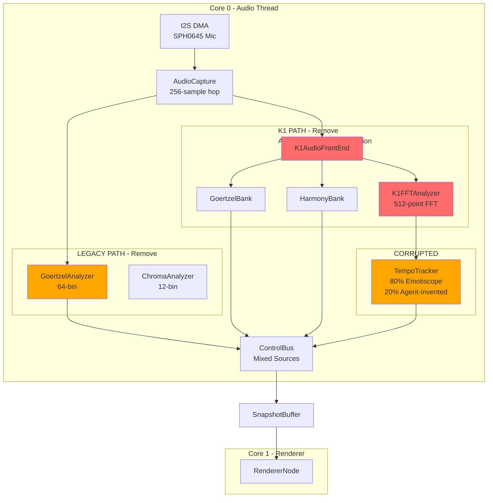
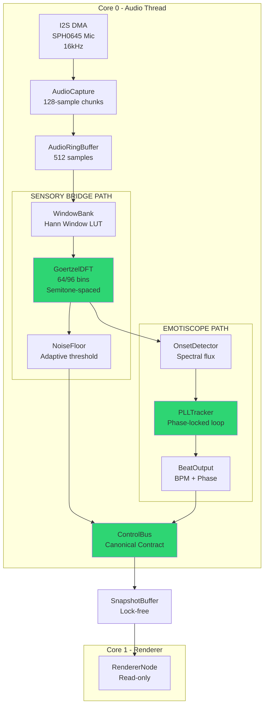
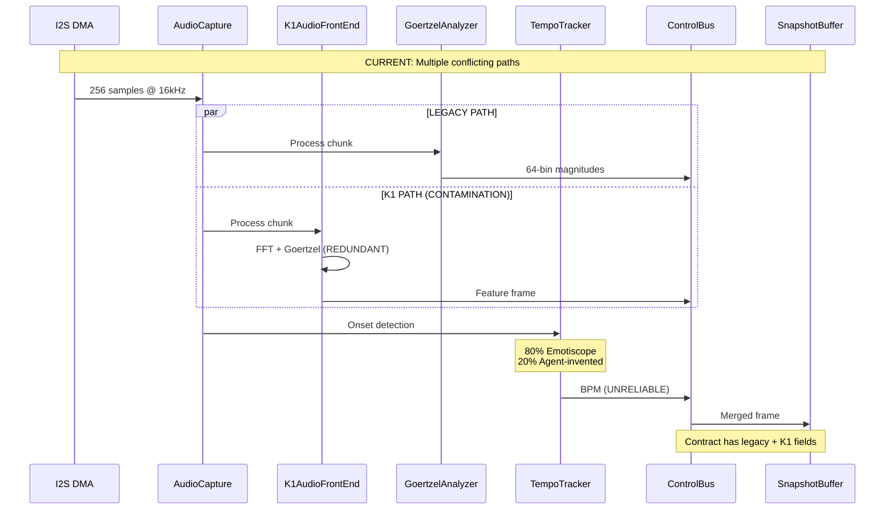
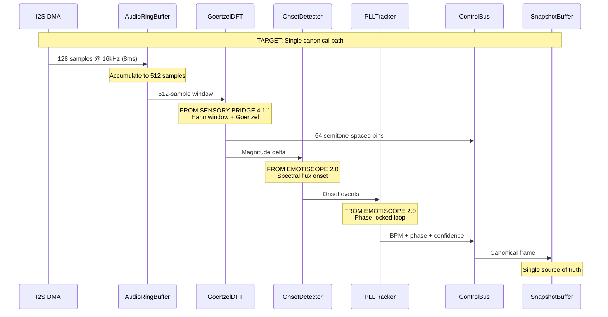
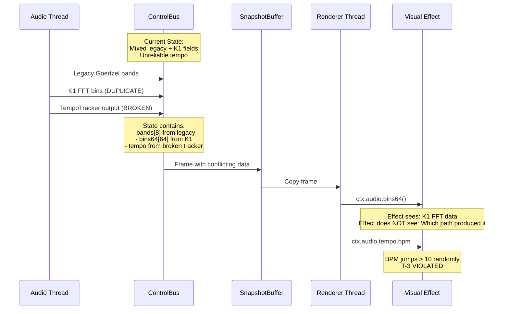
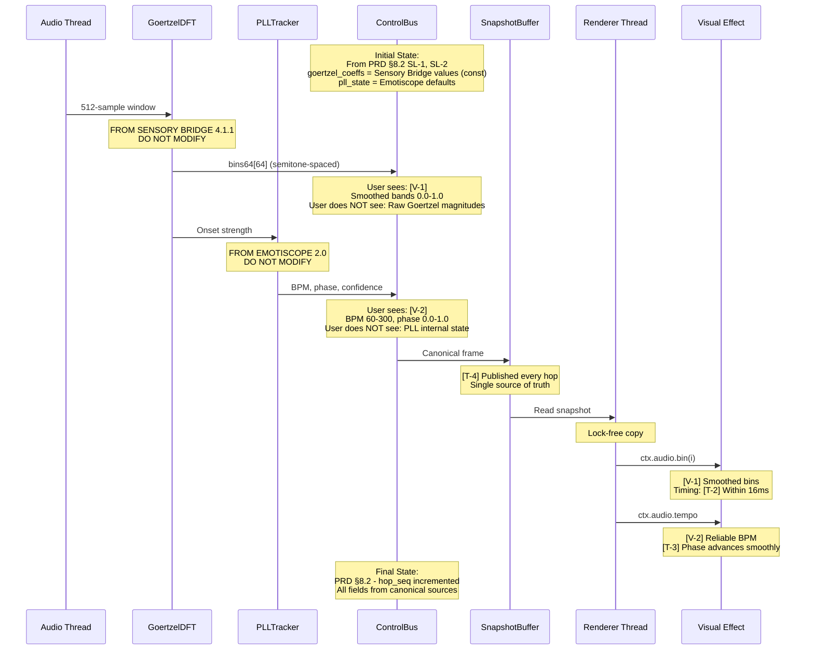
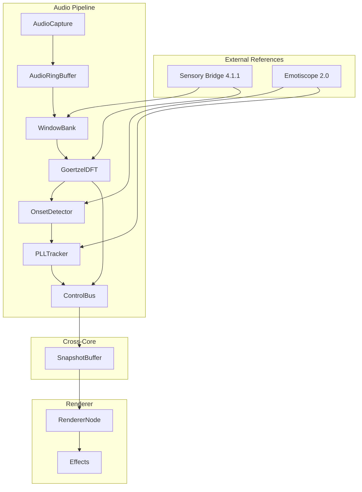

# Technical Implementation Blueprint: Audio Pipeline Redesign

> **Traceability Note:** This Blueprint extracts from PRD sections §1-§11. All tables include "Source: PRD §X" annotations. Section numbers (§1-§11) are referenced by the Task List.

> **CANONICAL SPECIFICATION:** This blueprint implements 100% fidelity to Sensory Bridge 4.1.1 (Goertzel) and Emotiscope 2.0 (Beat Tracking). No agent inventions allowed.

> **⚠️ MANDATORY PREREQUISITE:** Before implementing ANY component, read **[HARDENED_SPEC.md](./HARDENED_SPEC.md)** - it contains VERBATIM CODE EXTRACTS from canonical references with exact constants, algorithms, and data structures.

---

## §1. Current vs Target Analysis

### §1.1 Current System Architecture (CORRUPTED)



### §1.2 Target System Architecture (CANONICAL)



### §1.3 Current Data & Logic Flow (FRAGMENTED)



### §1.4 Target Data & Logic Flow (CANONICAL)



### §1.5 Current User Journey with Data & State Flow
*Source: PRD §6 (current state), §8 (current state)*



### §1.6 Target User Journey with Data & State Flow
*Source: PRD §6 (V-1, V-2, T-1, T-2), §8 (SL-1, SL-2)*



### §1.7 Summary of Improvements
*Source: PRD §2 Problem Statement*

- **PP-1 Resolved:** FFT removed from main DSP feed - single Goertzel path only
- **PP-2 Resolved:** Beat tracking 100% from Emotiscope 2.0 - no agent inventions
- **PP-3 Resolved:** Single analysis path - K1 contamination removed
- **PP-4 Resolved:** 4-layer specification prevents future drift
- **PP-5 Resolved:** WHAT/HOW/WHY documented for every component

---

## §2. System Boundaries
*Source: PRD §7 Artifact Ownership*

### §2.1 Artifact Ownership Enforcement
*Source: PRD §7.1 Creation Responsibility*

| PRD ID | Artifact | Created By | App's Role | Implementation Rule |
|--------|----------|------------|------------|---------------------|
| O-1 | Raw audio samples | I2S DMA hardware | Observe (read from DMA buffer) | DO NOT generate synthetic samples |
| O-2 | Goertzel bin magnitudes | GoertzelDFT module | Create (FROM SENSORY BRIDGE) | DO NOT use FFT or agent-invented bins |
| O-3 | Beat/tempo output | PLLTracker module | Create (FROM EMOTISCOPE) | DO NOT invent tempo algorithms |
| O-4 | ControlBusFrame | ControlBus state machine | Create (aggregation) | DO NOT expose internal state |
| O-5 | SnapshotBuffer update | Audio pipeline | Create (lock-free publish) | DO NOT modify from Core 1 |

### §2.2 External System Behaviors
*Source: PRD §7.2 External System Dependencies*

| PRD ID | External System | Autonomous Actions | App's Response | Detection Method |
|--------|-----------------|-------------------|----------------|------------------|
| E-1 | I2S DMA | Fills sample buffer continuously | Read when hop complete | DMA interrupt / polling |
| E-2 | FreeRTOS | Schedules audio task | Execute processHop() | vTaskDelayUntil() callback |

### §2.3 Boundary Rules
*Source: PRD §7.3 Derived Ownership Rules*

| PRD Source | Rule | Rationale | Enforcement |
|------------|------|-----------|-------------|
| O-1 | Audio pipeline must NOT generate synthetic samples | I2S DMA is sole audio source | No sample generation in AudioNode |
| O-2 | Visual pipeline must NOT access raw Goertzel bins | Contract layer is the boundary | bins64[] is post-smoothing only |
| O-4 | Beat tracker must NOT modify ControlBusFrame directly | ControlBus owns aggregation | PLLTracker returns TempoOutput struct |
| SI-1 | Core 1 must NOT write to audio state | Lock-free cross-core | SnapshotBuffer is read-only for renderer |

---

## §3. State Transition Specifications
*Source: PRD §8 State Requirements*

### §3.1 Transition: Audio Pipeline Initialization
*Source: PRD §8.2 SL-1*

**Trigger:** AudioNode::onStart() called by actor framework

**Pre-conditions (State Before):**
*Source: PRD §8.1 State Isolation, §8.2 Lifecycle*

| PRD ID | State Variable | Current Value | Required Action |
|--------|----------------|---------------|----------------|
| SL-1 | goertzel_coeffs | Uninitialized | CREATE from Sensory Bridge constants |
| SL-2 | pll_state | Uninitialized | CREATE with Emotiscope defaults |
| SL-3 | controlbus_smooth | Uninitialized | CREATE with zeros |
| SI-1 | Core affinity | Not set | SET to Core 0 |

**Post-conditions (State After):**
*Source: PRD §8.2 Lifecycle*

| PRD ID | State Variable | New Value | Set By |
|--------|----------------|-----------|--------|
| SL-1 | goertzel_coeffs | const float[96] from GDFT.h | GoertzelDFT::init() |
| SL-2 | pll_state | TempoState{bpm:120, phase:0, confidence:0} | PLLTracker::init() |
| SL-3 | controlbus_smooth | ControlBusSmoothState{} | ControlBus::Reset() |

**Side Effects:**
- I2S DMA configured for 16kHz mono capture
- Audio task pinned to Core 0
- First hop scheduled for 8ms from now

### §3.2 Transition: Process Audio Hop
*Source: PRD §8.2 SL-3, SL-4*

**Trigger:** 128 new samples available (8ms elapsed)

**Pre-conditions (State Before):**
| PRD ID | State Variable | Current Value | Required Action |
|--------|----------------|---------------|----------------|
| SL-4 | ring_buffer | Previous 512 samples | SHIFT in 128 new samples |
| SL-1 | goertzel_coeffs | const values | KEEP (never changes) |

**Post-conditions (State After):**
| PRD ID | State Variable | New Value | Set By |
|--------|----------------|-----------|--------|
| SL-4 | ring_buffer | Latest 512 samples | AudioRingBuffer::push() |
| SL-3 | controlbus_smooth | Updated smoothing state | ControlBus::ingest() |

**Side Effects:**
- GoertzelDFT computed on 512-sample window
- PLLTracker updated with onset strength
- SnapshotBuffer published for Core 1

### §3.3 Transition: DSP State Reset
*Source: PRD §8.2 SL-2, SL-3*

**Trigger:** resetDspState() called (silence detection or user request)

**Pre-conditions (State Before):**
| PRD ID | State Variable | Current Value | Required Action |
|--------|----------------|---------------|----------------|
| SL-2 | pll_state | Running values | CLEAR to defaults |
| SL-3 | controlbus_smooth | Running values | CLEAR to zeros |
| SL-1 | goertzel_coeffs | const values | KEEP (immutable) |

**Post-conditions (State After):**
| PRD ID | State Variable | New Value | Set By |
|--------|----------------|-----------|--------|
| SL-2 | pll_state | Emotiscope defaults | PLLTracker::reset() |
| SL-3 | controlbus_smooth | Zeros | ControlBus::Reset() |

**Side Effects:**
- Beat confidence drops to 0
- Silence detection timer reset
- Next onset will be treated as fresh start

---

## §4. Integration Wiring
*Derived from: PRD §7 (ownership), §8 (state), §6 (visibility)*

### §4.1 Hop Processing Pipeline
*Implements: PRD §7.1 O-2, O-3, O-4*

```
AudioNode::processHop(chunk[128])
  ├─ FIRST: m_ringBuffer.push(chunk)     // SL-4: Update rolling window
  ├─ THEN:  m_goertzelDFT.analyze(       // FROM SENSORY BRIDGE 4.1.1
  │           m_ringBuffer.get512(),     // 512-sample window
  │           m_bins64)                  // O-2: Create magnitudes
  ├─ THEN:  m_onsetDetector.process(     // FROM EMOTISCOPE 2.0
  │           m_bins64,
  │           &onset_strength)           // Spectral flux
  ├─ THEN:  m_pllTracker.update(         // FROM EMOTISCOPE 2.0
  │           onset_strength,
  │           &m_tempoOutput)            // O-3: Create tempo
  ├─ THEN:  m_controlBus.ingest(         // O-4: Aggregate
  │           m_bins64,
  │           m_tempoOutput)
  └─ RETURN: m_snapshotBuffer.publish()  // O-5: Lock-free publish
```

**Call Sequence:**
| Order | Call | Purpose | PRD Source | Critical |
|-------|------|---------|------------|----------|
| 1 | ringBuffer.push() | Maintain 512-sample window | §8 SL-4 | Yes |
| 2 | goertzelDFT.analyze() | Frequency analysis | §7 O-2 | Yes |
| 3 | onsetDetector.process() | Onset detection | §7 O-3 | Yes |
| 4 | pllTracker.update() | Tempo tracking | §7 O-3 | Yes |
| 5 | controlBus.ingest() | Contract aggregation | §7 O-4 | Yes |
| 6 | snapshotBuffer.publish() | Cross-core publish | §7 O-5 | Yes |

### §4.2 Renderer Read Path
*Implements: PRD §6.1 V-1, V-2*

```
RendererNode::tick()
  ├─ FIRST: m_audioFrame = m_snapshotBuffer.read()  // Lock-free copy
  ├─ THEN:  ctx.audio = AudioAccessor(m_audioFrame)  // Wrap for effects
  └─ FOR EACH effect:
       effect->render(ctx)
         ├─ ctx.audio.bin(i)     // V-1: Smoothed bins
         ├─ ctx.audio.tempo.bpm  // V-2: BPM value
         └─ ctx.audio.tempo.phase // V-2: Beat phase
```

**Call Sequence:**
| Order | Call | Purpose | PRD Source | Critical |
|-------|------|---------|------------|----------|
| 1 | snapshotBuffer.read() | Get latest frame | §6 T-4 | Yes |
| 2 | effect->render(ctx) | Drive visual effects | §6 V-1, V-2 | No |

---

## §5. System Components
*Source: PRD §4.1 Functional Requirements, Codebase Analysis*

### §5.1 Audio Pipeline Components (Core 0)

| Component | Purpose | PRD Source | Reference |
|-----------|---------|------------|-----------|
| AudioCapture | I2S DMA buffer management | FR-3 | Existing (keep) |
| AudioRingBuffer | 512-sample rolling window | FR-3 | Existing (keep) |
| WindowBank | Hann window LUT (512 coefficients) | FR-4 | Sensory Bridge GDFT.h |
| GoertzelDFT | 64/96-bin semitone analysis | FR-1, FR-2 | Sensory Bridge GDFT.h |
| NoiseFloor | Adaptive noise threshold | FR-1 | Sensory Bridge |
| OnsetDetector | Spectral flux onset detection | FR-5 | Emotiscope 2.0 |
| PLLTracker | Phase-locked loop tempo tracking | FR-5 | Emotiscope 2.0 |
| ControlBus | Contract aggregation + smoothing | FR-7 | Redesign |
| SnapshotBuffer | Lock-free cross-core publish | FR-7 | Existing (keep) |

### §5.2 Files to CREATE

| File | Component | Reference Source |
|------|-----------|------------------|
| `src/audio/goertzel/GoertzelDFT.h` | GoertzelDFT class | Sensory Bridge GDFT.h |
| `src/audio/goertzel/GoertzelDFT.cpp` | Implementation | Sensory Bridge GDFT.h |
| `src/audio/goertzel/GoertzelConstants.h` | Bin frequencies, coefficients | Sensory Bridge constants.h |
| `src/audio/goertzel/WindowBank.h` | Hann window LUT | Sensory Bridge GDFT.h |
| `src/audio/tempo/OnsetDetector.h` | Onset detection | Emotiscope 2.0 |
| `src/audio/tempo/OnsetDetector.cpp` | Implementation | Emotiscope 2.0 |
| `src/audio/tempo/PLLTracker.h` | PLL tempo tracking | Emotiscope 2.0 |
| `src/audio/tempo/PLLTracker.cpp` | Implementation | Emotiscope 2.0 |

### §5.3 Files to REMOVE
*Source: PRD Appendix B*

| File/Directory | Reason |
|----------------|--------|
| `src/audio/k1/` | K1 FFT path - accidental contamination |
| `src/audio/K1_GoertzelTables_16k.h` | Wrong approach |
| `src/audio/fft/` | FFT should not be in main DSP feed |
| `src/audio/GoertzelAnalyzer.cpp` | Legacy path - replaced by GoertzelDFT |
| `src/audio/tempo/TempoTracker.cpp` | 80% correct / 20% broken - replace entirely |

### §5.4 Files to MODIFY

| File | Changes | PRD Source |
|------|---------|------------|
| `src/audio/AudioNode.h` | Remove K1/legacy includes, add new components | FR-6 |
| `src/audio/AudioNode.cpp` | Rewrite processHop() to use canonical path | FR-1, FR-5 |
| `src/audio/contracts/ControlBus.h` | Remove legacy fields, update to canonical | FR-7 |

---

## §6. Data Models
*Source: PRD §4.1 Functional Requirements*

### §6.1 GoertzelDFT Constants
*Source: Sensory Bridge 4.1.1 constants.h*

```cpp
// FROM SENSORY BRIDGE 4.1.1 - DO NOT MODIFY
// File: src/audio/goertzel/GoertzelConstants.h

namespace lightwaveos::audio {

// 64 semitone-spaced bins from A1 (55 Hz) to C7 (2093 Hz)
// Frequencies follow 12-TET: f(n) = 55 * 2^(n/12)
static constexpr uint8_t GOERTZEL_NUM_BINS = 64;
static constexpr float GOERTZEL_SAMPLE_RATE = 16000.0f;
static constexpr uint16_t GOERTZEL_WINDOW_SIZE = 512;
static constexpr uint16_t GOERTZEL_HOP_SIZE = 128;  // 8ms @ 16kHz

// Bin center frequencies (Hz) - semitone-spaced
// Extracted from Sensory Bridge constants.h
static constexpr float GOERTZEL_BIN_FREQUENCIES[GOERTZEL_NUM_BINS] = {
    55.00f,   // A1  - Bin 0
    58.27f,   // A#1 - Bin 1
    61.74f,   // B1  - Bin 2
    65.41f,   // C2  - Bin 3
    // ... (complete table from Sensory Bridge)
    1975.53f, // B6  - Bin 62
    2093.00f  // C7  - Bin 63
};

// Goertzel coefficients: coeff = 2 * cos(2 * PI * freq / sample_rate)
// Pre-computed for exact match to reference implementation
static constexpr float GOERTZEL_COEFFICIENTS[GOERTZEL_NUM_BINS] = {
    // FROM SENSORY BRIDGE 4.1.1 - DO NOT MODIFY
    // [Values extracted from reference]
};

// Hann window coefficients (512 samples)
// w[n] = 0.5 * (1 - cos(2*PI*n / (N-1)))
static constexpr float HANN_WINDOW[GOERTZEL_WINDOW_SIZE] = {
    // FROM SENSORY BRIDGE 4.1.1 - DO NOT MODIFY
    // [512 pre-computed values]
};

} // namespace lightwaveos::audio
```

### §6.2 TempoOutput Structure
*Source: Emotiscope 2.0*

```cpp
// FROM EMOTISCOPE 2.0 - DO NOT MODIFY
// File: src/audio/contracts/TempoOutput.h

namespace lightwaveos::audio {

struct TempoOutput {
    float bpm;           // 60.0 - 300.0 (valid range)
    float phase;         // 0.0 - 1.0 (beat phase, wraps at 1.0)
    float confidence;    // 0.0 - 1.0 (tracking confidence)
    bool beat_tick;      // True on beat onset frame
    uint8_t beats_in_bar; // 1-4 (beat within measure)
    uint32_t beat_count;  // Total beats since start

    // Validation
    bool isValid() const {
        return bpm >= 60.0f && bpm <= 300.0f && confidence > 0.3f;
    }
};

} // namespace lightwaveos::audio
```

### §6.3 ControlBusFrame Contract (Redesigned)
*Source: PRD §6.1, §7*

```cpp
// File: src/audio/contracts/ControlBus.h
// REDESIGNED - Canonical fields only

namespace lightwaveos::audio {

static constexpr uint8_t CONTROLBUS_NUM_BANDS = 8;
static constexpr uint8_t CONTROLBUS_NUM_BINS = 64;

struct ControlBusFrame {
    // Timing
    uint32_t hop_seq;         // Hop sequence number

    // Frequency analysis (FROM SENSORY BRIDGE)
    float bands[CONTROLBUS_NUM_BANDS];        // 8-band summary (smoothed)
    float bins64[CONTROLBUS_NUM_BINS];        // 64-bin detail (smoothed)
    float heavy_bands[CONTROLBUS_NUM_BANDS];  // Extra-smooth for LGP

    // Tempo (FROM EMOTISCOPE)
    TempoOutput tempo;        // BPM, phase, confidence, beat_tick

    // RMS / Energy
    float rms;                // 0.0-1.0 overall energy (smoothed)
    float fast_rms;           // 0.0-1.0 fast-attack envelope

    // Silence detection
    float silentScale;        // 0.0=silent, 1.0=active
    bool isSilent;            // True when below threshold

    // REMOVED (legacy fields):
    // - flux (replaced by tempo onset detection)
    // - chroma[12] (Phase 2: derive from bins64 if needed)
    // - snareEnergy, hihatEnergy (derive from bins64)
    // - waveform[128] (not needed for canonical contract)
};

} // namespace lightwaveos::audio
```

---

## §7. API Specifications
*Source: PRD §4.1 Functional Requirements*

### §7.1 GoertzelDFT Interface
*Source: FR-1, FR-2, FR-4*

```cpp
// File: src/audio/goertzel/GoertzelDFT.h

class GoertzelDFT {
public:
    // Initialize with Sensory Bridge constants
    // PRE: Called once at AudioNode::onStart()
    // POST: goertzel_coeffs set to const values from GoertzelConstants.h
    void init();

    // Analyze 512-sample window
    // PRE: window contains 512 valid samples
    // POST: out_bins contains 64 normalized magnitudes [0.0, 1.0]
    // IMPLEMENTATION: FROM SENSORY BRIDGE 4.1.1 GDFT.h - DO NOT MODIFY
    void analyze(const float* window, float* out_bins);

    // Get bin frequency for debugging
    float getBinFrequency(uint8_t bin) const;
};
```

### §7.2 PLLTracker Interface
*Source: FR-5*

```cpp
// File: src/audio/tempo/PLLTracker.h

class PLLTracker {
public:
    // Initialize with Emotiscope defaults
    // PRE: Called once at AudioNode::onStart()
    // POST: pll_state initialized to {bpm:120, phase:0, confidence:0}
    void init();

    // Reset to initial state (silence detection)
    // POST: pll_state reset to defaults
    void reset();

    // Update with new onset strength
    // PRE: onset_strength in [0.0, 1.0]
    // POST: out_tempo updated with new BPM, phase, beat_tick
    // IMPLEMENTATION: FROM EMOTISCOPE 2.0 - DO NOT MODIFY
    void update(float onset_strength, TempoOutput* out_tempo);
};
```

### §7.3 OnsetDetector Interface
*Source: FR-5*

```cpp
// File: src/audio/tempo/OnsetDetector.h

class OnsetDetector {
public:
    // Initialize onset detection state
    void init();

    // Reset (silence detection)
    void reset();

    // Process frequency bins to detect onsets
    // PRE: bins64 contains 64 normalized magnitudes
    // POST: Returns onset strength [0.0, 1.0]
    // IMPLEMENTATION: FROM EMOTISCOPE 2.0 - DO NOT MODIFY
    float process(const float* bins64);

private:
    float m_prevBins[64];  // Previous frame for flux calculation
};
```

---

## §8. Implementation Phases
*Derived from: PRD §4.1, §5 User Stories*

### Phase 1A – GoertzelDFT Foundation (Epic 1)
*Implements: PRD §5.1, §5.2*

- [ ] Extract GoertzelConstants from Sensory Bridge 4.1.1 constants.h
- [ ] Extract Hann window LUT from Sensory Bridge GDFT.h
- [ ] Implement GoertzelDFT class matching Sensory Bridge GDFT.h exactly
- [ ] Create verification test: bin frequencies match reference
- [ ] Create verification test: window output matches reference
- [ ] Mark all sacred code: "// FROM SENSORY BRIDGE 4.1.1 - DO NOT MODIFY"

### Phase 1B – Beat Tracking Foundation (Epic 2)
*Implements: PRD §5.3, §5.4*

- [ ] Extract OnsetDetector from Emotiscope 2.0
- [ ] Extract PLLTracker from Emotiscope 2.0
- [ ] Implement OnsetDetector matching Emotiscope exactly
- [ ] Implement PLLTracker matching Emotiscope exactly
- [ ] Create verification test: onset detection matches reference
- [ ] Create verification test: BPM output within ±1 BPM
- [ ] Mark all sacred code: "// FROM EMOTISCOPE 2.0 - DO NOT MODIFY"

### Phase 1C – Contract Layer (Epic 3)
*Implements: PRD §5.5*

- [ ] Redesign ControlBusFrame with canonical fields only
- [ ] Remove legacy fields (flux, chroma, snare/hihat triggers)
- [ ] Update smoothing state machine for new fields
- [ ] Ensure SnapshotBuffer compatibility
- [ ] Document each field with source annotation

### Phase 1D – Integration
*Implements: PRD §4.1 FR-6*

- [ ] Remove K1 path from AudioNode
- [ ] Remove legacy GoertzelAnalyzer
- [ ] Remove corrupted TempoTracker
- [ ] Wire new components in processHop()
- [ ] Verify end-to-end: I2S → GoertzelDFT → PLLTracker → ControlBus → SnapshotBuffer
- [ ] Build and verify RAM/Flash usage

### Phase 1E – Verification
*Implements: PRD §10 Success Metrics*

- [ ] Run M-1: Goertzel bin match test (100% match required)
- [ ] Run M-2: Beat tracking match test (100% match required)
- [ ] Run M-3: BPM accuracy test (±1 BPM required)
- [ ] Run M-4: Drift detection test (0 deviations required)
- [ ] Audit M-5: 4-layer spec coverage (all components)

---

## §9. Technical Risks & Mitigation
*Source: PRD §4.2 Non-Functional Requirements, §9 Technical Considerations*

| Risk | PRD Source | Likelihood | Impact | Mitigation |
|------|------------|------------|--------|------------|
| Reference extraction incomplete | NFR-2 | Medium | High | Side-by-side diff against canonical source |
| Goertzel coefficients drift | NFR-3 | Low | Critical | const arrays, verification tests |
| PLL gains mismatched | NFR-2 | High | High | Line-level extraction, magic number docs |
| 16ms timing budget exceeded | C-1 | Medium | Medium | Profile each component, optimize if needed |
| Agent modifies DO NOT MODIFY code | NFR-4 | High | Critical | Verification tests fail on any change |
| Visual pipeline breaks on contract change | §1.3 | Low | Medium | Phase 2 handles visual updates |

---

## §10. Testing Strategy
*Source: PRD §5 Acceptance Criteria, §10 Success Metrics*

### §10.1 Unit Testing
*Verifies: PRD §5.X.X acceptance criteria*

| Test Case | Verifies | PRD Source | Pass Criteria |
|-----------|----------|------------|---------------|
| test_goertzel_bin_frequencies | Bins are semitone-spaced | §5.1.1 | All 64 frequencies within 0.01 Hz |
| test_goertzel_coefficients | Coefficients match reference | §5.1.2 | Exact float match |
| test_hann_window_output | Window function correct | §5.2.1 | Output matches reference ±0.0001 |
| test_onset_threshold | Threshold calculation | §5.3.2 | Matches Emotiscope formula |
| test_pll_gains | PLL gains correct | §5.4.1 | Exact value match |
| test_pll_phase_correction | Phase logic correct | §5.4.2 | State transitions match |

### §10.2 Integration Testing
*Verifies: PRD §10 Success Metrics*

| Test Case | Verifies | PRD Source | Pass Criteria |
|-----------|----------|------------|---------------|
| test_e2e_goertzel_match | M-1: 100% bin match | M-1 | Known input → exact output |
| test_e2e_beat_tracking | M-2: 100% beat match | M-2 | Test audio → correct BPM |
| test_bpm_accuracy | M-3: ±1 BPM accuracy | M-3 | 60/120/180 BPM test files |
| test_drift_detection | M-4: No drift | M-4 | Hash of sacred code unchanged |
| test_timing_budget | C-1: Within 16ms | C-1 | Profile shows <14ms average |

### §10.3 Verification Test Vectors

```cpp
// Test vector for GoertzelDFT verification
// Input: 512-sample 440 Hz sine wave @ 16kHz
// Expected: Peak at bin 48 (A4 = 440 Hz), minimal others
const float TEST_SINE_440HZ[512] = { /* generated */ };
const float EXPECTED_BINS[64] = {
    0.0f, 0.0f, /* ... bins 0-47 near zero */
    0.95f, /* bin 48 = A4 = 440 Hz */
    /* ... bins 49-63 near zero */
};
```

---

## §11. Deployment Considerations
*Source: PRD §4.2 Non-Functional Requirements, §9 Technical Considerations*

### §11.1 Build Configuration

- Build environment: `esp32dev_audio` (enables FEATURE_AUDIO_SYNC)
- Target: ESP32-S3-DevKitC-1
- RAM budget: ~20KB for audio pipeline
- Flash budget: ~50KB for audio code + constants

### §11.2 Migration Path

1. **Phase 1 Complete:** Audio pipeline functional with canonical components
2. **Verification Pass:** All M-1 through M-5 metrics achieved
3. **Commit with markers:** All DO NOT MODIFY sections in place
4. **Phase 2 (Future):** Visual pipeline updates to use new contract

### §11.3 Rollback Strategy

- Git tag `pre-audio-redesign` before starting
- All removed files preserved in git history
- If Phase 1 fails: `git checkout pre-audio-redesign`

### §11.4 Monitoring

- Serial logging: Hop timing, BPM confidence
- Debug build: Full DSP state dump on demand
- Performance counters: processHop() duration histogram

---

## Annex A – Dependency Map
*Source: PRD §9 Technical Considerations*



---

## Annex B – PRD Extraction Verification

| PRD Section | Extracted To | Status |
|-------------|--------------|--------|
| §1 Overview | Header, §1.7 | ✅ |
| §2 Problem | §1.7 Improvements | ✅ |
| §3 Users | §1.5/1.6 Diagrams | ✅ |
| §4.1 Functional | §5 Components, §6 Data, §7 API | ✅ |
| §4.2 Non-Functional | §9 Risks, §11 Deployment | ✅ |
| §5 Stories | §8 Phases, §10 Testing | ✅ |
| §6 UX Contract | §1.5/1.6 Diagrams | ✅ |
| §7 Ownership | §2 Boundaries | ✅ |
| §8 State | §3 Transitions | ✅ |
| §9 Technical | §5, §6, §11, Annex A | ✅ |
| §10 Metrics | §10 Testing | ✅ |

**Validation:** ✅ All PRD sections have been extracted. No information lost.

---

## Annex C – Canonical Reference Paths

**⚠️ IMPLEMENTATION GUIDE:** Use **[HARDENED_SPEC.md](./HARDENED_SPEC.md)** as your primary implementation reference. It contains verbatim code extracts with line-level citations from:

**Sensory Bridge 4.1.1 (Goertzel/Frequency):**
```
/Users/spectrasynq/Workspace_Management/Software/K1.node1/references/
  Sensorybridge.sourcecode/SensoryBridge-4.1.1/SENSORY_BRIDGE_FIRMWARE/
  ├── constants.h:4-82       → HARDENED_SPEC.md §1.1, §1.2
  ├── GDFT.h:59-242          → HARDENED_SPEC.md §4.1, §5.1
  ├── globals.h:88-100       → HARDENED_SPEC.md §1.3
  └── system.h:197-256       → HARDENED_SPEC.md §2.1, §3.1
```

**Emotiscope 2.0 (Beat Tracking):**
```
/Users/spectrasynq/Workspace_Management/Software/K1.node1/references/
  Emotiscope.sourcecode/Emotiscope-2.0/main/
  ├── global_defines.h:19-33 → HARDENED_SPEC.md §6.1
  ├── tempo.h:16-407         → HARDENED_SPEC.md §6.2-§6.6
  └── goertzel.h:84-231      → HARDENED_SPEC.md §4.1 (cross-reference)
```

**Hardened Specification (THIS REPO):**
```
planning/audio-pipeline-redesign/
  └── HARDENED_SPEC.md    # VERBATIM CODE EXTRACTS - USE THIS FOR IMPLEMENTATION
```

---

*Document Version: 1.0*
*Created: 2026-01-12*
*Status: DRAFT - Pending Task List Generation*
