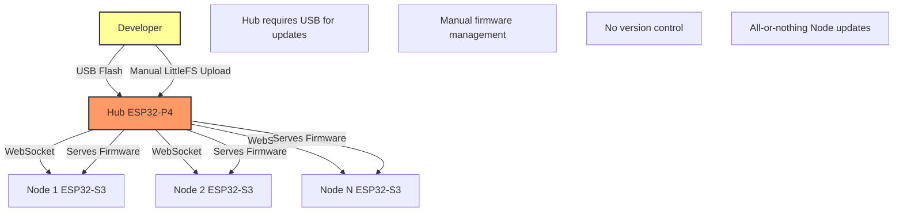
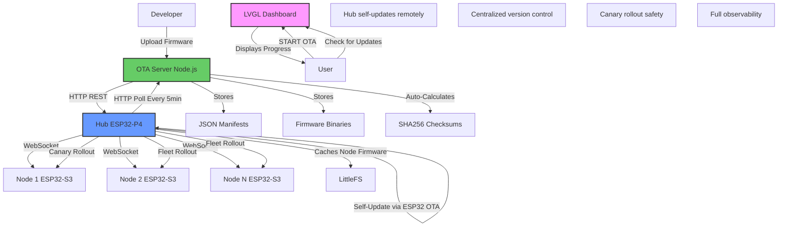
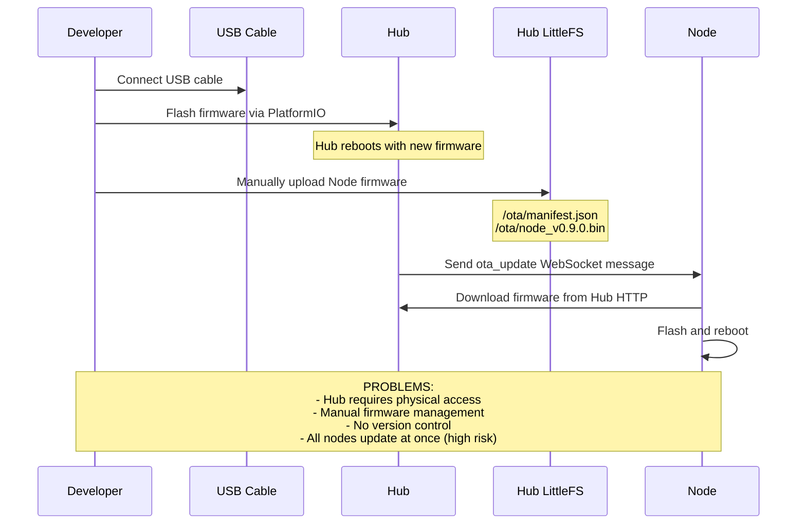
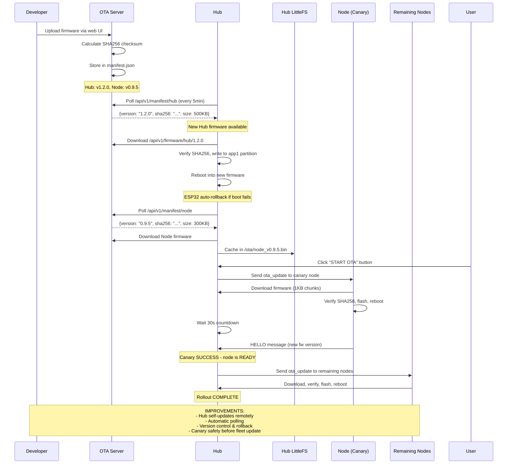
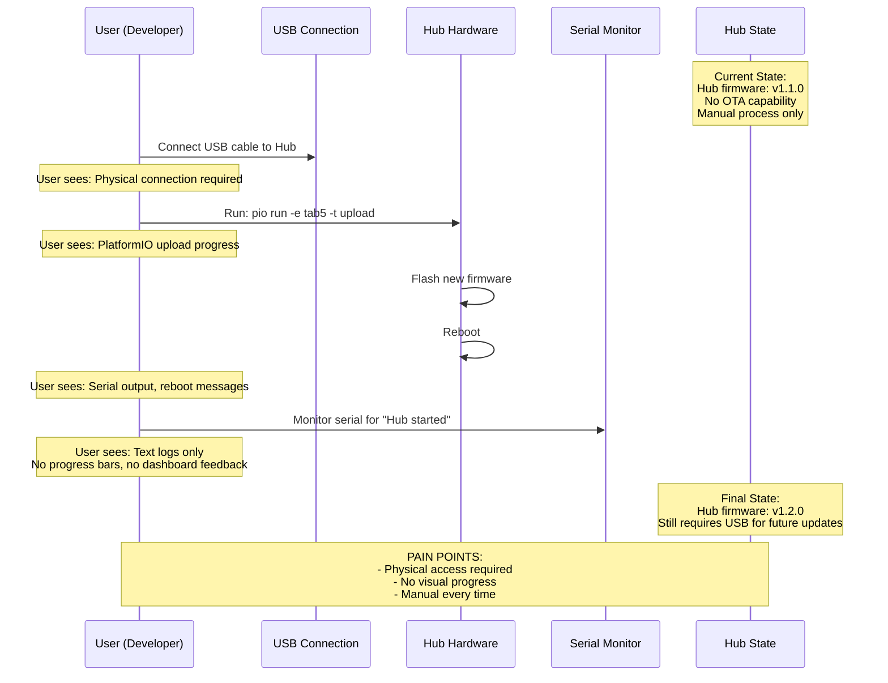
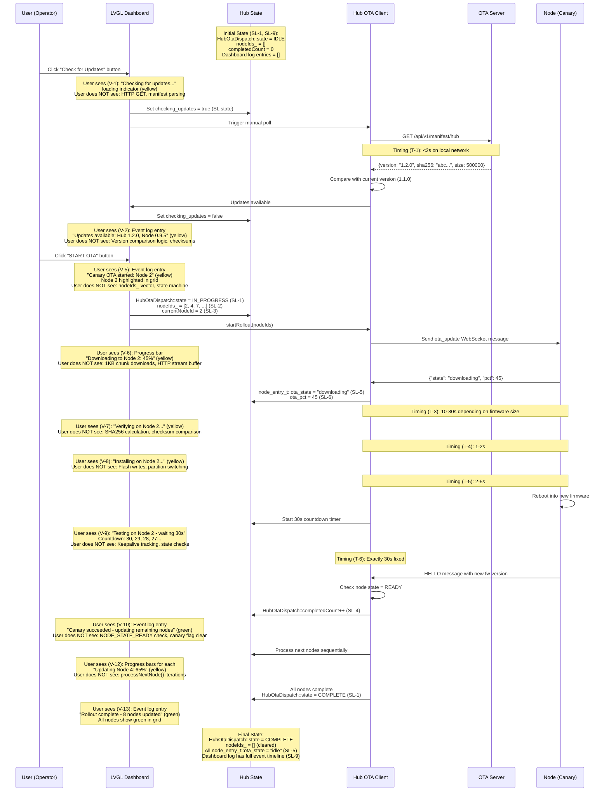
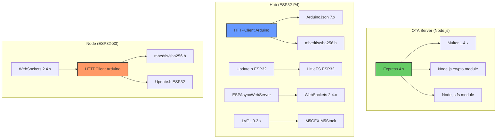

# Technical Implementation Blueprint: Complete OTA Infrastructure for LightwaveOS

> **Traceability Note:** This Blueprint extracts from PRD sections §1-§10. All tables include "Source: PRD §X" annotations. Section numbers (§1-§11) are referenced by the Task List.

## §1. Current vs Target Analysis

### §1.1 Current System Architecture



### §1.2 Target System Architecture



### §1.3 Current Data & Logic Flow



### §1.4 Target Data & Logic Flow



### §1.5 Current User Journey with Data & State Flow
*Source: PRD §6 (current state), §8 (current state)*



### §1.6 Target User Journey with Data & State Flow
*Source: PRD §6 (V-1 to V-22, T-1 to T-13), §8 (SL-1 to SL-13)*



**Diagram Requirements Met:**
- ✅ Shows User, UI, State, Hub, OTA, Node as participants
- ✅ Includes "Note over State" blocks showing state before/after (from PRD §8.2)
- ✅ Includes "Note over UI" blocks showing what user sees (from PRD §6.1)
- ✅ Shows data flow with arrows and labels
- ✅ Highlights what user does NOT see (from PRD §6.1 hidden column)
- ✅ References PRD IDs (V-1 to V-13, T-1 to T-6, SL-1 to SL-9) in annotations

### §1.7 Summary of Improvements
*Source: PRD §2 Problem Statement*

- **Eliminates USB dependency** – Hub can self-update remotely via ESP32 dual-partition OTA; no physical access required
- **Centralized version control** – OTA server provides single source of truth for all firmware versions with full history
- **Staged rollout safety** – Canary strategy tests on 1 node before fleet-wide deployment, preventing catastrophic failures
- **Automated distribution** – Developer uploads once, system handles Hub caching and Node distribution automatically
- **Full observability** – LVGL dashboard shows detailed progress, countdown timers, and color-coded status for every step
- **Automatic rollback** – ESP32 dual-partition OTA rolls back Hub to previous firmware if new version fails to boot

---

## §2. System Boundaries
*Source: PRD §7 Artifact Ownership*

### §2.1 Artifact Ownership Enforcement
*Source: PRD §7.1 Creation Responsibility*

| PRD ID | Artifact | Created By | App's Role | Implementation Rule |
|--------|----------|------------|------------|---------------------|
| O-1 | OTA server firmware binaries (`.bin` files) | **Developer** (manual upload via web UI) | **Observe** (Hub downloads when available) | Hub must NOT create firmware binaries - only download and cache |
| O-2 | OTA server manifest JSON | **OTA Server** (auto-generated on upload) | **Observe** (Hub polls and parses) | Hub must NOT modify OTA server manifest - read-only access |
| O-3 | SHA256 checksums in manifest | **OTA Server** (auto-calculated on upload) | **Observe** (Hub uses for verification) | Hub must NOT calculate SHA256 for server uploads - only verify downloaded firmware |
| O-4 | Hub LittleFS cached Node firmware | **Hub** (downloads from OTA server) | **Create** (Hub downloads and caches) | Hub creates local cache after downloading and verifying |
| O-5 | Hub LittleFS manifest | **Hub** (updates after Node firmware cache) | **Create** (Hub maintains local manifest) | Hub updates local manifest to track cached versions |
| O-6 | Hub OTA partition (inactive partition) | **Hub** (writes downloaded Hub firmware) | **Create** (Hub writes firmware to app1) | Hub writes to inactive partition using ESP32 Update.h library |
| O-7 | Node OTA partition (inactive partition) | **Node** (writes downloaded firmware from Hub) | **Observe** (Hub monitors Node state) | Hub must NOT directly write to Node partitions - Nodes handle their own flashing |
| O-8 | Dashboard event log entries | **Hub** (HubRegistry callback triggers dashboard) | **Create** (Hub generates log entries) | Hub creates log entries on registry events and OTA status changes |
| O-9 | Dashboard UI widgets | **Hub** (LVGL widget creation in HubDashboard.cpp) | **Create** (Hub creates and manages UI) | Hub creates all LVGL widgets during dashboard initialization |
| O-10 | Node registry entries | **Hub** (on HELLO message) | **Create** (Hub registers nodes in RAM) | Hub creates node_entry_t on WebSocket HELLO, tracks in std::map |

### §2.2 External System Behaviors
*Source: PRD §7.2 External System Dependencies*

| PRD ID | External System | Autonomous Actions | App's Response | Detection Method |
|--------|-----------------|-------------------|----------------|------------------|
| E-1 | **OTA Server (Node.js)** | Creates firmware binaries from developer uploads, calculates SHA256, updates manifest JSON, serves HTTP requests | Hub polls `/api/v1/manifest/:device` every 5min + manual trigger, downloads firmware, caches locally | HTTP GET returns 200 with JSON; Hub compares version strings |
| E-2 | **PlatformIO build system** | Compiles firmware `.bin` files (developer's responsibility) | Developer uploads compiled `.bin` to OTA server web UI | Manual: Developer must rebuild and re-upload if missing/corrupted |
| E-3 | **ESP32 OTA Update.h library** | Writes to inactive partition, marks partition valid, rolls back on boot failure | Hub calls `Update.begin()`, `Update.write()`, `Update.end()`, checks `Update.isFinished()` | Automatic: ESP32 bootloader handles rollback after 3 failed boots (~30s) |
| E-4 | **Node WebSocket client** | Downloads firmware from Hub, verifies SHA256, flashes partition, reboots, sends OTA status messages | Hub receives WebSocket `ota_status` messages, updates `node_entry_t::ota_state` and `ota_pct`, calls `HubOtaDispatch::onNodeOtaStatus()` | WebSocket message parsing; timeout if no status updates for 180s → abort node update |
| E-5 | **Node firmware update process** | Node reboots after flashing, reconnects with new firmware version in HELLO message | Hub observes HELLO message `fw` field, compares with expected version, marks canary as success/failure | HELLO message parsing; if node doesn't reconnect within 30s → canary failure → abort rollout |

### §2.3 Boundary Rules
*Source: PRD §7.3 Derived Ownership Rules*

| PRD Source | Rule | Rationale | Enforcement |
|------------|------|-----------|-------------|
| O-1 | ❌ Hub must NOT create firmware binaries | Developer/PlatformIO creates them; Hub only downloads | `HubOtaClient::downloadFirmware()` uses HTTPClient to fetch, never writes new firmware |
| O-2 | ❌ Hub must NOT modify OTA server manifest | OTA server owns manifest; Hub only reads | `HubOtaClient::checkForUpdates()` uses HTTP GET (read-only), never POST/PUT |
| O-3 | ❌ Hub must NOT calculate SHA256 for OTA server uploads | OTA server calculates on upload; Hub only verifies downloaded firmware | Hub uses `mbedtls/sha256.h` for verification only, not manifest generation |
| O-4 | ❌ OTA server must NOT access Hub's LittleFS | Hub owns local filesystem; OTA server only serves files over HTTP | OTA server has no filesystem access to Hub; communication is HTTP-only |
| O-5 | ✅ Hub MUST wait for Node to report OTA status | Node owns its update process; Hub observes WebSocket messages | `HubOtaDispatch::tick()` waits for `onNodeOtaStatus()` callbacks, doesn't assume success |
| O-6 | ✅ Hub MUST verify Node reached READY state after canary update | Node may fail to boot; Hub verifies via keepalive and state transition | `HubOtaDispatch` checks `registry_->getNode(nodeId)->state == NODE_STATE_READY` after 30s |
| E-1 | ✅ Hub MUST handle OTA server unavailability gracefully | Server may be down; Hub continues LED operation and retries later | `HubOtaClient::checkForUpdates()` logs errors, doesn't crash, retries on next poll cycle |
| E-3 | ✅ Hub MUST trust ESP32 OTA library for rollback | ESP32 handles boot failure detection; Hub cannot manually rollback | Hub uses `Update.h` API; relies on ESP32 bootloader for partition management |
| E-5 | ✅ Hub MUST abort rollout if canary doesn't reconnect | Node boot failure is undetectable except via absence of HELLO message | `HubOtaDispatch` aborts if canary not READY after 30s timeout |

---

## §3. State Transition Specifications
*Source: PRD §8 State Requirements*

### §3.1 Transition: Start Canary Rollout
*Source: PRD §8.2 SL-1, SL-2, SL-3, SL-4*

**Trigger:** User clicks "START OTA" button OR Hub receives `startRollout(nodeIds)` call

**Pre-conditions (State Before):**
*Source: PRD §8.1 State Isolation, §8.2 Lifecycle*

| PRD ID | State Variable | Current Value | Required Action |
|--------|----------------|---------------|----------------|
| SL-1 | `HubOtaDispatch::state_` | `OTA_DISPATCH_IDLE` | KEEP - must be idle before starting |
| SL-2 | `HubOtaDispatch::nodeIds_` | Empty vector `[]` | KEEP - will be populated on start |
| SL-3 | `HubOtaDispatch::currentNodeId_` | `0` | KEEP - will be set to canary node |
| SL-4 | `HubOtaDispatch::completedCount_` | `0` | KEEP - will increment as nodes complete |
| SI-2 | Rollout state isolation | Only one rollout can run at a time | CHECK - abort if already in progress |

**Post-conditions (State After):**
*Source: PRD §8.2 Lifecycle*

| PRD ID | State Variable | New Value | Set By |
|--------|----------------|-----------|--------|
| SL-1 | `HubOtaDispatch::state_` | `OTA_DISPATCH_IN_PROGRESS` | `HubOtaDispatch::startRollout()` |
| SL-2 | `HubOtaDispatch::nodeIds_` | `[2, 4, 7, ...]` (READY node IDs) | `HubOtaDispatch::startRollout()` |
| SL-3 | `HubOtaDispatch::currentNodeId_` | `2` (first canary node ID) | `HubOtaDispatch::processNextNode()` |
| SL-4 | `HubOtaDispatch::completedCount_` | `0` (initialized, not incremented yet) | `HubOtaDispatch::startRollout()` |
| SL-5 | `node_entry_t::ota_state` (canary) | `"downloading"` (Node reports via WS) | `HubRegistry::setOtaState()` via WS callback |

**Side Effects:**
- Dashboard event log appends "Canary OTA started: Node X" (PRD §6.1 V-5)
- Node grid highlights canary node with yellow border (PRD §4.1 FR-17)
- WebSocket `ota_update` message sent to canary node (PRD §9.2 Integration 3)

### §3.2 Transition: Canary Verification Complete (Success)
*Source: PRD §8.2 SL-1, SL-4, SL-5*

**Trigger:** 30s countdown expires AND canary node state is `NODE_STATE_READY`

**Pre-conditions (State Before):**

| PRD ID | State Variable | Current Value | Required Action |
|--------|----------------|---------------|----------------|
| SL-1 | `HubOtaDispatch::state_` | `OTA_DISPATCH_IN_PROGRESS` | KEEP - still in rollout |
| SL-3 | `HubOtaDispatch::currentNodeId_` | Canary node ID (e.g., `2`) | KEEP - verifying this node |
| SL-5 | `node_entry_t::ota_state` (canary) | `"complete"` (Node reported success) | CHECK - must be complete |
| - | Node registry state (canary) | `NODE_STATE_READY` (from HubRegistry) | CHECK - must be READY |

**Post-conditions (State After):**

| PRD ID | State Variable | New Value | Set By |
|--------|----------------|-----------|--------|
| SL-4 | `HubOtaDispatch::completedCount_` | `1` (incremented) | `HubOtaDispatch::tick()` |
| SL-3 | `HubOtaDispatch::currentNodeId_` | Next node ID (e.g., `4`) | `HubOtaDispatch::processNextNode()` |
| SL-5 | `node_entry_t::ota_state` (next node) | `"downloading"` | `HubRegistry::setOtaState()` via WS |

**Side Effects:**
- Dashboard event log appends "Canary succeeded - updating remaining nodes" (PRD §6.1 V-10)
- Dashboard removes yellow highlight from canary node, shows green (success)
- Hub begins sequential update of remaining nodes (PRD §5.7)

### §3.3 Transition: Canary Verification Complete (Failure)
*Source: PRD §8.2 SL-1, SL-2, SL-3, SL-4*

**Trigger:** 30s countdown expires AND canary node state is NOT `NODE_STATE_READY` (LOST or DEGRADED)

**Pre-conditions (State Before):**

| PRD ID | State Variable | Current Value | Required Action |
|--------|----------------|---------------|----------------|
| SL-1 | `HubOtaDispatch::state_` | `OTA_DISPATCH_IN_PROGRESS` | KEEP - about to abort |
| SL-3 | `HubOtaDispatch::currentNodeId_` | Canary node ID (e.g., `2`) | KEEP - failed node |
| - | Node registry state (canary) | `NODE_STATE_LOST` or `NODE_STATE_DEGRADED` | CHECK - not READY |

**Post-conditions (State After):**

| PRD ID | State Variable | New Value | Set By |
|--------|----------------|-----------|--------|
| SL-1 | `HubOtaDispatch::state_` | `OTA_DISPATCH_ABORTED` | `HubOtaDispatch::abort()` |
| SL-2 | `HubOtaDispatch::nodeIds_` | `[]` (cleared) | `HubOtaDispatch::abort()` |
| SL-3 | `HubOtaDispatch::currentNodeId_` | `0` (cleared) | `HubOtaDispatch::abort()` |
| SL-4 | `HubOtaDispatch::completedCount_` | `0` (reset) | `HubOtaDispatch::abort()` |

**Side Effects:**
- Dashboard event log appends "Canary failed - rollout aborted" (PRD §6.1 V-11)
- Node grid shows canary node as LOST/DEGRADED (red)
- Remaining nodes are NOT updated (PRD §4.1 FR-15, NFR-7)

### §3.4 Transition: Hub Reboots During Rollout
*Source: PRD §8.2 SL-1, SL-2, SL-3, SL-4, SL-9*

**Trigger:** Hub reboot (power cycle, crash, self-update, manual reset)

**Pre-conditions (State Before):**

| PRD ID | State Variable | Current Value | Required Action |
|--------|----------------|---------------|----------------|
| SL-1 | `HubOtaDispatch::state_` | `OTA_DISPATCH_IN_PROGRESS` | LOST - RAM state cleared |
| SL-2 | `HubOtaDispatch::nodeIds_` | `[2, 4, 7, ...]` | LOST - RAM state cleared |
| SL-3 | `HubOtaDispatch::currentNodeId_` | `2` (or current node) | LOST - RAM state cleared |
| SL-4 | `HubOtaDispatch::completedCount_` | `1` (or current count) | LOST - RAM state cleared |
| SL-9 | Dashboard log entries | Contains rollout events | LOST - RAM state cleared |

**Post-conditions (State After):**

| PRD ID | State Variable | New Value | Set By |
|--------|----------------|-----------|--------|
| SL-1 | `HubOtaDispatch::state_` | `OTA_DISPATCH_IDLE` (default init) | Constructor after reboot |
| SL-2 | `HubOtaDispatch::nodeIds_` | `[]` (default init) | Constructor after reboot |
| SL-3 | `HubOtaDispatch::currentNodeId_` | `0` (default init) | Constructor after reboot |
| SL-4 | `HubOtaDispatch::completedCount_` | `0` (default init) | Constructor after reboot |
| SL-9 | Dashboard log entries | Empty (default init) | Constructor after reboot |

**Side Effects:**
- Dashboard event log appends "Hub rebooted - rollout aborted" (PRD §5.8)
- Nodes that completed update remain on new firmware (PRD §5.8.5)
- Nodes that didn't complete remain on old firmware (PRD §5.8.6)
- Operator must manually click "START OTA" to retry rollout (PRD §4.1 FR-16, §5.8.4)

---

## §4. Integration Wiring
*Derived from: PRD §7 (ownership), §8 (state), §6 (visibility)*

### §4.1 Hub OTA Client → OTA Server Polling
*Implements: PRD §7.1 O-2, §6.1 V-1, V-21*

```
HubOtaClient::checkForUpdates()
  ├─ FIRST: HTTPClient.begin("http://192.168.x.x:8080/api/v1/manifest/hub")
  │         // Critical: Must use full URL with IP (not hostname) - local network
  ├─ THEN: HTTPClient.GET()
  │         // Returns manifest JSON with version, sha256, size, url
  ├─ THEN: ArduinoJson::deserializeJson(doc, payload)
  │         // Parse manifest (from PRD §7.1 O-2 - Hub observes, does not create)
  ├─ THEN: compareVersions(doc["version"], currentVersion)
  │         // Version comparison logic (hidden from user per PRD §6.1 V-1)
  └─ RETURN: {hasUpdate: bool, version: string, url: string, sha256: string}
           // (message to dashboard: "Updates available..." per PRD §6.1 V-2)
```

**Call Sequence:**

| Order | Call | Purpose | PRD Source | Critical |
|-------|------|---------|------------|----------|
| 1 | `HTTPClient.begin(url)` | Initialize HTTP connection to OTA server | §7.2 E-1 | Yes - must use correct OTA server URL |
| 2 | `HTTPClient.GET()` | Fetch manifest JSON | §7.1 O-2 | Yes - read-only access (Hub observes, not modifies) |
| 3 | `ArduinoJson::deserializeJson()` | Parse manifest | §4.1 FR-4 | Yes - must validate JSON schema |
| 4 | `compareVersions()` | Determine if update needed | §4.1 FR-9 | No - business logic, not critical sequence |
| 5 | `dashboard_.logEvent()` | Display to user | §6.1 V-2 | Yes - user must see result (not hidden internal) |

### §4.2 Hub OTA Client → Hub Self-Update
*Implements: PRD §7.1 O-6, §6.1 V-14 to V-20, §8.2 SL-6*

```
HubOtaClient::performHubUpdate(version, url, sha256)
  ├─ FIRST: dashboard_.logEvent("Downloading Hub firmware: 0%")
  │         // (displayMessage per PRD §6.1 V-14 - user sees progress)
  ├─ THEN: HTTPClient.begin(url)
  │         HTTPClient.GET()
  │         Update.begin(UPDATE_SIZE_UNKNOWN, U_FLASH)
  │         // Critical: Must call Update.begin() before writing (ESP32 OTA API)
  ├─ THEN: while (client.available()) {
  │           uint8_t buf[1024];  // 1KB chunks per PRD §4.1 FR-11
  │           int len = client.readBytes(buf, 1024);
  │           Update.write(buf, len);
  │           mbedtls_sha256_update(&sha_ctx, buf, len);  // Verify while downloading
  │           dashboard_.updateProgress(bytesDownloaded * 100 / totalSize);
  │         }
  │         // Progress updates every 32KB (per PRD §6.2 T-8)
  ├─ THEN: mbedtls_sha256_finish(&sha_ctx, calculated_sha);
  │         if (calculated_sha != expected_sha) {
  │           Update.abort();
  │           return ERROR_CHECKSUM_MISMATCH;  // Per PRD §4.2 NFR-4
  │         }
  │         dashboard_.logEvent("Verifying Hub firmware...")  // Per PRD §6.1 V-15
  ├─ THEN: Update.end(true);  // Finalize update
  │         dashboard_.logEvent("Installing Hub firmware...")  // Per PRD §6.1 V-16
  ├─ THEN: dashboard_.logEvent("Hub will reboot in 5 seconds")  // Per PRD §6.1 V-17
  │         countdown(5);  // Display: 5, 4, 3, 2, 1
  └─ RETURN: ESP.restart();  // Reboot into new partition (per PRD §4.1 FR-13)
           // ESP32 bootloader handles rollback if boot fails (per PRD §7.2 E-3)
```

**Call Sequence:**

| Order | Call | Purpose | PRD Source | Critical |
|-------|------|---------|------------|----------|
| 1 | `dashboard_.logEvent()` | Show "Downloading..." to user | §6.1 V-14 | Yes - user must see immediate feedback |
| 2 | `Update.begin()` | Initialize ESP32 OTA partition write | §7.2 E-3 | Yes - MUST call before write() |
| 3 | `Update.write()` (loop) | Write firmware in 1KB chunks | §4.1 FR-11 | Yes - chunk size = 1KB (memory safety) |
| 4 | `mbedtls_sha256_update()` | Calculate SHA256 during download | §4.2 NFR-4 | Yes - verify before applying |
| 5 | `Update.end()` | Finalize partition write | §7.2 E-3 | Yes - marks partition valid |
| 6 | `ESP.restart()` | Reboot into new firmware | §4.1 FR-13 | Yes - dual-partition OTA requires reboot |

### §4.3 Hub OTA Dispatch → Canary Rollout
*Implements: PRD §7.1 O-7, §8.2 SL-1 to SL-6, §6.1 V-5 to V-11*

```
HubOtaDispatch::startRollout(nodeIds)
  ├─ FIRST: if (state_ != OTA_DISPATCH_IDLE) return ERROR_ALREADY_IN_PROGRESS;
  │         // Critical: Check pre-condition (per PRD §8.1 SI-2 - only one rollout at a time)
  ├─ THEN: state_ = OTA_DISPATCH_IN_PROGRESS;  // Per PRD §8.2 SL-1
  │         nodeIds_ = nodeIds;  // Per PRD §8.2 SL-2
  │         completedCount_ = 0;  // Per PRD §8.2 SL-4
  │         dashboard_.logEvent("Canary OTA started: Node X")  // Per PRD §6.1 V-5
  ├─ THEN: processNextNode();  // Start with canary (first node in list)
  │         currentNodeId_ = nodeIds_[0];  // Per PRD §8.2 SL-3
  │         sendUpdateToNode(currentNodeId_);  // WebSocket ota_update message
  ├─ THEN: tick();  // Called in main loop, monitors canary progress
  │         // Wait for Node to report ota_state = "complete" (per PRD §8.2 SL-5)
  │         // Wait for 30s countdown (per PRD §4.1 FR-14, §6.1 V-9)
  │         // Check node state = READY (per PRD §7.1 O-7 - Hub observes, Node creates)
  │         if (canary is READY after 30s) {
  │           completedCount_++;  // Per PRD §8.2 SL-4
  │           dashboard_.logEvent("Canary succeeded - updating remaining nodes")  // Per PRD §6.1 V-10
  │           processNextNode();  // Continue with fleet
  │         } else {
  │           abort();  // Per PRD §4.1 FR-15
  │           dashboard_.logEvent("Canary failed - rollout aborted")  // Per PRD §6.1 V-11
  │         }
  └─ RETURN: void (async state machine, monitored via tick())
```

**Call Sequence:**

| Order | Call | Purpose | PRD Source | Critical |
|-------|------|---------|------------|----------|
| 1 | Check `state_ == IDLE` | Enforce single rollout at a time | §8.1 SI-2 | Yes - prevent concurrent rollouts |
| 2 | Set `state_ = IN_PROGRESS` | Begin rollout state transition | §8.2 SL-1 | Yes - state management |
| 3 | `dashboard_.logEvent()` | Show "Canary OTA started" | §6.1 V-5 | Yes - user sees rollout begin |
| 4 | `processNextNode()` | Start canary update | §4.1 FR-14 | Yes - canary first, then fleet |
| 5 | `sendUpdateToNode()` | Send WebSocket ota_update | §9.2 Integration 3 | Yes - triggers Node update |
| 6 | Wait 30s + check READY | Verify canary success | §4.1 FR-14, §6.1 V-9 | Yes - safety verification |
| 7 | `abort()` if canary fails | Stop rollout on failure | §4.1 FR-15 | Yes - prevent fleet-wide failure |

---

## §5. System Components
*Source: PRD §4.1 Functional Requirements, CODEBASE_CONTEXT*

### §5.1 External Components

| Component | Purpose | PRD Source |
|-----------|---------|------------|
| **OTA Server (Node.js Express)** | Hosts firmware binaries, serves REST API, calculates SHA256, manages version manifests | FR-1, FR-2, FR-3, FR-4, FR-5 |
| `server.js` | Main Express application, route registration, error handling | FR-2, FR-6 |
| `routes/api.js` | REST API endpoints: `/api/v1/versions`, `/manifest/:device`, `/firmware/:device/:version`, POST `/upload` | FR-2 |
| `routes/upload.js` | Web UI for manual firmware upload, multer file handling, SHA256 calculation | FR-5, FR-3 |
| `storage/firmware/hub/` | Hub firmware binaries storage directory | FR-8 |
| `storage/firmware/node/` | Node firmware binaries storage directory | FR-8 |
| `storage/firmware/hub/manifest.json` | Hub firmware version manifest (version, url, sha256, size) | FR-4 |
| `storage/firmware/node/manifest.json` | Node firmware version manifest | FR-4 |
| `views/upload.html` | Web UI form for firmware upload | FR-5 |

### §5.2 Hub Components (Firmware)

| Component | Purpose | PRD Source |
|-----------|---------|------------|
| **HubOtaClient** | Polls OTA server, downloads firmware, caches Node firmware, triggers Hub self-update | FR-9, FR-10, FR-11, FR-12, FR-13 |
| `src/hub/ota/hub_ota_client.h` | HubOtaClient class definition | FR-9, FR-10 |
| `src/hub/ota/hub_ota_client.cpp` | Implementation: `checkForUpdates()`, `downloadFirmware()`, `performHubUpdate()` | FR-9, FR-11, FR-13 |
| **HubOtaDispatch** | Manages canary rollout state machine, coordinates Node updates | FR-14, FR-15, FR-16 |
| `src/hub/ota/hub_ota_dispatch.h` | HubOtaDispatch class definition, `ota_dispatch_state_t` enum | FR-14 |
| `src/hub/ota/hub_ota_dispatch.cpp` | Implementation: `startRollout()`, `abort()`, `tick()`, `processNextNode()`, `onNodeOtaStatus()` | FR-14, FR-15 |
| **HubRegistry** | Tracks node states, provides callbacks for OTA events | FR-14 (canary READY check) |
| `src/hub/net/hub_registry.h` | `node_entry_t` struct with `ota_state`, `ota_pct`, `ota_version`, `ota_error` fields | PR D §8.2 SL-5 to SL-8 |
| `src/hub/net/hub_registry.cpp` | `setOtaState()`, `getNode()`, registry state tracking | PRD §8.2 |
| **HubDashboard** | LVGL UI for OTA controls and progress display | FR-17, FR-18, FR-19, FR-20, FR-21, FR-22 |
| `src/ui/HubDashboard.h` | HubDashboard class definition | FR-17 |
| `src/ui/HubDashboard.cpp` | Implementation: `logEvent()`, progress bars, countdown timers, button event handlers | FR-18, FR-19 |
| **HTTPClient** | Arduino HTTP library for polling and downloading | FR-9, FR-11 |
| **Update.h** | ESP32 OTA library for dual-partition updates | FR-13 |
| **mbedtls/sha256.h** | SHA256 verification library | FR-11 (verification during download) |
| **LittleFS** | Filesystem for caching Node firmware | FR-12 |

### §5.3 Node Components (Firmware)

| Component | Purpose | PRD Source |
|-----------|---------|------------|
| **NodeOtaClient** | Downloads firmware from Hub, verifies SHA256, flashes partition, reports status | Existing (referenced in FR-11, FR-22) |
| `src/node/ota/node_ota_client.h` | NodeOtaClient class definition | Existing |
| `src/node/ota/node_ota_client.cpp` | Implementation: `startUpdate()`, `tick()`, `getState()`, `getProgress()` | Existing |

---

## §6. Data Models
*Source: PRD §4.1 Functional Requirements, §7.1 Artifact Ownership*

### §6.1 OTA Server Manifest Schema

```json
// storage/firmware/hub/manifest.json
// storage/firmware/node/manifest.json
// Source: PRD §4.1 FR-4, §7.1 O-2, O-3
{
  "device": "hub" | "node",
  "versions": [
    {
      "version": "1.2.0",
      "url": "/api/v1/firmware/hub/1.2.0",
      "sha256": "abc123def456...",
      "size": 500000,
      "uploaded_at": "2026-01-13T10:30:00Z",
      "description": "Optional release notes"
    },
    {
      "version": "1.1.0",
      "url": "/api/v1/firmware/hub/1.1.0",
      "sha256": "def789ghi012...",
      "size": 498000,
      "uploaded_at": "2026-01-10T08:15:00Z",
      "description": "Previous version"
    }
  ],
  "latest": "1.2.0"
}
```

**Field Definitions:**
- `device`: Device type ("hub" or "node") - determines which manifest this is
- `versions`: Array of all available firmware versions (kept indefinitely per PRD §4.1 FR-8)
- `version`: Semantic version string (e.g., "1.2.0")
- `url`: Relative URL for firmware download (consistent with PRD §4.1 FR-2)
- `sha256`: SHA256 checksum (auto-calculated per PRD §4.1 FR-3)
- `size`: Firmware size in bytes (for progress calculation per PRD §6.1 V-6)
- `uploaded_at`: ISO 8601 timestamp of upload
- `description`: Optional human-readable notes
- `latest`: Pointer to latest stable version

### §6.2 Hub Registry Node Entry

```cpp
// firmware/Tab5.encoder/src/hub/net/hub_registry.h
// Source: PRD §8.2 SL-5 to SL-8
struct node_entry_t {
    uint8_t nodeId;
    node_state_t state;  // PENDING, AUTHED, READY, DEGRADED, LOST
    
    // Existing fields...
    IPAddress ip;
    char mac[18];
    char fw[32];
    uint32_t lastSeen;
    int32_t rssi;
    float packetLoss;
    float clockDrift;
    
    // OTA fields (Source: PRD §8.2 SL-5 to SL-8)
    char ota_state[16];       // "idle", "downloading", "verifying", "installing", "complete", "error"
    uint8_t ota_pct;          // 0-100 download progress percentage
    char ota_version[32];     // Version being installed (e.g., "0.9.5")
    char ota_error[128];      // Error message if ota_state = "error"
};
```

### §6.3 Hub OTA Dispatch State

```cpp
// firmware/Tab5.encoder/src/hub/ota/hub_ota_dispatch.h
// Source: PRD §8.2 SL-1 to SL-4
enum ota_dispatch_state_t {
    OTA_DISPATCH_IDLE,          // No rollout in progress
    OTA_DISPATCH_IN_PROGRESS,   // Canary or fleet update running
    OTA_DISPATCH_COMPLETE,      // All nodes successfully updated
    OTA_DISPATCH_ABORTED        // Canary failed or Hub rebooted
};

class HubOtaDispatch {
private:
    ota_dispatch_state_t state_;        // PRD §8.2 SL-1
    std::vector<uint8_t> nodeIds_;      // PRD §8.2 SL-2
    uint8_t currentNodeId_;             // PRD §8.2 SL-3
    uint8_t completedCount_;            // PRD §8.2 SL-4
    
    uint32_t canaryStartTime_;          // For 30s countdown (PRD §4.1 FR-14)
    bool canary_phase_;                 // true during canary, false during fleet
    
    HubRegistry* registry_;             // For checking node READY state
    HubOtaRepo* otaRepo_;               // For serving firmware to nodes
};
```

---

## §7. API Specifications
*Source: PRD §4.1 Functional Requirements*

### §7.1 OTA Server REST Endpoints

| Method | Endpoint | Purpose | Request | Response | PRD Source |
|--------|----------|---------|---------|----------|------------|
| **GET** | `/api/v1/versions` | List all available firmware versions for all devices | None | `{ "hub": ["1.2.0", "1.1.0"], "node": ["0.9.5", "0.9.4"] }` | FR-2 |
| **GET** | `/api/v1/manifest/hub` | Get Hub firmware manifest | None | Hub manifest JSON (§6.1 schema) | FR-2, FR-4 |
| **GET** | `/api/v1/manifest/node` | Get Node firmware manifest | None | Node manifest JSON (§6.1 schema) | FR-2, FR-4 |
| **GET** | `/api/v1/firmware/hub/:version` | Download Hub firmware binary | `:version` = version string (e.g., "1.2.0") | Binary `.bin` file (Content-Type: application/octet-stream) | FR-2 |
| **GET** | `/api/v1/firmware/node/:version` | Download Node firmware binary | `:version` = version string | Binary `.bin` file | FR-2 |
| **POST** | `/api/v1/firmware/upload` | Upload firmware via web UI | `multipart/form-data`:<br/>- `device`: "hub" \| "node"<br/>- `version`: "X.Y.Z"<br/>- `file`: .bin file<br/>- `description`: optional | `{ "success": true, "device": "hub", "version": "1.2.0", "sha256": "abc...", "size": 500000 }` | FR-3, FR-5 |
| **GET** | `/` | Web UI for firmware upload | None | HTML upload form | FR-5 |

**Error Response Format (Source: PRD §4.1 FR-6):**
```json
{
  "error": true,
  "message": "Firmware version 1.2.0 not found",
  "code": "FIRMWARE_NOT_FOUND"
}
```

### §7.2 Hub REST Endpoints (Existing - for Node downloads)

| Method | Endpoint | Purpose | Response | PRD Source |
|--------|----------|---------|----------|------------|
| **GET** | `/ota/manifest.json` | Node downloads manifest from Hub cache | Hub's LittleFS manifest | FR-12 (existing) |
| **GET** | `/ota/node_vX.Y.Z.bin` | Node downloads firmware from Hub cache | Binary firmware file | FR-12 (existing) |

### §7.3 WebSocket Protocol (Hub ↔ Node)

**OTA Update Message (Hub → Node):**
```json
// Source: PRD §9.2 Integration 3
{
  "type": "ota_update",
  "version": "0.9.5",
  "url": "http://192.168.1.100/ota/node_v0.9.5.bin",
  "sha256": "abc123def456...",
  "size": 300000
}
```

**OTA Status Message (Node → Hub):**
```json
// Source: PRD §8.2 SL-5, SL-6, SL-8
{
  "type": "ota_status",
  "state": "downloading" | "verifying" | "installing" | "complete" | "error",
  "pct": 45,           // 0-100 download progress (only during "downloading")
  "version": "0.9.5",  // Version being installed
  "error": "Optional error message if state = error"
}
```

---

## §8. Implementation Phases
*Derived from: PRD §4.1, §5 User Stories*

### Phase 1 – OTA Server Setup
*Implements: PRD §5.1 (Epic 1), §5.2 (Epic 1)*

- [ ] Task 1.1: Create Node.js Express project with `package.json` dependencies
- [ ] Task 1.2: Implement REST API routes (`routes/api.js`)
  - GET `/api/v1/versions`
  - GET `/api/v1/manifest/:device`
  - GET `/api/v1/firmware/:device/:version`
- [ ] Task 1.3: Implement firmware upload route (`routes/upload.js`) with multer
  - POST `/api/v1/firmware/upload`
  - Auto-calculate SHA256 using Node.js `crypto` module
  - Update manifest JSON after upload
- [ ] Task 1.4: Create web UI (`views/upload.html`) for manual firmware upload
- [ ] Task 1.5: Create storage directories: `storage/firmware/hub/`, `storage/firmware/node/`
- [ ] Task 1.6: Initialize empty manifest files: `hub/manifest.json`, `node/manifest.json`
- [ ] Task 1.7: Bind server to local network interface (192.168.x.x:8080)
- [ ] Task 1.8: Implement error handling with Hub-compatible JSON error format

### Phase 2 – Hub OTA Client
*Implements: PRD §5.3 (Epic 2), §5.4 (Epic 2)*

- [ ] Task 2.1: Create `HubOtaClient` class (`src/hub/ota/hub_ota_client.h|.cpp`)
- [ ] Task 2.2: Implement `checkForUpdates()` - polls `/api/v1/manifest/:device`
  - Use `HTTPClient` to GET manifest
  - Parse JSON with `ArduinoJson`
  - Compare version strings
  - Return update availability
- [ ] Task 2.3: Implement `downloadFirmware()` - downloads firmware in 1KB chunks
  - Stream download with `HTTPClient`
  - Calculate SHA256 during download with `mbedtls/sha256.h`
  - Verify checksum before returning
  - Cache Node firmware to LittleFS (`/ota/node_vX.Y.Z.bin`)
- [ ] Task 2.4: Implement periodic polling (FreeRTOS timer, 5-minute interval, Core 0)
- [ ] Task 2.5: Integrate "Check for Updates" button in dashboard
  - Wire button event handler
  - Show "Checking for updates..." loading indicator
  - Display results in event log

### Phase 3 – Hub Self-Update
*Implements: PRD §5.5 (Epic 3)*

- [ ] Task 3.1: Implement `performHubUpdate()` in `HubOtaClient`
  - Download Hub firmware from OTA server
  - Use `Update.begin()`, `Update.write()`, `Update.end()` (ESP32 API)
  - Verify SHA256 before applying
  - Display progress on dashboard (0-100%)
- [ ] Task 3.2: Add reboot countdown (5 seconds with dashboard display)
- [ ] Task 3.3: Verify ESP32 dual-partition OTA rollback works
  - Intentionally deploy bad firmware
  - Verify Hub rolls back after 3 failed boots
  - Dashboard shows "Hub update failed - rolled back to vX.Y.Z"

### Phase 4 – Canary Rollout
*Implements: PRD §5.6 (Epic 4), §5.7 (Epic 4), §5.8 (Epic 5)*

- [ ] Task 4.1: Create `HubOtaDispatch` class (`src/hub/ota/hub_ota_dispatch.h|.cpp`)
- [ ] Task 4.2: Implement `startRollout(nodeIds)` state machine
  - Check `state_ == IDLE` pre-condition
  - Set `state_ = IN_PROGRESS`
  - Select canary node (first READY node)
  - Send WebSocket `ota_update` to canary
- [ ] Task 4.3: Implement `onNodeOtaStatus()` callback (receives Node status updates)
  - Update `node_entry_t::ota_state`, `ota_pct`
  - Update dashboard progress bars
- [ ] Task 4.4: Implement `tick()` for 30s canary verification
  - Start countdown timer after canary flashing completes
  - Check node state == READY after 30s
  - If READY: proceed with fleet rollout
  - If not READY: call `abort()`
- [ ] Task 4.5: Implement `processNextNode()` for fleet rollout
  - Send `ota_update` to next node in sequence
  - Wait for each node to complete before next
- [ ] Task 4.6: Implement `abort()` - clears state, logs error, stops rollout
- [ ] Task 4.7: Wire "START OTA" button in dashboard
  - Button triggers `startRollout()`
  - Display "Canary OTA started: Node X" in event log
  - Show countdown timer during canary wait

### Phase 5 – Dashboard Integration
*Implements: PRD §4.1 FR-17 to FR-22*

- [ ] Task 5.1: Add progress bars to dashboard for OTA downloads
  - Match existing health panel bar style
  - Real-time updates every 32KB
  - Show detailed states: "Downloading 45%", "Verifying...", "Installing..."
- [ ] Task 5.2: Add countdown timer widget for canary verification
  - Display "Testing on Node X - waiting 30s" with countdown (29, 28, 27...)
  - Update every 1 second
- [ ] Task 5.3: Implement color-coded event log
  - Green: success ("Rollout complete")
  - Yellow: in-progress ("Canary OTA started")
  - Red: errors ("Canary failed - rollout aborted")
- [ ] Task 5.4: Add loading indicator for "Check for Updates"
  - Show "Checking for updates..." while polling
  - Hide after response received
- [ ] Task 5.5: Wire all dashboard OTA buttons (single-touch, no long-press)
  - START OTA button
  - Check for Updates button
  - Clear Log button (if desired)

### Phase 6 – Integration Testing
*Implements: PRD §5.9 (Epic 6)*

- [ ] Task 6.1: Write `tools/test_ota_server.sh` (bash script)
  - Test GET `/api/v1/versions` returns 200 with JSON array
  - Test GET `/api/v1/manifest/hub` returns valid manifest JSON
  - Test GET `/api/v1/firmware/hub/1.0.0` returns binary data
  - Test POST `/api/v1/firmware/upload` with mock .bin file
  - Verify SHA256 auto-calculation
  - Exit with code 0 on success, non-zero on failure
- [ ] Task 6.2: Write `tools/test_ws_protocol.js` (Node.js script)
  - Simulate WebSocket client connecting to Hub
  - Test HELLO → WELCOME → AUTH → READY flow
  - Test `ota_update` message format
  - Test `ota_status` message format
  - Validate JSON schemas
- [ ] Task 6.3: Write `tools/test_ota_flow.sh` (end-to-end test)
  - Upload firmware to OTA server
  - Trigger Hub "Check for Updates"
  - Grep Hub serial logs for "New Hub firmware available"
  - Trigger "START OTA" via REST API
  - Monitor canary update via WebSocket
  - Verify 30s countdown
  - Verify fleet rollout
  - Grep for "Rollout complete" in logs
- [ ] Task 6.4: Generate timestamped test logs with colored output (green ✓ / red ✗)

---

## §9. Technical Risks & Mitigation
*Source: PRD §4.2 Non-Functional Requirements, §9 Technical Considerations*

| Risk | PRD Source | Mitigation |
|------|------------|------------|
| **Hub polling impacts LED rendering (120 FPS target)** | NFR-1 | Run polling on Core 0 (network core), LED rendering on Core 1. Use FreeRTOS timer for polling, not loop blocking. Verify FPS stays >120 during downloads. |
| **Firmware downloads exhaust Hub's 704KB SRAM** | NFR-2 | Use 1KB chunk downloads (FR-11). Write chunks directly to LittleFS or OTA partition, never buffer entire firmware in RAM. Monitor heap usage during downloads. |
| **OTA server unavailable (network down, server crash)** | E-1, NFR-1 | Hub handles gracefully: log error, continue operation, retry next poll cycle (5 min). Don't crash or block LED rendering. Operator can manually trigger "Check for Updates" when server is back. |
| **Corrupted firmware downloads (network errors, disk corruption)** | NFR-4 | Mandatory SHA256 verification before applying updates. Reject mismatches immediately. Re-download on next poll if corrupt. |
| **Hub fails to boot after self-update** | NFR-5, E-3 | ESP32 dual-partition OTA with automatic rollback. Bootloader rolls back to previous partition after 3 failed boots (~30s). Dashboard shows "Hub update failed - rolled back" after recovery. |
| **Canary node fails but Fleet rollout proceeds anyway** | NFR-6, NFR-7 | Canary 30s verification MUST check `NODE_STATE_READY`. If not READY (LOST/DEGRADED), call `abort()` immediately. Do NOT proceed with fleet rollout. Log "Canary failed - rollout aborted". |
| **Hub reboots during Node rollout (partial deployment)** | FR-16, SL-1 to SL-4 | All rollout state stored in RAM (no persistence). Hub reboot clears state, rollout aborted. Dashboard shows "Hub rebooted - rollout aborted". Operator must manually restart rollout. This is intentional (PRD §9.1 Decision 3). |
| **WebSocket disconnects during Node OTA download** | E-4 | Node has 180s timeout for no status updates. If timeout expires, Hub marks node as LOST, aborts rollout if canary, or skips node if fleet. Node will reconnect and retry on next rollout. |
| **OTA server serves wrong device firmware (Hub gets Node firmware)** | FR-2, O-1 | OTA server has separate `/api/v1/manifest/hub` and `/api/v1/manifest/node` endpoints. Hub only polls `/manifest/hub`, never `/manifest/node`. Firmware stored in separate `storage/firmware/hub/` and `node/` directories. |
| **Dashboard becomes unresponsive during large firmware downloads** | NFR-3, NFR-12 | Prioritize small API requests over firmware downloads (FR-23). Use AsyncWebServer with lower priority for `/api/v1/firmware/*` routes. Dashboard polling endpoints (`/api/v1/nodes`, `/api/v1/status`) get higher priority. Verify <200ms API response time during downloads. |
| **Version comparison bugs (semantic versioning edge cases)** | FR-9 | Use robust version comparison library or algorithm. Test with: `1.2.0` vs `1.10.0` (numerical, not string comparison), pre-release versions (`1.2.0-beta`), build metadata (`1.2.0+20060101`). Unit test version comparisons. |

---

## §10. Testing Strategy
*Source: PRD §5 Acceptance Criteria, §10 Success Metrics*

### §10.1 Unit Testing

| Test Case | Verifies | PRD Source |
|-----------|----------|------------|
| `test_ota_server_manifest_generation` | OTA server correctly generates manifest JSON with version, url, sha256, size fields | §5.1.6, §5.2.6 |
| `test_ota_server_sha256_calculation` | OTA server calculates correct SHA256 checksum on firmware upload | §5.2.3 |
| `test_hub_version_comparison` | Hub correctly compares version strings (1.2.0 > 1.1.0, 1.10.0 > 1.9.0) | §5.3.4 |
| `test_hub_sha256_verification` | Hub rejects firmware with mismatched SHA256 checksum | §5.3.6 |
| `test_hub_canary_selection` | Hub selects first READY node as canary (based on node ID order) | §5.6.2 |
| `test_hub_canary_timeout` | Hub aborts rollout if canary not READY after 30s | §5.7.8 |
| `test_hub_rollout_abort_on_reboot` | Hub reboot during rollout clears state and requires manual restart | §5.8.1, §5.8.2 |
| `test_dashboard_color_scheme` | Dashboard uses Green=success, Yellow=in-progress, Red=error consistently | §5.6.4, §5.7.4, §5.7.8 |
| `test_node_ota_state_transitions` | Node transitions through downloading → verifying → installing → complete | §5.6.6 to §5.6.8 |

### §10.2 Integration Testing
*Verifies: PRD §10 Success Metrics*

| Test Case | Verifies | PRD Source |
|-----------|----------|------------|
| `test_end_to_end_hub_self_update` | Hub self-update success rate >95% | M-1 |
| `test_canary_failure_detection` | Canary failures abort 100% of rollouts before fleet deployment | M-2 |
| `test_node_update_success_rate` | Node update success rate >98% after canary passes | M-3 |
| `test_hub_ota_rollback` | Intentionally deploy bad Hub firmware, verify ESP32 rolls back to previous partition | M-4 |
| `test_sha256_mismatch_detection` | Intentionally corrupt firmware file, verify Hub/Node reject with checksum error | M-5 |
| `test_update_detection_latency` | Measure time from firmware upload to Hub detecting update (<5min automatic, <2s manual) | M-6 |
| `test_dashboard_responsiveness` | Measure `/api/v1/nodes` response time while firmware downloading in background (<200ms) | M-7 |
| `test_hub_crash_rate_during_updates` | Monitor Hub crash logs during self-update process (0 crashes/100 updates) | M-8 |
| `test_partial_deployment_prevention` | After rollout abort, verify all nodes either on old version or new version (no mix) | M-9 |
| `test_integration_suite_pass_rate` | Run `tools/test_integration.sh` and `tools/test_ws_protocol.js` (100% pass) | M-10 |

---

## §11. Deployment Considerations
*Source: PRD §4.2 Non-Functional Requirements, §9 Technical Considerations*

### §11.1 OTA Server Deployment

**Environment Variables:**
- `OTA_SERVER_PORT` (default: 8080)
- `OTA_SERVER_HOST` (default: 0.0.0.0 for all interfaces)
- `STORAGE_PATH` (default: `./storage/firmware`)

**Dependencies:**
- Node.js >= 16.x
- Express >= 4.x
- Multer >= 1.4.x (file upload)
- ArduinoJson schema compatible (for manifest format)

**Startup:**
```bash
cd ota-server
npm install
npm start
# Server listening on http://192.168.x.x:8080
```

**Disk Space:**
- Reserve ~10GB for firmware storage (assuming 500KB/firmware × 20 versions × 2 devices)
- Manifest JSON files are small (~5-10KB each)

### §11.2 Hub Firmware Deployment

**Partition Table:**
- Requires ESP32-P4 partition table with dual app partitions (app0, app1)
- Use `huge_app.csv` partition scheme (existing in `platformio.ini`)
- LittleFS partition must have space for cached Node firmware (~2-5MB recommended)

**Build Flags:**
```ini
build_flags =
    -DOTA_SERVER_URL="http://192.168.1.100:8080"  # Update with actual OTA server IP
    -DOTA_POLL_INTERVAL_MS=300000  # 5 minutes in milliseconds
```

**First-Time Setup:**
1. Flash Hub via USB with new firmware containing `HubOtaClient`
2. Ensure WiFi credentials configured (`wifi_credentials.ini`)
3. Verify Hub can reach OTA server: Serial log shows "OTA server reachable"
4. Upload initial Node firmware to OTA server via web UI
5. Hub will auto-download and cache Node firmware on first poll

### §11.3 Monitoring & Observability

**Hub Serial Logs:**
- `[OTA] Polling OTA server...` (every 5 minutes)
- `[OTA] New Hub firmware available: v1.2.0`
- `[OTA] Downloading Hub firmware: 45%`
- `[OTA] Hub firmware verified (SHA256 match)`
- `[OTA] Hub will reboot in 5 seconds`
- `[OTA] Canary OTA started: Node 2`
- `[OTA] Canary verification: 30s remaining`
- `[OTA] Canary succeeded - updating remaining nodes`
- `[OTA] Rollout complete - 8 nodes updated`

**OTA Server Logs:**
- `GET /api/v1/manifest/hub 200 (15ms)`
- `GET /api/v1/firmware/hub/1.2.0 200 (2.3s, 500KB)`
- `POST /api/v1/firmware/upload 200 - Hub v1.2.0 uploaded (SHA256: abc...)`

**Dashboard Observability:**
- Event log captures all OTA events with timestamps and color-coding
- Node grid shows per-node OTA progress and state
- Health panel can be extended to show "Last update check: 2 minutes ago"

### §11.4 Rollback Strategy

**Hub Rollback:**
- Automatic via ESP32 bootloader (no manual intervention)
- Rollback to previous partition if new firmware fails 3 consecutive boots
- Dashboard shows "Hub update failed - rolled back to v1.1.0"
- Developer can re-upload corrected firmware and retry

**Node Rollback:**
- No automatic rollback (Nodes don't have dual-partition OTA by default)
- If Node update fails, Node remains on old firmware
- Canary strategy prevents fleet-wide failures (only 1 node affected)
- Operator can retry rollout after investigating canary failure

**Fleet Rollback:**
- If bad Node firmware passes canary but fails on fleet, operator must:
  1. Upload corrected firmware or previous version to OTA server
  2. Trigger new rollout with corrected firmware
  3. Affected nodes will update to new version

---

## Annex A – Dependency Map
*Source: PRD §9 Technical Considerations*



---

## Annex B – PRD Extraction Verification

| PRD Section | Extracted To | Status |
|-------------|--------------|--------|
| §1 Overview | Header, §1.1-1.7 | ✅ Complete |
| §2 Problem | §1.7 Summary of Improvements | ✅ Complete |
| §3 Users | §1.5/1.6 Diagrams (User participant) | ✅ Complete |
| §4.1 Functional (FR-1 to FR-24) | §5 Components, §7 API Specs, §8 Phases | ✅ Complete |
| §4.2 Non-Functional (NFR-1 to NFR-13) | §9 Risks, §11 Deployment | ✅ Complete |
| §5 Stories & Acceptance Criteria | §1.1-1.6 Architecture, §8 Phases, §10 Testing | ✅ Complete |
| §6 UX Contract (V-1 to V-22, T-1 to T-13) | §1.5/1.6 User Journey Diagrams | ✅ Complete |
| §7 Ownership (O-1 to O-10, E-1 to E-5) | §2.1, §2.2, §2.3 Boundaries | ✅ Complete |
| §8 State (SI-1 to SI-5, SL-1 to SL-13) | §3 State Transitions, §6 Data Models | ✅ Complete |
| §9 Technical (Decisions, Integrations, Constraints) | §4 Integration Wiring, §5 Components, §9 Risks, §11 Deployment, Annex A | ✅ Complete |
| §10 Metrics (M-1 to M-10) | §10 Testing Strategy | ✅ Complete |

**Validation:** ✅ All PRD sections have been extracted and expanded. No information lost. Every requirement traced through to implementation guidance.

---

*End of Technical Implementation Blueprint*
